# Advanced

Beyond the fundamentals — service mesh, eBPF, chaos engineering, disaster recovery, and specialized low-latency / FinTech infrastructure. Each file below is self-contained; the read order is a suggestion, not a dependency chain.

## Files

| File | Topics |
|------|--------|
| [service-mesh.md](./service-mesh.md) | Istio control/data plane, VirtualService, mTLS, circuit breaking, Linkerd vs Istio |
| [ebpf-observability.md](./ebpf-observability.md) | eBPF verifier, bpftrace, BCC tools, Cilium, Tetragon, Hubble |
| [chaos-engineering.md](./chaos-engineering.md) | Litmus Chaos, Chaos Mesh, game days, failure injection patterns |
| [chaos-engineering-handson.md](./chaos-engineering-handson.md) | Runnable exercises: Litmus pod-delete, Chaos Mesh network partition + CPU stress vs HPA, manual EKS AZ-failure game day, chaos maturity checklist |
| [backup-dr.md](./backup-dr.md) | RTO/RPO math, Velero, etcd backup, PITR, AWS DR patterns, 3-2-1 rule |
| [dr-zero-downtime.md](./dr-zero-downtime.md) | Zero-downtime deploys (graceful shutdown, preStop race, canary/blue-green, expand/contract DB migrations), active-active multi-region DR, sync/async/semi-sync replication RPO tradeoffs, write-blocked-on-failover mechanics + mitigation (failover-aware endpoints, retry+idempotency, degraded read-only mode) |
| [low-latency-networking.md](./low-latency-networking.md) | AWS Direct Connect, BGP tuning, Transit Gateway multicast (IGMP), DPDK kernel bypass, EFA/RDMA, CPU isolation for HFT |
| [fintech-security.md](./fintech-security.md) | SEBI CSCRF, CERT-In 6hr incident reporting, K8s audit policy for regulators, PAM/Teleport, zero-downtime secrets rotation |
| [fintech-compliance.md](./fintech-compliance.md) | SEBI CSCRF 5 pillars, VAPT/SOC requirements, CERT-In 6hr reporting automation, PCI-DSS 12 requirements + tokenization, RBI data localization, compliance-ready K8s audit policy |
| [trading-systems.md](./trading-systems.md) | OMS order lifecycle state machine, matching engine/order book, market data feed handling, FIX protocol, exchange gateway failover, idempotent order submission |
| [trading-data-streaming.md](./trading-data-streaming.md) | Kafka latency-first config, broker I/O tuning, KRaft Express mode, Redis order book consistency & failover |

## Read Order

```mermaid
graph LR
    A["service-mesh<br/>Istio/Linkerd control & data plane"] --> B["ebpf-observability<br/>kernel-level observability"]
    B --> C["chaos-engineering<br/>failure injection, game days"]
    C --> C2["chaos-engineering-handson<br/>runnable exercises, game day playbook"]
    C2 --> D["backup-dr<br/>RTO/RPO, Velero, etcd, DR patterns"]
    D --> E["dr-zero-downtime<br/>zero-downtime deploys + multi-region DR + replication failover"]
    E --> F["low-latency-networking<br/>HFT/exchange connectivity, DPDK, multicast"]
    F --> G["fintech-security<br/>SEBI/CERT-In compliance, secrets rotation"]
    G --> G2["fintech-compliance<br/>PCI-DSS, VAPT/SOC, RBI data localization"]
    G2 --> H["trading-systems<br/>OMS, matching engine, FIX protocol"]
    H --> I["trading-data-streaming<br/>broker + Redis tuning for market data"]
```

