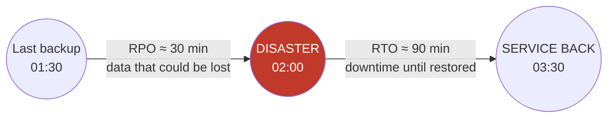
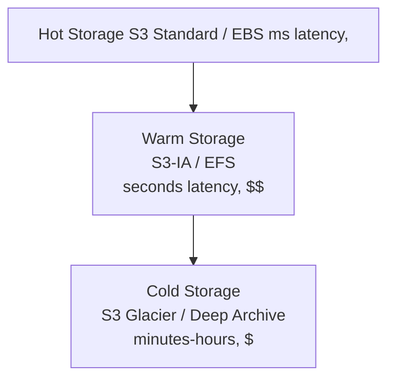
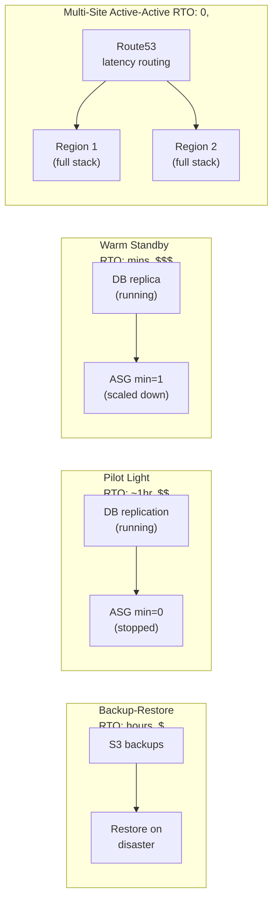
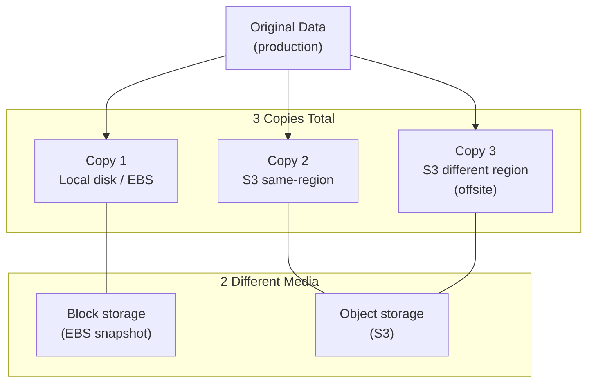

# Backup and Disaster Recovery

Backups protect against data loss; disaster recovery protects against downtime — related concerns, but not the same axis, and most real incidents test both at once. This guide covers the trade-off between them, concrete backup strategies and storage tiers, then the actual tooling: Kubernetes/etcd, databases, AWS-level DR patterns, and how to prove any of it actually works before you need it.

<div class="quiz-progress" data-quiz-progress>
  <span class="quiz-progress-label">0/0 checks</span>
  <span class="quiz-progress-bar"><span class="quiz-progress-fill"></span></span>
</div>

---

## 1. RTO vs RPO

- **RPO** (Recovery Point Objective): max acceptable data loss — how old can the restored data be?
- **RTO** (Recovery Time Objective): max acceptable downtime — how long until service is back?

```mermaid
gantt
    title RTO / RPO Timeline
    dateFormat HH:mm
    axisFormat %H:%M

    section Timeline
    Normal operation     : done, t1, 00:00, 02:00
    Disaster occurs      : crit, disaster, 02:00, 02:01
    Last backup          : milestone, backup, 01:30, 0m
    Detection + response : active, t2, 02:01, 02:30
    Restore in progress  : t3, 02:30, 03:30
    Service restored     : milestone, restored, 03:30, 0m
```





Tighten RPO → more frequent backups or streaming replication.
Tighten RTO → more pre-provisioned infrastructure (warm/hot standby).

<div class="quiz-card">
  <p class="quiz-q">A system backs up every 30 minutes; after a disaster, restoring from that backup takes 90 minutes. Which number is the RPO and which is the RTO?</p>
  <button class="quiz-reveal">Reveal answer</button>
  <div class="quiz-a" hidden>The 30 minutes is RPO &mdash; the maximum data you could lose, set by how old the last backup is. The 90 minutes is RTO &mdash; how long the restore itself takes before service is back. They're independent knobs: tightening RPO means backing up more often (or streaming replication), tightening RTO means pre-provisioning more infrastructure &mdash; doing one doesn't automatically improve the other.</div>
</div>

---

## 2. Backup Strategies

| Strategy | What | Pros | Cons |
|---|---|---|---|
| **Full** | Copy everything | Simple restore | Slow, large |
| **Incremental** | Changes since last backup | Fast, small | Restore = full + all increments |
| **Differential** | Changes since last full | Restore = full + one diff | Grows over time |

### Storage Pyramid



**Policy**: keep last 7 daily backups hot, 4 weekly warm, 12 monthly cold.

<div class="quiz-card">
  <p class="quiz-q">You take a full backup on Sunday, then run an incremental strategy the rest of the week. Thursday's data gets corrupted. What do you need to restore it?</p>
  <button class="quiz-reveal">Reveal answer</button>
  <div class="quiz-a" hidden>The full Sunday backup, plus every incremental taken since then (Mon, Tue, Wed, Thu), applied in order. That's the tradeoff of incremental backups &mdash; fast and small individually, but restore means replaying the whole chain. A differential strategy would only need the full backup plus Thursday's single diff.</div>
</div>

---

## 3. Kubernetes Backup with Velero

Velero backs up K8s resources (YAML manifests) + persistent volume snapshots.

```bash
# install
velero install \
  --provider aws \
  --plugins velero/velero-plugin-for-aws:v1.8.0 \
  --bucket my-velero-backups \
  --backup-location-config region=us-east-1 \
  --snapshot-location-config region=us-east-1 \
  --secret-file ./credentials-velero

# backup a namespace
velero backup create prod-backup --include-namespaces production

# schedule daily backups
velero schedule create daily-prod \
  --schedule="0 2 * * *" \
  --include-namespaces production \
  --ttl 720h     # 30 days retention

# restore
velero restore create --from-backup prod-backup
```

The lifecycle those commands cover, end to end:

<div class="stepper">
  <div class="stepper-panels">
    <div class="stepper-panel active">
      <strong>1. Install.</strong> The Velero server and its CRDs go into the cluster, pointed at a bucket via a cloud-provider plugin.
    </div>
    <div class="stepper-panel">
      <strong>2. Schedule.</strong> A <code>velero schedule create</code> cron rule takes unattended backups (e.g. daily at 2am) with a retention TTL.
    </div>
    <div class="stepper-panel">
      <strong>3. Backup runs.</strong> Velero snapshots the namespace's resource manifests and triggers a volume snapshot for every PV in scope, uploading both to the configured bucket.
    </div>
    <div class="stepper-panel">
      <strong>4. Disaster.</strong> The namespace &mdash; or the whole cluster &mdash; is lost: deleted, corrupted, or gone entirely.
    </div>
    <div class="stepper-panel">
      <strong>5. Restore.</strong> <code>velero restore create --from-backup</code> recreates the resources from the stored manifests and re-provisions volumes from the snapshots.
    </div>
  </div>
  <div class="stepper-controls">
    <button class="stepper-prev">← Prev</button>
    <span class="stepper-dots"></span>
    <span class="stepper-label"></span>
    <button class="stepper-next">Next →</button>
  </div>
</div>

### etcd backup (control plane)

```bash
# backup
ETCDCTL_API=3 etcdctl snapshot save /backup/etcd-$(date +%F).db \
  --endpoints=https://127.0.0.1:2379 \
  --cacert=/etc/kubernetes/pki/etcd/ca.crt \
  --cert=/etc/kubernetes/pki/etcd/server.crt \
  --key=/etc/kubernetes/pki/etcd/server.key

# verify snapshot
etcdctl snapshot status /backup/etcd-2025-01-01.db

# restore (run on all etcd nodes, then restart etcd)
etcdctl snapshot restore /backup/etcd-2025-01-01.db \
  --data-dir /var/lib/etcd-restored
```

<div class="stepper">
  <div class="stepper-panels">
    <div class="stepper-panel active">
      <strong>1. Snapshot.</strong> <code>etcdctl snapshot save</code> writes a point-in-time copy of etcd's entire key space &mdash; every Kubernetes object definition lives here, not just what Velero captures.
    </div>
    <div class="stepper-panel">
      <strong>2. Verify.</strong> <code>etcdctl snapshot status</code> confirms the snapshot file is actually valid before you trust it for a real restore.
    </div>
    <div class="stepper-panel">
      <strong>3. Restore.</strong> <code>etcdctl snapshot restore</code> runs on <em>every</em> etcd node, each writing into a fresh data directory.
    </div>
    <div class="stepper-panel">
      <strong>4. Restart etcd.</strong> Point each node's etcd process at its restored data directory and restart &mdash; only then does the control plane come back with the recovered state.
    </div>
  </div>
  <div class="stepper-controls">
    <button class="stepper-prev">← Prev</button>
    <span class="stepper-dots"></span>
    <span class="stepper-label"></span>
    <button class="stepper-next">Next →</button>
  </div>
</div>

<div class="quiz-card">
  <p class="quiz-q">You've been taking regular Velero backups of your production namespace. Are you also covered if etcd itself is lost?</p>
  <button class="quiz-reveal">Reveal answer</button>
  <div class="quiz-a" hidden>No. Velero backs up Kubernetes resource manifests and persistent volume snapshots &mdash; it never touches etcd's own storage. etcd is the control plane's data store and needs its own separate snapshot process (<code>etcdctl snapshot save</code>), taken and verified independently.</div>
</div>

---

## 4. Database Backup

### PostgreSQL

<div class="toggle-switch">
  <div class="toggle-buttons">
    <button data-toggle-opt="logical" class="active">Logical (pg_dump)</button>
    <button data-toggle-opt="physical">Physical (pg_basebackup)</button>
  </div>
  <div class="toggle-panel active" data-toggle-panel="logical">
    <code>pg_dump</code> exports data as a portable, SQL-reconstructable dump &mdash; works across Postgres versions and even other systems, but slower to take and slower to restore since it's replaying operations, not copying bytes.
  </div>
  <div class="toggle-panel" data-toggle-panel="physical">
    <code>pg_basebackup</code> copies the actual data files at the byte level &mdash; fast to take and fast to restore. With <code>-R</code> it also writes what's needed to stand the copy up as a replica or a PITR base. Not portable across major Postgres versions the way a logical dump is.
  </div>
</div>

```bash
# logical backup (portable, slow)
pg_dump -Fc mydb > mydb_$(date +%F).dump

# restore
pg_restore -d mydb mydb_2025-01-01.dump

# full cluster backup (binary, fast)
pg_basebackup -D /backup/pgbase -Ft -z -P \
  -R   # write recovery.conf for replica/PITR

# WAL archiving to S3 (in postgresql.conf)
archive_mode = on
archive_command = 'aws s3 cp %p s3://my-wal-bucket/wal/%f'
```

### Point-in-Time Recovery (PITR)

<div class="stepper">
  <div class="stepper-panels">
    <div class="stepper-panel active">
      <strong>1. Base backup.</strong> A full physical backup (<code>pg_basebackup</code>) is taken periodically &mdash; the fixed point PITR replays forward from.
    </div>
    <div class="stepper-panel">
      <strong>2. Continuous WAL archiving.</strong> Every WAL segment is shipped to S3 as it's written (<code>archive_command</code>) &mdash; this is what lets RPO shrink to seconds instead of "since the last base backup."
    </div>
    <div class="stepper-panel">
      <strong>3. Disaster.</strong> The database is lost or corrupted at some point after the last base backup.
    </div>
    <div class="stepper-panel">
      <strong>4. Restore + replay.</strong> Restore the base backup, then replay archived WAL forward up to <code>recovery_target_time</code> &mdash; landing at the moment just before the corruption, not at the last base backup.
    </div>
  </div>
  <div class="stepper-controls">
    <button class="stepper-prev">← Prev</button>
    <span class="stepper-dots"></span>
    <span class="stepper-label"></span>
    <button class="stepper-next">Next →</button>
  </div>
</div>

```bash
# restore base backup, then replay WAL up to target time
recovery_target_time = '2025-01-15 14:30:00'
restore_command = 'aws s3 cp s3://my-wal-bucket/wal/%f %p'
```

PITR gives RPO = seconds (limited only by WAL archive frequency).

<div class="quiz-card">
  <p class="quiz-q">Why does PITR give a much tighter RPO than just restoring from the last full/base backup?</p>
  <button class="quiz-reveal">Reveal answer</button>
  <div class="quiz-a" hidden>Because WAL is archived continuously, not just at backup time. Restoring replays every archived WAL segment forward from the base backup up to the target time, so the recovery point is only as stale as the last archived WAL segment (seconds) &mdash; not as stale as the last full backup (hours or a day).</div>
</div>

---

## 5. AWS DR Patterns



| Pattern | RTO | RPO | Cost | When to use |
|---|---|---|---|---|
| Backup-restore | Hours | Hours | $ | Dev/test, low criticality |
| Pilot light | ~1 hour | Minutes | $$ | Core systems, cost-sensitive |
| Warm standby | Minutes | Seconds | $$$ | Business-critical |
| Active-active | Near zero | Near zero | $$$$ | Mission-critical |

<div class="toggle-switch">
  <div class="toggle-buttons">
    <button data-toggle-opt="br" class="active">Backup-restore</button>
    <button data-toggle-opt="pl">Pilot light</button>
    <button data-toggle-opt="ws">Warm standby</button>
    <button data-toggle-opt="aa" class="state-ok">Active-active</button>
  </div>
  <div class="toggle-panel active" data-toggle-panel="br">
    Nothing runs until disaster strikes &mdash; just backups sitting in S3. Cheapest option, but RTO is hours: you're standing up infrastructure from scratch and restoring data before anything can serve traffic. Fine for dev/test or low-criticality systems.
  </div>
  <div class="toggle-panel" data-toggle-panel="pl">
    The database keeps replicating in the background, but compute sits at zero (ASG min=0) until needed. RTO drops to about an hour &mdash; mostly the time to scale the ASG up &mdash; for a modest cost bump over backup-restore.
  </div>
  <div class="toggle-panel" data-toggle-panel="ws">
    A scaled-down but live copy of the full stack runs continuously (ASG min=1). Failover is mostly a scale-up, not a stand-up, so RTO drops to minutes. Costs more because real compute runs all the time, even underprovisioned.
  </div>
  <div class="toggle-panel" data-toggle-panel="aa">
    Both regions run the full stack simultaneously, with Route53 latency-based routing splitting traffic between them. If one region dies, the other is already serving live traffic, so RTO is effectively zero. Most expensive by far &mdash; you're running, and paying for, two full production environments at once.
  </div>
</div>

<div class="quiz-card">
  <p class="quiz-q">Pilot light and warm standby both keep the database replicating continuously. What's the actual difference between them?</p>
  <button class="quiz-reveal">Reveal answer</button>
  <div class="quiz-a" hidden>Compute. Pilot light keeps the ASG at zero instances &mdash; failover means scaling up from nothing, which is why its RTO (~1 hour) is slower than warm standby's minutes. Warm standby keeps a scaled-down copy of the compute layer running all the time (ASG min=1), so failover is a scale-up of an already-running stack, not a cold start.</div>
</div>

---

## 6. Backup Testing

**An untested backup is not a backup.**

```bash
# automated restore test in CI (runs weekly)
steps:
  - name: Restore DB from latest backup
    run: |
      pg_restore -d test_restore $LATEST_BACKUP
      psql -d test_restore -c "SELECT COUNT(*) FROM orders"

  - name: Verify Velero restore
    run: |
      velero restore create ci-test --from-backup latest-prod
      kubectl wait --for=condition=Ready pod -l app=payment -n restored --timeout=300s
      curl -f http://payment.restored/healthz
```

**Restore drill checklist:**
- [ ] Restore to isolated environment (never test on prod backup → prod)
- [ ] Verify row counts / checksums match pre-backup
- [ ] Measure actual RTO (time restore took)
- [ ] Document gaps vs target RTO/RPO

<div class="quiz-card">
  <p class="quiz-q">You restore last night's backup straight onto the production database to "test" it. What's wrong with this drill?</p>
  <button class="quiz-reveal">Reveal answer</button>
  <div class="quiz-a" hidden>It should go to an isolated environment, never onto prod. Restoring onto production risks overwriting real data, and it doesn't actually validate that a restore works cleanly against a fresh target &mdash; which is the scenario a real incident puts you in. You want to rehearse a disaster in isolation, not create one.</div>
</div>

---

## 7. The 3-2-1 Rule



- **3** copies of data
- **2** different storage media types
- **1** copy offsite (different region / cloud)

In AWS: EBS snapshot (copy 1) + S3 same-region (copy 2) + S3 cross-region replication (copy 3).

<div class="quiz-card">
  <p class="quiz-q">You have 3 EBS snapshots of your production volume, all stored in the same AWS region. Does this satisfy the 3-2-1 rule?</p>
  <button class="quiz-reveal">Reveal answer</button>
  <div class="quiz-a" hidden>No. That's 3 copies, but only 1 storage medium (all EBS snapshots) and 0 copies offsite &mdash; it fails both the "2 different media" and "1 copy offsite" requirements. You'd need at least one copy on different media (e.g. S3) and at least one copy in a different region.</div>
</div>
