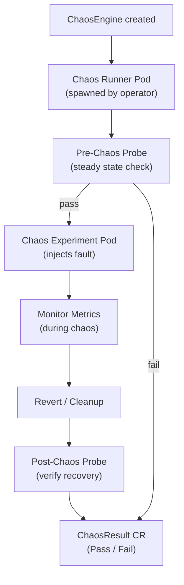
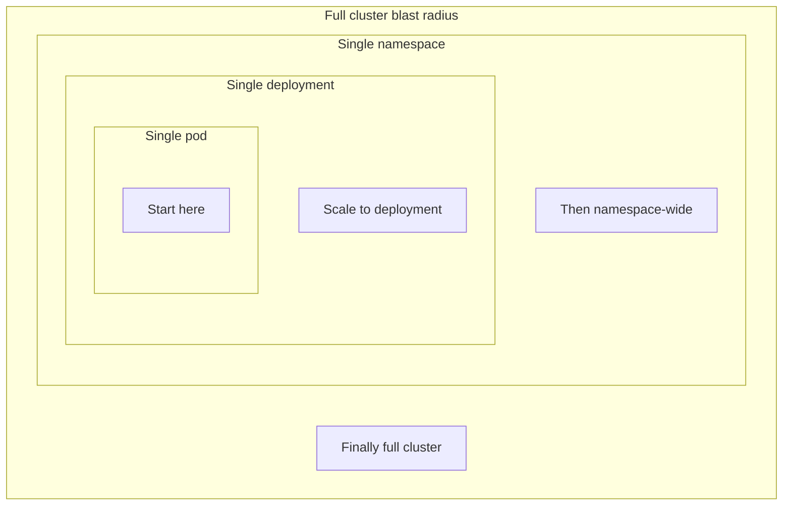

# Chaos Engineering

Deliberately injecting failure into a system to find weaknesses before an incident does — turning "we think it's resilient" into "we tested it, and here's what broke." This walks through the principles, the tooling (Litmus, Chaos Mesh, AWS FIS), and what a real game day looks like end to end.

<div class="quiz-progress" data-quiz-progress>
  <span class="quiz-progress-label">0/0 checks</span>
  <span class="quiz-progress-bar"><span class="quiz-progress-fill"></span></span>
</div>

---

## 1. Principles

| Principle | Description |
|---|---|
| **Steady state** | Define normal behavior (p99 latency, error rate, RPS) |
| **Hypothesis** | "If X fails, the system stays healthy" |
| **Blast radius** | Limit scope — start small, expand gradually |
| **Run in prod** | Staging findings differ; prod is ground truth |
| **Learn from failures** | Post-mortem every experiment, fix weaknesses |

Chaos engineering is **not** breaking things randomly — it's controlled experiments to build confidence.

<div class="quiz-card">
  <p class="quiz-q">Chaos engineering means randomly turning things off to see what breaks. True or false?</p>
  <button class="quiz-reveal">Reveal answer</button>
  <div class="quiz-a" hidden>False. Every experiment starts from a specific hypothesis ("if X fails, the system stays healthy"), runs against a deliberately limited and gradually expanding blast radius, and ends in a post-mortem regardless of outcome. Controlled experiments to build confidence — not undirected destruction.</div>
</div>

---

## 2. Tools

| Tool | Target | Notes |
|---|---|---|
| Chaos Monkey | EC2 instances | Netflix original, terminates random instances |
| Litmus Chaos | Kubernetes | CNCF project, CRD-driven, huge experiment library |
| Chaos Mesh | Kubernetes | CNCF, GUI + CRDs, fine-grained network faults |
| k6 | HTTP load + chaos | Combine load test with failure scenarios |
| AWS FIS | AWS resources | Fault Injection Simulator, native AWS service |

<div class="quiz-card">
  <p class="quiz-q">Chaos Monkey is the original chaos engineering tool — can you point it at a Kubernetes Deployment?</p>
  <button class="quiz-reveal">Reveal answer</button>
  <div class="quiz-a" hidden>No. Chaos Monkey targets EC2 instances — it terminates random instances, full stop. For Kubernetes you'd reach for Litmus Chaos or Chaos Mesh instead, both CNCF projects built around CRDs.</div>
</div>

---

## 3. Litmus CRDs

### ChaosEngine — runs an experiment on a target

```yaml
apiVersion: litmuschaos.io/v1alpha1
kind: ChaosEngine
metadata:
  name: pod-kill-engine
  namespace: default
spec:
  appinfo:
    appns: default
    applabel: "app=payment"
    appkind: deployment
  engineState: active
  chaosServiceAccount: litmus-admin
  experiments:
  - name: pod-delete
    spec:
      components:
        env:
        - name: TOTAL_CHAOS_DURATION
          value: "60"          # seconds
        - name: CHAOS_INTERVAL
          value: "10"
        - name: FORCE
          value: "false"
```

### Litmus Execution Flow



Step through a single run:

<div class="stepper">
  <div class="stepper-panels">
    <div class="stepper-panel active">
      <strong>1. ChaosEngine created.</strong> You apply the CR above; the Litmus operator picks it up.
    </div>
    <div class="stepper-panel">
      <strong>2. Chaos Runner Pod spawned.</strong> The operator spawns a runner pod to orchestrate this experiment run.
    </div>
    <div class="stepper-panel">
      <strong>3. Pre-Chaos Probe.</strong> Steady state gets checked before anything is injected. If it fails here, the run jumps straight to <code>ChaosResult</code> marked Fail &mdash; the experiment pod never starts and no fault gets injected at all.
    </div>
    <div class="stepper-panel">
      <strong>4. Chaos Experiment Pod injects fault.</strong> Only reached if the pre-chaos probe passed.
    </div>
    <div class="stepper-panel">
      <strong>5. Monitor Metrics.</strong> Metrics are watched for the duration of the chaos window.
    </div>
    <div class="stepper-panel">
      <strong>6. Revert / Cleanup.</strong> The injected fault is reverted.
    </div>
    <div class="stepper-panel">
      <strong>7. Post-Chaos Probe.</strong> Recovery gets verified.
    </div>
    <div class="stepper-panel">
      <strong>8. ChaosResult CR.</strong> Pass or Fail is recorded for the run.
    </div>
  </div>
  <div class="stepper-controls">
    <button class="stepper-prev">← Prev</button>
    <span class="stepper-dots"></span>
    <span class="stepper-label"></span>
    <button class="stepper-next">Next →</button>
  </div>
</div>

<div class="quiz-card">
  <p class="quiz-q">In the Litmus execution flow, what happens if the pre-chaos probe fails?</p>
  <button class="quiz-reveal">Reveal answer</button>
  <div class="quiz-a" hidden>The run skips straight to the ChaosResult CR marked Fail. The chaos experiment pod never runs, so no fault gets injected — Litmus won't chaos-test a system that wasn't even at steady state to begin with.</div>
</div>

---

## 4. Experiments

| Experiment | What it tests |
|---|---|
| **Pod kill** | Pod restarts, K8s self-healing |
| **Network partition** | Service mesh fallback, timeouts |
| **CPU hog** | Throttling, resource limits |
| **Memory hog** | OOMKilled handling, limits |
| **Node drain** | Pod disruption budgets, rescheduling |
| **Disk fill** | Ephemeral storage limits, log rotation |
| **Network latency** | Circuit breakers, timeout configs |
| **DNS failure** | Service discovery fallback |

<div class="quiz-card">
  <p class="quiz-q">Pod kill and node drain both remove running pods. What's the difference in what each one actually tests?</p>
  <button class="quiz-reveal">Reveal answer</button>
  <div class="quiz-a" hidden>Pod kill tests basic pod restarts and Kubernetes self-healing. Node drain removes an entire node's worth of pods at once, which is what actually exercises pod disruption budgets and rescheduling behavior — a single pod kill doesn't force the scheduler to deal with a PDB the way an eviction wave does.</div>
</div>

---

## 5. Game Days

Structured chaos sessions:

1. **Define scope**: which service, which experiment, what blast radius
2. **Set steady state**: agree on SLIs to watch (e.g., error rate < 1%)
3. **Hypothesis**: "payment service continues serving after one pod kill"
4. **Run experiment**: start small (1 replica), observe
5. **Rollback plan**: know how to stop the experiment (`kubectl delete chaosengine`)
6. **Post-mortem**: document findings, create follow-up tickets

Step through a run:

<div class="stepper">
  <div class="stepper-panels">
    <div class="stepper-panel active">
      <strong>1. Define scope.</strong> Which service, which experiment, what blast radius.
    </div>
    <div class="stepper-panel">
      <strong>2. Set steady state.</strong> Agree on the SLIs to watch (e.g., error rate &lt; 1%).
    </div>
    <div class="stepper-panel">
      <strong>3. Hypothesis.</strong> "Payment service continues serving after one pod kill."
    </div>
    <div class="stepper-panel">
      <strong>4. Run experiment.</strong> Start small (1 replica), observe.
    </div>
    <div class="stepper-panel">
      <strong>5. Rollback plan.</strong> Know how to stop the experiment (<code>kubectl delete chaosengine</code>) &mdash; decided before the experiment starts, not improvised mid-run.
    </div>
    <div class="stepper-panel">
      <strong>6. Post-mortem.</strong> Document findings, create follow-up tickets.
    </div>
  </div>
  <div class="stepper-controls">
    <button class="stepper-prev">← Prev</button>
    <span class="stepper-dots"></span>
    <span class="stepper-label"></span>
    <button class="stepper-next">Next →</button>
  </div>
</div>

<div class="quiz-card">
  <p class="quiz-q">Why does a game day need a rollback plan defined up front, if the experiment is supposed to be safe?</p>
  <button class="quiz-reveal">Reveal answer</button>
  <div class="quiz-a" hidden>Because "supposed to be safe" is exactly the hypothesis being tested, not a guarantee. The rollback plan is the predefined way to stop the experiment fast if reality disagrees with the hypothesis — deciding it before you start beats improvising a stop mid-incident.</div>
</div>

---

## 6. Observability During Chaos

Watch these signals during any experiment:

```
# Error rates
sum(rate(http_requests_total{status=~"5.."}[1m])) / sum(rate(http_requests_total[1m]))

# Latency p99
histogram_quantile(0.99, rate(http_request_duration_seconds_bucket[1m]))

# Pod restarts
kube_pod_container_status_restarts_total

# CPU throttling
container_cpu_cfs_throttled_seconds_total

# HPA scaling events
kubectl get events --field-selector reason=SuccessfulRescale
```

Chaos + load test together: run k6 traffic while injecting faults to see real user impact.

<div class="quiz-card">
  <p class="quiz-q">Why run k6 load traffic at the same time as the fault, instead of just watching metrics on an otherwise idle system?</p>
  <button class="quiz-reveal">Reveal answer</button>
  <div class="quiz-a" hidden>An idle system won't show you what a real user experiences. Load plus chaos together surfaces the actual user-facing impact — error rates and p99 latency under realistic traffic — instead of just confirming the fault happened.</div>
</div>

---

## 7. Failure Injection Patterns

### Blast Radius Diagram



Expand the blast radius one stage at a time — don't jump straight to cluster-wide:

<div class="stepper">
  <div class="stepper-panels">
    <div class="stepper-panel active">
      <strong>1. Single pod.</strong> Start here. Smallest possible blast radius.
    </div>
    <div class="stepper-panel">
      <strong>2. Scale to deployment.</strong> Once the single-pod result is understood, widen to the whole deployment.
    </div>
    <div class="stepper-panel">
      <strong>3. Then namespace-wide.</strong> Widen further to every deployment in the namespace.
    </div>
    <div class="stepper-panel">
      <strong>4. Finally full cluster.</strong> Only once the narrower blast radii are understood does the experiment expand to the full cluster.
    </div>
  </div>
  <div class="stepper-controls">
    <button class="stepper-prev">← Prev</button>
    <span class="stepper-dots"></span>
    <span class="stepper-label"></span>
    <button class="stepper-next">Next →</button>
  </div>
</div>

### Patterns

| Pattern | Implementation |
|---|---|
| **Latency injection** | `tc netem delay 200ms` on pod network interface |
| **Error rate injection** | Return 500 for X% of requests (Envoy fault injection) |
| **Dependency kill** | Kill downstream service, verify circuit breaker opens |
| **Packet loss** | `tc netem loss 20%` to test retries |
| **DNS failure** | Block CoreDNS or return NXDOMAIN |

### Envoy fault injection (Istio)

```yaml
apiVersion: networking.istio.io/v1alpha3
kind: VirtualService
metadata:
  name: payment-fault
spec:
  hosts: [payment]
  http:
  - fault:
      delay:
        percentage:
          value: 10.0        # 10% of requests
        fixedDelay: 500ms
      abort:
        percentage:
          value: 5.0         # 5% return 500
        httpStatus: 500
    route:
    - destination:
        host: payment
```

<div class="quiz-card">
  <p class="quiz-q">In the Envoy fault injection example, what's the difference between the delay fault and the abort fault?</p>
  <button class="quiz-reveal">Reveal answer</button>
  <div class="quiz-a" hidden>Delay injects added latency (500ms) into 10% of requests without failing them — those requests still succeed, just slower. Abort injects an outright failure (HTTP 500) into 5% of requests instead. They're independent percentages applied to the same route, testing timeout handling and error handling respectively.</div>
</div>
