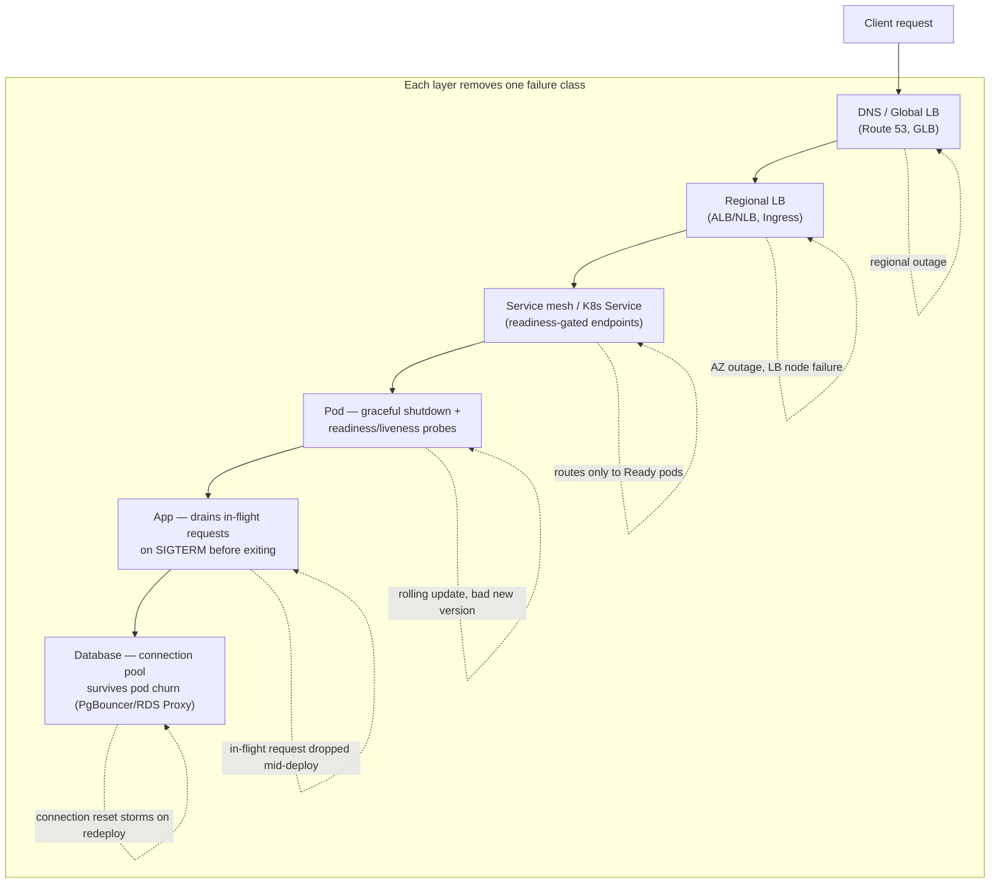
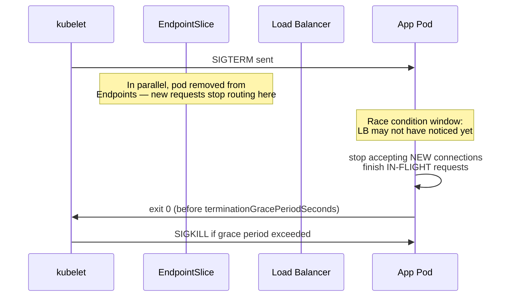
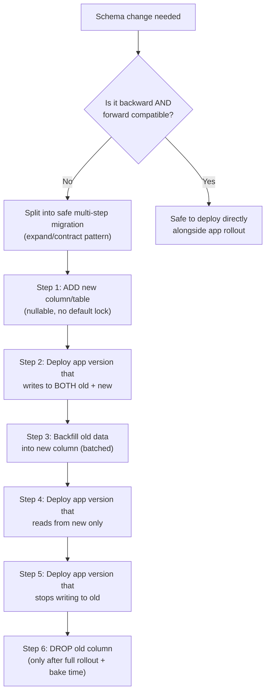
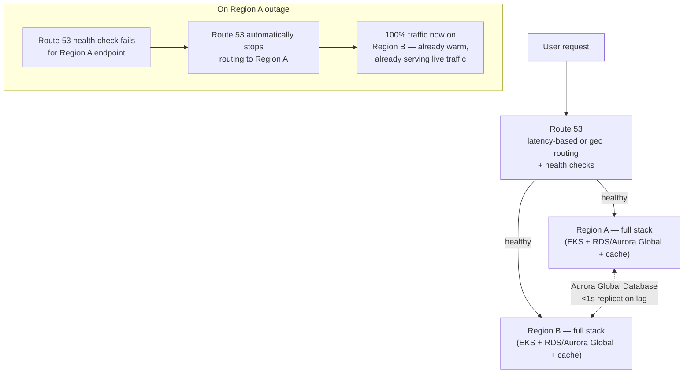
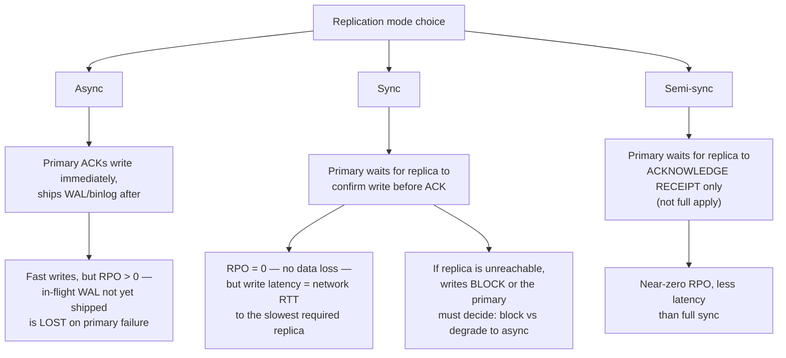
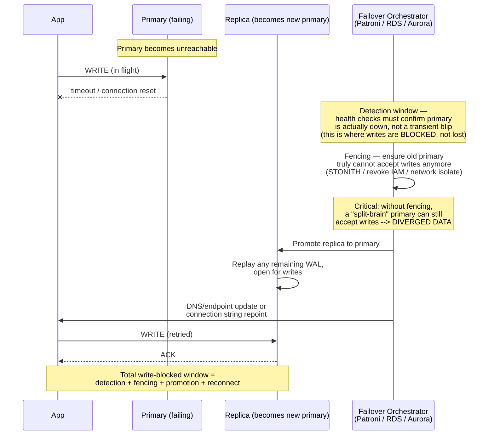

# Disaster Recovery & Zero-Downtime Deployment for Mission-Critical Services

Companion to [backup-dr.md](./backup-dr.md) (RTO/RPO, Velero, etcd/DB backup, 3-2-1 rule) and [cicd/argo-rollouts.md](../cicd/argo-rollouts.md) (canary/blue-green mechanics). This file focuses specifically on **mission-critical services that must never go down** — combining deployment-time zero-downtime techniques with infrastructure-level DR so that neither a bad deploy nor a regional outage takes the service offline.

"Zero downtime in any way" is really two separate problems that get conflated:
1. **Planned change zero-downtime** — deployments, config changes, DB migrations, node maintenance. You control the timing.
2. **Unplanned failure zero-downtime** — AZ failure, region failure, dependency outage. You don't control the timing — only how fast and gracefully you fail over.

Both need to be solved together, because a system with a perfect zero-downtime deploy pipeline still goes fully down if it has no DR plan for a regional outage, and a system with multi-region DR still has visible downtime on every release if deploys aren't zero-downtime.

---

## 1. Zero-Downtime Deployment — the Full Stack

No single technique gives zero downtime. It's layered — each layer removes one class of visible failure.



### 1.1 Application layer — graceful shutdown is non-negotiable

Every zero-downtime deployment strategy (rolling, canary, blue-green) fails at the pod level if the app doesn't handle `SIGTERM` correctly. This is the most common root cause of "we did a rolling update and still saw 500s."



```yaml
spec:
  terminationGracePeriodSeconds: 45   # must exceed preStop + longest in-flight request + buffer
  containers:
  - name: app
    lifecycle:
      preStop:
        exec:
          # give the LB/endpoint-removal propagation time BEFORE the app stops accepting connections —
          # this closes the race between "pod removed from Endpoints" and "LB stops sending traffic"
          command: ["/bin/sh", "-c", "sleep 5"]
    readinessProbe:
      httpGet: {path: /readyz, port: 8080}
      periodSeconds: 5
      failureThreshold: 2
    livenessProbe:
      httpGet: {path: /livez, port: 8080}
      initialDelaySeconds: 15
```

**Why the `preStop sleep` matters:** Kubernetes removes the pod from `Endpoints`/`EndpointSlice` and sends `SIGTERM` to the container **at the same time** — not sequentially. If your LB/kube-proxy/mesh hasn't propagated the removal yet, a new request can still land on a pod that already closed its listener. The `preStop sleep` delays SIGTERM delivery just long enough for endpoint removal to propagate everywhere, closing this race window. This single setting is responsible for a large fraction of "zero-downtime deploy still dropped a few requests" incidents.

```go
// Go example: handle SIGTERM, stop accepting new connections, drain in-flight
srv := &http.Server{Addr: ":8080"}
go srv.ListenAndServe()

sigCh := make(chan os.Signal, 1)
signal.Notify(sigCh, syscall.SIGTERM)
<-sigCh

ctx, cancel := context.WithTimeout(context.Background(), 30*time.Second)
defer cancel()
srv.Shutdown(ctx) // stops accepting new conns, waits for in-flight to finish
```

**Prevention:** `terminationGracePeriodSeconds` must be greater than `preStop duration + longest expected in-flight request duration + buffer` — if it's too short, Kubernetes SIGKILLs the process mid-drain, which is exactly the dropped-request failure you were trying to avoid.

### 1.2 Deployment strategy layer — pick by blast radius and rollback speed needed

| Strategy | Downtime | Blast radius on bad deploy | Rollback speed | Best for |
|---|---|---|---|---|
| Recreate | Full downtime | 100% | N/A | Never use for mission-critical |
| RollingUpdate (K8s native) | Zero (if probes correct) | Up to `maxUnavailable`% during rollout | Re-run rollout with old image | Stateless, non-critical-path services |
| Canary (Argo Rollouts) | Zero | 1-5% initially, capped by analysis gates | Fast — shift weight back to stable | Mission-critical, high-traffic, gradual validation |
| Blue-Green | Zero | 0% until full cutover (then 100% instantly) | Instant — flip Service selector back | Mission-critical, needs pre-production validation with real infra, DB-migration-sensitive |

For **mission-critical** services specifically, plain `RollingUpdate` is usually not enough on its own — it has no automated rollback trigger and no traffic-level validation before more replicas get the new version. Canary or blue-green (via Argo Rollouts, detailed in [cicd/argo-rollouts.md](../cicd/argo-rollouts.md)) adds the two things RollingUpdate lacks:

```yaml
# Canary with automated abort on error-rate regression — the mission-critical pattern
strategy:
  canary:
    canaryService: my-app-canary
    stableService: my-app-stable
    steps:
    - setWeight: 1                     # smallest possible blast radius first
    - pause: {duration: 2m}
    - analysis:
        templates: [{templateName: success-rate}]
    - setWeight: 10
    - pause: {duration: 5m}
    - analysis:
        templates: [{templateName: success-rate}]
    - setWeight: 50
    - pause: {duration: 10m}
    - setWeight: 100
```

With `failureLimit: 3` on the AnalysisTemplate (shown in argo-rollouts.md), a regression at 1% traffic aborts automatically — 99% of users never see the bad version, and no human had to notice and react.

### 1.3 Database migration layer — the layer most zero-downtime plans forget

Even a perfect blue-green app deployment causes downtime if the DB migration underneath it isn't backward-compatible, because **both old and new app versions run simultaneously** during any rolling/canary/blue-green transition — if the schema change breaks the old version, you have downtime for the duration of the rollout regardless of how good the deployment strategy is.



**Expand/contract pattern rules for mission-critical zero-downtime migrations:**
- Never rename or drop a column/table in the same deploy that removes app code referencing it — always add-then-migrate-then-remove across multiple independent deploys.
- Avoid migrations that take a long-held lock (e.g. `ALTER TABLE ... ADD COLUMN NOT NULL DEFAULT` on Postgres pre-11 rewrites the whole table under lock). Use `ADD COLUMN` nullable, backfill in batches, then add the `NOT NULL` constraint with `NOT VALID` + `VALIDATE CONSTRAINT` (Postgres) to avoid a blocking table scan.
- Run migrations as a separate step **before** the app rollout starts, and make sure they're idempotent / safe to run against both old and new schema simultaneously — never bundle migration + app deploy into one atomic step for a mission-critical path.

### 1.4 Database connection layer — surviving pod churn without connection storms

Rolling/canary/blue-green deploys churn pods, and every pod termination is a burst of connection resets against the DB. At scale this alone can cause latency spikes even though "the deployment succeeded."

```bash
# Symptom: deploy succeeds, but DB connection errors spike for ~30s during rollout
# Fix: pool at the proxy layer so app pod churn doesn't equal DB connection churn
```

- **RDS Proxy / PgBouncer** in front of the database — the pool of actual DB connections stays stable even as application pods scale up/down/restart; pods connect to the local proxy instead of opening/closing raw DB connections on every restart.
- Set `preStop` to close the app's DB pool gracefully before the process exits (paired with the general `preStop sleep` above) so connections are returned to the pool cleanly instead of being hard-reset.

---

## 2. Disaster Recovery for Mission-Critical Services — Beyond Backup-Restore

[backup-dr.md](./backup-dr.md) covers the 4 DR patterns (backup-restore, pilot light, warm standby, active-active) and their RTO/RPO/cost tradeoffs. For **mission-critical** services specifically, only **warm standby** or **active-active** are usually acceptable — backup-restore and pilot light both imply minutes-to-hours of downtime, which contradicts "zero downtime in any way."

### 2.1 Active-Active Multi-Region — the actual zero-downtime DR pattern



The critical property of active-active vs warm standby: **Region B is already serving live production traffic before the failure**, not activated after. This eliminates the entire class of "standby environment doesn't actually work when you need it" risk (config drift, untested failover paths, stale deployment) because it's continuously validated by real traffic.

```bash
# Route 53 health-check-based failover — the mechanism that makes this "zero downtime"
aws route53 create-health-check \
  --caller-reference "$(date +%s)" \
  --health-check-config '{
    "IPAddress": "203.0.113.10",
    "Port": 443,
    "Type": "HTTPS",
    "ResourcePath": "/healthz",
    "RequestInterval": 10,
    "FailureThreshold": 2
  }'

# Latency-based routing record referencing the health check —
# traffic automatically stops going to an unhealthy region within ~20-30s
aws route53 change-resource-record-sets --hosted-zone-id Z123 \
  --change-batch '{
    "Changes": [{
      "Action": "UPSERT",
      "ResourceRecordSet": {
        "Name": "api.example.com",
        "Type": "A",
        "SetIdentifier": "region-a",
        "Region": "us-east-1",
        "HealthCheckId": "<id-from-above>",
        "AliasTarget": {"HostedZoneId": "Z35SXDOTRQ7X7K", "DNSName": "alb-region-a...", "EvaluateTargetHealth": true}
      }
    }]
  }'
```

**Data layer for active-active:** the hard part is never compute (stateless app pods are trivially multi-region) — it's data consistency.

| Data need | Solution | Consistency tradeoff |
|---|---|---|
| Relational, need cross-region reads | Aurora Global Database | ~1s replication lag; writes still go to primary region only (not true multi-write) |
| Need multi-region writes | DynamoDB Global Tables | Last-writer-wins conflict resolution — eventual consistency across regions |
| Need strict consistency across regions | Spanner (GCP) / CockroachDB | Higher write latency (cross-region consensus), but real multi-region strong consistency |
| Cache | Regional Redis/ElastiCache, no cross-region replication | Each region's cache is independent — acceptable for cache, not source of truth |

**Practical middle ground many mission-critical systems actually run:** active-active for **reads** and stateless compute, but a single **write region** (active-passive for the write path) with automated Aurora Global Database failover (typically ~1 minute RTO) for the rare full write-region failure. This is not "true" zero-downtime for writes during the ~1 minute failover window, but it's the realistic tradeoff most teams accept rather than paying for full multi-write conflict resolution complexity.

### 2.2 Kubernetes-level HA within a region — before you even need cross-region failover

Cross-region DR only matters if regional-level HA is already solid. Most "zero downtime" failures are actually AZ-level or node-level, not regional:

```yaml
# Spread pods across AZs so a single AZ failure never takes the whole service down
apiVersion: apps/v1
kind: Deployment
spec:
  replicas: 6
  template:
    spec:
      topologySpreadConstraints:
      - maxSkew: 1
        topologyKey: topology.kubernetes.io/zone
        whenUnsatisfiable: DoNotSchedule   # hard requirement for mission-critical
        labelSelector:
          matchLabels: {app: my-app}
---
# PodDisruptionBudget — protects against voluntary disruption (node drains, cluster upgrades)
# taking out too many replicas AT THE SAME TIME as a deploy or AZ event
apiVersion: policy/v1
kind: PodDisruptionBudget
metadata:
  name: my-app-pdb
spec:
  minAvailable: 4          # out of 6 — tolerates losing at most 2 at once
  selector:
    matchLabels: {app: my-app}
```

`whenUnsatisfiable: DoNotSchedule` (hard) vs `ScheduleAnyway` (soft) is the key decision for mission-critical: hard guarantees the spread but can leave pods Pending if a zone lacks capacity (combine with Cluster Autoscaler multi-AZ node groups so this isn't a real tradeoff). The PDB ensures that a routine node drain or cluster upgrade never coincides with losing more replicas than the service can tolerate — this is what actually causes "we did routine maintenance and had an incident."

### 2.3 Automated failover, not manual runbooks, for mission-critical RTO

A DR plan that requires a human to notice, decide, and manually execute a runbook has an RTO floor of "however fast your on-call can act" — typically minutes at best, often much worse at 3am. For true zero/near-zero downtime:

- **Aurora Global Database managed planned/unplanned failover** — `aws rds failover-global-cluster` can be triggered automatically by a health-check-driven Lambda/Step Function instead of a human running the CLI command during an incident.
- **Route 53 health checks + `EvaluateTargetHealth`** (shown above) already remove the human from the DNS-level failover path entirely — this is the biggest lever, since DNS/traffic routing is usually the slowest human-mediated step in a manual runbook.
- **Chaos engineering validation** ([chaos-engineering.md](./chaos-engineering.md)) — regularly and automatically kill an AZ or region in a controlled game day to prove the automated failover path actually works, rather than discovering during a real incident that the standby region's IAM roles expired or the AMI is 8 months stale.

### 2.4 Sync vs Async Replication — What It Actually Means for Zero-Downtime DR

Full replication mechanics (physical vs logical, per-database implementation details) live in [databases/replication.md](../databases/replication.md). This section is the DR-specific angle: **which replication mode determines whether you lose data on failover, and which one determines whether writes stall or block while failover is happening.**



**The core DR tradeoff in one line:** async gives you fast writes but a nonzero RPO (you can lose the last few seconds of committed-on-primary-but-not-yet-shipped writes on an unplanned failover); sync gives you RPO=0 but couples your write latency (and availability) to the health of the replica link.

| Mode | RPO | Write latency impact | Failover data loss | Best for |
|---|---|---|---|---|
| Async | Seconds (lag-dependent) | None — fastest | Possible — unshipped WAL/binlog lost | Read replicas, cross-region DR replicas, most default setups |
| Semi-sync | Near-zero | Small — one RTT to nearest replica | Rare — only if primary AND ack'd replica both fail simultaneously | MySQL HA within a region |
| Sync (quorum) | Zero | RTT to slowest required replica in quorum | None — by definition | Financial/mission-critical writes where losing any committed transaction is unacceptable |

### 2.5 Writes Getting Blocked During Failover — the Mechanism, and How to Tackle It

This is the part that actually causes visible downtime, and it's different for sync vs async setups.



**Why writes block (not silently fail) during failover:** a correctly designed failover system will refuse new writes on the old primary once it detects a problem, and won't accept writes on the new primary until it's fully promoted and caught up — this window is where your application sees connection errors/timeouts on writes. Reads can often continue (from surviving replicas) during this window; it's specifically the **write path** that's unavailable.

**What determines how long the write-blocked window lasts:**

| Phase | What happens | Typical duration | What shortens it |
|---|---|---|---|
| Detection | Health checks confirm primary is actually down | 5-30s | Faster health check interval/threshold — but too fast risks false-positive failover on a transient blip |
| Fencing | Guarantee old primary can't accept writes (prevent split-brain) | Seconds | Automated fencing (STONITH, IAM revoke) instead of manual confirmation |
| Promotion | Replica replays remaining WAL, becomes writable | Seconds to ~1 min (Aurora Global ~1 min RTO) | Semi-sync/sync replication (less WAL to replay); keep replica caught up |
| Reconnect | App/connection pool/DNS repoints to new primary | Depends on TTL, pool retry logic | Short DNS TTL, or cluster-endpoint abstraction (Aurora cluster endpoint, Patroni + HAProxy) that doesn't require DNS propagation at all |

**Concrete tactics to tackle write-blocked downtime:**

1. **Use a stable write endpoint that's failover-aware, not raw DNS to an instance.** Aurora's cluster endpoint, Patroni + HAProxy/PgBouncer health-checked backend, or MongoDB's replica-set-aware driver all mean the *application* doesn't need to notice a failover happened at the DNS layer — the abstraction layer redirects writes to whichever node is currently primary. This removes DNS TTL propagation entirely from the write-blocked window.
   ```
   # Patroni + HAProxy pattern: HAProxy health-checks each node's /master endpoint,
   # only routes writes to whichever one currently answers as primary
   backend postgres_write
       option httpchk GET /master
       server pg1 10.0.1.10:5432 check port 8008
       server pg2 10.0.1.11:5432 check port 8008 backup
   ```

2. **Application-level retry with backoff on write failures during the failover window** — instead of surfacing an error to the end user immediately, retry the write for a bounded window (a few seconds) so a fast failover is invisible to the user, and only surface an error if the outage genuinely exceeds your acceptable retry budget.
   ```python
   # Bounded retry — turns a 5-10s failover into a slightly slower request,
   # not a visible error, as long as failover completes within the retry budget
   for attempt in range(5):
       try:
           db.execute(write_query)
           break
       except (ConnectionError, OperationalError):
           time.sleep(2 ** attempt)  # exponential backoff
   else:
       raise  # only surface after exhausting retry budget
   ```

3. **Idempotency keys on writes** so a retried write after a failover doesn't double-apply if the original write actually succeeded on the old primary right before it went down (the classic "did my write commit or not" ambiguity during failover). This is the same idempotency-key pattern from [system-design/api-design.md](../system-design/api-design.md) and [system-design/async-patterns.md](../system-design/async-patterns.md) — apply it specifically to the DB write path for failover safety, not just at the API layer.

4. **Separate read and write paths at the app level** so reads keep serving from replicas during the write-blocked window instead of the whole request failing — for many mission-critical services, "writes paused for 20 seconds but reads still work" is a materially better user experience than a full outage banner, and can often be presented as degraded functionality rather than downtime.

5. **Semi-sync/sync replication specifically to shrink the promotion phase** — the less WAL/binlog the new primary has to replay before it's caught up and writable, the shorter phase 3 (Promotion) is. This is the direct DR payoff of accepting the write-latency cost of sync replication discussed in 2.4.

6. **Practice the failover, don't just configure it** — the same chaos-engineering point from Section 2.3: an untested automated failover can have unexpected fencing failures (split-brain) or promotion bugs that turn a planned 30-second write-blocked window into a much longer real outage. Game-day test the actual failover path, not just the replication config.

**If you do face real downtime despite all of the above** (failover takes longer than expected, fencing fails, promotion errors) — the operational response, not just the design:

```
□ Confirm blast radius first: is it writes-only (reads still up) or full outage?
□ If writes-only: communicate degraded-mode status, don't take reads down too
□ Check for split-brain BEFORE manually promoting anything —
  verify old primary is truly fenced/unreachable, or you risk two writable primaries
□ If automated failover stalled, manual promotion is last resort —
  document the runbook in advance, don't design it live during the incident
□ After recovery: reconcile any writes that landed on the old primary
  after the "official" failover point (only possible if fencing had a gap)
□ Post-incident: feed the actual observed detection+fencing+promotion+reconnect
  times back into your RTO assumptions — most DR RTO numbers are theoretical
  until measured against a real (or drilled) failover
```

---

## 3. Putting It Together — the Mission-Critical Checklist

```
Deployment-time (planned change) zero downtime:
□ terminationGracePeriodSeconds > preStop duration + longest in-flight request + buffer
□ preStop sleep to close the endpoint-removal race window
□ readiness probe checks real dependency health, not just "process is up"
□ Canary or blue-green (not plain RollingUpdate) for the actual critical path
□ Automated analysis gate (Prometheus error-rate) with auto-abort, not manual eyeballing
□ DB migrations follow expand/contract — never same-deploy rename/drop
□ Connection pooling (RDS Proxy/PgBouncer) absorbs pod-churn connection storms
□ PodDisruptionBudget prevents maintenance/autoscaling from breaching minAvailable

Failure-time (unplanned outage) zero downtime:
□ Multi-AZ pod spread with hard topologySpreadConstraints
□ Multi-region active-active for compute + reads (Route 53 health-check failover)
□ Aurora Global Database / equivalent for the write path, automated failover trigger
□ Failover is triggered by automation (health checks), not a human runbook
□ Replication mode (sync/semi-sync/async) matches your actual RPO tolerance — don't default to async for mission-critical writes without a conscious decision
□ Write path uses a failover-aware endpoint (Aurora cluster endpoint, Patroni+HAProxy) instead of raw DNS to a specific instance
□ App-level bounded retry + idempotency keys absorb the write-blocked window during failover instead of surfacing errors immediately
□ Reads-still-up degraded mode is possible (reads from replicas) even when writes are blocked, and is communicated as such
□ Chaos/game-day tests actually exercise the failover path on a schedule, not just on paper
□ Standby region's IAM roles, AMIs, and config are kept live-validated, not dormant
```

**The honest caveat:** "zero downtime in any way" is asymptotic, not absolute. Even the strongest active-active + canary + expand/contract setup has non-zero failure windows (DNS TTL propagation, replication lag during a region failover, the few seconds of the endpoint-removal race if `preStop` is misconfigured). The engineering goal is to push each failure window down to milliseconds/seconds and make every one of them automated and tested — not to claim a literal zero, which no real distributed system achieves.
