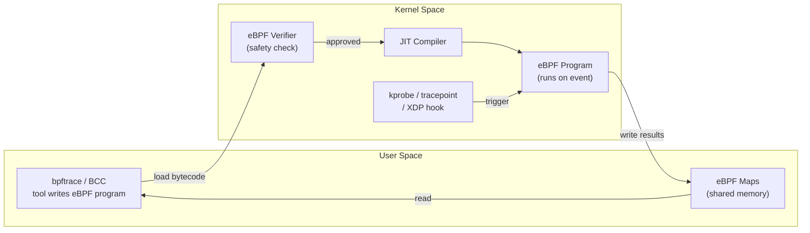
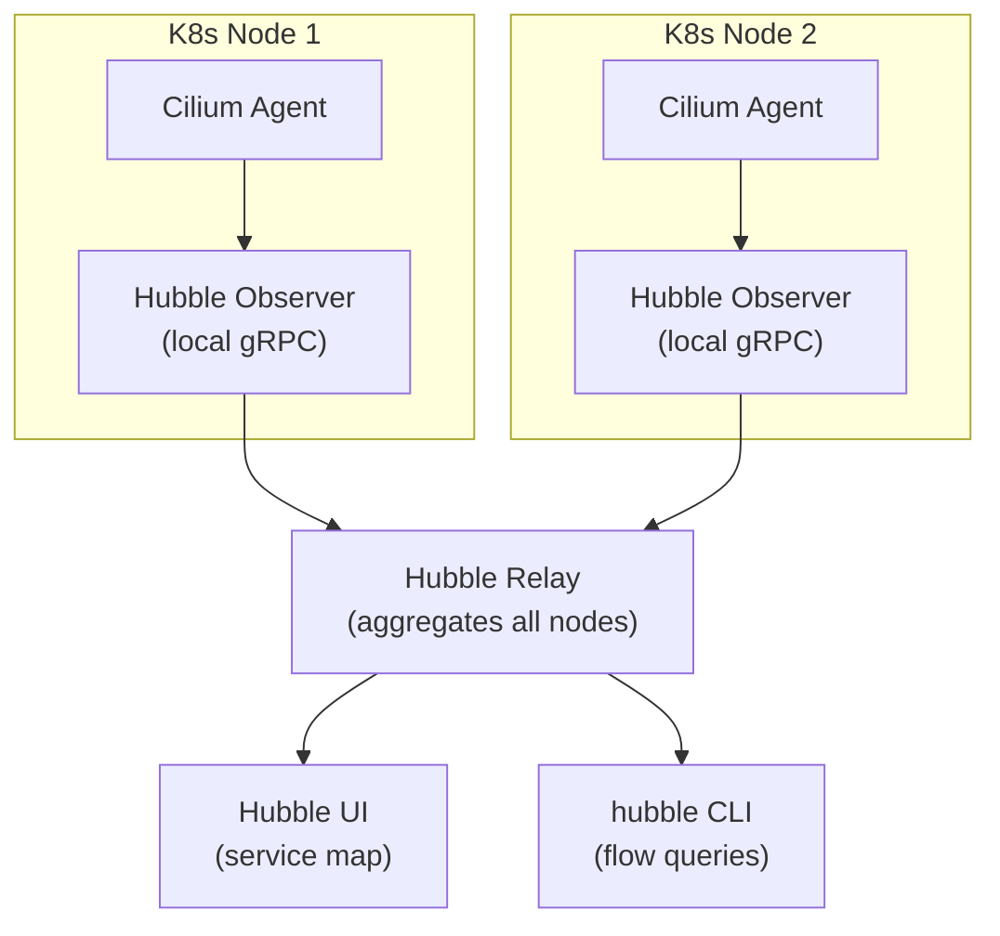
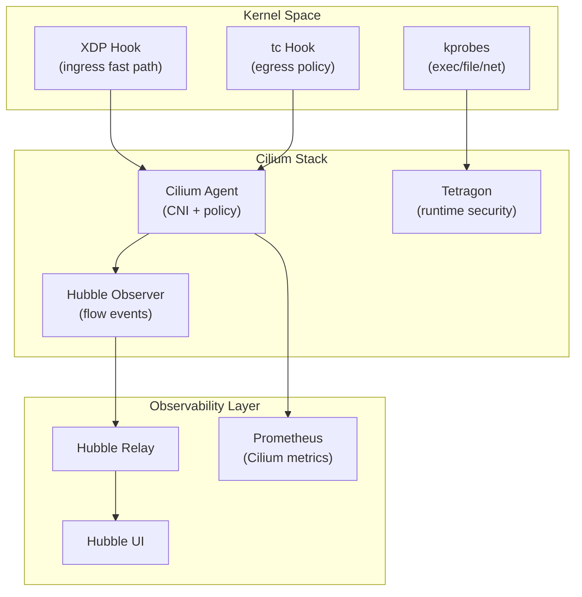

# eBPF Observability

A tour of eBPF-based tracing, networking, and security tooling — from the kernel-level safety model that makes it safe to run kernel-space code, up through the tools built on top of it: bpftrace, BCC, Cilium, Tetragon, and Hubble. Track how many knowledge checks you've cleared as you go:

<div class="quiz-progress" data-quiz-progress>
  <span class="quiz-progress-label">0/0 checks</span>
  <span class="quiz-progress-bar"><span class="quiz-progress-fill"></span></span>
</div>

---

## 1. What is eBPF?

eBPF (extended Berkeley Packet Filter) lets you run sandboxed programs inside the Linux kernel, triggered by events — without modifying kernel source or loading modules.



**Hook types:**
- `kprobe/kretprobe` — kernel function entry/exit
- `tracepoint` — stable kernel trace events
- `uprobe` — user-space function entry
- `XDP` — eXpress Data Path, runs at NIC driver level (pre-stack)
- `tc` — traffic control ingress/egress

The diagram above is really six steps happening in order every time an eBPF program runs. Step through it:

<div class="stepper">
  <div class="stepper-panels">
    <div class="stepper-panel active">
      <strong>1. Write &amp; load.</strong> A tool like bpftrace or BCC compiles your program to eBPF bytecode and loads it into the kernel.
    </div>
    <div class="stepper-panel">
      <strong>2. Verify.</strong> The eBPF verifier checks the bytecode for safety &mdash; bounded loops, valid memory access, no unreachable instructions &mdash; before anything is allowed to run.
    </div>
    <div class="stepper-panel">
      <strong>3. JIT compile.</strong> Only once the verifier approves it does the JIT compiler turn the bytecode into native machine code.
    </div>
    <div class="stepper-panel">
      <strong>4. Trigger.</strong> A kprobe, tracepoint, or XDP hook fires on its event and runs the compiled program.
    </div>
    <div class="stepper-panel">
      <strong>5. Collect.</strong> The program writes its results into an eBPF map &mdash; shared memory between kernel and user space.
    </div>
    <div class="stepper-panel">
      <strong>6. Read.</strong> The userspace tool reads the map to show you results.
    </div>
  </div>
  <div class="stepper-controls">
    <button class="stepper-prev">← Prev</button>
    <span class="stepper-dots"></span>
    <span class="stepper-label"></span>
    <button class="stepper-next">Next →</button>
  </div>
</div>

<div class="quiz-card">
  <p class="quiz-q">Does the eBPF verifier run before or after the JIT compiler turns bytecode into native machine code?</p>
  <button class="quiz-reveal">Reveal answer</button>
  <div class="quiz-a" hidden>Before. The verifier has to approve the bytecode as safe first &mdash; the JIT compiler only ever compiles bytecode that's already passed verification, never the other way around.</div>
</div>

---

## 2. Safety Model

The **verifier** enforces before any program runs:
- No unbounded loops (all loops must have a bounded iteration count)
- No invalid memory access (all pointer arithmetic checked)
- No unreachable instructions
- Must terminate (DAG check)
- Max 1M instructions (kernel 5.2+)

Result: kernel stability guaranteed — buggy eBPF cannot crash the kernel.

<div class="quiz-card">
  <p class="quiz-q">Can an eBPF program contain a loop?</p>
  <button class="quiz-reveal">Reveal answer</button>
  <div class="quiz-a" hidden>Yes, as long as it has a bounded iteration count the verifier can prove will terminate. It's <em>unbounded</em> loops that get rejected &mdash; not loops in general. A program that fails this (or any other verifier check) never gets to run at all, which is exactly why buggy eBPF can't crash the kernel.</div>
</div>

---

## 3. Tools

### bpftrace one-liners

```bash
# syscall latency histogram (nanoseconds)
bpftrace -e 'tracepoint:syscalls:sys_enter_read { @start[tid] = nsecs; }
             tracepoint:syscalls:sys_exit_read  { @ns = hist(nsecs - @start[tid]); }'

# off-CPU time (who is blocked and for how long)
bpftrace -e 'tracepoint:sched:sched_switch { @off[args->prev_comm] = nsecs; }
             tracepoint:sched:sched_switch { @ms[args->next_comm] = hist((nsecs - @off[args->next_comm])/1e6); }'

# TCP retransmits with details
bpftrace -e 'tracepoint:tcp:tcp_retransmit_skb {
               printf("%s %s:%d -> %d<br>", comm,
               ntop(args->saddr), args->sport, args->dport); }'
```

### BCC tools

| Tool | What it shows |
|---|---|
| `execsnoop` | Every new process exec (pid, ppid, args) |
| `opensnoop` | Every file open call with path |
| `tcplife` | TCP connection durations + bytes |
| `biolatency` | Block I/O latency histogram |
| `runqlat` | CPU run-queue latency (scheduler) |
| `profile` | CPU flame graph via sampling |
| `tcpretrans` | TCP retransmit events |

```bash
# install bcc on Ubuntu
apt-get install bpfcc-tools
execsnoop-bpfcc          # watch all execs
opensnoop-bpfcc -p 1234  # watch PID 1234 file opens
tcplife-bpfcc            # show TCP session durations
```

---

## 4. Cilium: eBPF-based CNI

Cilium replaces iptables with eBPF for Kubernetes networking:
- **CNI**: pod-to-pod routing via eBPF maps (no kube-proxy)
- **Network Policy**: L3/L4 + L7 (HTTP method, gRPC service) enforcement
- **Load balancing**: eBPF replaces kube-proxy IPVS/iptables for Service VIP

```bash
helm install cilium cilium/cilium \
  --set kubeProxyReplacement=strict \
  --set hubble.relay.enabled=true \
  --set hubble.ui.enabled=true
```

<div class="quiz-card">
  <p class="quiz-q">With kubeProxyReplacement=strict, does Cilium still rely on kube-proxy for Kubernetes Service load balancing?</p>
  <button class="quiz-reveal">Reveal answer</button>
  <div class="quiz-a" hidden>No. eBPF replaces kube-proxy's IPVS/iptables rules entirely for Service VIP load balancing &mdash; same as it replaces iptables for pod-to-pod routing (CNI) and for L3/L4/L7 network policy enforcement. All three jobs move to eBPF, not just some of them.</div>
</div>

---

## 5. Tetragon: Runtime Security

Tetragon uses eBPF to enforce security policies at kernel level:

```yaml
apiVersion: cilium.io/v1alpha1
kind: TracingPolicy
metadata:
  name: detect-shell-exec
spec:
  kprobes:
  - call: "sys_execve"
    syscall: true
    args:
    - index: 0
      type: "string"
    selectors:
    - matchArgs:
      - index: 0
        operator: "Postfix"
        values: ["/bin/sh", "/bin/bash"]
      matchActions:
      - action: Sigkill   # kill the process
```

Detects: exec of shells, `/etc/passwd` reads, unexpected network connections, privilege escalation.

The `detect-shell-exec` policy above plays out in a fixed order every time a shell is spawned:

<div class="stepper">
  <div class="stepper-panels">
    <div class="stepper-panel active">
      <strong>1. Exec attempt.</strong> A process anywhere in the cluster calls <code>execve()</code> targeting <code>/bin/sh</code> or <code>/bin/bash</code>.
    </div>
    <div class="stepper-panel">
      <strong>2. kprobe fires.</strong> Tetragon's kprobe on <code>sys_execve</code> triggers and captures argument 0 &mdash; the path being executed.
    </div>
    <div class="stepper-panel">
      <strong>3. Selector evaluated.</strong> The <code>matchArgs</code> selector checks that argument with a <code>Postfix</code> comparison against <code>/bin/sh</code> and <code>/bin/bash</code>.
    </div>
    <div class="stepper-panel">
      <strong>4. Action enforced.</strong> On a match, the <code>Sigkill</code> matchAction fires &mdash; the process is killed at the kernel level, before it can do anything as that shell.
    </div>
  </div>
  <div class="stepper-controls">
    <button class="stepper-prev">← Prev</button>
    <span class="stepper-dots"></span>
    <span class="stepper-label"></span>
    <button class="stepper-next">Next →</button>
  </div>
</div>

<div class="quiz-card">
  <p class="quiz-q">Does the detect-shell-exec TracingPolicy block a matching shell exec, or just log it for a human to review later?</p>
  <button class="quiz-reveal">Reveal answer</button>
  <div class="quiz-a" hidden>It blocks it. The matchActions entry specifies Sigkill, which kills the process outright when the selector matches &mdash; enforcement happens at the kernel level in the same moment as detection, not as an after-the-fact log entry.</div>
</div>

---

## 6. Hubble: Network Observability

Hubble is the observability layer for Cilium clusters.



```bash
hubble observe --namespace default --last 100
hubble observe --from-pod default/frontend --to-pod default/backend
hubble observe --verdict DROPPED   # show dropped flows
```

<div class="quiz-card">
  <p class="quiz-q">If you query one node's Hubble Observer directly, do you see flows from the whole cluster or just that node?</p>
  <button class="quiz-reveal">Reveal answer</button>
  <div class="quiz-a" hidden>Just that node &mdash; each Hubble Observer only sees its local Cilium Agent's flow events. Hubble Relay is the piece that aggregates every node's observer into one stream, and it's what Hubble UI and the hubble CLI actually talk to for a cluster-wide view.</div>
</div>

---

## 7. Performance Advantage

| Approach | Overhead | Why |
|---|---|---|
| strace | ~100x slowdown | ptrace stops process per syscall |
| perf | ~5-10% | kernel→userspace copy per event |
| eBPF | ~1-3% | in-kernel aggregation, zero-copy maps |

<div class="tab-group">
  <div class="tab-buttons">
    <button data-tab="strace" class="active">strace</button>
    <button data-tab="perf">perf</button>
    <button data-tab="ebpf">eBPF</button>
  </div>
  <div class="tab-panels">
    <div class="tab-panel active" data-tab-panel="strace">
      <strong>~100x slowdown.</strong> Built on <code>ptrace</code>, which stops the traced process on <em>every single syscall</em> so the tracer can inspect it. That stop-and-inspect cost is paid per event, which is why this is the slowest option by a wide margin.
    </div>
    <div class="tab-panel" data-tab-panel="perf">
      <strong>~5-10% overhead.</strong> Doesn't stop the process, but still copies each raw event from kernel to userspace individually. Much cheaper than ptrace, but the per-event copy cost is still real.
    </div>
    <div class="tab-panel" data-tab-panel="ebpf">
      <strong>~1-3% overhead.</strong> Aggregates in-kernel &mdash; histograms and counts are built inside a map, and only the summarized result crosses into userspace, not each raw event. Zero-copy on top of that: userspace reads straight from shared mapped memory instead of a copy being made for it.
    </div>
  </div>
</div>

eBPF programs aggregate data (histograms, counts) in kernel maps. Only summaries cross the user/kernel boundary — not raw events.

**Zero-copy**: `BPF_MAP_TYPE_PERF_EVENT_ARRAY` uses a shared ring buffer; userspace reads directly from mapped memory.

<div class="quiz-card">
  <p class="quiz-q">strace and eBPF can both observe the same syscalls. Why is strace's overhead ~100x worse?</p>
  <button class="quiz-reveal">Reveal answer</button>
  <div class="quiz-a" hidden>strace runs on ptrace, which stops the traced process on every single syscall so the tracer can inspect it &mdash; that per-syscall stop is where the ~100x cost comes from. eBPF never stops the process at all: it aggregates results in-kernel and only the summarized data, not each raw event, crosses into userspace.</div>
</div>

---

## Architecture: Cilium + Hubble + Tetragon



<div class="quiz-card">
  <p class="quiz-q">In this combined architecture, do kprobe events feed into Tetragon or into Hubble first?</p>
  <button class="quiz-reveal">Reveal answer</button>
  <div class="quiz-a" hidden>Tetragon. kprobes (exec/file/net) feed straight into Tetragon for runtime security decisions &mdash; a separate path from XDP/tc, which feed the Cilium Agent for CNI and policy work, which in turn is what feeds Hubble Observer for flow visibility. Same kernel-level hook types, two different eBPF-based pipelines doing different jobs.</div>
</div>
