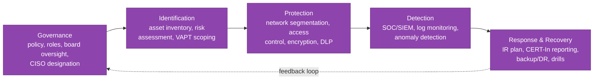
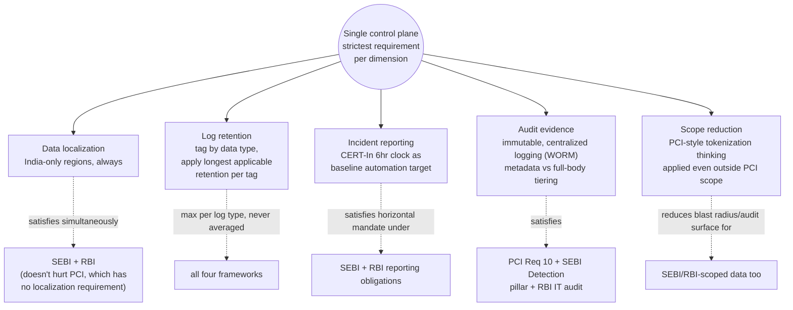

# FinTech Compliance Deep Dive — SEBI CSCRF, CERT-In, PCI-DSS, RBI (India)

Deeper regulatory-technical reference for India-focused financial infrastructure, building on the vocabulary introduced in [fintech-security.md](./fintech-security.md). That file covers the regulatory landscape at a practitioner level (network segmentation, PAM, MFA, audit evidence, secrets rotation). This file goes one level deeper into the frameworks themselves — what each one actually mandates, how they overlap, and how to build infra that satisfies all of them without duplicating controls three times.

Companion: [trading-systems.md](./trading-systems.md) (trading infra architecture), [trading-data-streaming.md](./trading-data-streaming.md) (broker/cache tuning for trading workloads).

Most sections below end with a quick knowledge check — track how many you clear as you go:

<div class="quiz-progress" data-quiz-progress>
  <span class="quiz-progress-label">0/0 checks</span>
  <span class="quiz-progress-bar"><span class="quiz-progress-fill"></span></span>
</div>

---

## The Frameworks at a Glance

<div class="tab-group">
  <div class="tab-buttons">
    <button data-tab="sebi" class="active">SEBI CSCRF</button>
    <button data-tab="certin">CERT-In</button>
    <button data-tab="rbi">RBI</button>
    <button data-tab="pci">PCI-DSS</button>
  </div>
  <div class="tab-panels">
    <div class="tab-panel active" data-tab-panel="sebi">
      <strong>Who it applies to:</strong> stock exchanges, brokers, depositories, AMCs, RTAs, KRAs &mdash; SEBI-registered market infrastructure institutions / intermediaries.
    </div>
    <div class="tab-panel" data-tab-panel="certin">
      <strong>Who it applies to (6-hour reporting directive):</strong> ALL entities in India with a computer resource &mdash; this is horizontal, not sector-specific. Applies on top of SEBI/RBI rules, not instead of them.
    </div>
    <div class="tab-panel" data-tab-panel="rbi">
      <strong>Who it applies to:</strong> banks, NBFCs, payment system operators, payment aggregators, and any regulated entity RBI licenses/supervises.
    </div>
    <div class="tab-panel" data-tab-panel="pci">
      <strong>Who it applies to:</strong> ANY entity, anywhere in the world, that stores, processes, or transmits cardholder data &mdash; contractual, not statutory, but enforced by card networks (Visa/Mastercard/RuPay) via acquirer banks.
    </div>
  </div>
</div>

A single fintech company can be in scope for more than one of these simultaneously — e.g., a stockbroker that also issues a co-branded payment card is subject to SEBI CSCRF *and* RBI card/payment guidelines *and* PCI-DSS *and* CERT-In's horizontal mandate. Building a compliance-ready platform means designing controls that satisfy the *strictest* overlapping requirement once, rather than bolting on separate control sets per regulator.

<div class="quiz-card">
  <p class="quiz-q">A stockbroker also issues a co-branded payment card. Does it only need to satisfy PCI-DSS for the card side of the business?</p>
  <button class="quiz-reveal">Reveal answer</button>
  <div class="quiz-a" hidden>No &mdash; it's in scope for all of them at once: SEBI CSCRF (as a broker), RBI card/payment guidelines, PCI-DSS (cardholder data), and CERT-In's horizontal 6-hour reporting mandate. The right approach is designing controls that satisfy the strictest overlapping requirement once, not bolting on a separate control set per regulator.</div>
</div>

---

## 1. SEBI CSCRF — The Five Pillars

SEBI's Cybersecurity and Cyber Resilience Framework (issued 2023, consolidated update Aug 2024) restructures earlier piecemeal SEBI cyber circulars into a NIST-CSF-aligned model with five functional pillars.



| Pillar | Core requirement | Representative technical control |
|--------|-------------------|-----------------------------------|
| **Governance** | Board-approved cybersecurity policy; designated CISO reporting to the board/audit committee | Policy document versioned, reviewed annually; CISO independent of IT operations |
| **Identification** | Complete, current asset inventory (hardware, software, data flows, third-party dependencies); risk classification of systems | CMDB/asset tagging in cloud (AWS Config aggregator, GCP Asset Inventory) tied to a criticality tier |
| **Protection** | Network segmentation, least-privilege access, encryption in transit/at rest, secure SDLC, vendor risk management | See segmented-zone diagram in [fintech-security.md](./fintech-security.md#1-sebi-cscrf--key-controls) |
| **Detection** | 24×7 monitoring (SOC) for Category I/II entities; SIEM correlation; anomaly/UEBA detection | Centralized log pipeline feeding a SIEM (Splunk/Sentinel/self-hosted ELK) with defined detection use-cases, not just log storage |
| **Response & Recovery** | Documented IR plan, CERT-In reportable-incident classification, tested backup/DR, periodic drills | Runbooks + automated CERT-In-reportable-event detection (see section 2) |

### 1.1 VAPT Frequency Requirements

VAPT = Vulnerability Assessment and Penetration Testing, performed by a **CERT-In empaneled auditor** — using a non-empaneled firm does not satisfy the requirement even if the technical work is equivalent.

| Category | VAPT frequency | Scope typically required |
|----------|------------------|----------------------------|
| Category I (exchanges, clearing corps, depositories) | Quarterly | Full infra: network, application, API, cloud config |
| Category II (top brokers, AMCs, custodians, QSBs) | Half-yearly | Production trading systems, customer-facing apps, APIs |
| Category III (smaller brokers, RTAs, KRAs) | Annual | Production systems handling investor data |

Practical implication for infra teams: VAPT is not a one-time security audit item — it is a recurring calendar obligation that needs its own tracking (a Jira epic or compliance calendar), and remediation SLAs for findings are usually mandated too (commonly: critical findings closed within 30 days, high within 60, medium within 90 — confirm exact figures against your entity's current CSCRF circular, as remediation SLAs have been revised across circular updates).

### 1.2 SOC Monitoring Requirements

Category I and II entities must run (or contract) a Security Operations Center with:
- 24×7 monitoring coverage — not business-hours-only, because market-hours incidents and after-hours breach activity both matter
- Log ingestion from all in-scope systems: OS, network devices, applications, databases, cloud control plane (CloudTrail/Cloud Audit Logs), identity provider
- Defined detection use-cases mapped to known threat scenarios (unauthorized privileged access, data exfiltration patterns, lateral movement, anomalous trading-system access outside change windows) — a SIEM with only default vendor rules does not satisfy this in practice, auditors ask for entity-specific use-case documentation
- Documented escalation path from SOC alert → IR team → CERT-In reporting decision (this escalation chain is exactly what feeds the 6-hour clock in section 2)

### 1.3 Data Localization

CSCRF requires trading data, investor personal data, and audit/log data to reside on infrastructure **physically located in India**. For cloud deployments this means:

<div class="toggle-switch">
  <div class="toggle-buttons">
    <button data-toggle-opt="ok" class="active state-ok">Acceptable</button>
    <button data-toggle-opt="review" class="state-warn">Requires approval / masking</button>
  </div>
  <div class="toggle-panel active" data-toggle-panel="ok">
    <code>AWS ap-south-1</code> (Mumbai), <code>ap-south-2</code> (Hyderabad); <code>GCP asia-south1</code> (Mumbai), <code>asia-south2</code> (Delhi); or on-prem/colocation within India.
  </div>
  <div class="toggle-panel" data-toggle-panel="review">
    Cross-region replication of raw production data to any non-India region. DR replicas outside India (even for resilience purposes) typically must either stay India-only (multi-AZ within ap-south-1, or India-region-to-India-region) or use masked/anonymized data if a non-India analytics/DR copy is unavoidable.
  </div>
</div>

> **Common mistake caught in audits:** a managed SaaS tool (APM, error tracking, support ticketing) that silently ships log payloads containing customer PII to a US-region SaaS backend. Data localization scope covers third-party SaaS dependencies too, not just your own infra — audit your outbound data flows to every SaaS vendor.

<div class="quiz-card">
  <p class="quiz-q">Your firm hires a highly skilled, well-reviewed security firm to run VAPT — but the firm isn't CERT-In empaneled. Does this satisfy SEBI CSCRF's VAPT requirement?</p>
  <button class="quiz-reveal">Reveal answer</button>
  <div class="quiz-a" hidden>No. VAPT must be performed by a CERT-In empaneled auditor specifically &mdash; using a non-empaneled firm doesn't satisfy the requirement even if the technical work itself is equivalent in quality.</div>
</div>

---

## 2. CERT-In Incident Reporting — The 6-Hour Mandate

### 2.1 What Qualifies as a Reportable Incident

CERT-In's April 2022 directive (and carried forward under CSCRF) requires reporting **within 6 hours of detection** (not 6 hours from occurrence — the clock starts when you notice, which is itself a reason detection speed matters as much as the reporting process). Reportable incident categories relevant to fintech infra:

| Category | Examples |
|----------|----------|
| Unauthorized access | Compromised credentials used to access production trading/customer systems |
| Data breach/leakage | Exfiltration of customer PII, trade data, KYC documents |
| Denial of service | DDoS materially degrading trading platform or customer-facing services |
| Malware/ransomware | Any malware detected on production or corporate systems with potential production impact |
| Website/application compromise | Defacement, unauthorized code injection, supply-chain compromise of a dependency |
| Trading system disruption | Exchange connectivity outage caused by a security event (distinguish from a routine infra failure — if root cause is security-related, it's reportable) |
| Identity/access system compromise | IAM/SSO provider breach, leaked API keys/service account credentials with production scope |

**The ambiguous case that trips teams up:** an infra outage with an *unclear* root cause. The default posture should be "assume reportable until ruled out" rather than "wait for full root cause before deciding" — waiting for certainty before triggering the reporting clock is the most common way teams blow the 6-hour window.

### 2.2 Reporting Template / Process

Reports are filed via the CERT-In incident reporting portal (or empanelled-auditor-assisted filing for regulated entities). At minimum, the report must contain:

```
CERT-In Incident Report — required fields:
  1. Organization name, sector, point of contact
  2. Date/time of incident occurrence (if known) and date/time of detection
  3. Systems/networks affected (IPs, hostnames, or system names — as available)
  4. Nature of the incident (category from table above)
  5. Impact assessment (data affected, services affected, customer impact scope)
  6. Actions taken so far (containment steps, isolation, patching)
  7. Point of contact for CERT-In follow-up
  8. (Follow-up, within 14 days) Detailed post-incident report — root cause,
     full timeline, remediation completed, preventive measures
```

The initial 6-hour report is explicitly allowed to be preliminary — CERT-In does not expect full root cause analysis in 6 hours. It expects notification that something reportable happened, with best-available detail, and a committed follow-up. Teams that delay reporting because "we don't have the full picture yet" are working against the framework's actual design — file preliminary, update later.

### 2.3 Why the 6-Hour Timeline Is Operationally Hard

```
Realistic incident timeline without automation:

  T+0        Security event occurs
  T+?        Detection (this gap itself can be hours without good monitoring)
  T+detect   Alert fires, on-call paged
  T+30min    On-call acknowledges, starts triage
  T+1-2hr    Incident confirmed as security-relevant (not just a normal outage)
  T+2-3hr    IR team assembled, initial scoping done
  T+3-5hr    Someone realizes/remembers this needs CERT-In reporting
  T+5-6hr    Report drafted, reviewed, filed — right at the wire, or missed

The failure mode isn't malicious non-compliance — it's that "file the CERT-In
report" is step 8 in a mental checklist under incident pressure, and by the
time the team gets there, hours are already gone from detection lag alone.
```

Step through where the time actually goes:

<div class="stepper">
  <div class="stepper-panels">
    <div class="stepper-panel active">
      <strong>T+0.</strong> Security event occurs.
    </div>
    <div class="stepper-panel">
      <strong>T+?</strong> Detection. This gap itself can be hours without good monitoring — and it's usually the largest single delay in the whole chain.
    </div>
    <div class="stepper-panel">
      <strong>T+detect.</strong> Alert fires, on-call paged.
    </div>
    <div class="stepper-panel">
      <strong>T+30min.</strong> On-call acknowledges, starts triage.
    </div>
    <div class="stepper-panel">
      <strong>T+1-2hr.</strong> Incident confirmed as security-relevant, not just a normal outage.
    </div>
    <div class="stepper-panel">
      <strong>T+2-3hr.</strong> IR team assembled, initial scoping done.
    </div>
    <div class="stepper-panel">
      <strong>T+3-5hr.</strong> Someone realizes/remembers this needs CERT-In reporting.
    </div>
    <div class="stepper-panel">
      <strong>T+5-6hr.</strong> Report drafted, reviewed, filed — right at the wire, or missed entirely.
    </div>
  </div>
  <div class="stepper-controls">
    <button class="stepper-prev">← Prev</button>
    <span class="stepper-dots"></span>
    <span class="stepper-label"></span>
    <button class="stepper-next">Next →</button>
  </div>
</div>

### 2.4 What Automation Is Needed to Meet It

The only reliable way to consistently hit 6 hours is to remove as many manual steps as possible from the *decision to report* and the *drafting of the initial report*, so human time is spent only on judgment calls, not paperwork assembly.

```
Automation layers that actually move the needle:

  1. Fast, high-fidelity detection
     - SIEM correlation rules mapped explicitly to CERT-In reportable categories
       (not generic "anomaly" alerts — alerts tagged with "this maps to
       reportable-category: unauthorized-access" at alert-creation time)
     - Cuts the T+0 -> T+detect gap, which is usually the largest single delay

  2. Auto-classification at alert time
     - Alert payload includes a pre-filled reportability assessment
       ("this alert pattern historically = CERT-In reportable: yes/likely/no")
     - Removes the "does this even need reporting" debate from the critical path

  3. Auto-drafted preliminary report
     - A Lambda/Cloud Function triggered off the security alert pulls known
       fields (affected systems from CMDB, timestamp, alert detail) into a
       pre-filled report template, so a human is editing/approving, not
       drafting from scratch
     - Cuts report-drafting time from ~1-2 hours to ~15-20 minutes

  4. Explicit clock-tracking in the incident tool
     - The moment an incident is tagged "possible CERT-In reportable," a
       visible countdown/SLA timer starts in PagerDuty/Jira/Opsgenie —
       makes the deadline impossible to lose track of during a chaotic incident
```

```bash
# Example: CloudTrail -> EventBridge -> Lambda pre-fill pipeline
# (extends the pattern shown in fintech-security.md's CERT-In automation section)

aws events put-rule \
  --name cert-in-reportable-pattern \
  --event-pattern '{
    "source": ["aws.cloudtrail"],
    "detail-type": ["AWS API Call via CloudTrail"],
    "detail": {
      "eventName": ["ConsoleLogin", "AssumeRole", "PutBucketAcl", "CreateAccessKey"],
      "errorCode": ["AccessDenied", "UnauthorizedAccess"]
    }
  }'

aws events put-targets \
  --rule cert-in-reportable-pattern \
  --targets '[{
    "Id": "prefill-cert-in-report",
    "Arn": "arn:aws:lambda:ap-south-1:ACCOUNT_ID:function:cert-in-report-prefill"
  }]'

# Lambda function responsibilities:
#   1. Pull affected resource metadata from AWS Config / internal CMDB
#   2. Populate the CERT-In report template fields it can determine automatically
#   3. Create a Jira/ServiceNow ticket tagged "CERT-IN-SLA" with a 6hr due-by field
#   4. Page the IR on-call with the pre-filled draft attached, not a blank alert
```

<div class="quiz-card">
  <p class="quiz-q">An infra outage has an unclear root cause — it might be a routine failure or might be security-related. What's the correct default posture for the CERT-In 6-hour clock?</p>
  <button class="quiz-reveal">Reveal answer</button>
  <div class="quiz-a" hidden>Assume reportable until ruled out, not "wait for full root cause before deciding." Waiting for certainty before triggering the reporting clock is the most common way teams blow the 6-hour window &mdash; and the initial report is explicitly allowed to be preliminary, so there's no need to wait anyway.</div>
</div>

---

## 3. PCI-DSS for Payment-Adjacent Fintech

Relevant when your platform stores, processes, or transmits cardholder data (PAN, cardholder name, expiry, service code) — common for fintech offering card issuance, card-linked payments, or checkout flows, even if payments aren't the core product.

### 3.1 The 12 Requirements, Practically

| # | Requirement | Practical infra meaning |
|---|--------------|---------------------------|
| 1 | Install/maintain network security controls | Firewalls/security groups with documented rules, default-deny, reviewed regularly |
| 2 | Apply secure configurations | No default credentials/configs on any system in scope; CIS benchmarks applied to base images |
| 3 | Protect stored account data | Encrypt PAN at rest (or better: don't store it — tokenize, see 3.2); never store full magstripe/CVV post-authorization |
| 4 | Protect data in transit with strong cryptography | TLS 1.2+ everywhere cardholder data moves, no plaintext internal transmission either |
| 5 | Protect against malware | EDR/antivirus on applicable systems, regularly updated |
| 6 | Develop/maintain secure systems and software | SDLC with security review gates, dependency scanning, WAF for public-facing payment apps |
| 7 | Restrict access by business need-to-know | RBAC scoped tightly around cardholder-data-touching systems specifically |
| 8 | Identify users and authenticate access | Unique IDs per user (no shared accounts), MFA for all access into the CDE (Cardholder Data Environment) |
| 9 | Restrict physical access to cardholder data | Applies to on-prem/colo hardware; largely inherited from cloud provider's PCI attestation for cloud-hosted CDE |
| 10 | Log and monitor all access | Every access to cardholder data and system components logged, retained, reviewed (ties directly into section 5 below) |
| 11 | Test security of systems and networks regularly | Quarterly ASV scans (external), penetration testing at least annually and after significant changes |
| 12 | Support information security with organizational policies | Documented policy, incident response plan, annual risk assessment |

### 3.2 Tokenization vs Encryption for Card Data

<div class="toggle-switch">
  <div class="toggle-buttons">
    <button data-toggle-opt="encryption" class="active state-warn">Encryption</button>
    <button data-toggle-opt="tokenization" class="state-ok">Tokenization</button>
  </div>
  <div class="toggle-panel active" data-toggle-panel="encryption">
    <strong>PAN stored as ciphertext, decryptable with a key.</strong>
    <pre><code class="language-mermaid">graph LR
    PAN["4111111111111111"] -->|"AES-256 + key K"| CT["8f3a9c2e..."]</code></pre>
    The encrypted value is still "cardholder data" under PCI scope &mdash; anywhere it's stored, transmitted, or processed is IN SCOPE for PCI-DSS, because decryption is possible with the right key.
  </div>
  <div class="toggle-panel" data-toggle-panel="tokenization">
    <strong>PAN replaced with a surrogate token that has no mathematical relationship to the original.</strong>
    <pre><code class="language-mermaid">graph LR
    PAN["4111111111111111"] -->|"tokenization vault lookup"| TOK["tok_9f8e7d6c5b4a"]</code></pre>
    The token itself is NOT cardholder data (via a tokenization vault/service, not reversible math). Systems that only ever handle the token &mdash; not the real PAN &mdash; are OUT OF PCI-DSS SCOPE for that data flow.
  </div>
</div>

This distinction is the single biggest lever for reducing audit scope (section 3.3): encryption protects the data but keeps every system touching it in-scope; tokenization can remove entire systems from scope if they never see the real PAN, only the token.

<div class="quiz-card">
  <p class="quiz-q">A system only ever touches a tokenized value (e.g. <code>tok_9f8e7d6c5b4a</code>), never the real PAN. Is that system in scope for PCI-DSS for that data flow?</p>
  <button class="quiz-reveal">Reveal answer</button>
  <div class="quiz-a" hidden>No &mdash; the token itself is not cardholder data, so a system that only ever handles the token is out of PCI-DSS scope for that flow. Contrast with encryption: an encrypted PAN is still cardholder data (decryption is possible with the right key), so every system touching the ciphertext stays in scope.</div>
</div>

### 3.3 Scope Reduction Strategies

The PCI-DSS audit surface is proportional to how many systems can "see" real cardholder data. Reducing that surface is the most effective way to reduce audit cost and risk, not just a nice-to-have:

```
Strategy 1 — Outsource card capture entirely to a PCI-compliant processor
  Use hosted payment pages / client-side SDK tokenization (e.g., processor's
  JS SDK tokenizes the card in the browser before it ever reaches your servers)
  → Your servers only ever see a token, never the PAN. Massive scope reduction.

Strategy 2 — Network segmentation of the CDE
  Isolate any system that DOES need real PAN access into a dedicated segment
  with its own firewall rules, separate from the rest of the application stack
  → Only the segmented CDE is in PCI scope, not your entire production VPC

Strategy 3 — P2PE (Point-to-Point Encryption) for physical card acceptance
  If issuing/accepting physical cards, use P2PE-validated terminals that
  encrypt card data at the point of swipe/tap, decryptable only by the processor
  → Your systems never decrypt it, reducing scope similarly to tokenization

Strategy 4 — Minimize retention
  Don't store PAN/cardholder data at all if the business doesn't require it
  post-transaction. "We don't have the data" is the strongest scope reduction
  there is — you can't leak or fail to protect data you never stored.
```

---

## 4. RBI Guidelines Relevant to Fintech Infra

### 4.1 Data Localization for Payment Data

RBI's 2018 data localization directive (for payment system data) requires that the **entire data related to a payment transaction** — end-to-end transaction details, originating from the customer's payment instruction through settlement — be stored **only in India**. This is stricter than "store a copy in India": for in-scope payment data, there should be no requirement to also process it outside India as part of normal flow (a copy for cross-border legs of a transaction, like a foreign card network's own processing, is treated separately from mirroring for convenience/analytics).

```
Practical infra implications:
  - Payment processing services: deployed in India regions only, no
    active-active with a non-India region for payment-processing workloads
  - Analytics/BI on payment data: if raw payment data feeds an analytics
    pipeline, that pipeline's storage must also stay in India, or the data
    must be sufficiently anonymized/aggregated before leaving India
  - Third-party payment gateway integrations: verify the gateway's own India
    data residency posture — you inherit their non-compliance risk if their
    processing happens outside India for your transactions
```

### 4.2 Outsourcing / Cloud Guidelines for Regulated Entities

RBI's guidelines on outsourcing of IT services (and the more recent cloud-specific guidance) require regulated entities (banks, NBFCs, payment system operators) to maintain oversight and control even when infrastructure is outsourced to a cloud provider:

```
Key obligations when using cloud infra as an RBI-regulated entity:
  - Right to audit: contract with the cloud provider must give the regulated
    entity (and RBI/its auditors) the right to audit relevant controls —
    standard cloud provider ToS often needs an addendum/enterprise agreement
    to satisfy this
  - Exit strategy: documented plan for migrating away from a cloud provider
    without service disruption — avoid architectural lock-in that makes this
    infeasible in practice (proprietary managed-service-only architectures
    are a real compliance risk here, not just a technical preference)
  - Business continuity: cloud provider's own DR/BCP posture must be
    assessed and documented as part of the regulated entity's own BCP,
    not assumed
  - Sub-outsourcing visibility: if the cloud provider uses further
    sub-processors, the regulated entity needs visibility into that chain
  - Concentration risk awareness: RBI has flagged systemic risk from
    over-concentration of regulated entities on a small number of cloud
    providers — increasingly a board-level reporting item, not just an IT one
```

<div class="quiz-card">
  <p class="quiz-q">Your payment pipeline stores a full copy of transaction data in India, but also replicates it to a non-India region for a BI dashboard. Does storing "a copy" in India satisfy RBI's 2018 data localization directive?</p>
  <button class="quiz-reveal">Reveal answer</button>
  <div class="quiz-a" hidden>Not necessarily. RBI's directive is stricter than "store a copy in India" &mdash; in-scope payment data should have no requirement to also be processed outside India as part of normal flow. An analytics pipeline replicating raw payment data outside India needs to either stay in India too, or the data must be sufficiently anonymized/aggregated before it leaves.</div>
</div>

---

## 5. Audit Logging Requirements — Common Across Frameworks

All four frameworks converge on similar audit logging expectations, differing mainly in retention period and specific triggering events. Building one logging architecture that satisfies the strictest common denominator avoids maintaining parallel logging pipelines per regulator.

### 5.1 What Must Be Logged for Financial Transactions

```
Minimum fields for a financial-transaction audit log entry:
  - Timestamp (UTC + IST, unambiguous, synchronized via NTP across all systems —
    clock drift between systems breaks event correlation during an investigation)
  - Actor identity (user ID, service account, or system component — never "system"
    as a generic actor; must be traceable to a specific principal)
  - Action performed (order placed, order cancelled, fund transfer, KYC document
    accessed, admin privilege used, config changed)
  - Affected resource/entity (account ID, order ID, transaction ID)
  - Source (originating IP, originating system/service, session ID)
  - Result (success, failure, reason code if failed)
  - Before/after state for modifications (what changed, not just that it changed)
```

### 5.2 Immutability Requirements

Logs must be tamper-evident — an auditor (or attacker) should not be able to alter historical logs without detection.

```
Common technical approaches:
  - WORM storage (Write Once Read Many): S3 Object Lock in Compliance mode,
    GCS bucket retention policy with lock — prevents deletion/modification
    even by an account admin until the retention period expires
  - Cryptographic chaining: each log batch includes a hash of the previous
    batch, making retroactive tampering detectable (similar to blockchain-style
    hash chaining, without needing an actual blockchain)
  - Write-only log shipping: application/system credentials used to ship logs
    have write-only permissions to the log store — the credential that writes
    logs cannot also delete or modify them, enforced via IAM policy, not convention
  - Separate audit trail account/project: in a multi-account cloud setup,
    ship audit logs to a dedicated, tightly-locked-down account that even
    production admins don't have standing access to
```

### 5.3 Retention Periods

| Framework | Typical minimum retention | Notes |
|-----------|---------------------------|-------|
| SEBI CSCRF | Generally aligned to 5+ years for certain trade-related records under SEBI's broader recordkeeping norms; specific log types may differ — confirm against current circular | Retention for trade/order records is often longer than generic security logs |
| CERT-In directive | 180 days minimum for logs of ICT systems, within India | This is a horizontal floor — sector rules (SEBI/RBI) can and often do require longer |
| RBI (payment system data/logs) | Often 10 years for transaction records under payment system recordkeeping norms; security/access logs typically shorter | Transaction record retention and security log retention are frequently governed by different clauses — don't conflate them |
| PCI-DSS | Minimum 1 year, with at least 3 months immediately available/hot for analysis | Shortest of the four — but if you're also SEBI/RBI/CERT-In scoped, the longer requirement governs for any log that's also in scope there |

**Practical design point:** since retention floors differ per framework and per data type, tag log streams at ingestion time with the regulatory regime(s) they satisfy, and set lifecycle policies per tag rather than one blanket retention setting for all logs — a blanket "keep everything 180 days" setting under-retains SEBI/RBI-scoped transaction logs.

<div class="quiz-card">
  <p class="quiz-q">A log type is subject to both CERT-In's 180-day floor and SEBI's 5+ year trade-record retention. You set one blanket policy of 180 days for all logs, to keep things simple. What's wrong with that?</p>
  <button class="quiz-reveal">Reveal answer</button>
  <div class="quiz-a" hidden>It under-retains the SEBI/RBI-scoped logs. Retention floors differ per framework and per data type, and where they overlap, the longer requirement governs &mdash; not an average, not the shortest. The right design is to tag log streams at ingestion time with the regulatory regime(s) they satisfy and set lifecycle policies per tag.</div>
</div>

---

## 6. Building a Compliance-Ready Kubernetes Audit Policy

The goal: an audit policy that produces the evidence auditors actually ask for (see the evidence checklist in [fintech-security.md](./fintech-security.md#audit-evidence-checklist-cert-in--sebi)) without drowning the log pipeline in noise from routine, low-risk API calls.

### 6.1 Design Principles

```
1. Full request/response body for anything touching secrets, RBAC, or
   privileged execution — auditors need to see WHAT changed, not just THAT
   something changed
2. Metadata-only for high-volume, low-risk reads (e.g., routine GET on
   non-sensitive resources) — full-body logging here is pure noise/cost
3. Explicitly log pod exec/attach/portforward — this is literally "someone
   got a shell into a container," a top audit-evidence request
4. Explicitly log anything in namespaces tagged as handling regulated data
   (trading, payments, KYC) at a higher verbosity than the rest of the cluster
5. Never log request/response bodies containing Secrets' actual data at
   RequestResponse level for the Secret object itself — you'd be writing
   the secret value into your audit log store, creating a new exposure
   surface (log the metadata/action, not the object body, for Secret reads)
```

### 6.2 Example Audit Policy YAML

```yaml
apiVersion: audit.k8s.io/v1
kind: Policy
# omitStages: RequestReceived reduces noise (skips the "request came in" stage,
# keeping only ResponseComplete which has the actual outcome)
omitStages:
  - RequestReceived

rules:
  # ── Tier 1: Full audit trail for privileged/regulated-namespace activity ──

  # Any action inside namespaces handling regulated financial data
  - level: RequestResponse
    namespaces: ["trading-prod", "payments-prod", "kyc-prod"]
    verbs: ["create", "update", "patch", "delete"]

  # Pod exec/attach/portforward anywhere in the cluster — "someone got a shell"
  - level: RequestResponse
    resources:
      - group: ""
        resources: ["pods/exec", "pods/attach", "pods/portforward"]

  # All RBAC changes cluster-wide — who can do what is a core audit question
  - level: RequestResponse
    resources:
      - group: "rbac.authorization.k8s.io"
        resources: ["roles", "clusterroles", "rolebindings", "clusterrolebindings"]

  # cluster-admin / system:masters usage specifically — highest-privilege actions
  - level: RequestResponse
    userGroups: ["system:masters"]
    omitStages: []   # capture RequestReceived too for these — full timing detail

  # NetworkPolicy changes — segmentation is a CSCRF/PCI control, changes must be traceable
  - level: RequestResponse
    resources:
      - group: "networking.k8s.io"
        resources: ["networkpolicies"]

  # ── Tier 2: Metadata for secret/config access (who/when, not the value) ──

  - level: Metadata
    resources:
      - group: ""
        resources: ["secrets", "configmaps"]
    # Note: level Metadata never includes request/response body, so this is
    # safe — you get "user X read secret Y at time Z" without the secret value

  # ── Tier 3: Admission webhook and CRD changes for regulated workloads ────

  - level: RequestResponse
    resources:
      - group: "admissionregistration.k8s.io"
        resources: ["validatingwebhookconfigurations", "mutatingwebhookconfigurations"]

  # ── Tier 4: Everything else in regulated-adjacent namespaces gets metadata ─

  - level: Metadata
    namespaces: ["trading-prod", "payments-prod", "kyc-prod"]

  # ── Tier 5: Low-risk, high-volume reads elsewhere — minimal logging ───────

  - level: Metadata
    verbs: ["get", "list", "watch"]
    resources:
      - group: ""
        resources: ["pods", "services", "endpoints"]

  # ── Default catch-all: metadata only, keeps the pipeline from silently
  #    dropping anything not matched above, without paying full-body cost ──
  - level: Metadata
```

```bash
# kube-apiserver flags to wire this policy in, with WORM-style shipping downstream
--audit-log-path=/var/log/kubernetes/audit.log
--audit-log-maxage=30            # local buffer only — durable retention lives in S3/GCS, not the node disk
--audit-log-maxbackup=10
--audit-log-maxsize=200
--audit-policy-file=/etc/kubernetes/audit-policy.yaml

# Fluent Bit / Fluentd ships audit.log -> S3 bucket with:
#   - Object Lock (Compliance mode) enabled, matching the retention table in section 5.3
#   - Bucket in ap-south-1 (data localization — see section 1.3)
#   - A write-only IAM role for the log shipper (cannot delete/modify existing objects)
```

### 6.3 Verifying the Policy Produces Real Evidence

An audit policy is only useful if someone actually pulls evidence from it before the auditor asks. Treat this as a recurring job, not a one-time setup:

```bash
# Example: monthly evidence pull showing pod exec activity in regulated namespaces
# (mirrors the access-review pattern from fintech-security.md)

aws s3 cp s3://k8s-audit-logs/audit.log - | \
  jq -r 'select(.objectRef.resource == "pods" and .objectRef.subresource == "exec") |
    select(.objectRef.namespace == "trading-prod" or .objectRef.namespace == "payments-prod") |
    "\(.requestReceivedTimestamp) user=\(.user.username) namespace=\(.objectRef.namespace) pod=\(.objectRef.name)"' \
  > exec-activity-report-$(date +%Y-%m).txt

aws s3 cp exec-activity-report-$(date +%Y-%m).txt \
  s3://audit-evidence-bucket/k8s-exec-activity/$(date +%Y-%m)/
```

<div class="quiz-card">
  <p class="quiz-q">Why does the example audit policy log Secret reads at the Metadata level instead of RequestResponse, even though RequestResponse is used for other privileged actions?</p>
  <button class="quiz-reveal">Reveal answer</button>
  <div class="quiz-a" hidden>RequestResponse level captures the full request/response body. For a Secret object, that body IS the secret's actual value &mdash; logging it at RequestResponse would write the secret into the audit log store itself, creating a brand new exposure surface. Metadata level still records who read which secret and when, without ever capturing the value.</div>
</div>

---

## 7. Comparison Table — SEBI CSCRF vs PCI-DSS vs RBI Guidelines

| Dimension | SEBI CSCRF | PCI-DSS | RBI Guidelines |
|-----------|------------|---------|-----------------|
| **Nature** | Statutory (SEBI circular, binding on registered entities) | Contractual (card network mandate via acquirer agreements) | Statutory (RBI directions/guidelines, binding on regulated entities) |
| **Who it applies to** | Stock exchanges, clearing corps, depositories, brokers, AMCs, RTAs, KRAs | Any entity storing/processing/transmitting cardholder data, regardless of sector | Banks, NBFCs, payment system operators, payment aggregators/gateways |
| **Enforcement mechanism** | SEBI regulatory action (fines, license suspension) | Card network fines, potential loss of ability to process card payments | RBI regulatory action (fines, restrictions, license action for severe cases) |
| **Primary focus** | Securities market infrastructure resilience and investor data protection | Cardholder data (PAN, CVV, expiry) protection specifically | Payment systems integrity, data localization, financial system stability |
| **Incident reporting** | Via CERT-In (6hr) as the horizontal mechanism, layered under CSCRF categorization | No direct regulator reporting mandate; contractual breach notification to card networks/acquirer per agreement | Via CERT-In (6hr) similarly, plus RBI-specific incident reporting for payment system operators |
| **Data localization** | Trade/investor data must stay in India | No inherent localization mandate (global standard), though other India rules may still apply to the same data | Explicit mandate: full payment transaction data must be stored only in India |
| **Audit requirement** | VAPT via CERT-In empaneled auditor, frequency by category (quarterly/half-yearly/annual) | QSA-led assessment annually (for higher transaction volumes) + quarterly ASV scans | Entity-specific IT audits per RBI's IT governance guidelines; cloud outsourcing right-to-audit clauses |
| **Cloud/outsourcing rules** | Data localization + vendor risk assessment under Protection pillar | No cloud-specific mandate beyond standard scope rules (a cloud-hosted CDE is still in scope) | Explicit outsourcing guidelines: right to audit, exit strategy, BCP assessment, concentration risk |
| **Scope reduction levers** | Limited — most controls apply broadly across in-scope systems | Strong — tokenization/outsourced capture can remove entire systems from scope | Limited — payment data localization applies to the data itself, not reducible via architecture tricks |
| **Retention (typical floor)** | Often 5+ years for trade-related records (confirm current circular) | 1 year minimum, 3 months hot | Often 10 years for transaction records under payment system norms |

---

## Summary — Building Once, Satisfying All Four

Design a single control plane that satisfies the strictest requirement per dimension:


