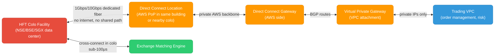
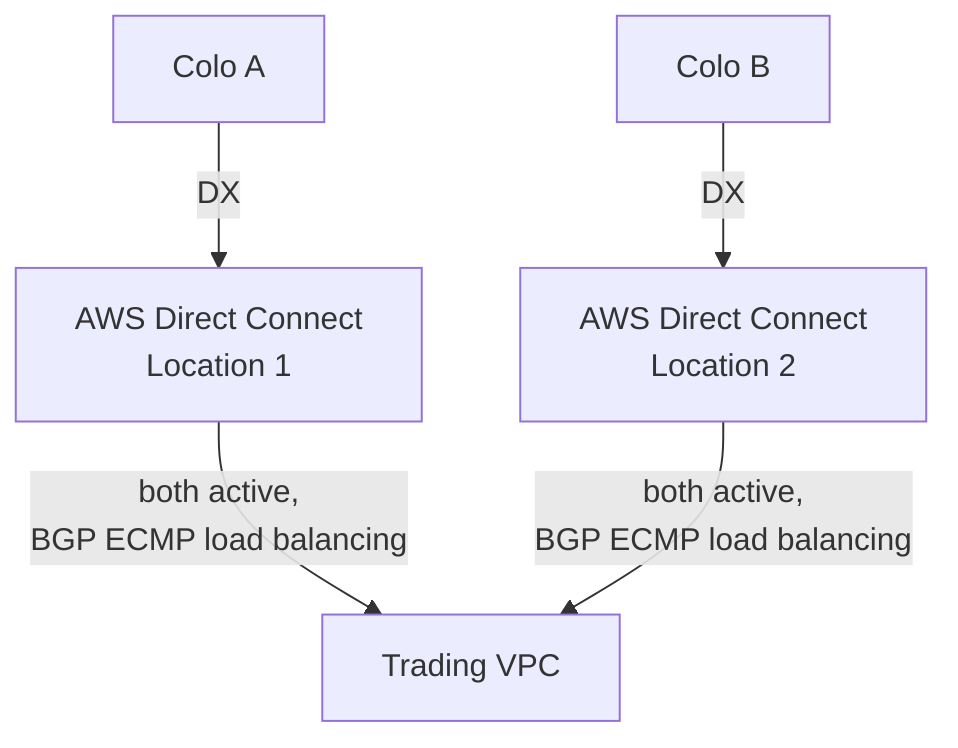
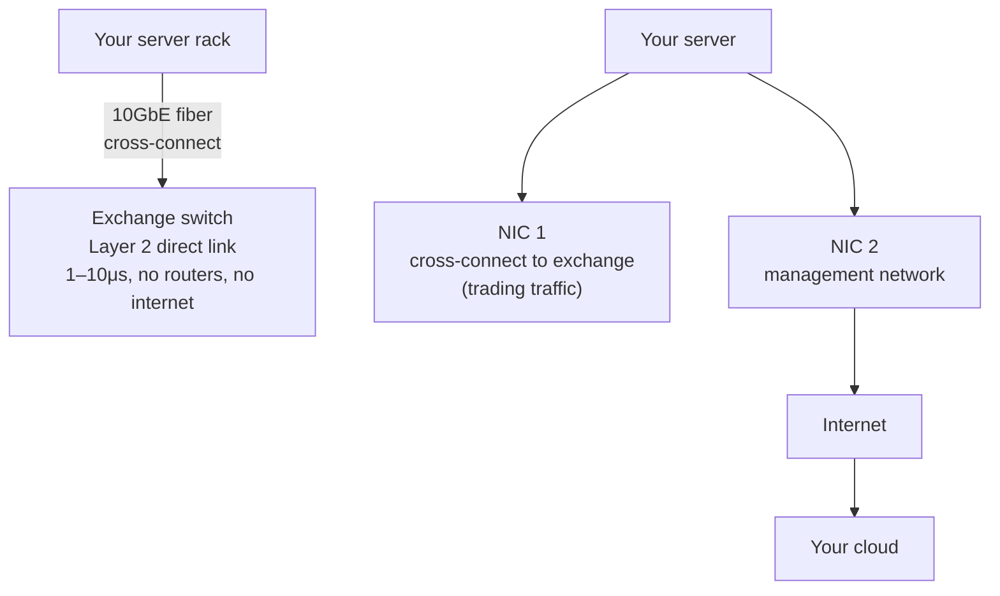
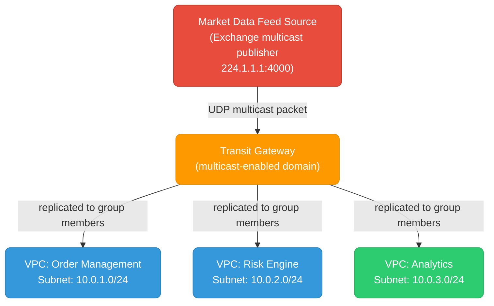
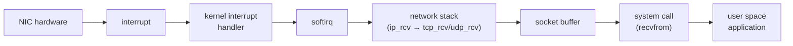

# Low-Latency Network Architectures

For High-Frequency Trading (HFT) and financial exchange systems, standard cloud networking introduces unacceptable latency. This file covers the three pillars of ultra-low-latency networking: exchange connectivity, multicast market data, and kernel bypass.

<div class="quiz-progress" data-quiz-progress>
  <span class="quiz-progress-label">0/0 checks</span>
  <span class="quiz-progress-bar"><span class="quiz-progress-fill"></span></span>
</div>

---

## Why Standard Cloud Networking Is Too Slow

Every layer a packet crosses adds latency — and the standard path stacks far more of them between the trading app and the exchange than an optimized path does. Flip between the two to see which layers disappear:

<div class="toggle-switch">
  <div class="toggle-buttons">
    <button data-toggle-opt="standard" class="active state-bad">Standard internet path</button>
    <button data-toggle-opt="optimized" class="state-ok">Optimized HFT path</button>
  </div>
  <div class="toggle-panel active" data-toggle-panel="standard">
    <pre><code class="language-mermaid">graph LR
    App["Trading app"] --> EC2["EC2/GCE"] --> VPCR["VPC router"] --> IGW["Internet GW"] --> ISP["ISP"] --> EXCH["Exchange"]</code></pre>
    <strong>Latency: 5–50ms</strong> (internet) + kernel overhead (~50–200μs per hop). Six hops — three of them (Internet GW, ISP, the public internet itself) completely outside your control.
  </div>
  <div class="toggle-panel" data-toggle-panel="optimized">
    <pre><code class="language-mermaid">graph LR
    App2["Trading app"] --> NIC["NIC (DPDK)"] --> DX["Direct Connect / dedicated line"] --> EXCH2["Exchange colocation"]</code></pre>
    <strong>Latency: 50–500μs end-to-end</strong>, sub-10μs for kernel-bypassed local ops. Four hops, none of them the public internet.
  </div>
</div>

Every layer adds latency. HFT eliminates as many layers as possible.

<div class="quiz-card">
  <p class="quiz-q">The optimized HFT path still has 4 hops, not 1. So why is it so much faster than the standard path's 6 hops?</p>
  <button class="quiz-reveal">Reveal answer</button>
  <div class="quiz-a" hidden>Hop count alone isn't what matters &mdash; which hops they are does. The standard path's hops route through the public internet (Internet GW, ISP), which adds both raw latency (5&ndash;50ms) <em>and</em> unpredictable jitter from congestion and shared infrastructure. The optimized path replaces those internet hops with a dedicated line and kernel bypass, so every remaining hop is both faster and deterministic.</div>
</div>

---

## 1. Exchange Connectivity

### The Problem with Public Internet

Standard HTTPS/TCP over the public internet for trading has three fundamental problems:
- **Variable latency** — congestion, routing changes, packet loss cause jitter (spikes from 1ms to 100ms)
- **Kernel overhead** — each packet goes through the Linux TCP/IP stack (~10–50μs of CPU time)
- **Shared infrastructure** — you're competing for bandwidth with other traffic

For context: a stock price can move in 10μs. A 5ms network jitter means you're acting on data that's 500,000 "ticks" stale.

<div class="quiz-card">
  <p class="quiz-q">A stock price can move in 10μs, and the public internet can jitter by 5ms. Roughly how many "ticks" stale is the data you'd be acting on during that spike?</p>
  <button class="quiz-reveal">Reveal answer</button>
  <div class="quiz-a" hidden>About 500,000 (5ms ÷ 10μs). A single congestion-triggered jitter spike on the public internet is enough to make a trading decision on wildly outdated information &mdash; which is why "variable latency," not just "latency," is listed as the first fundamental problem.</div>
</div>

### AWS Direct Connect

Direct Connect is a **dedicated private fiber** from your on-prem/colo facility to AWS — bypassing the public internet entirely.



**Key configuration points:**

```bash
# Direct Connect connection (provisioned via AWS Console or partner)
# After physical fiber is in place:

# Create a Virtual Interface (VIF) — the logical BGP session
aws directconnect create-private-virtual-interface \
  --connection-id dxcon-xxxxxxxx \
  --new-private-virtual-interface '{
    "virtualInterfaceName": "trading-vif",
    "vlan": 100,
    "asn": 65000,
    "mtu": 9001,
    "authKey": "bgp-md5-key",
    "amazonAddress": "169.254.0.1/30",
    "customerAddress": "169.254.0.2/30",
    "virtualGatewayId": "vgw-xxxxxxxx"
  }'

# Verify BGP session is UP
aws directconnect describe-virtual-interfaces \
  --virtual-interface-id dxvif-xxxxxxxx \
  --query 'virtualInterfaces[0].bgpPeers[0].bgpStatus'
# → "up"
```

### BGP Tuning for HFT

Standard BGP convergence time (when a route changes) is 30–90 seconds. That's catastrophic for trading. Tune it:

```
# On your BGP router (Cisco/Juniper/FRRouting):
neighbor 169.254.0.1 timers 3 9          # hello=3s, hold=9s (default: 60/180)
neighbor 169.254.0.1 timers connect 5    # retry on failure: 5s

# BFD (Bidirectional Forwarding Detection) — detects link failure in <1 second
neighbor 169.254.0.1 bfd
bfd interval 300 min_rx 300 multiplier 3 # 300ms intervals, 3 misses = 900ms failover
```

### Active-Active Redundancy

For exchanges with strict uptime SLAs, run **two Direct Connect connections** from two different colo facilities (different physical buildings) in active-active mode:



```bash
# Direct Connect Gateway links BOTH VIFs to the same VPC
aws directconnect create-direct-connect-gateway \
  --direct-connect-gateway-name trading-dcg \
  --amazon-side-asn 64512

# Attach both VIFs to the gateway — AWS routes over both automatically
aws directconnect create-direct-connect-gateway-association \
  --direct-connect-gateway-id dcg-xxxxxxxx \
  --gateway-id vgw-xxxxxxxx
```

Put the tuned BGP timers, BFD, and this active-active pair together and here's what actually happens when a link dies:

<div class="stepper">
  <div class="stepper-panels">
    <div class="stepper-panel active">
      <strong>1. Healthy.</strong> Both Direct Connect links are up. Each has its own BGP session, and BFD is exchanging hellos every 300ms on both.
    </div>
    <div class="stepper-panel">
      <strong>2. A link fails.</strong> Colo A's fiber path (or its BGP peer) goes down. No more BFD hellos arrive on that session.
    </div>
    <div class="stepper-panel">
      <strong>3. BFD detects it.</strong> After 3 missed 300ms intervals (~900ms) BFD declares the session dead &mdash; versus 30&ndash;90 seconds for unmodified BGP hold timers alone.
    </div>
    <div class="stepper-panel">
      <strong>4. BGP withdraws the route.</strong> The failed path drops out of the router's ECMP set for the trading VPC.
    </div>
    <div class="stepper-panel">
      <strong>5. Traffic shifts.</strong> Everything flows over the surviving Direct Connect connection (Colo B) with no manual intervention. Total failover: under a second.
    </div>
  </div>
  <div class="stepper-controls">
    <button class="stepper-prev">← Prev</button>
    <span class="stepper-dots"></span>
    <span class="stepper-label"></span>
    <button class="stepper-next">Next →</button>
  </div>
</div>

<div class="quiz-card">
  <p class="quiz-q">Why does BFD cut failover time from 30–90 seconds down to under a second, when it's running alongside BGP rather than replacing it?</p>
  <button class="quiz-reveal">Reveal answer</button>
  <div class="quiz-a" hidden>BGP's own hold timers only notice a dead peer after a long silence (tens of seconds, even tuned down to hello=3s/hold=9s). BFD runs a much faster, lightweight heartbeat (300ms intervals, 3 missed = ~900ms) purely to detect the failure fast &mdash; then it tells BGP to withdraw the route immediately instead of waiting for BGP's own slower timers to notice.</div>
</div>

### On-Premises / Co-location Scenario (Non-AWS)

When colocated in the same building as the exchange (e.g., NSE's colo at Powai, BSE's at Goregaon):



<div class="quiz-card">
  <p class="quiz-q">Both AWS Direct Connect and a colo cross-connect skip the public internet entirely. Which one is actually lower latency, and why?</p>
  <button class="quiz-reveal">Reveal answer</button>
  <div class="quiz-a" hidden>The colo cross-connect (1&ndash;10μs) &mdash; it beats even Direct Connect (0.5&ndash;2ms). Direct Connect still routes through a Direct Connect location, AWS's private backbone, a Direct Connect Gateway, and a Virtual Private Gateway before reaching your VPC. A physical cross-connect in the same building is just a Layer 2 fiber patch straight to the exchange switch &mdash; no routers at all.</div>
</div>

---

## 2. Multicast Routing for Market Data

### What Multicast Is

UDP Multicast sends **one packet that reaches many receivers simultaneously** without the sender transmitting N copies. Every major exchange (NSE, BSE, CME, NASDAQ) distributes market data (tick data, order book updates) via multicast.

<div class="tab-group">
  <div class="tab-buttons">
    <button data-tab="unicast" class="active">Unicast</button>
    <button data-tab="broadcast">Broadcast</button>
    <button data-tab="multicast">Multicast</button>
  </div>
  <div class="tab-panels">
    <div class="tab-panel active" data-tab-panel="unicast">
      <strong>Server sends 1000 copies → 1000 clients.</strong> One packet per recipient &mdash; bandwidth cost scales 1000x with the number of clients.
    </div>
    <div class="tab-panel" data-tab-panel="broadcast">
      <strong>Server sends to everyone → 1000 clients.</strong> Reaches every host on the segment whether it wants the feed or not &mdash; wastes bandwidth on uninterested receivers.
    </div>
    <div class="tab-panel" data-tab-panel="multicast">
      <strong>Server sends 1 copy → multicast group → 1000 clients.</strong> The network, not the sender, replicates the packet only to hosts that joined the group &mdash; bandwidth cost stays 1x no matter how many clients are listening.
    </div>
  </div>
</div>

Multicast uses IP addresses in the **224.0.0.0/4** range. Clients "join" a multicast group to receive packets for that feed.

<div class="quiz-card">
  <p class="quiz-q">A multicast feed goes from 1,000 subscribers to 10,000 overnight. How many copies of each packet does the sender now need to transmit?</p>
  <button class="quiz-reveal">Reveal answer</button>
  <div class="quiz-a" hidden>Still just 1. Multicast's bandwidth cost at the sender is independent of receiver count &mdash; the network replicates the packet close to each receiver, not the source. That's the entire point versus unicast, where sender bandwidth scales linearly with the number of clients.</div>
</div>

### The Problem in VPCs

By default, VPCs do not support IP multicast. AWS VPC is a software-defined network that doesn't forward multicast packets. If your market data feed publishes to `224.1.1.1:4000`, your EC2 instances won't receive it without special configuration.

### Solution: AWS Transit Gateway Multicast

AWS Transit Gateway (TGW) supports multicast routing — the only AWS service that does.



**Setup:**

```bash
# 1. Create multicast-enabled Transit Gateway
aws ec2 create-transit-gateway \
  --options '{
    "MulticastSupport": "enable",
    "DefaultRouteTableAssociation": "enable",
    "DefaultRouteTablePropagation": "enable"
  }'

# 2. Create a multicast domain
aws ec2 create-transit-gateway-multicast-domain \
  --transit-gateway-id tgw-xxxxxxxx \
  --options '{
    "Igmpv2Support": "enable",
    "StaticSourcesSupport": "disable",
    "AutoAcceptSharedAssociations": "disable"
  }'

# 3. Associate subnets with the multicast domain
aws ec2 associate-transit-gateway-multicast-domain \
  --transit-gateway-multicast-domain-id tgw-mcast-domain-xxxxxxxx \
  --transit-gateway-attachment-id tgw-attach-xxxxxxxx \
  --subnet-ids subnet-xxxxxxxx subnet-yyyyyyyy

# 4. Register the source (the EC2/appliance that publishes market data)
aws ec2 register-transit-gateway-multicast-group-sources \
  --transit-gateway-multicast-domain-id tgw-mcast-domain-xxxxxxxx \
  --group-ip-address 224.1.1.1 \
  --network-interface-ids eni-xxxxxxxx    # ENI of the feed publisher

# 5. Register subscribers (instances that need the feed)
aws ec2 register-transit-gateway-multicast-group-members \
  --transit-gateway-multicast-domain-id tgw-mcast-domain-xxxxxxxx \
  --group-ip-address 224.1.1.1 \
  --network-interface-ids eni-aaa eni-bbb eni-ccc
```

Step through what those five commands actually build, in order:

<div class="stepper">
  <div class="stepper-panels">
    <div class="stepper-panel active">
      <strong>1. Create a multicast-enabled Transit Gateway.</strong> Multicast support is off by default on a TGW &mdash; it has to be explicitly enabled.
    </div>
    <div class="stepper-panel">
      <strong>2. Create a multicast domain.</strong> With IGMPv2 support turned on, so instances can dynamically join/leave groups instead of everything being statically registered.
    </div>
    <div class="stepper-panel">
      <strong>3. Associate subnets with the domain.</strong> Only instances in an associated subnet can participate in this multicast domain at all.
    </div>
    <div class="stepper-panel">
      <strong>4. Register the source.</strong> The ENI of the feed publisher, tied to a specific multicast group IP (e.g. <code>224.1.1.1</code>).
    </div>
    <div class="stepper-panel">
      <strong>5. Register subscribers.</strong> The ENIs of every instance that needs the feed. Each one still has to send its own IGMP join from inside the OS/application before it actually receives packets.
    </div>
  </div>
  <div class="stepper-controls">
    <button class="stepper-prev">← Prev</button>
    <span class="stepper-dots"></span>
    <span class="stepper-label"></span>
    <button class="stepper-next">Next →</button>
  </div>
</div>

**On each subscriber instance:**

```bash
# Join multicast group (Linux)
ip maddress add 224.1.1.1 dev eth0

# Or via application (Python example)
import socket, struct

sock = socket.socket(socket.AF_INET, socket.SOCK_DGRAM, socket.IPPROTO_UDP)
sock.setsockopt(socket.SOL_SOCKET, socket.SO_REUSEADDR, 1)
sock.bind(('', 4000))

# Join multicast group
mreq = struct.pack('4sL', socket.inet_aton('224.1.1.1'), socket.INADDR_ANY)
sock.setsockopt(socket.IPPROTO_IP, socket.IP_ADD_MEMBERSHIP, mreq)

while True:
    data, addr = sock.recvfrom(65535)
    process_tick(data)
```

### IGMP — How Membership Works

IGMP (Internet Group Management Protocol) is how instances tell the network "I want to receive multicast group X":
- **IGMPv2 Join**: instance sends a join report to the multicast group address
- **IGMPv2 Leave**: instance leaves the group
- **TGW Querier**: TGW periodically sends IGMP queries to learn which instances are still subscribed

```bash
# Verify TGW sees your group members
aws ec2 search-transit-gateway-multicast-groups \
  --transit-gateway-multicast-domain-id tgw-mcast-domain-xxxxxxxx \
  --filters Name=group-ip-address,Values=224.1.1.1

# On the instance, check group membership
ip maddress show dev eth0
# → inet  224.1.1.1
```

<div class="quiz-card">
  <p class="quiz-q">An instance stops caring about a multicast feed but its application never sends an explicit IGMPv2 Leave. How does TGW eventually find out it's no longer subscribed?</p>
  <button class="quiz-reveal">Reveal answer</button>
  <div class="quiz-a" hidden>Via the TGW Querier. TGW periodically sends IGMP queries to check who's still subscribed to each group &mdash; an instance that doesn't respond eventually ages out, even without ever sending an explicit Leave.</div>
</div>

---

## 3. Kernel Bypass — DPDK

### Why the Linux Kernel Is Too Slow

Every packet received by a standard Linux application goes through this path:



Total overhead: ~5–50μs per packet, unpredictable due to kernel scheduling.

For HFT, this is too slow and too variable. DPDK (Data Plane Development Kit) **eliminates the kernel from the data path entirely**.

### How DPDK Works

<div class="toggle-switch">
  <div class="toggle-buttons">
    <button data-toggle-opt="without" class="active state-bad">Without DPDK</button>
    <button data-toggle-opt="with" class="state-ok">With DPDK</button>
  </div>
  <div class="toggle-panel active" data-toggle-panel="without">
    <pre><code class="language-mermaid">graph LR
    NICA["NIC"] --> KIA["kernel interrupt"] --> KSA["kernel TCP/IP stack"] --> SOCKA["socket"] --> APPA["app"]</code></pre>
    <strong>50μs+</strong> per packet, and variable &mdash; the kernel scheduler decides when your app actually gets to run.
  </div>
  <div class="toggle-panel" data-toggle-panel="with">
    <pre><code class="language-mermaid">graph LR
    NICB["NIC"] --> PMD["DPDK poll mode driver (user space)"] --> APPB["app"]</code></pre>
    <strong>Sub-1μs.</strong> The kernel never sees the packet at all &mdash; no interrupt, no context switch, nothing to wait on the scheduler for.
  </div>
</div>

<div class="quiz-card">
  <p class="quiz-q">DPDK's poll-mode driver spins in a tight loop constantly checking the NIC instead of waiting for an interrupt. What's the tradeoff?</p>
  <button class="quiz-reveal">Reveal answer</button>
  <div class="quiz-a" hidden>It burns 100% of a CPU core continuously &mdash; the core is always spinning, never idle &mdash; in exchange for eliminating the unpredictable delay of waiting for the kernel to schedule an interrupt handler. You're trading a whole core for latency determinism.</div>
</div>

DPDK:
1. Takes **exclusive control of the NIC** — the kernel never sees those packets
2. Uses **polling** instead of interrupts — the CPU spins in a tight loop checking the NIC (trades CPU for latency)
3. Uses **huge pages** for packet buffers to eliminate TLB misses
4. Pins threads to specific CPU cores (**CPU affinity**) to eliminate context-switch jitter

### Setup

```bash
# Install DPDK
apt-get install dpdk dpdk-dev

# Reserve huge pages (2MB pages, 1024 of them = 2GB)
echo 1024 > /sys/kernel/mm/hugepages/hugepages-2048kB/nr_hugepages
mkdir /mnt/huge
mount -t hugetlbfs nodev /mnt/huge

# Bind a NIC to DPDK's vfio-pci driver (removes it from kernel)
# First identify the NIC's PCI address
dpdk-devbind --status
# → 0000:00:03.0 'Virtio network device' if=eth1 drv=virtio-pci unused=vfio-pci

# Load vfio-pci module
modprobe vfio-pci

# Bind the NIC to DPDK (kernel loses visibility of this NIC)
dpdk-devbind --bind=vfio-pci 0000:00:03.0

# Verify
dpdk-devbind --status
# → 0000:00:03.0 'Virtio network device' drv=vfio-pci unused=virtio-pci
```

<div class="stepper">
  <div class="stepper-panels">
    <div class="stepper-panel active">
      <strong>1. Install DPDK.</strong> The library and poll-mode drivers (PMDs) for your NIC.
    </div>
    <div class="stepper-panel">
      <strong>2. Reserve huge pages.</strong> 2MB pages instead of the default 4KB &mdash; fewer, bigger pages means far fewer TLB misses walking packet buffers.
    </div>
    <div class="stepper-panel">
      <strong>3. Load <code>vfio-pci</code> and bind the NIC to it.</strong> This is the point of no return for the kernel &mdash; once bound, the kernel's network stack can no longer see or use this NIC at all.
    </div>
    <div class="stepper-panel">
      <strong>4. Verify the bind.</strong> <code>dpdk-devbind --status</code> should now show the NIC's driver as <code>vfio-pci</code> instead of its original kernel driver.
    </div>
  </div>
  <div class="stepper-controls">
    <button class="stepper-prev">← Prev</button>
    <span class="stepper-dots"></span>
    <span class="stepper-label"></span>
    <button class="stepper-next">Next →</button>
  </div>
</div>

### DPDK Application Skeleton (C)

```c
#include <rte_eal.h>
#include <rte_ethdev.h>
#include <rte_mbuf.h>

#define RX_RING_SIZE 1024
#define MBUF_POOL_SIZE 8191

int main(int argc, char *argv[]) {
    // Initialize DPDK EAL (sets up huge pages, CPU affinity, etc.)
    rte_eal_init(argc, argv);

    // Create memory pool for packet buffers
    struct rte_mempool *mbuf_pool = rte_pktmbuf_pool_create(
        "MBUF_POOL", MBUF_POOL_SIZE, 250, 0,
        RTE_MBUF_DEFAULT_BUF_SIZE, rte_socket_id()
    );

    uint16_t port_id = 0;

    // Configure the Ethernet port
    struct rte_eth_conf port_conf = {0};
    rte_eth_dev_configure(port_id, 1, 1, &port_conf);

    // Setup RX queue
    rte_eth_rx_queue_setup(port_id, 0, RX_RING_SIZE,
        rte_eth_dev_socket_id(port_id), NULL, mbuf_pool);

    // Start device
    rte_eth_dev_start(port_id);

    // Poll loop — no interrupts, no kernel, just spin
    struct rte_mbuf *bufs[32];
    while (1) {
        // Receive up to 32 packets in one call
        uint16_t nb_rx = rte_eth_rx_burst(port_id, 0, bufs, 32);

        for (int i = 0; i < nb_rx; i++) {
            // Process packet directly from NIC buffer
            process_market_data_packet(bufs[i]);
            rte_pktmbuf_free(bufs[i]);
        }
        // No sleep — spins at full speed, consuming 100% of one core
    }
}
```

### CPU Isolation for DPDK Cores

The polling core must never be preempted by the OS scheduler. Isolate it:

```bash
# In /etc/default/grub, add to GRUB_CMDLINE_LINUX:
# isolcpus=2,3 nohz_full=2,3 rcu_nocbs=2,3

# This tells the kernel: "never schedule any tasks on cores 2 and 3"
# DPDK pins its polling threads to these isolated cores

# After reboot, verify
cat /sys/devices/system/cpu/isolated
# → 2-3

# Set CPU affinity for DPDK app (cores 2 and 3)
dpdk-app -l 2,3 --socket-mem=1024,0 -- [app args]
```

### DPDK on AWS (ENA + EFA)

AWS Elastic Network Adapter (ENA) supports DPDK via the `ena` PMD driver. For ultra-low latency between EC2 instances, use **Elastic Fabric Adapter (EFA)**:

```bash
# EFA-enabled instance types: c5n, hpc6a, p4d, trn1
# EFA bypasses the kernel TCP/IP stack for inter-instance traffic

# Install EFA driver
./efa_installer.sh

# Check EFA device
fi_info -p efa
# → provider: efa, fabric: EFA-fe80::..., name: efa_0-rdm

# DPDK with EFA: use the efa PMD
dpdk-app -l 0,1,2,3 \
  -a <efa-pci-addr> \
  --vdev='net_efa0' \
  --iova-mode=va \
  -- [app args]
```

EFA uses RDMA (Remote Direct Memory Access) — data is written directly from one machine's memory into another's NIC buffer, bypassing both kernels. Latency: ~2–4μs between instances in the same placement group.

<div class="quiz-card">
  <p class="quiz-q">RDMA (via EFA) writes data straight from one machine's memory into another machine's NIC buffer. Whose kernel is involved in that transfer?</p>
  <button class="quiz-reveal">Reveal answer</button>
  <div class="quiz-a" hidden>Neither. RDMA bypasses both the sender's <em>and</em> the receiver's kernel entirely &mdash; not just the local kernel bypass DPDK gives you on one box. That's why inter-instance latency (2&ndash;4μs) can rival a well-tuned local DPDK path, even though the data is crossing the wire to a different machine.</div>
</div>

---

## Latency Budget — What Each Layer Costs

```
Layer                      Typical latency     HFT budget
────────────────────────────────────────────────────────
Internet routing           1–50ms              ✗ not acceptable
VPC software routing       10–100μs            borderline
Direct Connect (DX)        0.5–2ms (fiber)     ✓ for non-colo
Colo cross-connect         1–10μs              ✓ best option
Linux kernel TCP/IP stack  10–50μs/packet      borderline
DPDK (kernel bypass)       0.1–2μs/packet      ✓
RDMA/EFA                   2–4μs inter-host    ✓
Shared memory (same host)  0.05–0.1μs          ✓ fastest
```

<div class="quiz-card">
  <p class="quiz-q">Direct Connect shows a higher number (0.5–2ms) than VPC software routing (10–100μs) in this table, yet DX gets a ✓ and VPC routing only "borderline." What does the ✓ actually track — the raw number, or something else?</p>
  <button class="quiz-reveal">Reveal answer</button>
  <div class="quiz-a" hidden>Something else: whether the public internet's failure modes (jitter, congestion, shared infrastructure) are eliminated, not just the raw microsecond count. VPC software routing is only one component of a path that can still depend on the internet/ISP hops that cause those problems. Direct Connect replaces the internet entirely with dedicated fiber, so its latency is higher in absolute terms but deterministic &mdash; no jitter, no congestion, no shared path.</div>
</div>

---

## Summary

| Problem | Solution |
|---------|---------|
| Internet latency/jitter | AWS Direct Connect or physical colo cross-connect |
| BGP failover too slow | BFD (sub-second detection) + tuned BGP timers |
| VPC doesn't support multicast | AWS Transit Gateway with multicast domain |
| Linux kernel adds per-packet overhead | DPDK with poll-mode driver + CPU isolation |
| Inter-instance latency | EFA (RDMA) + placement group |
| CPU scheduling jitter | `isolcpus` + `nohz_full` + `rcu_nocbs` |
