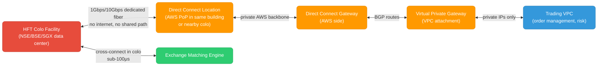
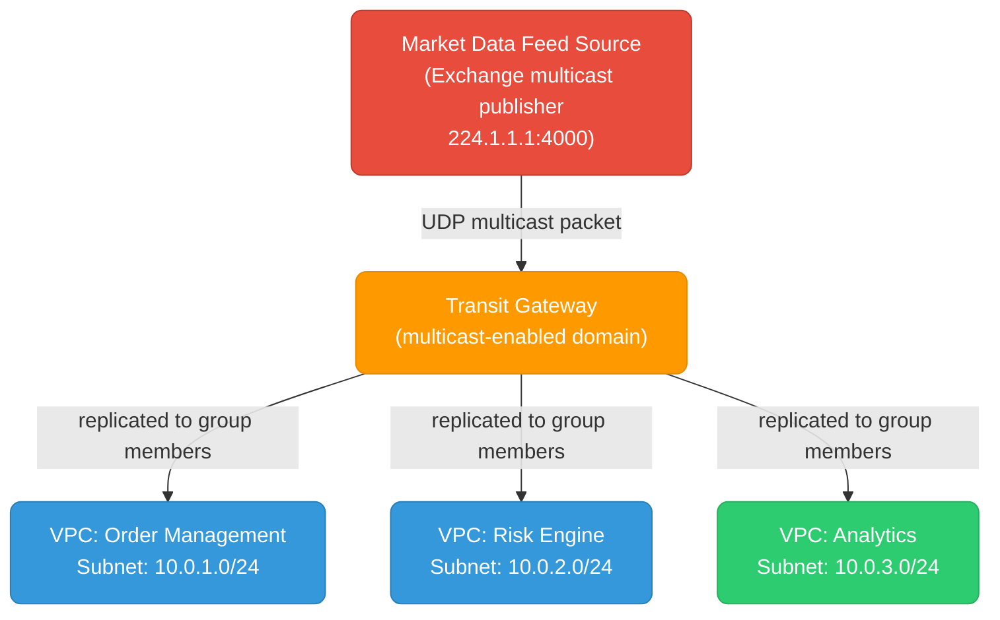

# Low-Latency Network Architectures

For High-Frequency Trading (HFT) and financial exchange systems, standard cloud networking introduces unacceptable latency. This file covers the three pillars of ultra-low-latency networking: exchange connectivity, multicast market data, and kernel bypass.

---

## Why Standard Cloud Networking Is Too Slow

```
Standard internet path (trading app → exchange):
  App → EC2/GCE → VPC router → Internet GW → ISP → Exchange
  Latency: 5–50ms (internet) + kernel overhead (~50–200μs per hop)

Optimized HFT path:
  App → NIC (DPDK) → Direct Connect/Dedicated Line → Exchange colocation
  Latency: 50–500μs end-to-end, sub-10μs for kernel-bypassed local ops
```

Every layer adds latency. HFT eliminates as many layers as possible.

---

## 1. Exchange Connectivity

### The Problem with Public Internet

Standard HTTPS/TCP over the public internet for trading has three fundamental problems:
- **Variable latency** — congestion, routing changes, packet loss cause jitter (spikes from 1ms to 100ms)
- **Kernel overhead** — each packet goes through the Linux TCP/IP stack (~10–50μs of CPU time)
- **Shared infrastructure** — you're competing for bandwidth with other traffic

For context: a stock price can move in 10μs. A 5ms network jitter means you're acting on data that's 500,000 "ticks" stale.

### AWS Direct Connect

Direct Connect is a **dedicated private fiber** from your on-prem/colo facility to AWS — bypassing the public internet entirely.



**Key configuration points:**

```bash
# Direct Connect connection (provisioned via AWS Console or partner)
# After physical fiber is in place:

# Create a Virtual Interface (VIF) — the logical BGP session
aws directconnect create-private-virtual-interface \
  --connection-id dxcon-xxxxxxxx \
  --new-private-virtual-interface '{
    "virtualInterfaceName": "trading-vif",
    "vlan": 100,
    "asn": 65000,
    "mtu": 9001,
    "authKey": "bgp-md5-key",
    "amazonAddress": "169.254.0.1/30",
    "customerAddress": "169.254.0.2/30",
    "virtualGatewayId": "vgw-xxxxxxxx"
  }'

# Verify BGP session is UP
aws directconnect describe-virtual-interfaces \
  --virtual-interface-id dxvif-xxxxxxxx \
  --query 'virtualInterfaces[0].bgpPeers[0].bgpStatus'
# → "up"
```

### BGP Tuning for HFT

Standard BGP convergence time (when a route changes) is 30–90 seconds. That's catastrophic for trading. Tune it:

```
# On your BGP router (Cisco/Juniper/FRRouting):
neighbor 169.254.0.1 timers 3 9          # hello=3s, hold=9s (default: 60/180)
neighbor 169.254.0.1 timers connect 5    # retry on failure: 5s

# BFD (Bidirectional Forwarding Detection) — detects link failure in <1 second
neighbor 169.254.0.1 bfd
bfd interval 300 min_rx 300 multiplier 3 # 300ms intervals, 3 misses = 900ms failover
```

### Active-Active Redundancy

For exchanges with strict uptime SLAs, run **two Direct Connect connections** from two different colo facilities (different physical buildings) in active-active mode:

```
  Colo A ──DX─→ AWS Direct Connect Location 1
  Colo B ──DX─→ AWS Direct Connect Location 2
                ↓ both active, BGP ECMP load balancing
              Trading VPC
```

```bash
# Direct Connect Gateway links BOTH VIFs to the same VPC
aws directconnect create-direct-connect-gateway \
  --direct-connect-gateway-name trading-dcg \
  --amazon-side-asn 64512

# Attach both VIFs to the gateway — AWS routes over both automatically
aws directconnect create-direct-connect-gateway-association \
  --direct-connect-gateway-id dcg-xxxxxxxx \
  --gateway-id vgw-xxxxxxxx
```

### On-Premises / Co-location Scenario (Non-AWS)

When colocated in the same building as the exchange (e.g., NSE's colo at Powai, BSE's at Goregaon):

```
Physical cross-connect: 10GbE fiber patch from your rack → exchange switch
  → Latency: 1–10μs (speed of light through fiber in the building)
  → No routers, no internet, just a Layer 2 direct link

Your server
  ├── NIC 1: cross-connect to exchange (trading traffic)
  └── NIC 2: management network → internet → your cloud
```

---

## 2. Multicast Routing for Market Data

### What Multicast Is

UDP Multicast sends **one packet that reaches many receivers simultaneously** without the sender transmitting N copies. Every major exchange (NSE, BSE, CME, NASDAQ) distributes market data (tick data, order book updates) via multicast.

```
Unicast (normal):    Server → sends 1000 copies → 1000 clients   (1000x bandwidth)
Broadcast:           Server → sends to everyone → 1000 clients   (wastes bandwidth)
Multicast:           Server → sends 1 copy → multicast group → 1000 clients (1x bandwidth)
```

Multicast uses IP addresses in the **224.0.0.0/4** range. Clients "join" a multicast group to receive packets for that feed.

### The Problem in VPCs

By default, VPCs do not support IP multicast. AWS VPC is a software-defined network that doesn't forward multicast packets. If your market data feed publishes to `224.1.1.1:4000`, your EC2 instances won't receive it without special configuration.

### Solution: AWS Transit Gateway Multicast

AWS Transit Gateway (TGW) supports multicast routing — the only AWS service that does.



**Setup:**

```bash
# 1. Create multicast-enabled Transit Gateway
aws ec2 create-transit-gateway \
  --options '{
    "MulticastSupport": "enable",
    "DefaultRouteTableAssociation": "enable",
    "DefaultRouteTablePropagation": "enable"
  }'

# 2. Create a multicast domain
aws ec2 create-transit-gateway-multicast-domain \
  --transit-gateway-id tgw-xxxxxxxx \
  --options '{
    "Igmpv2Support": "enable",
    "StaticSourcesSupport": "disable",
    "AutoAcceptSharedAssociations": "disable"
  }'

# 3. Associate subnets with the multicast domain
aws ec2 associate-transit-gateway-multicast-domain \
  --transit-gateway-multicast-domain-id tgw-mcast-domain-xxxxxxxx \
  --transit-gateway-attachment-id tgw-attach-xxxxxxxx \
  --subnet-ids subnet-xxxxxxxx subnet-yyyyyyyy

# 4. Register the source (the EC2/appliance that publishes market data)
aws ec2 register-transit-gateway-multicast-group-sources \
  --transit-gateway-multicast-domain-id tgw-mcast-domain-xxxxxxxx \
  --group-ip-address 224.1.1.1 \
  --network-interface-ids eni-xxxxxxxx    # ENI of the feed publisher

# 5. Register subscribers (instances that need the feed)
aws ec2 register-transit-gateway-multicast-group-members \
  --transit-gateway-multicast-domain-id tgw-mcast-domain-xxxxxxxx \
  --group-ip-address 224.1.1.1 \
  --network-interface-ids eni-aaa eni-bbb eni-ccc
```

**On each subscriber instance:**

```bash
# Join multicast group (Linux)
ip maddress add 224.1.1.1 dev eth0

# Or via application (Python example)
import socket, struct

sock = socket.socket(socket.AF_INET, socket.SOCK_DGRAM, socket.IPPROTO_UDP)
sock.setsockopt(socket.SOL_SOCKET, socket.SO_REUSEADDR, 1)
sock.bind(('', 4000))

# Join multicast group
mreq = struct.pack('4sL', socket.inet_aton('224.1.1.1'), socket.INADDR_ANY)
sock.setsockopt(socket.IPPROTO_IP, socket.IP_ADD_MEMBERSHIP, mreq)

while True:
    data, addr = sock.recvfrom(65535)
    process_tick(data)
```

### IGMP — How Membership Works

IGMP (Internet Group Management Protocol) is how instances tell the network "I want to receive multicast group X":
- **IGMPv2 Join**: instance sends a join report to the multicast group address
- **IGMPv2 Leave**: instance leaves the group
- **TGW Querier**: TGW periodically sends IGMP queries to learn which instances are still subscribed

```bash
# Verify TGW sees your group members
aws ec2 search-transit-gateway-multicast-groups \
  --transit-gateway-multicast-domain-id tgw-mcast-domain-xxxxxxxx \
  --filters Name=group-ip-address,Values=224.1.1.1

# On the instance, check group membership
ip maddress show dev eth0
# → inet  224.1.1.1
```

---

## 3. Kernel Bypass — DPDK

### Why the Linux Kernel Is Too Slow

Every packet received by a standard Linux application goes through this path:

```
NIC hardware → interrupt → kernel interrupt handler → softirq
  → network stack (ip_rcv → tcp_rcv / udp_rcv) → socket buffer
  → system call (recvfrom) → user space application

Total overhead: ~5–50μs per packet, unpredictable due to kernel scheduling
```

For HFT, this is too slow and too variable. DPDK (Data Plane Development Kit) **eliminates the kernel from the data path entirely**.

### How DPDK Works

```
Without DPDK:
  NIC → kernel interrupt → kernel TCP/IP stack → socket → app   (50μs+)

With DPDK:
  NIC → DPDK poll mode driver (PMD) in user space → app          (sub-1μs)
```

DPDK:
1. Takes **exclusive control of the NIC** — the kernel never sees those packets
2. Uses **polling** instead of interrupts — the CPU spins in a tight loop checking the NIC (trades CPU for latency)
3. Uses **huge pages** for packet buffers to eliminate TLB misses
4. Pins threads to specific CPU cores (**CPU affinity**) to eliminate context-switch jitter

### Setup

```bash
# Install DPDK
apt-get install dpdk dpdk-dev

# Reserve huge pages (2MB pages, 1024 of them = 2GB)
echo 1024 > /sys/kernel/mm/hugepages/hugepages-2048kB/nr_hugepages
mkdir /mnt/huge
mount -t hugetlbfs nodev /mnt/huge

# Bind a NIC to DPDK's vfio-pci driver (removes it from kernel)
# First identify the NIC's PCI address
dpdk-devbind --status
# → 0000:00:03.0 'Virtio network device' if=eth1 drv=virtio-pci unused=vfio-pci

# Load vfio-pci module
modprobe vfio-pci

# Bind the NIC to DPDK (kernel loses visibility of this NIC)
dpdk-devbind --bind=vfio-pci 0000:00:03.0

# Verify
dpdk-devbind --status
# → 0000:00:03.0 'Virtio network device' drv=vfio-pci unused=virtio-pci
```

### DPDK Application Skeleton (C)

```c
#include <rte_eal.h>
#include <rte_ethdev.h>
#include <rte_mbuf.h>

#define RX_RING_SIZE 1024
#define MBUF_POOL_SIZE 8191

int main(int argc, char *argv[]) {
    // Initialize DPDK EAL (sets up huge pages, CPU affinity, etc.)
    rte_eal_init(argc, argv);

    // Create memory pool for packet buffers
    struct rte_mempool *mbuf_pool = rte_pktmbuf_pool_create(
        "MBUF_POOL", MBUF_POOL_SIZE, 250, 0,
        RTE_MBUF_DEFAULT_BUF_SIZE, rte_socket_id()
    );

    uint16_t port_id = 0;

    // Configure the Ethernet port
    struct rte_eth_conf port_conf = {0};
    rte_eth_dev_configure(port_id, 1, 1, &port_conf);

    // Setup RX queue
    rte_eth_rx_queue_setup(port_id, 0, RX_RING_SIZE,
        rte_eth_dev_socket_id(port_id), NULL, mbuf_pool);

    // Start device
    rte_eth_dev_start(port_id);

    // Poll loop — no interrupts, no kernel, just spin
    struct rte_mbuf *bufs[32];
    while (1) {
        // Receive up to 32 packets in one call
        uint16_t nb_rx = rte_eth_rx_burst(port_id, 0, bufs, 32);

        for (int i = 0; i < nb_rx; i++) {
            // Process packet directly from NIC buffer
            process_market_data_packet(bufs[i]);
            rte_pktmbuf_free(bufs[i]);
        }
        // No sleep — spins at full speed, consuming 100% of one core
    }
}
```

### CPU Isolation for DPDK Cores

The polling core must never be preempted by the OS scheduler. Isolate it:

```bash
# In /etc/default/grub, add to GRUB_CMDLINE_LINUX:
# isolcpus=2,3 nohz_full=2,3 rcu_nocbs=2,3

# This tells the kernel: "never schedule any tasks on cores 2 and 3"
# DPDK pins its polling threads to these isolated cores

# After reboot, verify
cat /sys/devices/system/cpu/isolated
# → 2-3

# Set CPU affinity for DPDK app (cores 2 and 3)
dpdk-app -l 2,3 --socket-mem=1024,0 -- [app args]
```

### DPDK on AWS (ENA + EFA)

AWS Elastic Network Adapter (ENA) supports DPDK via the `ena` PMD driver. For ultra-low latency between EC2 instances, use **Elastic Fabric Adapter (EFA)**:

```bash
# EFA-enabled instance types: c5n, hpc6a, p4d, trn1
# EFA bypasses the kernel TCP/IP stack for inter-instance traffic

# Install EFA driver
./efa_installer.sh

# Check EFA device
fi_info -p efa
# → provider: efa, fabric: EFA-fe80::..., name: efa_0-rdm

# DPDK with EFA: use the efa PMD
dpdk-app -l 0,1,2,3 \
  -a <efa-pci-addr> \
  --vdev='net_efa0' \
  --iova-mode=va \
  -- [app args]
```

EFA uses RDMA (Remote Direct Memory Access) — data is written directly from one machine's memory into another's NIC buffer, bypassing both kernels. Latency: ~2–4μs between instances in the same placement group.

---

## Latency Budget — What Each Layer Costs

```
Layer                      Typical latency     HFT budget
────────────────────────────────────────────────────────
Internet routing           1–50ms              ✗ not acceptable
VPC software routing       10–100μs            borderline
Direct Connect (DX)        0.5–2ms (fiber)     ✓ for non-colo
Colo cross-connect         1–10μs              ✓ best option
Linux kernel TCP/IP stack  10–50μs/packet      borderline
DPDK (kernel bypass)       0.1–2μs/packet      ✓
RDMA/EFA                   2–4μs inter-host    ✓
Shared memory (same host)  0.05–0.1μs          ✓ fastest
```

---

## Summary

| Problem | Solution |
|---------|---------|
| Internet latency/jitter | AWS Direct Connect or physical colo cross-connect |
| BGP failover too slow | BFD (sub-second detection) + tuned BGP timers |
| VPC doesn't support multicast | AWS Transit Gateway with multicast domain |
| Linux kernel adds per-packet overhead | DPDK with poll-mode driver + CPU isolation |
| Inter-instance latency | EFA (RDMA) + placement group |
| CPU scheduling jitter | `isolcpus` + `nohz_full` + `rcu_nocbs` |
