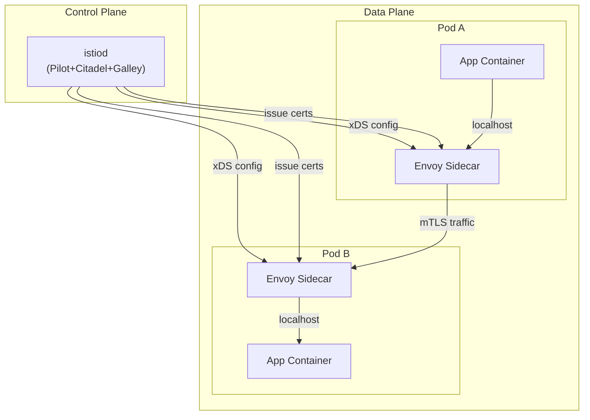
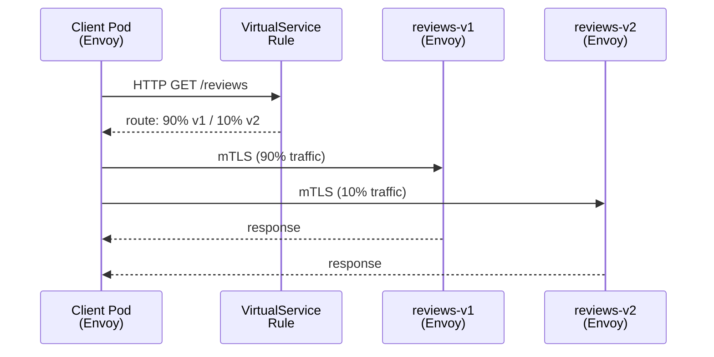
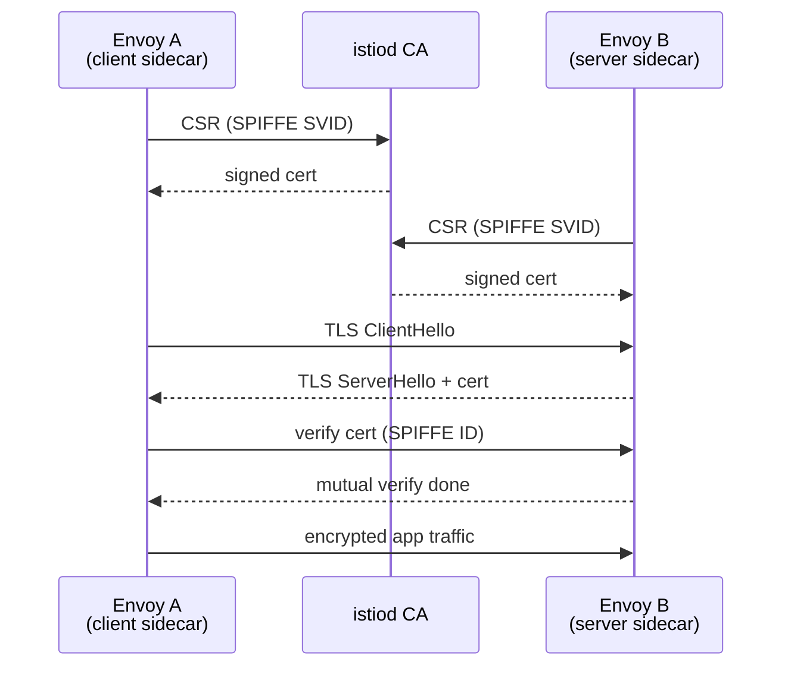
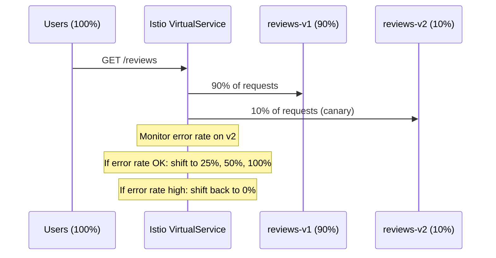

# Service Mesh (Istio / Linkerd)

Sidecar-proxied traffic management, mTLS, and observability for a fleet of microservices — without touching application code. Track how many knowledge checks you clear as you go:

<div class="quiz-progress" data-quiz-progress>
  <span class="quiz-progress-label">0/0 checks</span>
  <span class="quiz-progress-bar"><span class="quiz-progress-fill"></span></span>
</div>

## 1. The Problem

With N microservices, cross-cutting concerns appear in every service:

| Concern | Without mesh | With mesh |
|---|---|---|
| mTLS | Library per service | Sidecar auto-encrypts |
| Retries / timeouts | App code | DestinationRule |
| Circuit breaking | Hystrix/Resilience4j | DestinationRule |
| Distributed traces | Instrumentation code | Envoy auto-injects |
| Access logs | Custom logging | Envoy access log |

<div class="quiz-card">
  <p class="quiz-q">Without a service mesh, where does retry/circuit-breaking logic typically live? Where does it move to with a mesh?</p>
  <button class="quiz-reveal">Reveal answer</button>
  <div class="quiz-a" hidden>Without a mesh: written into application code, often via a library like Hystrix/Resilience4j, duplicated per service. With a mesh: declared once as a <code>DestinationRule</code> and enforced by the sidecar &mdash; no app code changes, no per-language library to maintain.</div>
</div>

---

## 2. Architecture



- **istiod** combines Pilot (service discovery, xDS), Citadel (cert authority), Galley (config validation)
- **Envoy** sidecars intercept all inbound/outbound traffic via iptables rules injected by the init container
- xDS APIs (LDS, RDS, CDS, EDS) push config to proxies without restart

<div class="quiz-card">
  <p class="quiz-q">How does an Envoy sidecar end up seeing all of a pod's inbound and outbound traffic, when the application itself was never reconfigured to route through it?</p>
  <button class="quiz-reveal">Reveal answer</button>
  <div class="quiz-a" hidden>An init container injects iptables rules into the pod at startup that transparently redirect traffic through the Envoy sidecar. The app just talks to <code>localhost</code> as normal &mdash; it has no idea the sidecar is intercepting everything.</div>
</div>

---

## 3. Traffic Management

### VirtualService — routing rules

```yaml
apiVersion: networking.istio.io/v1alpha3
kind: VirtualService
metadata:
  name: reviews
spec:
  hosts: [reviews]
  http:
  - match:
    - headers:
        end-user:
          exact: test-user
    route:
    - destination:
        host: reviews
        subset: v2
  - route:                      # default: canary split
    - destination:
        host: reviews
        subset: v1
      weight: 90
    - destination:
        host: reviews
        subset: v2
      weight: 10
```

### DestinationRule — subset definitions

```yaml
apiVersion: networking.istio.io/v1alpha3
kind: DestinationRule
metadata:
  name: reviews
spec:
  host: reviews
  subsets:
  - name: v1
    labels:
      version: v1
  - name: v2
    labels:
      version: v2
```

### Traffic Flow with Sidecar



<div class="quiz-card">
  <p class="quiz-q">What's the difference in job between a VirtualService and a DestinationRule?</p>
  <button class="quiz-reveal">Reveal answer</button>
  <div class="quiz-a" hidden>VirtualService decides <em>where a request goes</em> &mdash; the routing rules (header matches, weighted splits). DestinationRule defines <em>what the destinations actually are</em> &mdash; the named subsets (e.g. v1, v2) that a VirtualService's routes point at. A VirtualService route is meaningless without the subset it references being defined in a DestinationRule.</div>
</div>

---

## 4. Security

### mTLS — PeerAuthentication

```yaml
# STRICT: only mTLS accepted
apiVersion: security.istio.io/v1beta1
kind: PeerAuthentication
metadata:
  name: default
  namespace: production
spec:
  mtls:
    mode: STRICT   # or PERMISSIVE (plain+mTLS)
```

<div class="toggle-switch">
  <div class="toggle-buttons">
    <button data-toggle-opt="strict" class="active state-ok">STRICT</button>
    <button data-toggle-opt="permissive" class="state-warn">PERMISSIVE</button>
  </div>
  <div class="toggle-panel active" data-toggle-panel="strict">
    Only mTLS is accepted. Any plaintext connection to a workload in this mode is rejected outright.
  </div>
  <div class="toggle-panel" data-toggle-panel="permissive">
    Both plaintext and mTLS are accepted on the same port &mdash; the workload will serve either.
  </div>
</div>

### AuthorizationPolicy

```yaml
apiVersion: security.istio.io/v1beta1
kind: AuthorizationPolicy
metadata:
  name: allow-reviews
  namespace: production
spec:
  selector:
    matchLabels:
      app: reviews
  rules:
  - from:
    - source:
        principals: ["cluster.local/ns/default/sa/productpage"]
    to:
    - operation:
        methods: ["GET"]
```

### mTLS Handshake



SPIFFE ID format: `spiffe://cluster.local/ns/<namespace>/sa/<serviceaccount>`

Step through what that sequence diagram is actually doing, one exchange at a time:

<div class="stepper">
  <div class="stepper-panels">
    <div class="stepper-panel active">
      <strong>1. Both sidecars get certs.</strong> Envoy A and Envoy B each send a CSR carrying their SPIFFE SVID identity to istiod's CA, and each gets back a signed certificate.
    </div>
    <div class="stepper-panel">
      <strong>2. Handshake begins.</strong> Envoy A (the client sidecar) sends a TLS <code>ClientHello</code> to Envoy B.
    </div>
    <div class="stepper-panel">
      <strong>3. Server responds.</strong> Envoy B replies with <code>ServerHello</code> plus its signed certificate.
    </div>
    <div class="stepper-panel">
      <strong>4. Mutual verification.</strong> Envoy A verifies Envoy B's certificate against its SPIFFE ID. Once both sides have verified each other, mutual verification is done &mdash; this is the "mutual" in mTLS: both ends prove identity, not just the server.
    </div>
    <div class="stepper-panel">
      <strong>5. Encrypted traffic flows.</strong> App traffic between the two sidecars now travels over the verified, encrypted mTLS connection &mdash; invisible to both application containers.
    </div>
  </div>
  <div class="stepper-controls">
    <button class="stepper-prev">← Prev</button>
    <span class="stepper-dots"></span>
    <span class="stepper-label"></span>
    <button class="stepper-next">Next →</button>
  </div>
</div>

<div class="quiz-card">
  <p class="quiz-q">During the mTLS handshake, what identity do the two Envoy sidecars actually check against each other's certificate?</p>
  <button class="quiz-reveal">Reveal answer</button>
  <div class="quiz-a" hidden>The SPIFFE ID embedded in the cert (<code>spiffe://cluster.local/ns/&lt;namespace&gt;/sa/&lt;serviceaccount&gt;</code>) &mdash; not a hostname or IP. Both sidecars got that cert signed by istiod's CA during their own CSR step, so verifying it means trusting the same CA the other side trusts.</div>
</div>

---

## 5. Observability

Envoy emits metrics automatically — no app instrumentation needed.

Key metrics:
```
istio_requests_total{source_app, destination_app, response_code}
istio_request_duration_milliseconds_bucket
istio_tcp_connections_opened_total
```

Access logs, distributed traces (Jaeger/Zipkin via B3 headers), and Kiali topology graph come out of the box.

<div class="quiz-card">
  <p class="quiz-q">Do you need to add any tracing or metrics instrumentation code to your application to get these numbers?</p>
  <button class="quiz-reveal">Reveal answer</button>
  <div class="quiz-a" hidden>No. Envoy emits metrics automatically, and access logs, distributed traces, and the Kiali topology graph all come out of the box &mdash; none of it requires touching application code.</div>
</div>

---

## 6. Circuit Breaking & Retries

```yaml
apiVersion: networking.istio.io/v1alpha3
kind: DestinationRule
metadata:
  name: payment
spec:
  host: payment
  trafficPolicy:
    connectionPool:
      tcp:
        maxConnections: 100
      http:
        http1MaxPendingRequests: 50
        maxRequestsPerConnection: 10
    outlierDetection:             # circuit breaker
      consecutiveGatewayErrors: 5
      interval: 10s
      baseEjectionTime: 30s
      maxEjectionPercent: 50
    retries:
      attempts: 3
      perTryTimeout: 2s
      retryOn: "5xx,connect-failure"
```

---

## 7. Linkerd vs Istio

| Feature | Linkerd | Istio |
|---|---|---|
| Proxy | Linkerd2-proxy (Rust) | Envoy (C++) |
| Control plane | Lightweight Go binaries | istiod (heavy) |
| Install complexity | Low (`linkerd install \| kubectl apply`) | High (many CRDs) |
| mTLS | Automatic, zero-config | Requires PeerAuthentication |
| Traffic management | Basic (traffic split) | Full (VirtualService, DR) |
| L7 policy | Limited | Full AuthorizationPolicy |
| Resource usage | ~200 MB / proxy | ~500 MB / proxy |
| Learning curve | Low | High |
| Best for | Simplicity, fast mTLS | Full traffic control |

**Rule of thumb**: start with Linkerd if you just need mTLS + basic observability. Use Istio when you need fine-grained traffic policies, canary deployments, or complex AuthorizationPolicies.

<div class="quiz-card">
  <p class="quiz-q">A team just wants automatic mTLS between services and basic observability, with the lowest possible install complexity. Per the rule of thumb, which should they reach for?</p>
  <button class="quiz-reveal">Reveal answer</button>
  <div class="quiz-a" hidden>Linkerd &mdash; automatic zero-config mTLS, low install complexity, lower resource usage per proxy. Istio is the better call once they need fine-grained traffic policies, canary deployments, or complex AuthorizationPolicies, not before.</div>
</div>

---

## 8. Fault Injection — Chaos Testing via Istio

Istio can inject faults at the network level without touching application code — perfect for chaos engineering.

```yaml
# Inject HTTP 503 errors for 20% of requests to reviews
apiVersion: networking.istio.io/v1alpha3
kind: VirtualService
metadata:
  name: reviews-fault
spec:
  hosts: [reviews]
  http:
  - fault:
      abort:
        percentage:
          value: 20.0
        httpStatus: 503
    route:
    - destination:
        host: reviews
        subset: v1
---
# Inject 5-second delay for 10% of requests (test timeout handling)
apiVersion: networking.istio.io/v1alpha3
kind: VirtualService
metadata:
  name: ratings-delay
spec:
  hosts: [ratings]
  http:
  - fault:
      delay:
        percentage:
          value: 10.0
        fixedDelay: 5s
    route:
    - destination:
        host: ratings
        subset: v1
```

<div class="tab-group">
  <div class="tab-buttons">
    <button data-tab="abort" class="active">Abort</button>
    <button data-tab="delay">Delay</button>
  </div>
  <div class="tab-panels">
    <div class="tab-panel active" data-tab-panel="abort">
      Returns an HTTP error status (e.g. <code>503</code>) for a percentage of requests instead of routing them &mdash; simulates the destination actually failing, to test how callers handle errors.
    </div>
    <div class="tab-panel" data-tab-panel="delay">
      Holds a percentage of requests for a fixed extra duration before routing them on &mdash; simulates a slow destination, to test timeout handling. Nothing errors, it's just late.
    </div>
  </div>
</div>

<div class="quiz-card">
  <p class="quiz-q">A delay fault of 5s is injected on 10% of requests to ratings. Does that 10% of requests fail, or does it just succeed slower?</p>
  <button class="quiz-reveal">Reveal answer</button>
  <div class="quiz-a" hidden>It succeeds, just later. A delay fault adds latency &mdash; it's not an error condition. That's exactly what makes it useful for testing timeout handling specifically, as opposed to an abort fault, which does return a real error status.</div>
</div>

---

## 9. Timeouts and Retries

```yaml
apiVersion: networking.istio.io/v1alpha3
kind: VirtualService
metadata:
  name: reviews
spec:
  hosts: [reviews]
  http:
  - route:
    - destination:
        host: reviews
        subset: v1
    timeout: 3s                     # total request timeout
    retries:
      attempts: 3
      perTryTimeout: 1s             # each attempt gets 1s (total: 3s across 3 attempts)
      retryOn: "5xx,connect-failure,reset"   # retry on these conditions
```

**retryOn conditions:**

| Condition | When it retries |
|-----------|----------------|
| `5xx` | Any 5xx response from upstream |
| `connect-failure` | TCP connection failed |
| `reset` | Connection reset |
| `retriable-4xx` | 409 Conflict (safe to retry) |
| `gateway-error` | 502, 503, 504 |

**Important:** Only retry **idempotent** operations (GET, PUT). Never auto-retry POST without idempotency keys.

<div class="quiz-card">
  <p class="quiz-q">With <code>timeout: 3s</code> and <code>retries.attempts: 3</code> / <code>perTryTimeout: 1s</code>, does each of the 3 attempts get its own fresh 3-second window?</p>
  <button class="quiz-reveal">Reveal answer</button>
  <div class="quiz-a" hidden>No. <code>perTryTimeout</code> budgets each individual attempt (1s each), but the outer <code>timeout</code> caps the whole request across all attempts &mdash; 3 attempts &times; 1s = 3s total, exactly matching the 3s overall timeout. The attempts share one clock, they don't each reset it.</div>
</div>

---

## 10. Traffic Shifting — Canary Deployment



<div class="stepper">
  <div class="stepper-panels">
    <div class="stepper-panel active">
      <strong>1. Canary starts.</strong> 90% of traffic goes to <code>reviews-v1</code> (stable), 10% to <code>reviews-v2</code> (canary).
    </div>
    <div class="stepper-panel">
      <strong>2. Monitor.</strong> Watch the error rate on v2 specifically &mdash; not the aggregate across both versions.
    </div>
    <div class="stepper-panel">
      <strong>3. Healthy → ramp up.</strong> If v2's error rate looks fine, shift more traffic its way: 25%, then 50%, then 100%.
    </div>
    <div class="stepper-panel">
      <strong>4. Unhealthy → roll back.</strong> If v2's error rate goes high at any point, shift its traffic back to 0% immediately &mdash; don't wait for it to get worse.
    </div>
  </div>
  <div class="stepper-controls">
    <button class="stepper-prev">← Prev</button>
    <span class="stepper-dots"></span>
    <span class="stepper-label"></span>
    <button class="stepper-next">Next →</button>
  </div>
</div>

```bash
# Gradually shift traffic using kubectl patch
kubectl patch virtualservice reviews --type=json \
  -p='[{"op":"replace","path":"/spec/http/0/route/0/weight","value":75},
       {"op":"replace","path":"/spec/http/0/route/1/weight","value":25}]'

# Monitor canary via Prometheus
# istio_requests_total{destination_service="reviews",destination_version="v2",response_code!~"5.."}
# / istio_requests_total{destination_service="reviews",destination_version="v2"}
# Alert if error rate > 1% on v2 → shift back to 0%
```

<div class="quiz-card">
  <p class="quiz-q">The canary's Prometheus alert threshold is "error rate > 1% on v2." That threshold gets crossed mid-rollout. What's the correct response?</p>
  <button class="quiz-reveal">Reveal answer</button>
  <div class="quiz-a" hidden>Shift v2's traffic weight back to 0% &mdash; roll back, don't keep ramping up. The whole point of watching v2's error rate in isolation during a canary is to catch this before it's serving 100% of traffic.</div>
</div>
