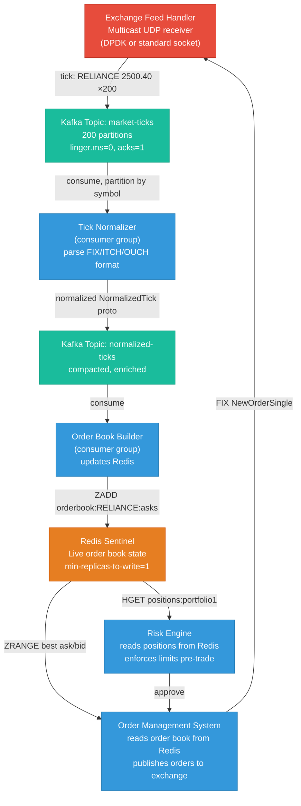

# Trading Data Streaming — Broker Tuning, Kafka HFT Config, Redis Order Book

Message brokers and in-memory stores for financial market workloads where microseconds matter and stale data costs money.

---

## The Core Tension: Latency vs Throughput

Standard broker defaults are optimized for **throughput** — batch records, flush periodically, maximize bytes per second. For trading, you need **latency** — get each message out as fast as possible, even if it means sacrificing throughput.

```
Throughput-optimized (default):         Latency-optimized (HFT):
  batch.size = 16384 (16KB)               batch.size = 1 (no batching)
  linger.ms = 5 (wait 5ms to batch)       linger.ms = 0 (send immediately)
  compression = snappy                    compression = none (no CPU overhead)
  acks = 1 (wait for leader only)         acks = 1 (fastest acknowledgment)
  → throughput: high                      → P99 latency: <1ms
  → P99 latency: 50-200ms                 → throughput: lower
```

This is a hard tradeoff. You cannot have both at extremes. Trading systems explicitly choose latency.

---

## 1. Market Open Spikes — Sizing for the Burst

Trading volume is not uniform. The worst case is **market open** (9:15 AM IST for NSE):

```
Normal trading hour:   ~50,000 messages/sec
Market open (9:15):    ~500,000 messages/sec (10x spike, lasts 2-5 minutes)
Circuit breaker event: ~1,000,000 messages/sec (everyone reacts simultaneously)
```

Your broker must be **pre-provisioned** for the burst, not auto-scaled into it. Auto-scaling adds new brokers in 2-5 minutes — the spike is already over.

**Capacity planning rule:** Size for 3× peak observed, not average.

---

## 2. Kafka HFT Configuration

### Producer Tuning (Latency-First)

```properties
# kafka-producer-latency.properties

# ── Batching ─────────────────────────────────────────────────
# linger.ms=0: don't wait to form batches — send each record immediately
linger.ms=0

# batch.size: max bytes per batch. With linger.ms=0, batches form only
# when records arrive faster than the network can drain them.
# Keep small so individual records aren't delayed waiting for a batch to fill.
batch.size=1024

# ── Acknowledgment ───────────────────────────────────────────
# acks=1: wait only for the leader to confirm write.
# acks=all: wait for all ISR replicas → adds replication latency (~1-3ms)
# For order flow: acks=1 (can replay from FIX log if broker fails)
# For positions/P&L: acks=all (must not lose)
acks=1

# ── Compression ──────────────────────────────────────────────
# none: no CPU overhead, no decompression latency on consumer
# snappy/lz4 adds 100-500μs — unacceptable for tick data
compression.type=none

# ── Network buffer ───────────────────────────────────────────
# How many unacked requests can be in-flight per connection.
# With max.in.flight=1: strict ordering, but halves throughput
# With max.in.flight=5 + idempotence=true: ordering + higher throughput
max.in.flight.requests.per.connection=1
enable.idempotence=false         # disable for lowest latency (no sequence tracking)

# ── Retries ──────────────────────────────────────────────────
# No retries for market data — a stale retry is worse than a gap
# Your consumer handles gaps via sequence numbers
retries=0
delivery.timeout.ms=5000         # fail fast, let the app handle it

# ── Buffer ───────────────────────────────────────────────────
buffer.memory=67108864           # 64MB local buffer before blocking
```

### Consumer Tuning (Latency-First)

```properties
# kafka-consumer-latency.properties

# ── Polling ──────────────────────────────────────────────────
# fetch.min.bytes=1: return records immediately, don't wait to fill a batch
fetch.min.bytes=1

# fetch.max.wait.ms=0: don't wait at all for min bytes to accumulate
fetch.max.wait.ms=0              # default is 500ms — catastrophic for HFT

# max.poll.records: how many records per poll() call.
# Lower = lower processing latency per batch; higher = better throughput
max.poll.records=100             # tune based on processing time per record

# ── Offset management ────────────────────────────────────────
# auto.commit: commit offsets automatically every auto.commit.interval.ms
# For trading: use manual commit after processing to prevent message loss
enable.auto.commit=false
# In code: consumer.commitSync() after processing each batch

# ── Session timeout ──────────────────────────────────────────
# How long before the broker considers a consumer dead (triggers rebalance)
# Lower = faster failover; too low = spurious rebalances under GC pauses
session.timeout.ms=10000         # 10s (don't go lower without tuning GC)
heartbeat.interval.ms=3000       # must be < session.timeout.ms / 3

# ── Isolation level ──────────────────────────────────────────
# read_committed: only see committed transactions (needed for exactly-once)
# read_uncommitted: see all records immediately (lower latency)
isolation.level=read_uncommitted # for tick data where gaps are OK
```

### Broker Tuning (Kafka 3.8.x)

```properties
# server.properties — broker-side latency tuning

# ── I/O threads ─────────────────────────────────────────────
# Number of threads handling disk I/O.
# Rule: 2 × number of physical disks (not logical volumes)
num.io.threads=16                # for 8-disk server

# Network threads handle socket reads/writes
num.network.threads=8

# ── Log flush ────────────────────────────────────────────────
# How often to force fsync to disk. Default: only on segment roll.
# More frequent fsync = lower tail latency, but more disk I/O
log.flush.interval.messages=1   # fsync after every message (safest, more I/O)
# OR:
log.flush.interval.ms=100       # fsync every 100ms (balance)

# ── Replication ──────────────────────────────────────────────
# min.insync.replicas: how many replicas must confirm write (with acks=all)
# Set to 2 for trading partitions: 1 leader + 1 replica confirms
min.insync.replicas=2

# replica.lag.time.max.ms: remove a replica from ISR if it falls behind
# Lower = faster ISR shrinkage on slow replicas; higher = more stable ISR
replica.lag.time.max.ms=10000

# ── Partition distribution ───────────────────────────────────
# Partitions for a trading topic:
# Rule: partitions = max_consumers_in_group × 2 (headroom for scaling)
# For NSE equity feed (1000+ symbols): 100-200 partitions
# Each partition is a separate log, processed by one consumer at a time

# ── Socket buffers ───────────────────────────────────────────
# Must match OS-level socket buffer settings (see sysctl below)
socket.send.buffer.bytes=1048576     # 1MB
socket.receive.buffer.bytes=1048576  # 1MB
socket.request.max.bytes=104857600   # 100MB max request size

# ── Express broker types (KRaft mode, Kafka 3.8.x) ──────────
# With KRaft (no ZooKeeper), controller and broker can be co-located:
# process.roles=broker,controller  (combined — simpler for smaller clusters)
# process.roles=broker             (dedicated broker — preferred for HFT)
# process.roles=controller         (dedicated controller node)
process.roles=broker
node.id=1                            # unique per node
controller.quorum.voters=1@controller1:9093,2@controller2:9093,3@controller3:9093
```

### OS-Level Tuning for Kafka Hosts

```bash
# /etc/sysctl.conf additions for Kafka brokers

# Network buffers — must be large enough for burst traffic
net.core.rmem_max=134217728          # 128MB max receive buffer
net.core.wmem_max=134217728          # 128MB max send buffer
net.core.rmem_default=8388608        # 8MB default
net.core.wmem_default=8388608

net.ipv4.tcp_rmem=4096 8388608 134217728
net.ipv4.tcp_wmem=4096 8388608 134217728

# Backlog for incoming connections
net.core.somaxconn=65535
net.ipv4.tcp_max_syn_backlog=65535

# Disable transparent huge pages (causes latency spikes)
echo never > /sys/kernel/mm/transparent_hugepage/enabled
echo never > /sys/kernel/mm/transparent_hugepage/defrag

# Disk I/O scheduler — deadline or noop for SSDs, not cfq
echo deadline > /sys/block/sda/queue/scheduler
# For NVMe:
echo none > /sys/block/nvme0n1/queue/scheduler

# Apply
sysctl -p
```

### Partition Assignment for Symbol-Level Ordering

In equity trading, you want all messages for a given symbol (e.g., RELIANCE, INFY) to go to the **same partition** — this preserves per-symbol ordering without requiring global ordering:

```python
from confluent_kafka import Producer

producer = Producer({
    'bootstrap.servers': 'kafka-1:9092,kafka-2:9092,kafka-3:9092',
    'linger.ms': 0,
    'batch.size': 1024,
    'compression.type': 'none',
    'acks': 1,
})

def publish_tick(symbol: str, tick_data: dict):
    import json
    producer.produce(
        topic='market-ticks',
        key=symbol.encode(),          # ← partition key: same symbol → same partition
        value=json.dumps(tick_data).encode(),
        callback=delivery_report
    )
    producer.poll(0)                  # non-blocking, flush async

def delivery_report(err, msg):
    if err:
        # Alert: missed tick — log with sequence number for gap detection
        alert_missed_tick(msg.key(), err)
```

---

## 3. Redis for Live Order Book — Consistency and Failover

### The Order Book Data Structure

A live order book holds all outstanding bids and asks for a symbol, sorted by price. It must be:
- **Consistent**: every consumer sees the same state (no two order management systems acting on stale books)
- **Fast**: updates arrive every microsecond during market hours
- **Durable on failover**: a Redis primary failure cannot cause position mismatches

```
Order Book for RELIANCE:
  Asks (sell orders), sorted ascending:
    2500.50 × 500 shares
    2500.45 × 1000 shares
    2500.40 × 200 shares   ← best ask

  Bids (buy orders), sorted descending:
    2500.35 × 800 shares   ← best bid
    2500.30 × 1500 shares
    2500.25 × 300 shares
```

Redis Sorted Sets (`ZADD`/`ZRANGE`) are the natural fit: price is the score, quantity is in the value.

### Redis Data Model for Order Book

```python
import redis

r = redis.Redis(host='redis-primary', port=6379, decode_responses=True)

def update_order_book(symbol: str, side: str, price: float, qty: int):
    key = f"orderbook:{symbol}:{side}"  # e.g., "orderbook:RELIANCE:asks"
    
    if qty == 0:
        # Price level removed (all orders at this price filled/cancelled)
        r.zrem(key, str(price))
    else:
        # Update or insert price level
        r.zadd(key, {str(price): price})  # score=price for sorting
        r.hset(f"orderbook:{symbol}:{side}:qty", str(price), qty)

def get_best_bid(symbol: str) -> tuple:
    """Return (price, qty) of best bid (highest price)"""
    result = r.zrange(f"orderbook:{symbol}:bids", -1, -1, withscores=True)
    if result:
        price_str, score = result[0]
        qty = r.hget(f"orderbook:{symbol}:bids:qty", price_str)
        return float(price_str), int(qty)
    return None, None

def get_order_book_snapshot(symbol: str, depth: int = 5):
    """Get top N bids and asks"""
    asks = r.zrange(f"orderbook:{symbol}:asks", 0, depth-1, withscores=True)
    bids = r.zrange(f"orderbook:{symbol}:bids", -(depth), -1, withscores=True)
    bids.reverse()   # highest bid first
    return {"asks": asks, "bids": bids}
```

### Redis Configuration for Strict Consistency

```conf
# redis.conf — production trading config

# ── Persistence ──────────────────────────────────────────────
# AOF (Append-Only File) with fsync on every write
# This is the safest option: every write is durable before ack
appendonly yes
appendfsync always                # fsync on every WRITE command
                                  # alternative: everysec (1 second data loss risk)
                                  # never = OS decides (highest loss risk)
aof-rewrite-incremental-fsync yes

# RDB snapshots as a secondary backup
save 900 1                        # save if 1 key changed in 900s
save 300 10                       # save if 10 keys changed in 300s
save 60 10000                     # save if 10000 keys changed in 60s

# ── Memory ───────────────────────────────────────────────────
# For order books: do NOT evict data (eviction = silent data loss)
maxmemory 8gb
maxmemory-policy noeviction       # return OOM error instead of evicting keys

# ── Replication ──────────────────────────────────────────────
# On replica: refuse reads if replication is broken
# (prevents stale order book reads during partition)
replica-serve-stale-data no       # refuse reads if replica is not synced

# Wait for replica acknowledgment before confirming writes
# min-replicas-to-write 1: require at least 1 replica to confirm
# min-replicas-max-lag 1: replica must be within 1 second of primary
min-replicas-to-write 1
min-replicas-max-lag 1
# Combination: write is only ACKed when at least 1 replica confirms within 1s
# This prevents data loss if primary fails immediately after a write

# ── Network ──────────────────────────────────────────────────
tcp-keepalive 60
timeout 0                         # don't close idle connections
tcp-backlog 511

# ── Latency monitoring ───────────────────────────────────────
latency-monitor-threshold 100     # alert on any command taking >100μs
slowlog-log-slower-than 1000      # log commands slower than 1ms (1000μs)
slowlog-max-len 256
```

### Redis Sentinel vs Redis Cluster for Trading

```
Redis Sentinel:
  ├── 1 primary + N replicas
  ├── Sentinel monitors primary health
  ├── Automatic failover in ~30-60 seconds (configurable)
  ├── Clients must support Sentinel protocol
  └── Best for: single order book, simpler ops

Redis Cluster:
  ├── Data sharded across multiple primaries
  ├── Each shard has replicas
  ├── Automatic failover per shard in ~15-20 seconds
  ├── Cross-shard operations (MULTI/EXEC) limited
  └── Best for: many symbols, horizontal scaling
```

For trading order books where **consistency during network partitions matters most**, use Sentinel with `min-replicas-to-write` rather than Cluster — Redis Cluster's partition handling can result in split-brain:

```python
# Python client with Sentinel (auto-discovers primary after failover)
from redis.sentinel import Sentinel

sentinel = Sentinel(
    [('sentinel-1', 26379), ('sentinel-2', 26379), ('sentinel-3', 26379)],
    socket_timeout=0.5,
    socket_connect_timeout=0.5,
    retry_on_timeout=True
)

# Always write to primary
primary = sentinel.master_for('trading-orderbook', socket_timeout=0.5)

# Can read from replica (use only for non-critical reads like dashboards)
replica = sentinel.slave_for('trading-orderbook', socket_timeout=0.5)
```

### Handling Network Partition — The CAP Choice

During a network partition between Redis primary and replica:

```
Option A (CP — Consistency + Partition tolerance):
  config: min-replicas-to-write 1
  Result: Primary REFUSES writes if no replica is reachable.
  → Order book updates fail → safe: no split-brain, but brief write outage
  → Correct choice for trading: better to halt than to corrupt positions

Option B (AP — Availability + Partition tolerance):
  config: min-replicas-to-write 0
  Result: Primary continues accepting writes alone.
  → Both primary and replica can diverge → split-brain
  → Two order management systems see different books → dangerous
```

**Trading systems must choose CP.** A brief write outage (1-5 seconds during failover) is acceptable. Split-brain positions are not.

### Detecting and Recovering from Stale Data

```python
import redis
import time

class OrderBookClient:
    def __init__(self, sentinel_hosts):
        from redis.sentinel import Sentinel
        self.sentinel = Sentinel(sentinel_hosts)
        self._primary = None
        self._last_heartbeat = 0

    def get_primary(self):
        # Re-resolve primary on each call (handles failover)
        return self.sentinel.master_for('trading-orderbook')

    def update_with_staleness_check(self, symbol, side, price, qty, event_seq_no):
        primary = self.get_primary()

        # Check if our sequence number is ahead of what Redis has
        # (detect if Redis lost data during failover)
        last_seq = primary.get(f"seq:{symbol}")
        if last_seq and int(last_seq) > event_seq_no:
            # Redis has a newer sequence — our update is stale, skip
            return

        pipe = primary.pipeline(transaction=True)
        pipe.set(f"seq:{symbol}", event_seq_no)        # update sequence
        pipe.zadd(f"orderbook:{symbol}:{side}", {str(price): price})
        pipe.hset(f"orderbook:{symbol}:{side}:qty", str(price), qty)
        pipe.execute()

    def health_check(self):
        try:
            self.get_primary().ping()
            return True
        except redis.exceptions.ConnectionError:
            return False
```

---

## 4. End-to-End Architecture — Market Data to Order Execution



---

## Configuration Quick Reference

### Kafka Producer (Latency Mode)
```
linger.ms=0, batch.size=1024, acks=1, compression=none, retries=0
```

### Kafka Consumer (Latency Mode)
```
fetch.min.bytes=1, fetch.max.wait.ms=0, enable.auto.commit=false, max.poll.records=100
```

### Kafka Broker (HFT)
```
num.io.threads=16, log.flush.interval.messages=1, min.insync.replicas=2
```

### Redis (Trading)
```
appendfsync=always, maxmemory-policy=noeviction,
replica-serve-stale-data=no, min-replicas-to-write=1, min-replicas-max-lag=1
```
