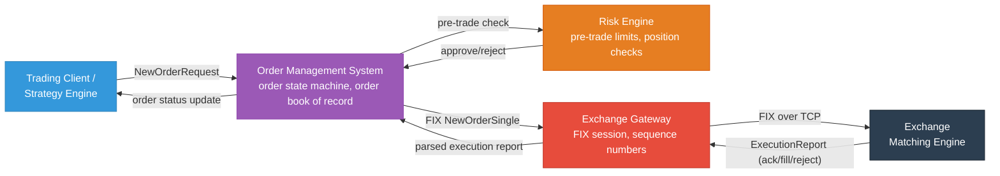
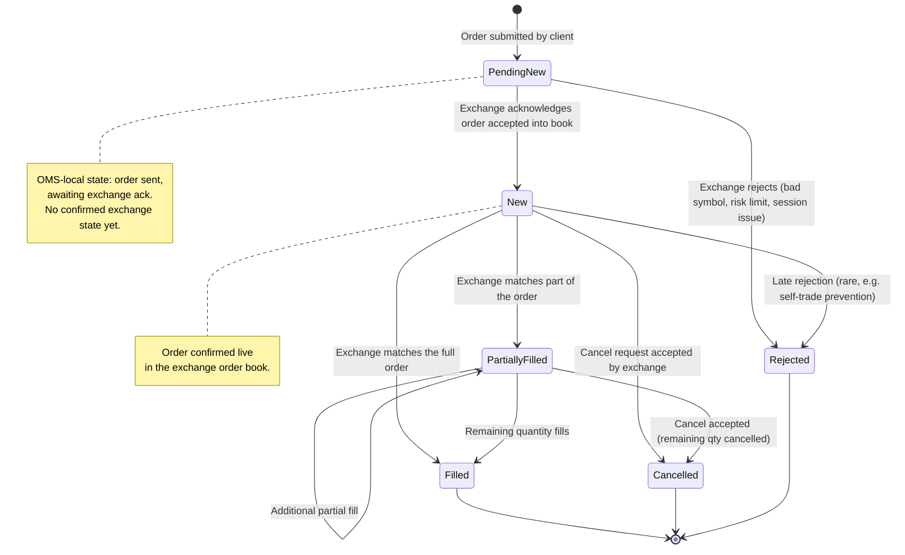
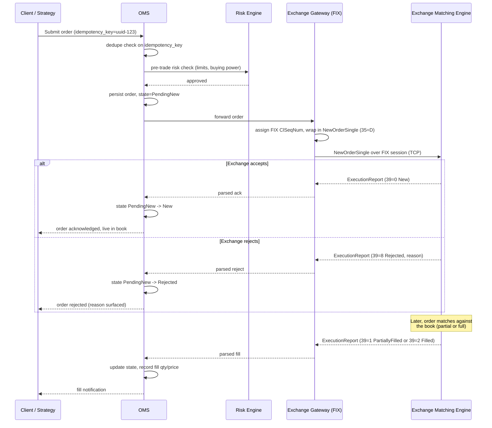
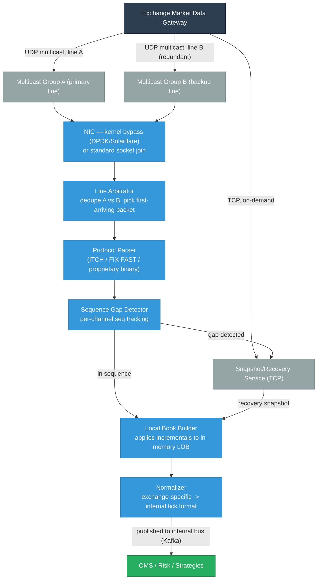
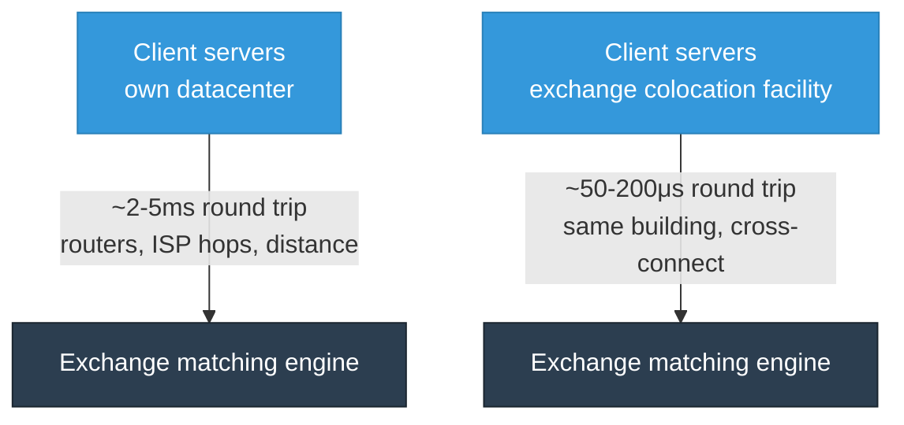
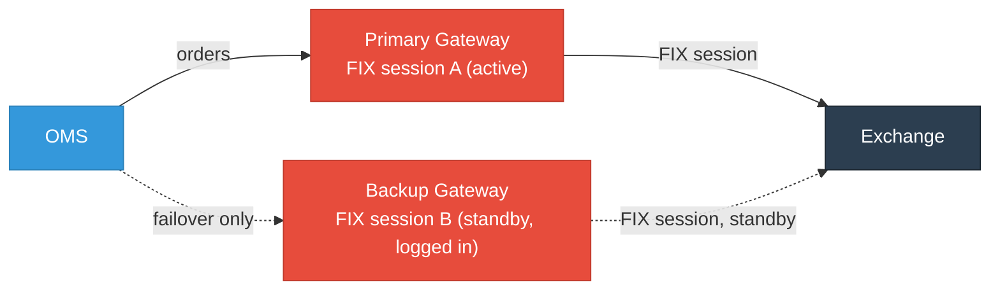

# Trading System Architecture for Infra/SRE Engineers

This is a reference for infrastructure and SRE engineers who **support** trading systems — not for building trading strategies or matching engines from scratch. The goal is to reason correctly about latency, failure modes, retries, and monitoring for OMS, market data, and exchange connectivity, without needing quant/trading domain expertise.

Companion files: [trading-data-streaming.md](./trading-data-streaming.md) (Kafka/Redis tuning for market data), [fintech-security.md](./fintech-security.md) (SEBI/CERT-In compliance), [fintech-compliance.md](./fintech-compliance.md) (regulatory deep-dive), [low-latency-networking.md](./low-latency-networking.md) (DPDK, EFA, kernel bypass).

Most sections below end with a **knowledge check** — try to answer before revealing:

<div class="quiz-progress" data-quiz-progress>
  <span class="quiz-progress-label">0/0 checks</span>
  <span class="quiz-progress-bar"><span class="quiz-progress-fill"></span></span>
</div>

---

## Why Trading Infra Is Different

<div class="tab-group">
  <div class="tab-buttons">
    <button data-tab="normal" class="active">Normal web service</button>
    <button data-tab="trading">Trading system</button>
  </div>
  <div class="tab-panels">
    <div class="tab-panel active" data-tab-panel="normal">
      <ul>
        <li>Retry on failure = safe</li>
        <li>Stale cache = minor inconvenience</li>
        <li>5s failover = acceptable</li>
        <li>Horizontal autoscaling = fine</li>
        <li>Idempotency = nice-to-have</li>
      </ul>
    </div>
    <div class="tab-panel" data-tab-panel="trading">
      <ul>
        <li>Retry on failure = can double-execute an order</li>
        <li>Stale market data = trading on wrong price</li>
        <li>5s failover = missed the entire price move</li>
        <li>Autoscaling = too slow for the burst window</li>
        <li>Idempotency = mandatory, regulator-checked</li>
      </ul>
    </div>
  </div>
</div>

Every design decision below traces back to one constraint: **an order, once sent to an exchange, is a real financial commitment.** Infra failure modes that are merely annoying elsewhere (dupe requests, brief staleness, slow scale-out) are money-losing or compliance-breaking here.

<div class="quiz-card">
  <p class="quiz-q">Why is "just retry on failure" — a safe default for a normal web service — actively dangerous for order submission?</p>
  <button class="quiz-reveal">Reveal answer</button>
  <div class="quiz-a" hidden>Because an order, once sent to an exchange, is a real financial commitment. A retry that looks like a harmless dupe request elsewhere can double-execute an order here &mdash; the failure mode isn't "annoying," it's money-losing or compliance-breaking.</div>
</div>

---

## 1. Order Management System (OMS) — Architecture Overview

The OMS is the system of record for every order a firm sends to an exchange. It does not decide *what* to trade (that's the strategy/trader) — it tracks order state, enforces risk checks, and manages the conversation with the exchange gateway.



**Infra-relevant components:**

| Component | What it does | What infra cares about |
|-----------|--------------|------------------------|
| OMS core | Order state machine, persistence | DB write latency, HA/failover, WAL durability |
| Risk engine | Pre-trade checks (position limits, buying power) | Must be in the hot path but can't add >1-2ms |
| Exchange gateway | FIX session management | TCP tuning, colocation, sequence number persistence |
| Order store/DB | Durable record of every order + state transition | Write-ahead durability, point-in-time recovery |
| Drop copy feed | Read-only stream of all fills for reconciliation | Separate from primary order flow, must never block it |

### 1.1 Order Lifecycle State Machine

Every order the OMS sends moves through a well-defined state machine. The states below follow the FIX protocol's `OrdStatus` field conventions, which is the de facto standard used by exchanges and OMS vendors:



**Why the `PendingNew` state matters operationally:** this is the state where an order exists in your system but you have **no confirmation** the exchange has it. If your gateway crashes or the TCP connection drops while an order sits in `PendingNew`, you don't know if the exchange received it. This ambiguity is the single most dangerous window in the whole lifecycle — see [Order Routing Reliability](#5-order-routing-reliability) for how idempotency keys resolve it.

| State | Meaning | Who sets it | Terminal? |
|-------|---------|-------------|-----------|
| `PendingNew` | OMS sent order, no exchange response yet | OMS (optimistic) | No |
| `New` | Exchange confirmed order is live in the book | Exchange (via ExecutionReport) | No |
| `PartiallyFilled` | Some quantity matched, remainder still live | Exchange | No |
| `Filled` | Entire quantity matched | Exchange | Yes |
| `Cancelled` | Order removed from book before full fill | Exchange (on cancel ack) | Yes |
| `Rejected` | Exchange refused the order | Exchange | Yes |

Same lifecycle, walked one step at a time along the happy path:

<div class="stepper">
  <div class="stepper-panels">
    <div class="stepper-panel active">
      <strong>1. PendingNew.</strong> OMS persists the order and forwards it to the exchange gateway. This is an <em>optimistic</em>, OMS-local state &mdash; there's no confirmed exchange state yet, and no way to know if the exchange has received it.
    </div>
    <div class="stepper-panel">
      <strong>2. New.</strong> The exchange sends back an <code>ExecutionReport</code> (<code>39=0</code>) acknowledging the order is live in the book. The ambiguity from step 1 is resolved &mdash; the order definitely exists on the exchange side now.
    </div>
    <div class="stepper-panel">
      <strong>3. PartiallyFilled (optional).</strong> The exchange matches some but not all of the quantity. The remainder stays live in the book, still earning its original time priority at that price.
    </div>
    <div class="stepper-panel">
      <strong>4. Terminal state.</strong> The order reaches <code>Filled</code> (all quantity matched), <code>Cancelled</code> (remaining quantity pulled before it filled), or <code>Rejected</code> (exchange refused it, either immediately or, rarely, after being live). No further transitions happen from here.
    </div>
  </div>
  <div class="stepper-controls">
    <button class="stepper-prev">← Prev</button>
    <span class="stepper-dots"></span>
    <span class="stepper-label"></span>
    <button class="stepper-next">Next →</button>
  </div>
</div>

### 1.2 Full Order Lifecycle Sequence — Client to Exchange Ack



The critical infra takeaway: everything left of the exchange boundary (client → OMS → risk → gateway) is under your control and can be made reliable with retries/idempotency. Everything at and past the FIX session to the exchange is a **single TCP connection with sequence numbers** — a completely different reliability model (see section 4).

<div class="quiz-card">
  <p class="quiz-q">Your gateway crashes while an order sits in <code>PendingNew</code>. Why is this the single most dangerous window in the whole order lifecycle?</p>
  <button class="quiz-reveal">Reveal answer</button>
  <div class="quiz-a" hidden>Because <code>PendingNew</code> is an OMS-local, optimistic state &mdash; the order was sent, but you have no confirmation the exchange actually received it. If the gateway or TCP connection dies right then, you can't tell whether the order reached the exchange, was accepted, or never arrived at all. Resending blindly risks a duplicate order; not resending risks silently dropping a real one. This ambiguity is exactly what idempotency keys (section 5) are designed to resolve.</div>
</div>

---

## 2. Matching Engine Fundamentals

You will not build a matching engine, but you must understand what it does to reason about why order state transitions happen the way they do, and why market data behaves the way it does.

### 2.1 Price-Time Priority

Almost all equity/futures exchanges (NSE, NYSE, CME) use **price-time priority**: orders are matched first by best price, then by earliest arrival time at that price. This is why the limit order book (LOB) data structure is built the way it is.

```
Order Book for SYMBOL, price-time priority:

  ASKS (sell side, sorted ascending by price — best ask on top)
    ₹101.00  →  [Order A (qty 100, t=10:00:01.000)]  [Order D (qty 50, t=10:00:03.500)]
    ₹101.05  →  [Order B (qty 200, t=10:00:01.200)]
    ₹101.10  →  [Order E (qty 300, t=10:00:04.000)]

  BIDS (buy side, sorted descending by price — best bid on top)
    ₹100.95  →  [Order C (qty 150, t=10:00:02.000)]
    ₹100.90  →  [Order F (qty 400, t=10:00:02.800)]
```

A new marketable buy order matches against the best (lowest) ask first; within that price level, the order that arrived earliest fills first (FIFO).

### 2.2 Why the LOB Is a Sorted Structure of FIFO Queues

The limit order book is conventionally implemented as:

```
LOB = sorted_map<price, FIFO_queue<Order>>
        (e.g. a red-black tree / skip list / sorted array of price levels)
```

**Why sorted by price:** every match operation needs "the best available price" — that's a min/max query. A balanced tree or skip list gives O(log n) insert/delete of price levels and O(1) access to the best level (cache the top pointer).

**Why FIFO queue per price level:** time priority within a price level means "first order in, first order matched" — a queue is the natural fit, giving O(1) enqueue/dequeue at a given price level.

**Why not a flat sorted list of individual orders:** at a liquid price level there can be thousands of resting orders. A flat structure would need O(log n) insertion for *every single order*, and matching/cancelling a specific order deep in the list is expensive. Bucketing by price collapses the search space — you only need tree operations when a price level is created or fully emptied, which happens far less often than individual order arrivals/matches.

```
Concretely, most production LOBs use something like:

  price_levels: TreeMap<Price, PriceLevel>   // sorted by price
  PriceLevel {
    total_qty: int
    orders: LinkedList<Order>                // FIFO, append at tail, match from head
  }
  order_index: HashMap<OrderId, (Price, ListNode)>  // O(1) direct order lookup for cancels
```

The `order_index` hashmap is what makes cancels fast — without it, cancelling a specific order would require scanning the FIFO queue at its price level.

### 2.3 Matching Algorithm — Pseudocode

```
function match_incoming_order(order, book):
    if order.side == BUY:
        opposite_side = book.asks     # sorted ascending, best = lowest price
    else:
        opposite_side = book.bids     # sorted descending, best = highest price

    remaining_qty = order.qty

    while remaining_qty > 0 and opposite_side.has_levels():
        best_level = opposite_side.top()   # best price level

        if not prices_cross(order, best_level.price):
            break   # no more matchable price levels, rest of order rests in book

        while remaining_qty > 0 and best_level.orders.not_empty():
            resting_order = best_level.orders.front()   # FIFO: earliest order at this price
            fill_qty = min(remaining_qty, resting_order.remaining_qty)

            emit_execution(order, resting_order, price=best_level.price, qty=fill_qty)

            remaining_qty -= fill_qty
            resting_order.remaining_qty -= fill_qty

            if resting_order.remaining_qty == 0:
                best_level.orders.pop_front()   # fully filled, remove from queue

        if best_level.orders.is_empty():
            opposite_side.remove_level(best_level.price)   # price level exhausted

    if remaining_qty > 0 and order.type == LIMIT:
        book.insert_resting_order(order.side, order.price, remaining_qty)
        # unmatched remainder rests in the book at its own price level (time-stamped now)

    return
```

`prices_cross()` means: for a buy order, `order.price >= best_ask.price` (or the order is a market order); for a sell order, `order.price <= best_bid.price`.

**Infra relevance:** this loop runs single-threaded per symbol inside the exchange (matching engines are almost universally single-threaded per instrument to guarantee deterministic ordering — concurrency would break price-time priority guarantees). That single-threaded-per-symbol design is *why* exchanges publish sequence numbers per symbol/channel — it maps directly onto how you reason about market data gap detection in section 3.

<div class="quiz-card">
  <p class="quiz-q">Why are matching engines almost universally single-threaded per instrument, rather than parallelized for throughput?</p>
  <button class="quiz-reveal">Reveal answer</button>
  <div class="quiz-a" hidden>Because price-time priority requires deterministic ordering &mdash; matches must happen in a single, well-defined sequence per symbol. Concurrency would break that guarantee (two threads could race on which order "arrived first"). This same single-threaded-per-symbol design is why exchanges publish sequence numbers per symbol/channel for market data.</div>
</div>

---

## 3. Market Data Feed Handling

Market data is a **one-way broadcast** from the exchange — very different reliability model than order flow, which is a bidirectional session.

### 3.1 Snapshot vs Incremental (Delta) Feeds

<div class="tab-group">
  <div class="tab-buttons">
    <button data-tab="snapshot" class="active">Snapshot feed</button>
    <button data-tab="incremental">Incremental/delta feed</button>
  </div>
  <div class="tab-panels">
    <div class="tab-panel active" data-tab-panel="snapshot">
      Full order book state, sent periodically (e.g. every 1-60s). Large message size, but self-healing &mdash; it's always complete on its own. Used to recover after a gap is detected.
    </div>
    <div class="tab-panel" data-tab-panel="incremental">
      Only the change since the last message (add/modify/delete a price level). Small message size, but requires perfect sequence continuity. Used for continuous low-latency updates.
    </div>
  </div>
</div>

Real feeds combine both: continuous incremental updates for low latency, with periodic snapshots (or on-demand snapshot requests) as the recovery mechanism when gaps are detected.

<div class="stepper">
  <div class="stepper-panels">
    <div class="stepper-panel active">
      <strong>1. Request snapshot.</strong> Pull full book state, establishing a baseline tagged with <code>seq_no=N</code>.
    </div>
    <div class="stepper-panel">
      <strong>2. Subscribe to incrementals.</strong> Join the incremental feed starting from <code>seq_no=N+1</code>, right where the snapshot left off.
    </div>
    <div class="stepper-panel">
      <strong>3. Apply in sequence.</strong> Apply incremental messages in sequence order on top of the snapshot to keep the local book current.
    </div>
    <div class="stepper-panel">
      <strong>4. Gap detected? Restart.</strong> If a gap shows up in the incremental stream, go back to step 1 &mdash; request a fresh snapshot rather than trying to patch around the missing messages.
    </div>
  </div>
  <div class="stepper-controls">
    <button class="stepper-prev">← Prev</button>
    <span class="stepper-dots"></span>
    <span class="stepper-label"></span>
    <button class="stepper-next">Next →</button>
  </div>
</div>

### 3.2 Sequence Number Gap Detection and Recovery

Every message on an incremental feed carries a monotonically increasing sequence number **per channel/symbol group**. This is the mechanism that lets a receiver detect message loss over UDP multicast (which has no delivery guarantee).

```python
class GapDetector:
    def __init__(self):
        self.last_seq = {}   # channel_id -> last seen seq_no

    def on_message(self, channel_id: int, seq_no: int, payload: bytes):
        expected = self.last_seq.get(channel_id, seq_no - 1) + 1

        if seq_no == expected:
            self.last_seq[channel_id] = seq_no
            self.apply_incremental(payload)
            return

        if seq_no > expected:
            # gap: we missed [expected, seq_no - 1]
            gap_size = seq_no - expected
            alert_market_data_gap(channel_id, expected, seq_no, gap_size)
            self.request_snapshot_recovery(channel_id)
            self.last_seq[channel_id] = seq_no
            return

        if seq_no < expected:
            # duplicate or out-of-order retransmit, safe to drop
            return

    def request_snapshot_recovery(self, channel_id: int):
        # Pull full snapshot (from a separate snapshot service/multicast channel,
        # or TCP recovery/retransmission service most exchanges provide)
        # Rebuild local book state from the snapshot, then resume applying
        # incrementals from the snapshot's embedded seq_no forward.
        ...
```

**Why this matters operationally:** a gap that isn't detected and recovered means your local order book silently diverges from the real exchange book — every downstream consumer (OMS, risk engine, strategy) is now trading on a wrong picture of the market. This is a top-tier severity incident class for trading infra, and it is silent unless you instrument sequence continuity explicitly (see section 6 monitoring signals).

<div class="quiz-card">
  <p class="quiz-q">A market data gap goes undetected. What actually happens — does the feed handler just miss a few updates and move on?</p>
  <button class="quiz-reveal">Reveal answer</button>
  <div class="quiz-a" hidden>Worse than that: the local order book silently diverges from the real exchange book, and stays diverged. Every downstream consumer &mdash; OMS, risk engine, strategy &mdash; is now trading on a wrong picture of the market, with no error or crash to signal it. It's a top-tier severity incident class precisely because it's silent unless sequence continuity is instrumented explicitly.</div>
</div>

### 3.3 Multicast vs Unicast Market Data Distribution

<div class="tab-group">
  <div class="tab-buttons">
    <button data-tab="unicast" class="active">Unicast (TCP)</button>
    <button data-tab="multicast">Multicast (UDP)</button>
  </div>
  <div class="tab-panels">
    <div class="tab-panel active" data-tab-panel="unicast">
      <pre><code class="language-mermaid">graph LR
    EX["Exchange"] -->|"TCP"| A["Consumer A"]
    EX -->|"TCP"| B["Consumer B"]
    EX -->|"TCP"| C["Consumer C"]</code></pre>
      <ul>
        <li>One connection per consumer &mdash; exchange bandwidth/CPU scales with number of consumers.</li>
        <li>Simpler to reason about: ordered, reliable transport.</li>
        <li>Used for: order entry sessions, low-volume reference data.</li>
      </ul>
    </div>
    <div class="tab-panel" data-tab-panel="multicast">
      <pre><code class="language-mermaid">graph LR
    EX["Exchange"] -->|"UDP multicast"| SW["Switch<br/>replicates to all subscribers"]
    SW --> A["Consumer A"]
    SW --> B["Consumer B"]
    SW --> C["Consumer C"]</code></pre>
      <ul>
        <li>Exchange sends once, regardless of consumer count.</li>
        <li>No delivery/order guarantee &mdash; sequence numbers + gap-fill become mandatory.</li>
        <li>Used for: market data (NSE NNF/multicast, CME MDP 3.0, Nasdaq ITCH/multicast).</li>
      </ul>
    </div>
  </div>
</div>

Multicast is used for market data specifically because exchanges have thousands of consumers and per-consumer TCP fan-out doesn't scale at microsecond latencies — but it pushes the reliability burden onto every consumer's feed handler (hence gap detection is not optional, it's the core job of a feed handler).

### 3.4 Feed Handler Architecture



**Line arbitration ("A/B feed"):** most exchanges publish the *same* multicast data on two independent network paths (line A and line B) specifically so a feed handler can take whichever packet arrives first per sequence number and ignore the slower/lost one. This is a redundancy technique that trades bandwidth (2x) for resilience against a single switch/NIC/path failure — it is not the same as gap recovery, which handles the case where *both* lines lose a packet.

<div class="quiz-card">
  <p class="quiz-q">Line A and line B both carry the same multicast market data. If a single packet is dropped on line A but arrives fine on line B, does the feed handler still need gap recovery?</p>
  <button class="quiz-reveal">Reveal answer</button>
  <div class="quiz-a" hidden>No &mdash; that's exactly what line arbitration is for. The feed handler takes whichever packet (A or B) arrives first per sequence number and ignores the slower/lost one, so a single-line drop is invisible to it. Gap recovery (snapshot resync) only kicks in when <em>both</em> lines lose the same packet &mdash; the two mechanisms solve different failure scenarios.</div>
</div>

---

## 4. Exchange Connectivity Patterns

### 4.1 FIX Protocol — Session Layer vs Application Layer

FIX (Financial Information eXchange) separates transport-level session management from business-level messages:

<div class="tab-group">
  <div class="tab-buttons">
    <button data-tab="session" class="active">Session layer</button>
    <button data-tab="application">Application layer</button>
  </div>
  <div class="tab-panels">
    <div class="tab-panel active" data-tab-panel="session">
      Keeps the connection alive and in sync: <code>Logon</code> (35=A), <code>Logout</code> (35=5), <code>Heartbeat</code> (35=0), <code>TestRequest</code> (35=1), <code>ResendRequest</code> (35=2), <code>SequenceReset</code> (35=4). Concerned with: is the TCP connection healthy, are both sides in sequence sync.
    </div>
    <div class="tab-panel" data-tab-panel="application">
      The actual business messages: <code>NewOrderSingle</code> (35=D), <code>OrderCancelRequest</code> (35=F), <code>ExecutionReport</code> (35=8), <code>OrderCancelReject</code> (35=9). Concerned with: order lifecycle, fills, rejects.
    </div>
  </div>
</div>

A FIX message is tag=value pairs delimited by SOH (`\x01`):
```
8=FIX.4.4|9=145|35=D|49=CLIENT|56=EXCHANGE|34=5821|52=20240115-09:15:03.123|
11=ord-uuid-123|55=RELIANCE|54=1|38=100|40=2|44=2500.50|59=0|10=214|
```
Key tags: `34`=MsgSeqNum, `35`=MsgType, `11`=ClOrdID (your idempotency key), `55`=Symbol, `54`=Side, `38`=OrderQty, `44`=Price.

### 4.2 Heartbeats and Sequence Number Reset

Every FIX message carries an incrementing `MsgSeqNum` (tag 34), per session, in **both directions**. This is the application-level equivalent of the market-data sequence numbers in section 3, but over a reliable TCP session so gaps mean something different: a gap means a message was sent but not yet processed/received, not that it was lost on the wire.

Heartbeat mechanics, as an escalating sequence:

<div class="stepper">
  <div class="stepper-panels">
    <div class="stepper-panel active">
      <strong>1. Negotiate.</strong> <code>HeartBtInt</code> is negotiated at Logon (e.g. 30 seconds) &mdash; both sides now agree on the idle threshold.
    </div>
    <div class="stepper-panel">
      <strong>2. Idle timeout on send.</strong> If no message has been sent in <code>HeartBtInt</code>, send a <code>Heartbeat</code> (35=0) to prove this side is still alive.
    </div>
    <div class="stepper-panel">
      <strong>3. Idle timeout on receive.</strong> If no message has been received in <code>HeartBtInt</code> + delta, send a <code>TestRequest</code> (35=1) to force the other side to respond.
    </div>
    <div class="stepper-panel">
      <strong>4. No response — disconnect.</strong> If there's no response to the <code>TestRequest</code>, the session is considered dead and torn down.
    </div>
  </div>
  <div class="stepper-controls">
    <button class="stepper-prev">← Prev</button>
    <span class="stepper-dots"></span>
    <span class="stepper-label"></span>
    <button class="stepper-next">Next →</button>
  </div>
</div>

```
Sequence number recovery on reconnect:
  ResendRequest (35=2): "I'm missing seqnums 5820-5825, please resend"
  SequenceReset (35=4): administrative reset (GapFill or hard reset)
  → Used when: reconnecting after a disconnect, to resync both sides'
    expected next sequence number before resuming normal message flow
```

**Why this matters for infra:** if your gateway crashes and restarts, the FIX session must resume from the correct sequence number, not start fresh — starting fresh either causes the exchange to reject your session (seqnum too low) or, worse, silently causes you to miss messages (seqnum reset without proper reconciliation). Gateway restart runbooks must persist the last sent/received sequence number to durable storage *before* acking, not just in memory.

<div class="quiz-card">
  <p class="quiz-q">Your FIX gateway crashes and restarts. Is it safe to just start a fresh session with sequence numbers reset to 1?</p>
  <button class="quiz-reveal">Reveal answer</button>
  <div class="quiz-a" hidden>No. The session must resume from the correct sequence number, not start fresh &mdash; starting fresh either gets your session rejected by the exchange (seqnum too low) or, worse, silently causes you to miss messages. That's why gateway restart runbooks must persist the last sent/received sequence number to durable storage <em>before</em> acking, not just keep it in memory.</div>
</div>

### 4.3 Colocation and Proximity to Exchange



Colocation means physically placing your servers in the same datacenter as the exchange's matching engine, connected via a direct cross-connect rather than the public internet or even a private WAN. The latency difference (milliseconds vs microseconds) is the entire reason colocation exists — for strategies where being first to react to a price change matters, a 2ms disadvantage means you are structurally always late. For most infra-supporting-a-trading-desk (not pure HFT) contexts, colocation still matters for **fairness of fills and order-to-ack latency consistency**, even if you're not competing on pure speed.

Distance still matters even within colocation facilities — cross-connect cable length and switch hop count between your cage and the exchange's gateway are billed/negotiated line items at major exchanges.

### 4.4 Primary/Backup Exchange Gateway Failover



Key operational points:
- Backup gateway typically stays **logged in** (separate FIX session) but does not send orders, so failover doesn't pay the Logon handshake cost during an incident.
- Failover must reconcile in-flight orders: any order sent via the primary but not yet acknowledged is in an ambiguous state (see `PendingNew` above) — the backup path cannot just "resend" it without risking a duplicate, hence idempotency keys (section 5) rather than gateway-level retries.
- Many exchanges allow only **one active session per member ID** at a time — failing over means explicitly logging out the primary (or having the exchange detect the TCP death) before the backup can log on as active, which takes real wall-clock time (seconds, not milliseconds). This is a hard constraint infra teams often don't discover until a live failover drill.

Same failover, as a timeline:

<div class="stepper">
  <div class="stepper-panels">
    <div class="stepper-panel active">
      <strong>1. Steady state.</strong> Primary gateway is active and sending orders. Backup gateway is logged in on its own FIX session, standing by, but sends nothing &mdash; it already paid the Logon cost so it doesn't have to during an incident.
    </div>
    <div class="stepper-panel">
      <strong>2. Primary fails.</strong> Any order already sent via the primary but not yet acknowledged is now in an ambiguous state (<code>PendingNew</code>) &mdash; the backup can't just resend it without risking a duplicate.
    </div>
    <div class="stepper-panel">
      <strong>3. Primary logged out.</strong> Because most exchanges allow only one active session per member ID, the primary must be explicitly logged out (or its TCP death detected by the exchange) before the backup can become active. This step takes real wall-clock time &mdash; seconds, not milliseconds.
    </div>
    <div class="stepper-panel">
      <strong>4. Backup goes active.</strong> The backup logs on as the active session and starts sending new orders. The ambiguous in-flight orders from step 2 are resolved via idempotency keys/order status queries (section 5), never via a blind resend.
    </div>
  </div>
  <div class="stepper-controls">
    <button class="stepper-prev">← Prev</button>
    <span class="stepper-dots"></span>
    <span class="stepper-label"></span>
    <button class="stepper-next">Next →</button>
  </div>
</div>

<div class="quiz-card">
  <p class="quiz-q">During failover, why can't the backup gateway just resend every order that was in-flight on the primary?</p>
  <button class="quiz-reveal">Reveal answer</button>
  <div class="quiz-a" hidden>Because an in-flight order that hadn't been acknowledged yet is in an ambiguous state &mdash; you don't know if the exchange already received and accepted it. Blindly resending risks creating a duplicate live order. Instead, this gets resolved the same way as any ambiguous timeout: idempotency keys and an explicit order status query, never a gateway-level retry.</div>
</div>

---

## 5. Order Routing Reliability

### 5.1 Smart Order Routing (SOR) — the Infra-Relevant Basics

Smart order routing decides *which* venue/exchange to send an order to when a security trades on multiple venues (common in US equities, less common but growing in India with NSE/BSE). From an infra perspective, SOR means:

SOR = order-splitting + venue health awareness + latency-aware routing:

<div class="stepper">
  <div class="stepper-panels">
    <div class="stepper-panel active">
      <strong>1. Split.</strong> A large order is split into child orders across venues based on displayed liquidity.
    </div>
    <div class="stepper-panel">
      <strong>2. Route.</strong> Each child order is routed to its venue's gateway.
    </div>
    <div class="stepper-panel">
      <strong>3. Health check.</strong> If a venue's gateway is degraded/down, route around it instead.
    </div>
    <div class="stepper-panel">
      <strong>4. Aggregate.</strong> Fills per child order are tracked and aggregated back into the parent order for the client.
    </div>
  </div>
  <div class="stepper-controls">
    <button class="stepper-prev">← Prev</button>
    <span class="stepper-dots"></span>
    <span class="stepper-label"></span>
    <button class="stepper-next">Next →</button>
  </div>
</div>

The infra concern is step 3: SOR needs live venue health signals (gateway connectivity, FIX session state, recent reject rates) to make correct routing decisions — this is a monitoring/observability integration point, not just a trading-logic concern.

### 5.2 Why Blind Retry Is Dangerous for Financial Orders

```
Normal API retry (safe):
  POST /add-to-cart  -> times out -> retry -> worst case: duplicate cart item, easy to fix

Order submission retry (dangerous):
  NewOrderSingle -> times out (no ack received) -> retry -> ???

  Possible actual outcomes of the "timed out" original request:
    a) Never reached the exchange -> retry is correct, safe to resend
    b) Reached the exchange, was accepted, ack lost on the way back -> retry = DUPLICATE ORDER
    c) Reached the exchange, was rejected, reject lost on the way back -> retry = pointless but harmless
```

Case (b) is the dangerous one: you now have two live orders in the market when you intended one. For a large order, this can mean double the intended position, double the capital at risk, and a real financial loss if the market moves against you before you notice and cancel the duplicate.

**The rule:** you cannot tell from a timeout alone whether it's safe to retry an order submission. Never retry blindly on timeout for order-entry FIX messages.

<div class="quiz-card">
  <p class="quiz-q">A NewOrderSingle times out with no ack. Why can't you just retry it the way you'd retry a normal API call?</p>
  <button class="quiz-reveal">Reveal answer</button>
  <div class="quiz-a" hidden>Because a timeout is ambiguous: it could mean the order never reached the exchange (safe to resend), or it reached the exchange and was accepted but the ack was lost on the way back (retry = a real duplicate order in the market). You cannot distinguish these cases from the timeout alone, so blind retry risks double the intended position and real financial loss if the market moves before you notice.</div>
</div>

### 5.3 Idempotency Keys for Order Submission

The fix is the same pattern used in payments infra: every order submission carries a client-generated idempotency key (in FIX, this is the `ClOrdID`, tag 11) that the exchange/OMS uses to deduplicate.

```python
import uuid

class OrderSubmitter:
    def __init__(self, gateway, order_store):
        self.gateway = gateway
        self.order_store = order_store   # durable store, keyed by idempotency key

    def submit_order(self, order_request):
        idempotency_key = order_request.client_order_id or str(uuid.uuid4())

        existing = self.order_store.get_by_idempotency_key(idempotency_key)
        if existing:
            # We've seen this key before — do NOT resend to the exchange.
            # Return the existing order's current state instead.
            return existing

        # Persist BEFORE sending — if the process crashes after persist but
        # before send, a recovery job can safely detect "persisted, not sent"
        # and send exactly once. Persist-after-send risks losing the record
        # of an order that did reach the exchange.
        self.order_store.persist(idempotency_key, order_request, state="PendingNew")

        self.gateway.send_new_order_single(
            cl_ord_id=idempotency_key,
            symbol=order_request.symbol,
            side=order_request.side,
            qty=order_request.qty,
            price=order_request.price,
        )

        return self.order_store.get_by_idempotency_key(idempotency_key)

    def handle_timeout(self, idempotency_key):
        # On ambiguous timeout: do NOT auto-resend a NewOrderSingle with a
        # NEW ClOrdID. Instead:
        #   1. Query order status explicitly (FIX OrderStatusRequest, 35=H)
        #      using the SAME ClOrdID to ask the exchange "what state is this in?"
        #   2. Only if the exchange confirms it never received the order,
        #      resend with the SAME ClOrdID (exchange-side dedupe on ClOrdID
        #      catches accidental double-send)
        status = self.gateway.query_order_status(idempotency_key)
        if status == "UNKNOWN":
            self.gateway.send_new_order_single(cl_ord_id=idempotency_key, ...)
        else:
            self.order_store.update_state(idempotency_key, status)
```

Two layers of protection are in play here, and both matter:
1. **Your own idempotency key + durable store** — dedupes retries *within your system* before they even reach the gateway.
2. **Exchange-side ClOrdID deduplication** — most exchanges will reject a `NewOrderSingle` with a `ClOrdID` they've already processed, which is your last line of defense if your own dedupe somehow fails.

Never generate a fresh idempotency key on retry — that defeats the entire mechanism.

<div class="quiz-card">
  <p class="quiz-q">On an ambiguous order-submission timeout, what's the correct recovery move: query status with the same ClOrdID, or resend with a brand-new ClOrdID?</p>
  <button class="quiz-reveal">Reveal answer</button>
  <div class="quiz-a" hidden>Query order status using the SAME ClOrdID first, asking the exchange what state the order is actually in. Only resend &mdash; and only with that same ClOrdID, never a fresh one &mdash; if the exchange confirms it never received the original order. Generating a fresh idempotency key on retry defeats the entire dedupe mechanism, both your own and the exchange's.</div>
</div>

---

## 6. Infra-Specific Concerns for SRE/DevOps Supporting Trading Systems

### 6.1 Why Reactive K8s HPA Is Too Slow for Market-Open Spikes

```
Market open volume profile (NSE, 9:15 AM IST):
  09:14:55  baseline load
  09:15:00  MARKET OPENS — order/quote volume jumps 10-20x within seconds
  09:15:00 - 09:20:00  sustained high volume
  09:20:00+  tapers toward normal intraday levels
```

The standard HPA reaction loop, walked step by step:

<div class="stepper">
  <div class="stepper-panels">
    <div class="stepper-panel active">
      <strong>1. Scrape.</strong> Metrics-server scrapes pod CPU/memory &mdash; roughly a 15-30s lag before the number is even available.
    </div>
    <div class="stepper-panel">
      <strong>2. Evaluate.</strong> HPA controller evaluates the scraped metric against its threshold, on a ~15s poll interval.
    </div>
    <div class="stepper-panel">
      <strong>3. Decide.</strong> HPA decides to scale and updates the Deployment &mdash; this step itself is immediate.
    </div>
    <div class="stepper-panel">
      <strong>4. Schedule and start.</strong> A new pod is scheduled, its image pulled, and the container started &mdash; 10-60s+ depending on image size.
    </div>
    <div class="stepper-panel">
      <strong>5. Ready.</strong> The readiness probe passes and the pod is added to the Service, plus the probe interval itself.
    </div>
  </div>
  <div class="stepper-controls">
    <button class="stepper-prev">← Prev</button>
    <span class="stepper-dots"></span>
    <span class="stepper-label"></span>
    <button class="stepper-next">Next →</button>
  </div>
</div>

Total reaction time: often 60-120+ seconds. Spike duration needing capacity: sometimes under 60 seconds. By the time HPA has scaled out, the worst of the spike may already be over, and the service degraded (dropped orders, queued market data, missed acks) during the gap.

Practical mitigations used in trading infra instead of relying on reactive HPA alone:
- **Pre-scale on schedule**: a CronJob or scheduled `kubectl scale` / scheduled HPA min-replica bump a few minutes before known volume events (market open, market close, expiry days, known macro announcement times). This is a known, calendar-driven load pattern — treat it like one.
- **Over-provision baseline capacity** for the order-entry and market-data-handling tiers specifically, rather than running them lean and relying on autoscaling — the cost of idle capacity for 15 minutes a day is far cheaper than the cost of dropped/delayed orders.
- **KEDA with custom metrics** (queue depth, FIX session message rate) reacts faster than CPU-based HPA for I/O-bound trading services, but still has the same fundamental scale-out latency floor (new pod = tens of seconds minimum) — it narrows the gap, it doesn't remove it.
- **Predictive/scheduled scaling patterns** are covered in more depth in [sre/scenarios-scheduling-scaling.md](../sre/scenarios-scheduling-scaling.md) (ASG predictive scaling, warm pools).

<div class="quiz-card">
  <p class="quiz-q">Does switching from CPU-based HPA to KEDA with custom metrics (queue depth, message rate) solve the market-open scaling problem?</p>
  <button class="quiz-reveal">Reveal answer</button>
  <div class="quiz-a" hidden>Not entirely. KEDA reacts faster than CPU-based HPA for I/O-bound trading services and narrows the gap, but it still has the same fundamental scale-out latency floor &mdash; a new pod still takes tens of seconds minimum to schedule, pull, and become ready. It reduces the problem, it doesn't remove it; pre-scaling on a known schedule is what actually covers a known, calendar-driven spike like market open.</div>
</div>

### 6.2 Why TCP Retransmission Timers Are Tuned Differently for Exchange Connections

```
Default Linux TCP retransmission behavior:
  Initial RTO (Retransmission Timeout) ~= 1 second (RFC 6298 minimum, often 200ms-1s in practice)
  Exponential backoff on repeated loss: RTO doubles each retry
  Can take several seconds before TCP gives up and the application notices

For exchange gateway connections, this is often too slow:
  A stalled FIX session for 1-3 seconds during high volatility can mean
  missing the ability to cancel/modify a resting order before it fills
  against a price you no longer want.
```

Tuning applied on exchange-facing hosts (adjust with care, test in a non-prod venue/session first):

```bash
# Lower initial RTO and retry ceiling for faster loss detection
# on exchange gateway hosts specifically — NOT a blanket change for all traffic
sysctl -w net.ipv4.tcp_retries2=5          # fewer retries before giving up (default 15)
sysctl -w net.ipv4.tcp_syn_retries=3       # faster failure on connect issues

# Disable Nagle's algorithm at the socket level (TCP_NODELAY) in the gateway app —
# Nagle batches small writes waiting up to ~200ms, unacceptable for order messages
# (set via setsockopt(SOL_TCP, TCP_NODELAY, 1) in the gateway code, not sysctl)

# Enable TCP keepalive with aggressive intervals to detect a dead exchange
# connection faster than relying on the FIX-level heartbeat alone
sysctl -w net.ipv4.tcp_keepalive_time=10
sysctl -w net.ipv4.tcp_keepalive_intvl=2
sysctl -w net.ipv4.tcp_keepalive_probes=3
```

The combination of `TCP_NODELAY` (app-level) and shorter keepalive/retry timers (kernel-level) is what lets the FIX session layer's own heartbeat/TestRequest logic (section 4.2) actually detect a dead connection close to its configured interval, instead of the OS masking the failure for several extra seconds underneath it.

### 6.3 Monitoring Signals Specific to Trading Infra

Standard RED/USE metrics are necessary but not sufficient. Trading infra needs domain-specific signals layered on top:

| Signal | What it measures | Why generic monitoring misses it |
|--------|-------------------|-----------------------------------|
| Order-to-ack latency | Time from order sent to exchange `New` ExecutionReport received | A "successful" HTTP-style request/response metric doesn't exist here — this is FIX-message-pair correlation, needs custom instrumentation |
| Market data feed staleness | Time since last message received per channel/symbol vs expected cadence | Service can be "up" (process running, healthy liveness probe) while the market data feed itself is silently stalled |
| Sequence gap rate | Count of detected gaps per channel per session | Standard error-rate metrics don't capture UDP packet loss that your app-level gap detector catches |
| FIX session state | Logged on / logged off / in TestRequest-pending state per session | A TCP connection can be "ESTABLISHED" while the FIX session above it is functionally dead (heartbeat timeout in progress) |
| Order reject rate by reason code | Rejects bucketed by exchange reject reason (risk limit, bad tick size, session issue) | A flat "error rate" hides whether rejects are a client bug, a risk config issue, or an exchange-side problem |
| End-of-day reconciliation delta | Position/quantity mismatch between OMS records and exchange-provided end-of-day statement | Only surfaces once a day — needs its own explicit alerting, won't show up in real-time dashboards |

<div class="quiz-card">
  <p class="quiz-q">Your feed handler process is running and its liveness probe is green. Does that mean market data is flowing correctly?</p>
  <button class="quiz-reveal">Reveal answer</button>
  <div class="quiz-a" hidden>Not necessarily. A service can be "up" &mdash; process running, healthy liveness probe &mdash; while the market data feed itself is silently stalled. That's exactly why market data feed staleness (time since last message vs expected cadence) needs its own dedicated signal, separate from generic process health checks.</div>
</div>

```yaml
# Example Prometheus alerting rules for trading-specific signals
groups:
  - name: trading-infra
    rules:
      - alert: OrderAckLatencyHigh
        expr: histogram_quantile(0.99, rate(order_ack_latency_seconds_bucket[1m])) > 0.05
        for: 30s
        labels: {severity: critical}
        annotations:
          summary: "P99 order-to-ack latency above 50ms"

      - alert: MarketDataFeedStale
        expr: time() - market_data_last_message_timestamp_seconds > 2
        for: 5s
        labels: {severity: critical}
        annotations:
          summary: "No market data received on {{ $labels.channel }} for 2s+"

      - alert: MarketDataSequenceGap
        expr: increase(market_data_sequence_gaps_total[1m]) > 0
        labels: {severity: warning}
        annotations:
          summary: "Sequence gap detected on {{ $labels.channel }}, recovery triggered"

      - alert: FixSessionDown
        expr: fix_session_logged_on == 0
        for: 5s
        labels: {severity: critical}
        annotations:
          summary: "FIX session {{ $labels.session_id }} not logged on"

      - alert: EndOfDayReconciliationMismatch
        expr: abs(eod_position_delta) > 0
        labels: {severity: critical}
        annotations:
          summary: "EOD reconciliation found a position/quantity mismatch — do not clear until resolved"
```

### 6.4 End-of-Day Reconciliation

At end of day, the OMS's internal record of positions and fills must match the exchange's/clearing corporation's official statement exactly. This is both an operational integrity check and, for regulated entities, a compliance requirement (see [fintech-compliance.md](./fintech-compliance.md)).

The typical reconciliation pipeline, step by step:

<div class="stepper">
  <div class="stepper-panels">
    <div class="stepper-panel active">
      <strong>1. Publish.</strong> Exchange publishes the end-of-day trade/position file (via SFTP or API).
    </div>
    <div class="stepper-panel">
      <strong>2. Pull.</strong> Reconciliation job pulls the file and parses it.
    </div>
    <div class="stepper-panel">
      <strong>3. Compare fills.</strong> Exchange-reported fills are compared against OMS-recorded fills, order by order.
    </div>
    <div class="stepper-panel">
      <strong>4. Compare positions.</strong> Exchange-reported net position is compared against OMS-computed net position, per symbol.
    </div>
    <div class="stepper-panel">
      <strong>5. Delta found.</strong> Any mismatch triggers a P1 alert and blocks next-day trading for the affected account until resolved.
    </div>
    <div class="stepper-panel">
      <strong>6. Clean reconciliation.</strong> A signed-off report is archived as audit evidence.
    </div>
  </div>
  <div class="stepper-controls">
    <button class="stepper-prev">← Prev</button>
    <span class="stepper-dots"></span>
    <span class="stepper-label"></span>
    <button class="stepper-next">Next →</button>
  </div>
</div>

From an infra standpoint this is a batch job with unusually strict correctness requirements: it must run reliably every trading day, alert loudly on any mismatch (not just log it), and its output is itself an auditable artifact — treat the reconciliation job's own execution history as something that needs monitoring (did it run today? did it complete? did it produce output?), not just the business result it computes.

<div class="quiz-card">
  <p class="quiz-q">Is it enough to monitor the business result of end-of-day reconciliation (did it find a mismatch or not)?</p>
  <button class="quiz-reveal">Reveal answer</button>
  <div class="quiz-a" hidden>No. The reconciliation job's own execution history needs monitoring too &mdash; did it run today, did it complete, did it actually produce output. It's a batch job with unusually strict correctness requirements: a job that silently failed to run looks identical to "clean reconciliation, no mismatch" if you're only watching the business result.</div>
</div>

---

## Summary — What Infra Actually Owns Here

| Layer | You own | You don't need to own |
|-------|---------|------------------------|
| Order state machine | Persistence, HA, idempotency, retries | The actual trading strategy/logic |
| Matching engine | Nothing (it's the exchange's) | You just need to understand price-time priority to reason about fills |
| Market data | Feed handler reliability, gap detection, staleness alerting | Interpreting the trading signal in the data |
| FIX connectivity | Session lifecycle, sequence persistence, TCP/network tuning | FIX message business semantics beyond what's needed to route/monitor |
| Order routing | Retry safety, idempotency, venue health signals | Venue selection strategy/economics |
| Monitoring | Domain-specific signals (ack latency, feed staleness, gaps) | The trading P&L itself |
