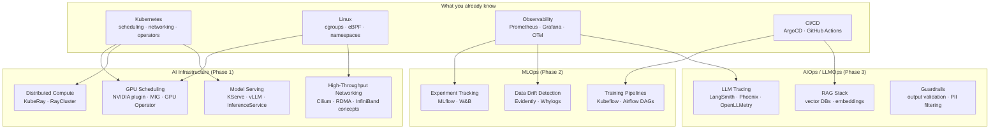

# AI Infrastructure

Platform engineering for AI/ML workloads — the substrate underneath models. Kubernetes stretched to its limits with GPUs, distributed compute, and high-throughput networking.

This is the natural extension of your K8s/Linux/DevOps foundation.

  0/0 checks
  

---

## How AI Infra Relates to What You Know

  
In the diagram, Linux feeds into both GPU Scheduling and High-Throughput Networking. What do those two have in common that traces back to Linux specifically, rather than to Kubernetes?

  <button class="quiz-reveal">Reveal answer</button>
  

    Both sit on kernel-level primitives K8s doesn't own. GPU scheduling depends on
    <code>cgroups</code> and device files to isolate and expose GPUs to containers
    before K8s ever sees them as a schedulable resource. High-throughput networking
    (RDMA/InfiniBand) depends on kernel-bypass mechanisms that skip the normal
    network stack entirely. Kubernetes just orchestrates on top of both &mdash; the
    actual isolation and bypass work is Linux's job.
  

---

## Files

| File | Topics |
|------|--------|
| [gpu-scheduling.md](./gpu-scheduling.md) | NVIDIA Device Plugin, extended resources, Dynamic Resource Allocation (ResourceClaim/DeviceClass), MIG slicing, GPU Operator, DCGM metrics, gang scheduling, taints/tolerations for GPU nodes |
| [kuberay.md](./kuberay.md) | KubeRay operator, RayCluster CRD, head/worker nodes, autoscaling, Ray Serve, resource requests |
| [model-serving.md](./model-serving.md) | KServe InferenceService, vLLM continuous batching, KV cache, canary rollouts, autoscaling with Knative |
| [llmops.md](./llmops.md) | RAG architecture, vector DBs (pgvector, Milvus, Pinecone), LangSmith tracing, guardrails, cost optimization |
| [networking.md](./networking.md) | NVLink, InfiniBand, RoCE, AWS EFA, NCCL AllReduce, Cilium for inference, fat-tree topology |

---

## Learning Path

  

    

      <strong>Phase 1: AI Infrastructure</strong> &mdash; start here if you have a K8s background.
      <ul>
        <li><code>gpu-scheduling.md</code> &mdash; understand how GPUs become K8s resources</li>
        <li><code>kuberay.md</code> &mdash; distributed Python workloads on K8s</li>
        <li><code>model-serving.md</code> &mdash; expose models as APIs at scale</li>
      </ul>
    

    

      <strong>Phase 2: MLOps</strong> &mdash; after Phase 1, see <code>../mlops/</code>.
      <ul>
        <li>experiment-tracking &mdash; MLflow / Weights &amp; Biases</li>
        <li>training-pipelines &mdash; Kubeflow Pipelines / Airflow</li>
      </ul>
    

    

      <strong>Phase 3: LLMOps</strong> &mdash; concurrent with Phase 2, not after it.
      <ul>
        <li><code>llmops.md</code> &mdash; RAG, vector DBs, LangSmith, guardrails</li>
      </ul>
    

  

  

    <button class="stepper-prev">← Prev</button>
    
    
    <button class="stepper-next">Next →</button>
  

  
Why does Phase 3 (LLMOps) run concurrently with Phase 2 (MLOps) instead of waiting for it to finish?

  <button class="quiz-reveal">Reveal answer</button>
  

    LLMOps depends on Phase 1 &mdash; you need a served model before you can build
    RAG or guardrails around it &mdash; but it doesn't depend on Phase 2's
    experiment-tracking or training-pipeline maturity. Those two tracks address
    different problems (training rigor vs. serving-time behavior) and neither
    blocks the other, so there's no reason to sequence them.
  

---

## Quick Orientation: AI Workload Types

| Workload | K8s resource shape | Key concern |
|----------|------------------|-------------|
| Model training | Long-running Job, multi-GPU, gang scheduling | GPU utilization, checkpoint, fault tolerance |
| Batch inference | Job or CronJob, GPU optional | Throughput, cost |
| Online inference | Deployment + HPA, GPU required | Latency p99, KV cache size, queue depth |
| RAG pipeline | Stateless Deployment + vector DB | Embedding latency, retrieval accuracy |
| Fine-tuning | Job, 1–8 GPUs, hours to days | Data pipeline, checkpoint storage, resume |

  
Online inference lists "KV cache size" as a key concern; batch inference doesn't. Why the difference?

  <button class="quiz-reveal">Reveal answer</button>
  

    Online inference holds many concurrent user sessions' attention KV caches in
    GPU memory at once, and that memory footprint directly caps how many
    requests can be served concurrently &mdash; it's a hard ceiling on
    throughput. Batch inference processes requests sequentially or in large
    chunks without needing to keep many long-lived per-session caches resident
    simultaneously, so raw throughput and cost dominate instead.
  

---

## Key Difference from Standard K8s Workloads

Same cluster, two very different sets of assumptions. Flip between them:

  

    <button data-toggle-opt="standard" class="active">Standard workload</button>
    <button data-toggle-opt="ai">AI workload</button>
  

  

    <ul>
      <li><strong>Requests:</strong> CPU + memory</li>
      <li><strong>Autoscaling:</strong> HPA on CPU %</li>
      <li><strong>Node placement:</strong> any node</li>
      <li><strong>Deploy strategy:</strong> rolling update</li>
      <li><strong>Metrics:</strong> Prometheus metrics</li>
      <li><strong>Image size:</strong> container image ~100MB</li>
    </ul>
  

  

    <ul>
      <li><strong>Requests:</strong> CPU + memory + <code>nvidia.com/gpu</code></li>
      <li><strong>Autoscaling:</strong> HPA on GPU utilization or queue depth (KEDA)</li>
      <li><strong>Node placement:</strong> GPU node group with taint <code>nvidia.com/gpu=present:NoSchedule</code></li>
      <li><strong>Deploy strategy:</strong> canary with traffic split (KServe) or blue-green</li>
      <li><strong>Metrics:</strong> Prometheus + DCGM Exporter (GPU metrics) + LLM token metrics</li>
      <li><strong>Image size:</strong> model image ~5&ndash;70GB (use PVC or model storage instead)</li>
    </ul>
  

  
Why can't a 70GB model just be baked into the container image the way a normal app's dependencies are?

  <button class="quiz-reveal">Reveal answer</button>
  

    A container image that size wrecks pull time on every pod start/restart and
    node scale-up, and most container registries and node disks aren't sized
    for it. Serving the model from a PVC or dedicated model-storage layer
    instead means the image stays small and fast to pull, and the (large,
    slow-changing) weights are fetched or mounted separately &mdash; and can be
    shared across pods instead of duplicated per image layer.
  

