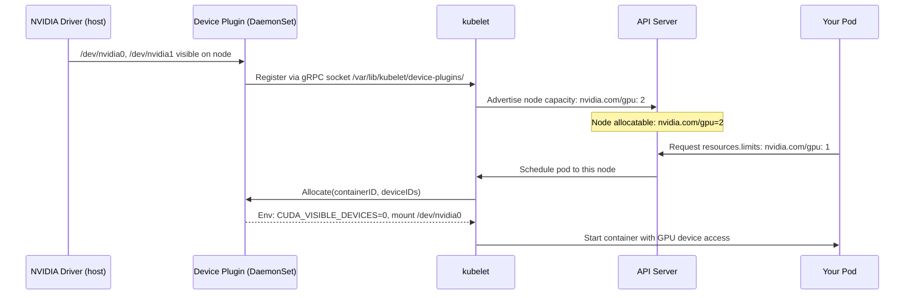
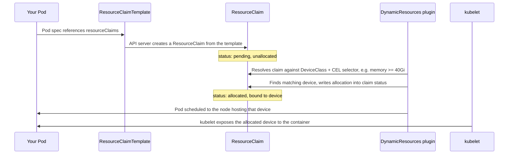
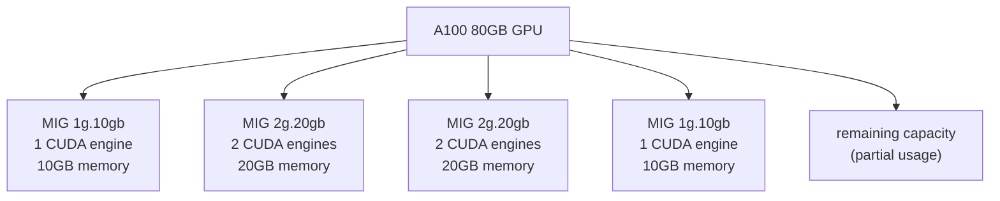
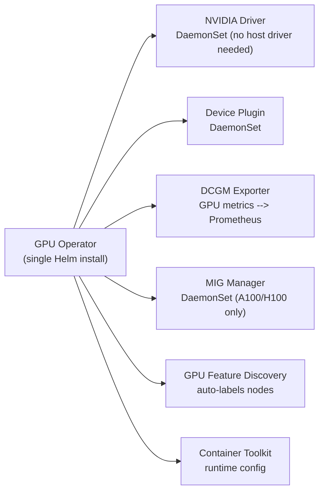

# GPU Scheduling on Kubernetes

GPUs are exposed to Kubernetes as **extended resources** — not built-in like CPU/memory. A chain of components bridges the hardware to the pod spec.

<div class="quiz-progress" data-quiz-progress>
  <span class="quiz-progress-label">0/0 checks</span>
  <span class="quiz-progress-bar"><span class="quiz-progress-fill"></span></span>
</div>

---

## How GPUs Become K8s Resources



The Device Plugin API is a gRPC socket at `/var/lib/kubelet/device-plugins/`. Any hardware can be exposed via this interface — GPUs, FPGAs, InfiniBand NICs.

Step through the same handshake one stage at a time:

<div class="stepper">
  <div class="stepper-panels">
    <div class="stepper-panel active">
      <strong>1. Driver ready.</strong> The NVIDIA driver on the host makes <code>/dev/nvidia0</code>, <code>/dev/nvidia1</code>, etc. visible on the node.
    </div>
    <div class="stepper-panel">
      <strong>2. Device plugin registers.</strong> The Device Plugin DaemonSet registers itself with kubelet over a gRPC socket at <code>/var/lib/kubelet/device-plugins/</code>.
    </div>
    <div class="stepper-panel">
      <strong>3. kubelet advertises capacity.</strong> kubelet tells the API server the node's allocatable resources now include <code>nvidia.com/gpu: 2</code>.
    </div>
    <div class="stepper-panel">
      <strong>4. Pod requests a GPU.</strong> A pod spec sets <code>resources.limits: nvidia.com/gpu: 1</code>. The API server schedules it onto a node with enough allocatable capacity.
    </div>
    <div class="stepper-panel">
      <strong>5. Allocation.</strong> kubelet calls <code>Allocate()</code> on the device plugin, which hands back the env var (<code>CUDA_VISIBLE_DEVICES=0</code>) and device mount for the specific GPU — then the container starts with that GPU visible.
    </div>
  </div>
  <div class="stepper-controls">
    <button class="stepper-prev">← Prev</button>
    <span class="stepper-dots"></span>
    <span class="stepper-label"></span>
    <button class="stepper-next">Next →</button>
  </div>
</div>

<div class="quiz-card">
  <p class="quiz-q">Should you manually set <code>CUDA_VISIBLE_DEVICES</code> in a pod spec that requests <code>nvidia.com/gpu</code>?</p>
  <button class="quiz-reveal">Reveal answer</button>
  <div class="quiz-a" hidden>No. The device plugin sets it automatically during <code>Allocate()</code>, pointing the container at whichever specific GPU device ID the kubelet actually assigned it. Setting it yourself risks pointing the container at a device it wasn't allocated.</div>
</div>

---

## NVIDIA Device Plugin

### Install

```bash
# Via Helm (preferred — handles DaemonSet + RBAC)
helm repo add nvdp https://nvidia.github.io/k8s-device-plugin
helm install nvdp nvdp/nvidia-device-plugin \
  --namespace kube-system \
  --set failOnInitError=false

# Verify: node should show nvidia.com/gpu in allocatable
kubectl describe node <gpu-node> | grep -A5 "Allocatable:"
# Allocatable:
#   cpu:                15600m
#   memory:             60Gi
#   nvidia.com/gpu:     4       ← 4 GPUs available
```

### Pod requesting a GPU

```yaml
apiVersion: v1
kind: Pod
spec:
  containers:
  - name: training
    image: nvcr.io/nvidia/pytorch:24.01-py3
    resources:
      limits:
        nvidia.com/gpu: 1       # request exactly 1 GPU
        memory: "16Gi"
        cpu: "4"
      requests:
        nvidia.com/gpu: 1       # must equal limits for GPU (no overcommit)
        memory: "16Gi"
        cpu: "2"
    env:
    - name: CUDA_VISIBLE_DEVICES   # set by device plugin automatically
      value: "0"                   # don't set manually — let the plugin do it
```

**GPU resources are not overcommittable.** `requests` must equal `limits` for `nvidia.com/gpu`. The scheduler guarantees one pod per GPU slot.

<div class="quiz-card">
  <p class="quiz-q">Can a container set <code>requests: nvidia.com/gpu: 1</code> and <code>limits: nvidia.com/gpu: 2</code>?</p>
  <button class="quiz-reveal">Reveal answer</button>
  <div class="quiz-a" hidden>No. GPU resources aren't overcommittable — requests must equal limits for <code>nvidia.com/gpu</code>, unlike CPU/memory where limits can exceed requests. The scheduler guarantees exactly one pod per GPU slot.</div>
</div>

---

## Dynamic Resource Allocation — the Device Plugin Successor

Everything above — extended resources, `nvidia.com/gpu: 1`, the Device Plugin gRPC handshake — is the model **Dynamic Resource Allocation (DRA)** supersedes for GPU and accelerator scheduling on clusters new enough to have it enabled. DRA doesn't replace the Device Plugin's driver-level device enumeration; it replaces how a pod *asks for* a device and how that request gets resolved, using its own scheduler extension point (the `DynamicResources` plugin) instead of the opaque extended-resource count above.

### DeviceClass — what kind of device can satisfy a claim

A `DeviceClass` is a cluster-scoped object (set up once by a cluster admin, like a `StorageClass`) that defines what a "device" means for a given driver — GPUs, in this case — using **structured, queryable attributes**: memory size, compute capability, model name. Compare that to the Device Plugin model, where every GPU advertised under `nvidia.com/gpu` is treated as interchangeable — the extended-resource string carries no information beyond "this is one of these."

```yaml
apiVersion: resource.k8s.io/v1
kind: DeviceClass
metadata:
  name: gpu.nvidia.com
spec:
  selectors:
  - cel:
      expression: "device.driver == 'gpu.nvidia.com'"
```

### ResourceClaim / ResourceClaimTemplate — how a pod asks for one

Instead of an implicit `resources.limits."nvidia.com/gpu": 1` that the device plugin resolves opaquely at bind time, a pod references a `ResourceClaimTemplate`, which creates a `ResourceClaim` object — a first-class API object with its own lifecycle, independent of the pod's classic Filter/Score cycle.

```yaml
apiVersion: resource.k8s.io/v1
kind: ResourceClaimTemplate
metadata:
  name: gpu-claim-template
spec:
  spec:
    devices:
      requests:
      - name: gpu
        deviceClassName: gpu.nvidia.com
        selectors:
        - cel:
            expression: "device.attributes['gpu.nvidia.com'].memory.compareTo(quantity('40Gi')) >= 0"
---
apiVersion: v1
kind: Pod
spec:
  containers:
  - name: training
    resources:
      claims:
      - name: gpu
  resourceClaims:
  - name: gpu
    resourceClaimTemplateName: gpu-claim-template
```

The claim gets created and bound by the `DynamicResources` scheduler plugin, which resolves it **before** the pod even reaches the classic Filter/Score cycle covered in [`kubernetes/scheduler-internals.md`](../kubernetes/scheduler-internals.md) — it isn't a Filter or Score plugin doing a scalar `Allocatable - requested` check, it's a separate resolution step that finds and locks in a matching device up front.

Trace the sequence end to end, next to the Device Plugin handshake diagrammed at the top of this file:



### Structured parameters — the actual capability gap this closes

MIG (covered above) can statically **slice** a GPU into fixed-size chunks ahead of time — `1g.10gb`, `2g.20gb`, and so on — each exposed as its own opaque extended-resource name. But a pod still has to name one exact profile; neither MIG's slicing nor the plain Device Plugin model can express a request like *"give me whichever available device has at least 40GB memory"* — every extended-resource name, sliced or not, is matched by name and count only. DRA's CEL-based selectors query structured device **attributes** — memory, compute capability, model — at claim-resolution time, so the same claim can match whichever device qualifies rather than requiring the pod author to hardcode one specific resource name.

<div class="toggle-switch">
  <div class="toggle-buttons">
    <button data-toggle-opt="deviceplugin" class="active state-warn">Device Plugin (extended resource)</button>
    <button data-toggle-opt="dra" class="state-ok">DRA (ResourceClaim)</button>
  </div>
  <div class="toggle-panel active" data-toggle-panel="deviceplugin">
    A pod sets <code>resources.limits: nvidia.com/gpu: 1</code> — an opaque count under a fixed string name. Every GPU (or MIG slice) advertised under that name is interchangeable to the scheduler; it just does <code>Allocatable - requested</code> arithmetic. The device plugin resolves <em>which</em> physical device at <code>Allocate()</code> time on the kubelet, invisible to the scheduler's own decision.
  </div>
  <div class="toggle-panel" data-toggle-panel="dra">
    A pod references a <code>ResourceClaimTemplate</code>, which creates a <code>ResourceClaim</code> resolved by the <code>DynamicResources</code> scheduler plugin against structured device attributes (memory, compute capability, model) via a CEL selector — before the classic Filter/Score cycle runs. The scheduler itself participates in picking the specific device, not just counting it.
  </div>
</div>

<div class="quiz-card">
  <p class="quiz-q">Can the classic Device Plugin model (<code>nvidia.com/gpu: 1</code>) express "give me a GPU with at least 40GB of free memory, whichever one qualifies"?</p>
  <button class="quiz-reveal">Reveal answer</button>
  <div class="quiz-a" hidden>No. An extended resource is just a count under an opaque name — every GPU advertised as <code>nvidia.com/gpu</code> is treated as interchangeable, with no attribute the scheduler can query. DRA closes this gap with CEL-based selectors matched against a <code>DeviceClass</code>'s structured device attributes.</div>
</div>

<div class="quiz-card">
  <p class="quiz-q">MIG can slice a GPU into fixed profiles like <code>1g.10gb</code> and <code>2g.20gb</code> ahead of time. Does that mean MIG can also express "give me whichever available device has at least 40GB, whatever its exact size"?</p>
  <button class="quiz-reveal">Reveal answer</button>
  <div class="quiz-a" hidden>No. MIG only creates fixed-size profiles known in advance, each exposed as its own opaque extended-resource name (<code>nvidia.com/mig-2g.20gb</code>) — a pod still has to name one exact profile, the same as the plain Device Plugin model. Neither MIG's static slicing nor the plain extended-resource model can express an attribute threshold; DRA's structured parameters can, because the selector is evaluated against real device attributes at claim-resolution time instead of a hardcoded resource name.</div>
</div>

---

## Node Taints for GPU Nodes

GPU instances are expensive. Prevent non-GPU workloads from landing on them:

```bash
# Taint GPU nodes — only pods with the matching toleration can schedule here
kubectl taint node <gpu-node> nvidia.com/gpu=present:NoSchedule

# GPU pods must have this toleration
tolerations:
- key: "nvidia.com/gpu"
  operator: "Exists"
  effect: "NoSchedule"
```

```yaml
# Node selector to target GPU nodes specifically
nodeSelector:
  node.kubernetes.io/instance-type: p3.8xlarge   # AWS GPU instance type
  # or use a custom label:
  accelerator: "nvidia-tesla-v100"
```

<div class="quiz-card">
  <p class="quiz-q">A pod has no toleration for <code>nvidia.com/gpu=present:NoSchedule</code>. Can it land on a tainted GPU node?</p>
  <button class="quiz-reveal">Reveal answer</button>
  <div class="quiz-a" hidden>No. Without the matching toleration, the scheduler won't place it there at all — that's the entire point of the taint: keep non-GPU workloads off the expensive GPU nodes.</div>
</div>

---

## MIG — Multi-Instance GPU

MIG (Multi-Instance GPU) partitions a single A100/H100 into up to 7 hardware-isolated instances. Each instance has its own:
- CUDA engines
- L2 cache partition
- Memory bandwidth slice
- **Memory isolation** — other instances cannot see this instance's memory



**vs. `CUDA_VISIBLE_DEVICES` (soft isolation):** Using env vars to restrict a container to one GPU still allows the process to see the full GPU memory — another process on the same GPU can interfere. MIG provides **hardware-enforced** isolation.

<div class="toggle-switch">
  <div class="toggle-buttons">
    <button data-toggle-opt="soft" class="active state-warn">CUDA_VISIBLE_DEVICES (soft)</button>
    <button data-toggle-opt="hard" class="state-ok">MIG (hardware)</button>
  </div>
  <div class="toggle-panel active" data-toggle-panel="soft">
    Restricting a container to one GPU via this env var still lets the process see the <strong>full GPU's memory</strong> — another process sharing the same physical GPU can still interfere. It's a convention respected by whichever software reads the env var, not something the hardware enforces.
  </div>
  <div class="toggle-panel" data-toggle-panel="hard">
    MIG partitions a single A100/H100 into up to 7 <strong>hardware-isolated</strong> instances, each with its own CUDA engines, L2 cache partition, and memory bandwidth slice — plus true memory isolation, so other instances cannot see this instance's memory at all.
  </div>
</div>

### MIG profiles on A100

| Profile | CUDA engines | Memory | Instances max |
|---------|-------------|--------|--------------|
| `1g.10gb` | 1/7 | 10GB | 7 |
| `2g.20gb` | 2/7 | 20GB | 3 |
| `3g.40gb` | 3/7 | 40GB | 2 |
| `7g.80gb` | 7/7 | 80GB | 1 (full GPU) |

### Expose MIG slices as K8s resources

```bash
# Check current MIG mode
nvidia-smi --query-gpu=mig.mode.current --format=csv

# Enable MIG mode on GPU 0
sudo nvidia-smi -i 0 -mig 1

# Create 7x 1g.10gb instances
sudo nvidia-smi mig -cgi 1g.10gb,1g.10gb,1g.10gb,1g.10gb,1g.10gb,1g.10gb,1g.10gb -C
```

With GPU Operator (automated), MIG resources appear as:
```
nvidia.com/mig-1g.10gb: 7
nvidia.com/mig-2g.20gb: 3
```

Pod requests a specific slice:
```yaml
resources:
  limits:
    nvidia.com/mig-1g.10gb: 1   # one 10GB MIG slice
```

<div class="quiz-card">
  <p class="quiz-q">Two containers are each confined to "GPU 0" — one via <code>CUDA_VISIBLE_DEVICES</code>, one via a MIG <code>1g.10gb</code> slice. Can either one see the other's data in GPU memory?</p>
  <button class="quiz-reveal">Reveal answer</button>
  <div class="quiz-a" hidden>Only the <code>CUDA_VISIBLE_DEVICES</code> one is at risk — that's soft isolation, the process can still see the full GPU's memory. A MIG instance has hardware-enforced memory isolation, so a process confined to one MIG slice literally cannot see another slice's memory.</div>
</div>

---

## GPU Operator

The GPU Operator automates the entire GPU software stack via Kubernetes operators:



```bash
helm repo add nvidia https://helm.ngc.nvidia.com/nvidia
helm install gpu-operator nvidia/gpu-operator \
  --namespace gpu-operator --create-namespace \
  --set mig.strategy=mixed   # 'single' = all GPUs same profile, 'mixed' = different per GPU
```

<div class="tab-group">
  <div class="tab-buttons">
    <button data-tab="single" class="active">mig.strategy=single</button>
    <button data-tab="mixed">mig.strategy=mixed</button>
  </div>
  <div class="tab-panels">
    <div class="tab-panel active" data-tab-panel="single">
      Every MIG-capable GPU in the cluster is carved into the <strong>same</strong> profile. Simple, predictable capacity — every <code>nvidia.com/mig-*</code> resource name means the same thing cluster-wide.
    </div>
    <div class="tab-panel" data-tab-panel="mixed">
      Different GPUs can run <strong>different</strong> MIG profiles — e.g. one A100 sliced into seven <code>1g.10gb</code> instances for small inference jobs, another left as <code>7g.80gb</code> (full GPU) for a training job. More flexible, but the scheduler has to reason about more distinct resource types at once.
    </div>
  </div>
</div>

**Why GPU Operator over manual installation?**
- No GPU driver installed on the host required — operator manages driver as a container
- Automatic node labeling (`nvidia.com/gpu.product=A100-SXM4-80GB`)
- DCGM exporter automatically deployed for GPU metrics
- MIG configuration managed declaratively

<div class="quiz-card">
  <p class="quiz-q">With the GPU Operator installed, do you still need to manually install the NVIDIA driver on each GPU host?</p>
  <button class="quiz-reveal">Reveal answer</button>
  <div class="quiz-a" hidden>No — that's the main point of the operator: it manages the driver as a container/DaemonSet itself, so no host-level driver install is required.</div>
</div>

---

## GPU Metrics with DCGM Exporter

DCGM (Data Center GPU Manager) exposes GPU metrics to Prometheus:

```bash
# Key metrics
DCGM_FI_DEV_GPU_UTIL          # GPU utilization % (0-100)
DCGM_FI_DEV_MEM_COPY_UTIL     # Memory bandwidth utilization %
DCGM_FI_DEV_FB_USED           # Framebuffer (VRAM) used MB
DCGM_FI_DEV_FB_FREE           # VRAM free MB
DCGM_FI_DEV_POWER_USAGE       # Power draw (watts)
DCGM_FI_DEV_GPU_TEMP          # Temperature (celsius)
DCGM_FI_DEV_SM_CLOCK          # Streaming multiprocessor clock MHz
DCGM_FI_PROF_PIPE_TENSOR_ACTIVE  # Tensor core utilization % (training efficiency)
```

```promql
# GPU utilization per pod
avg by (pod, gpu) (DCGM_FI_DEV_GPU_UTIL)

# VRAM usage %
DCGM_FI_DEV_FB_USED / (DCGM_FI_DEV_FB_USED + DCGM_FI_DEV_FB_FREE) * 100

# Alert: GPU idle > 5 min on a running pod (wasted $$$)
DCGM_FI_DEV_GPU_UTIL < 5
```

**Alert thresholds:**

| Metric | Warning | Critical |
|--------|---------|---------|
| GPU util | < 20% sustained (idle waste) | > 95% sustained (saturation) |
| VRAM used | > 85% | > 95% → OOM kill |
| Temperature | > 80°C | > 87°C (throttling starts) |
| Power | > 90% TDP | — |

<div class="quiz-card">
  <p class="quiz-q"><code>DCGM_FI_DEV_GPU_UTIL</code> stays under 5% for an hour on a pod that's still <code>Running</code>. Does that mean the GPU hardware is broken?</p>
  <button class="quiz-reveal">Reveal answer</button>
  <div class="quiz-a" hidden>Not necessarily — it usually flags wasted spend, not a hardware fault. The pod is holding an exclusive, non-overcommittable GPU slot without actually using it (stuck waiting on data, an idle notebook, etc.). That's exactly the case the "GPU idle > 5 min" alert exists to catch.</div>
</div>

---

## Gang Scheduling — All-or-Nothing Pod Groups

Distributed training requires ALL pods to start simultaneously (otherwise one waits forever for others that are stuck pending). Standard K8s scheduler doesn't guarantee this.

```bash
# Install Volcano or Coscheduler (scheduler-plugins)
kubectl apply -f https://raw.githubusercontent.com/volcano-sh/volcano/master/installer/volcano-development.yaml

# PodGroup: schedule all 4 pods atomically
apiVersion: scheduling.volcano.sh/v1beta1
kind: PodGroup
metadata:
  name: training-job
spec:
  minMember: 4       # all 4 GPUs must be available, or none start
---
apiVersion: v1
kind: Pod
metadata:
  annotations:
    scheduling.volcano.sh/pod-group: training-job
spec:
  schedulerName: volcano
  containers:
  - resources:
      limits:
        nvidia.com/gpu: 1
```

Without gang scheduling: 3/4 pods start, 4th can't schedule → deadlock (3 GPUs held hostage, 4th waiting forever).

Step through why that deadlock happens, and how a `PodGroup` avoids it:

<div class="stepper">
  <div class="stepper-panels">
    <div class="stepper-panel active">
      <strong>1. Job submitted.</strong> A distributed training job needs 4 pods, each requesting 1 GPU, scheduled with the default scheduler — no <code>PodGroup</code>.
    </div>
    <div class="stepper-panel">
      <strong>2. Pods scheduled independently.</strong> As GPU slots free up, 3 of the 4 pods find a home and start running.
    </div>
    <div class="stepper-panel">
      <strong>3. 4th pod stuck Pending.</strong> No free GPU slot is left for it, and nothing guarantees one opens up soon.
    </div>
    <div class="stepper-panel">
      <strong>4. Deadlock.</strong> Distributed training needs all 4 ranks up before any of them can make progress — the 3 running pods sit idle holding their GPUs, waiting on a 4th that may never get scheduled.
    </div>
    <div class="stepper-panel">
      <strong>5. With gang scheduling (<code>minMember: 4</code>).</strong> Volcano/Coscheduler holds all 4 placements until all 4 GPU slots are simultaneously available, then starts them atomically — either all 4 run, or none reserve a GPU at all.
    </div>
  </div>
  <div class="stepper-controls">
    <button class="stepper-prev">← Prev</button>
    <span class="stepper-dots"></span>
    <span class="stepper-label"></span>
    <button class="stepper-next">Next →</button>
  </div>
</div>

<div class="quiz-card">
  <p class="quiz-q">Without gang scheduling, why can 3 already-running pods end up stuck forever waiting on a 4th that never schedules?</p>
  <button class="quiz-reveal">Reveal answer</button>
  <div class="quiz-a" hidden>Distributed training requires all pods (ranks) to start together — the 3 that did schedule can't make progress alone, while the 4th has no guarantee it'll ever find a free GPU slot. That's the deadlock: GPUs held hostage by pods that can't proceed without a peer that isn't coming.</div>
</div>
