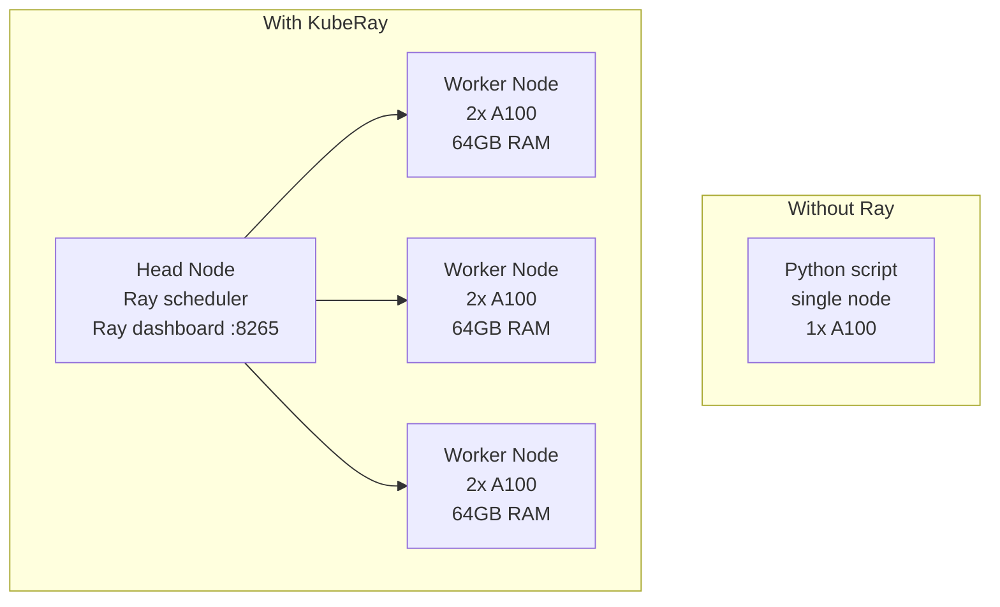
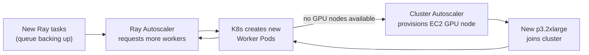

# KubeRay — Distributed Compute on Kubernetes

Ray is the standard framework for scaling Python and ML workloads across a cluster. KubeRay is the Kubernetes operator that manages Ray clusters as CRDs.

<div class="quiz-progress" data-quiz-progress>
  <span class="quiz-progress-label">0/0 checks</span>
  <span class="quiz-progress-bar"><span class="quiz-progress-fill"></span></span>
</div>

---

## What Ray Solves

Single-node Python hits limits: one GPU, one CPU, one machine's memory. Ray distributes workloads across many nodes transparently — the same Python code runs on 1 node or 1000.



**Use cases:**
- Distributed model training (multiple GPUs across nodes)
- Parallel hyperparameter search
- Batch inference at scale
- Ray Serve: scalable model serving with request routing

<div class="quiz-card">
  <p class="quiz-q">Do you need to rewrite your Python code differently to go from running it on 1 node to running it across 1000 nodes with Ray?</p>
  <button class="quiz-reveal">Reveal answer</button>
  <div class="quiz-a" hidden>No &mdash; that's the point of Ray. The same Python code runs unchanged on 1 node or 1000; Ray (and KubeRay on top of it) handles distributing the work across whatever nodes are available.</div>
</div>

---

## KubeRay Operator

```bash
helm repo add kuberay https://ray-project.github.io/kuberay-helm/
helm install kuberay-operator kuberay/kuberay-operator \
  --namespace ray-system --create-namespace \
  --version 1.1.0
```

The operator watches for `RayCluster`, `RayJob`, and `RayService` CRDs and creates the corresponding K8s resources (Pods, Services, Ingress).

<div class="tab-group">
  <div class="tab-buttons">
    <button data-tab="raycluster" class="active">RayCluster</button>
    <button data-tab="rayjob">RayJob</button>
    <button data-tab="rayservice">RayService</button>
  </div>
  <div class="tab-panels">
    <div class="tab-panel active" data-tab-panel="raycluster">
      A persistent Ray cluster you manage directly. Head and worker pods stay
      up until you delete the resource yourself. Use for long-running
      interactive or training workloads.
    </div>
    <div class="tab-panel" data-tab-panel="rayjob">
      Spins up a cluster, runs an entrypoint script, and can tear the cluster
      down automatically when the job finishes
      (<code>shutdownAfterJobFinishes</code>). Use for batch
      training/inference.
    </div>
    <div class="tab-panel" data-tab-panel="rayservice">
      Runs Ray Serve for scalable model serving &mdash; supports multi-model
      serving, request routing, and blue-green deployments. Stays up to keep
      serving requests.
    </div>
  </div>
</div>

<div class="quiz-card">
  <p class="quiz-q">Which CRD would you reach for to run a one-off batch training job that should clean up its own compute when finished &mdash; RayCluster or RayJob?</p>
  <button class="quiz-reveal">Reveal answer</button>
  <div class="quiz-a" hidden>RayJob. It supports <code>shutdownAfterJobFinishes</code> and <code>ttlSecondsAfterFinished</code> to tear itself down after completion. A plain RayCluster stays up until you delete it manually.</div>
</div>

---

## RayCluster CRD

```yaml
apiVersion: ray.io/v1
kind: RayCluster
metadata:
  name: llm-training-cluster
spec:
  rayVersion: "2.9.0"

  # Head node: Ray scheduler + object store + dashboard
  headGroupSpec:
    rayStartParams:
      dashboard-host: "0.0.0.0"
      num-cpus: "0"           # head node doesn't run tasks — only scheduling
    template:
      spec:
        containers:
        - name: ray-head
          image: rayproject/ray-ml:2.9.0-gpu
          resources:
            limits:
              cpu: "4"
              memory: "16Gi"
              nvidia.com/gpu: "0"   # head doesn't need GPU
            requests:
              cpu: "2"
              memory: "8Gi"
        tolerations:
        - key: "nvidia.com/gpu"
          operator: "Exists"
          effect: "NoSchedule"

  # Worker nodes: actual compute
  workerGroupSpecs:
  - groupName: gpu-workers
    replicas: 4                # 4 worker pods
    minReplicas: 1             # autoscaling min
    maxReplicas: 8             # autoscaling max
    rayStartParams: {}
    template:
      spec:
        containers:
        - name: ray-worker
          image: rayproject/ray-ml:2.9.0-gpu
          resources:
            limits:
              cpu: "8"
              memory: "64Gi"
              nvidia.com/gpu: "2"   # 2 GPUs per worker
            requests:
              cpu: "4"
              memory: "32Gi"
              nvidia.com/gpu: "2"
        nodeSelector:
          accelerator: nvidia-a100
        tolerations:
        - key: "nvidia.com/gpu"
          operator: "Exists"
          effect: "NoSchedule"
```

<div class="toggle-switch">
  <div class="toggle-buttons">
    <button data-toggle-opt="head" class="active">Head node</button>
    <button data-toggle-opt="worker">Worker node</button>
  </div>
  <div class="toggle-panel active" data-toggle-panel="head">
    Runs the Ray scheduler, the distributed object store, and the dashboard
    (<code>:8265</code>). Doesn't run compute tasks &mdash; note
    <code>num-cpus: "0"</code> and <code>nvidia.com/gpu: "0"</code> in the
    spec above. Cheap: no GPU required.
  </div>
  <div class="toggle-panel" data-toggle-panel="worker">
    Runs the actual compute &mdash; GPUs, CPUs, memory for tasks. This is the
    group KubeRay autoscales via <code>minReplicas</code>/<code>maxReplicas</code>;
    it's what scales up and down with load.
  </div>
</div>

<div class="quiz-card">
  <p class="quiz-q">In the RayCluster spec above, why does the head node request <code>nvidia.com/gpu: "0"</code> and <code>num-cpus: "0"</code>?</p>
  <button class="quiz-reveal">Reveal answer</button>
  <div class="quiz-a" hidden>The head node only runs the Ray scheduler, object store, and dashboard &mdash; it doesn't execute workload tasks itself, so it doesn't need compute resources reserved for them. All actual GPU/CPU work happens on the worker group.</div>
</div>

---

## RayJob — Run a Job and Tear Down

For batch training/inference — spin up a cluster, run the job, clean up:

```yaml
apiVersion: ray.io/v1
kind: RayJob
metadata:
  name: training-run-v1
spec:
  entrypoint: "python /app/train.py --epochs 100 --lr 0.001"
  shutdownAfterJobFinishes: true   # ← delete cluster when done (cost saving)
  ttlSecondsAfterFinished: 300     # clean up resources 5 min after completion

  runtimeEnvYAML: |
    pip:
      - torch==2.2.0
      - transformers==4.38.0
    env_vars:
      WANDB_API_KEY: "$(WANDB_API_KEY)"

  rayClusterSpec:
    # ... same as RayCluster spec above
```

```bash
# Submit and monitor
kubectl apply -f rayjob.yaml
kubectl get rayjob training-run-v1
# STATUS: Running → Succeeded

# View Ray dashboard (port-forward to head)
kubectl port-forward svc/llm-training-cluster-head-svc 8265:8265
# http://localhost:8265
```

Step through the lifecycle:

<div class="stepper">
  <div class="stepper-panels">
    <div class="stepper-panel active">
      <strong>1. Submit.</strong> <code>kubectl apply -f rayjob.yaml</code> creates the RayJob resource; KubeRay spins up the underlying RayCluster from <code>rayClusterSpec</code>.
    </div>
    <div class="stepper-panel">
      <strong>2. Running.</strong> The <code>entrypoint</code> (<code>python /app/train.py ...</code>) runs on the cluster. <code>kubectl get rayjob</code> shows <code>STATUS: Running</code>.
    </div>
    <div class="stepper-panel">
      <strong>3. Succeeded.</strong> The entrypoint process exits and <code>STATUS</code> flips to <code>Succeeded</code>.
    </div>
    <div class="stepper-panel">
      <strong>4. Cluster torn down.</strong> Because <code>shutdownAfterJobFinishes: true</code>, KubeRay deletes the RayCluster immediately &mdash; no idle GPU nodes billing you after the job is done.
    </div>
    <div class="stepper-panel">
      <strong>5. Resource cleanup.</strong> <code>ttlSecondsAfterFinished: 300</code> removes the leftover RayJob resource itself 5 minutes after completion.
    </div>
  </div>
  <div class="stepper-controls">
    <button class="stepper-prev">← Prev</button>
    <span class="stepper-dots"></span>
    <span class="stepper-label"></span>
    <button class="stepper-next">Next →</button>
  </div>
</div>

<div class="quiz-card">
  <p class="quiz-q">What's the actual difference between <code>shutdownAfterJobFinishes</code> and <code>ttlSecondsAfterFinished</code> on a RayJob?</p>
  <button class="quiz-reveal">Reveal answer</button>
  <div class="quiz-a" hidden><code>shutdownAfterJobFinishes</code> tears down the underlying RayCluster &mdash; the expensive compute, pods and GPUs &mdash; as soon as the job completes. <code>ttlSecondsAfterFinished</code> is a separate timer that removes the leftover RayJob resource itself some time after completion. One controls cost-heavy compute, the other controls bookkeeping cleanup.</div>
</div>

---

## RayService — Scalable Model Serving

RayService runs Ray Serve, Ray's built-in serving framework. Supports multi-model serving, request routing, and blue-green deployments.

```yaml
apiVersion: ray.io/v1
kind: RayService
metadata:
  name: llm-inference
spec:
  serviceUnhealthySecondThreshold: 300
  deploymentUnhealthySecondThreshold: 300

  serveConfigV2: |
    applications:
    - name: llm
      route_prefix: /
      import_path: serve_app:deployment
      deployments:
      - name: LLMDeployment
        num_replicas: 2
        ray_actor_options:
          num_gpus: 1
          num_cpus: 4
          memory: 32000000000   # 32GB

  rayClusterSpec:
    # ... worker group with GPU resources
```

```python
# serve_app.py — the Ray Serve deployment
from ray import serve
from transformers import pipeline

@serve.deployment(num_replicas=2, ray_actor_options={"num_gpus": 1})
class LLMDeployment:
    def __init__(self):
        self.model = pipeline("text-generation", model="gpt2", device=0)

    async def __call__(self, request):
        data = await request.json()
        return self.model(data["prompt"], max_length=100)

deployment = LLMDeployment.bind()
```

<div class="quiz-card">
  <p class="quiz-q">Unlike a RayJob, does a RayService tear itself down after it finishes handling a batch of requests?</p>
  <button class="quiz-reveal">Reveal answer</button>
  <div class="quiz-a" hidden>No &mdash; RayService is for persistent serving. It keeps the Ray Serve deployment running, with configurable replica counts and health thresholds, to keep handling requests indefinitely &mdash; unlike RayJob, which is built to run once and clean itself up.</div>
</div>

---

## Autoscaling RayClusters

KubeRay integrates with K8s Cluster Autoscaler and Ray's own autoscaler:

```yaml
workerGroupSpecs:
- groupName: gpu-workers
  minReplicas: 0       # scale to zero when idle (cost saving)
  maxReplicas: 16
  # Ray autoscaler adds workers when task queue is backed up
  # Cluster Autoscaler provisions new EC2 GPU nodes when K8s can't schedule
```



**Cost optimization:** Set `minReplicas: 0` for worker groups. Workers scale to zero when no jobs are running. Only the head node (no GPU, cheap) stays running.

Step through the scale-up sequence:

<div class="stepper">
  <div class="stepper-panels">
    <div class="stepper-panel active">
      <strong>1. Idle.</strong> <code>minReplicas: 0</code> &mdash; no worker pods running. Only the head node (no GPU, cheap) stays up.
    </div>
    <div class="stepper-panel">
      <strong>2. Tasks queue up.</strong> New Ray tasks arrive faster than the (currently zero) workers can process them.
    </div>
    <div class="stepper-panel">
      <strong>3. Ray Autoscaler reacts.</strong> It requests more worker pods to drain the backed-up queue.
    </div>
    <div class="stepper-panel">
      <strong>4. K8s scheduling fails.</strong> No GPU nodes are currently available in the cluster to place the new pods.
    </div>
    <div class="stepper-panel">
      <strong>5. Cluster Autoscaler provisions.</strong> It brings up a new GPU node (e.g. <code>p3.2xlarge</code>) at the cloud provider.
    </div>
    <div class="stepper-panel">
      <strong>6. Node joins, pod schedules.</strong> The new worker pod lands on the new node and starts pulling from the Ray task queue.
    </div>
  </div>
  <div class="stepper-controls">
    <button class="stepper-prev">← Prev</button>
    <span class="stepper-dots"></span>
    <span class="stepper-label"></span>
    <button class="stepper-next">Next →</button>
  </div>
</div>

<div class="quiz-card">
  <p class="quiz-q">With <code>minReplicas: 0</code> on the worker group, what keeps running when there are no jobs at all?</p>
  <button class="quiz-reveal">Reveal answer</button>
  <div class="quiz-a" hidden>Only the head node. It has no GPU and is cheap to run, so it stays up as the entry point; the GPU-backed worker pods scale all the way down to zero and only come back once tasks show up again.</div>
</div>

---

## Connecting to a Running RayCluster

```bash
# Port-forward to Ray head service
kubectl port-forward svc/<cluster>-head-svc 10001:10001 8265:8265

# In Python — connect to the cluster
import ray
ray.init(address="ray://localhost:10001")

# Run a distributed task
@ray.remote(num_gpus=1)
def train_shard(data_shard):
    # runs on a worker with 1 GPU
    return model.fit(data_shard)

futures = [train_shard.remote(shard) for shard in data_shards]
results = ray.get(futures)   # collect results from all workers
```

<div class="quiz-card">
  <p class="quiz-q">Does calling <code>train_shard.remote(shard)</code> run the function immediately and block until it's done?</p>
  <button class="quiz-reveal">Reveal answer</button>
  <div class="quiz-a" hidden>No &mdash; <code>.remote()</code> submits the task asynchronously and immediately returns a future. The actual work runs on a worker; you don't get the result until you call <code>ray.get(futures)</code>, which blocks and collects results from all workers.</div>
</div>

---

## Observability

```bash
# Ray Dashboard: task graph, resource usage, logs
kubectl port-forward svc/<cluster>-head-svc 8265:8265
# http://localhost:8265

# Ray metrics exposed for Prometheus
# Add ServiceMonitor for ray-head-svc port 8080 (metrics)
ray_tasks_running_gauge          # active tasks
ray_actors_count                 # actor pool size
ray_object_store_memory_usage    # shared memory usage
ray_node_cpu_utilization         # per-node CPU %
ray_node_gpus_available          # available GPU slots
```
