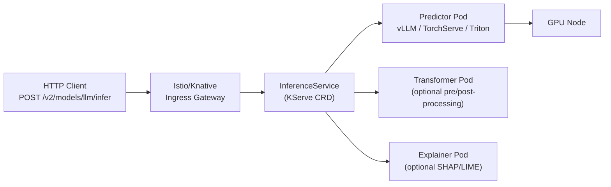
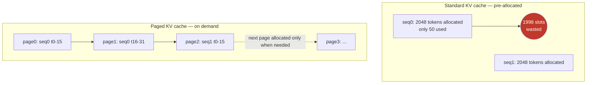

# Model Serving Infrastructure

Exposing ML models as production APIs. Two layers: KServe for the K8s-native orchestration layer, vLLM for the high-throughput LLM inference engine underneath.

<div class="quiz-progress" data-quiz-progress>
  <span class="quiz-progress-label">0/0 checks</span>
  <span class="quiz-progress-bar"><span class="quiz-progress-fill"></span></span>
</div>

---

## KServe — InferenceService CRD

KServe is the Kubernetes-native model serving platform. It adds an `InferenceService` CRD that abstracts model serving across frameworks (sklearn, PyTorch, TensorFlow, custom).



### InferenceService for a custom vLLM model

```yaml
apiVersion: serving.kserve.io/v1beta1
kind: InferenceService
metadata:
  name: llama-3-8b
  namespace: ml-serving
spec:
  predictor:
    model:
      modelFormat:
        name: pytorch
      storageUri: "s3://my-models/llama-3-8b/"   # model weights on S3/GCS/PVC
      runtime: vllm-runtime                        # custom ServingRuntime

    # Resource allocation
    resources:
      limits:
        cpu: "8"
        memory: "32Gi"
        nvidia.com/gpu: "1"
      requests:
        cpu: "4"
        memory: "16Gi"
        nvidia.com/gpu: "1"

    # Knative autoscaling
    minReplicas: 1
    maxReplicas: 4
    scaleTarget: 5        # target concurrent requests per replica
    scaleMetric: concurrency
```

### Custom ServingRuntime for vLLM

```yaml
apiVersion: serving.kserve.io/v1alpha1
kind: ClusterServingRuntime
metadata:
  name: vllm-runtime
spec:
  supportedModelFormats:
  - name: pytorch
    version: "2"
    autoSelect: true

  containers:
  - name: kserve-container
    image: vllm/vllm-openai:v0.4.2
    command: ["python", "-m", "vllm.entrypoints.openai.api_server"]
    args:
    - --model=/mnt/models            # KServe mounts model here
    - --tensor-parallel-size=1       # GPUs to shard across
    - --max-model-len=8192           # max sequence length
    - --gpu-memory-utilization=0.90  # leave 10% for KV cache growth
    - --served-model-name=llama-3-8b

    resources:
      limits:
        nvidia.com/gpu: "1"
    volumeMounts:
    - name: model
      mountPath: /mnt/models
```

<div class="quiz-card">
  <p class="quiz-q">In the InferenceService diagram, which pod is required to serve a model, and which two are optional?</p>
  <button class="quiz-reveal">Reveal answer</button>
  <div class="quiz-a" hidden>The Predictor pod is required — it's the one actually running the model (vLLM/TorchServe/Triton) and answering inference requests. The Transformer (pre/post-processing) and Explainer (SHAP/LIME) pods are both optional add-ons the InferenceService can wire in front of or alongside the predictor.</div>
</div>

---

## vLLM — High-Throughput LLM Inference Engine

vLLM achieves 20–100× throughput vs naive inference through three innovations.

### 1. Continuous Batching

Naive: wait for a full batch, run, return, repeat (GPU idle between batches).

vLLM: new requests join the batch **mid-generation**. The batch is always full.

<div class="toggle-switch">
  <div class="toggle-buttons">
    <button data-toggle-opt="naive" class="active state-warn">Naive batching</button>
    <button data-toggle-opt="continuous" class="state-ok">Continuous batching</button>
  </div>
  <div class="toggle-panel active" data-toggle-panel="naive">
    Wait for a full batch to be assembled, run it, return all results, then start
    assembling the next batch. Any request that finishes early still has to wait
    for the slowest request in its batch before the GPU picks up new work &mdash;
    the GPU sits idle between batches. This is why naive serving tops out around
    <strong>~40% GPU utilization</strong>.
  </div>
  <div class="toggle-panel" data-toggle-panel="continuous">
    New requests join the running batch <strong>mid-generation</strong>, slotting
    into whatever capacity just freed up as other requests finish their tokens.
    The batch is never left partially empty waiting for stragglers. This is why

```mermaid
gantt
    title Naive vs Continuous Batching
    dateFormat X
    axisFormat %s

    section Naive
    Request A (20 tokens) : 0, 20
    Request B wait        : 0, 20
    Request B (10 tokens) : 20, 30

    section Continuous
    Request A (20 tokens) : 0, 20
    Request B (joins at 5): 5, 15
```

    vLLM reaches <strong>~95% GPU utilization</strong> on the same hardware.
  </div>
</div>



Result: GPU utilization goes from ~40% to ~95%.

### 2. PagedAttention — KV Cache Management

During generation, each token's Key and Value vectors are cached (the KV cache). Standard approach: pre-allocate max sequence length × batch size = wastes memory for short sequences.

PagedAttention borrows from OS virtual memory paging:
- KV cache divided into fixed-size **pages** (e.g., 16 tokens per page)
- Pages allocated **on demand** as tokens are generated
- Pages shared across parallel sequences (for beam search, speculative decoding)
- No memory fragmentation



Result: 2–4× more concurrent sequences fit in the same GPU memory.

### 3. Tensor Parallelism

For models too large for one GPU, split the weight matrices across GPUs:

```bash
# Llama 70B requires ~140GB VRAM at fp16 → needs 2x A100 80GB minimum
vllm serve meta-llama/Meta-Llama-3-70B \
  --tensor-parallel-size 2    # split across 2 GPUs
  --pipeline-parallel-size 1  # layers are NOT split across GPUs (different from TP)
```

Tensor parallel: each GPU holds a **column slice** of weight matrices. Each forward pass requires an AllReduce across GPUs. Needs high-bandwidth NVLink (not PCIe).

<div class="quiz-card">
  <p class="quiz-q">With --tensor-parallel-size 2, are the model's layers split across the two GPUs?</p>
  <button class="quiz-reveal">Reveal answer</button>
  <div class="quiz-a" hidden>No. Tensor parallelism splits each weight matrix into column slices held across GPUs, not the layers themselves — every GPU participates in every layer's computation, with an AllReduce needed after each forward pass. Splitting layers across GPUs instead is pipeline parallelism, a different (and separate) dial — which is why the vLLM flags keep <code>--pipeline-parallel-size</code> distinct from <code>--tensor-parallel-size</code>.</div>
</div>

---

## KV Cache and Context Window

Every token you've generated so far is in the KV cache. Longer context = more KV cache = less room for concurrent requests.

```
A100 80GB, Llama-3 8B (fp16):
  Model weights: ~16GB
  Remaining for KV cache: ~64GB

  At 4096 context length: ~200 concurrent requests
  At 8192 context length: ~100 concurrent requests
  At 32768 context length: ~25 concurrent requests
```

This is why `--max-model-len` is a critical parameter. Set it to the 95th percentile of your actual request length, not the model's maximum.

```bash
# Monitor KV cache utilization
curl http://vllm:8000/metrics | grep kv_cache
# vllm:num_requests_running 12
# vllm:gpu_cache_usage_perc 0.73   ← 73% of KV cache used
```

<div class="quiz-card">
  <p class="quiz-q">You bump --max-model-len from 8192 to 32768 without changing the GPU. What happens to the number of concurrent requests the server can handle?</p>
  <button class="quiz-reveal">Reveal answer</button>
  <div class="quiz-a" hidden>It drops sharply — from ~100 concurrent requests down to ~25 in the file's own numbers. Longer context means more KV cache reserved per sequence, and the pool of memory left over after model weights is fixed, so more room per request means fewer requests fit at once. This is why --max-model-len should be set to the 95th percentile of actual request length, not the model's maximum.</div>
</div>

---

## Canary Rollout with KServe

```yaml
apiVersion: serving.kserve.io/v1beta1
kind: InferenceService
metadata:
  name: llama-3-8b
spec:
  predictor:
    canaryTrafficPercent: 10    # 10% to new version

    # Stable version
    model:
      storageUri: "s3://models/llama-3-8b-v1/"
      runtime: vllm-runtime

  # Canary: new version getting 10% traffic
  # Defined by deploying with a new revision
```

```bash
# Promote canary to 100% after validation
kubectl patch isvc llama-3-8b \
  --type merge \
  -p '{"spec":{"predictor":{"canaryTrafficPercent":0}}}'
```

The rollout unfolds in stages — step through it:

<div class="stepper">
  <div class="stepper-panels">
    <div class="stepper-panel active">
      <strong>1. Stable only.</strong> <code>llama-3-8b-v1</code> is the only
      version deployed, serving 100% of traffic through the predictor.
    </div>
    <div class="stepper-panel">
      <strong>2. Canary deployed.</strong> A new revision is deployed and
      <code>canaryTrafficPercent: 10</code> is set — 10% of requests now route
      to the new version, 90% still go to the stable one.
    </div>
    <div class="stepper-panel">
      <strong>3. Validate.</strong> Watch the canary's metrics (latency,
      error rate, <code>vllm:*</code> stats) against the stable version's
      before deciding whether to proceed.
    </div>
    <div class="stepper-panel">
      <strong>4. Promote.</strong> <code>kubectl patch</code> sets
      <code>canaryTrafficPercent</code> back to <code>0</code> — which, once
      the canary revision is the active one, means the canary now takes 100%
      of traffic and the old stable revision takes none.
    </div>
  </div>
  <div class="stepper-controls">
    <button class="stepper-prev">← Prev</button>
    <span class="stepper-dots"></span>
    <span class="stepper-label"></span>
    <button class="stepper-next">Next →</button>
  </div>
</div>

<div class="quiz-card">
  <p class="quiz-q">To promote a validated canary to 100% of traffic, the patch command sets canaryTrafficPercent to 0, not 100. Why doesn't that turn traffic off?</p>
  <button class="quiz-reveal">Reveal answer</button>
  <div class="quiz-a" hidden>canaryTrafficPercent is the split away from the currently-active revision. Once the canary is validated and promotion runs, the canary revision becomes the new baseline — so "0% split off to a canary" means the new version is now serving all the traffic, not that traffic stopped. Reading it as "0% traffic to the new version" is the easy mistake.</div>
</div>

---

## Autoscaling with KEDA (GPU-aware)

Standard HPA scales on CPU %. For inference, scale on **request queue depth** or **GPU utilization**:

```yaml
apiVersion: keda.sh/v1alpha1
kind: ScaledObject
metadata:
  name: llm-inference-scaler
spec:
  scaleTargetRef:
    name: llama-3-8b-predictor-default
  minReplicaCount: 1
  maxReplicaCount: 8
  triggers:
  # Scale on Prometheus metric: vLLM waiting requests
  - type: prometheus
    metadata:
      serverAddress: http://prometheus:9090
      metricName: vllm_requests_waiting
      threshold: "5"       # scale up when >5 requests waiting
      query: |
        sum(vllm:num_requests_waiting{model_name="llama-3-8b"})
```

<div class="quiz-card">
  <p class="quiz-q">Why does GPU inference autoscaling trigger on request queue depth (vllm_requests_waiting) instead of CPU utilization the way a standard HPA does?</p>
  <button class="quiz-reveal">Reveal answer</button>
  <div class="quiz-a" hidden>Because the bottleneck for LLM inference is the GPU, not the CPU — a pod can look nearly idle on CPU while its GPU and KV cache are fully saturated and requests are piling up waiting to be batched. Scaling on queue depth (or GPU utilization) reacts to the resource that's actually constrained; CPU % would stay flat and never trigger a scale-up.</div>
</div>

---

## Model Storage Patterns

Model weights are large (8B model = 16GB fp16). Don't bake them into the container image.

| Pattern | How | Tradeoff |
|---------|-----|----------|
| PVC with ReadOnlyMany | Model stored on EFS/NFS PVC, mounted into predictor pods | Slow first mount, fast subsequent |
| Init container + S3 | Init container downloads from S3 on pod start | Pod start time 2–5 min for large models |
| KServe model agent | KServe sidecar downloads model from storage URI automatically | Declarative, handles S3/GCS/Azure |
| OCI model artifacts | Model packaged as OCI image layer | Cached by containerd, fast on warm nodes |

```yaml
# KServe handles download automatically via storageUri
spec:
  predictor:
    model:
      storageUri: "s3://my-models/llama-3-8b-instruct/"
      # KServe model agent sidecar downloads this to /mnt/models before starting predictor
```

<div class="quiz-card">
  <p class="quiz-q">Why shouldn't an 8B model's 16GB of weights just be baked into the container image?</p>
  <button class="quiz-reveal">Reveal answer</button>
  <div class="quiz-a" hidden>Model weights are large, and baking them into the image ties every rebuild/push/pull of the image to that weight size — slow builds, slow registry pushes, slow pulls on every node, and a new image for every model update. Keeping weights external (PVC, S3, or a model agent sidecar downloading via storageUri) lets the image stay small and lets the same runtime image serve different model versions without rebuilding anything.</div>
</div>

---

## Key Metrics for Model Serving

| Metric | Source | Alert threshold |
|--------|--------|----------------|
| `vllm:num_requests_waiting` | vLLM /metrics | > 10 sustained → scale up |
| `vllm:gpu_cache_usage_perc` | vLLM /metrics | > 90% → reduce context or add replicas |
| `vllm:e2e_request_latency_seconds` | vLLM /metrics | p99 > SLO |
| `vllm:time_to_first_token_seconds` | vLLM /metrics | > 2s → model load or batching issue |
| `DCGM_FI_DEV_GPU_UTIL` | DCGM Exporter | < 30% → over-provisioned |
| `DCGM_FI_DEV_FB_USED` | DCGM Exporter | > 90% → OOM risk |
