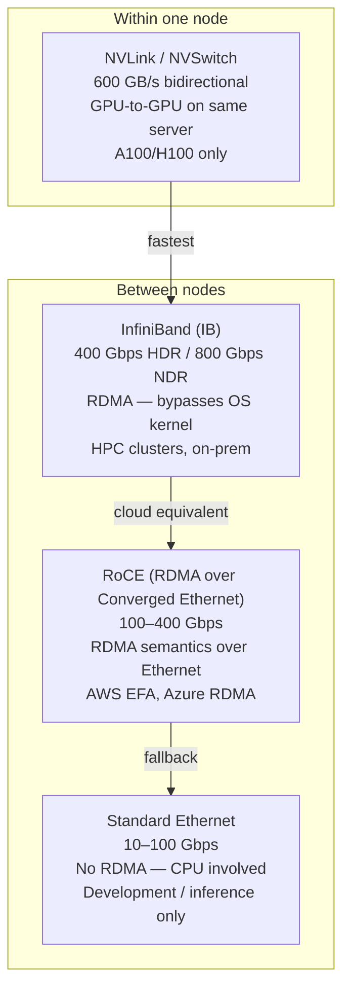
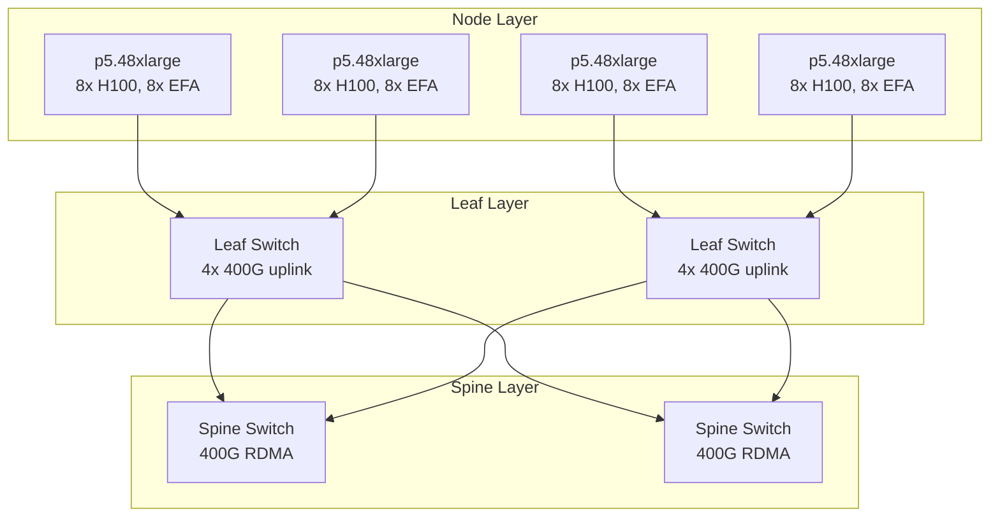

# High-Throughput AI Networking

Distributed training moves massive tensors between GPUs every forward/backward pass. Standard Ethernet bottlenecks this. AI clusters use specialized interconnects that deliver 10–100× the bandwidth of typical cloud networking.

Most sections below end with a quick knowledge check — track how many you clear as you go:

<div class="quiz-progress" data-quiz-progress>
  <span class="quiz-progress-label">0/0 checks</span>
  <span class="quiz-progress-bar"><span class="quiz-progress-fill"></span></span>
</div>

---

## Why Standard Networking Fails for AI Training

A single AllReduce operation during training (synchronizing gradients across all GPUs) for a 70B model transfers ~140GB of data. At 10 Gbps Ethernet: 112 seconds per step. At 400 Gbps InfiniBand: 2.8 seconds per step.

```
Training throughput bottleneck:
  Compute time per step: 5s
  Network sync (AllReduce) at 10 Gbps: 112s   ← 95% time wasted on network
  Network sync (AllReduce) at 400 Gbps: 2.8s  ← 36% overhead (acceptable)
```

Same ~140GB of gradients, same 5s of compute — only the transport changes. Flip between the two to see what that does to a training step:

<div class="toggle-switch">
  <div class="toggle-buttons">
    <button data-toggle-opt="ethernet" class="active state-bad">10 Gbps Ethernet</button>
    <button data-toggle-opt="infiniband" class="state-ok">400 Gbps InfiniBand</button>
  </div>
  <div class="toggle-panel active" data-toggle-panel="ethernet">
    <strong>112 seconds</strong> to sync ~140GB of gradients, against 5s of actual compute per step. Network is <strong>95% of step time</strong> &mdash; the GPUs spend almost the entire step waiting on the wire instead of computing.
  </div>
  <div class="toggle-panel" data-toggle-panel="infiniband">
    <strong>2.8 seconds</strong> for the same ~140GB transfer. Against 5s of compute, that's <strong>36% overhead</strong> &mdash; still real, but the GPUs are doing useful work for most of the step instead of idling on the network.
  </div>
</div>

<div class="quiz-card">
  <p class="quiz-q">A 70B-model AllReduce moves the same ~140GB of gradient data whether the cluster uses 10 Gbps Ethernet or 400 Gbps InfiniBand. So why is one setup usable for training and the other isn't?</p>
  <button class="quiz-reveal">Reveal answer</button>
  <div class="quiz-a" hidden>Because the bottleneck is bandwidth, not data volume &mdash; the same ~140GB transfer takes 112s at 10 Gbps but only 2.8s at 400 Gbps. At 10 Gbps, network sync dwarfs the 5s of actual compute per step (95% overhead); at 400 Gbps it's a manageable 36% overhead. The data moved doesn't change, only how long it takes to move it.</div>
</div>

---

## Interconnect Technologies



### NVLink / NVSwitch (intra-node)

- **NVLink:** Direct GPU-to-GPU connection, bypassing PCIe. 600 GB/s aggregate on H100.
- **NVSwitch:** All-to-all NVLink fabric within one DGX node. 8 GPUs act as one logical device.
- Used automatically by NCCL when topology is detected — no configuration needed.

### InfiniBand (inter-node, on-prem)

- **RDMA (Remote Direct Memory Access):** GPU memory transferred directly to remote GPU memory — CPU never involved, no kernel copy.
- Latency: ~1 microsecond vs ~50 microseconds for TCP.
- Standard in HPC clusters (DGX SuperPOD, Cray, IBM).

### RoCE / AWS EFA (inter-node, cloud)

- **EFA (Elastic Fabric Adapter):** AWS's custom RDMA-capable network interface. Available on P4d (A100), P5 (H100) instances.
- Provides InfiniBand-like performance over Ethernet fabric.
- Required for multi-node distributed training on AWS.

Side-by-side, the headline numbers:

<div class="tab-group">
  <div class="tab-buttons">
    <button data-tab="nvlink" class="active">NVLink / NVSwitch</button>
    <button data-tab="ib">InfiniBand</button>
    <button data-tab="roce">RoCE / EFA</button>
  </div>
  <div class="tab-panels">
    <div class="tab-panel active" data-tab-panel="nvlink">
      <strong>600 GB/s</strong> aggregate, GPU-to-GPU, <strong>within one node only</strong>. Bypasses PCIe entirely. Used automatically by NCCL when the topology is detected &mdash; no configuration needed.
    </div>
    <div class="tab-panel" data-tab-panel="ib">
      <strong>400/800 Gbps</strong> (HDR/NDR) between nodes, RDMA end to end. GPU memory goes straight to remote GPU memory &mdash; the CPU is never involved, no kernel copy. Latency ~1 microsecond vs ~50 microseconds for TCP. Standard in on-prem HPC clusters.
    </div>
    <div class="tab-panel" data-tab-panel="roce">
      <strong>100&ndash;400 Gbps</strong> between nodes, RDMA semantics carried over Ethernet fabric instead of dedicated IB hardware. AWS EFA is the cloud instance of this &mdash; required for multi-node distributed training on AWS.
    </div>
  </div>
</div>

<div class="quiz-card">
  <p class="quiz-q">What does RDMA (InfiniBand or RoCE/EFA) actually save you that a plain TCP/Ethernet transfer doesn't?</p>
  <button class="quiz-reveal">Reveal answer</button>
  <div class="quiz-a" hidden>RDMA moves data straight from one GPU's memory to another's, with the CPU never involved and no kernel copy in the path. That's why RDMA latency lands around ~1 microsecond versus ~50 microseconds for TCP &mdash; the difference isn't raw wire speed, it's skipping the host CPU/kernel round trip entirely.</div>
</div>

---

## AWS EFA Setup on EKS

Getting EFA working end to end is a sequence, not a single config change — each step below has to be in place before the next one does anything useful:

<div class="stepper">
  <div class="stepper-panels">
    <div class="stepper-panel active">
      <strong>1. Pick an EFA-enabled instance type.</strong> Only specific families expose EFA interfaces — e.g. <code>p4d.24xlarge</code> (8x A100, 4x 100 Gbps EFA) or <code>p5.48xlarge</code> (8x H100, 32x 100 Gbps EFA). The wrong instance type means there's no EFA hardware to configure at all.
    </div>
    <div class="stepper-panel">
      <strong>2. Install the EFA driver and plugin.</strong> The driver goes on GPU nodes (user data or a DaemonSet); the EFA device plugin then exposes <code>vpc.amazonaws.com/efa</code> as a schedulable Kubernetes resource.
    </div>
    <div class="stepper-panel">
      <strong>3. Request EFA in the pod spec.</strong> The pod asks for <code>vpc.amazonaws.com/efa</code> interfaces alongside its GPUs, and sets <code>FI_PROVIDER=efa</code> so libfabric actually uses them for the data path. <code>NCCL_SOCKET_IFNAME</code> stays pointed at the regular NIC — that's only for NCCL's control-plane bootstrap, not the tensor traffic.
    </div>
    <div class="stepper-panel">
      <strong>4. Put the node group in a placement group.</strong> Same AZ, physically close racks — this is what actually delivers the low latency EFA is for. Skip it and EFA hardware is present but nodes can still end up far apart on the physical network.
    </div>
  </div>
  <div class="stepper-controls">
    <button class="stepper-prev">← Prev</button>
    <span class="stepper-dots"></span>
    <span class="stepper-label"></span>
    <button class="stepper-next">Next →</button>
  </div>
</div>

Concretely:

```bash
# EFA-enabled instance types
# p4d.24xlarge  → 8x A100 (40GB), 4x 100 Gbps EFA (400 Gbps total)
# p5.48xlarge   → 8x H100, 32x 100 Gbps EFA (3200 Gbps total)

# Install AWS EFA driver on GPU nodes (via user data or DaemonSet)
# EFA plugin exposes vpc.amazonaws.com/efa as a K8s resource
```

```yaml
# Pod requesting EFA interfaces
apiVersion: v1
kind: Pod
spec:
  containers:
  - name: training
    image: nvcr.io/nvidia/pytorch:25.01-py3
    resources:
      limits:
        nvidia.com/gpu: "8"
        vpc.amazonaws.com/efa: "4"    # request 4 EFA interfaces
    env:
    - name: NCCL_SOCKET_IFNAME
      value: "eth0"                   # control-plane NIC for NCCL bootstrap (data path uses EFA/libfabric)
    - name: FI_PROVIDER
      value: "efa"                    # use EFA provider for libfabric
    - name: NCCL_DEBUG
      value: "INFO"
```

```yaml
# Node group for EFA training
# Must use placement group (same rack = lower latency)
apiVersion: eksctl.io/v1alpha5
kind: ClusterConfig
managedNodeGroups:
- name: gpu-training
  instanceType: p4d.24xlarge
  minSize: 0
  maxSize: 8
  availabilityZones: ["us-east-1a"]   # single AZ for placement group
  placementGroup:
    enabled: true                      # ensures nodes are physically close
```

<div class="quiz-card">
  <p class="quiz-q">A training pod sets both <code>NCCL_SOCKET_IFNAME=eth0</code> and <code>FI_PROVIDER=efa</code>. Are these fighting over which NIC carries the tensor data?</p>
  <button class="quiz-reveal">Reveal answer</button>
  <div class="quiz-a" hidden>No — they cover different jobs. <code>NCCL_SOCKET_IFNAME</code> only picks the interface NCCL uses to bootstrap (the control-plane handshake between ranks); the actual data path uses EFA/libfabric, which is what <code>FI_PROVIDER=efa</code> selects. eth0 for setup, EFA for the tensors.</div>
</div>

---

## NCCL — NVIDIA Collective Communications Library

NCCL handles the AllReduce, AllGather, Broadcast operations across GPUs. It automatically selects the fastest transport (NVLink → EFA → Ethernet).

```bash
# Key NCCL environment variables
NCCL_SOCKET_IFNAME=eth0        # which network interface to use
NCCL_IB_DISABLE=0              # enable InfiniBand (0=yes, 1=no)
NCCL_DEBUG=INFO                # verbose logging for debugging
NCCL_NET_GDR_LEVEL=2           # GPU Direct RDMA level (bypass host memory)
NCCL_TOPO_DUMP_FILE=/tmp/nccl  # dump detected topology for debugging

# Test NCCL bandwidth between nodes
kubectl exec -it training-pod -- nccl-tests/build/all_reduce_perf \
  -b 8 -e 256M -f 2 -g 8       # sweep from 8B to 256MB, 8 GPUs
```

NCCL topology detection output shows which GPUs are connected via NVLink vs PCIe vs network.

<div class="quiz-card">
  <p class="quiz-q">Do you need to manually tell NCCL to prefer NVLink over Ethernet for GPUs on the same node?</p>
  <button class="quiz-reveal">Reveal answer</button>
  <div class="quiz-a" hidden>No. NCCL automatically selects the fastest available transport (NVLink → EFA → Ethernet) based on the topology it detects — that selection happens without configuration. The environment variables above are for tuning/debugging which transport it's using, not for choosing it in the first place.</div>
</div>

---

## Cilium for AI Cluster Networking

For inference clusters (not training), Cilium's eBPF-based networking reduces per-packet CPU overhead — critical when serving 10K+ concurrent LLM requests.

```bash
# Install Cilium with bandwidth manager for AI inference
helm install cilium cilium/cilium \
  --set bandwidthManager.enabled=true \     # BBR congestion control
  --set bandwidthManager.bbr=true \         # better throughput than CUBIC
  --set kubeProxyReplacement=true \         # eliminate iptables overhead
  --set loadBalancer.algorithm=maglev       # consistent hashing for session affinity
```

**Why Cilium matters for inference:**
- 0 iptables rules → no rule-chain traversal per packet
- Socket-level load balancing → direct pod-to-pod without DNAT
- Network policies with L7 awareness → block by HTTP path without sidecar

<div class="quiz-card">
  <p class="quiz-q">Training clusters care about InfiniBand/EFA bandwidth. Why does Cilium's eBPF networking matter for inference instead, rather than training?</p>
  <button class="quiz-reveal">Reveal answer</button>
  <div class="quiz-a" hidden>Training's bottleneck is bandwidth between a handful of GPUs doing AllReduce — that's what RDMA/EFA solves. Inference at scale is a different shape of problem: 10K+ concurrent requests, each one small, where per-packet CPU overhead (iptables rule-chain traversal, DNAT) adds up. Cilium's eBPF path removes that per-packet cost rather than adding raw bandwidth.</div>
</div>

---

## Network Topology for AI Clusters



**Fat-tree / CLOS topology** ensures any-to-any communication at line rate — no oversubscription. Critical for AllReduce where every node communicates with every other node simultaneously.

<div class="quiz-card">
  <p class="quiz-q">Why does AllReduce specifically need a fat-tree/CLOS topology instead of a cheaper, oversubscribed network design?</p>
  <button class="quiz-reveal">Reveal answer</button>
  <div class="quiz-a" hidden>AllReduce isn't a few nodes talking to a central point — every node communicates with every other node simultaneously. An oversubscribed design assumes not everyone talks at once and lets traffic contend for shared uplinks; a fat-tree/CLOS fabric gives any-to-any communication at line rate with no oversubscription, which is exactly the traffic pattern AllReduce produces.</div>
</div>

---

## Quick Reference: Which Interconnect for What

| Scenario | Recommended | Why |
|----------|-------------|-----|
| Single-node training (≤8 GPUs) | NVLink (automatic) | 600 GB/s intra-node, no config |
| Multi-node training on AWS | EFA (p4d/p5 instances) + NCCL | RDMA-like performance on cloud |
| Multi-node training on-prem | InfiniBand HDR/NDR | Lowest latency, highest bandwidth |
| Online LLM inference at scale | Cilium + standard Ethernet | Throughput matters, not RDMA |
| Development / single GPU | Standard VPC networking | No special setup needed |
