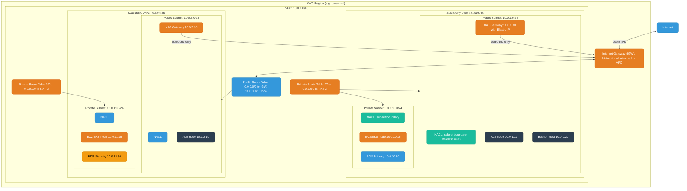
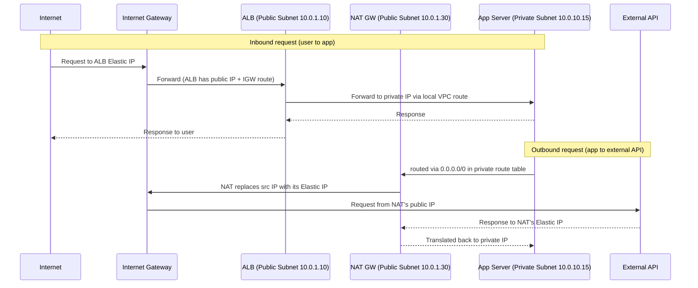
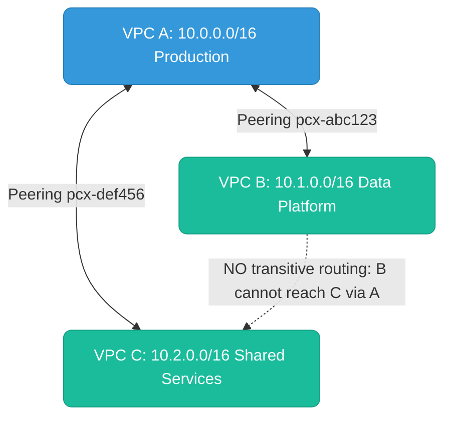
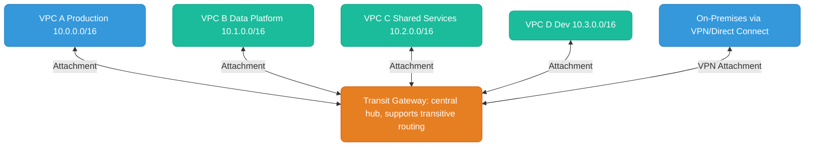

# AWS Networking

How traffic actually moves through a VPC — subnets, gateways, the two firewall layers, and the routing rules that tie all of it together. Most sections below end with a quick knowledge check; track your progress as you go.

<div class="quiz-progress" data-quiz-progress>
  <span class="quiz-progress-label">0/0 checks</span>
  <span class="quiz-progress-bar"><span class="quiz-progress-fill"></span></span>
</div>

---

## VPC Architecture

A **VPC (Virtual Private Cloud)** is your private, logically isolated network inside AWS. Everything lives inside a VPC — EC2 instances, RDS databases, EKS worker nodes, Lambda functions (in VPC mode).



<div class="quiz-card">
  <p class="quiz-q">Looking at the diagram above: is a NAT Gateway attached directly to the VPC the way the Internet Gateway is, or does it live inside a specific subnet?</p>
  <button class="quiz-reveal">Reveal answer</button>
  <div class="quiz-a" hidden>It lives inside a specific (public) subnet, with its own private IP and an Elastic IP &mdash; that's why you need one NAT Gateway per AZ. The IGW is different: it attaches to the VPC as a whole and is bidirectional, not tied to any one subnet.</div>
</div>

---

## Public vs Private Subnets

The distinction between public and private is **entirely determined by the route table** associated with the subnet — specifically whether a route for `0.0.0.0/0` points to an **Internet Gateway** or a **NAT Gateway**.

### What Makes a Subnet Public

A subnet is public when:
1. Its route table has a route `0.0.0.0/0 → <internet-gateway-id>`
2. Resources in it have a **public IPv4 address** (or Elastic IP) assigned

Both conditions are required. A route to IGW without a public IP won't give internet access; a public IP without the route also won't.

```
Public Route Table:
  Destination     Target
  10.0.0.0/16     local        ← VPC-internal traffic stays local
  0.0.0.0/0       igw-abc123   ← everything else → internet
```

**What lives in public subnets:** Load balancers (ALB/NLB), NAT Gateways, Bastion/jump hosts.

### What Makes a Subnet Private

A subnet is private when its route table routes `0.0.0.0/0` to a **NAT Gateway** instead of the IGW. Private resources can initiate outbound connections via NAT, but nothing on the internet can initiate a connection TO them.

```
Private Route Table (AZ-a):
  Destination     Target
  10.0.0.0/16     local
  0.0.0.0/0       nat-xyz789   ← outbound only, via NAT in public subnet
```

**What lives in private subnets:** EC2/EKS worker nodes, RDS databases, ElastiCache, internal services.

### Traffic Flow Comparison



Key insight: **The app server is never directly reachable from the internet**. Inbound goes through the ALB. Outbound is NAT'd — the external service sees the NAT Gateway's Elastic IP, not the app's private IP.

Same outbound leg, one step at a time:

<div class="stepper">
  <div class="stepper-panels">
    <div class="stepper-panel active">
      <strong>1. App server sends the request.</strong> Its private route table has no route to an IGW at all &mdash; the only match for <code>0.0.0.0/0</code> is the local NAT Gateway.
    </div>
    <div class="stepper-panel">
      <strong>2. NAT Gateway rewrites the source.</strong> It swaps the app's private IP for its own Elastic IP and forwards the packet on toward the IGW.
    </div>
    <div class="stepper-panel">
      <strong>3. IGW hands it to the internet.</strong> The external API only ever sees the NAT Gateway's Elastic IP as the source &mdash; the app server's private IP never appears on the wire outside the VPC.
    </div>
    <div class="stepper-panel">
      <strong>4. External API replies to the NAT Gateway's Elastic IP.</strong> As far as the external service is concerned, that's who asked.
    </div>
    <div class="stepper-panel">
      <strong>5. NAT Gateway translates back.</strong> It maps the response back onto the app server's private IP and delivers it &mdash; the app server never had a public, internet-routable identity at any point in the exchange.
    </div>
  </div>
  <div class="stepper-controls">
    <button class="stepper-prev">← Prev</button>
    <span class="stepper-dots"></span>
    <span class="stepper-label"></span>
    <button class="stepper-next">Next →</button>
  </div>
</div>

The whole public/private split comes down to one property. Flip between the two:

<div class="toggle-switch">
  <div class="toggle-buttons">
    <button data-toggle-opt="pub" class="active state-ok">Public subnet</button>
    <button data-toggle-opt="priv" class="state-warn">Private subnet</button>
  </div>
  <div class="toggle-panel active" data-toggle-panel="pub">
    <strong>Route table sends <code>0.0.0.0/0</code> to the IGW.</strong> Combined with a public IP on the resource, this is what lets the internet initiate a connection in. Typical residents: ALB/NLB, NAT Gateways, bastion hosts &mdash; things that genuinely need to be reachable from outside.
  </div>
  <div class="toggle-panel" data-toggle-panel="priv">
    <strong>Route table sends <code>0.0.0.0/0</code> to a NAT Gateway instead.</strong> Resources can still initiate outbound connections, but nothing on the internet can initiate one in. Typical residents: EC2/EKS worker nodes, RDS, ElastiCache, internal services.
  </div>
</div>

<div class="quiz-card">
  <p class="quiz-q">Every resource in a subnet has a public IPv4 address assigned. Its route table sends 0.0.0.0/0 to a NAT Gateway. Is this subnet public or private?</p>
  <button class="quiz-reveal">Reveal answer</button>
  <div class="quiz-a" hidden>Private. Being public requires <em>both</em> a route to an Internet Gateway <em>and</em> a public IP &mdash; a public IP alone with no IGW route doesn't grant internet access. The route table target is what actually classifies the subnet.</div>
</div>

---

## Security Groups vs NACLs

These are the two firewall layers in AWS. They operate at different levels and have fundamentally different behavior.

### Security Groups (SGs)

Attached to an **ENI (Elastic Network Interface)** — operates at the **resource level inside the VPC**.

**Security Groups are STATEFUL.**

Stateful means: if you allow inbound traffic on port 443, the **return traffic (response) is automatically allowed** without an explicit outbound rule. The SG tracks the TCP connection in a state table. Reply packets for an established connection are always permitted, regardless of outbound rules.

**SG Rule Characteristics:**
- **Allow-only** — there is no explicit deny. Anything not matched is implicitly denied.
- Rules reference other SGs by ID: `allow inbound TCP 5432 from sg-app-servers` — means any ENI with that SG in the same VPC.
- Evaluated as a **union** — if any rule allows, it's allowed.

```
Security Group: sg-app-server
  Inbound:
    TCP 8080   from  sg-alb         (only ALB can reach app)
    TCP 5432   from  sg-app-server  (inter-pod communication)
  Outbound:
    TCP 5432   to    sg-rds         (app → RDS)
    TCP 443    to    0.0.0.0/0      (app → external HTTPS)
    (return traffic: automatically allowed — stateful)
```

### NACLs (Network Access Control Lists)

Attached to a **subnet** — filters all traffic crossing the **subnet boundary**.

**NACLs are STATELESS.**

Stateless means: **every packet is evaluated independently** in both directions. No connection tracking. If you allow inbound TCP 443, you must ALSO explicitly allow the outbound ephemeral ports (1024-65535) for the return traffic. If you forget, the SYN-ACK can't leave your subnet and TCP connections fail silently.

**NACL Rule Characteristics:**
- Rule number (1–32766) — lower = evaluated first, first match wins.
- Rules can **allow or deny** — you can block specific IPs before a broader allow.
- Final implicit `* DENY ALL` that cannot be removed.

```
NACL: nacl-private-subnet
  Inbound:
    100  ALLOW  TCP  10.0.1.0/24   port 8080       (from ALB public subnet)
    110  ALLOW  TCP  10.0.0.0/16   port 5432       (DB connections)
    *    DENY   ALL  0.0.0.0/0

  Outbound:
    100  ALLOW  TCP  10.0.1.0/24   ports 1024-65535  (ephemeral return to ALB — MUST have this)
    110  ALLOW  TCP  10.0.1.30/32  port 443           (to NAT GW)
    *    DENY   ALL  0.0.0.0/0
```

### Head-to-Head Comparison

| Property | Security Group | NACL |
|----------|---------------|------|
| **Operates at** | ENI / instance level | Subnet boundary |
| **Stateful / Stateless** | **Stateful** — return traffic auto-allowed | **Stateless** — must allow both directions explicitly |
| **Allow / Deny rules** | Allow only (implicit deny) | Allow AND explicit deny |
| **Rule evaluation** | All rules, union of allows | Ordered by rule number, first match wins |
| **Scope** | Specific ENIs | ALL traffic crossing the subnet |
| **Default (new VPC)** | No inbound, all outbound | All traffic allowed |
| **Rule limits** | 60 inbound + 60 outbound | 20 inbound + 20 outbound |
| **Reference other SGs** | Yes | No — CIDR only |
| **Typical use** | Fine-grained service-to-service | Broad subnet defense, block IP ranges |

### Where They Sit in the Network Path


Response travels the same path in reverse. SGs auto-allow the return; NACLs require explicit outbound rules for ephemeral ports.

Walk the request through each checkpoint:

<div class="stepper">
  <div class="stepper-panels">
    <div class="stepper-panel active">
      <strong>1. Internet → IGW.</strong> Bidirectional, attached to the VPC. No filtering happens here.
    </div>
    <div class="stepper-panel">
      <strong>2. IGW → public subnet NACL.</strong> First checkpoint. Stateless &mdash; the inbound rule list is checked in order by rule number, first match wins.
    </div>
    <div class="stepper-panel">
      <strong>3. NACL → ALB's Security Group.</strong> Stateful. If this rule allows the connection, the eventual reply is auto-allowed later &mdash; no separate outbound rule needed for it.
    </div>
    <div class="stepper-panel">
      <strong>4. ALB → private subnet NACL.</strong> A second, independent stateless checkpoint &mdash; its own rule list, separate from the public subnet's NACL.
    </div>
    <div class="stepper-panel">
      <strong>5. NACL → app server's Security Group.</strong> Stateful again, checked against the app's own SG rules.
    </div>
    <div class="stepper-panel">
      <strong>6. App processes, response retraces the path.</strong> Both SGs auto-allow the reply. Both NACLs don't &mdash; each one needs its own explicit outbound rule for the ephemeral port range, or the reply gets silently dropped at the subnet boundary.
    </div>
  </div>
  <div class="stepper-controls">
    <button class="stepper-prev">← Prev</button>
    <span class="stepper-dots"></span>
    <span class="stepper-label"></span>
    <button class="stepper-next">Next →</button>
  </div>
</div>

The one property that explains almost every SG-vs-NACL surprise:

<div class="toggle-switch">
  <div class="toggle-buttons">
    <button data-toggle-opt="sg" class="active">Security Group (stateful)</button>
    <button data-toggle-opt="nacl">NACL (stateless)</button>
  </div>
  <div class="toggle-panel active" data-toggle-panel="sg">
    Allow inbound on a port, and the return traffic is <strong>automatically permitted</strong> &mdash; the SG tracks the connection in a state table. You almost never need to think about outbound rules for replies.
  </div>
  <div class="toggle-panel" data-toggle-panel="nacl">
    Every packet is evaluated <strong>independently in both directions</strong>. Allow inbound TCP 443 and forget the outbound ephemeral-port rule (1024&ndash;65535), and the SYN-ACK can't leave the subnet &mdash; the connection just times out with no obvious error.
  </div>
</div>

<div class="quiz-card">
  <p class="quiz-q">You add a NACL rule allowing inbound TCP 443, but never add an outbound rule for ephemeral ports 1024-65535. What happens to connections that should otherwise succeed?</p>
  <button class="quiz-reveal">Reveal answer</button>
  <div class="quiz-a" hidden>They fail silently. NACLs are stateless, so the return packet (e.g. the SYN-ACK) is a separate packet that needs its own explicit outbound allow &mdash; without the ephemeral-port rule, it can't leave the subnet, and the client just sees a hang or timeout, not a clear rejection.</div>
</div>

**In practice:** NACLs are last-line-of-defense for blocking entire IP ranges at subnet level (useful in PCI-DSS/HIPAA). Security Groups are the primary day-to-day firewall for service-to-service rules. Most teams leave NACLs as "allow all" and do real access control in SGs.

---

## NAT Gateway vs Internet Gateway

| | Internet Gateway (IGW) | NAT Gateway |
|---|---|---|
| **Direction** | Bidirectional (inbound + outbound) | Outbound only |
| **Attached to** | VPC | Subnet (must be public) |
| **Who uses it** | Public subnet resources | Private subnet resources |
| **IP translation** | None — passes through | Translates private IP to NAT's Elastic IP |
| **HA** | Fully managed, no SPOF | Single AZ — deploy one per AZ |
| **Cost** | Free | ~$0.045/hr + data processing |

**NAT Gateway AZ-locality:** Always deploy one NAT Gateway per AZ and route each AZ's private subnet to its local NAT GW. Cross-AZ traffic incurs ~$0.01/GB data transfer charges.

**Cost gotcha — NAT Gateway for AWS service traffic:**
NAT Gateway charges ~$0.045/hr + ~$0.045/GB processed. For heavy traffic to S3, ECR, or DynamoDB routed through NAT, costs compound fast.

**Fix: VPC Endpoints** bypass NAT entirely — traffic stays on the AWS backbone:

| Endpoint Type | Services | Cost | Route table change? |
|--------------|----------|------|---------------------|
| **Gateway Endpoint** | S3, DynamoDB | **Free** | Yes — adds prefix list route |
| **Interface Endpoint** | ECR, Secrets Manager, SSM, SQS, etc. | ~$0.01/hr per AZ + data | No — uses private DNS |

```
# Route table with S3 Gateway Endpoint (replaces NAT for S3 traffic):
10.0.0.0/16    local
pl-68a54001    vpce-s3-xxxx   ← S3 prefix list → stays on AWS backbone (free)
0.0.0.0/0      nat-xyz789     ← everything else still goes through NAT
```

For EKS clusters pulling images from ECR or writing to S3 — add VPC endpoints first before diagnosing high NAT costs.

<div class="quiz-card">
  <p class="quiz-q">An EKS cluster's NAT Gateway costs are climbing, driven mostly by traffic to S3 and ECR. What's the fix, and why does it actually save money?</p>
  <button class="quiz-reveal">Reveal answer</button>
  <div class="quiz-a" hidden>Add VPC Endpoints (a Gateway Endpoint for S3, Interface Endpoints for ECR). Traffic through an endpoint stays on the AWS backbone instead of being processed by the NAT Gateway &mdash; the Gateway Endpoint is free, and either way you stop paying NAT's ~$0.045/GB processing charge for that traffic.</div>
</div>

---

## Route Tables

Every subnet is associated with one route table. Routes are evaluated **most specific first** (longest prefix match).

```
Packet to 10.0.5.20:
  10.0.0.0/16  → local          (/16 matches)
  10.0.5.0/24  → vpc-endpoint   (/24 MORE specific → wins)
  0.0.0.0/0    → igw-abc123

Result: routed to vpc-endpoint
```

**VPC Endpoints** in route tables keep traffic to S3/DynamoDB inside AWS's network (free, faster, no NAT GW needed):
```
10.0.0.0/16    local
pl-68a54001    vpce-s3-xxxx   ← S3 prefix list to VPC endpoint
0.0.0.0/0      nat-xyz789
```

<div class="quiz-card">
  <p class="quiz-q">A route table lists 0.0.0.0/0 → igw-abc123 above 10.0.5.0/24 → vpc-endpoint. For a packet to 10.0.5.20, does the listing order matter, and which route wins?</p>
  <button class="quiz-reveal">Reveal answer</button>
  <div class="quiz-a" hidden>Listing order never matters &mdash; AWS always evaluates by longest prefix match. The /24 route to the VPC endpoint wins because it's more specific than the /0 default route, regardless of which one appears first in the table.</div>
</div>

---

## VPC Peering vs Transit Gateway

### VPC Peering

Direct 1:1 network connection between two VPCs over AWS backbone.



**Key limitation: No transitive routing.** B cannot reach C through A — each pair needs its own peering. N VPCs need N*(N-1)/2 connections.

### Transit Gateway (TGW)

Managed regional hub-and-spoke router. All VPCs attach to TGW; TGW routes between them with full transitive routing support.



Each VPC's route table only needs: `0.0.0.0/0 → tgw-abc123`. TGW route tables isolate environments (prod from dev).

| | VPC Peering | Transit Gateway |
|--|------------|----------------|
| Topology | Point-to-point | Hub-and-spoke |
| Transitive routing | No | Yes |
| Scalability | ~125 peers per VPC | Thousands of attachments |
| Cross-region | Yes (inter-region peering) | Yes (TGW peering) |
| Cost | No hourly fee, data transfer only | $0.05/hr per attachment + $0.02/GB |
| Best for | Simple, few VPCs | Enterprise, many VPCs, on-prem hybrid |

**Rule of thumb:** 2 VPCs → use peering (free, lower latency). 3+ VPCs, cross-region, or on-prem hybrid → use Transit Gateway (centralized, transitive, worth the cost).

<div class="toggle-switch">
  <div class="toggle-buttons">
    <button data-toggle-opt="peering" class="active">VPC Peering</button>
    <button data-toggle-opt="tgw">Transit Gateway</button>
  </div>
  <div class="toggle-panel active" data-toggle-panel="peering">
    <strong>Point-to-point, no transitive routing.</strong> Each pair of VPCs that needs to talk needs its own peering connection &mdash; N VPCs means up to N*(N-1)/2 connections. Cheapest and lowest-latency option, but it doesn't scale past a handful of VPCs.
  </div>
  <div class="toggle-panel" data-toggle-panel="tgw">
    <strong>Hub-and-spoke, full transitive routing.</strong> Every VPC attaches once to the TGW and can reach every other attached VPC through it. Each VPC's route table collapses to a single <code>0.0.0.0/0 → tgw-abc123</code> entry. Costs an hourly per-attachment fee, but scales to thousands of attachments and on-prem hybrid setups.
  </div>
</div>

<div class="quiz-card">
  <p class="quiz-q">VPC A is peered with both VPC B and VPC C. Can traffic from VPC B reach VPC C by routing through VPC A?</p>
  <button class="quiz-reveal">Reveal answer</button>
  <div class="quiz-a" hidden>No. VPC Peering has no transitive routing &mdash; each pair needs its own direct peering connection. B and C would need to peer with each other directly, or all three would need to attach to a Transit Gateway instead.</div>
</div>

---

## Route Tables — Deep Dive

Every subnet is associated with exactly one route table. Routes are evaluated using **longest prefix match** — the most specific matching route wins, regardless of the order entries are listed.

### The "local" route

Every route table in every VPC contains a `local` entry that cannot be deleted or modified:

```
Destination     Target
10.0.0.0/16     local
```

This means: any packet destined for an IP within the VPC CIDR (`10.0.0.0/16`) is routed internally within AWS's network fabric — directly to the target ENI without leaving the VPC. No gateway, no NAT, no internet hop.

The `local` route is why:
- An EC2 in `10.0.1.0/24` can reach an RDS in `10.0.10.0/24` without any gateway
- A private subnet app server can talk to a private subnet database
- Cross-AZ communication within the same VPC is transparent

**Important:** `local` routes cannot be replaced or overridden for the VPC CIDR itself. You cannot route VPC-internal traffic to a NAT GW or IGW.

<div class="quiz-card">
  <p class="quiz-q">Can you edit a route table to send traffic destined for the VPC's own CIDR block to a NAT Gateway instead of delivering it locally?</p>
  <button class="quiz-reveal">Reveal answer</button>
  <div class="quiz-a" hidden>No. The <code>local</code> route for the VPC CIDR can't be replaced or overridden &mdash; VPC-internal traffic always resolves via the local route, directly to the target ENI within AWS's network fabric, no gateway or NAT involved.</div>
</div>

### Longest prefix match — concrete examples

```
Route table:
  10.0.0.0/16        local
  10.0.5.0/24        vpce-s3-xxxx        (S3 VPC endpoint)
  172.16.0.0/12      tgw-abc123          (Transit Gateway for on-prem)
  0.0.0.0/0          nat-xyz789

Packet to 10.0.5.20:
  10.0.0.0/16  matches (/16)
  10.0.5.0/24  matches (/24) ← MORE specific — WINS
  Result: routed to VPC endpoint (stays on AWS backbone, free)

Packet to 10.0.99.5:
  10.0.0.0/16  matches (/16) ← WINS
  10.0.5.0/24  doesn't match
  Result: routed via local (VPC-internal)

Packet to 172.16.50.1:
  172.16.0.0/12  matches (/12) ← WINS
  Result: routed to Transit Gateway (on-prem traffic)

Packet to 8.8.8.8:
  No specific match → 0.0.0.0/0  ← default route WINS
  Result: routed to NAT Gateway
```

Same resolution, one step at a time, for the `10.0.5.20` packet above:

<div class="stepper">
  <div class="stepper-panels">
    <div class="stepper-panel active">
      <strong>1. Packet arrives for 10.0.5.20.</strong> The router doesn't stop at the first route that matches &mdash; it checks the destination against every route in the table.
    </div>
    <div class="stepper-panel">
      <strong>2. 10.0.0.0/16 → local matches.</strong> A /16 covers this address. Candidate route #1.
    </div>
    <div class="stepper-panel">
      <strong>3. 10.0.5.0/24 → vpce-s3-xxxx also matches.</strong> And it's more specific &mdash; a /24 is a narrower, more precise match than a /16. Candidate route #2, currently winning.
    </div>
    <div class="stepper-panel">
      <strong>4. 0.0.0.0/0 → nat-xyz789 matches too</strong> &mdash; technically every address matches the default route &mdash; but it's the least specific of the three candidates.
    </div>
    <div class="stepper-panel">
      <strong>5. Longest prefix wins.</strong> The /24 route to the VPC endpoint is chosen. The packet goes over the AWS backbone, free and fast &mdash; and this outcome doesn't depend on which order the three routes happened to be listed in.
    </div>
  </div>
  <div class="stepper-controls">
    <button class="stepper-prev">← Prev</button>
    <span class="stepper-dots"></span>
    <span class="stepper-label"></span>
    <button class="stepper-next">Next →</button>
  </div>
</div>

### Complete route table examples

**Public subnet (internet-facing):**
```
Destination           Target                  Note
10.0.0.0/16           local                   VPC-internal (all subnets reachable)
pl-68a54001           vpce-s3-xxxx            S3 prefix list → VPC endpoint (free)
0.0.0.0/0             igw-abc123              All other traffic → Internet Gateway
```

**Private subnet (AZ-a, with NAT):**
```
Destination           Target                  Note
10.0.0.0/16           local                   VPC-internal
pl-68a54001           vpce-s3-xxxx            S3 via AWS backbone (avoids NAT cost)
pl-60b04049           vpce-ddb-xxxx           DynamoDB via AWS backbone (avoids NAT cost)
10.1.0.0/16           pcx-peering123          VPC peering to data platform VPC
172.16.0.0/12         tgw-abc123              On-prem via Transit Gateway
0.0.0.0/0             nat-xyz789              Internet-bound via NAT GW in AZ-a
```

**Private subnet (AZ-b) — separate NAT GW:**
```
Destination           Target
10.0.0.0/16           local
pl-68a54001           vpce-s3-xxxx
0.0.0.0/0             nat-def456              Different NAT GW — same AZ as this subnet
```

**Why separate NAT Gateway per AZ:**
Cross-AZ data transfer costs ~$0.01/GB. A private subnet in AZ-b routing through a NAT GW in AZ-a incurs this charge on every outbound byte. More critically, if AZ-a fails, the NAT GW in AZ-a is gone — all private subnets in other AZs lose internet connectivity. Per-AZ NAT is both cheaper and more resilient.

### VPC Endpoint routes

Gateway endpoints (S3 and DynamoDB) inject prefix list entries into route tables:

```bash
# List S3 and DynamoDB prefix lists in your region
aws ec2 describe-prefix-lists --region us-east-1 \
  --query 'PrefixLists[*].{ID:PrefixListId,Name:PrefixListName}'
# pl-68a54001  com.amazonaws.us-east-1.s3
# pl-60b04049  com.amazonaws.us-east-1.dynamodb
```

When you create a Gateway Endpoint, AWS automatically adds these prefix list routes to the route tables you specify. Traffic that matches goes directly to AWS services over the private backbone — free, no NAT, no IGW, no bandwidth charges.

Interface endpoints (ECR, SSM, Secrets Manager, etc.) work differently — they create ENIs in your subnet with private IPs, and use private DNS to override the service's public hostname.

### Transit Gateway routes

```
# Route to on-prem via TGW
172.16.0.0/12     tgw-abc123

# Route to another VPC via TGW (alternative to VPC peering)
10.1.0.0/16       tgw-abc123    ← VPC B's CIDR
10.2.0.0/16       tgw-abc123    ← VPC C's CIDR
```

The TGW itself has its own route table that maps CIDR ranges to attachments (VPC attachment, VPN attachment, Direct Connect GW). You can segment with multiple TGW route tables for isolation (e.g., prod VPCs cannot talk to dev VPCs even through the same TGW).

### Virtual Private Gateway (VPN/Direct Connect)

```
# On-prem routes learned via BGP from a VGW (Virtual Private Gateway)
192.168.0.0/16    vgw-abc123    ← on-prem data center
10.100.0.0/16     vgw-abc123    ← another on-prem range
```

With **route propagation enabled**, VGW dynamically injects routes learned via BGP into your route table. No manual route management needed.

```bash
# Enable route propagation in a route table
aws ec2 enable-vgw-route-propagation \
  --route-table-id rtb-xxx \
  --gateway-id vgw-xxx
```

### Blackhole routes

A route with target `blackhole` silently drops matched traffic — no ICMP unreachable, no TCP RST:

```
10.0.99.0/24    blackhole    ← traffic to this range is dropped
```

Blackhole routes appear when:
- A VPC peering connection is deleted but the route entry isn't removed
- A NAT GW or VPN GW is deleted while still referenced in a route table
- Manually created for security (block specific IP ranges)

```bash
# Find blackhole routes in all route tables
aws ec2 describe-route-tables --region us-east-1 \
  --query 'RouteTables[*].Routes[?State==`blackhole`]'
```

<div class="quiz-card">
  <p class="quiz-q">A route table has a stale route pointing at a VPC peering connection that was deleted last week — it now shows target `blackhole`. What happens to traffic matching that route?</p>
  <button class="quiz-reveal">Reveal answer</button>
  <div class="quiz-a" hidden>It's silently dropped &mdash; no ICMP unreachable, no TCP RST, nothing sent back to the source. The packet just disappears, which is exactly why stale blackhole routes left behind by deleted peering connections or gateways are worth actively auditing for.</div>
</div>

### Troubleshooting route table issues

```bash
# Which route table is associated with a subnet?
aws ec2 describe-subnets --subnet-ids subnet-xxx \
  --query 'Subnets[0].{SubnetId:SubnetId,AZ:AvailabilityZone}'

aws ec2 describe-route-tables \
  --filters "Name=association.subnet-id,Values=subnet-xxx" \
  --query 'RouteTables[0].Routes'

# Test reachability between two resources (uses VPC Reachability Analyzer)
aws ec2 create-network-insights-path \
  --source <src-eni-id> \
  --destination <dst-eni-id> \
  --protocol TCP
aws ec2 start-network-insights-analysis \
  --network-insights-path-id <path-id>
# Shows exactly which SG rule, NACL, or route table entry blocks or allows the path
```
