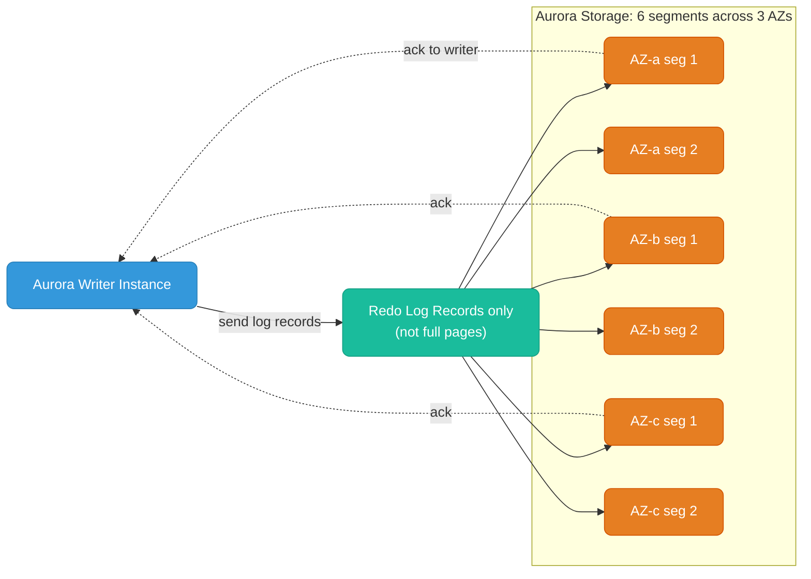
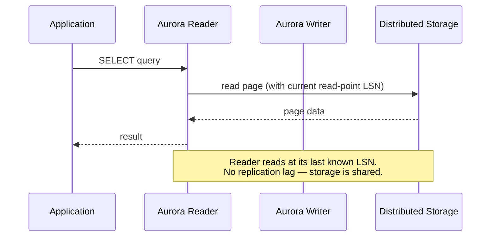
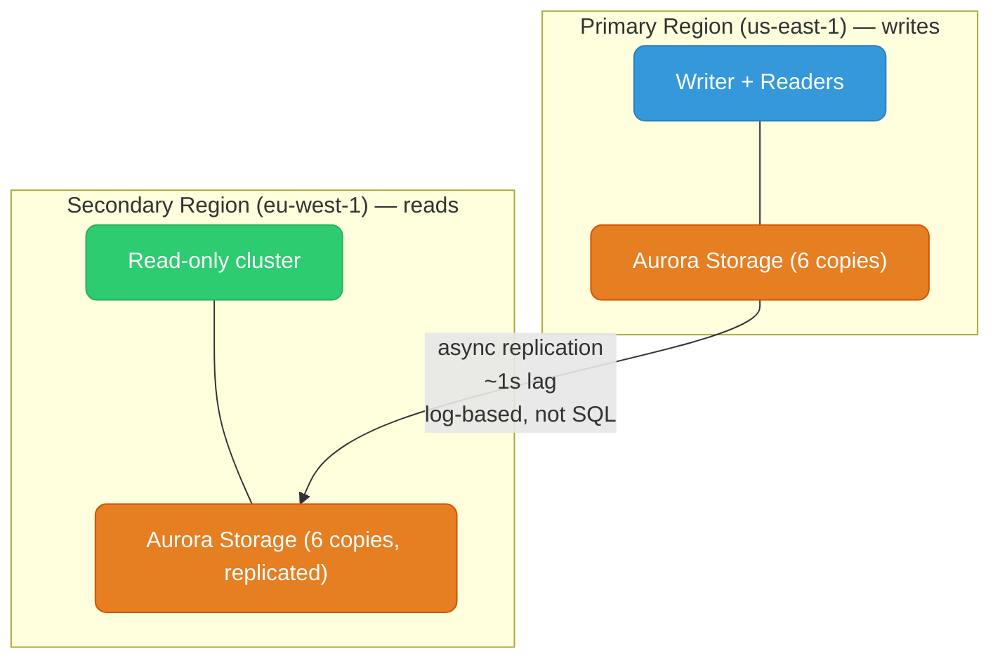
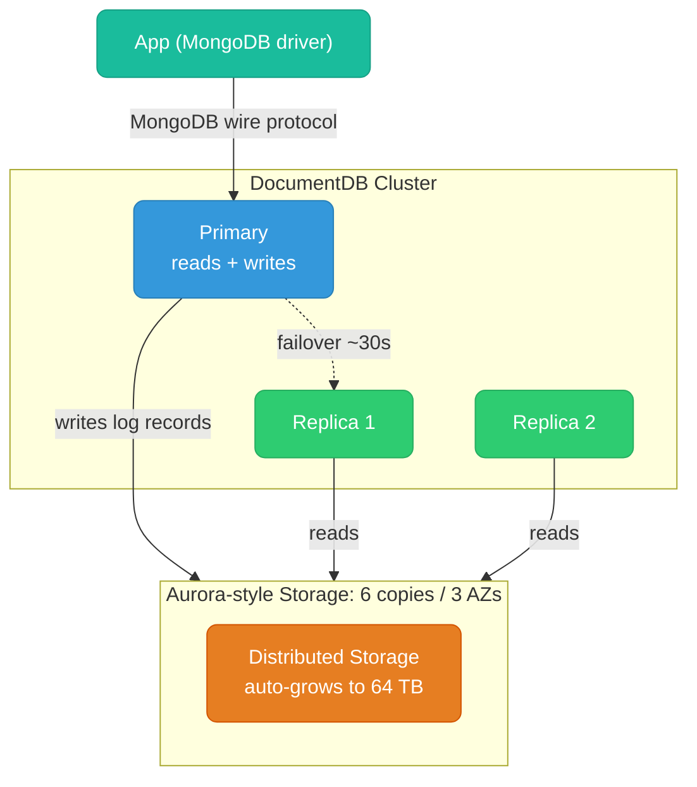
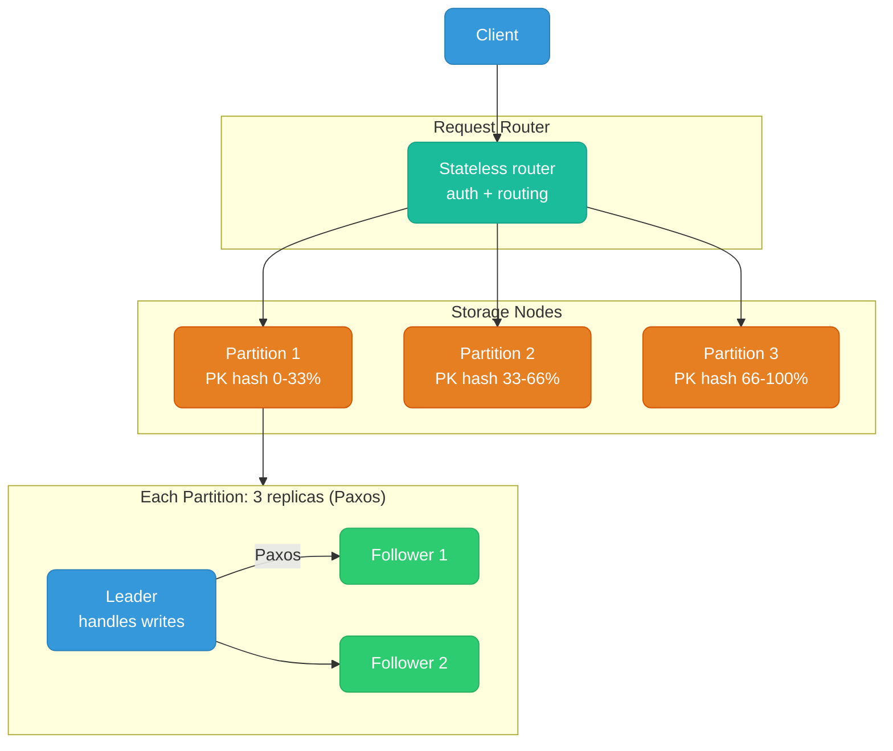
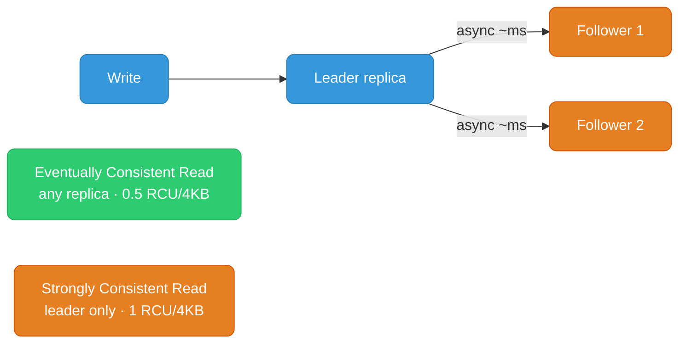
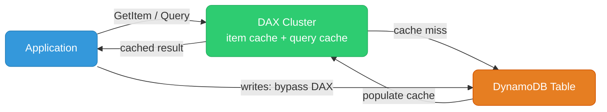
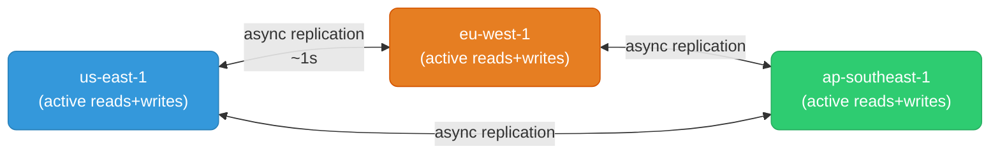
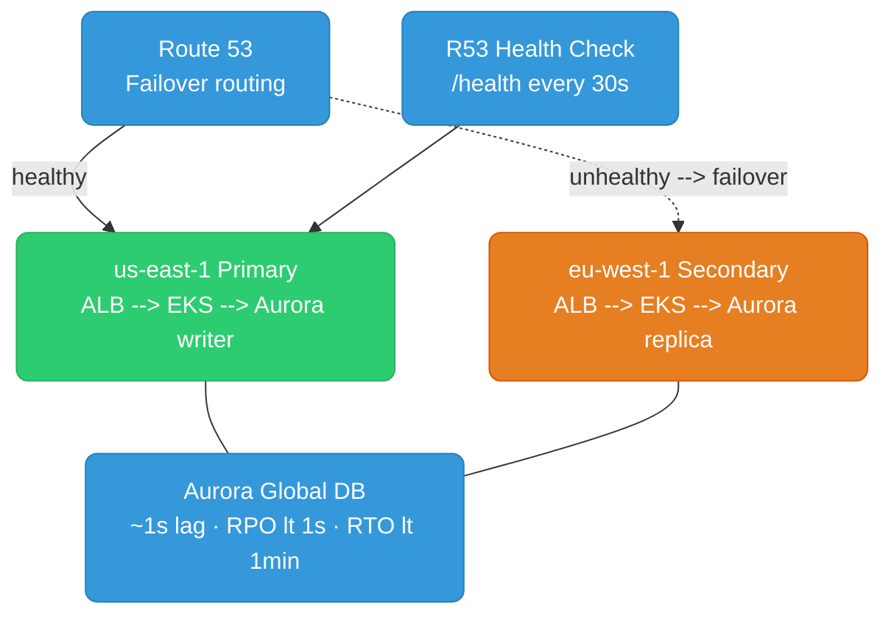

# AWS Databases Deep Dive

Aurora, DocumentDB, DynamoDB internals — and the most important AWS scenarios every backend engineer faces.

Knowledge checks are dropped after most sections — track how many you've cleared as you go:

<div class="quiz-progress" data-quiz-progress>
  <span class="quiz-progress-label">0/0 checks</span>
  <span class="quiz-progress-bar"><span class="quiz-progress-fill"></span></span>
</div>

---

## Aurora: Storage Architecture Internals

Aurora's biggest innovation is **separating storage from compute** and replacing the traditional database write path.

### Traditional RDS Write Path (Why it's slow)

In vanilla RDS (MySQL/PostgreSQL), every write does five separate I/O operations, all of which get replicated to the standby. Step through it:

<div class="stepper">
  <div class="stepper-panels">
    <div class="stepper-panel active">
      <strong>1. Write to redo log (WAL).</strong> The write-ahead log record is durably persisted first.
    </div>
    <div class="stepper-panel">
      <strong>2. Write to binlog.</strong> A second, separate log — this one exists purely so replicas can replay it.
    </div>
    <div class="stepper-panel">
      <strong>3. Write to the actual data page.</strong> The in-memory page gets mutated and eventually flushed.
    </div>
    <div class="stepper-panel">
      <strong>4. Write to the double-write buffer.</strong> A crash-safety copy of the page, written before the real page write, so a torn page can be recovered.
    </div>
    <div class="stepper-panel">
      <strong>5. Replicate all of the above to standby.</strong> Every one of steps 1-4 has to cross the network to the standby before the standby is caught up.
    </div>
  </div>
  <div class="stepper-controls">
    <button class="stepper-prev">← Prev</button>
    <span class="stepper-dots"></span>
    <span class="stepper-label"></span>
    <button class="stepper-next">Next →</button>
  </div>
</div>

Network I/O doubles because the entire I/O chain is replicated.

### Aurora Write Path

Aurora only sends **redo log records** (the WAL) to the storage layer. The storage nodes apply those logs to materialize data pages — storage is "smart."



**Write quorum:** Aurora waits for 4/6 segment acknowledgments before confirming the write.

<div class="toggle-switch">
  <div class="toggle-buttons">
    <button data-toggle-opt="healthy" class="active state-ok">All 6 segments up</button>
    <button data-toggle-opt="oneaz" class="state-warn">1 AZ down</button>
    <button data-toggle-opt="twogone" class="state-bad">1 AZ + 1 segment down</button>
  </div>
  <div class="toggle-panel active" data-toggle-panel="healthy">
    6/6 segments healthy. Full write and read quorum, no degradation.
  </div>
  <div class="toggle-panel" data-toggle-panel="oneaz">
    4/6 segments left — still meets the 4/6 write quorum, so writes keep working normally.
  </div>
  <div class="toggle-panel" data-toggle-panel="twogone">
    Only 3/6 segments left — below the 4/6 write quorum, so writes are blocked. Reads still work (3 segments is enough to reconstruct data), but the cluster can't confirm a new write until a segment comes back.
  </div>
</div>

<div class="quiz-card">
  <p class="quiz-q">Aurora has lost 1 AZ entirely plus one more segment in a second AZ (3/6 segments left). Can it still accept writes?</p>
  <button class="quiz-reveal">Reveal answer</button>
  <div class="quiz-a" hidden>No. Aurora needs 4/6 segment acknowledgments to confirm a write. With only 3 segments left, it can still serve reads, but writes are blocked until a segment recovers.</div>
</div>

**No double-write buffer, no binlog for replication, no full page writes.** This is why Aurora is ~5x faster than MySQL for writes.

### Aurora Read Path

Readers connect to the same shared distributed storage — they don't have their own copy of data. Reads are served from storage directly.



**No replication lag on readers** — because there's no replication. All instances read from the same storage. The only "lag" is the reader's cache needing to catch up to the writer's LSN (Log Sequence Number), which is milliseconds.

<div class="quiz-card">
  <p class="quiz-q">Why don't Aurora read replicas suffer the classic "replica lag" problem that RDS MySQL/PostgreSQL read replicas have?</p>
  <button class="quiz-reveal">Reveal answer</button>
  <div class="quiz-a" hidden>Because there's no replication to lag in the first place — readers and the writer all read from the same shared distributed storage. The only delay is the reader's local cache catching up to the writer's LSN, which is milliseconds, not the seconds-to-minutes lag you get from binlog/WAL-based replication.</div>
</div>

### Aurora Global Database

For cross-region DR and global reads with < 1 second RPO:



- Replication happens at the **storage layer** — no SQL replay, no writer CPU cost
- RPO (data loss): typically < 1 second
- RTO (failover time): < 1 minute (promote secondary to primary)
- Up to 5 secondary regions

<div class="quiz-card">
  <p class="quiz-q">Why doesn't Aurora Global Database replication cost the writer instance any extra CPU, unlike SQL-statement-based cross-region replication?</p>
  <button class="quiz-reveal">Reveal answer</button>
  <div class="quiz-a" hidden>Because replication happens at the storage layer, not by replaying SQL — the writer never executes anything extra. The storage layer ships log records to the secondary region's storage directly, so the writer's CPU is untouched.</div>
</div>

### Aurora Backtrack

Rewind the DB cluster to a point in time **without restoring a snapshot**. In-place, ~seconds per hour of backtrack:

```bash
aws rds backtrack-db-cluster \
  --db-cluster-identifier my-aurora-cluster \
  --backtrack-to "2024-01-15T10:00:00Z"
```

Useful for: accidental `DELETE` or `DROP TABLE` — no need to restore from S3 backup (which takes hours).

### Aurora Endpoints

Aurora provides multiple endpoint types — you must use the right one:

| Endpoint | Connects to | Use for |
|----------|-------------|---------|
| **Cluster endpoint** | Always the current writer | All writes, DDL |
| **Reader endpoint** | Load-balanced across all readers | Read queries |
| **Instance endpoint** | Specific instance | Debugging, maintenance |
| **Custom endpoint** | Subset of instances you define | Route analytics queries to larger readers |

**Never hardcode instance endpoints in app config.** Use cluster/reader endpoints — they follow failover automatically.

### Aurora vs RDS MySQL/PostgreSQL

| | Aurora | RDS MySQL/PostgreSQL |
|--|--------|---------------------|
| **Storage** | Distributed, auto-grows to 128 TB | EBS volume, manual resize |
| **Replication** | Log-based, storage-level, ms lag | Binlog/WAL-based, higher lag |
| **Failover** | ~30s | ~60-120s |
| **Read replicas** | Up to 15, no lag | Up to 5, replication lag |
| **Cross-region** | Global Database (storage-level) | Cross-region read replicas (higher latency) |
| **Write throughput** | ~5x MySQL | Baseline |
| **Cost** | ~20% more than RDS | Lower |
| **Backtrack** | Yes | No (restore from snapshot only) |
| **Serverless** | v2 (fine-grained ACU scaling) | No |

---

## DocumentDB: MongoDB-Compatible

Amazon DocumentDB is AWS's managed **document database** — stores JSON-like BSON documents, MongoDB API-compatible (wire protocol).

### Architecture

DocumentDB uses the **same storage architecture as Aurora** — distributed storage, 6 copies across 3 AZs, quorum writes. The compute layer speaks MongoDB wire protocol instead of MySQL.



<div class="quiz-card">
  <p class="quiz-q">DocumentDB speaks the MongoDB wire protocol. Does that mean its storage/replication engine is MongoDB's?</p>
  <button class="quiz-reveal">Reveal answer</button>
  <div class="quiz-a" hidden>No. DocumentDB reuses Aurora's storage architecture underneath — distributed storage, 6 copies across 3 AZs, quorum writes. Only the compute layer's protocol (MongoDB wire protocol) is MongoDB-compatible; the storage engine is Aurora's, not MongoDB's.</div>
</div>

### Document Model

```json
// Collection: orders
{
  "_id": "order_123",
  "customerId": "cust_456",
  "status": "shipped",
  "items": [
    { "sku": "PHONE-X", "qty": 1, "price": 999.99 },
    { "sku": "CASE-BLK", "qty": 2, "price": 19.99 }
  ],
  "address": {
    "street": "123 Main St",
    "city": "Seattle",
    "zip": "98101"
  },
  "createdAt": ISODate("2024-01-15T10:00:00Z")
}
```

Documents are **schema-flexible** — different documents in the same collection can have different fields. Unlike RDS where every row must match the schema.

### Indexes

```javascript
// Single field
db.orders.createIndex({ "customerId": 1 })

// Compound
db.orders.createIndex({ "customerId": 1, "createdAt": -1 })

// Nested field
db.orders.createIndex({ "address.city": 1 })

// TTL index (auto-expire documents)
db.sessions.createIndex({ "expiresAt": 1 }, { expireAfterSeconds: 0 })
```

### Queries

```javascript
// Find orders for a customer, newest first
db.orders.find(
  { customerId: "cust_456", status: { $in: ["pending", "shipped"] } },
  { sort: { createdAt: -1 }, limit: 20 }
)

// Aggregation pipeline: revenue per customer
db.orders.aggregate([
  { $match: { status: "delivered" } },
  { $unwind: "$items" },
  { $group: {
    _id: "$customerId",
    totalRevenue: { $sum: { $multiply: ["$items.price", "$items.qty"] } }
  }},
  { $sort: { totalRevenue: -1 } },
  { $limit: 10 }
])
```

### DocumentDB vs MongoDB Atlas vs DynamoDB

| | DocumentDB | MongoDB Atlas | DynamoDB |
|--|-----------|--------------|---------|
| **API** | MongoDB-compatible | Full MongoDB | AWS-proprietary |
| **Schema** | Flexible (JSON docs) | Flexible (JSON docs) | Flexible (KV + nested) |
| **Aggregation** | Limited (subset of MongoDB) | Full | Limited |
| **Change streams** | Yes (v3.6+ compatible) | Yes | DynamoDB Streams |
| **Transactions** | Yes (v4.0 compatible) | Yes | Yes (up to 100 items) |
| **Global** | No multi-region write | Global Clusters | Global Tables |
| **Ops overhead** | Low (managed) | Very low (fully managed) | Zero |
| **Cost** | Moderate | Higher | Pay-per-request |
| **When to use** | AWS-native, MongoDB workloads | Full MongoDB features, multi-cloud | High-scale KV, event sourcing, gaming |

**Critical caveat:** DocumentDB is **not full MongoDB**. Missing features include: full-text search ($text with all operators), some aggregation pipeline stages, JavaScript server-side execution. If you need 100% MongoDB compatibility, use Atlas.

<div class="quiz-card">
  <p class="quiz-q">Your app relies on MongoDB's full $text search operators and server-side JavaScript execution. Is DocumentDB a safe drop-in?</p>
  <button class="quiz-reveal">Reveal answer</button>
  <div class="quiz-a" hidden>No. DocumentDB is MongoDB API-compatible, not full MongoDB — it's missing full-text search with all $text operators, some aggregation pipeline stages, and JavaScript server-side execution. If you need 100% MongoDB compatibility, use Atlas instead.</div>
</div>

---

## DynamoDB: Architecture Deep Dive

DynamoDB is a **multi-tenant, distributed hash table** with SSD storage, built for single-digit millisecond latency at any scale.

### Internal Architecture



Each partition holds up to **10 GB of data** and handles up to **3000 RCU / 1000 WCU**. When a partition exceeds these limits or 10 GB, DynamoDB **splits it automatically** — transparent to you.

<div class="quiz-card">
  <p class="quiz-q">A DynamoDB partition is well under 10 GB but is consistently hitting 3000+ RCU. Does DynamoDB split it?</p>
  <button class="quiz-reveal">Reveal answer</button>
  <div class="quiz-a" hidden>Yes. A partition splits automatically when it exceeds either the 10 GB size limit or the 3000 RCU / 1000 WCU throughput limit — the two triggers are independent, not both required.</div>
</div>

### Partition Key Design (Most Critical Decision)

Bad partition key → **hot partitions** → throttling even if total capacity is sufficient.

```
BAD: partition key = "status" (values: "pending", "shipped", "delivered")
  → 3 partitions, all "pending" writes hammer one partition
  → 33% of capacity doing 90% of the work

GOOD: partition key = userId (thousands of distinct values)
  → traffic spread evenly across all partitions
```

**Write sharding for hot keys:**
```go
// Hot key: "global-counter" — all writes to one partition
// Sharded: "global-counter#0" through "global-counter#9"
shard := rand.Intn(10)
key := fmt.Sprintf("global-counter#%d", shard)
// Reads: scatter-gather across all 10 shards and sum
```

<div class="quiz-card">
  <p class="quiz-q">Your table has plenty of spare provisioned/on-demand capacity overall, but you're still seeing throttling on specific writes. What's the most likely cause?</p>
  <button class="quiz-reveal">Reveal answer</button>
  <div class="quiz-a" hidden>A hot partition — a bad partition key (like a low-cardinality field such as "status") is concentrating traffic on one physical partition, which throttles even though the table's total capacity is sufficient. Fix by choosing a higher-cardinality key or write-sharding the hot key.</div>
</div>

### Single-Table Design

DynamoDB's most important pattern — store multiple entity types in one table by overloading PK/SK with prefixes.

```
Table: AppData
PK              SK                  Attributes
------          ------              ----------
USER#alice      PROFILE             name, email, createdAt
USER#alice      ORDER#2024-001      total, status
USER#alice      ORDER#2024-002      total, status
USER#bob        PROFILE             name, email
ORDER#2024-001  ITEM#phone          qty, price
ORDER#2024-001  ITEM#case           qty, price
```

**Access patterns this enables:**
- `GetItem(PK=USER#alice, SK=PROFILE)` → get user profile
- `Query(PK=USER#alice, SK begins_with ORDER#)` → all orders for alice
- `Query(PK=ORDER#2024-001, SK begins_with ITEM#)` → all items in order

All of the above are **O(1) or single-digit ms** regardless of table size.

### Consistency Models



Use eventually consistent reads (default) unless you need read-your-own-writes guarantees. Strongly consistent reads cost 2x RCU.

<div class="toggle-switch">
  <div class="toggle-buttons">
    <button data-toggle-opt="eventual" class="active state-ok">Eventually Consistent</button>
    <button data-toggle-opt="strong" class="state-warn">Strongly Consistent</button>
  </div>
  <div class="toggle-panel active" data-toggle-panel="eventual">
    Default. Can be served by any replica. Costs 0.5 RCU per 4KB. Might return slightly stale data if it hits a follower that hasn't caught up to the leader's latest write yet.
  </div>
  <div class="toggle-panel" data-toggle-panel="strong">
    Must be served by the leader replica only. Costs 1 RCU per 4KB — 2x the eventually consistent cost. Guarantees you see the latest write (read-your-own-writes).
  </div>
</div>

<div class="quiz-card">
  <p class="quiz-q">Why do strongly consistent reads cost 2x the RCU of eventually consistent reads?</p>
  <button class="quiz-reveal">Reveal answer</button>
  <div class="quiz-a" hidden>Because a strongly consistent read must go to the leader replica specifically to guarantee it reflects the latest write, while an eventually consistent read can be served by any replica (including followers that replicate asynchronously). Routing every read to the leader is more expensive, hence the 2x RCU cost.</div>
</div>

### Transactions

DynamoDB supports ACID transactions across up to **100 items in one request**, using a 2-phase protocol:

```go
// Transfer credits between two accounts atomically
_, err = client.TransactWriteItems(ctx, &dynamodb.TransactWriteItemsInput{
    TransactItems: []types.TransactWriteItem{
        {
            Update: &types.Update{
                TableName: aws.String("Accounts"),
                Key: marshal(map[string]string{"accountId": "A"}),
                UpdateExpression: aws.String("SET balance = balance - :amount"),
                ConditionExpression: aws.String("balance >= :amount"), // optimistic lock
                ExpressionAttributeValues: marshal(map[string]int{":amount": 100}),
            },
        },
        {
            Update: &types.Update{
                TableName: aws.String("Accounts"),
                Key: marshal(map[string]string{"accountId": "B"}),
                UpdateExpression: aws.String("SET balance = balance + :amount"),
                ExpressionAttributeValues: marshal(map[string]int{":amount": 100}),
            },
        },
    },
})
```

Cost: transactions consume **2x the normal WCU/RCU** (the 2-phase protocol reads before writing).

<div class="quiz-card">
  <p class="quiz-q">Why does a DynamoDB transactional write cost 2x the normal WCU, even though it's still just writing items?</p>
  <button class="quiz-reveal">Reveal answer</button>
  <div class="quiz-a" hidden>Because the transaction uses a 2-phase protocol that reads each item before writing it (to check condition expressions and prepare the commit), so you pay for both the read phase and the write phase — roughly double the normal WCU/RCU cost of a non-transactional write.</div>
</div>

### TTL (Time to Live)

DynamoDB natively expires items — zero WCU cost for deletion:

```go
// Set TTL on a session item (Unix epoch timestamp)
item["expiresAt"] = time.Now().Add(24 * time.Hour).Unix()
```

Enable TTL: `aws dynamodb update-time-to-live --table-name Sessions --time-to-live-specification "Enabled=true,AttributeName=expiresAt"`

Expired items are deleted **within 48 hours** (eventually, not exactly at TTL). Items past TTL but not yet deleted won't appear in queries/scans.

### DynamoDB Accelerator (DAX)

In-memory cache purpose-built for DynamoDB — sits in your VPC, speaks DynamoDB API:

<div class="toggle-switch">
  <div class="toggle-buttons">
    <button data-toggle-opt="without" class="active">Without DAX</button>
    <button data-toggle-opt="with" class="state-ok">With DAX</button>
  </div>
  <div class="toggle-panel active" data-toggle-panel="without">
    app → DynamoDB directly. Every read costs ~5ms.
  </div>
  <div class="toggle-panel" data-toggle-panel="with">
    app → DAX cluster → DynamoDB. Cache hit: ~microseconds. Cache miss: ~5ms, and the result populates the cache for next time.
  </div>
</div>



**Write-through or write-around:** Writes go directly to DynamoDB, invalidating DAX cache. DAX is read-path only.

Use DAX when: read-heavy workloads with repeated reads of same items, gaming leaderboards, product catalog.

<div class="quiz-card">
  <p class="quiz-q">You update an item through DAX-fronted DynamoDB. Does the write itself go through the DAX cluster?</p>
  <button class="quiz-reveal">Reveal answer</button>
  <div class="quiz-a" hidden>No. DAX is read-path only — writes go directly to DynamoDB, which invalidates the corresponding entry in the DAX cache. The next read either misses and repopulates the cache, or hits a cache that no longer has stale data for that item.</div>
</div>

### DynamoDB Global Tables

Multi-region, multi-active (all regions can write):



**Conflict resolution:** Last-writer-wins (by timestamp). If two regions write to the same item simultaneously, one write is lost. Design around this (region-specific keys, append-only patterns).

<div class="quiz-card">
  <p class="quiz-q">Two DynamoDB Global Tables regions write to the same item at nearly the same instant. What happens to the losing write?</p>
  <button class="quiz-reveal">Reveal answer</button>
  <div class="quiz-a" hidden>It's silently lost. Global Tables resolve conflicts with last-writer-wins by timestamp — there's no merge or error, the earlier write is simply overwritten. That's why the pattern is to design around it with region-specific keys or append-only writes rather than relying on cross-region conflict resolution.</div>
</div>

---

## Important AWS Scenarios

### Scenario 1: Service Can't Reach the Internet from EKS Pod

```
Symptom: curl https://external-api.com times out from pod
Checklist:
  1. Does node have outbound internet?
     → Check node's subnet route table: 0.0.0.0/0 → nat-xxxx
     → If 0.0.0.0/0 → igw, node is in public subnet (OK for nodes, check SG)
  2. Is NAT Gateway running?
     → aws ec2 describe-nat-gateways → must be "available"
  3. Security Group on node allows egress?
     → Outbound 443 to 0.0.0.0/0 must be allowed
  4. Is it an AWS service? (S3, ECR, DynamoDB)
     → If yes, add VPC Endpoint — cheaper + avoids NAT
  5. DNS resolving?
     → kubectl exec pod -- nslookup external-api.com
     → CoreDNS issues → kubectl logs -n kube-system -l k8s-app=kube-dns
```

### Scenario 2: RDS Connections Exhausted (Lambda Workload)

```
Symptom: "too many connections" error, Lambda retries making it worse

Root cause: Each Lambda invocation = new DB connection
  1000 concurrent Lambdas × 1 connection = 1000 connections
  RDS max_connections ~ instance RAM / ~12MB per connection
  db.t3.medium (2GB RAM) → ~170 max connections

Solutions (in order):
  1. RDS Proxy — pool connections, Lambda connects to proxy
     → proxy maintains ~10 real DB connections regardless of Lambda count
  2. Reduce Lambda concurrency (reserved concurrency)
  3. Use pgBouncer on EC2 if RDS Proxy cost is too high
  4. Upgrade RDS instance size (increases max_connections)
```

### Scenario 3: High AWS Bill — Unexpected NAT Gateway Costs

```
Symptom: NAT Gateway data processing charges > $500/month

Investigation:
  1. VPC Flow Logs → filter for NAT GW ENI → find top destination IPs
  2. Most common culprits:
     a. ECR image pulls (each pull = GBs through NAT)
     b. S3 reads/writes (logs, artifacts)
     c. DynamoDB traffic
     d. Secrets Manager / SSM parameter fetches (every Lambda invocation)

Fix:
  ECR pull:   Interface VPC Endpoint for ECR (ecr.dkr, ecr.api, s3)
  S3:         Gateway VPC Endpoint (free)
  DynamoDB:   Gateway VPC Endpoint (free)
  Secrets Mgr: Interface VPC Endpoint
  SSM:        Interface VPC Endpoint

Cost: Interface endpoints ~$0.01/hr/AZ + data
      vs NAT at $0.045/GB — break-even at ~500GB/month
```

### Scenario 4: Aurora Failover — App Sees Connection Errors

```
Symptom: After Aurora failover, app gets "connection refused" for 30-60s
  even though Aurora promoted a new writer in ~30s

Root cause: App has stale DNS-cached connection to old writer IP
  Aurora cluster endpoint DNS TTL = 5 seconds
  But JDBC/Go DB drivers cache DNS for JVM/OS TTL (may be minutes)

Fixes:
  1. Set DNS TTL override in app:
     Go: net.DefaultResolver with custom TTL
     Java: networkaddress.cache.ttl=1 in java.security
  2. Use RDS Proxy — proxy endpoint never changes, proxy handles failover
  3. Implement retry with exponential backoff (always needed anyway)
  4. Catch connection errors and re-initialize the connection pool
```

<div class="quiz-card">
  <p class="quiz-q">Aurora promotes a new writer in ~30 seconds during failover, but the app still throws "connection refused" for up to a minute. Why the gap?</p>
  <button class="quiz-reveal">Reveal answer</button>
  <div class="quiz-a" hidden>The Aurora cluster endpoint's DNS TTL is only 5 seconds, but JDBC/Go DB drivers cache DNS resolutions at the JVM/OS level, which can hold onto the old writer's IP for minutes — long after Aurora itself has already promoted a new writer. The bottleneck is the app's stale DNS cache, not Aurora's failover speed.</div>
</div>

### Scenario 5: DynamoDB Hot Partition Throttling

```
Symptom: ProvisionedThroughputExceededException on specific items
  even though overall consumed capacity < provisioned capacity

Root cause: One partition key getting >> 3000 RCU or 1000 WCU
  All traffic for key "product#bestseller" → single partition

Diagnosis:
  CloudWatch → DynamoDB → ConsumedWriteCapacityUnits → split by partition
  (or enable DynamoDB contributor insights)
```

**Fix — pick an approach:**

<div class="tab-group">
  <div class="tab-buttons">
    <button data-tab="shard" class="active">Write sharding</button>
    <button data-tab="dax">DAX</button>
    <button data-tab="ondemand">On-demand mode</button>
    <button data-tab="redesign">Redesign</button>
  </div>
  <div class="tab-panels">
    <div class="tab-panel active" data-tab-panel="shard">
      Add a random suffix to the hot key: <code>key = fmt.Sprintf("product#bestseller#%d", rand.Intn(10))</code>. Spreads writes across 10 shards; reads become scatter-gather across all 10.
    </div>
    <div class="tab-panel" data-tab-panel="dax">
      Put DAX in front of the table — the in-memory cache absorbs read hot spots so they never reach the hot partition.
    </div>
    <div class="tab-panel" data-tab-panel="ondemand">
      Switch the table to on-demand capacity mode, which auto-scales per partition rather than relying on a fixed provisioned ceiling.
    </div>
    <div class="tab-panel" data-tab-panel="redesign">
      Redesign the access pattern entirely — for example, cache the hot item in ElastiCache instead of hitting DynamoDB directly.
    </div>
  </div>
</div>

<div class="quiz-card">
  <p class="quiz-q">CloudWatch shows total consumed capacity well under the table's provisioned capacity, but you're still getting ProvisionedThroughputExceededException. What does that combination point to?</p>
  <button class="quiz-reveal">Reveal answer</button>
  <div class="quiz-a" hidden>A hot partition — one partition key (like "product#bestseller") is absorbing far more than its share of the traffic, exceeding that single partition's 3000 RCU / 1000 WCU ceiling even though the table's aggregate capacity has plenty of room.</div>
</div>

### Scenario 6: S3 Eventual Consistency Gotcha

```
Symptom: Object just uploaded to S3, but GetObject returns 404
  or old version of object right after overwrite

Historical context: S3 now has strong read-after-write consistency
  (changed Nov 2020) for all operations — PutObject then GetObject
  is now always consistent.

BUT there's still one trap:
  List-after-write: if you HeadObject before PutObject (existence check),
  then PutObject, then ListObjects — listing may still miss it briefly.

Actual common bug today:
  Lambda triggered by S3 event tries to read the object
  → Object not yet fully propagated across S3 internal nodes
  → GetObject: NoSuchKey
  
Fix: retry with backoff in the Lambda handler
```

<div class="quiz-card">
  <p class="quiz-q">S3 has had strong read-after-write consistency for all operations since Nov 2020. So why does a Lambda triggered by an S3 event sometimes still get NoSuchKey trying to read the very object that triggered it?</p>
  <button class="quiz-reveal">Reveal answer</button>
  <div class="quiz-a" hidden>The strong-consistency guarantee is about PutObject-then-GetObject being consistent once the write has committed — but the object can still be in the middle of propagating across S3's internal nodes when the event fires and the Lambda races to read it. Fix by retrying with backoff in the handler rather than assuming a bare GetObject will always succeed immediately.</div>
</div>

### Scenario 7: EKS Pod Can't Pull ECR Image

```
Symptom: ErrImagePull / ImagePullBackOff on EKS pod
  Error: "no basic auth credentials" or "unauthorized"

Checklist:
  1. Node IAM role has ecr:GetAuthorizationToken, ecr:BatchGetImage?
     → Check the EC2 instance profile (node role)
  2. ECR repo is in the same region as EKS cluster?
     → Cross-region pulls need explicit endpoint + IAM
  3. Private subnet nodes — can they reach ECR?
     → Need NAT Gateway OR VPC Endpoints for:
        com.amazonaws.region.ecr.dkr
        com.amazonaws.region.ecr.api
        com.amazonaws.region.s3 (ECR stores layers in S3)
  4. Image tag exists? (typo in image name)
     → aws ecr describe-images --repository-name my-repo
  5. For Fargate: Fargate node role needs the same ECR permissions
```

### Scenario 8: Multi-Region Failover Design



**Failover procedure:** step through it —

<div class="stepper">
  <div class="stepper-panels">
    <div class="stepper-panel active">
      <strong>1. Health check fails.</strong> Route 53's <code>/health</code> check (every 30s) detects the primary is unhealthy and switches DNS to the secondary region. DNS TTL of 30-60s means clients pick this up within that window.
    </div>
    <div class="stepper-panel">
      <strong>2. Promote the secondary.</strong> The Aurora Global Database secondary in the other region is promoted to a standalone writer — a single click or CLI call, not a restore.
    </div>
    <div class="stepper-panel">
      <strong>3. Update app config.</strong> Point the app at the newly-promoted writer, or avoid this step entirely by using a Route 53 CNAME for the DB endpoint too.
    </div>
    <div class="stepper-panel">
      <strong>4. Done.</strong> RTO end-to-end: ~2-3 minutes, dominated by DNS propagation and the promotion step, not the data itself (RPO &lt; 1s from the Global Database's storage-level replication).
    </div>
  </div>
  <div class="stepper-controls">
    <button class="stepper-prev">← Prev</button>
    <span class="stepper-dots"></span>
    <span class="stepper-label"></span>
    <button class="stepper-next">Next →</button>
  </div>
</div>

<div class="quiz-card">
  <p class="quiz-q">In this failover design, what's the dominant contributor to the ~2-3 minute RTO — losing data, or something else?</p>
  <button class="quiz-reveal">Reveal answer</button>
  <div class="quiz-a" hidden>Something else — data loss (RPO) is under 1 second thanks to Aurora Global Database's storage-level replication. The 2-3 minute RTO comes from DNS propagation (Route 53 health check interval + TTL) and the manual/scripted promotion of the secondary to standalone writer, not from replaying lost data.</div>
</div>

**Active-active alternative:** Use DynamoDB Global Tables (multi-master) + Route 53 Latency routing — no failover needed, both regions always write.
