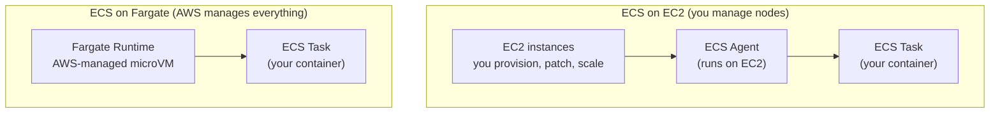
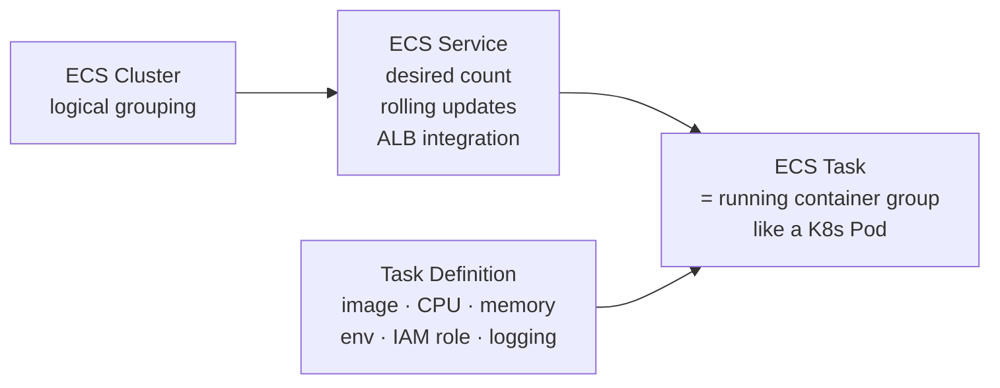
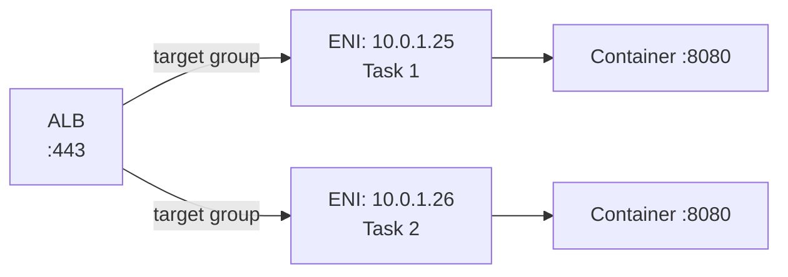
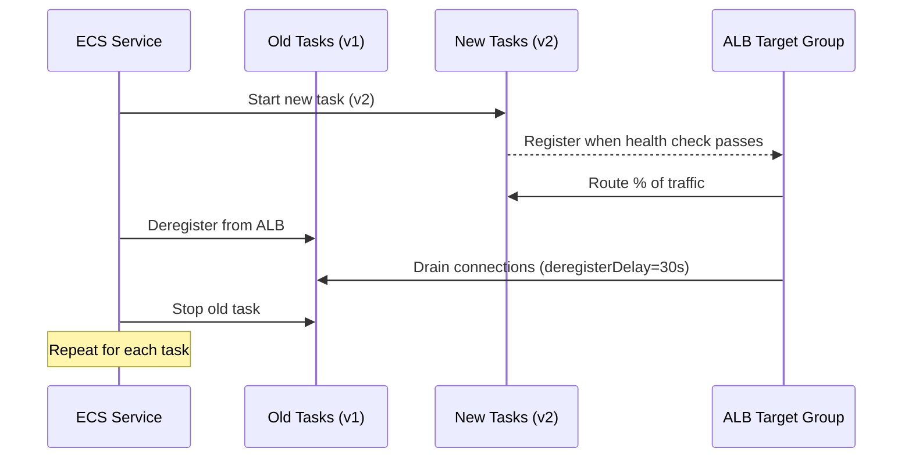
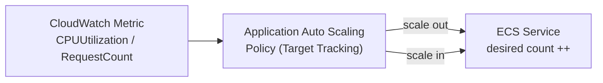

# ECS Fargate — Where, How, and Internals

Track how many of the knowledge checks below you clear as you go:

<div class="quiz-progress" data-quiz-progress>
  <span class="quiz-progress-label">0/0 checks</span>
  <span class="quiz-progress-bar"><span class="quiz-progress-fill"></span></span>
</div>

---

## What is ECS Fargate?

ECS (Elastic Container Service) is AWS's container orchestrator. Fargate is its **serverless compute engine** — you define the container, AWS manages the underlying EC2 instance. You never SSH into a node.



**Fargate isolation:** each Fargate task runs in its own **Firecracker microVM** — a lightweight KVM-based VM (~125ms boot). This gives hardware-level isolation (unlike shared-kernel containers on EC2).

<div class="quiz-card">
  <p class="quiz-q">Why does Fargate give hardware-level isolation between tasks, when a container is normally just a process sharing a host kernel?</p>
  <button class="quiz-reveal">Reveal answer</button>
  <div class="quiz-a" hidden>Each Fargate task runs inside its own Firecracker microVM (a lightweight KVM-based VM, ~125ms boot) instead of sharing a kernel with other tasks on the same node. Isolation is enforced by the hypervisor, not just by container namespaces/cgroups — which is what ECS on EC2 relies on since tasks there do share the host kernel.</div>
</div>

---

## Core Concepts



| Concept | K8s equivalent | Description |
|---------|---------------|-------------|
| Task Definition | Pod spec | Blueprint: image, CPU, memory, env, ports, IAM role |
| Task | Pod | Running instance of a Task Definition |
| Service | Deployment | Maintains desired task count, handles rolling updates |
| Cluster | Namespace/cluster | Logical grouping of services |

<div class="quiz-card">
  <p class="quiz-q">Is an ECS Task the same thing as a Task Definition?</p>
  <button class="quiz-reveal">Reveal answer</button>
  <div class="quiz-a" hidden>No. A Task Definition is the blueprint — image, CPU, memory, env, IAM role, logging. A Task is a running instance of that blueprint, the same relationship as a Pod spec vs a Pod in Kubernetes.</div>
</div>

---

## Task Definition

```json
{
  "family": "api-service",
  "networkMode": "awsvpc",
  "requiresCompatibilities": ["FARGATE"],
  "cpu": "512",
  "memory": "1024",
  "executionRoleArn": "arn:aws:iam::123:role/ecsTaskExecutionRole",
  "taskRoleArn": "arn:aws:iam::123:role/ecsTaskRole",
  "containerDefinitions": [{
    "name": "api",
    "image": "123456.dkr.ecr.us-east-1.amazonaws.com/api:v1.2",
    "portMappings": [{"containerPort": 8080, "protocol": "tcp"}],
    "environment": [
      {"name": "ENV", "value": "production"}
    ],
    "secrets": [
      {"name": "DB_PASSWORD", "valueFrom": "arn:aws:secretsmanager:us-east-1:123:secret:db-pass"}
    ],
    "logConfiguration": {
      "logDriver": "awslogs",
      "options": {
        "awslogs-group": "/ecs/api-service",
        "awslogs-region": "us-east-1",
        "awslogs-stream-prefix": "ecs"
      }
    },
    "healthCheck": {
      "command": ["CMD-SHELL", "curl -f http://localhost:8080/health || exit 1"],
      "interval": 30,
      "timeout": 5,
      "retries": 3
    }
  }]
}
```

**Two IAM roles:**

<div class="tab-group">
  <div class="tab-buttons">
    <button data-tab="exec" class="active">executionRole</button>
    <button data-tab="task">taskRole</button>
  </div>
  <div class="tab-panels">
    <div class="tab-panel active" data-tab-panel="exec">
      The <strong>ECS agent</strong> needs this — not your application code. It's what lets the agent pull the container image from ECR and push logs to CloudWatch on your behalf, before your app has even started.
    </div>
    <div class="tab-panel" data-tab-panel="task">
      Your <strong>application code</strong> uses this at runtime to call AWS APIs — S3, DynamoDB, etc. This is the role your container's own SDK calls assume, separate from anything the ECS agent does.
    </div>
  </div>
</div>

<div class="quiz-card">
  <p class="quiz-q">A container fails with <code>CannotPullContainerError</code>. Is that a problem with the executionRole or the taskRole?</p>
  <button class="quiz-reveal">Reveal answer</button>
  <div class="quiz-a" hidden>executionRole. Pulling the image from ECR is something the ECS agent does before the container starts — that's exactly what executionRole grants. taskRole only matters once your application code is running and calling AWS APIs itself.</div>
</div>

---

## Networking: awsvpc Mode

Fargate always uses `awsvpc` network mode. Each task gets its **own ENI and private IP** — identical to an EC2 instance from the VPC's perspective.



Security groups attach directly to the task ENI — not to a node. This means per-task security group rules, same as EC2.

<div class="quiz-card">
  <p class="quiz-q">Do all Fargate tasks in a service share one security group at the node level, the way EC2 instances behind an ASG might?</p>
  <button class="quiz-reveal">Reveal answer</button>
  <div class="quiz-a" hidden>No. Because Fargate always uses awsvpc mode, each task gets its own ENI and private IP, and security groups attach directly to that task's ENI — not to any underlying node (there isn't one you manage). Per-task security group rules are possible, same as with a standalone EC2 instance.</div>
</div>

---

## ECS Service with ALB

```yaml
# Terraform: ECS Service with ALB
resource "aws_ecs_service" "api" {
  name            = "api"
  cluster         = aws_ecs_cluster.main.id
  task_definition = aws_ecs_task_definition.api.arn
  desired_count   = 3
  launch_type     = "FARGATE"

  network_configuration {
    subnets          = var.private_subnet_ids
    security_groups  = [aws_security_group.task.id]
    assign_public_ip = false   # private subnets, reach internet via NAT GW
  }

  load_balancer {
    target_group_arn = aws_lb_target_group.api.arn
    container_name   = "api"
    container_port   = 8080
  }

  deployment_controller {
    type = "ECS"   # rolling update. Use CODE_DEPLOY for blue/green
  }
}
```

<div class="quiz-card">
  <p class="quiz-q"><code>assign_public_ip = false</code> with tasks in private subnets — how do those tasks reach the internet at all (e.g. to pull an image or call an external API)?</p>
  <button class="quiz-reveal">Reveal answer</button>
  <div class="quiz-a" hidden>Through a NAT Gateway. Tasks in private subnets have no public IP of their own, so outbound internet access is routed via a NAT GW in a public subnet — inbound traffic still only arrives through the ALB.</div>
</div>

---

## Rolling Update / Deployment



Key config:
- `minimumHealthyPercent: 100` — never go below desired count during deploy (needs extra capacity)
- `maximumPercent: 200` — can run up to 2× desired count during deploy
- `deregistrationDelay` on target group — ALB waits N seconds to drain in-flight requests

Same sequence, one action at a time:

<div class="stepper">
  <div class="stepper-panels">
    <div class="stepper-panel active">
      <strong>1. Start new task (v2).</strong> The service launches a new task running the new task definition revision, alongside the existing v1 tasks.
    </div>
    <div class="stepper-panel">
      <strong>2. Health check passes → register.</strong> Once the new task's health check succeeds, it registers with the ALB target group and starts receiving a share of traffic.
    </div>
    <div class="stepper-panel">
      <strong>3. Deregister an old task.</strong> The service deregisters one old (v1) task from the ALB target group.
    </div>
    <div class="stepper-panel">
      <strong>4. Drain connections.</strong> The ALB waits <code>deregistrationDelay</code> seconds (e.g. 30s) for in-flight requests to that old task to finish before treating it as fully removed.
    </div>
    <div class="stepper-panel">
      <strong>5. Stop the old task.</strong> The old task is stopped. This start → register → deregister → drain → stop cycle repeats, one task at a time, until every task is on v2.
    </div>
  </div>
  <div class="stepper-controls">
    <button class="stepper-prev">← Prev</button>
    <span class="stepper-dots"></span>
    <span class="stepper-label"></span>
    <button class="stepper-next">Next →</button>
  </div>
</div>

<div class="quiz-card">
  <p class="quiz-q">A service has <code>desired_count = 3</code>, <code>minimumHealthyPercent: 100</code>, and <code>maximumPercent: 200</code>. During a rolling deploy, what's the minimum and maximum number of tasks running at once?</p>
  <button class="quiz-reveal">Reveal answer</button>
  <div class="quiz-a" hidden>Minimum 3 (100% of desired count — the deploy never drops below full desired capacity) and maximum 6 (200% of desired count — old and new tasks can briefly coexist up to double capacity). This is why a rolling deploy needs headroom to run extra tasks, rather than just swapping tasks in place.</div>
</div>

---

## ECS Service Auto Scaling



```bash
# Target tracking: keep average CPU at 70%
aws application-autoscaling put-scaling-policy \
  --service-namespace ecs \
  --resource-id service/my-cluster/api \
  --scalable-dimension ecs:service:DesiredCount \
  --policy-type TargetTrackingScaling \
  --target-tracking-scaling-policy-configuration '{
    "TargetValue": 70.0,
    "PredefinedMetricSpecification": {
      "PredefinedMetricType": "ECSServiceAverageCPUUtilization"
    },
    "ScaleInCooldown": 300,
    "ScaleOutCooldown": 60
  }'
```

How that policy actually reacts over time:

<div class="stepper">
  <div class="stepper-panels">
    <div class="stepper-panel active">
      <strong>1. Metric crosses target.</strong> Average <code>CPUUtilization</code> across the service climbs above the 70% target set in the policy.
    </div>
    <div class="stepper-panel">
      <strong>2. Application Auto Scaling evaluates.</strong> The TargetTrackingScaling policy computes how much to change desired count by to bring the metric back toward target.
    </div>
    <div class="stepper-panel">
      <strong>3. Scale out — desired count ++.</strong> The ECS Service's desired count is raised; new Fargate tasks are scheduled to bring average CPU back down toward 70%.
    </div>
    <div class="stepper-panel">
      <strong>4. ScaleOutCooldown (60s).</strong> No further scale-out action fires until this cooldown passes, so the policy doesn't keep piling on tasks faster than the last batch can take effect.
    </div>
    <div class="stepper-panel">
      <strong>5. Metric drops back — scale in.</strong> Once the new tasks absorb the load and CPU falls back down, the same policy can trigger a scale-in — desired count decreases, gated by the longer <code>ScaleInCooldown</code> (300s) before it's allowed to scale in again.
    </div>
  </div>
  <div class="stepper-controls">
    <button class="stepper-prev">← Prev</button>
    <span class="stepper-dots"></span>
    <span class="stepper-label"></span>
    <button class="stepper-next">Next →</button>
  </div>
</div>

<div class="quiz-card">
  <p class="quiz-q">This policy sets <code>ScaleOutCooldown</code> to 60s and <code>ScaleInCooldown</code> to 300s. Which action can happen again sooner after the last one — adding capacity or removing it?</p>
  <button class="quiz-reveal">Reveal answer</button>
  <div class="quiz-a" hidden>Adding capacity. ScaleOutCooldown=60s means the policy can scale out again just 60 seconds after its last scale-out action, while ScaleInCooldown=300s makes it wait a full 5 minutes before it's allowed to scale in again.</div>
</div>

---

## Debugging Fargate Tasks

```bash
# List running tasks
aws ecs list-tasks --cluster my-cluster --service-name api

# Describe a task (get IP, status, stopped reason)
aws ecs describe-tasks --cluster my-cluster --tasks <task-arn>
# Look for: lastStatus, stoppedReason, containers[].exitCode

# Logs (CloudWatch)
aws logs tail /ecs/api-service --follow

# ECS Exec (SSM-based shell into running task — no SSH needed)
aws ecs execute-command \
  --cluster my-cluster \
  --task <task-arn> \
  --container api \
  --interactive \
  --command "/bin/sh"
# Requires: SSM agent in image + executionRole has ssmmessages permissions

# Common stopped reasons
# "Essential container exited"  → check container exit code
# "CannotPullContainerError"    → ECR permissions or network issue
# "OutOfMemoryError"            → increase memory in task definition
```

Same three, click through:

<div class="toggle-switch">
  <div class="toggle-buttons">
    <button data-toggle-opt="exited" class="active state-bad">Essential container exited</button>
    <button data-toggle-opt="pull" class="state-bad">CannotPullContainerError</button>
    <button data-toggle-opt="oom" class="state-bad">OutOfMemoryError</button>
  </div>
  <div class="toggle-panel active" data-toggle-panel="exited">
    Check the container's exit code. The essential container in the task definition stopped running — since it's marked essential, that takes the whole task down with it.
  </div>
  <div class="toggle-panel" data-toggle-panel="pull">
    ECR permissions or a network issue. The image pull — done by the ECS agent using the <code>executionRole</code> — failed before the container ever started.
  </div>
  <div class="toggle-panel" data-toggle-panel="oom">
    Increase memory in the task definition. The container exceeded the memory limit it was given and got killed.
  </div>
</div>

---

## ECS vs EKS — When to Use

| Factor | ECS Fargate | EKS |
|--------|------------|-----|
| Team K8s expertise | Not needed | Required |
| Operational overhead | Minimal (no nodes) | Higher (node groups, upgrades) |
| Ecosystem | AWS-native | Full K8s ecosystem |
| Custom scheduling | No | Yes |
| DaemonSets | No (Fargate) | Yes (EC2 nodes) |
| Cost at small scale | Lower (no control plane fee) | +$73/month control plane |
| Cost at large scale | Higher per vCPU than EC2 | EC2 Spot can be 90% cheaper |
| Best for | Small-medium teams, AWS-only, quick start | Platform teams, complex microservices |

<div class="quiz-card">
  <p class="quiz-q">You need to run DaemonSets and want custom pod scheduling control. Does ECS Fargate or EKS fit?</p>
  <button class="quiz-reveal">Reveal answer</button>
  <div class="quiz-a" hidden>EKS. Both Custom scheduling and DaemonSets are "No" for ECS Fargate and "Yes" for EKS — Fargate's serverless model has no persistent node for a DaemonSet to run one copy per, and no control over the underlying scheduler.</div>
</div>
