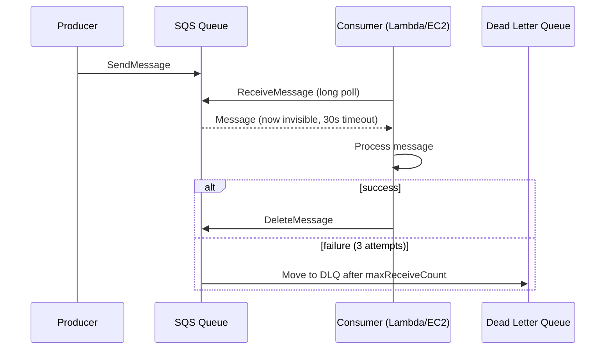
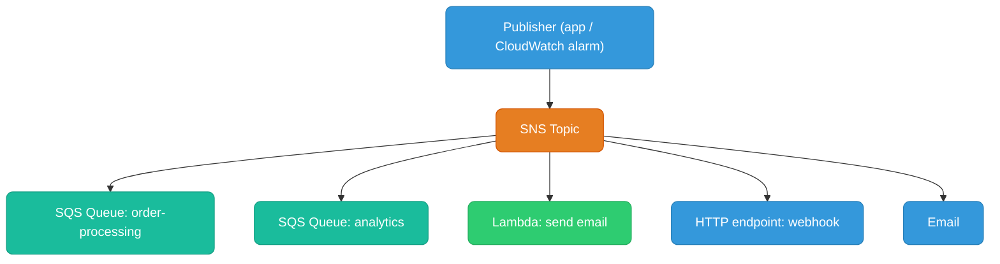
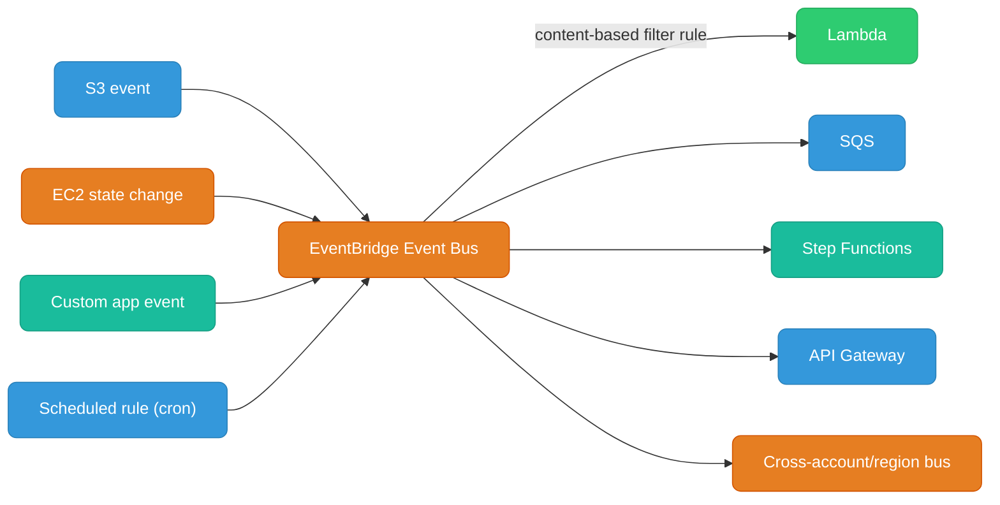
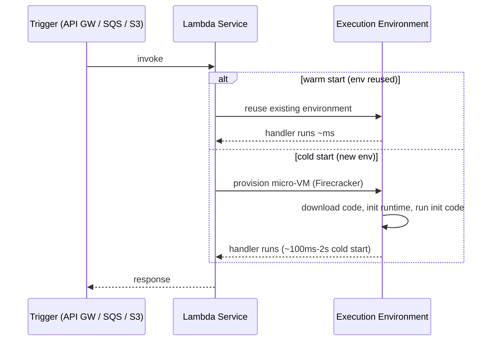
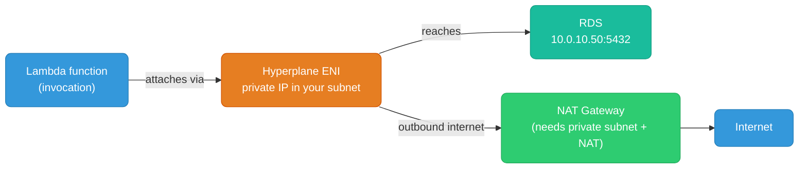
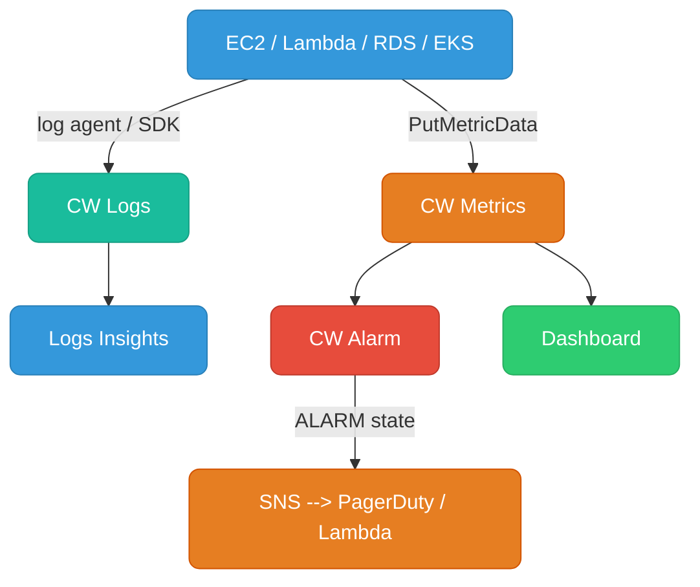
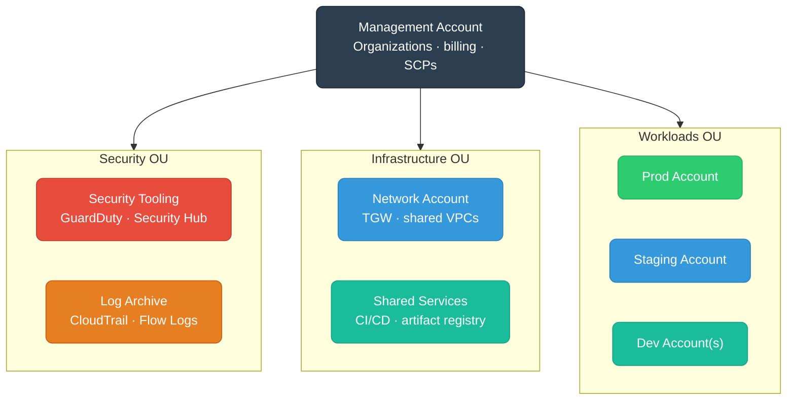
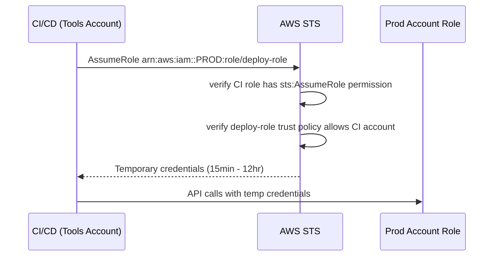

# AWS Messaging, Serverless & Observability

SQS, SNS, EventBridge, Lambda, CloudWatch, and multi-account patterns.

<div class="quiz-progress" data-quiz-progress>
  <span class="quiz-progress-label">0/0 checks</span>
  <span class="quiz-progress-bar"><span class="quiz-progress-fill"></span></span>
</div>

---

## SQS (Simple Queue Service)

Managed message queue — decouples producers from consumers. Messages are pulled by consumers.

### Standard vs FIFO

| | Standard Queue | FIFO Queue |
|--|---------------|-----------|
| **Ordering** | Best-effort (not guaranteed) | Strict FIFO per message group |
| **Delivery** | At-least-once (duplicates possible) | Exactly-once processing |
| **Throughput** | Unlimited | 300 msg/s (3000 with batching) |
| **Use case** | High-throughput, order doesn't matter | Financial transactions, order processing |
| **Deduplication** | No (handle in consumer) | Content-based or deduplication ID |

<div class="toggle-switch">
  <div class="toggle-buttons">
    <button data-toggle-opt="standard" class="active">Standard</button>
    <button data-toggle-opt="fifo">FIFO</button>
  </div>
  <div class="toggle-panel active" data-toggle-panel="standard">
    <strong>Reach for this by default.</strong> Best-effort ordering, at-least-once delivery (duplicates are possible, so consumers must be idempotent), and effectively unlimited throughput. Right for high-volume work where order across messages doesn't matter &mdash; logs, metrics, generic job queues.
  </div>
  <div class="toggle-panel" data-toggle-panel="fifo">
    <strong>Reach for this when order or exactly-once matters.</strong> Strict FIFO ordering per message group, exactly-once processing, but capped at 300 msg/s (3000 with batching). Right for financial transactions and order processing &mdash; anywhere a duplicate or out-of-order delivery would be a real bug, not just a nuisance.
  </div>
</div>

### Key Properties

**Visibility timeout:** When a consumer receives a message, it becomes invisible to other consumers for the timeout duration (default 30s). If not deleted before timeout expires, message re-appears. Set timeout > max processing time.

**Dead Letter Queue (DLQ):** After `maxReceiveCount` failed deliveries, move to DLQ for inspection. Essential for debugging poison-pill messages.



Same lifecycle, one step at a time:

<div class="stepper">
  <div class="stepper-panels">
    <div class="stepper-panel active">
      <strong>1. SendMessage.</strong> Producer puts a message on the queue. It sits there until a consumer polls for it.
    </div>
    <div class="stepper-panel">
      <strong>2. ReceiveMessage.</strong> A consumer long-polls and gets the message. It's now invisible to every other consumer for the visibility timeout (default 30s) &mdash; not deleted, just hidden.
    </div>
    <div class="stepper-panel">
      <strong>3. Processing.</strong> The consumer works the message. If it takes longer than the visibility timeout, the message becomes visible again and another consumer can pick it up too &mdash; this is why timeout should exceed max processing time.
    </div>
    <div class="stepper-panel">
      <strong>4a. Success.</strong> Consumer calls DeleteMessage before the timeout expires. Gone for good.
    </div>
    <div class="stepper-panel">
      <strong>4b. Failure.</strong> Consumer doesn't delete it (crash, exception, timeout). The message reappears and gets redelivered &mdash; after <code>maxReceiveCount</code> failed attempts, it's routed to the DLQ instead of retried forever.
    </div>
  </div>
  <div class="stepper-controls">
    <button class="stepper-prev">← Prev</button>
    <span class="stepper-dots"></span>
    <span class="stepper-label"></span>
    <button class="stepper-next">Next →</button>
  </div>
</div>

**Long polling:** `WaitTimeSeconds=20` — consumer waits up to 20s for a message instead of returning empty immediately. Reduces API calls and cost by ~95%.

### Lambda + SQS (Event Source Mapping)

Lambda polls SQS automatically (you don't write polling code). Lambda scales based on queue depth — up to 1000 concurrent Lambda invocations per queue.

```
Queue depth: 1000 msgs → Lambda scales to process in parallel batches
Batch size: 1-10000 messages per invocation
```

If Lambda throws, batch goes back to queue → retried → eventually hits DLQ.

<div class="quiz-card">
  <p class="quiz-q">A consumer receives a message but crashes before calling DeleteMessage, and the visibility timeout hasn't expired yet. Is the message gone?</p>
  <button class="quiz-reveal">Reveal answer</button>
  <div class="quiz-a" hidden>No. ReceiveMessage only makes a message invisible to other consumers for the visibility timeout &mdash; it isn't deleted until DeleteMessage is called. Once the timeout expires with no delete, the message reappears on the queue and gets redelivered.</div>
</div>

---

## SNS (Simple Notification Service)

Managed pub/sub — one message fans out to many subscribers. Push model (vs SQS pull).



**SNS + SQS fan-out pattern:** SNS topic → multiple SQS queues. Each queue has its own consumer processing the same event independently. This is the standard pattern for event-driven architectures.

**Message filtering:** Subscribers can filter messages by attributes, so each subscriber only receives relevant events:

```json
// SQS subscription filter: only receive order events for region "us-east"
{
  "region": ["us-east"],
  "eventType": ["order.placed", "order.cancelled"]
}
```

What happens from publish to delivery:

<div class="stepper">
  <div class="stepper-panels">
    <div class="stepper-panel active">
      <strong>1. Publish.</strong> The publisher sends one message to the SNS topic.
    </div>
    <div class="stepper-panel">
      <strong>2. Filter evaluation.</strong> SNS checks each subscription's filter policy (if it has one) against the message's attributes.
    </div>
    <div class="stepper-panel">
      <strong>3. Fan-out.</strong> Every matching subscriber gets its own independent copy, pushed in parallel &mdash; SQS queues, Lambda, HTTP endpoints, email.
    </div>
    <div class="stepper-panel">
      <strong>4. Independent processing.</strong> Each subscriber (and its consumer, if it's a queue) processes on its own schedule. One subscriber being slow or down doesn't block or delay delivery to any other.
    </div>
  </div>
  <div class="stepper-controls">
    <button class="stepper-prev">← Prev</button>
    <span class="stepper-dots"></span>
    <span class="stepper-label"></span>
    <button class="stepper-next">Next →</button>
  </div>
</div>

<div class="quiz-card">
  <p class="quiz-q">In the SNS→SQS fan-out pattern, the consumer reading the "analytics" queue goes down for an hour. What happens to the "order-processing" queue's consumers?</p>
  <button class="quiz-reveal">Reveal answer</button>
  <div class="quiz-a" hidden>Nothing &mdash; they're unaffected. Each queue has its own consumer processing the same event independently, so a backlog building up on one queue has no effect on delivery or processing for the others.</div>
</div>

---

## EventBridge

Serverless event bus — more powerful than SNS for routing. Native integration with 200+ AWS services as sources.



### SNS vs SQS vs EventBridge

| | SQS | SNS | EventBridge |
|--|-----|-----|------------|
| **Model** | Queue (pull) | Pub/Sub (push) | Event bus (push) |
| **Ordering** | FIFO option | No | No |
| **Persistence** | Yes (up to 14 days) | No (fire and forget) | No |
| **Filtering** | No | Attribute filter | Rich content-based filter |
| **Sources** | Application | Application | 200+ AWS services + custom |
| **Replay** | No (archive manually) | No | Yes (archive + replay) |
| **Cross-account** | With resource policy | Yes | Yes (event bus) |
| **Use case** | Work queues, job buffering | Fan-out notifications | Event-driven automation, service integration |

**Rule of thumb:**
- Need to buffer / retry / process asynchronously → **SQS**
- Need fan-out to multiple consumers → **SNS** (or SNS→SQS)
- Reacting to AWS service events or complex routing → **EventBridge**

<div class="quiz-card">
  <p class="quiz-q">You need to replay a burst of events from three days ago through your pipeline again. Which of SQS, SNS, or EventBridge actually supports this?</p>
  <button class="quiz-reveal">Reveal answer</button>
  <div class="quiz-a" hidden>EventBridge &mdash; via its archive + replay feature. SQS has no persistence past normal retention with no built-in replay, and SNS is fire-and-forget with no persistence at all. This is one of the concrete reasons to reach for EventBridge over SNS even when you don't need its richer content-based filtering.</div>
</div>

---

## Lambda

Serverless compute — run code in response to events, pay per 100ms of execution.

### Execution Model



Step through a single invocation:

<div class="stepper">
  <div class="stepper-panels">
    <div class="stepper-panel active">
      <strong>1. Trigger fires.</strong> API Gateway, SQS, S3, or another event source invokes the function.
    </div>
    <div class="stepper-panel">
      <strong>2. Lambda looks for a warm environment.</strong> If one exists and is idle, it's reused as-is &mdash; skip straight to step 4.
    </div>
    <div class="stepper-panel">
      <strong>3. Cold start (no warm environment available).</strong> Lambda provisions a new micro-VM (Firecracker), downloads the code, initializes the runtime, and runs any initialization code outside the handler. This is the ~100ms-2s tax.
    </div>
    <div class="stepper-panel">
      <strong>4. Handler runs.</strong> ~ms if warm, tacked onto the cold-start cost above if not.
    </div>
    <div class="stepper-panel">
      <strong>5. Response returns.</strong> The environment stays around afterward, warm and ready to skip straight to step 4 on the next invocation &mdash; until Lambda decides to recycle it.
    </div>
  </div>
  <div class="stepper-controls">
    <button class="stepper-prev">← Prev</button>
    <span class="stepper-dots"></span>
    <span class="stepper-label"></span>
    <button class="stepper-next">Next →</button>
  </div>
</div>

**Cold start optimization:**
- Use Provisioned Concurrency (keeps N envs warm) for latency-sensitive paths
- Minimize package size (smaller = faster cold start)
- Avoid VPC attachment unless necessary (VPC adds ~1-2s historically, now much faster with hyperplane)
- Move initialization outside the handler function (DB connections, SDK clients)

```go
// WRONG: new DB connection every invocation
func Handler(ctx context.Context, event events.APIGatewayProxyRequest) {
    db := sql.Open("postgres", os.Getenv("DB_URL"))  // cold start every time
    defer db.Close()
    ...
}

// RIGHT: initialize once, reuse across warm invocations
var db *sql.DB
func init() {
    db, _ = sql.Open("postgres", os.Getenv("DB_URL"))
}
func Handler(ctx context.Context, event events.APIGatewayProxyRequest) {
    // db is reused across warm invocations
}
```

<div class="quiz-card">
  <p class="quiz-q">Moving DB connection setup from inside the handler into an <code>init()</code>/module-level block only helps on some invocations. Which ones?</p>
  <button class="quiz-reveal">Reveal answer</button>
  <div class="quiz-a" hidden>Warm invocations. Code outside the handler runs once when the execution environment is created, then that same environment (and its already-open connection) is reused across every subsequent warm invocation. A cold start still pays for that setup once &mdash; the win is not paying for it again on every single request.</div>
</div>

### Lambda Concurrency

```
Account limit: 1000 concurrent (soft, can raise)
Reserved concurrency: guarantee N for a function, cap its max
Provisioned concurrency: pre-warmed environments (avoids cold start)

Burst limit: 3000 initial burst, then +500/minute
```

**Throttling:** When concurrency limit hit, Lambda returns 429. SQS event source mapping retries; API Gateway returns 429 to caller.

### Lambda Destinations

On async invocations, route successes/failures to SQS, SNS, EventBridge, or another Lambda:

<div class="toggle-switch">
  <div class="toggle-buttons">
    <button data-toggle-opt="success" class="active state-ok">Success</button>
    <button data-toggle-opt="failure" class="state-bad">Failure</button>
  </div>
  <div class="toggle-panel active" data-toggle-panel="success">
    Async invoke completes normally → routed to an <strong>SNS topic</strong> (e.g. <code>order-success</code>). Any subscriber of that topic finds out the invocation succeeded, no polling required.
  </div>
  <div class="toggle-panel" data-toggle-panel="failure">
    Async invoke throws or exhausts its retries → routed to an <strong>SQS DLQ</strong> (e.g. <code>order-failures</code>) for inspection and reprocessing.
  </div>
</div>

Cleaner than wrapping everything in try/catch for async flows.

### Lambda in VPC

Lambda can access private resources (RDS, ElastiCache) inside a VPC via ENI injection:



**Gotcha:** Lambda in VPC with no VPC endpoint for S3/DynamoDB will route through NAT GW — add VPC endpoints to avoid NAT costs.

<div class="quiz-card">
  <p class="quiz-q">A Lambda function in a VPC calls S3 with no VPC endpoint configured for it. Does the call fail?</p>
  <button class="quiz-reveal">Reveal answer</button>
  <div class="quiz-a" hidden>No, it still works &mdash; but it routes through the NAT Gateway instead of going directly, which means paying NAT data processing charges for traffic that could've been free. Adding an S3 VPC endpoint doesn't fix a failure, it avoids an unnecessary cost.</div>
</div>

---

## CloudWatch

### Metrics, Logs, Alarms



**Log groups and retention:** By default, logs never expire (expensive). Always set retention:
```bash
aws logs put-retention-policy \
  --log-group-name /aws/lambda/my-function \
  --retention-in-days 30
```

<div class="quiz-card">
  <p class="quiz-q">You create a new CloudWatch Logs log group and never touch its retention setting. When do the logs expire?</p>
  <button class="quiz-reveal">Reveal answer</button>
  <div class="quiz-a" hidden>Never &mdash; the default is to keep logs forever, which quietly gets expensive. Retention has to be set explicitly per log group (e.g. via <code>put-retention-policy</code>); it isn't time-limited out of the box.</div>
</div>

### CloudWatch Logs Insights Query

```
# Error rate in last 1 hour
fields @timestamp, @message
| filter @message like /ERROR/
| stats count(*) as errors by bin(5m)
| sort @timestamp asc
```

### Custom Metrics

```go
// Emit custom metric from application
svc := cloudwatch.NewFromConfig(cfg)
svc.PutMetricData(ctx, &cloudwatch.PutMetricDataInput{
    Namespace: aws.String("MyApp/Orders"),
    MetricData: []types.MetricDatum{{
        MetricName: aws.String("OrderProcessingTime"),
        Value:      aws.Float64(float64(duration.Milliseconds())),
        Unit:       types.StandardUnitMilliseconds,
        Dimensions: []types.Dimension{{
            Name: aws.String("Environment"), Value: aws.String("prod"),
        }},
    }},
})
```

### Container Insights (EKS)

Deploys a CloudWatch agent DaemonSet to EKS — ships pod/node CPU, memory, network, disk metrics and container logs automatically.

```bash
aws eks create-addon \
  --cluster-name my-cluster \
  --addon-name amazon-cloudwatch-observability
```

---

## Secrets Manager vs Parameter Store

| | Secrets Manager | SSM Parameter Store |
|--|----------------|-------------------|
| **Purpose** | Secrets with rotation | Config + secrets (tiered) |
| **Automatic rotation** | Yes (Lambda-based, built-in for RDS, Redshift) | No |
| **Versioning** | Yes | Yes |
| **Cost** | $0.40/secret/month + $0.05/10k API calls | Free (Standard tier), $0.05/advanced param/month |
| **Max size** | 64 KB | 4 KB (standard), 8 KB (advanced) |
| **KMS encryption** | Always encrypted | Optional (SecureString type) |
| **Cross-account** | Yes (resource policy) | No |
| **Use case** | DB passwords, API keys needing rotation | App config, feature flags, non-rotating secrets |

**In EKS:** Use External Secrets Operator or Secrets Store CSI Driver to mount Secrets Manager / Parameter Store values as Kubernetes secrets or volume files.

<div class="quiz-card">
  <p class="quiz-q">You need a database password that rotates itself automatically on a schedule, with zero extra Lambda code you have to write for RDS. Secrets Manager or Parameter Store?</p>
  <button class="quiz-reveal">Reveal answer</button>
  <div class="quiz-a" hidden>Secrets Manager. It has built-in automatic rotation, including out-of-the-box support for RDS and Redshift. Parameter Store has no automatic rotation at all &mdash; it's better suited to config and non-rotating secrets.</div>
</div>

---

## Multi-Account Strategy

Single AWS account for everything is an anti-pattern at scale. AWS Organizations provides a hierarchy for governance.



### Service Control Policies (SCPs)

SCPs are IAM policies attached to OUs/accounts in Organizations. They **restrict the maximum permissions** any IAM entity in that account can have — even the root user.

```json
// SCP: prevent anyone from disabling GuardDuty
{
  "Statement": [{
    "Effect": "Deny",
    "Action": [
      "guardduty:DeleteDetector",
      "guardduty:DisassociateFromMasterAccount"
    ],
    "Resource": "*"
  }]
}
```

SCPs do NOT grant permissions — they only set the ceiling. An IAM policy must still exist to actually allow access.

<div class="quiz-card">
  <p class="quiz-q">You attach an SCP to an OU that allows <code>s3:*</code>. Does every account in that OU now have S3 access, even if their IAM policies don't mention S3?</p>
  <button class="quiz-reveal">Reveal answer</button>
  <div class="quiz-a" hidden>No. An SCP only sets the maximum possible permissions &mdash; it never grants anything by itself. An IAM policy (attached to a user, role, or group in that account) still has to explicitly allow the S3 action for anyone to actually use it.</div>
</div>

### Cross-Account Role Assumption Pattern



The **trust policy** on the target role is the door; the **identity policy** on the caller is the key. Both must match.

---

## Cost Optimization Patterns

### Compute

| Strategy | Savings |
|----------|---------|
| **Savings Plans** (1 or 3 yr, flexible) | Up to 66% vs On-Demand |
| **Reserved Instances** (1 or 3 yr, specific type) | Up to 72% |
| **Spot Instances** (interruptible, 2-min notice) | Up to 90% |
| **Graviton (ARM)** instances | 20% better price/perf than x86 |
| **Right-sizing** (use Compute Optimizer) | 20-30% typical savings |

**EKS + Spot:** Run stateless workloads on Spot node groups with Karpenter. Karpenter selects cheapest available instance type/AZ dynamically.

### Data Transfer (biggest surprise bill)

```
Intra-AZ:       Free
Inter-AZ:       $0.01/GB each direction  ← biggest hidden cost
Internet out:   $0.09/GB (first 10 TB)
S3/DynamoDB via VPC endpoint: Free (saves NAT GW charges)
CloudFront → origin: cheaper than direct internet
```

**Minimize inter-AZ traffic:** Keep pod-to-pod communication within the same AZ using topology-aware routing in K8s (`topologySpreadConstraints`, `trafficPolicy: Local`).

<div class="quiz-card">
  <p class="quiz-q">Two pods in the same VPC, different Availability Zones, talk to each other constantly. Two pods in the same AZ do the same. Which pair racks up a bigger, easy-to-miss data transfer bill?</p>
  <button class="quiz-reveal">Reveal answer</button>
  <div class="quiz-a" hidden>The cross-AZ pair. Intra-AZ traffic is free; inter-AZ traffic costs $0.01/GB in each direction &mdash; the biggest hidden cost in the whole data transfer picture, precisely because it's easy to not notice pods landing in different AZs in the first place.</div>
</div>

### Tagging strategy for cost allocation

```
aws:createdBy: terraform
team: payments
env: prod
service: order-api
cost-center: engineering-platform
```

Use AWS Cost Explorer + tag-based cost allocation reports. Enforce tags with SCPs or AWS Config rules.
