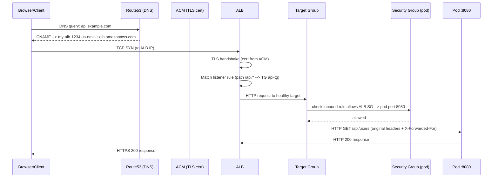
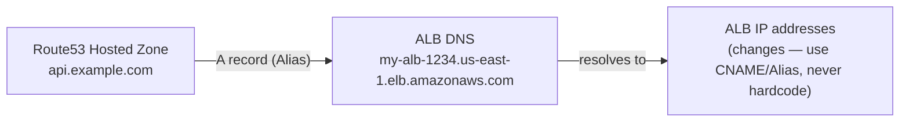
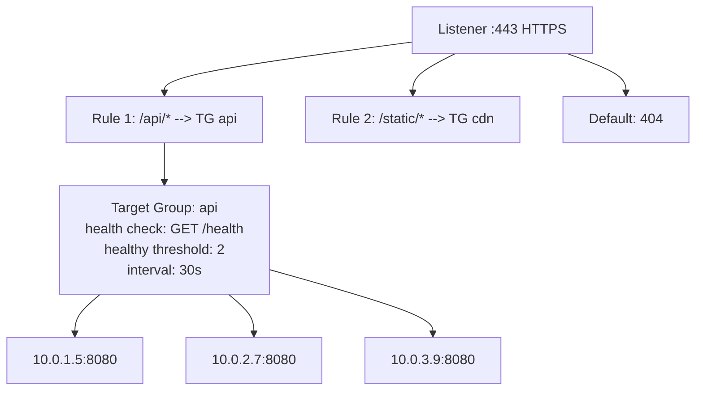
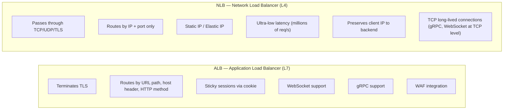
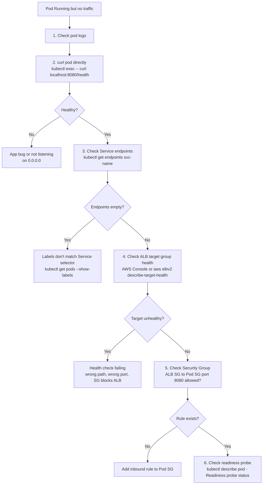

# Request Flow: Route53 → ALB → Pod

A request to a service behind an ALB touches DNS, TLS, path-based routing, health-checked target selection, and a security-group gate before it ever reaches application code — in that order. This doc walks the full hop-by-hop path once as a sequence diagram, then breaks each hop down on its own.

<div class="quiz-progress" data-quiz-progress>
  <span class="quiz-progress-label">0/0 checks</span>
  <span class="quiz-progress-bar"><span class="quiz-progress-fill"></span></span>
</div>

## Full Request Path



<div class="quiz-card">
  <p class="quiz-q">The pod never sees the browser's real source IP on its TCP connection — it sees the ALB's. How does it still find out the original client IP?</p>
  <button class="quiz-reveal">Reveal answer</button>
  <div class="quiz-a" hidden>ALB terminates the client's connection and opens its own connection to the pod, so at the TCP level the pod only sees the ALB as the source. ALB compensates by forwarding the original client IP in the <code>X-Forwarded-For</code> header alongside the original request headers.</div>
</div>

---

## Layer by Layer

Same path, broken into the hops a request actually crosses end to end — the four named in the title, plus the security-group gate sitting between the target group and the pod. Step through it once here, then read each hop's detail below.

<div class="stepper">
  <div class="stepper-panels">
    <div class="stepper-panel active">
      <strong>1. Route53 — DNS.</strong> The client resolves <code>api.example.com</code>. Route53 returns an Alias record pointing at the ALB's DNS name, which in turn resolves to one of the ALB's multiple (multi-AZ) IP addresses.
    </div>
    <div class="stepper-panel">
      <strong>2. ALB.</strong> The client opens a TCP connection to that IP. ALB terminates TLS using the certificate from ACM, then matches the request's path against its listener rules to decide which target group should handle it.
    </div>
    <div class="stepper-panel">
      <strong>3. Target Group.</strong> ALB forwards only to targets already marked healthy in that target group &mdash; a pod that hasn't passed its health checks yet, or has started failing them, never receives traffic, healthy or not.
    </div>
    <div class="stepper-panel">
      <strong>4. Security Group.</strong> Before the request reaches the pod's port, the pod's security group has to have an inbound rule allowing traffic from the ALB's security group on port 8080 &mdash; a separate gate from target-group health.
    </div>
    <div class="stepper-panel">
      <strong>5. Pod.</strong> The pod receives the original HTTP request plus ALB-added headers like <code>X-Forwarded-For</code>, and its response flows straight back through ALB to the client.
    </div>
  </div>
  <div class="stepper-controls">
    <button class="stepper-prev">← Prev</button>
    <span class="stepper-dots"></span>
    <span class="stepper-label"></span>
    <button class="stepper-next">Next →</button>
  </div>
</div>

### 1. Route53 — DNS



- Use **Alias record** (not CNAME) for ALB in Route53 — free, faster, works at apex domain
- ALB has multiple IPs (multi-AZ) — Route53 returns all of them, client picks one
- TTL typically 60s

### 2. ALB — Application Load Balancer (L7)



ALB terminates TLS, inspects HTTP headers, routes by path/host, and load-balances across healthy targets using round-robin (default) or least-outstanding-requests.

### 3. Target Group — Health Checks

```
Target Group health check:
  Protocol: HTTP
  Path:     /health
  Port:     traffic-port (8080)
  Healthy threshold:   2 consecutive successes
  Unhealthy threshold: 3 consecutive failures
  Timeout:             5s
  Interval:            30s

A pod is only added to the target group AFTER passing 2 health checks.
A pod is removed after failing 3 consecutive checks.
```

### 4. Security Groups

```
ALB Security Group:
  Inbound:  0.0.0.0/0 :443 (public)
  Outbound: [Pod SG] :8080

Pod Security Group (EKS VPC CNI / ECS task SG):
  Inbound:  [ALB SG] :8080   ← MUST reference ALB SG, not CIDR
  Outbound: 0.0.0.0/0
```

Referencing the ALB security group (not a CIDR) means the rule automatically follows ALB IP changes.

<div class="quiz-card">
  <p class="quiz-q">The pod security group's inbound rule references the ALB security group instead of a CIDR block. Why does that matter?</p>
  <button class="quiz-reveal">Reveal answer</button>
  <div class="quiz-a" hidden>Because the ALB's IP addresses can change &mdash; it's multi-AZ and can scale. A CIDR-based rule would need constant upkeep and could silently go stale. Referencing the ALB's security group means the rule automatically follows the ALB no matter what IPs it currently holds.</div>
</div>

---

## ALB vs NLB — L7 vs L4



<div class="toggle-switch">
  <div class="toggle-buttons">
    <button data-toggle-opt="alb" class="active">ALB (L7)</button>
    <button data-toggle-opt="nlb">NLB (L4)</button>
  </div>
  <div class="toggle-panel active" data-toggle-panel="alb">
    Terminates TLS and reads the HTTP request itself &mdash; routes by path, host header, or method, and can pick a different target group per rule. That HTTP-level visibility is also what buys sticky sessions, WebSocket/gRPC awareness, and WAF integration. The tradeoff: the pod sees the ALB's IP on the connection, not the client's &mdash; the real client IP only survives via the <code>X-Forwarded-For</code> header.
  </div>
  <div class="toggle-panel" data-toggle-panel="nlb">
    Never looks past TCP/UDP/TLS &mdash; routes purely on IP and port, at a fraction of ALB's latency and up to millions of requests/sec. Gets a static IP per AZ, and preserves the client's real IP natively since it's just passing the connection through. The tradeoff: no path-based routing at all &mdash; there's no URL or header to route on.
  </div>
</div>

| Feature | ALB | NLB |
|---------|-----|-----|
| Layer | L7 (HTTP/HTTPS) | L4 (TCP/UDP/TLS) |
| Routing | Path, host, headers | IP + port only |
| TLS termination | Yes | Yes (passthrough also possible) |
| Client IP | X-Forwarded-For header | Preserved natively |
| Static IP | No (use Global Accelerator) | Yes (Elastic IP per AZ) |
| Latency | ~1ms | ~100μs |
| Use case | Web APIs, microservices, gRPC (HTTP/2) | Gaming, IoT, TCP-native protocols |

**Rule of thumb:** Use ALB for everything HTTP/HTTPS. Use NLB when you need static IPs, ultra-low latency, or TCP passthrough.

<div class="quiz-card">
  <p class="quiz-q">Can an NLB route two different URL paths on the same hostname to two different target groups?</p>
  <button class="quiz-reveal">Reveal answer</button>
  <div class="quiz-a" hidden>No. NLB operates at L4 &mdash; it only ever sees IP and port, never the HTTP path or headers, so it has nothing to route on beyond that. Path-based routing needs L7 visibility, which means ALB.</div>
</div>

---

## Load Balancing Algorithms

### ALB: Round-Robin (default) vs Least-Outstanding-Requests

<div class="tab-group">
  <div class="tab-buttons">
    <button data-tab="rr" class="active">Round Robin</button>
    <button data-tab="lor">Least Outstanding Requests</button>
  </div>
  <div class="tab-panels">
    <div class="tab-panel active" data-tab-panel="rr">
      <strong>Default.</strong> ALB just cycles through targets in fixed order, one request each, regardless of how busy any of them currently are.
      <pre><code class="language-mermaid">graph LR
    R1["Request 1"] --> P1["Pod 1"]
    R2["Request 2"] --> P2["Pod 2"]
    R3["Request 3"] --> P3["Pod 3"]
    R4["Request 4"] -.->|cycles back| P1
    classDef pod fill:#4f8fcf,stroke:#274b6e,color:#fff;
    class P1,P2,P3 pod;</code></pre>
    </div>
    <div class="tab-panel" data-tab-panel="lor">
      <strong>Better for variable request duration.</strong> ALB tracks how many requests are currently in flight to each target and sends the next request to whichever one has the fewest.
      <pre><code class="language-mermaid">graph LR
    P1["Pod 1: 5 in-flight"]
    P2["Pod 2: 2 in-flight"]
    P3["Pod 3: 8 in-flight"]
    NEXT["Next request"] -->|least loaded| P2
    classDef chosen fill:#27ae60,stroke:#1e8449,color:#fff;
    class P2 chosen;</code></pre>
    </div>
  </div>
</div>

Enable LOR:
```bash
aws elbv2 modify-target-group-attributes \
  --target-group-arn <arn> \
  --attributes Key=load_balancing.algorithm.type,Value=least_outstanding_requests
```

<div class="quiz-card">
  <p class="quiz-q">Your backend pods have wildly different request durations. Why might least-outstanding-requests distribute load more evenly than round-robin here?</p>
  <button class="quiz-reveal">Reveal answer</button>
  <div class="quiz-a" hidden>Round-robin cycles through pods in fixed order no matter how busy each one is &mdash; a pod stuck on a few slow requests still gets the next one in rotation regardless. Least-outstanding-requests instead sends the next request to whichever pod currently has the fewest in-flight requests, so a pod that's fallen behind naturally gets fewer new requests until it catches up.</div>
</div>

---

## If Pod is Not Receiving Traffic — Debug Flow



<div class="quiz-card">
  <p class="quiz-q"><code>kubectl get endpoints &lt;service&gt;</code> comes back empty, but curling the pod directly returns a healthy response. What's the likely cause?</p>
  <button class="quiz-reveal">Reveal answer</button>
  <div class="quiz-a" hidden>The pod's labels don't match the Service's selector. The Service has no way to know the pod exists, so it never lands in the endpoint list &mdash; even though the pod itself is running fine and answering requests directly.</div>
</div>

### Full Debug Command Set

```bash
# 1. Pod logs (current + previous crash)
kubectl logs <pod> -n <namespace>
kubectl logs <pod> -n <namespace> --previous

# 2. Test app directly (bypass all load balancers)
kubectl exec -it <pod> -n <namespace> -- curl -v http://localhost:8080/health

# 3. Service endpoints — is the pod in the endpoint list?
kubectl get endpoints <service> -n <namespace>
# ENDPOINTS should list pod IPs:ports
# If empty: pod labels don't match Service selector

# 4. Service selector vs pod labels
kubectl describe svc <service> -n <namespace> | grep Selector
kubectl get pods -n <namespace> --show-labels

# 5. ALB target group health (EKS/ECS)
aws elbv2 describe-target-health \
  --target-group-arn <arn> \
  --region us-east-1

# 6. Readiness probe status
kubectl describe pod <pod> -n <namespace> | grep -A 10 Readiness

# 7. Events for the pod (scheduling, probe failures, image issues)
kubectl get events -n <namespace> --field-selector involvedObject.name=<pod> \
  --sort-by='.lastTimestamp'

# 8. Port-forward directly to pod to bypass Service/ALB entirely
kubectl port-forward pod/<pod> 8080:8080 -n <namespace>
curl -v http://localhost:8080/health
```
