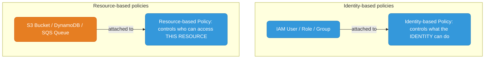
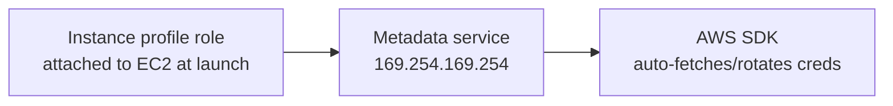
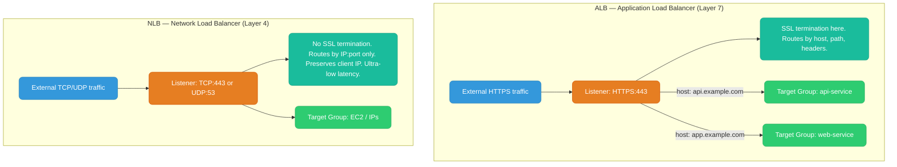
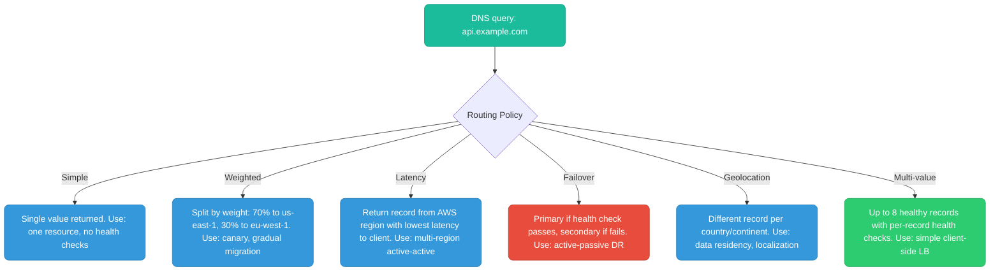

# AWS Services Overview

IAM, load balancers, DNS, and compute orchestration — the AWS building blocks every backend engineer works with.

<div class="quiz-progress" data-quiz-progress>
  <span class="quiz-progress-label">0/0 checks</span>
  <span class="quiz-progress-bar"><span class="quiz-progress-fill"></span></span>
</div>

---

## IAM (Identity and Access Management)

IAM controls **who** (identity) can do **what** (action) on **which** AWS resources. Everything in AWS — humans, EC2 instances, Lambda functions, EKS pods — needs an IAM identity to call AWS APIs.

### Core Concepts

**Users** — Long-lived human identities with access keys. In production, prefer roles over users (roles use temporary credentials).

**Groups** — Collections of users. Attach policies to groups, not individual users.

**Roles** — Assumable identities with temporary STS credentials. No static credentials. Assumed by principals (users, EC2, Lambda, EKS pods) via `sts:AssumeRole`. Credentials expire (15 min to 12 hrs).

**Policies** — JSON documents that define permissions. Attached to users, groups, or roles.

### Policy Types



| | Identity-based | Resource-based |
|--|---|---|
| Attached to | IAM user/role/group | AWS resource (S3 bucket, SQS queue, KMS key) |
| Controls | What the identity can do | Who can access this resource |
| Cross-account | Use with resource-based policy | Can grant access to other accounts directly |
| Examples | Allow EC2:Describe*, S3:GetObject | S3 bucket policy, KMS key policy |

### Policy Evaluation Logic

1. **Explicit Deny** anywhere → **Deny** (overrides everything)
2. **Allow** in identity-based policy AND (resource-based allows OR same account) → **Allow**
3. **No Allow** found → **Deny** (implicit)

### AssumeRole Pattern

```json
{
  "Statement": [{
    "Effect": "Allow",
    "Principal": { "AWS": "arn:aws:iam::CICD-ACCOUNT:role/github-actions-role" },
    "Action": "sts:AssumeRole"
  }]
}
```

```bash
aws sts assume-role \
  --role-arn arn:aws:iam::PROD-ACCOUNT:role/deploy-role \
  --role-session-name github-deploy-$(date +%s)
```

### IRSA (IAM Roles for Service Accounts)

See [eks-architecture.md → IRSA](../kubernetes/eks-architecture.md#irsa--iam-roles-for-service-accounts). EKS pods assume IAM roles via projected K8s service account tokens exchanged with STS via `AssumeRoleWithWebIdentity` — no access keys stored in pods.

**Follow-up: Instance Profile vs `sts:AssumeRole` — what's the difference?**

| | Instance Profile | `sts:AssumeRole` |
|--|-----------------|-----------------|
| Who uses it | EC2 instance, ECS task (at launch) | Any principal — Lambda, GitHub Actions, cross-account |
| How credentials arrive | Metadata service `169.254.169.254/latest/meta-data/iam/` — auto-rotated by EC2 | `aws sts assume-role` → temporary creds (15min–12hr) |
| Configuration | Attach role to EC2 at launch (or via `aws ec2 associate-iam-instance-profile`) | Trust policy on the target role |
| Cross-account | No (role must be in same account as instance) | Yes — principal in account A assumes role in account B |
| Use case | "This EC2 should always be able to do X" | "This pipeline should temporarily be able to deploy to prod" |

**The chain for GitHub Actions → AWS:**

<div class="stepper">
  <div class="stepper-panels">
    <div class="stepper-panel active">
      <strong>1. GitHub issues an OIDC token.</strong> The GitHub Actions workflow requests a short-lived OIDC token from GitHub's own OIDC provider — no secret stored in the repo.
    </div>
    <div class="stepper-panel">
      <strong>2. Workflow calls <code>sts:AssumeRoleWithWebIdentity</code>.</strong> It presents that OIDC token to AWS STS, targeting the IAM role whose trust policy names GitHub's OIDC provider as principal.
    </div>
    <div class="stepper-panel">
      <strong>3. STS validates and issues temporary credentials.</strong> STS checks the token's claims against the role's trust policy and, if they match, returns temporary credentials.
    </div>
    <div class="stepper-panel">
      <strong>4. Workflow deploys with temp creds.</strong> No static access keys anywhere, no rotation to manage — the credentials expire on their own, in about 1hr.
    </div>
  </div>
  <div class="stepper-controls">
    <button class="stepper-prev">← Prev</button>
    <span class="stepper-dots"></span>
    <span class="stepper-label"></span>
    <button class="stepper-next">Next →</button>
  </div>
</div>

**The chain for EC2 → AWS:**



No code needed — the AWS SDK checks the metadata service automatically.

<div class="quiz-card">
  <p class="quiz-q">A resource-based policy on an S3 bucket explicitly allows a role read access. That role's identity-based policy has an explicit Deny on the same S3 action. Who wins?</p>
  <button class="quiz-reveal">Reveal answer</button>
  <div class="quiz-a" hidden>The Deny wins. Policy evaluation checks for an explicit Deny anywhere in play first — it overrides every Allow, no matter which policy type granted it. Only if no explicit Deny exists does evaluation move on to checking for an Allow.</div>
</div>

```bash
# Check what role an EC2 instance is using
curl http://169.254.169.254/latest/meta-data/iam/info
# Returns: InstanceProfileArn, InstanceProfileId

# Check caller identity from any context
aws sts get-caller-identity
# Returns: Account, UserId, Arn — tells you exactly who you're acting as
```

---

## ELB / ALB / NLB



### ALB vs NLB

| | ALB | NLB |
|--|-----|-----|
| **OSI Layer** | Layer 7 (HTTP/HTTPS/gRPC/WebSocket) | Layer 4 (TCP/UDP/TLS) |
| **Routing** | Content-based (path, host, headers) | IP:port only |
| **SSL/TLS** | Terminates at ALB | Pass-through or terminate at NLB |
| **Source IP** | Client IP in `X-Forwarded-For` header | Client IP preserved natively |
| **Latency** | ~5ms typical | ~100μs |
| **WAF** | Yes — AWS WAF integrates directly | No |
| **Static IP** | No (DNS-based) | Yes — Elastic IPs per AZ |
| **EKS** | LBC creates ALB for Ingress | LBC creates NLB for `type: LoadBalancer` service |
| **Best for** | Web apps, microservices, API gateways | Gaming, IoT, financial trading, DNS |

Flip between them:

<div class="toggle-switch">
  <div class="toggle-buttons">
    <button data-toggle-opt="alb" class="active">ALB</button>
    <button data-toggle-opt="nlb">NLB</button>
  </div>
  <div class="toggle-panel active" data-toggle-panel="alb">
    <strong>Layer 7 — Application Load Balancer.</strong> Terminates TLS, routes by host/path/header, integrates with AWS WAF. Client IP arrives via <code>X-Forwarded-For</code>, not natively. ~5ms typical latency. Best for web apps, microservices, API gateways — anywhere routing needs to look inside the request.
  </div>
  <div class="toggle-panel" data-toggle-panel="nlb">
    <strong>Layer 4 — Network Load Balancer.</strong> Routes by IP:port only, no visibility into HTTP. Preserves client IP natively, supports static Elastic IPs per AZ. ~100&micro;s latency — two orders of magnitude faster than ALB. Best for gaming, IoT, financial trading, DNS: anywhere raw throughput and the real client IP matter more than content-based routing.
  </div>
</div>

### Target Types

| Type | Routes to | Use case |
|------|----------|----------|
| `instance` | EC2 instance ID + port | Classic EC2 |
| `ip` | Private IP + port | EKS pods (VPC CNI), ECS tasks |
| `lambda` | Lambda function ARN | Serverless |

In EKS, AWS Load Balancer Controller uses `ip` target type — traffic goes directly to pod IPs, skipping kube-proxy.

<div class="quiz-card">
  <p class="quiz-q">You need your backend to see the real client IP without parsing any headers. Which load balancer gives you that, and why?</p>
  <button class="quiz-reveal">Reveal answer</button>
  <div class="quiz-a" hidden>NLB. It operates at Layer 4 and preserves the client IP natively. ALB operates at Layer 7 and terminates the connection itself, so the original client IP only survives as a value in the <code>X-Forwarded-For</code> header — your app has to read it, it isn't the connection's source IP anymore.</div>
</div>

---

## Route 53

### Record Types

| Type | Purpose | Example |
|------|---------|---------|
| `A` | Domain → IPv4 | `api.example.com → 1.2.3.4` |
| `AAAA` | Domain → IPv6 | — |
| `CNAME` | Domain → domain (no apex) | `www → example.com` |
| `ALIAS` | AWS-specific, works on apex, resolves AWS resource IPs | `example.com → alb.us-east-1.elb.amazonaws.com` |
| `MX` | Mail server | — |
| `TXT` | SPF, DKIM, domain verification | — |
| `SRV` | Service location (gRPC, Consul) | — |

**ALIAS vs CNAME:** Use ALIAS for AWS resources — free, works at zone apex, auto-updates when ALB IPs change. CNAME costs per query and can't be used at the apex.

### Routing Policies



**TTL trade-off:** Low TTL (30s) = fast failover, more queries, higher cost. High TTL (300s) = slower failover. Use 60s for failover scenarios.

<div class="quiz-card">
  <p class="quiz-q">Why can't you point the zone apex (<code>example.com</code>, no subdomain) at an ALB using a plain CNAME record?</p>
  <button class="quiz-reveal">Reveal answer</button>
  <div class="quiz-a" hidden>A CNAME at the zone apex conflicts with the SOA/NS records that must exist at that name — DNS doesn't allow it. Route 53's ALIAS record is the AWS-specific workaround: it works at the apex, resolves directly to the AWS resource's IPs, auto-updates when those IPs change, and doesn't cost per query the way CNAME does.</div>
</div>

---

## ECS vs EKS

```mermaid
graph TD
    classDef blue fill:#3498db,stroke:#2980b9,color:#fff,rx:8
    classDef green fill:#2ecc71,stroke:#27ae60,color:#fff,rx:8
    classDef red fill:#e74c3c,stroke:#c0392b,color:#fff,rx:8
    classDef orange fill:#e67e22,stroke:#d35400,color:#fff,rx:8
    classDef purple fill:#9b59b6,stroke:#8e44ad,color:#fff,rx:8
    classDef teal fill:#1abc9c,stroke:#16a085,color:#fff,rx:8
    classDef dark fill:#2c3e50,stroke:#1a252f,color:#fff,rx:8
    classDef yellow fill:#f39c12,stroke:#d68910,color:#000,rx:8
    classDef k8s fill:#326ce5,stroke:#254ea8,color:#fff,rx:8
    classDef aws fill:#ff9900,stroke:#cc7a00,color:#000,rx:8
    subgraph ECSGroup["ECS — Elastic Container Service"]
        ECS_CP["ECS Control Plane: AWS-managed, no visibility"]:::orange --> TASK_DEF["Task Definition: image, CPU, memory, env, IAM task role"]:::yellow
        TASK_DEF --> SERVICE["ECS Service: desired count, rolling update, ALB integration"]:::orange
        SERVICE --> TASK["ECS Task: container group (like a Pod)"]:::orange
    end

    subgraph EKSGroup["EKS — Elastic Kubernetes Service"]
        EKS_CP["EKS Control Plane: K8s API Server and etcd, AWS managed"]:::dark --> DEPLOY["Deployment / StatefulSet / DaemonSet: full K8s API"]:::green
        DEPLOY --> POD["Pod: container group"]:::blue
    end
```



### When to Use Which

| | ECS | EKS |
|--|-----|-----|
| **Kubernetes API** | No | Yes — full K8s ecosystem |
| **Complexity** | Lower | Higher |
| **Ecosystem** | AWS-native | CNCF: Helm, ArgoCD, Istio, Cilium |
| **Portability** | AWS-only | Any cloud or on-prem |
| **GitOps** | Limited | ArgoCD, Flux work natively |
| **DaemonSets** | EC2 mode only | Full support |
| **Fargate** | First-class | Supported, no DaemonSets |
| **Control plane cost** | $0 | $0.10/hr per cluster (~$73/month) |
| **Best for** | Small teams, AWS-native, Fargate-heavy | Complex microservices, platform engineering, multi-cloud |

Flip between them:

<div class="toggle-switch">
  <div class="toggle-buttons">
    <button data-toggle-opt="ecs" class="active">ECS</button>
    <button data-toggle-opt="eks">EKS</button>
  </div>
  <div class="toggle-panel active" data-toggle-panel="ecs">
    <strong>AWS-native, lower complexity.</strong> No Kubernetes API — task definitions and services instead of Deployments and Pods. $0 control plane cost. First-class Fargate support. Best for small teams and AWS-only workloads that don't need the CNCF ecosystem.
  </div>
  <div class="toggle-panel" data-toggle-panel="eks">
    <strong>Full Kubernetes API, higher complexity.</strong> Full CNCF ecosystem — Helm, ArgoCD, Istio, Cilium — plus portability to any cloud or on-prem. GitOps tooling works natively. Control plane costs $0.10/hr (~$73/month) per cluster on top of the workload itself. Best for complex microservices and platform engineering.
  </div>
</div>

<div class="quiz-card">
  <p class="quiz-q">Your team wants Helm, ArgoCD, and Istio, plus the option to run the same workloads on another cloud someday. Which should you pick, and what does it cost you?</p>
  <button class="quiz-reveal">Reveal answer</button>
  <div class="quiz-a" hidden>EKS. It gives you the full Kubernetes API and the CNCF ecosystem (Helm, ArgoCD, Istio, Cilium all work natively) plus portability to any cloud or on-prem. The tradeoff is higher operational complexity and a control plane cost — $0.10/hr (~$73/month) per cluster — that ECS doesn't have at all.</div>
</div>

---

## TLS Termination and mTLS

### TLS Termination at ALB

External HTTPS traffic is decrypted at the load balancer. Traffic from ALB to targets is either:
- **HTTP** — acceptable if the path from ALB to pod is entirely inside a trusted VPC with no internet exposure
- **HTTPS** — re-encrypted end-to-end (required for PCI-DSS, HIPAA)

<div class="stepper">
  <div class="stepper-panels">
    <div class="stepper-panel active">
      <strong>1. Client connects over HTTPS.</strong> The external client opens a TLS 1.3 connection to the ALB's listener.
    </div>
    <div class="stepper-panel">
      <strong>2. ALB terminates TLS.</strong> The ALB holds the certificate and decrypts the traffic right here — this is the only hop that has to face the internet as HTTPS.
    </div>
    <div class="stepper-panel">
      <strong>3a. Inside a trusted VPC: plain HTTP onward.</strong> If the path from ALB to pod never leaves a trusted VPC with no internet exposure, forwarding as plain HTTP is acceptable.
    </div>
    <div class="stepper-panel">
      <strong>3b. Regulated workloads: re-encrypt instead.</strong> For PCI-DSS/HIPAA workloads, the ALB re-encrypts and forwards as HTTPS end-to-end.
    </div>
    <div class="stepper-panel">
      <strong>4. Pod receives the request.</strong> Traffic lands on the pod's port (e.g. 8080), decrypted or re-encrypted depending on which path above was taken.
    </div>
  </div>
  <div class="stepper-controls">
    <button class="stepper-prev">← Prev</button>
    <span class="stepper-dots"></span>
    <span class="stepper-label"></span>
    <button class="stepper-next">Next →</button>
  </div>
</div>

```bash
# WRONG -- this is not valid DNS (CNAME at zone apex conflicts with SOA/NS records)
example.com  CNAME  my-alb-1234.us-east-1.elb.amazonaws.com

# RIGHT -- Route 53 Alias record (AWS extension, works at apex, no per-query charge)
example.com  A  ALIAS  my-alb-1234.us-east-1.elb.amazonaws.com

# For subdomains, CNAME is fine
www.example.com  CNAME  my-alb-1234.us-east-1.elb.amazonaws.com
```

### mTLS (Mutual TLS) in a Service Mesh

Standard TLS: client verifies the server's certificate. mTLS: **both sides present certificates** — server also verifies the client's identity.


**Without service mesh:** traffic inside the cluster is unencrypted and unauthenticated. Any compromised pod can talk to any other pod.

**With Istio/Envoy sidecar mTLS:**
- Every pod gets a **SPIFFE identity** (`spiffe://cluster.local/ns/default/sa/payments-service`)
- Envoy sidecar intercepts all traffic, negotiates mTLS automatically
- mTLS policy can be `STRICT` (only mTLS) or `PERMISSIVE` (both plain and mTLS during migration)

Step through the handshake itself:

<div class="stepper">
  <div class="stepper-panels">
    <div class="stepper-panel active">
      <strong>1. Pod A opens a connection to Pod B.</strong> Envoy sidecars intercept the traffic on both ends — the application containers never see a raw socket.
    </div>
    <div class="stepper-panel">
      <strong>2. Pod B's sidecar presents its certificate.</strong> Pod A's sidecar verifies it — this half is identical to standard TLS.
    </div>
    <div class="stepper-panel">
      <strong>3. Pod A's sidecar presents its certificate back.</strong> Pod B's sidecar verifies it too — this second, reciprocal check is the "mutual" in mTLS.
    </div>
    <div class="stepper-panel">
      <strong>4. Both identities verified — encrypted tunnel established.</strong> Each side now has cryptographic proof of who it's talking to (its SPIFFE identity), and policy can allow or deny the call based on that identity, not just on network location.
    </div>
  </div>
  <div class="stepper-controls">
    <button class="stepper-prev">← Prev</button>
    <span class="stepper-dots"></span>
    <span class="stepper-label"></span>
    <button class="stepper-next">Next →</button>
  </div>
</div>

<div class="quiz-card">
  <p class="quiz-q">A compromised pod on the mesh tries to call db-proxy-pod directly, without going through api-pod. With STRICT mTLS and a SPIFFE-based policy in place, what stops it — the encryption, or something else?</p>
  <button class="quiz-reveal">Reveal answer</button>
  <div class="quiz-a" hidden>Something else: the identity check. Encryption alone only stops eavesdropping — it doesn't decide who's allowed to call whom. mTLS gives every pod a verifiable SPIFFE identity, and it's the policy layer on top ("payments-service may call db-proxy, nothing else may") that actually blocks the compromised pod's call, because its identity doesn't match anything the policy allows.</div>
</div>

**Why it matters for PCI/fintech:**
- PCI-DSS requires encryption in transit — mTLS satisfies this for internal traffic
- Zero-trust inside the cluster: "inside the firewall = safe" is not sufficient
- SPIFFE identities mean you can write policy like "payments-service may call db-proxy, nothing else may"
