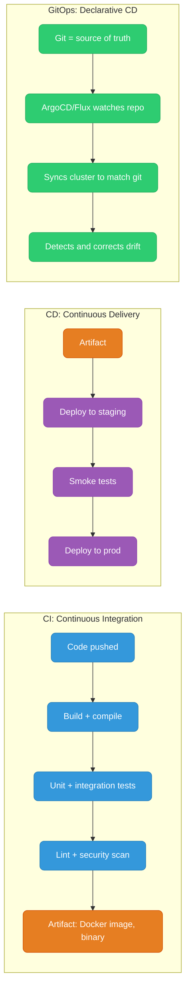
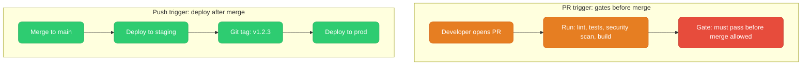
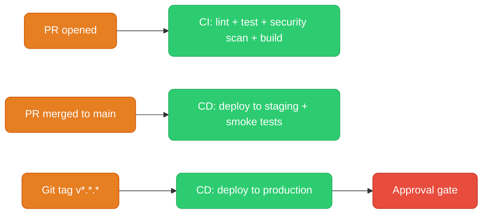
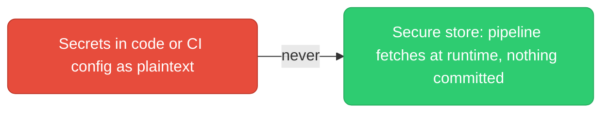
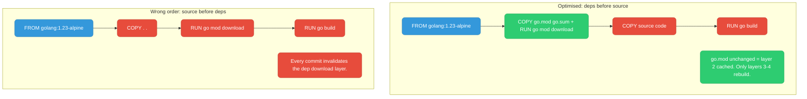
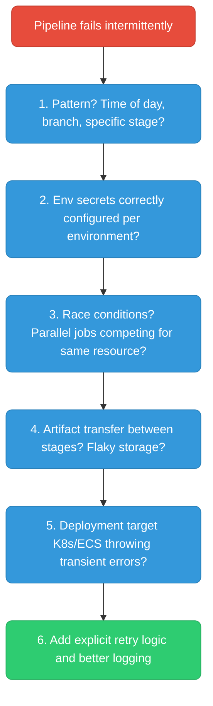

# CI/CD: Concepts & Patterns

CI vs CD vs GitOps, how pipelines trigger, the deployment strategies you'll actually choose between, and how secrets stay out of your repo — with a knowledge check after each section.

  0/0 checks
  

---

## CI vs CD vs GitOps

| | CI | CD push | GitOps pull |
|--|----|---------|----|
| Trigger | Code push/PR | Pipeline pushes to env | Agent pulls from git |
| Audit | Pipeline logs | Pipeline logs | Git commits |
| Rollback | Re-run pipeline | Re-run pipeline | `git revert` + auto-sync |

The key difference between CD push and GitOps pull isn't the end state — both land the same artifact in the same cluster. It's who initiates the change and who holds the credentials. A CD pipeline needs deploy credentials for every environment it targets. A GitOps agent runs inside the cluster and only needs read access to git — nothing external ever gets a key to your production cluster.

  
Under GitOps, who actually pushes the new version into the cluster — the CI pipeline, or something else?

  <button class="quiz-reveal">Reveal answer</button>
  
Something else: an in-cluster agent (ArgoCD/Flux) pulls the desired state from git and reconciles the cluster to match it. CI never gets deploy credentials — it only ever updates the git repo the agent is watching. That's the whole reason it's called a "pull" model.

---

## Pipeline Triggers

**Best practice flow** — the two trigger types above, chained end to end:

Notice the asymmetry: a PR only ever earns the right to merge, it never deploys anything by itself. Deployment only starts once code lands on `main`, and production specifically waits for a tag plus a human approval — three separate triggers doing three separate jobs, so a bad PR can't accidentally ship itself to prod.

  
A feature-branch push and a merge to <code>main</code> both run the pipeline. Should they trigger the same stages?

  <button class="quiz-reveal">Reveal answer</button>
  
No. A feature-branch/PR push should only run CI — lint, test, security scan, build — as a merge gate. A merge to <code>main</code> is what should trigger CD: deploy to staging, run smoke tests. Collapsing the two means an unreviewed branch could deploy itself, which defeats the point of having a gate at all.

---

## Deployment Strategies

```mermaid
graph TD
    classDef v1 fill:#3498db,stroke:#2980b9,color:#fff,rx:8
    classDef v2 fill:#2ecc71,stroke:#27ae60,color:#fff,rx:8
    classDef switch fill:#e67e22,stroke:#d35400,color:#fff,rx:8
    classDef info fill:#95a5a6,stroke:#7f8c8d,color:#fff,rx:6

    subgraph Rolling["Rolling Update: gradual replacement"]
        R1["v1: 3 pods"]:::v1 --> R2["Replace 1 pod with v2"]:::v2
        R2 --> R3["Replace next"]:::v2
        R3 --> R4["All on v2"]:::v2
        RN["Low cost. Both versions run briefly. Slower rollback."]:::info
    end

    subgraph BlueGreen["Blue-Green: instant switch"]
        BG1["Blue: v1 100% traffic"]:::v1 --> BG2["Green: v2 idle"]:::v2
        BG2 --> BG3["Switch LB to Green"]:::switch
        BG3 --> BG4["Blue kept for instant rollback"]:::v1
        BGN["Instant rollback. Doubles cost during transition."]:::info
    end

    subgraph Canary["Canary: gradual traffic shift"]
        C1["v1: 95%"]:::v1 --> C2["v2: 5% canary"]:::v2
        C2 --> C3["Monitor error rate + p99 latency"]:::switch
        C3 --> C4["Shift: 10% to 25% to 50% to 100%"]:::v2
        CN["Real user validation. Low blast radius."]:::info
    end
```

Same three strategies, side by side — flip through to compare rollback, cost, and risk directly instead of scanning a table:

  

    <button data-tab="rolling" class="active">Rolling</button>
    <button data-tab="bluegreen">Blue-Green</button>
    <button data-tab="canary">Canary</button>
  

  

    

      <strong>Rollback: slow.</strong> Pods are replaced one at a time until all are on v2 — rolling back means re-deploying v1 the same gradual way, pod by pod. <strong>Cost: low</strong>, no extra capacity needed. <strong>Risk: v1 and v2 run side by side</strong> for the whole rollout, so both versions must tolerate live traffic and agree on the same schema/API contract.
    

    

      <strong>Rollback: instant.</strong> Flipping the load balancer back to Blue undoes the release in seconds — no redeploy needed. <strong>Cost: high</strong>, you're running two full production-sized environments at once during the transition. <strong>Risk: lowest of the three</strong> — 100% of traffic moves only after Green is verified healthy, so there's never a mixed-version window.
    

    

      <strong>Rollback: fast.</strong> Shift traffic back to v1 the moment error rate or p99 latency crosses a threshold — only the canary's slice of users was ever exposed. <strong>Cost: medium</strong>, a small amount of extra canary capacity, not a whole second environment. <strong>Risk: smallest blast radius</strong> — real production traffic validates the release, but only 5-10% of it to start.
    

  

Canary in particular isn't a single event — it's a process that unfolds over minutes or hours. Walk through what actually happens after you ship:

  

    

      <strong>1. Ship 5% canary.</strong> v2 goes live behind the same load balancer as v1, taking a small, deliberately-limited slice of real production traffic.
    

    

      <strong>2. Watch the signals.</strong> Compare error rate and p99 latency on the canary slice against the v1 baseline for a fixed soak period — minutes to hours, depending on traffic volume.
    

    

      <strong>3. Bad signal → rollback.</strong> If error rate or latency regresses, shift traffic back to 0% on v2 immediately. Only the canary's slice of users ever saw the bad version.
    

    

      <strong>4. Good signal → widen.</strong> Move to 25%, re-watch the same signals, then 50%, then 100% — each step re-validates before the next one starts.
    

    

      <strong>5. Fully rolled out.</strong> v2 serves 100% of traffic. v1 capacity is torn down once you're confident there's no need to fall back.
    

  

  

    <button class="stepper-prev">← Prev</button>
    
    
    <button class="stepper-next">Next →</button>
  

  
Blue-green gives "instant rollback" but "doubles cost." Why can't you tear Blue down as soon as Green takes traffic, to avoid paying for both?

  <button class="quiz-reveal">Reveal answer</button>
  
Because keeping Blue alive — idle, but still running — is exactly what makes rollback instant: a flip of the load balancer back to an environment that's already up. Tear Blue down the moment Green takes traffic and you've traded away the instant-rollback property, leaving you with the same slow redeploy-to-roll-back that rolling updates already give you for less cost.

---

## Secrets in CI/CD

Four tiers of "secure store," roughly in order of how production-grade they are — flip through:

  

    <button data-toggle-opt="cinative" class="active state-warn">CI-native</button>
    <button data-toggle-opt="cloud" class="state-ok">Cloud secrets manager</button>
    <button data-toggle-opt="vault" class="state-ok">HashiCorp Vault</button>
    <button data-toggle-opt="sops" class="state-ok">SOPS + KMS</button>
  

  

    <strong>GitHub Actions secrets, GitLab CI variables.</strong> Set once in the platform UI, injected as env vars at pipeline runtime. Simple, no extra infrastructure to run. Good enough for non-production, but rotation is manual and there's no audit trail beyond "who can edit the repo settings."
  

  

    <strong>AWS Secrets Manager (or the GCP/Azure equivalent) with an IAM role.</strong> The pipeline assumes a role rather than holding a static credential — rotatable, and every access is logged in the cloud provider's own audit trail. Native to the cloud you're already deploying into.
  

  

    <strong>HashiCorp Vault: dynamic secrets.</strong> Vault mints a short-lived credential scoped to that one pipeline run and revokes it afterward. Nothing long-lived to leak. The usual production-grade default when you're not fully committed to one cloud.
  

  

    <strong>SOPS + KMS: encrypted files in git.</strong> Secrets are committed to the repo, but as ciphertext — only decryptable via a KMS key at pipeline runtime. Gets you git-native diff/review/history for secrets, at the cost of a KMS dependency on every decrypt.
  

  
SOPS + KMS commits an encrypted secret straight into git history. Is that as risky as committing the secret in plaintext?

  <button class="quiz-reveal">Reveal answer</button>
  
No. What lands in git is ciphertext — without access to the KMS key that decrypts it, the git history alone is useless to an attacker. The risk shifts from "don't ever leak the repo" to "don't leak the KMS key or the IAM permissions to use it," which is a much smaller, much more auditable surface.

---

## Docker Layer Caching in CI

  
With the "optimised" ordering, a teammate changes only application source code — no dependency changes. Does the <code>go mod download</code> layer rebuild?

  <button class="quiz-reveal">Reveal answer</button>
  
No. Docker's layer cache keys off each instruction plus its inputs — since <code>go.mod</code>/<code>go.sum</code> are unchanged, the <code>COPY go.mod go.sum</code> and <code>RUN go mod download</code> layers are reused straight from cache. Only the layers whose inputs actually changed — <code>COPY</code> source and <code>RUN go build</code> — rebuild.

---

## Debugging Flaky Pipelines

Same checklist, one question at a time — useful mid-incident, when the whole tree at once is more to parse than you want:

  

    

      <strong>1. Is there a pattern?</strong> Time of day, a specific branch, a specific stage — a real pattern points at a real cause. "Totally random" usually means a race condition or a shared resource.
    

    

      <strong>2. Are env/secrets configured per environment?</strong> A secret or config value that's only set correctly in one environment fails silently as "flaky" in every other one.
    

    

      <strong>3. Race condition?</strong> Two parallel jobs writing to the same test database, port, or cache key will pass most of the time and fail exactly when they collide.
    

    

      <strong>4. Artifact transfer between stages?</strong> Flaky object storage, or a too-short timeout on artifact upload/download, shows up as an intermittent, unrelated-looking failure downstream.
    

    

      <strong>5. Is the deploy target throwing transient errors?</strong> Kubernetes API server timeouts, ECS throttling — check the target platform's own health/events before blaming the pipeline itself.
    

    

      <strong>6. Add retries and better logging.</strong> Once 1-5 are ruled out (or fixed), wrap the flaky step in explicit retry logic and log enough context that the next occurrence is a one-minute diagnosis, not a re-investigation.
    

  

  

    <button class="stepper-prev">← Prev</button>
    
    
    <button class="stepper-next">Next →</button>
  

  
A pipeline fails about 1 time in 20, always on a stage that runs two jobs in parallel against the same test database. Which check does this point to?

  <button class="quiz-reveal">Reveal answer</button>
  
Check 3: a race condition. Two parallel jobs contending for the same shared resource — here, the test database — will collide intermittently rather than deterministically, which matches an occasional, non-deterministic failure rate far better than a config or infrastructure issue would.

