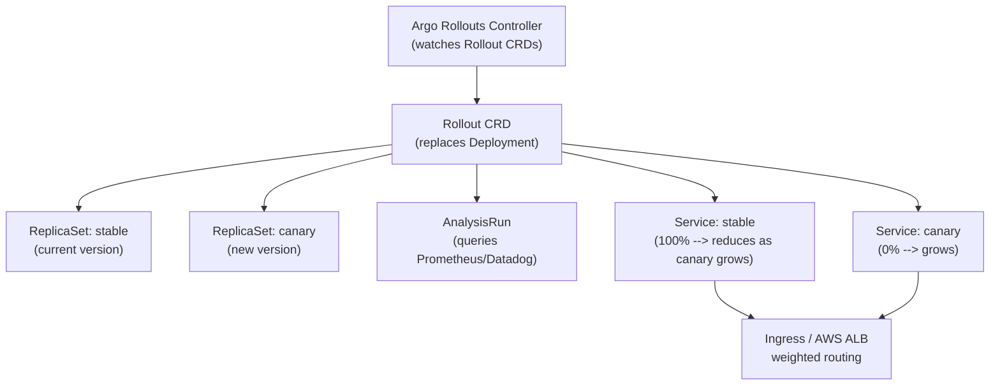
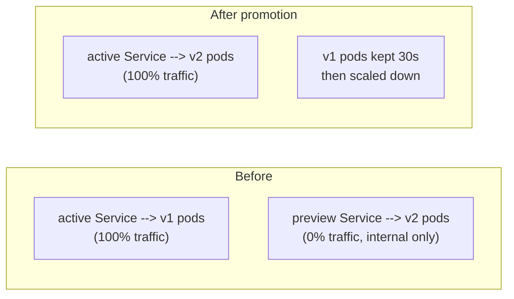

# Argo Rollouts — Progressive Delivery in Kubernetes

Argo Rollouts extends Kubernetes Deployments with canary and blue-green strategies, automated analysis, and traffic management integration.

Each major section below ends with a quick knowledge check — try to answer before revealing:

<div class="quiz-progress" data-quiz-progress>
  <span class="quiz-progress-label">0/0 checks</span>
  <span class="quiz-progress-bar"><span class="quiz-progress-fill"></span></span>
</div>

---

## Why Not Plain Kubernetes Rolling Updates?

| | K8s RollingUpdate | Argo Rollouts |
|--|-------------------|---------------|
| Traffic control | None — replicas = traffic | Precise % split (1% → 5% → 50% → 100%) |
| Automated analysis | No | Yes — query Prometheus/Datadog, pause on errors |
| Pause/resume | No | Yes — manual gate or metric gate |
| Blue-green | No | Yes — full traffic switch |
| Rollback trigger | Manual only | Automatic on metric degradation |
| Preview URL | No | Yes — separate Service for canary |

<div class="quiz-card">
  <p class="quiz-q">With a plain Kubernetes RollingUpdate, the new version starts throwing errors right after rollout. What triggers a rollback?</p>
  <button class="quiz-reveal">Reveal answer</button>
  <div class="quiz-a" hidden>Nothing automatic — rollback is manual only with plain RollingUpdate. Argo Rollouts is what adds automatic rollback, driven by an AnalysisRun querying Prometheus/Datadog and pausing or aborting the rollout on metric degradation.</div>
</div>

---

## Architecture



<div class="quiz-card">
  <p class="quiz-q">Do you keep your existing Deployment object and add a Rollout alongside it, or does the Rollout replace the Deployment entirely?</p>
  <button class="quiz-reveal">Reveal answer</button>
  <div class="quiz-a" hidden>It replaces the Deployment entirely. The Rollout CRD is a drop-in swap for a Deployment, not an addition — same pod template underneath, but the Rollout (not a Deployment) now owns the stable and canary ReplicaSets.</div>
</div>

---

## Install

```bash
kubectl create namespace argo-rollouts
kubectl apply -n argo-rollouts \
  -f https://github.com/argoproj/argo-rollouts/releases/latest/download/install.yaml

# kubectl plugin for managing rollouts
brew install argoproj/tap/kubectl-argo-rollouts
```

---

## Canary Rollout

### Basic canary

```yaml
apiVersion: argoproj.io/v1alpha1
kind: Rollout
metadata:
  name: my-app
spec:
  replicas: 10
  selector:
    matchLabels:
      app: my-app
  template:                          # same as Deployment pod template
    metadata:
      labels:
        app: my-app
    spec:
      containers:
      - name: app
        image: my-app:v2
        ports:
        - containerPort: 8080

  strategy:
    canary:
      # Canary traffic goes to this service (separate from stable)
      canaryService: my-app-canary
      stableService: my-app-stable

      steps:
      - setWeight: 5          # send 5% traffic to canary
      - pause: {duration: 5m} # wait 5 min
      - setWeight: 20
      - pause: {}             # pause indefinitely — manual promotion required
      - setWeight: 50
      - pause: {duration: 5m}
      - setWeight: 100        # full rollout
```

That `steps` list is a timeline, not a one-shot config — walk through what the rollout is actually doing at each stage:

<div class="stepper">
  <div class="stepper-panels">
    <div class="stepper-panel active">
      <strong>1. setWeight: 5.</strong> 5% of traffic is routed to the canary Service, 95% stays on stable. Both ReplicaSets are running side by side.
    </div>
    <div class="stepper-panel">
      <strong>2. pause: duration 5m.</strong> Hold at 5% for 5 minutes. Nobody's watching a dashboard yet at this scale — this is just a small blast radius while early problems surface.
    </div>
    <div class="stepper-panel">
      <strong>3. setWeight: 20.</strong> Traffic to canary steps up to 20% now that the 5% window passed cleanly.
    </div>
    <div class="stepper-panel">
      <strong>4. pause: {}.</strong> An empty pause has no duration — it pauses <em>indefinitely</em>. The rollout sits here until a human runs <code>kubectl argo rollouts promote my-app</code>. This is the manual gate.
    </div>
    <div class="stepper-panel">
      <strong>5. setWeight: 50.</strong> Half of production traffic now hits the canary version.
    </div>
    <div class="stepper-panel">
      <strong>6. pause: duration 5m.</strong> One more timed hold at 50% before going all the way.
    </div>
    <div class="stepper-panel">
      <strong>7. setWeight: 100.</strong> Canary is now the only version serving traffic. The old stable ReplicaSet scales down and the canary becomes the new stable.
    </div>
  </div>
  <div class="stepper-controls">
    <button class="stepper-prev">← Prev</button>
    <span class="stepper-dots"></span>
    <span class="stepper-label"></span>
    <button class="stepper-next">Next →</button>
  </div>
</div>

### With automated Prometheus analysis

```yaml
strategy:
  canary:
    canaryService: my-app-canary
    stableService: my-app-stable
    steps:
    - setWeight: 10
    - analysis:
        templates:
        - templateName: success-rate   # ← AnalysisTemplate defined below
        args:
        - name: service-name
          value: my-app-canary
    - pause: {duration: 5m}
    - setWeight: 50
    - pause: {duration: 5m}
    - setWeight: 100
---
apiVersion: argoproj.io/v1alpha1
kind: AnalysisTemplate
metadata:
  name: success-rate
spec:
  args:
  - name: service-name
  metrics:
  - name: success-rate
    interval: 1m
    successCondition: result[0] >= 0.95   # 95% success rate required
    failureLimit: 3                        # 3 consecutive failures = abort rollout
    provider:
      prometheus:
        address: http://prometheus:9090
        query: |
          sum(rate(http_requests_total{
            service="{{args.service-name}}",
            status!~"5.."
          }[2m])) /
          sum(rate(http_requests_total{
            service="{{args.service-name}}"
          }[2m]))
```

**What happens on failure:** If the success rate drops below 95% for 3 consecutive checks, the rollout automatically aborts — scales canary to 0, promotes nothing, and the stable version continues serving 100%.

### ALB weighted routing (AWS)

For precise traffic splitting without replica-count tricks:

```yaml
strategy:
  canary:
    canaryService: my-app-canary
    stableService: my-app-stable
    trafficRouting:
      alb:
        ingress: my-app-ingress    # the ALB Ingress resource
        servicePort: 8080
    steps:
    - setWeight: 1        # 1% canary — impossible with just replicas
    - pause: {duration: 10m}
    - setWeight: 10
    - pause: {}
    - setWeight: 100
```

```yaml
# The Ingress — Argo Rollouts manages the weights automatically
apiVersion: networking.k8s.io/v1
kind: Ingress
metadata:
  name: my-app-ingress
  annotations:
    kubernetes.io/ingress.class: alb
spec:
  rules:
  - http:
      paths:
      - path: /
        backend:
          service:
            name: my-app-stable   # Rollouts controller updates weights on ALB
            port:
              number: 8080
```

<div class="quiz-card">
  <p class="quiz-q">A canary step has <code>successCondition: result[0] >= 0.95</code> and <code>failureLimit: 3</code>. The success rate dips below 0.95 for 2 consecutive checks, then recovers. Does the rollout abort?</p>
  <button class="quiz-reveal">Reveal answer</button>
  <div class="quiz-a" hidden>No. <code>failureLimit: 3</code> counts <em>consecutive</em> failures — it takes 3 in a row before Argo Rollouts aborts (scales canary to 0, stable keeps serving 100%). A metric that dips for 2 checks and then recovers never hits that threshold, so the rollout just continues.</div>
</div>

---

## Blue-Green Rollout



```yaml
apiVersion: argoproj.io/v1alpha1
kind: Rollout
metadata:
  name: my-app-bg
spec:
  replicas: 5
  selector:
    matchLabels:
      app: my-app
  template:
    metadata:
      labels:
        app: my-app
    spec:
      containers:
      - name: app
        image: my-app:v2

  strategy:
    blueGreen:
      activeService: my-app-active        # production traffic
      previewService: my-app-preview      # test traffic (internal, QA)

      autoPromotionEnabled: false         # require manual promotion
      # autoPromotionSeconds: 60          # or auto-promote after 60s

      prePromotionAnalysis:               # run analysis before switching traffic
        templates:
        - templateName: success-rate
        args:
        - name: service-name
          value: my-app-preview

      scaleDownDelaySeconds: 30           # keep old (blue) pods 30s after switch
```

**Promotion:**
```bash
# Manual promotion — switch active service to new version
kubectl argo rollouts promote my-app-bg

# Or via ArgoCD UI / CLI
argocd app sync my-app   # if using ArgoCD to manage the Rollout
```

The Before/After diagram above is really five distinct moments — step through the actual cutover:

<div class="stepper">
  <div class="stepper-panels">
    <div class="stepper-panel active">
      <strong>1. Steady state.</strong> <code>activeService</code> routes 100% of production traffic to v1 pods. <code>previewService</code> points at v2 pods, but only internal/QA traffic reaches them — no production user has seen v2 yet.
    </div>
    <div class="stepper-panel">
      <strong>2. Pre-promotion analysis.</strong> The <code>success-rate</code> AnalysisTemplate queries Prometheus against <code>my-app-preview</code> — validating v2 before any real traffic goes near it.
    </div>
    <div class="stepper-panel">
      <strong>3. Manual gate.</strong> With <code>autoPromotionEnabled: false</code>, nothing switches until <code>kubectl argo rollouts promote my-app-bg</code> (or an ArgoCD sync) runs.
    </div>
    <div class="stepper-panel">
      <strong>4. Cutover.</strong> <code>activeService</code> is repointed to the v2 pods. Production traffic goes from 0% to 100% on v2 in one shot — no gradual ramp like canary.
    </div>
    <div class="stepper-panel">
      <strong>5. Scale-down delay.</strong> The old v1 pods aren't deleted immediately — <code>scaleDownDelaySeconds: 30</code> keeps them warm for 30s. A rollback in that window is just flipping <code>activeService</code> back; the v1 pods are still there to receive traffic.
    </div>
  </div>
  <div class="stepper-controls">
    <button class="stepper-prev">← Prev</button>
    <span class="stepper-dots"></span>
    <span class="stepper-label"></span>
    <button class="stepper-next">Next →</button>
  </div>
</div>

<div class="quiz-card">
  <p class="quiz-q">Right after <code>kubectl argo rollouts promote</code> completes on a blue-green rollout with <code>scaleDownDelaySeconds: 30</code>, are the old v1 pods gone?</p>
  <button class="quiz-reveal">Reveal answer</button>
  <div class="quiz-a" hidden>No. The <code>activeService</code> switches to v2 immediately, but the v1 pods are kept running for 30 more seconds before being scaled down. That grace window is what makes a rollback "instant" — it's just flipping the Service back while the old pods are still warm, not waiting for new pods to start.</div>
</div>

---

## kubectl Commands

```bash
# Watch rollout progress (live)
kubectl argo rollouts get rollout my-app --watch

# Promote to next step (unpause a manual pause)
kubectl argo rollouts promote my-app

# Abort rollout (scale canary to 0, stable remains)
kubectl argo rollouts abort my-app

# Manually retry after abort
kubectl argo rollouts retry rollout my-app

# Set image (triggers new rollout)
kubectl argo rollouts set image my-app app=my-app:v3

# Pause a running rollout
kubectl argo rollouts pause my-app

# View analysis run results
kubectl argo rollouts get rollout my-app -o json | jq '.status.currentStepAnalysisRunStatus'
```

---

## ArgoCD + Argo Rollouts Integration

ArgoCD manages the `Rollout` CRD the same way it manages `Deployment`. Install the ArgoCD Rollouts extension so ArgoCD understands Rollout health:

```bash
# ArgoCD needs a custom health check for Rollout objects (Lua script in argocd-cm)
# Most setups use the official Rollouts plugin:
kubectl apply -n argocd \
  -f https://raw.githubusercontent.com/argoproj-labs/argocd-extensions/main/examples/rollout/rollout-extension.yaml
```

```yaml
# argocd-cm ConfigMap — custom health check for Rollout
resource.customizations.health.argoproj.io_Rollout: |
  hs = {}
  if obj.status ~= nil then
    if obj.status.phase == "Healthy" then
      hs.status = "Healthy"
    elseif obj.status.phase == "Paused" then
      hs.status = "Suspended"
      hs.message = "Rollout is paused"
    elseif obj.status.phase == "Degraded" then
      hs.status = "Degraded"
      hs.message = obj.status.message
    else
      hs.status = "Progressing"
    end
  end
  return hs
```

**GitOps flow with Argo Rollouts:**
1. Developer bumps image tag in git
2. ArgoCD syncs → creates new `Rollout` revision
3. Argo Rollouts controller starts canary steps
4. Analysis queries Prometheus automatically
5. On success: full promotion. On failure: auto-rollback to previous revision in git.

<div class="quiz-card">
  <p class="quiz-q">In this GitOps flow, who decides whether to abort a failing canary — someone watching the ArgoCD UI, or something automatic?</p>
  <button class="quiz-reveal">Reveal answer</button>
  <div class="quiz-a" hidden>It's automatic. The Argo Rollouts controller runs the analysis against Prometheus during the canary steps and, on failure, auto-rolls-back to the previous git revision without a human in the loop. ArgoCD's role here is just keeping the live <code>Rollout</code> resource synced with git — the progressive-delivery decision-making happens inside Argo Rollouts, not ArgoCD.</div>
</div>

---

## Canary vs Blue-Green Decision

| | Canary | Blue-Green |
|--|--------|-----------|
| Traffic split | Gradual (1% → 100%) | Instant switch |
| Resource cost | Low (only a few canary pods) | 2× during transition |
| Rollback speed | Fast (shift traffic back) | Instant (flip service) |
| Best for | Stateless services, high traffic | Services needing zero-downtime switch, stateful |
| DB migrations | Risky — both versions run simultaneously | Safer — preview env for testing |
| Real user validation | Yes — real traffic on canary | No — preview is internal only |

<div class="quiz-card">
  <p class="quiz-q">You're rolling out a change to a stateful service that also touches the database schema. Which strategy gives you an isolated environment to validate the new version against before real users see it?</p>
  <button class="quiz-reveal">Reveal answer</button>
  <div class="quiz-a" hidden>Blue-green — the preview Service is internal-only, so you can validate the new version (and any DB migration) before flipping production traffic to it. Canary sends real user traffic to the new version starting at its very first step, which is exactly what makes it riskier when both versions are touching the same database simultaneously.</div>
</div>
