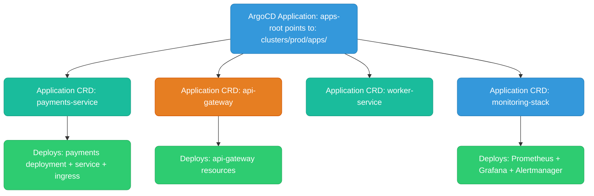
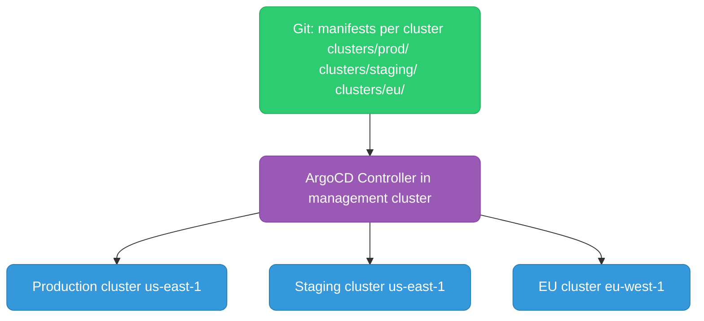
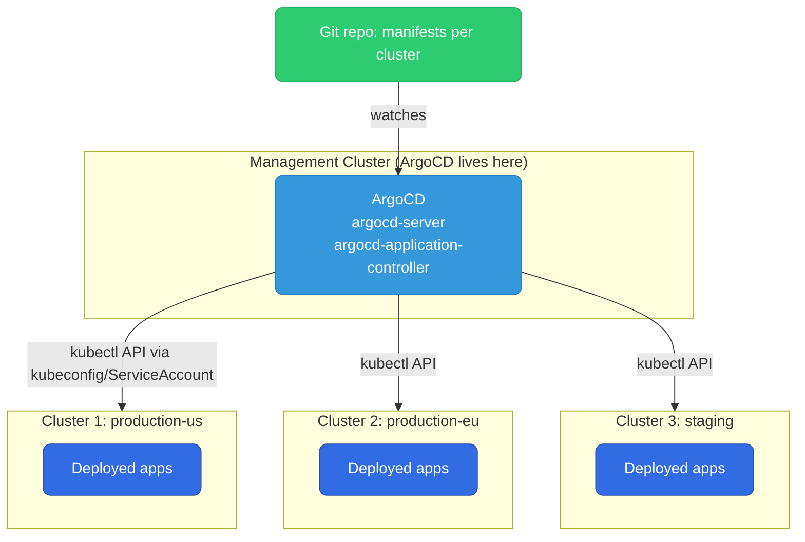

# ArgoCD

ArgoCD is a declarative GitOps continuous delivery tool for Kubernetes. Git is the single source of truth; ArgoCD continuously syncs the cluster to match it.

Most sections below end with a quick knowledge check — track how many you've cleared as you go:

<div class="quiz-progress" data-quiz-progress>
  <span class="quiz-progress-label">0/0 checks</span>
  <span class="quiz-progress-bar"><span class="quiz-progress-fill"></span></span>
</div>

---

## GitOps Model

```mermaid
graph LR
    classDef blue fill:#3498db,stroke:#2980b9,color:#fff,rx:8
    classDef green fill:#2ecc71,stroke:#27ae60,color:#fff,rx:8
    classDef red fill:#e74c3c,stroke:#c0392b,color:#fff,rx:8
    classDef orange fill:#e67e22,stroke:#d35400,color:#fff,rx:8
    classDef purple fill:#9b59b6,stroke:#8e44ad,color:#fff,rx:8
    classDef teal fill:#1abc9c,stroke:#16a085,color:#fff,rx:8
    classDef dark fill:#2c3e50,stroke:#1a252f,color:#fff,rx:8
    classDef yellow fill:#f39c12,stroke:#d68910,color:#000,rx:8
    classDef k8s fill:#326ce5,stroke:#254ea8,color:#fff,rx:8
    classDef aws fill:#ff9900,stroke:#cc7a00,color:#000,rx:8
    DEV["Developer pushes K8s manifest to git"]:::green --> GIT["Git repo (manifests, Helm charts, Kustomize)"]:::green
    GIT --> ARGO["ArgoCD controller watches git repo"]:::green
    ARGO --> DIFF["Computes diff: git state vs cluster state"]:::green
    DIFF -->|"out of sync"| SYNC["Syncs cluster to match git (kubectl apply equivalent)"]:::green
    SYNC --> CLUSTER["Kubernetes Cluster"]:::k8s
    CLUSTER -->|"health checks"| ARGO
```



That diagram is a loop, not a one-shot pipeline. Step through what actually happens, one stage at a time:

<div class="stepper">
  <div class="stepper-panels">
    <div class="stepper-panel active">
      <strong>1. Developer pushes.</strong> A K8s manifest, Helm chart, or Kustomize change lands in the git repo — the single source of truth.
    </div>
    <div class="stepper-panel">
      <strong>2. ArgoCD's controller watches.</strong> It's continuously watching the git repo, not waiting to be triggered by a pipeline.
    </div>
    <div class="stepper-panel">
      <strong>3. Computes a diff.</strong> Git state vs live cluster state, resource by resource.
    </div>
    <div class="stepper-panel">
      <strong>4. Syncs if out of sync.</strong> Applies whatever's needed to make the cluster match git — the <code>kubectl apply</code> equivalent.
    </div>
    <div class="stepper-panel">
      <strong>5. Health checks, then loop.</strong> ArgoCD checks the cluster's health and goes right back to watching — this never stops running.
    </div>
  </div>
  <div class="stepper-controls">
    <button class="stepper-prev">← Prev</button>
    <span class="stepper-dots"></span>
    <span class="stepper-label"></span>
    <button class="stepper-next">Next →</button>
  </div>
</div>

<div class="tab-group">
  <div class="tab-buttons">
    <button data-tab="push" class="active">Push (Jenkins/GHA)</button>
    <button data-tab="pull">Pull (ArgoCD)</button>
  </div>
  <div class="tab-panels">
    <div class="tab-panel active" data-tab-panel="push">
      The pipeline itself has cluster credentials and applies changes directly to the cluster.
    </div>
    <div class="tab-panel" data-tab-panel="pull">
      An agent running inside the cluster pulls changes from git — no external system needs cluster credentials at all.
    </div>
  </div>
</div>

**Why GitOps wins for Kubernetes:**
- Cluster credentials never leave the cluster — no secrets in CI pipelines
- Full audit trail in git: who changed what, when, and why (via PR description)
- Rollback = `git revert` + ArgoCD auto-syncs back
- Multi-cluster: one ArgoCD instance can manage many clusters

<div class="quiz-card">
  <p class="quiz-q">In ArgoCD's pull model, which side actually holds the cluster credentials — the CI pipeline or the in-cluster agent?</p>
  <button class="quiz-reveal">Reveal answer</button>
  <div class="quiz-a" hidden>The in-cluster ArgoCD agent. It pulls changes from git itself, so cluster credentials never have to leave the cluster or live in a CI pipeline &mdash; the opposite of push-based tools like Jenkins/GHA, where the pipeline holds the credentials and applies changes directly.</div>
</div>

---

## Application CRD

The `Application` is ArgoCD's core resource. It defines what to deploy and where.

```yaml
apiVersion: argoproj.io/v1alpha1
kind: Application
metadata:
  name: my-app
  namespace: argocd
spec:
  # Where to deploy
  destination:
    server: https://kubernetes.default.svc   # in-cluster
    namespace: production

  # Source: where the K8s manifests live
  source:
    repoURL: https://github.com/my-org/my-app-manifests
    targetRevision: main     # branch, tag, or commit SHA
    path: k8s/production     # directory within repo

  # Sync policy
  syncPolicy:
    automated:
      prune: true      # delete resources removed from git
      selfHeal: true   # revert manual cluster changes back to git state
    syncOptions:
      - CreateNamespace=true

  # Health check — what does "healthy" mean for this app?
  # ArgoCD has built-in health checks for Deployment, StatefulSet, Ingress, etc.
```

**Without `automated` sync:** ArgoCD detects drift but waits for a human to click "Sync" or run `argocd app sync my-app`. Manual sync = change management gate before applying to production.

<div class="quiz-card">
  <p class="quiz-q">You create an Application without a <code>syncPolicy.automated</code> block. A new commit lands in git — does ArgoCD apply it to the cluster automatically?</p>
  <button class="quiz-reveal">Reveal answer</button>
  <div class="quiz-a" hidden>No. Without <code>automated</code>, ArgoCD only detects drift and marks the app OutOfSync &mdash; a human still has to click Sync or run <code>argocd app sync</code> for the change to actually apply. That manual gate is exactly the change-management checkpoint you want in front of production.</div>
</div>

---

## Sync Policies

```mermaid
graph TD
    classDef blue fill:#3498db,stroke:#2980b9,color:#fff,rx:8
    classDef green fill:#2ecc71,stroke:#27ae60,color:#fff,rx:8
    classDef red fill:#e74c3c,stroke:#c0392b,color:#fff,rx:8
    classDef orange fill:#e67e22,stroke:#d35400,color:#fff,rx:8
    classDef purple fill:#9b59b6,stroke:#8e44ad,color:#fff,rx:8
    classDef teal fill:#1abc9c,stroke:#16a085,color:#fff,rx:8
    classDef dark fill:#2c3e50,stroke:#1a252f,color:#fff,rx:8
    classDef yellow fill:#f39c12,stroke:#d68910,color:#000,rx:8
    classDef k8s fill:#326ce5,stroke:#254ea8,color:#fff,rx:8
    classDef aws fill:#ff9900,stroke:#cc7a00,color:#000,rx:8
    subgraph ManualSync["Manual Sync (default)"]
        DETECT["ArgoCD detects OutOfSync"]:::green --> WAIT["Waits for human approval"]:::orange
        WAIT --> SYNC_BTN["Human clicks Sync / argocd app sync"]:::green
        SYNC_BTN --> APPLY["Apply changes to cluster"]:::blue
    end

    subgraph AutoSync["Automated Sync"]
        A_DETECT["ArgoCD detects OutOfSync"]:::green --> AUTO_APPLY["Immediately applies changes"]:::blue
        AUTO_APPLY --> HEALTH["Health assessment"]:::yellow
        HEALTH -->|"Degraded"| ROLLBACK["Auto-rollback to previous state"]:::blue
    end

    subgraph SelfHeal["Self-Heal (automated + selfHeal: true)"]
        KUBECTL["kubectl edit deployment (manual change)"]:::green --> DRIFT2["ArgoCD detects drift within 3min"]:::red
        DRIFT2 --> REVERT["Reverts manual change to match git"]:::green
    end
```



| Policy | Use case |
|--------|----------|
| Manual sync | Production — require human approval for every deployment |
| Auto sync without self-heal | Staging — auto-deploy new commits, allow temporary manual patches |
| Auto sync + self-heal | Dev/ephemeral — full automation, git is absolute truth |
| Auto sync + prune | Any — clean up resources deleted from git |

<div class="quiz-card">
  <p class="quiz-q">Auto sync is enabled but <code>selfHeal</code> is not. Someone runs <code>kubectl edit deployment</code> straight against the cluster. Does ArgoCD revert it?</p>
  <button class="quiz-reveal">Reveal answer</button>
  <div class="quiz-a" hidden>No. Without <code>selfHeal: true</code>, ArgoCD only reacts to changes in git — a manual cluster edit just shows up as OutOfSync. It won't auto-revert the patch until selfHeal is also enabled, or someone triggers a sync by hand.</div>
</div>

---

## Sync Waves and Hooks

Control the order of resource application within a single sync:

```yaml
# Database migration job — must complete BEFORE app deployment
apiVersion: batch/v1
kind: Job
metadata:
  name: db-migrate
  annotations:
    argocd.argoproj.io/hook: PreSync        # runs before the main sync
    argocd.argoproj.io/hook-delete-policy: HookSucceeded  # clean up after
    argocd.argoproj.io/sync-wave: "-1"      # wave order (lower = earlier)
spec:
  template:
    spec:
      containers:
        - name: migrate
          image: my-app:v2
          command: ["/app/server", "migrate"]
---
# Main deployment — runs after migration completes
apiVersion: apps/v1
kind: Deployment
metadata:
  name: my-app
  annotations:
    argocd.argoproj.io/sync-wave: "0"   # default wave
```

**Hook types:**

<div class="toggle-switch">
  <div class="toggle-buttons">
    <button data-toggle-opt="presync" class="active">PreSync</button>
    <button data-toggle-opt="sync">Sync</button>
    <button data-toggle-opt="postsync" class="state-ok">PostSync</button>
    <button data-toggle-opt="syncfail" class="state-bad">SyncFail</button>
  </div>
  <div class="toggle-panel active" data-toggle-panel="presync">
    Runs before sync — migrations, backups.
  </div>
  <div class="toggle-panel" data-toggle-panel="sync">
    Runs during sync, alongside regular resources.
  </div>
  <div class="toggle-panel" data-toggle-panel="postsync">
    Runs after all resources are healthy — smoke tests, notifications.
  </div>
  <div class="toggle-panel" data-toggle-panel="syncfail">
    Runs if sync fails — alert, rollback trigger.
  </div>
</div>

Put together, one sync's hooks and waves execute in this order:

<div class="stepper">
  <div class="stepper-panels">
    <div class="stepper-panel active">
      <strong>1. Lowest sync-wave first.</strong> A <code>PreSync</code> hook at wave <code>-1</code> (like the <code>db-migrate</code> Job above) runs before anything else.
    </div>
    <div class="stepper-panel">
      <strong>2. Hook cleanup.</strong> With <code>hook-delete-policy: HookSucceeded</code>, ArgoCD deletes the hook resource once it succeeds — it did its job.
    </div>
    <div class="stepper-panel">
      <strong>3. Next wave applies.</strong> Wave <code>0</code> (the default) — the main Deployment in this example — gets applied next.
    </div>
    <div class="stepper-panel">
      <strong>4. Sync hooks, if any.</strong> Run alongside the regular resources during the sync itself.
    </div>
    <div class="stepper-panel">
      <strong>5. PostSync or SyncFail.</strong> Once every resource is applied and healthy, <code>PostSync</code> hooks fire (smoke tests, notifications). If anything failed along the way, <code>SyncFail</code> hooks fire instead (alerting, rollback trigger).
    </div>
  </div>
  <div class="stepper-controls">
    <button class="stepper-prev">← Prev</button>
    <span class="stepper-dots"></span>
    <span class="stepper-label"></span>
    <button class="stepper-next">Next →</button>
  </div>
</div>

<div class="quiz-card">
  <p class="quiz-q">A hook has <code>argocd.argoproj.io/hook: PreSync</code> and <code>sync-wave: "-1"</code>; the main Deployment sits at the default wave <code>0</code>. Which runs first, and what happens to the hook resource once it succeeds (given <code>hook-delete-policy: HookSucceeded</code>)?</p>
  <button class="quiz-reveal">Reveal answer</button>
  <div class="quiz-a" hidden>The PreSync hook at wave -1 runs first &mdash; lower wave numbers go earlier. Once it completes successfully, <code>HookSucceeded</code> deletes it automatically, so it doesn't linger in the cluster after doing its job.</div>
</div>

---

## App of Apps Pattern

Manage multiple applications from a single ArgoCD Application. The root app deploys other Application CRDs.



```
clusters/prod/apps/
├── apps-root.yaml          # root Application
├── payments-service.yaml   # Application pointing to payments manifests
├── api-gateway.yaml
└── monitoring-stack.yaml   # Application pointing to monitoring Helm chart
```

**Why:** New applications are added by adding a new Application YAML to git — ArgoCD picks it up automatically. No manual ArgoCD configuration required.

<div class="quiz-card">
  <p class="quiz-q">You need to add a fifth application under the App of Apps setup above. What do you have to configure inside ArgoCD itself?</p>
  <button class="quiz-reveal">Reveal answer</button>
  <div class="quiz-a" hidden>Nothing. Commit a new Application YAML into the directory the root app watches (e.g. <code>clusters/prod/apps/</code>) and ArgoCD picks it up on its own &mdash; there's no manual ArgoCD-side step.</div>
</div>

---

## Multi-Cluster Management

One ArgoCD instance can manage many clusters:

```yaml
# Register external cluster
argocd cluster add my-prod-cluster --name production

# Application targeting external cluster
spec:
  destination:
    server: https://my-prod-cluster-api-endpoint:6443
    namespace: payments
```



**ApplicationSet** — generate Applications automatically for each cluster from a template:

```yaml
apiVersion: argoproj.io/v1alpha1
kind: ApplicationSet
metadata:
  name: my-app-all-clusters
spec:
  generators:
    - clusters: {}   # generates one Application per registered cluster
  template:
    spec:
      source:
        repoURL: https://github.com/my-org/manifests
        path: "clusters/{{name}}"   # {{name}} = cluster name
      destination:
        server: "{{server}}"        # cluster API endpoint
        namespace: my-app
```

<div class="quiz-card">
  <p class="quiz-q">You already have an ApplicationSet using the <code>clusters</code> generator with no selector. You register a brand-new cluster with <code>argocd cluster add</code>. Do you need to write it a new Application manifest?</p>
  <button class="quiz-reveal">Reveal answer</button>
  <div class="quiz-a" hidden>No. The clusters generator produces one Application per registered cluster automatically &mdash; registering the cluster is enough, ApplicationSet generates its Application from the existing template.</div>
</div>

---

## Rollback

```bash
# View sync history
argocd app history my-app

# Rollback to previous revision
argocd app rollback my-app <revision-id>

# Or: git revert the commit, ArgoCD auto-syncs back
git revert HEAD
git push origin main
# ArgoCD detects the new commit and syncs (which undoes the bad deploy)
```

**Git revert is the preferred rollback** — it's auditable, goes through the same review process, and keeps a clean history. ArgoCD's built-in rollback is useful for emergency hotfixes.

<div class="quiz-card">
  <p class="quiz-q">Both <code>argocd app rollback</code> and <code>git revert</code> + push undo a bad deploy. Which one is preferred, and why?</p>
  <button class="quiz-reveal">Reveal answer</button>
  <div class="quiz-a" hidden><code>git revert</code> &mdash; it goes through the normal PR/review process and leaves a clean, auditable history in git, the actual source of truth. ArgoCD's built-in rollback is best treated as an emergency-hotfix tool, not the default path.</div>
</div>

---

## Image Updater

ArgoCD Image Updater automatically updates image tags in git when new images are pushed:

```yaml
# Annotation on Application
annotations:
  argocd-image-updater.argoproj.io/image-list: myapp=123456.dkr.ecr.us-east-1.amazonaws.com/my-app
  argocd-image-updater.argoproj.io/myapp.update-strategy: semver   # or digest, latest, name
  argocd-image-updater.argoproj.io/write-back-method: git          # commit new tag to git
```

**Flow:**
1. CI builds and pushes `my-app:v1.2.3` to ECR
2. Image Updater polls ECR, detects new tag
3. Updates the image tag in the git repo (via commit)
4. ArgoCD detects the git change, syncs the cluster
5. Full GitOps: no CI pipeline needs cluster credentials

<div class="stepper">
  <div class="stepper-panels">
    <div class="stepper-panel active">
      <strong>1. CI builds.</strong> Pushes <code>my-app:v1.2.3</code> to ECR &mdash; that's the last thing CI does.
    </div>
    <div class="stepper-panel">
      <strong>2. Image Updater polls.</strong> It watches ECR directly and notices the new tag on its own.
    </div>
    <div class="stepper-panel">
      <strong>3. Commits to git.</strong> It updates the image tag in the git repo itself &mdash; not by touching the cluster.
    </div>
    <div class="stepper-panel">
      <strong>4. ArgoCD syncs.</strong> It sees that git change exactly like any other commit, and syncs the cluster to match.
    </div>
    <div class="stepper-panel">
      <strong>5. Full GitOps, end to end.</strong> No CI pipeline ever needed cluster credentials &mdash; git stayed the single source of truth the whole way through.
    </div>
  </div>
  <div class="stepper-controls">
    <button class="stepper-prev">← Prev</button>
    <span class="stepper-dots"></span>
    <span class="stepper-label"></span>
    <button class="stepper-next">Next →</button>
  </div>
</div>

<div class="quiz-card">
  <p class="quiz-q">With <code>write-back-method: git</code> configured, does the CI pipeline that builds <code>my-app:v1.2.3</code> need cluster credentials to get that image deployed?</p>
  <button class="quiz-reveal">Reveal answer</button>
  <div class="quiz-a" hidden>No. CI only needs to push the image to the registry. Image Updater polls the registry and commits the new tag to git itself, then ArgoCD picks up that git change and syncs &mdash; cluster credentials never touch the CI pipeline.</div>
</div>

---

## Health Checks and Notifications

ArgoCD has built-in health assessments for standard K8s resources. Custom health checks via Lua scripts:

```yaml
# config in argocd-cm ConfigMap
resource.customizations.health.argoproj.io_Rollout: |
  hs = {}
  if obj.status ~= nil then
    if obj.status.phase == "Healthy" then
      hs.status = "Healthy"
    elseif obj.status.phase == "Degraded" then
      hs.status = "Degraded"
      hs.message = obj.status.message
    end
  end
  return hs
```

**Notifications** — alert on sync events via Slack, PagerDuty, email:

```yaml
# argocd-notifications-cm
triggers:
  - name: on-sync-failed
    condition: app.status.sync.status == 'Unknown'
    template: app-sync-failed

templates:
  - name: app-sync-failed
    message: |
      Application {{.app.metadata.name}} sync failed.
      Error: {{.app.status.conditions[0].message}}
```

---

## Multi-Cluster Deployments

### Where does ArgoCD live?

ArgoCD is installed in **one cluster** — the "management cluster" (or hub cluster). It then connects to N target clusters and deploys into them. ArgoCD itself never needs to run in every cluster.



**Connectivity:** ArgoCD connects to target clusters using a ServiceAccount token. It uses the Kubernetes API — needs network access from the management cluster to target cluster API servers (typically via private endpoint, VPN, or VPC peering).

### Step 1: Register target clusters

```bash
# Login to ArgoCD CLI
argocd login <argocd-server-host>

# Add each target cluster (uses your current kubeconfig context)
argocd cluster add production-us-context --name production-us
argocd cluster add production-eu-context --name production-eu
argocd cluster add staging-context       --name staging

# Verify
argocd cluster list
# SERVER                          NAME             STATUS
# https://prod-us.eks.amazonaws.com   production-us    Successful
# https://prod-eu.eks.amazonaws.com   production-eu    Successful
# https://staging.eks.amazonaws.com   staging          Successful
```

This creates a Secret in the `argocd` namespace with the cluster credentials.

### Step 2: One Application per cluster (manual)

```yaml
# app-production-us.yaml
apiVersion: argoproj.io/v1alpha1
kind: Application
metadata:
  name: myapp-production-us
  namespace: argocd
spec:
  project: default
  source:
    repoURL: https://github.com/my-org/k8s-manifests
    targetRevision: main
    path: apps/myapp/overlays/production-us   # kustomize overlay per cluster
  destination:
    server: https://prod-us.eks.amazonaws.com  # target cluster API
    namespace: myapp
  syncPolicy:
    automated:
      prune: true
      selfHeal: true
```

Repeat for each cluster. This works but doesn't scale — 3 clusters × 10 apps = 30 Application manifests.

### Step 3: ApplicationSet — the scalable way

`ApplicationSet` is an ArgoCD controller that generates `Application` objects automatically from a template + generator. One manifest, N applications.

```yaml
apiVersion: argoproj.io/v1alpha1
kind: ApplicationSet
metadata:
  name: myapp
  namespace: argocd
spec:
  generators:
  - list:
      elements:
      - cluster: production-us
        url: https://prod-us.eks.amazonaws.com
        env: production
      - cluster: production-eu
        url: https://prod-eu.eks.amazonaws.com
        env: production
      - cluster: staging
        url: https://staging.eks.amazonaws.com
        env: staging
  template:
    metadata:
      name: "myapp-{{cluster}}"          # generates: myapp-production-us, myapp-production-eu, myapp-staging
    spec:
      project: default
      source:
        repoURL: https://github.com/my-org/k8s-manifests
        targetRevision: main
        path: "apps/myapp/overlays/{{cluster}}"   # per-cluster kustomize overlay
      destination:
        server: "{{url}}"
        namespace: myapp
      syncPolicy:
        automated:
          prune: true
          selfHeal: true
```

This generates 3 `Application` objects automatically. Add a 4th cluster → add one list element.

### Git repo structure for multi-cluster

```
k8s-manifests/
├── apps/
│   └── myapp/
│       ├── base/                    # shared manifests (Deployment, Service)
│       │   ├── deployment.yaml
│       │   └── kustomization.yaml
│       └── overlays/
│           ├── production-us/       # cluster-specific patches
│           │   ├── kustomization.yaml
│           │   └── patch-replicas.yaml   # replicas: 10
│           ├── production-eu/
│           │   ├── kustomization.yaml
│           │   └── patch-replicas.yaml   # replicas: 5
│           └── staging/
│               ├── kustomization.yaml
│               └── patch-replicas.yaml   # replicas: 2
```

### Progressive delivery across clusters

Deploy to staging first, promote to prod after health check:

```yaml
# Use sync waves: staging syncs first, prod only after staging is healthy
metadata:
  annotations:
    argocd.argoproj.io/sync-wave: "1"    # staging: wave 1 (first)
    # prod clusters: wave 2 (after wave 1 healthy)
```

Or use ArgoCD's **Rollout** integration with Argo Rollouts for canary/blue-green per cluster.

### Hub-spoke vs. standalone ArgoCD per cluster

| | Hub (one ArgoCD, N clusters) | Standalone (ArgoCD per cluster) |
|--|-----------------------------|---------------------------------|
| **Ops overhead** | One ArgoCD to maintain | N ArgoCD instances |
| **Blast radius** | ArgoCD cluster down = no deploys to any cluster | One cluster's ArgoCD down = only that cluster affected |
| **Network** | Needs API access to all target clusters | Only needs access to own cluster |
| **Use case** | Small/medium orgs, central platform team | Large orgs, strict isolation, air-gapped clusters |

---

## Projects and RBAC

ArgoCD Projects group Applications and enforce what can be deployed where. RBAC controls who can do what.

### AppProject — boundaries for a team

```yaml
apiVersion: argoproj.io/v1alpha1
kind: AppProject
metadata:
  name: team-payments
  namespace: argocd
spec:
  description: "Payments team — production and staging"

  # Which git repos this project can source from
  sourceRepos:
    - https://github.com/my-org/payments-manifests
    - https://github.com/my-org/shared-charts

  # Which clusters + namespaces Applications in this project can deploy to
  destinations:
    - server: https://kubernetes.default.svc
      namespace: payments-prod
    - server: https://kubernetes.default.svc
      namespace: payments-staging

  # Block deploying cluster-scoped resources (RBAC, CRDs, etc.)
  clusterResourceWhitelist: []          # empty = no cluster-scoped resources allowed

  # Allow only these namespaced resource types
  namespaceResourceWhitelist:
    - group: apps
      kind: Deployment
    - group: ""
      kind: Service
    - group: ""
      kind: ConfigMap
    - group: autoscaling
      kind: HorizontalPodAutoscaler

  # Sync windows — prevent deploys outside business hours in prod
  syncWindows:
    - kind: deny
      schedule: "0 22 * * *"    # deny at 10pm every day
      duration: 8h               # for 8 hours (10pm–6am)
      applications: ["*"]
      namespaces: ["payments-prod"]
    - kind: allow
      schedule: "0 9 * * 1-5"   # allow weekdays 9am
      duration: 9h
      applications: ["*"]
      namespaces: ["payments-prod"]
```

### RBAC — who can do what

ArgoCD RBAC is configured in the `argocd-rbac-cm` ConfigMap. Roles are defined with `p` (policy) lines, then bound to users/groups.

```yaml
# kubectl edit configmap argocd-rbac-cm -n argocd
apiVersion: v1
kind: ConfigMap
metadata:
  name: argocd-rbac-cm
  namespace: argocd
data:
  policy.default: role:readonly   # default role for authenticated users

  policy.csv: |
    # Format: p, <role>, <resource>, <action>, <object>, allow|deny

    # Platform team — full access to everything
    p, role:platform-admin, *, *, *, allow

    # Payments team — can sync/manage apps in team-payments project only
    p, role:payments-dev, applications, get,      team-payments/*, allow
    p, role:payments-dev, applications, sync,     team-payments/*, allow
    p, role:payments-dev, applications, action/*, team-payments/*, allow
    p, role:payments-dev, logs,         get,      team-payments/*, allow
    p, role:payments-dev, exec,         create,   team-payments/*, deny   # no exec into pods

    # Read-only role for external auditors
    p, role:auditor, applications, get, */*, allow
    p, role:auditor, clusters,     get, *,   allow

    # Bind GitHub SSO groups to roles
    g, my-org:platform-team, role:platform-admin
    g, my-org:payments,      role:payments-dev
    g, my-org:security-audit, role:auditor
```

**Resource types for RBAC:**

| Resource | Actions |
|----------|---------|
| `applications` | get, create, update, delete, sync, override, action/\* |
| `applicationsets` | get, create, update, delete |
| `clusters` | get, create, update, delete |
| `repositories` | get, create, update, delete |
| `logs` | get |
| `exec` | create |

### SSO Integration (Dex + GitHub)

```yaml
# argocd-cm ConfigMap
data:
  url: https://argocd.my-company.com

  dex.config: |
    connectors:
    - type: github
      id: github
      name: GitHub
      config:
        clientID: $dex.github.clientID        # from argocd-secret
        clientSecret: $dex.github.clientSecret
        orgs:
        - name: my-org
          teams:
          - platform-team
          - payments
          - security-audit
```

```bash
# Verify RBAC — test what a user can do
argocd admin settings rbac can role:payments-dev sync applications team-payments/my-app
# → true or false

# List effective permissions for a user
argocd admin settings rbac can --user john@my-org.com sync applications team-payments/my-app
```

### Project best practices

```
One AppProject per team (not per application)
  → Team owns all their apps under one project
  → Limits blast radius: team can't accidentally deploy to another team's namespace

Always set clusterResourceWhitelist: []
  → Prevents teams from creating ClusterRoles, CRDs, etc.
  → Platform team's project is the only one with cluster resource access

Use syncWindows on production projects
  → Prevents deploys during peak traffic hours
  → Exception: allow override for emergency hotfixes (manual sync with --override)

Separate projects for prod vs non-prod
  → Different sync policies (manual for prod, auto for staging)
  → Different RBAC (only platform team can sync prod)
```

---

## Sync Failure Runbook

### Step 1 — read the sync error

```bash
# CLI
argocd app get payments --show-operation

# Or describe the Application CRD
kubectl describe application payments -n argocd
# Look at: Status.Conditions, Status.OperationState.Message

# Common error messages and meanings:
# "rpc error: code = Unknown desc = Forbidden"
#   → ArgoCD SA lacks permission to create/update this resource
# "existing object ... is not managed by argocd"
#   → Resource exists but wasn't created by ArgoCD (no owner annotation)
#     Fix: argocd app sync payments --force  OR  kubectl annotate ...
# "one or more objects failed to apply"
#   → Schema validation error; look for "must be" or "field is required"
# "ComparisonError: failed to get local objects"
#   → Cannot render Helm/Kustomize templates; syntax error in values
```

### Step 2 — sync status taxonomy

| Status | Meaning | Action |
|---|---|---|
| `Synced` | Live == desired | None |
| `OutOfSync` | Live ≠ desired | Review diff, sync |
| `Unknown` | Can't compare (render failed) | Fix template/values |
| `SyncFailed` | Apply failed | Read operation message |
| `Missing` | Resource not in cluster yet | Sync will create it |

### Step 3 — common failure scenarios

**Webhook timeout (sync job runs but never finishes):**
```bash
# ArgoCD sync has a default timeout of 1 hour
# For large apps: extend it
argocd app set payments --sync-option Timeout=3600

# Or in Application spec:
spec:
  syncPolicy:
    syncOptions:
      - Timeout=3600
```

**Resource exists but ArgoCD didn't create it (out-of-band resource):**
```bash
# ArgoCD refuses to overwrite resources it doesn't own
# Option 1: adopt the resource
kubectl annotate deployment payments \
  argocd.argoproj.io/managed-by=argocd -n payments

# Option 2: force sync (replaces regardless of ownership)
argocd app sync payments --force

# Option 3: configure app to adopt all orphaned resources
spec:
  syncPolicy:
    syncOptions:
      - Replace=true   # uses kubectl replace instead of apply
```

**CRD missing — app requires CRD that doesn't exist yet:**
```bash
# Use sync waves: install CRDs first (wave -1), then CRD-dependent resources (wave 0+)
# On the CRD manifest:
metadata:
  annotations:
    argocd.argoproj.io/sync-wave: "-1"

# On resources that depend on the CRD:
metadata:
  annotations:
    argocd.argoproj.io/sync-wave: "0"
```

**Hook job failing:**
```bash
# Jobs with argocd.argoproj.io/hook: PreSync that fail block the entire sync
kubectl get jobs -n payments
kubectl logs job/<hook-job-name> -n payments

# Delete failed hook to unblock sync
kubectl delete job <hook-job-name> -n payments
argocd app sync payments
```

---

## ApplicationSet — Generators

ApplicationSet automates creating many ArgoCD Applications from a single template. Instead of one Application YAML per service/cluster, you write one ApplicationSet.

### Git generator — one app per directory

```yaml
apiVersion: argoproj.io/v1alpha1
kind: ApplicationSet
metadata:
  name: microservices
  namespace: argocd
spec:
  generators:
    - git:
        repoURL: https://github.com/myorg/config-repo
        revision: main
        directories:
          - path: services/*     # one app per directory under services/
          # exclude: services/experimental  ← can exclude patterns
  template:
    metadata:
      name: '{{path.basename}}'  # app name = directory name
    spec:
      project: default
      source:
        repoURL: https://github.com/myorg/config-repo
        targetRevision: main
        path: '{{path}}'
      destination:
        server: https://kubernetes.default.svc
        namespace: '{{path.basename}}'
      syncPolicy:
        automated:
          prune: true
          selfHeal: true
        syncOptions:
          - CreateNamespace=true
```

### Matrix generator — every service × every cluster

```yaml
generators:
  - matrix:
      generators:
        - git:
            repoURL: https://github.com/myorg/config-repo
            revision: main
            files:
              - path: services/*/config.json   # produces {service: "payments", ...}
        - list:
            elements:
              - cluster: staging
                url: https://staging.k8s.example.com
              - cluster: production
                url: https://prod.k8s.example.com
template:
  metadata:
    name: '{{service}}-{{cluster}}'
  spec:
    destination:
      server: '{{url}}'
      namespace: '{{service}}'
    source:
      path: 'services/{{service}}/{{cluster}}'
```

### Cluster generator — deploy to all registered clusters

```yaml
generators:
  - clusters:
      selector:
        matchLabels:
          environment: production   # only prod clusters
      # All clusters if no selector
template:
  metadata:
    name: 'monitoring-{{name}}'    # {{name}} = cluster name in ArgoCD
  spec:
    destination:
      server: '{{server}}'         # {{server}} = cluster API URL
      namespace: monitoring
    source:
      repoURL: https://charts.myorg.com
      chart: monitoring-stack
      targetRevision: 2.0.0
```

### Pull Request generator — ephemeral preview environments

```yaml
generators:
  - pullRequest:
      github:
        owner: myorg
        repo: config-repo
        tokenRef:
          secretName: github-token
          key: token
        labels:
          - preview           # only PRs with this label
template:
  metadata:
    name: 'preview-{{number}}'    # {{number}} = PR number
  spec:
    destination:
      namespace: 'preview-{{number}}'
    source:
      helm:
        parameters:
          - name: image.tag
            value: 'pr-{{number}}'
    syncPolicy:
      syncOptions:
        - CreateNamespace=true
```

---

## Health Check Customization

ArgoCD uses built-in health checks for core K8s resources. You can override them with Lua scripts.

### Custom resource health check

```yaml
# In argocd-cm ConfigMap:
data:
  resource.customizations.health.myorg.io_MyDatabase: |
    hs = {}
    hs.status = "Progressing"
    hs.message = ""
    if obj.status ~= nil then
      if obj.status.phase == "Running" then
        hs.status = "Healthy"
      elseif obj.status.phase == "Failed" then
        hs.status = "Degraded"
        hs.message = obj.status.message
      end
    end
    return hs
```

### Override Deployment health to check custom condition

```yaml
resource.customizations.health.apps_Deployment: |
  hs = {}
  if obj.status ~= nil then
    if obj.status.conditions ~= nil then
      for i, condition in ipairs(obj.status.conditions) do
        if condition.type == "MyCustomReady" and condition.status == "False" then
          hs.status = "Degraded"
          hs.message = condition.message
          return hs
        end
      end
    end
  end
  -- Fall through to default Deployment health check logic
  hs.status = "Healthy"
  return hs
```

### Ignore differences — stop OutOfSync noise

Some controllers mutate resources after ArgoCD applies them (e.g., adding `generation`, `resourceVersion`, or controller-managed fields). Configure ArgoCD to ignore these fields:

```yaml
# In Application spec:
spec:
  ignoreDifferences:
    - group: apps
      kind: Deployment
      jsonPointers:
        - /spec/replicas          # HPA manages replicas; ignore ArgoCD's desired count
    - group: ""
      kind: Service
      jsonPointers:
        - /spec/clusterIP         # assigned by K8s, not in git
    - group: admissionregistration.k8s.io
      kind: MutatingWebhookConfiguration
      jsonPointers:
        - /webhooks/0/clientConfig/caBundle   # cert-manager injects this
```

```yaml
# Global ignore (argocd-cm):
data:
  resource.customizations.ignoreDifferences.apps_Deployment: |
    jqPathExpressions:
      - .spec.replicas
```
