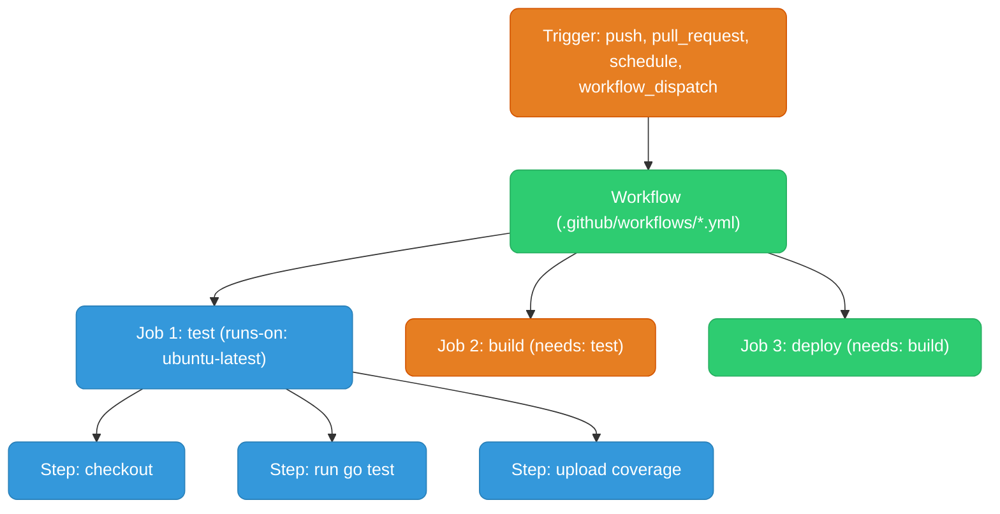
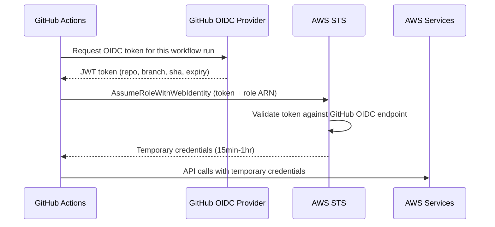

# GitHub Actions

CI/CD pipelines defined as YAML in `.github/workflows/`, triggered by repo events, and run on GitHub-hosted or self-hosted runners.

<div class="quiz-progress" data-quiz-progress>
  <span class="quiz-progress-label">0/0 checks</span>
  <span class="quiz-progress-bar"><span class="quiz-progress-fill"></span></span>
</div>

---

## Concepts



- **Workflow** — a YAML file in `.github/workflows/`. One repo can have many workflows.
- **Job** — a group of steps that run on the same runner. Jobs run in parallel by default; `needs:` makes them sequential.
- **Step** — a single task: `uses` (an action) or `run` (shell command).
- **Runner** — the VM that executes jobs. GitHub-hosted (`ubuntu-latest`, `macos-latest`) or self-hosted.

<div class="quiz-card">
  <p class="quiz-q">By default, do two jobs in the same workflow run in parallel or one after another — and what changes that?</p>
  <button class="quiz-reveal">Reveal answer</button>
  <div class="quiz-a" hidden>Parallel, by default. Adding <code>needs:</code> to a job makes it wait for the referenced job(s) to finish first, turning that pair (or chain) sequential — that's exactly how <code>test</code> &rarr; <code>build</code> &rarr; <code>deploy</code> is wired in the full CI workflow below.</div>
</div>

---

## Full CI Workflow

```yaml
name: CI

on:
  push:
    branches: [main, develop]
  pull_request:
    branches: [main]

env:
  GO_VERSION: "1.23"
  ECR_REPO: 123456789.dkr.ecr.us-east-1.amazonaws.com/my-service

jobs:
  test:
    runs-on: ubuntu-latest
    steps:
      - uses: actions/checkout@v4

      - uses: actions/setup-go@v5
        with:
          go-version: ${{ env.GO_VERSION }}
          cache: true   # caches go module download cache automatically

      - name: Run tests
        run: go test -race -coverprofile=coverage.out ./...

      - name: Upload coverage
        uses: actions/upload-artifact@v4
        with:
          name: coverage
          path: coverage.out

  build:
    runs-on: ubuntu-latest
    needs: test   # only runs if test passes
    outputs:
      image-tag: ${{ steps.meta.outputs.version }}
    steps:
      - uses: actions/checkout@v4

      - name: Extract metadata
        id: meta
        uses: docker/metadata-action@v5
        with:
          images: ${{ env.ECR_REPO }}
          tags: |
            type=sha,prefix=sha-
            type=semver,pattern={{version}}

      - name: Configure AWS credentials via OIDC
        uses: aws-actions/configure-aws-credentials@v4
        with:
          role-to-assume: arn:aws:iam::123456789:role/github-actions-ecr
          aws-region: us-east-1

      - name: Login to ECR
        uses: aws-actions/amazon-ecr-login@v2

      - name: Build and push
        uses: docker/build-push-action@v5
        with:
          push: true
          tags: ${{ steps.meta.outputs.tags }}
          cache-from: type=gha       # GitHub Actions cache for Docker layers
          cache-to: type=gha,mode=max

  deploy:
    runs-on: ubuntu-latest
    needs: build
    environment: production   # requires manual approval if configured in repo settings
    steps:
      - name: Configure AWS credentials
        uses: aws-actions/configure-aws-credentials@v4
        with:
          role-to-assume: arn:aws:iam::123456789:role/github-actions-deploy
          aws-region: us-east-1

      - name: Update ECS service
        run: |
          aws ecs update-service \
            --cluster prod \
            --service my-service \
            --force-new-deployment
```

The three jobs above are chained with `needs:`, so a single workflow run walks through them in a fixed order rather than firing all at once. Step through it:

<div class="stepper">
  <div class="stepper-panels">
    <div class="stepper-panel active">
      <strong>1. Trigger.</strong> A push to <code>main</code>/<code>develop</code>, or a pull request against <code>main</code>, starts the workflow. All three jobs are defined, but only <code>test</code> has no <code>needs:</code> — it's the only one ready to start immediately.
    </div>
    <div class="stepper-panel">
      <strong>2. test runs.</strong> Checks out the code, sets up Go, runs <code>go test -race</code>, uploads the coverage artifact. If any step here fails, the job fails and nothing downstream ever starts.
    </div>
    <div class="stepper-panel">
      <strong>3. build runs (needs: test).</strong> Only begins once <code>test</code> succeeds. Extracts image metadata, assumes an AWS role over OIDC, logs into ECR, then builds and pushes the image using the GitHub Actions layer cache.
    </div>
    <div class="stepper-panel">
      <strong>4. deploy runs (needs: build).</strong> Only begins once <code>build</code> succeeds. Because <code>environment: production</code> is set, this can pause for a manual approval if the repo requires one, then assumes a separate, narrower deploy role and forces a new ECS deployment.
    </div>
  </div>
  <div class="stepper-controls">
    <button class="stepper-prev">← Prev</button>
    <span class="stepper-dots"></span>
    <span class="stepper-label"></span>
    <button class="stepper-next">Next →</button>
  </div>
</div>

<div class="quiz-card">
  <p class="quiz-q">The test job fails. Do build and deploy still run?</p>
  <button class="quiz-reveal">Reveal answer</button>
  <div class="quiz-a" hidden>No. <code>build</code> declares <code>needs: test</code>, so it only starts if <code>test</code> succeeds — and <code>deploy</code> declares <code>needs: build</code>, so it never gets a chance to run either. A failure anywhere in the chain stops everything downstream of it.</div>
</div>

---

## OIDC to AWS (No Long-Lived Keys)

OIDC lets GitHub Actions workflows assume an AWS IAM role without storing AWS access keys as secrets. GitHub mints a short-lived OIDC token per workflow run; AWS STS validates it and returns temporary credentials.



**IAM role trust policy:**

```json
{
  "Statement": [{
    "Effect": "Allow",
    "Principal": {
      "Federated": "arn:aws:iam::123456789:oidc-provider/token.actions.githubusercontent.com"
    },
    "Action": "sts:AssumeRoleWithWebIdentity",
    "Condition": {
      "StringEquals": {
        "token.actions.githubusercontent.com:aud": "sts.amazonaws.com"
      },
      "StringLike": {
        "token.actions.githubusercontent.com:sub": "repo:my-org/my-repo:*"
      }
    }
  }]
}
```

Same handshake, one step at a time:

<div class="stepper">
  <div class="stepper-panels">
    <div class="stepper-panel active">
      <strong>1. Workflow requests a token.</strong> <code>configure-aws-credentials</code> asks GitHub's own OIDC provider for a token scoped to this specific workflow run.
    </div>
    <div class="stepper-panel">
      <strong>2. GitHub mints a short-lived JWT.</strong> It embeds claims like the repo, branch/ref, and commit SHA, and expires quickly. No long-lived secret is involved on GitHub's side at all.
    </div>
    <div class="stepper-panel">
      <strong>3. GitHub calls AssumeRoleWithWebIdentity.</strong> It sends that JWT plus the target role ARN to AWS STS.
    </div>
    <div class="stepper-panel">
      <strong>4. STS validates the token.</strong> AWS checks the JWT's signature against GitHub's OIDC endpoint, then evaluates the role's trust policy conditions (<code>aud</code>, <code>sub</code>) before deciding whether to trust it.
    </div>
    <div class="stepper-panel">
      <strong>5. STS returns temporary credentials.</strong> Valid for somewhere between 15 minutes and an hour, scoped to exactly the permissions on the assumed role.
    </div>
    <div class="stepper-panel">
      <strong>6. The workflow calls AWS with those credentials.</strong> No AWS access key or secret key was ever stored in GitHub — only this run's short-lived token existed, and only briefly.
    </div>
  </div>
  <div class="stepper-controls">
    <button class="stepper-prev">← Prev</button>
    <span class="stepper-dots"></span>
    <span class="stepper-label"></span>
    <button class="stepper-next">Next →</button>
  </div>
</div>

<div class="quiz-card">
  <p class="quiz-q">Why doesn't OIDC require storing any AWS access keys in GitHub secrets?</p>
  <button class="quiz-reveal">Reveal answer</button>
  <div class="quiz-a" hidden>GitHub mints a short-lived JWT per workflow run, and AWS STS exchanges that token — via <code>AssumeRoleWithWebIdentity</code>, after validating it against the role's trust policy — for temporary credentials. There's no long-lived access key that ever needs to exist as a stored secret in the first place.</div>
</div>

---

## Matrix Builds

Run the same job across multiple combinations:

```yaml
jobs:
  test:
    strategy:
      matrix:
        go-version: ["1.21", "1.22", "1.23"]
        os: [ubuntu-latest, macos-latest]
      fail-fast: false   # don't cancel other matrix jobs if one fails
    runs-on: ${{ matrix.os }}
    steps:
      - uses: actions/setup-go@v5
        with:
          go-version: ${{ matrix.go-version }}
      - run: go test ./...
```

<div class="quiz-card">
  <p class="quiz-q">This matrix runs 6 jobs (3 Go versions × 2 OSes) with fail-fast: false. If the ubuntu-latest / 1.21 job fails, what happens to the other five?</p>
  <button class="quiz-reveal">Reveal answer</button>
  <div class="quiz-a" hidden>They keep running. <code>fail-fast: false</code> means one matrix job failing doesn't touch the others. Without it — <code>fail-fast: true</code> is the default — a single failure cancels every other still-running job in the matrix immediately.</div>
</div>

---

## Caching

Two ways to cache Go's module and build cache, same end result:

<div class="tab-group">
  <div class="tab-buttons">
    <button data-tab="manual" class="active">Manual (actions/cache)</button>
    <button data-tab="auto">Automatic (setup-go)</button>
  </div>
  <div class="tab-panels">
    <div class="tab-panel active" data-tab-panel="manual">
      <p>Full control over the cache key and paths &mdash; useful when you need a custom key strategy, or want to cache something <code>setup-go</code> doesn't know about.</p>
      <pre><code># Cache Go modules (keyed by go.sum hash)
- uses: actions/cache@v4
  with:
    path: |
      ~/.cache/go-build
      ~/go/pkg/mod
    key: ${{ runner.os }}-go-${{ hashFiles('**/go.sum') }}
    restore-keys: |
      ${{ runner.os }}-go-</code></pre>
    </div>
    <div class="tab-panel" data-tab-panel="auto">
      <p>Same result, zero cache-key bookkeeping &mdash; <code>setup-go</code> caches Go's module and build caches for you, keyed on <code>go.sum</code> automatically.</p>
      <pre><code># Or just use setup-go with cache: true (handles it automatically)
- uses: actions/setup-go@v5
  with:
    go-version: "1.23"
    cache: true</code></pre>
    </div>
  </div>
</div>

**Docker layer caching:**

```yaml
- uses: docker/build-push-action@v5
  with:
    cache-from: type=gha          # restore from GH Actions cache
    cache-to: type=gha,mode=max   # save all layers (mode=max)
```

---

## Reusable Workflows

Define a workflow once, call it from many others — like a function call for CI pipelines.

```yaml
# .github/workflows/reusable-deploy.yml
on:
  workflow_call:
    inputs:
      environment:
        required: true
        type: string
    secrets:
      DEPLOY_ROLE_ARN:
        required: true

jobs:
  deploy:
    runs-on: ubuntu-latest
    steps:
      - uses: aws-actions/configure-aws-credentials@v4
        with:
          role-to-assume: ${{ secrets.DEPLOY_ROLE_ARN }}
          aws-region: us-east-1
      - run: deploy.sh --env ${{ inputs.environment }}
```

```yaml
# .github/workflows/deploy-prod.yml — caller
jobs:
  deploy:
    uses: ./.github/workflows/reusable-deploy.yml
    with:
      environment: production
    secrets:
      DEPLOY_ROLE_ARN: ${{ secrets.PROD_DEPLOY_ROLE_ARN }}
```

<div class="quiz-card">
  <p class="quiz-q">What line in reusable-deploy.yml itself makes it callable as a reusable workflow, instead of running on its own push/PR triggers?</p>
  <button class="quiz-reveal">Reveal answer</button>
  <div class="quiz-a" hidden><code>on: workflow_call</code>. That's what lets another workflow reference it with <code>uses: ./.github/workflows/reusable-deploy.yml</code> — it doesn't have (or need) its own <code>push</code>/<code>pull_request</code> trigger, and the caller supplies its <code>inputs</code> and <code>secrets</code> directly.</div>
</div>

---

## Useful Patterns

```yaml
# Run only on specific file changes
on:
  push:
    paths:
      - 'src/**'
      - 'go.mod'
      - '!docs/**'   # exclude docs changes

# Concurrency: cancel in-progress runs on same branch
concurrency:
  group: ${{ github.workflow }}-${{ github.ref }}
  cancel-in-progress: true

# Conditional step
- name: Deploy
  if: github.ref == 'refs/heads/main' && github.event_name == 'push'
  run: deploy.sh

# Set output from a step
- id: version
  run: echo "tag=$(git describe --tags)" >> $GITHUB_OUTPUT

- run: echo "Deploying ${{ steps.version.outputs.tag }}"

# Use GitHub secrets
- run: deploy.sh --token ${{ secrets.DEPLOY_TOKEN }}
```
