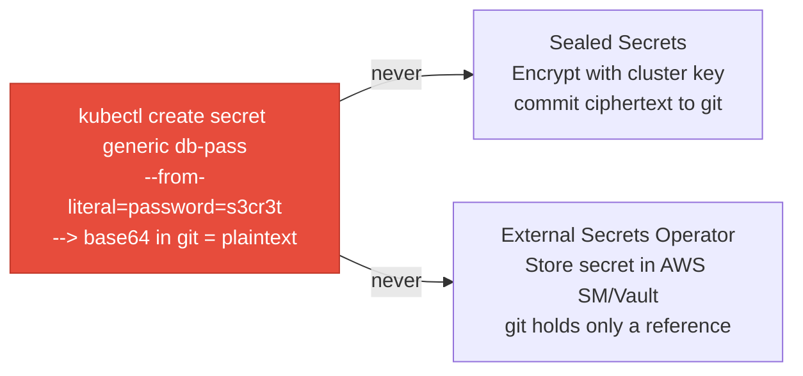
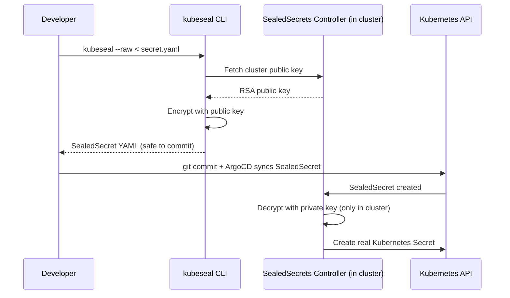
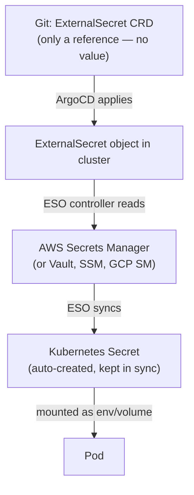

# GitOps Secrets Management

Kubernetes Secrets must not be committed to git in plaintext. Two production-grade approaches: Sealed Secrets (encrypt-in-git) and External Secrets Operator (reference-in-git).

Most sections below end with a quick knowledge check — track your progress as you go:

<div class="quiz-progress" data-quiz-progress>
  <span class="quiz-progress-label">0/0 checks</span>
  <span class="quiz-progress-bar"><span class="quiz-progress-fill"></span></span>
</div>

---

## The Problem



**Base64 is NOT encryption.** A K8s Secret in git is fully readable by anyone with repo access.

<div class="quiz-card">
  <p class="quiz-q">A teammate argues that base64-encoding a Secret before committing it is "safe enough" since it's not human-readable. What's wrong with that reasoning?</p>
  <button class="quiz-reveal">Reveal answer</button>
  <div class="quiz-a" hidden>Base64 is an encoding, not encryption &mdash; no key is involved, so anyone with repo access decodes it with one command (<code>base64 -d</code>). It's exactly as exposed as plaintext to anyone who can read the file; the only thing it hides is the value from a casual glance.</div>
</div>

---

## Sealed Secrets

### How it works



**Key properties:**
- Ciphertext is **cluster-specific** — a secret sealed for cluster A cannot be decrypted by cluster B
- Private key lives only in the cluster (`sealed-secrets-key` Secret in `kube-system`)
- Safe to commit the `SealedSecret` YAML to any git repo, including public repos

<div class="quiz-card">
  <p class="quiz-q">You copy a working SealedSecret YAML from staging's git repo into production's, expecting production's controller to decrypt it. What happens?</p>
  <button class="quiz-reveal">Reveal answer</button>
  <div class="quiz-a" hidden>It fails. Ciphertext from <code>kubeseal</code> is encrypted against one specific cluster's public key &mdash; a SealedSecret sealed for cluster A cannot be decrypted by cluster B's controller, even for identical secret content. Each cluster needs its own seal.</div>
</div>

### Install

```bash
# Install controller via Helm
helm repo add sealed-secrets https://bitnami-labs.github.io/sealed-secrets
helm install sealed-secrets sealed-secrets/sealed-secrets -n kube-system

# Install kubeseal CLI (macOS)
brew install kubeseal
```

### Sealing a secret

```bash
# 1. Create a plain secret YAML (do NOT apply this to cluster)
kubectl create secret generic db-credentials \
  --from-literal=password=s3cr3t \
  --from-literal=username=appuser \
  --dry-run=client -o yaml > secret.yaml

# 2. Seal it (fetches public key from cluster automatically)
kubeseal --format yaml < secret.yaml > sealed-secret.yaml

# 3. Commit sealed-secret.yaml to git — safe!
# ArgoCD syncs it, controller decrypts it into a real Secret

# Seal for a specific namespace (secret is namespace-scoped by default)
kubeseal --namespace production --format yaml < secret.yaml > sealed-secret.yaml
```

### SealedSecret output

```yaml
apiVersion: bitnami.com/v1alpha1
kind: SealedSecret
metadata:
  name: db-credentials
  namespace: production
spec:
  encryptedData:
    password: AgBk3n...  # encrypted, safe to commit
    username: AgCm2p...
  template:
    metadata:
      name: db-credentials
      namespace: production
```

### Key rotation

```bash
# The controller generates a new key every 30 days automatically
# Old keys are retained for decryption of existing secrets

# Manually rotate (emergency — after key compromise)
kubectl -n kube-system delete secret sealed-secrets-key
kubectl -n kube-system rollout restart deployment/sealed-secrets-controller
# All existing SealedSecrets must be re-sealed with the new key!

# Backup the private key (store in a vault, not in git)
kubectl -n kube-system get secret sealed-secrets-key -o yaml > sealed-secrets-key-backup.yaml
```

An emergency rotation isn't instant — it's a sequence, and every existing SealedSecret is broken until the last step completes. Step through it:

<div class="stepper">
  <div class="stepper-panels">
    <div class="stepper-panel active">
      <strong>1. Compromise suspected.</strong> The private key (or something with access to it) may have leaked. Every SealedSecret currently in git was sealed against the key you're about to invalidate.
    </div>
    <div class="stepper-panel">
      <strong>2. Delete the key.</strong> <code>kubectl -n kube-system delete secret sealed-secrets-key</code>. The old keypair is gone from the cluster the moment this runs.
    </div>
    <div class="stepper-panel">
      <strong>3. Restart the controller.</strong> On restart, with no existing key found, the controller generates a brand-new RSA keypair. Every SealedSecret already applied and decrypted into a real Secret keeps working — but nothing new can be sealed against the old public key anymore.
    </div>
    <div class="stepper-panel">
      <strong>4. Re-seal everything.</strong> Every SealedSecret YAML in every git repo was encrypted against the now-deleted public key. Each one must be re-created with <code>kubeseal</code> against the new key and re-committed before it can be applied or updated again.
    </div>
  </div>
  <div class="stepper-controls">
    <button class="stepper-prev">← Prev</button>
    <span class="stepper-dots"></span>
    <span class="stepper-label"></span>
    <button class="stepper-next">Next →</button>
  </div>
</div>

### Limitations
- If the controller's private key is lost, all sealed secrets are unrecoverable
- Rotating the key requires re-sealing all secrets
- Secret values are static — rotation requires a new seal and commit

---

## External Secrets Operator (ESO)

### How it works



**Key difference from Sealed Secrets:** the actual secret value never touches git. Git contains only `ExternalSecret` — a pointer to where the secret lives.

<div class="quiz-card">
  <p class="quiz-q">Someone gets full read access to the git repo holding your ExternalSecret manifests. Have they obtained your database password?</p>
  <button class="quiz-reveal">Reveal answer</button>
  <div class="quiz-a" hidden>No. An <code>ExternalSecret</code> only holds a reference &mdash; the path/key in AWS Secrets Manager (or Vault, SSM) &mdash; never the value itself. They'd need separate IAM/Vault access to the actual secret store to read the real credential.</div>
</div>

### Install

```bash
helm repo add external-secrets https://charts.external-secrets.io
helm install external-secrets external-secrets/external-secrets -n external-secrets --create-namespace
```

### EKS + IRSA pattern (recommended for AWS)

ESO needs permission to read from AWS Secrets Manager. Use IRSA — no static credentials.

```bash
# 1. Create IAM policy for ESO
cat > eso-policy.json << 'EOF'
{
  "Version": "2012-10-17",
  "Statement": [{
    "Effect": "Allow",
    "Action": ["secretsmanager:GetSecretValue", "secretsmanager:DescribeSecret"],
    "Resource": "arn:aws:secretsmanager:us-east-1:123456789:secret:my-app/*"
  }]
}
EOF
aws iam create-policy --policy-name ESO-SecretsManager --policy-document file://eso-policy.json

# 2. Create IAM role with trust policy for ESO service account
eksctl create iamserviceaccount \
  --name external-secrets \
  --namespace external-secrets \
  --cluster my-cluster \
  --attach-policy-arn arn:aws:iam::123456789:policy/ESO-SecretsManager \
  --approve
```

### SecretStore (cluster-scoped)

```yaml
apiVersion: external-secrets.io/v1beta1
kind: ClusterSecretStore
metadata:
  name: aws-secrets-manager
spec:
  provider:
    aws:
      service: SecretsManager
      region: us-east-1
      auth:
        jwt:
          serviceAccountRef:
            name: external-secrets          # the IRSA service account
            namespace: external-secrets
```

### ExternalSecret (commit this to git)

```yaml
apiVersion: external-secrets.io/v1beta1
kind: ExternalSecret
metadata:
  name: db-credentials
  namespace: production
spec:
  refreshInterval: 1h                        # re-sync from AWS SM every hour
  secretStoreRef:
    name: aws-secrets-manager
    kind: ClusterSecretStore
  target:
    name: db-credentials                     # name of the K8s Secret to create
    creationPolicy: Owner                    # ESO owns the secret lifecycle
  data:
    - secretKey: password                    # key in K8s Secret
      remoteRef:
        key: my-app/production/db            # path in AWS Secrets Manager
        property: password                   # JSON key within the secret
    - secretKey: username
      remoteRef:
        key: my-app/production/db
        property: username
```

### Secret rotation (ESO advantage)

```bash
# Update secret in AWS Secrets Manager
aws secretsmanager update-secret \
  --secret-id my-app/production/db \
  --secret-string '{"username":"appuser","password":"n3w_p4ss"}'

# ESO syncs automatically within refreshInterval (default 1h)
# Force immediate refresh:
kubectl annotate externalsecret db-credentials -n production \
  force-sync=$(date +%s) --overwrite
```

No git commit anywhere in this flow — that's the whole point of the ESO sync loop. Step through what actually happens:

<div class="stepper">
  <div class="stepper-panels">
    <div class="stepper-panel active">
      <strong>1. Value changes at the source.</strong> Someone (or an automated rotation Lambda) updates the secret in AWS Secrets Manager. Git and the cluster don't know yet.
    </div>
    <div class="stepper-panel">
      <strong>2. ESO polls on its own schedule.</strong> The controller re-reads the remote value at most once per <code>refreshInterval</code> (default 1h in the example above) — it isn't watching for changes in real time.
    </div>
    <div class="stepper-panel">
      <strong>3. The Kubernetes Secret is rewritten in place.</strong> ESO updates the existing <code>db-credentials</code> Secret with the new value. The <code>ExternalSecret</code> object in git is untouched — it never held the value, so there's nothing in it to change.
    </div>
    <div class="stepper-panel">
      <strong>4. Or skip the wait.</strong> Don't want to sit through step 2's interval? Annotate the <code>ExternalSecret</code> with <code>force-sync=$(date +%s)</code> to trigger an immediate re-sync instead of waiting for the next scheduled poll.
    </div>
  </div>
  <div class="stepper-controls">
    <button class="stepper-prev">← Prev</button>
    <span class="stepper-dots"></span>
    <span class="stepper-label"></span>
    <button class="stepper-next">Next →</button>
  </div>
</div>

---

## Comparison

| | Sealed Secrets | External Secrets Operator |
|--|---------------|--------------------------|
| Secret storage | Encrypted in git | External store (AWS SM, Vault, SSM) |
| Git content | Ciphertext (SealedSecret YAML) | Reference only (ExternalSecret YAML) |
| Rotation | Requires re-seal + git commit | Automatic (ESO re-syncs) |
| Multi-cluster | Each cluster needs its own seal | One ESO + SecretStore per cluster, same SM |
| Key loss risk | Unrecoverable if private key lost | No key — secrets always in SM |
| AWS native | No | Yes (IRSA, SM versioning, rotation) |
| Audit trail | Git history | AWS CloudTrail + SM version history |
| Best for | Simple setups, no external vault | Production EKS, secret rotation needed |

<div class="quiz-card">
  <p class="quiz-q">Which approach carries the risk of secrets becoming permanently unrecoverable if a key is lost — and why doesn't the other one have that risk?</p>
  <button class="quiz-reveal">Reveal answer</button>
  <div class="quiz-a" hidden>Sealed Secrets. If the controller's private key is lost, every SealedSecret ever committed becomes permanently undecryptable, since the ciphertext only means anything relative to that one key. ESO has no equivalent key to lose &mdash; the actual secret data lives in AWS Secrets Manager/Vault, never as an encrypted blob tied to a Kubernetes-side key.</div>
</div>

---

## Decision

Pick the branch that matches your environment:

<div class="toggle-switch">
  <div class="toggle-buttons">
    <button data-toggle-opt="eks" class="active state-ok">New EKS cluster on AWS</button>
    <button data-toggle-opt="airgap" class="state-warn">Air-gapped / no cloud secret store</button>
  </div>
  <div class="toggle-panel active" data-toggle-panel="eks">
    → <strong>ESO + AWS Secrets Manager + IRSA.</strong><br/>
    Secrets rotate without git commits.<br/>
    CloudTrail audits every secret access.<br/>
    IRSA means no static credentials sitting in the cluster.
  </div>
  <div class="toggle-panel" data-toggle-panel="airgap">
    → <strong>Sealed Secrets.</strong><br/>
    Backup the private key offline.<br/>
    Re-seal on key rotation.
  </div>
</div>
