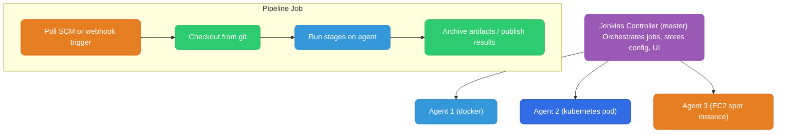

# Jenkins

Each major section below ends with a quick knowledge check — try it before scrolling past.

<div class="quiz-progress" data-quiz-progress>
  <span class="quiz-progress-label">0/0 checks</span>
  <span class="quiz-progress-bar"><span class="quiz-progress-fill"></span></span>
</div>

---

## Architecture



**Key concepts:**
- **Controller** — the Jenkins server: schedules jobs, stores state, serves UI. Never run builds on the controller itself.
- **Agent** — worker nodes where builds actually run. Can be static (always-on EC2) or dynamic (K8s pod spawned per build, deleted when done).
- **Executor** — a slot on an agent. One executor = one concurrent build on that agent.

Same flow, walked through one step at a time instead of all at once:

<div class="stepper">
  <div class="stepper-panels">
    <div class="stepper-panel active">
      <strong>1. Trigger.</strong> A poll-SCM check or an incoming webhook reaches the controller for a configured job.
    </div>
    <div class="stepper-panel">
      <strong>2. Controller dispatches to an agent.</strong> The controller matches the job against an available agent (docker container, Kubernetes pod, or EC2 spot instance) and claims a free executor on it — it never runs the build itself.
    </div>
    <div class="stepper-panel">
      <strong>3. Checkout.</strong> The agent checks out the source from git.
    </div>
    <div class="stepper-panel">
      <strong>4. Run stages.</strong> The pipeline's stages execute on that agent, occupying its claimed executor slot for the duration.
    </div>
    <div class="stepper-panel">
      <strong>5. Archive &amp; report.</strong> Artifacts are archived and results published back to the controller; the executor frees up for the next job.
    </div>
  </div>
  <div class="stepper-controls">
    <button class="stepper-prev">← Prev</button>
    <span class="stepper-dots"></span>
    <span class="stepper-label"></span>
    <button class="stepper-next">Next →</button>
  </div>
</div>

<div class="quiz-card">
  <p class="quiz-q">Why does the controller hand jobs off to agents (docker, Kubernetes pod, EC2 spot) instead of running builds itself?</p>
  <button class="quiz-reveal">Reveal answer</button>
  <div class="quiz-a" hidden>The controller's job is to schedule jobs, store config, and serve the UI — never to run builds. Actual build work always happens on an agent's executor, whichever kind of agent it is, so the controller stays free to keep orchestrating the rest of the cluster.</div>
</div>

---

## Declarative Pipeline

```groovy
pipeline {
    // Where to run — any available agent, or specify label
    agent { label 'docker' }

    // Environment variables available to all stages
    environment {
        APP_NAME = "my-service"
        ECR_REPO = "123456789.dkr.ecr.us-east-1.amazonaws.com/my-service"
    }

    // Build parameters — shown in UI, passed to builds
    parameters {
        string(name: 'ENVIRONMENT', defaultValue: 'staging', description: 'Target environment')
        choice(name: 'REGION', choices: ['us-east-1', 'eu-west-1'], description: 'AWS Region')
        booleanParam(name: 'DRY_RUN', defaultValue: false, description: 'Skip actual deploy')
    }

    stages {
        stage('Build') {
            steps {
                sh 'docker build -t ${APP_NAME}:${BUILD_NUMBER} .'
            }
        }

        stage('Test') {
            steps {
                sh 'go test ./...'
            }
            post {
                always {
                    publishTestResults testResultsPattern: 'test-results/*.xml'
                }
            }
        }

        stage('Deploy') {
            when {
                expression { params.DRY_RUN == false }
            }
            steps {
                sh "deploy.sh --env ${params.ENVIRONMENT} --region ${params.REGION}"
            }
        }
    }

    post {
        success { slackSend message: "Build ${BUILD_NUMBER} succeeded" }
        failure { slackSend message: "Build ${BUILD_NUMBER} FAILED" }
    }
}
```

Execution order for the pipeline above, stepped through:

<div class="stepper">
  <div class="stepper-panels">
    <div class="stepper-panel active">
      <strong>1. Build.</strong> Runs on the agent labeled <code>docker</code>. <code>sh 'docker build -t ${APP_NAME}:${BUILD_NUMBER} .'</code> builds the image.
    </div>
    <div class="stepper-panel">
      <strong>2. Test.</strong> <code>go test ./...</code> runs. Its <code>post { always { ... } }</code> publishes test results whether the tests passed or failed.
    </div>
    <div class="stepper-panel">
      <strong>3. Deploy — conditional.</strong> <code>when { expression { params.DRY_RUN == false } } </code> decides whether this stage runs at all. Set <code>DRY_RUN=true</code> and the stage is skipped outright, not failed.
    </div>
    <div class="stepper-panel">
      <strong>4. Pipeline post block.</strong> Once every stage that was going to run has finished, <code>post { success / failure }</code> fires exactly one of the two and sends a Slack message either way.
    </div>
  </div>
  <div class="stepper-controls">
    <button class="stepper-prev">← Prev</button>
    <span class="stepper-dots"></span>
    <span class="stepper-label"></span>
    <button class="stepper-next">Next →</button>
  </div>
</div>

<div class="quiz-card">
  <p class="quiz-q">A build is triggered with <code>DRY_RUN=true</code>. What happens to the "Deploy" stage?</p>
  <button class="quiz-reveal">Reveal answer</button>
  <div class="quiz-a" hidden>It's skipped entirely — <code>when { expression { params.DRY_RUN == false } }</code> evaluates false, so Jenkins never enters the stage. A skipped stage isn't a failed one: if every stage that did run succeeded, the pipeline's <code>post { success }</code> block still fires.</div>
</div>

---

## Dynamic Variables and Script Block

```groovy
// Set variables during pipeline execution using script block
stage('Get Version') {
    steps {
        script {
            // sh with returnStdout captures output as string
            def gitTag = sh(returnStdout: true, script: 'git describe --tags --abbrev=0').trim()
            def gitSha = sh(returnStdout: true, script: 'git rev-parse --short HEAD').trim()

            // Set as env vars — available to all subsequent stages
            env.APP_VERSION = gitTag ?: "dev-${gitSha}"
            env.DOCKER_TAG  = "${env.APP_VERSION}-${env.BUILD_NUMBER}"
        }
    }
}

stage('Build Image') {
    steps {
        // Use the dynamically set variable
        sh "docker build -t ${ECR_REPO}:${env.DOCKER_TAG} ."
    }
}
```

<div class="quiz-card">
  <p class="quiz-q"><code>gitTag</code> is set with plain <code>def gitTag = sh(...)</code> inside the <code>script</code> block of the "Get Version" stage. Can the "Build Image" stage's steps use <code>gitTag</code> directly?</p>
  <button class="quiz-reveal">Reveal answer</button>
  <div class="quiz-a" hidden>No. A plain Groovy <code>def</code> variable is local to the <code>script</code> block that created it. Only what gets assigned to <code>env.*</code> — here <code>env.APP_VERSION</code> and <code>env.DOCKER_TAG</code> — is available to later stages.</div>
</div>

---

## withCredentials — Secrets Injection

Secrets are stored in Jenkins Credentials store, never in Jenkinsfile. `withCredentials` injects them as env vars, auto-masked in all logs.

```groovy
stage('Deploy to AWS') {
    steps {
        withCredentials([
            // Single string secret (API key, token)
            string(credentialsId: 'SLACK_WEBHOOK', variable: 'SLACK_URL'),

            // Username + password (Docker registry, DB)
            usernamePassword(
                credentialsId: 'ECR_CREDENTIALS',
                usernameVariable: 'AWS_ACCESS_KEY_ID',
                passwordVariable: 'AWS_SECRET_ACCESS_KEY'
            ),

            // SSH key (deploy to server)
            sshUserPrivateKey(
                credentialsId: 'DEPLOY_SSH_KEY',
                keyFileVariable: 'SSH_KEY_FILE'
            )
        ]) {
            sh '''
                aws ecr get-login-password --region us-east-1 | docker login --username AWS --password-stdin $ECR_REPO
                docker push $ECR_REPO:$DOCKER_TAG
            '''
            // $SLACK_URL and AWS credentials are masked in logs — shown as ****
        }
    }
}
```

<div class="quiz-card">
  <p class="quiz-q">A step accidentally runs <code>echo $AWS_SECRET_ACCESS_KEY</code> after it was injected via <code>withCredentials</code>. What shows up in the console log?</p>
  <button class="quiz-reveal">Reveal answer</button>
  <div class="quiz-a" hidden>Not the real secret — Jenkins auto-masks any injected credential value wherever it appears in the log, printing <code>****</code> instead. That masking is exactly why credentials go through <code>withCredentials</code> instead of being hardcoded in the Jenkinsfile.</div>
</div>

---

## Shared Libraries

Shared libraries let you define common functions once and reuse them across all pipelines. Stored in a separate git repo.

```
jenkins-shared-library/
├── vars/
│   ├── deployToECS.groovy     # global function: deployToECS(...)
│   └── runGoTests.groovy      # global function: runGoTests()
└── src/
    └── org/company/
        └── Utils.groovy       # class-based helpers
```

```groovy
// vars/deployToECS.groovy
def call(Map config) {
    def env     = config.environment ?: 'staging'
    def service = config.service
    def image   = config.image

    sh "aws ecs update-service --cluster ${env} --service ${service} --force-new-deployment"
    sh "aws ecs wait services-stable --cluster ${env} --services ${service}"
    echo "Deployed ${image} to ${service} in ${env}"
}
```

```groovy
// Jenkinsfile in any repo — import the shared library
@Library('jenkins-shared-library') _

pipeline {
    agent any
    stages {
        stage('Deploy') {
            steps {
                // Call the shared library function
                deployToECS(
                    environment: 'production',
                    service:     'my-service',
                    image:       "${ECR_REPO}:${env.DOCKER_TAG}"
                )
            }
        }
    }
}
```

<div class="quiz-card">
  <p class="quiz-q">You add a new file <code>vars/runGoTests.groovy</code> with a <code>def call() { ... }</code> inside. How do you invoke it from any Jenkinsfile that imports the library?</p>
  <button class="quiz-reveal">Reveal answer</button>
  <div class="quiz-a" hidden>Just call it like a built-in step — <code>runGoTests()</code>. Every file under <code>vars/</code> becomes a global pipeline function named after the file; its <code>call()</code> method is what runs when that function name is used, the same way <code>deployToECS(...)</code> works for <code>vars/deployToECS.groovy</code>.</div>
</div>

---

## Pipeline Patterns

### Matrix builds (test across multiple versions)

```groovy
stage('Test Matrix') {
    matrix {
        axes {
            axis { name 'GO_VERSION'; values '1.21', '1.22', '1.23' }
            axis { name 'OS'; values 'linux', 'darwin' }
        }
        stages {
            stage('Test') {
                steps {
                    sh "GOOS=${OS} go test ./..."
                }
            }
        }
    }
}
```

### Parallel stages

```groovy
stage('Test and Scan') {
    parallel {
        stage('Unit Tests') { steps { sh 'go test ./...' } }
        stage('Security Scan') { steps { sh 'trivy image ${APP_NAME}:${BUILD_NUMBER}' } }
        stage('Lint') { steps { sh 'golangci-lint run ./...' } }
    }
}
```

### Manual approval gate

```groovy
stage('Deploy to Production') {
    input {
        message "Deploy ${env.APP_VERSION} to production?"
        ok "Deploy"
        parameters {
            string(name: 'DEPLOY_NOTE', defaultValue: '', description: 'Deployment note')
        }
    }
    steps {
        sh "deploy.sh --env prod"
    }
}
```

---

## Jenkins on AWS ECS: Master-Agent Architecture

For the deep-dive into running Jenkins agents as ECS tasks (Fargate + EC2 launch types), including:
- How the inbound agent JNLP protocol works internally
- ECS task provisioning flow (sequence diagrams)
- Scaling mechanics (1 job = 1 ECS task)
- Custom Docker images per job type
- 60% cost reduction and 50% build time improvement breakdown
- Fargate vs EC2 decision matrix, SOCI, Golden AMI, S3 caching

See [ecs-agents.md](./ecs-agents.md).
