# Jenkins Master-Agent on AWS ECS

A deep-dive into how Jenkins ECS agents work internally — the inbound agent protocol, ECS task provisioning, scaling mechanics, and the optimizations that reduced costs 60% and build times from 35 to 18 minutes.

Most sections end with a knowledge check — try to answer before revealing. Track how many you've cleared as you go:

<div class="quiz-progress" data-quiz-progress>
  <span class="quiz-progress-label">0/0 checks</span>
  <span class="quiz-progress-bar"><span class="quiz-progress-fill"></span></span>
</div>

---

## The Problem: Monolithic Jenkins

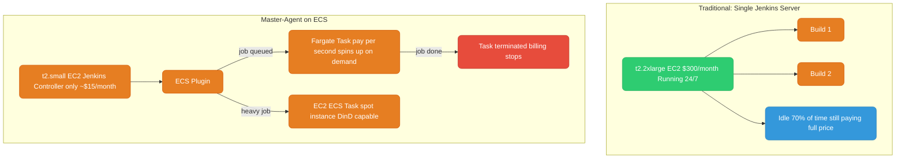

**The shift:** Controller is now just a scheduler — lightweight, small instance. All build work happens on ephemeral ECS tasks that exist only for the duration of the job.

<div class="quiz-card">
  <p class="quiz-q">In the master-agent model, is the Jenkins controller still where builds actually execute?</p>
  <button class="quiz-reveal">Reveal answer</button>
  <div class="quiz-a" hidden>No. The controller drops to a t2.small (~$15/month) and only schedules work &mdash; it's the ECS tasks (Fargate or EC2) that run the actual build. Those tasks are ephemeral: they spin up per job and terminate when the job's done, so you stop paying for the "idle 70% of the time" problem the monolithic setup had.</div>
</div>

---

## How the Inbound Agent Works Internally

This is the most important thing to understand. The connection is **agent-initiated**, not controller-initiated.

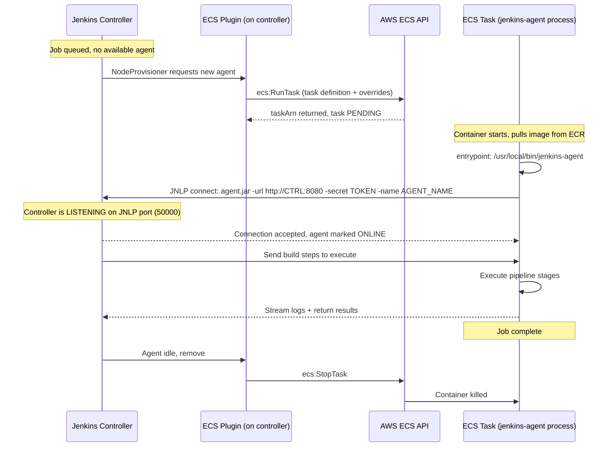

**Key internal details:**

- `agent.jar` (inside the container) connects **outbound** to the controller on the JNLP port (default 50000, configurable). The controller never SSH-es into the agent.
- The controller creates a **secret token** per agent. The agent presents this token on connection — authentication.
- Agent name format: `{label}-{job-name}-{build-number}-{5-random-chars}` e.g. `fargate-my-app-build-17-a3f2b`
- The "agent is offline" message in console is **normal** — it appears while the ECS task is still starting. Jenkins suspends the build executor and resumes when the agent connects.

**Why outbound connection matters for ECS:**
The controller doesn't need to reach the agent's IP. The agent reaches out to the controller. This means agents can be in private subnets with no inbound rules from the controller — only the controller needs an inbound rule on port 50000 from the agent's security group.

Same lifecycle, one step at a time:

<div class="stepper">
  <div class="stepper-panels">
    <div class="stepper-panel active">
      <strong>1. Job queued, no agent.</strong> <code>NodeProvisioner</code> notices a queued job with nothing to run it and asks the ECS plugin for a new agent.
    </div>
    <div class="stepper-panel">
      <strong>2. RunTask called.</strong> The plugin calls <code>ecs:RunTask</code> with the task definition and any overrides. ECS returns a <code>taskArn</code> immediately &mdash; the task is <code>PENDING</code>, nothing is running yet.
    </div>
    <div class="stepper-panel">
      <strong>3. Container starts, agent dials out.</strong> The container pulls its image from ECR and runs <code>/usr/local/bin/jenkins-agent</code>, which launches <code>agent.jar</code> and connects <strong>outbound</strong> to the controller's JNLP port, presenting its per-agent secret token.
    </div>
    <div class="stepper-panel">
      <strong>4. Controller accepts, build runs.</strong> The controller marks the agent <code>ONLINE</code>, sends it the pipeline steps, and streams logs back while the task executes them.
    </div>
    <div class="stepper-panel">
      <strong>5. Teardown.</strong> Once the controller sees the agent go idle, the plugin calls <code>ecs:StopTask</code>. ECS kills the container and per-second billing stops.
    </div>
  </div>
  <div class="stepper-controls">
    <button class="stepper-prev">← Prev</button>
    <span class="stepper-dots"></span>
    <span class="stepper-label"></span>
    <button class="stepper-next">Next →</button>
  </div>
</div>

<div class="quiz-card">
  <p class="quiz-q">Does the Jenkins controller connect out to the ECS agent, or does the agent connect to the controller?</p>
  <button class="quiz-reveal">Reveal answer</button>
  <div class="quiz-a" hidden>The agent connects to the controller &mdash; <code>agent.jar</code> inside the container makes an outbound connection to the controller's JNLP port (default 50000). The controller never SSHes or reaches into the agent's IP. That's why agents can sit in private subnets with no inbound rules of their own; only the controller needs an inbound rule open for traffic from the agent's security group.</div>
</div>

---

## ECS Fargate: Full Provisioning Flow

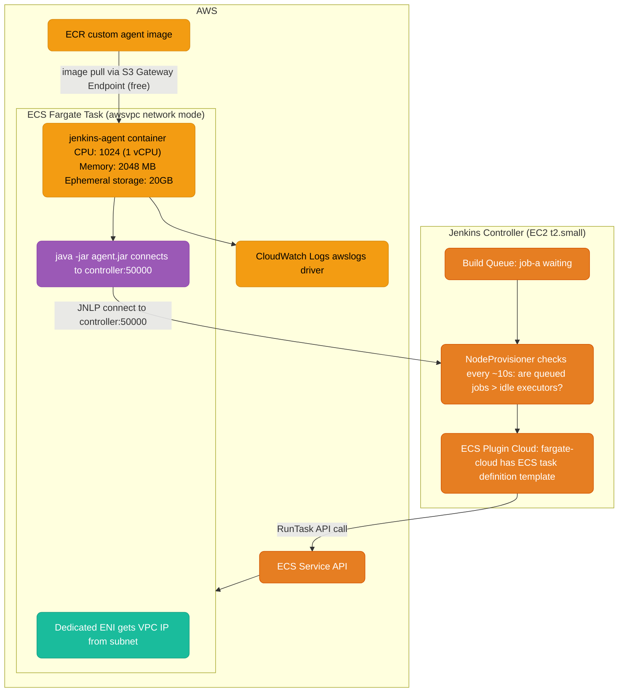

**Fargate specifics:**
- Network mode **must be `awsvpc`** — each task gets its own ENI and VPC IP
- No privileged mode — cannot mount `/var/run/docker.sock`. No DinD.
- AWS manages the underlying EC2 host — you never see it, patch it, or worry about it
- Billing: per-second from when task enters RUNNING state to when it stops
- Cold start: image pull (mitigated by SOCI) + JVM startup = typically 30-90 seconds

<div class="quiz-card">
  <p class="quiz-q">Can a Fargate agent do Docker-in-Docker by mounting /var/run/docker.sock like an EC2 agent does?</p>
  <button class="quiz-reveal">Reveal answer</button>
  <div class="quiz-a" hidden>No. Fargate doesn't support privileged mode, and mounting the Docker socket requires it. There's no underlying host to expose a socket from anyway &mdash; AWS manages it and you never see it. DinD is an EC2-launch-type-only capability here.</div>
</div>

---

## ECS EC2 Launch Type: How It Differs

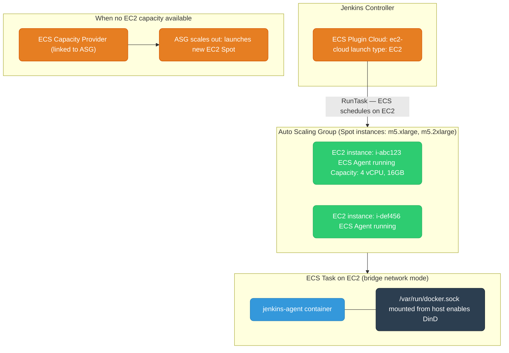

**EC2 launch type specifics:**
- Network mode is **`bridge`** (or `host`) — NOT `awsvpc`. Container shares the host's network namespace.
- **DinD works** because you mount `/var/run/docker.sock` from the EC2 host into the container via Container Mount Points in the ECS task definition.
- When no EC2 capacity is available, the ECS Capacity Provider triggers the ASG to launch a new instance. This is a **two-stage cold start**: EC2 boot time (~2 min) + image pull + JVM startup. This is why the Golden AMI matters — pre-baked tools eliminate the install time.
- Underlying EC2 instances are **yours to manage**: patching, AMI updates, instance type selection.

**DinD mount in task definition:**
```json
{
  "mountPoints": [{
    "sourceVolume": "docker-sock",
    "containerPath": "/var/run/docker.sock"
  }],
  "volumes": [{
    "name": "docker-sock",
    "host": { "sourcePath": "/var/run/docker.sock" }
  }]
}
```

<div class="quiz-card">
  <p class="quiz-q">When there's no spare EC2 capacity in the cluster for a queued job, why does the cold start take so much longer than Fargate's?</p>
  <button class="quiz-reveal">Reveal answer</button>
  <div class="quiz-a" hidden>It's a two-stage cold start: the ECS Capacity Provider has to signal the ASG to launch a brand-new EC2 Spot instance first (~2 minutes to boot), and only then does image pull + JVM startup happen on top of that. Fargate skips the boot stage entirely because AWS already manages the compute. A Golden AMI with pre-baked tools shrinks the second stage, but can't remove the EC2 boot time itself.</div>
</div>

---

## Scaling: How 1 Job = 1 Agent Works

Each queued job that needs a new agent results in one `ecs:RunTask` API call. There is no shared pool — agents are created on demand, one per job.

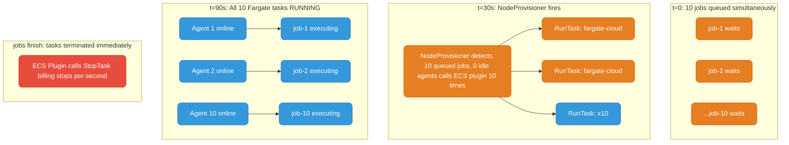

**Fargate scaling:** Effectively unlimited concurrency. AWS allocates the underlying compute — you never provision or manage hosts. 10 jobs or 100 jobs: each gets its own Fargate task.

**EC2 scaling (two-stage):**
1. ECS tries to place the task on existing EC2 instances in the cluster
2. If no capacity → Capacity Provider signals the ASG → ASG launches new EC2 Spot instance → EC2 boots (~2 min) → ECS agent on EC2 registers → task placed → container starts

**Max concurrent agents:** Controlled in the ECS plugin by "Restrict max number of agents". Setting 0 = unlimited. Setting 20 = queue builds beyond 20 until an agent frees up.

**NodeProvisioner tuning** (reduces queue wait time):
```
-Dhudson.slaves.NodeProvisioner.initialDelay=0
-Dhudson.slaves.NodeProvisioner.MARGIN=50
-Dhudson.slaves.NodeProvisioner.MARGIN0=0.85
```
These JVM flags make the provisioner react faster to queued jobs instead of waiting for the standard smoothing interval.

The diagram above packs all four moments into one picture — step through them instead:

<div class="stepper">
  <div class="stepper-panels">
    <div class="stepper-panel active">
      <strong>1. t=0.</strong> 10 jobs queue up simultaneously. 0 idle executors are available for any of them.
    </div>
    <div class="stepper-panel">
      <strong>2. t≈30s.</strong> <code>NodeProvisioner</code> fires, sees 10 queued jobs against 0 idle agents, and calls the ECS plugin's <code>RunTask</code> once <strong>per job</strong> &mdash; 10 separate API calls, no batching, no shared pool.
    </div>
    <div class="stepper-panel">
      <strong>3. t≈90s.</strong> All 10 Fargate tasks reach <code>RUNNING</code>. Each one connects its own agent and starts executing its own job independently.
    </div>
    <div class="stepper-panel">
      <strong>4. Jobs finish.</strong> Each task's <code>StopTask</code> fires the moment <em>that</em> job is done &mdash; not when all 10 finish. Billing stops per task, per second, independently.
    </div>
  </div>
  <div class="stepper-controls">
    <button class="stepper-prev">← Prev</button>
    <span class="stepper-dots"></span>
    <span class="stepper-label"></span>
    <button class="stepper-next">Next →</button>
  </div>
</div>

<div class="quiz-card">
  <p class="quiz-q">10 jobs queue up at once on Fargate. Do they share a pool of pre-warmed agents, or does each one get its own?</p>
  <button class="quiz-reveal">Reveal answer</button>
  <div class="quiz-a" hidden>Each gets its own. There's no shared pool &mdash; every queued job that needs an agent results in one independent <code>ecs:RunTask</code> call, so 10 queued jobs mean 10 RunTask calls and 10 separate Fargate tasks. On Fargate that scales effectively without limit since AWS allocates the compute; on EC2 it's bounded by how fast the ASG can scale out.</div>
</div>

---

## Custom Images Per Job Type

The ECS plugin's task definition template acts as a base. Any Jenkinsfile can override the image at runtime.

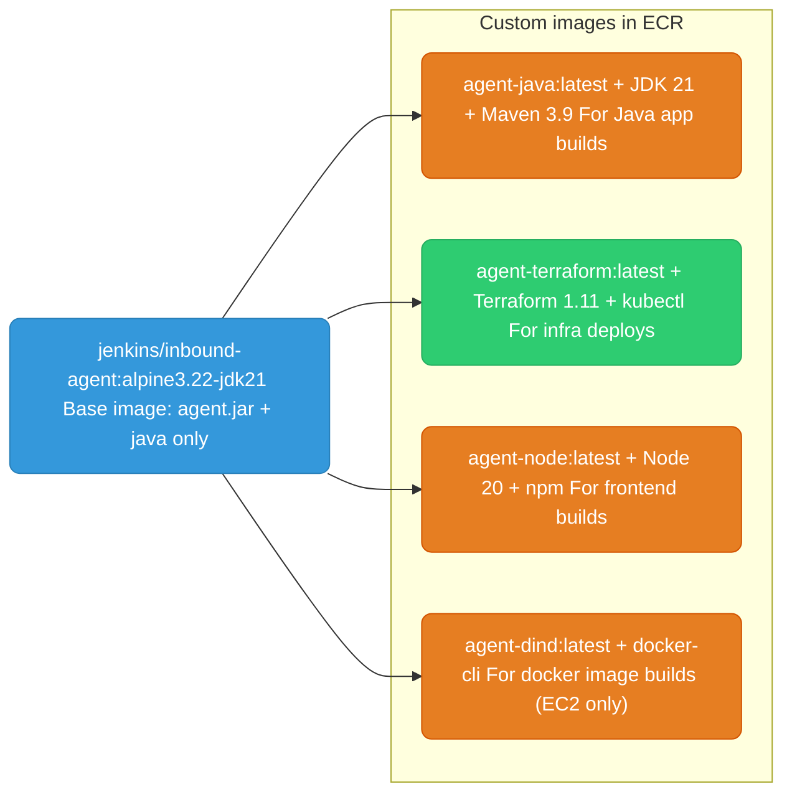

**Jenkinsfile image override:**
```groovy
// Use base template but override the image for this specific job
pipeline {
    agent {
        ecs {
            inheritFrom 'fargate-cloud'       // inherits CPU, memory, network config
            image '123456789.dkr.ecr.us-east-1.amazonaws.com/agent-java:latest'
        }
    }
    stages {
        stage('Build') {
            steps {
                sh 'mvn clean package -DskipTests'
            }
        }
    }
}
```

**Dockerfile pattern — multi-stage to minimize image size:**
```dockerfile
ARG ALPINE_VERSION=3.22
ARG JDK_VERSION=jdk21

# Stage 1: builder — install tools, compile, download deps
FROM jenkins/inbound-agent:alpine${ALPINE_VERSION}-${JDK_VERSION} AS builder
USER root
RUN apk add --no-cache curl unzip git

# Install terraform
RUN curl -fsSL -o /tmp/tf.zip https://releases.hashicorp.com/terraform/1.11.0/terraform_1.11.0_linux_amd64.zip \
    && unzip /tmp/tf.zip -d /usr/bin && rm /tmp/tf.zip

# Stage 2: runtime — copy only the final binaries, not build tools
FROM jenkins/inbound-agent:alpine${ALPINE_VERSION}-${JDK_VERSION}
USER root
COPY --from=builder /usr/bin/terraform /usr/bin/terraform
COPY --from=builder /usr/local/bin/kubectl /usr/local/bin/kubectl
USER jenkins
ENTRYPOINT ["/usr/local/bin/jenkins-agent"]
```

**If using a non-Jenkins base image**, you must copy the agent binaries from `inbound-agent`:
```dockerfile
FROM jenkins/inbound-agent:alpine3.22-jdk21 AS jnlp
FROM ubuntu:22.04

COPY --from=jnlp /usr/local/bin/jenkins-agent /usr/local/bin/jenkins-agent
COPY --from=jnlp /usr/share/jenkins/agent.jar  /usr/share/jenkins/agent.jar
COPY --from=jnlp /usr/share/jenkins/slave.jar  /usr/share/jenkins/slave.jar

ENTRYPOINT ["/usr/local/bin/jenkins-agent"]
```

<div class="quiz-card">
  <p class="quiz-q">To use a different container image for a Terraform job vs a Maven job, do you need a separate ECS Plugin Cloud configured for each?</p>
  <button class="quiz-reveal">Reveal answer</button>
  <div class="quiz-a" hidden>No. <code>inheritFrom</code> in the Jenkinsfile keeps the base cloud's CPU, memory, and network config, while <code>image</code> overrides just the container image for that one job. The task definition template is a base, not a hard requirement &mdash; any Jenkinsfile can point at a different ECR image on top of it.</div>
</div>

---

## Agent Reuse (Avoid Cold Start on Every Build)

By default, the ECS plugin creates a new task per build and terminates it when done. You can reuse a running agent within a time window.

<div class="tab-group">
  <div class="tab-buttons">
    <button data-tab="fresh" class="active">New task per build (default)</button>
    <button data-tab="reuse">Reuse via label</button>
  </div>
  <div class="tab-panels">
    <div class="tab-panel active" data-tab-panel="fresh">
      <pre><code>agent {
    ecs {
        inheritFrom 'fargate-cloud'
        image '...ecr.../agent-java:latest'
    }
}</code></pre>
      Every build gets a brand-new ECS task and pays the full cold start &mdash; image pull, JVM startup, JNLP connect &mdash; even if the previous build's agent just terminated seconds ago.
    </div>
    <div class="tab-panel" data-tab-panel="reuse">
      <pre><code>agent {
    label 'fargate-cloud'
}</code></pre>
      If an agent from a previous build is still alive under this label (within the task idle timeout), Jenkins assigns the next build to it directly &mdash; no <code>ecs:RunTask</code> call, no cold start at all.
    </div>
  </div>
</div>

With `label`, if an agent from a previous build is still alive (within the task idle timeout), Jenkins assigns the next build to it directly — no ECS RunTask call, no cold start. The task idle timeout in the ECS plugin config controls how long an idle agent stays alive waiting for the next job.

<div class="quiz-card">
  <p class="quiz-q">Switching a job's agent block from the ecs {} form to agent { label 'fargate-cloud' } &mdash; does that guarantee a fresh ECS task every time?</p>
  <button class="quiz-reveal">Reveal answer</button>
  <div class="quiz-a" hidden>No, the opposite. <code>label</code> is what enables reuse: if an agent from a previous build under that label is still alive within the idle timeout, Jenkins hands the build straight to it &mdash; no RunTask call, no cold start. A fresh task only gets provisioned if nothing reusable is currently alive.</div>
</div>

---

## Networking: Security Group Requirements

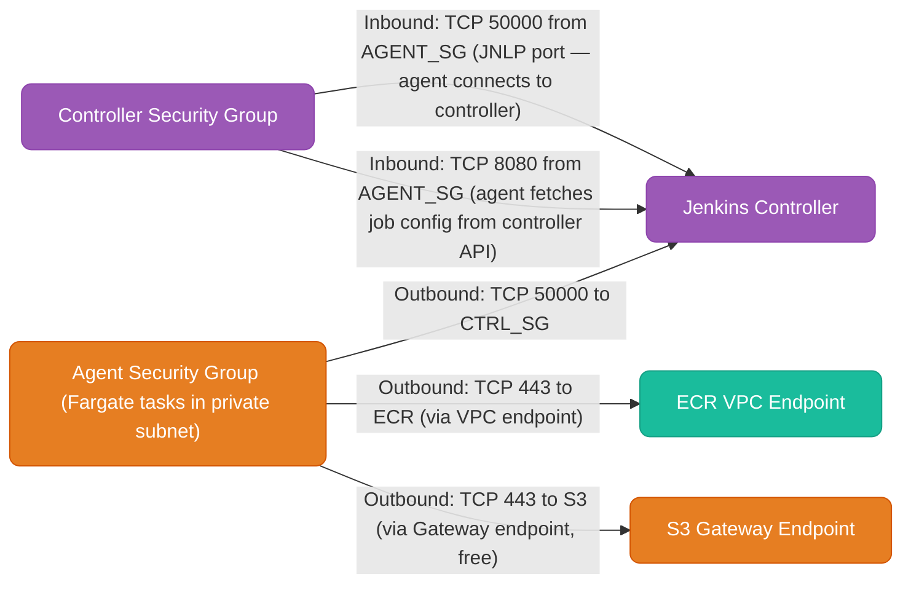

**Common misconfiguration (90% of issues):** The JNLP port on the controller's security group is not open to the agent's security group. The agent starts, tries to connect, fails silently — you see "agent is offline" forever.

**Controller tunnel config:** In the ECS plugin cloud settings:
- `Tunnel connection through`: private IP of controller (e.g. `10.0.1.50:50000`)
- `Alternative Jenkins URL`: `http://10.0.1.50:8080` (private, not public URL)

<div class="quiz-card">
  <p class="quiz-q">The JNLP port needs an inbound security group rule somewhere. Is it on the controller's SG or the agent's SG?</p>
  <button class="quiz-reveal">Reveal answer</button>
  <div class="quiz-a" hidden>The controller's SG needs the inbound rule &mdash; TCP 50000 from the agent's SG. Since the agent initiates the connection outbound, the agent's SG needs no inbound rule from the controller at all. Missing this on the controller side is the single most common misconfiguration: the agent starts, tries to connect, fails silently, and you just see "agent is offline" forever with no obvious error.</div>
</div>

---

## Optimizations That Achieved 60% Cost Reduction

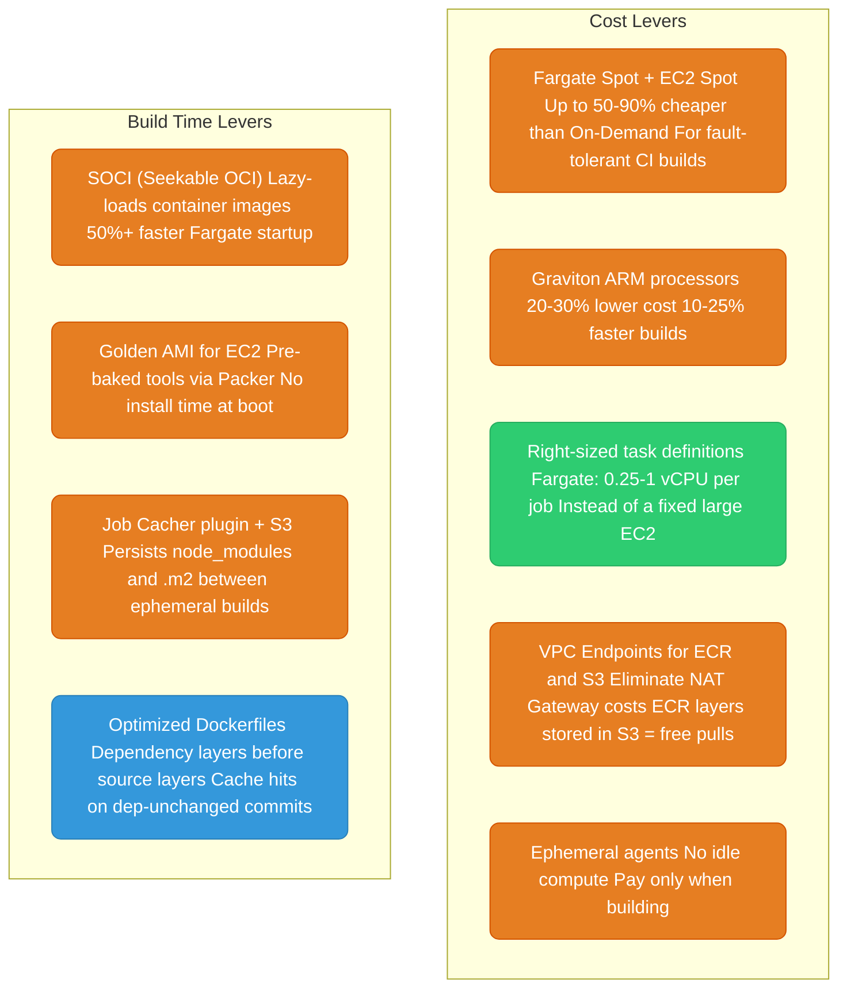

**VPC Endpoint impact (biggest networking saving):**
```
Without VPC endpoints (ECR image pulls via NAT):
  100 builds/day × 500MB image = 50GB/day × $0.045/GB = $2.25/day = $821/year

With VPC endpoints:
  ECR Interface Endpoint: ~$7/month
  S3 Gateway Endpoint: free (ECR layers are in S3)
  Net saving: ~$750/year just from image pulls
```

---

## Groovy-as-Glue: Controller Load Anti-Pattern

Every Groovy function in a Jenkinsfile that isn't inside a `sh` step runs on the **controller**. For heavy processing, this degrades the controller for everyone.

```groovy
// ANTI-PATTERN: runs on controller, consumes controller heap + CPU
stage('Get Version') {
    steps {
        script {
            def content = readFile 'package.json'                          // controller reads file
            def pkg = new groovy.json.JsonSlurper().parseText(content)    // controller parses JSON
            env.APP_VERSION = pkg.version
        }
    }
}

// BEST PRACTICE: runs entirely on agent, only the final string sent to controller
stage('Get Version') {
    steps {
        script {
            env.APP_VERSION = sh(
                script: "jq -r '.version' package.json",   // agent runs jq
                returnStdout: true
            ).trim()
        }
    }
}
```

**Rule:** Use Groovy only as "glue" — control flow, variable assignment, calling `sh`. All actual data processing, file reading, API calls should be shell commands running on the agent.

---

## Fargate vs EC2 Agents: Decision Matrix

| Concern | Fargate | EC2 Launch Type |
|---------|---------|-----------------|
| Docker daemon access (DinD) | No (no privileged mode) | Yes (mount docker.sock) |
| Cold start time | 30-90s (SOCI reduces to 15-30s) | 2-5min (Golden AMI: 60-90s) |
| Scaling | Instant, unlimited | Bounded by ASG scale-out speed |
| Infrastructure management | None (AWS manages hosts) | You manage EC2 fleet, patching, AMI |
| Spot savings | ~50% via FARGATE_SPOT | ~70-90% via EC2 Spot |
| Privileged containers | Not supported | Supported |
| Network mode | awsvpc only | bridge or host |
| Best for | Standard CI: compile, test, lint, deploy | Docker builds, resource-intensive compilations |

**Hybrid approach (what was implemented):**
- Fargate: default for all standard jobs — testing, linting, terraform deploys, kubectl applies
- EC2: only for jobs that need DinD (building Docker images) or require very high CPU/memory
- Fargate Spot: dev environment builds, non-critical jobs, any job with retry on failure

---

## IAM Requirements

Two distinct IAM roles are needed. Getting these wrong is the second most common failure point after security groups.

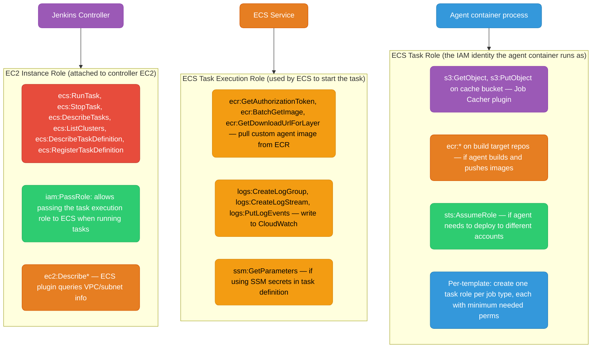

**Task execution role vs task role:**
- **Task execution role** — used by ECS infrastructure to bootstrap the container (pull image, write logs). Your code never touches this.
- **Task role** — the identity your `jenkins-agent` process assumes. This is what `aws s3 cp`, `terraform apply`, `kubectl apply` etc. use inside the build.

**Per-job least privilege:** Create multiple ECS agent templates in the plugin, each with a different task role ARN:

```groovy
// Deploy job — needs S3 and ECS perms
agent {
    ecs {
        inheritFrom 'fargate-cloud'
        taskrole 'arn:aws:iam::123456789:role/jenkins-agent-deploy'
    }
}

// Test job — needs only S3 for cache, nothing else
agent {
    ecs {
        inheritFrom 'fargate-cloud'
        taskrole 'arn:aws:iam::123456789:role/jenkins-agent-test'
    }
}
```

Minimum controller instance role policy:
```json
{
  "Statement": [
    {
      "Effect": "Allow",
      "Action": [
        "ecs:RunTask", "ecs:StopTask", "ecs:DescribeTasks",
        "ecs:ListClusters", "ecs:DescribeContainerInstances",
        "ecs:DescribeTaskDefinition", "ecs:RegisterTaskDefinition",
        "ecs:ListTaskDefinitions"
      ],
      "Resource": "*"
    },
    {
      "Effect": "Allow",
      "Action": "iam:PassRole",
      "Resource": [
        "arn:aws:iam::123456789:role/jenkins-agent-task-exec-role",
        "arn:aws:iam::123456789:role/jenkins-agent-*"
      ]
    }
  ]
}
```

---

## Workspace Caching: EFS vs S3

Your original setup used EFS for caching. There are two valid patterns — choose based on access pattern.

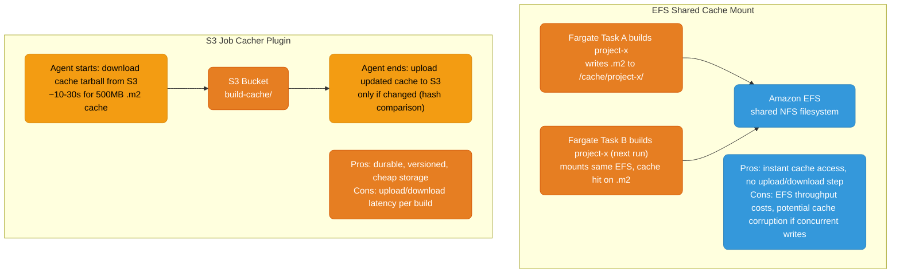

**EFS mount in Fargate task definition:**
```json
{
  "volumes": [{
    "name": "build-cache",
    "efsVolumeConfiguration": {
      "fileSystemId": "fs-abc12345",
      "rootDirectory": "/jenkins-cache",
      "transitEncryption": "ENABLED"
    }
  }],
  "mountPoints": [{
    "sourceVolume": "build-cache",
    "containerPath": "/home/jenkins/.m2"
  }]
}
```

**S3 Job Cacher (Jenkinsfile):**
```groovy
// Requires: Job Cacher plugin + s3-jobcacher-storage-plugin
stage('Build') {
    steps {
        cache(maxCacheSize: 500, caches: [
            [$class: 'ArbitraryFileCache',
             path: '/home/jenkins/.m2/repository',
             cacheValidityDecidingFile: 'pom.xml',
             compressionMethod: 'TARGZ']
        ]) {
            sh 'mvn clean package'
        }
    }
}
```

**When to use which:**
| | EFS | S3 Job Cacher |
|--|-----|--------------|
| Cache size | Any (NFS mount) | Up to ~2GB practical |
| Latency | Instant (network mount) | 10-60s download per build |
| Cost | ~$0.30/GB/month + throughput | ~$0.023/GB/month + tiny transfer |
| Concurrent builds | Risk of corruption without locking | Safe (separate per-job cache key) |
| Best for | Large caches (>1GB), many daily builds | Standard Maven/npm caches |

**Important:** EFS is fine for the agent cache mount. It is **not** suitable for `$JENKINS_HOME` on a busy controller (write-heavy random I/O). Use EBS for the controller home directory.

---

## Observability: Debugging Failed ECS Agents

When an agent fails to come online or a build mysteriously dies, this is the investigation path.

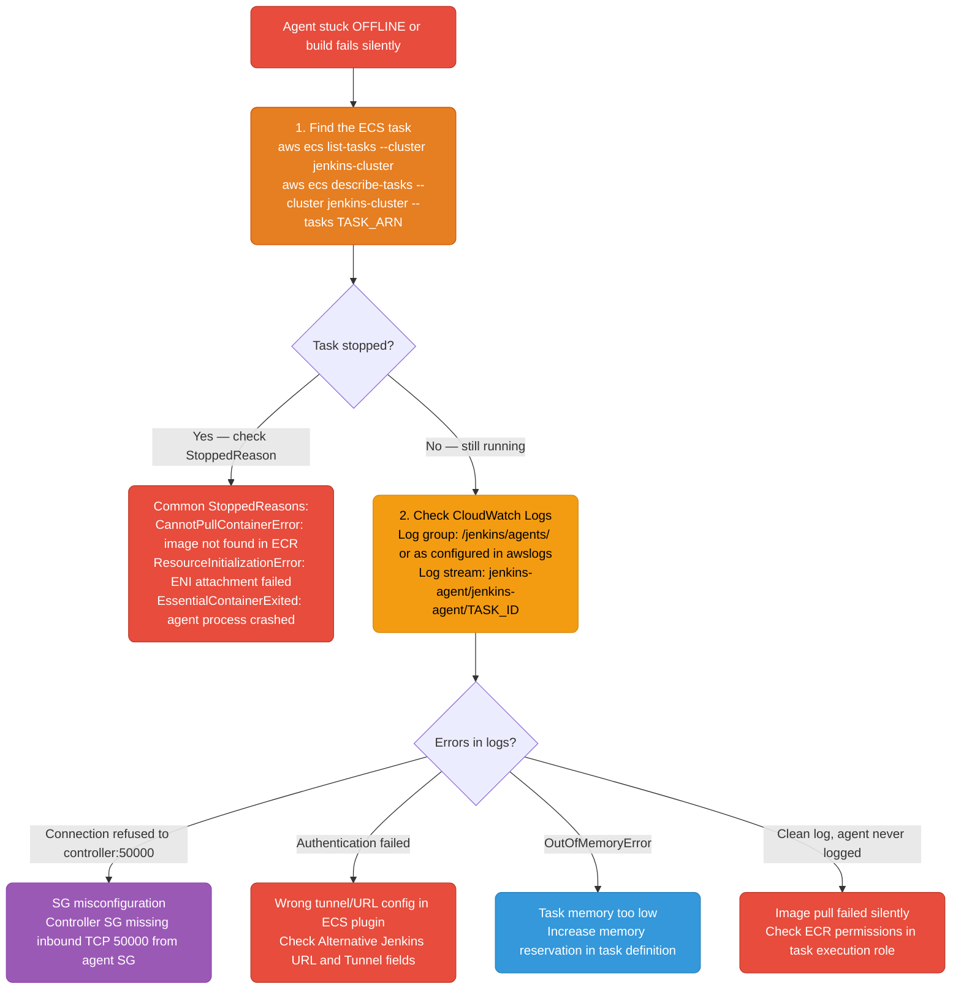

**CLI debugging commands:**
```bash
# 1. List running tasks in your cluster
aws ecs list-tasks --cluster jenkins-cluster --region us-east-1

# 2. Get details including StoppedReason
aws ecs describe-tasks   --cluster jenkins-cluster   --tasks arn:aws:ecs:us-east-1:123456789:task/jenkins-cluster/abc123   --region us-east-1   --query 'tasks[0].{status:lastStatus,stopped:stoppedReason,containers:containers[*].{name:name,reason:reason,exit:exitCode}}'

# 3. Fetch logs for a specific task
aws logs get-log-events   --log-group-name /jenkins/agents   --log-stream-name "jenkins-agent/jenkins-agent/abc123def456"   --region us-east-1

# 4. Correlate Jenkins build to ECS task
# Agent name in Jenkins console: fargate-my-app-17-a3f2b
# ECS task tags set by plugin include the agent name — search by tag:
aws ecs list-tasks --cluster jenkins-cluster   --filter "tag:JenkinsAgentName=fargate-my-app-17-a3f2b"
```

**CloudWatch Logs Insights query for failed agents:**
```
fields @timestamp, @message
| filter @logStream like /jenkins-agent/
| filter @message like /ERROR|Exception|refused|failed/
| sort @timestamp desc
| limit 50
```

**Enable Execute Command (ECS Exec) for live debugging:**
```bash
# SSH-equivalent into a running Fargate task
aws ecs execute-command   --cluster jenkins-cluster   --task TASK_ARN   --container jenkins-agent   --interactive   --command "/bin/sh"
# Requires: EnableExecuteCommand=true in task definition (already set in plugin config)
```

---

## Fargate Spot Interruption Handling

AWS can reclaim Fargate Spot capacity with a 2-minute warning. If this happens mid-build, the job fails and needs to retry.

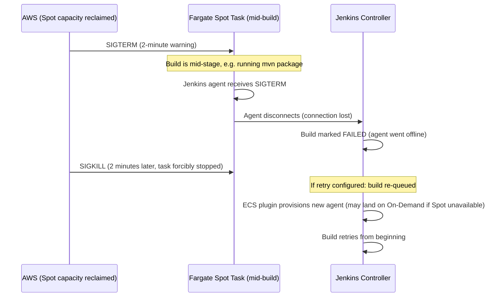

**Capacity provider fallback strategy (recommended):**
```json
{
  "capacityProviderStrategy": [
    {
      "capacityProvider": "FARGATE_SPOT",
      "weight": 3,
      "base": 0
    },
    {
      "capacityProvider": "FARGATE",
      "weight": 1,
      "base": 0
    }
  ]
}
```
This runs 75% of tasks on Spot, falls back to On-Demand when Spot capacity is unavailable. ECS makes this decision automatically per `RunTask` call.

**Making pipelines tolerant of Spot interruption:**
```groovy
pipeline {
    options {
        // Retry the entire pipeline up to 2 times on agent failure
        retry(2)
        // Timeout the whole build — prevents runaway retries
        timeout(time: 1, unit: 'HOURS')
    }
    agent {
        ecs {
            inheritFrom 'fargate-spot-cloud'
        }
    }
    stages {
        stage('Build') {
            steps {
                // Make stages idempotent — safe to re-run
                sh 'mvn clean package -DskipTests'
            }
        }
        stage('Test') {
            steps {
                // Use S3 cache so re-run doesn't re-download deps
                sh 'mvn test'
            }
        }
    }
    post {
        always {
            // Clean workspace — next retry starts clean
            deleteDir()
        }
    }
}
```

**Jobs NOT suitable for Fargate Spot:**
- Builds that take >45 min (higher interruption risk)
- Jobs with side effects that aren't idempotent (e.g., deploy to production — use On-Demand or EC2)
- Jobs that upload large artifacts mid-build and can't resume

**Jobs ideal for Fargate Spot:**
- Unit tests, integration tests
- Linting, security scans
- Development branch builds
- Any job where "just retry it" is acceptable
