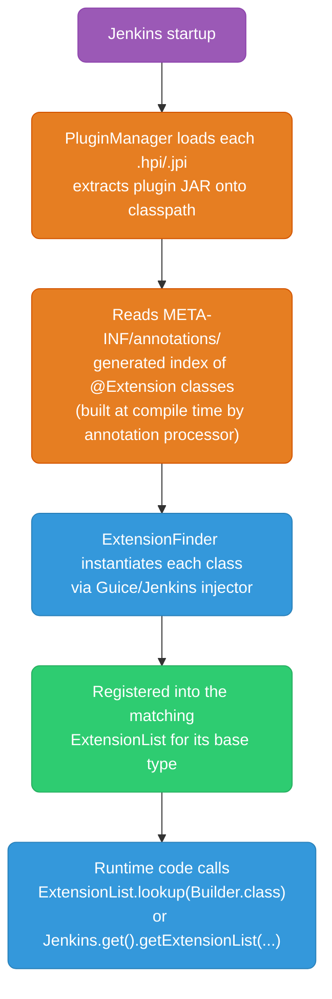
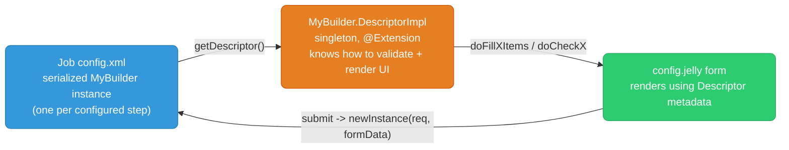
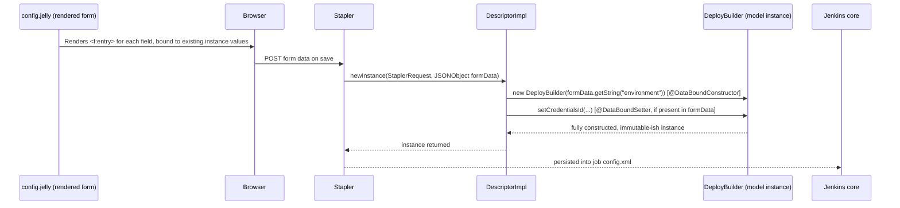
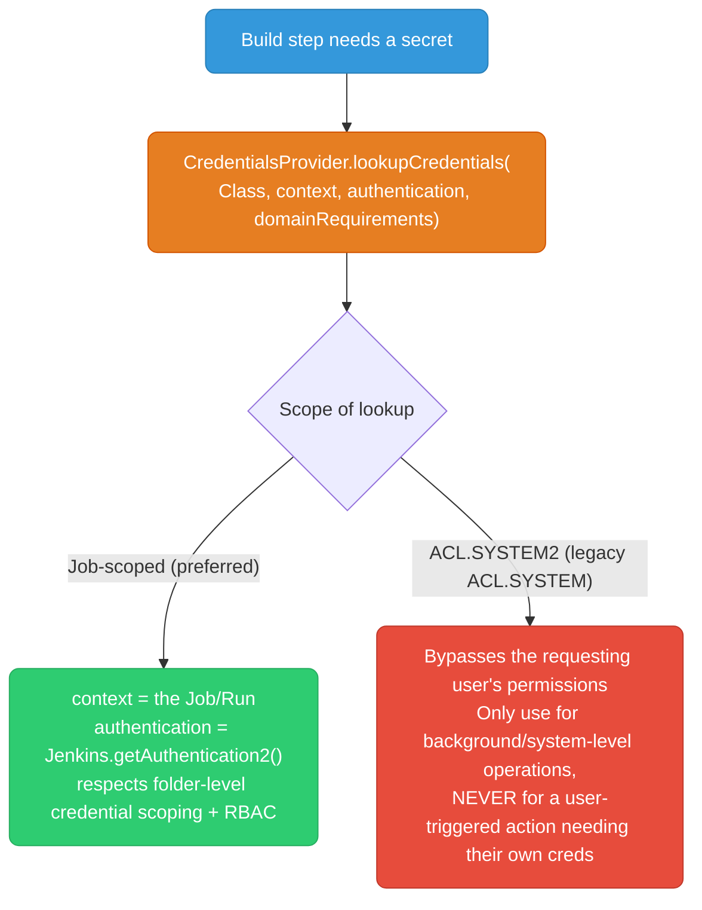
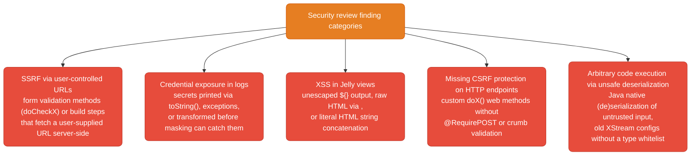
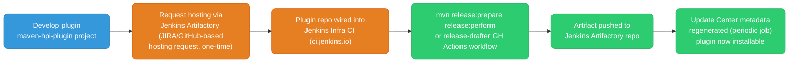

# Jenkins Plugin Development

Extension points, the Descriptor pattern, Stapler data-binding, credential handling, background tasks, security review process, testing, and publishing to the Update Center.

Most sections below end with a **❓ knowledge check** — track how many you've cleared as you go:

<div class="quiz-progress" data-quiz-progress>
  <span class="quiz-progress-label">0/0 checks</span>
  <span class="quiz-progress-bar"><span class="quiz-progress-fill"></span></span>
</div>

---

## Extension Point Model

Jenkins core defines interfaces/abstract classes (`Builder`, `Publisher`, `Trigger`, ...). Plugins provide implementations annotated `@Extension`. Jenkins discovers them at startup by scanning the classpath — no central registry file to edit.



Same flow, one step at a time:

<div class="stepper">
  <div class="stepper-panels">
    <div class="stepper-panel active">
      <strong>1. Jenkins startup.</strong> The controller process boots and the <code>PluginManager</code> starts loading installed plugins.
    </div>
    <div class="stepper-panel">
      <strong>2. Plugin load.</strong> Each <code>.hpi</code>/<code>.jpi</code> archive is extracted and its plugin JAR is put on the classpath.
    </div>
    <div class="stepper-panel">
      <strong>3. Index read.</strong> Jenkins reads the pre-built <code>META-INF/annotations/</code> index of <code>@Extension</code> classes &mdash; generated at compile time by the annotation processor, not discovered by scanning the classpath at runtime.
    </div>
    <div class="stepper-panel">
      <strong>4. Instantiation.</strong> <code>ExtensionFinder</code> instantiates each indexed class via the Guice/Jenkins injector.
    </div>
    <div class="stepper-panel">
      <strong>5. Registration.</strong> Each instance is registered into the <code>ExtensionList&lt;T&gt;</code> matching its base type (<code>Builder</code>, <code>Publisher</code>, etc.).
    </div>
    <div class="stepper-panel">
      <strong>6. Lookup at runtime.</strong> Application code calls <code>ExtensionList.lookup(Builder.class)</code> or <code>Jenkins.get().getExtensionList(...)</code> to retrieve the registered instances &mdash; no further scanning happens.
    </div>
  </div>
  <div class="stepper-controls">
    <button class="stepper-prev">← Prev</button>
    <span class="stepper-dots"></span>
    <span class="stepper-label"></span>
    <button class="stepper-next">Next →</button>
  </div>
</div>

**Key mechanic:** `@Extension` triggers an annotation processor (`hpi:hpi` / `maven-hpi-plugin`) at build time that writes an index file into `META-INF/annotations/org.jenkinsci.Symbol` and related indices — Jenkins doesn't do classpath reflection scanning at runtime for every class, it reads these pre-built indices. This is why a clean rebuild is sometimes required after adding a new `@Extension` class if your IDE's incremental compiler misses the annotation processing step.

```java
@Extension
public class MyBuilder extends Builder implements SimpleBuildStep {
    // Jenkins finds this automatically at startup — no registration file needed
}
```

**Retrieving extensions programmatically:**

```java
// Get all registered Builder-derived descriptors, e.g. to populate a dropdown
ExtensionList<Builder> allBuilders = Jenkins.get().getExtensionList(Builder.class);

// Get a specific singleton extension (e.g. a global config extension)
MyGlobalConfig config = ExtensionList.lookupSingleton(MyGlobalConfig.class);
```

<div class="quiz-card">
  <p class="quiz-q">You add a new <code>@Extension</code> class but Jenkins doesn't pick it up until you force a clean rebuild. Why?</p>
  <button class="quiz-reveal">Reveal answer</button>
  <div class="quiz-a" hidden>Jenkins doesn't scan the classpath for <code>@Extension</code> classes at runtime &mdash; it reads a pre-built index in <code>META-INF/annotations/</code> that an annotation processor writes at compile time. If an IDE's incremental compiler skips re-running that annotation processor, the index is stale and the new extension is invisible until a full rebuild regenerates it.</div>
</div>

---

## Builder vs SimpleBuildStep vs Publisher vs Recorder

| Base type | Runs when | Typical use | Notes |
|-----------|-----------|--------------|-------|
| `Builder` | During the "build" phase of a freestyle job | Compile step, custom build action | Legacy freestyle-only concept; classic API is `perform(AbstractBuild, Launcher, BuildListener)` |
| `SimpleBuildStep` (interface) | Either build or post-build phase; freestyle **and** Pipeline | New plugins — this is the modern, recommended interface | Works with `FilePath`/`Run`/`TaskListener` directly, no `AbstractBuild` coupling, so it's Pipeline-compatible from day one |
| `Publisher` | Post-build phase of a freestyle job | Archiving, notifications, deployment steps | Also legacy-oriented; extend `Recorder` (a `Publisher` subclass) for most concrete post-build actions |
| `Recorder` | Post-build phase | Test result publishing, coverage reporting | Concrete `Publisher` subclass most plugins should extend instead of `Publisher` directly |

**Modern guidance:** implement `SimpleBuildStep` regardless of whether the step conceptually belongs in "build" or "post-build" — it works uniformly in Pipeline (`steps { myStep() }`) and freestyle, and Jenkins core has been steering plugin authors toward it for years. Only extend `Builder`/`Publisher` directly if you need freestyle-specific APIs (`Descriptor.isApplicable(Class)` gating by project type, or legacy `perform` signatures) that `SimpleBuildStep` doesn't expose.

```java
public class MyBuilder extends Builder implements SimpleBuildStep {
    @Override
    public void perform(Run<?, ?> run, FilePath workspace, EnvVars env,
                         Launcher launcher, TaskListener listener)
            throws InterruptedException, IOException {
        // workspace: FilePath — works for both master-local and remote agent workspaces
        // listener: TaskListener — get PrintStream via listener.getLogger()
    }
}
```

<div class="quiz-card">
  <p class="quiz-q">A new plugin step logically belongs in the post-build phase. Should you extend <code>Publisher</code> directly, or implement <code>SimpleBuildStep</code>?</p>
  <button class="quiz-reveal">Reveal answer</button>
  <div class="quiz-a" hidden><code>SimpleBuildStep</code>, regardless of which phase the step conceptually belongs to. It works uniformly in both freestyle and Pipeline (<code>steps { myStep() }</code>) from day one, with no <code>AbstractBuild</code> coupling. Extend <code>Builder</code>/<code>Publisher</code> directly only if you need freestyle-specific APIs that <code>SimpleBuildStep</code> doesn't expose.</div>
</div>

---

## The Descriptor Pattern

Every `Describable` (most extension base classes) pairs a **model class** (the immutable, serialized configuration — one instance per configured build step) with a **Descriptor** (a singleton holding metadata: display name, form validation, UI dropdown population). The Descriptor is itself the `@Extension`.



```java
public class DeployBuilder extends Builder implements SimpleBuildStep {

    private final String environment;
    private String credentialsId; // optional, has a setter

    @DataBoundConstructor
    public DeployBuilder(String environment) {
        this.environment = environment;
    }

    public String getEnvironment() { return environment; }

    @DataBoundSetter
    public void setCredentialsId(String credentialsId) {
        this.credentialsId = credentialsId;
    }
    public String getCredentialsId() { return credentialsId; }

    @Override
    public void perform(Run<?, ?> run, FilePath workspace, EnvVars env,
                         Launcher launcher, TaskListener listener) {
        listener.getLogger().println("Deploying to " + environment);
    }

    @Symbol("deployApp") // enables `deployApp(environment: 'prod')` in Pipeline DSL
    @Extension
    public static class DescriptorImpl extends BuildStepDescriptor<Builder> {

        @Override
        public boolean isApplicable(Class<? extends AbstractProject> jobType) {
            return true; // applicable to all freestyle project types
        }

        @Override
        public String getDisplayName() {
            return "Deploy Application"; // shown in the "Add build step" dropdown
        }

        // Populates a <select> dropdown in config.jelly named "environment"
        public ListBoxModel doFillEnvironmentItems() {
            ListBoxModel items = new ListBoxModel();
            items.add("Staging", "staging");
            items.add("Production", "production");
            return items;
        }

        // Live form validation — Jenkins calls this via AJAX as the user types
        // into the field named "environment"
        public FormValidation doCheckEnvironment(@QueryParameter String value) {
            if (value == null || value.isBlank()) {
                return FormValidation.error("Environment is required");
            }
            if (!value.matches("staging|production")) {
                return FormValidation.warning("Unrecognized environment");
            }
            return FormValidation.ok();
        }
    }
}
```

**`@Symbol` matters for Pipeline UX:** without it, Pipeline authors must use the verbose `step([$class: 'DeployBuilder', environment: 'prod'])` syntax. With `@Symbol("deployApp")`, they get `deployApp(environment: 'prod')` — Jenkins' Pipeline Groovy DSL generates these symbol-based step wrappers automatically from all `@Symbol`-annotated descriptors at startup.

**`doFillXItems` / `doCheckX` naming convention is load-bearing:** Stapler maps `doFillEnvironmentItems` to the field named `environment` in the corresponding Jelly `<select>` block, and `doCheckEnvironment` to live-validate the `environment` field. Get the field name wrong and the binding silently does nothing.

<div class="quiz-card">
  <p class="quiz-q">You rename a form field from <code>environment</code> to <code>targetEnv</code> in <code>config.jelly</code> but forget to rename <code>doFillEnvironmentItems</code>/<code>doCheckEnvironment</code> to match. What happens?</p>
  <button class="quiz-reveal">Reveal answer</button>
  <div class="quiz-a" hidden>Nothing visible fails loudly &mdash; the binding just silently does nothing. Stapler matches <code>doFillXItems</code>/<code>doCheckX</code> to a field by name convention alone, so a mismatch means the dropdown never populates and the field never gets live-validated, with no error to point you at the cause.</div>
</div>

---

## Stapler Data-Binding

Stapler is the web framework embedded in Jenkins core that maps HTTP form submissions to Java objects and vice versa — no explicit serialization code required.



Walk the same round-trip one hop at a time:

<div class="stepper">
  <div class="stepper-panels">
    <div class="stepper-panel active">
      <strong>1. Form render.</strong> <code>config.jelly</code> renders an <code>&lt;f:entry&gt;</code> for each field, pre-filled from the existing model instance's values.
    </div>
    <div class="stepper-panel">
      <strong>2. Submit.</strong> The browser POSTs the form data back to Jenkins on save.
    </div>
    <div class="stepper-panel">
      <strong>3. newInstance().</strong> Stapler calls the Descriptor's <code>newInstance(StaplerRequest, JSONObject formData)</code>.
    </div>
    <div class="stepper-panel">
      <strong>4. Construct.</strong> The Descriptor calls <code>new DeployBuilder(formData.getString("environment"))</code> &mdash; the <code>@DataBoundConstructor</code> &mdash; to build the required fields.
    </div>
    <div class="stepper-panel">
      <strong>5. Set optional fields.</strong> Stapler calls each <code>@DataBoundSetter</code>, but only for fields actually present in <code>formData</code>.
    </div>
    <div class="stepper-panel">
      <strong>6. Persist.</strong> The fully constructed instance is returned to Stapler and persisted into the job's <code>config.xml</code>.
    </div>
  </div>
  <div class="stepper-controls">
    <button class="stepper-prev">← Prev</button>
    <span class="stepper-dots"></span>
    <span class="stepper-label"></span>
    <button class="stepper-next">Next →</button>
  </div>
</div>

- **`@DataBoundConstructor`** marks the constructor Stapler uses to build the object from form data. Required fields belong here — they become immutable (no setter needed).
- **`@DataBoundSetter`** marks optional field setters. Stapler only calls them if the corresponding form field was present/non-empty — this is how truly optional config avoids forcing a giant constructor with nulls for everything.
- Only **one** constructor may be `@DataBoundConstructor`-annotated per class.

**Jelly views and their relationship to the descriptor:**

| File | Location | Purpose |
|------|----------|---------|
| `config.jelly` | `src/main/resources/<package>/DeployBuilder/config.jelly` | Renders the configuration form for this step. Field names in `<f:entry field="environment">` must match `@DataBoundConstructor`/`@DataBoundSetter` parameter/property names exactly. |
| `index.jelly` | Same directory, optional | Renders a summary/help view, e.g. in the build's side panel or step summary. |
| `help-<field>.html` | Same directory, optional | Renders inline help text (the "?" icon) next to a specific field — file name must match the field name. |

```xml
<!-- config.jelly -->
<?jelly escape-by-default='true'?>
<j:jelly xmlns:j="jelly:core" xmlns:f="/lib/form">
  <f:entry title="Environment" field="environment">
    <f:select/>  <!-- populated by doFillEnvironmentItems() -->
  </f:entry>
  <f:entry title="Credentials" field="credentialsId">
    <c:select/>  <!-- credentials-plugin custom tag, populated via CredentialsProvider -->
  </f:entry>
</j:jelly>
```

`escape-by-default='true'` matters — Jelly does NOT auto-escape output by default in older syntax forms; explicit escaping avoids XSS (see Security Review section).

<div class="quiz-card">
  <p class="quiz-q">A field is optional and has a <code>@DataBoundSetter</code>. The submitted form leaves that field blank. Does Stapler call the setter with an empty value?</p>
  <button class="quiz-reveal">Reveal answer</button>
  <div class="quiz-a" hidden>No. Stapler only calls a <code>@DataBoundSetter</code> if the corresponding form field was present/non-empty in the submitted data. This is exactly what lets optional config stay optional instead of forcing a constructor with nulls for every field that might not be set.</div>
</div>

---

## Credential Handling Best Practices



```java
import com.cloudbees.plugins.credentials.CredentialsProvider;
import com.cloudbees.plugins.credentials.common.StandardCredentials;
import com.cloudbees.plugins.credentials.common.StandardUsernamePasswordCredentials;
import com.cloudbees.plugins.credentials.domains.URIRequirementBuilder;
import org.jenkinsci.plugins.plaincredentials.StringCredentials;

// Job-scoped lookup — respects folder credential scoping and the requesting
// job's permissions. This is the correct default for most build steps.
StandardUsernamePasswordCredentials creds = CredentialsProvider.findCredentialById(
        credentialsId,
        StandardUsernamePasswordCredentials.class,
        run,                                   // the Run provides job context
        URIRequirementBuilder.fromUri(targetUrl).build());

if (creds == null) {
    throw new AbortException("Credentials '" + credentialsId + "' not found or not permitted");
}

String username = creds.getUsername();
String password = creds.getPassword().getPlainText(); // Secret — only call getPlainText() at point of use
```

**StringCredentials vs UsernamePasswordCredentials:**

| Type | Shape | Use case |
|------|-------|----------|
| `StringCredentials` | Single opaque secret string | API tokens, webhook secrets, single API keys |
| `UsernamePasswordCredentials` | Username + password pair | Registry logins, basic auth, service accounts with a login pair |
| `SSHUserPrivateKey` | Username + private key (+ optional passphrase) | SSH-based deploys |
| `CertificateCredentials` | Keystore (PKCS#12) | mTLS client certs |

**Why credentials should never be logged:**
- `Secret.getPlainText()` deliberately requires an explicit call — never let a `toString()`, exception message, or debug log path incidentally call it.
- Jenkins masks strings it recognizes as active credential values in the build log ("credential masking"), but this only works for the **exact byte sequence** of the secret. If you transform it (base64-encode, concatenate into a URL, hash it wrong) before it hits the log, masking won't catch it.
- Never pass credentials as CLI arguments visible in `ps aux` on shared agents — prefer environment variables scoped to the subprocess, or files with restrictive permissions cleaned up after use.
- `withCredentials` in Pipeline (`credentials-binding-plugin`) is the sanctioned pattern for this exact reason — it binds env vars and registers them with the masking filter automatically.

<div class="quiz-card">
  <p class="quiz-q">Your plugin base64-encodes a secret before writing a debug line to the build log. Does Jenkins' credential masking still catch it?</p>
  <button class="quiz-reveal">Reveal answer</button>
  <div class="quiz-a" hidden>No. Credential masking only recognizes the <em>exact byte sequence</em> of the secret value. Transforming it first &mdash; base64-encoding, concatenating into a URL, hashing it wrong &mdash; produces a different byte sequence that the masking filter never matches, so the secret leaks into the log in plain sight.</div>
</div>

---

## AsyncPeriodicWork for Background Tasks

`AsyncPeriodicWork` runs a recurring background job in its own thread, off the Jenkins request-handling threads, with built-in overlap protection (won't start a new run while the previous one is still executing).

```java
@Extension
public class StaleBuildCleanup extends AsyncPeriodicWork {

    public StaleBuildCleanup() {
        super("Stale build artifact cleanup");
    }

    @Override
    public long getRecurrencePeriod() {
        return TimeUnit.HOURS.toMillis(1); // Jenkins checks roughly every hour
    }

    @Override
    protected void execute(TaskListener listener) {
        // Runs on Jenkins' dedicated background-task thread pool, not a web request thread
        for (Job<?, ?> job : Jenkins.get().getAllItems(Job.class)) {
            cleanupOldArtifacts(job, listener);
        }
    }
}
```

**`getRecurrencePeriod()` limitations:**
- It's a fixed `long` in milliseconds, evaluated once at class load / plugin init in most versions — it does **not** support cron expressions natively, and cannot be dynamically reconfigured per-instance without restarting Jenkins in older APIs.
- The period is a *minimum* interval, not a guarantee — if Jenkins is under load or the previous run hasn't finished, the next run is skipped/delayed, not queued.
- For actual cron-like scheduling (e.g. "only run between 2-4 AM"), the idiomatic pattern is: keep `getRecurrencePeriod()` short (e.g. 15 minutes) and self-gate inside `execute()`.

```java
@Override
protected void execute(TaskListener listener) {
    LocalTime now = LocalTime.now();
    if (now.isBefore(LocalTime.of(2, 0)) || now.isAfter(LocalTime.of(4, 0))) {
        return; // self-gate: only do real work in the 2-4 AM maintenance window
    }
    doExpensiveCleanup(listener);
}
```

This cron-based self-gating pattern (short fixed tick, gate the actual work by wall-clock or a stored "last run" timestamp) is standard across Jenkins core's own `AsyncPeriodicWork` subclasses (e.g. fingerprint cleanup) because the API itself offers no native cron support.

<div class="quiz-card">
  <p class="quiz-q">You set <code>getRecurrencePeriod()</code> to 1 hour, but the previous run is still executing when the hour is up. Does Jenkins queue a second run to fire the moment the first one finishes?</p>
  <button class="quiz-reveal">Reveal answer</button>
  <div class="quiz-a" hidden>No. <code>AsyncPeriodicWork</code> has built-in overlap protection — it won't start a new run while the previous one is still executing. The recurrence period is a <em>minimum</em> interval, not a guarantee: an overdue tick is skipped or delayed, never queued up to fire immediately after.</div>
</div>

---

## Jenkins OSS Plugin Security Review Process

All plugins hosted on the Update Center go through Jenkins' security team review process (and ongoing monitoring via the [Jenkins Security Advisories](https://www.jenkins.io/security/advisories/) process). Common findings, by frequency:



| Finding | Root cause | Mitigation |
|---------|-----------|------------|
| SSRF via user-controlled URLs | `doCheckUrl` or a build step performs an outbound HTTP request to a URL taken directly from form input, with no allowlist | Validate/restrict target hosts; require `ADMINISTER` permission for any feature that makes the controller fetch attacker-influenced URLs; avoid pinging URLs from within form-validation methods (called unauthenticated-adjacent, frequently, as the user types) |
| Credential exposure in logs | Secret objects unwrapped and concatenated/logged before masking, or logged via a code path that bypasses `Secret` wrapping entirely | Keep secrets wrapped in `Secret`/credential objects until the last possible moment; never log request/response bodies that may contain secrets; audit `System.out`/`e.printStackTrace()` calls |
| XSS in Jelly views | Jelly's `${}` EL output is escaped by default in `escape-by-default='true'` files, but plugins using older Jelly idioms or explicit `escape="false"` render attacker-controlled strings (build parameter names, commit messages, job descriptions) as raw HTML | Always set `escape-by-default='true'` on Jelly files; never disable escaping for user-controlled content; use `<j:out value="${...}"/>` deliberately only for trusted, pre-sanitized content |
| Missing CSRF protection | Custom `doSomething()` web-bound methods (via Stapler) that mutate state but don't validate the CSRF crumb, allowing a malicious page to trigger authenticated actions via the victim's browser session | Annotate state-changing endpoints with `@RequirePOST`; Jenkins' crumb filter validates automatically for POST when enabled; never expose mutation via GET |
| Arbitrary code execution via unsafe deserialization | Accepting serialized Java objects (or permissive XStream config) from untrusted sources, deserializing them directly | Avoid Java native deserialization of any externally supplied data; if using XStream, apply an explicit class whitelist; prefer JSON/YAML for external config with schema validation |

**Practical checklist before submitting a plugin for hosting:**
- Run the plugin through the [Jenkins security scan tooling](https://www.jenkins.io/doc/developer/security/) locally.
- Grep for `Secret`/`Credentials` usages and confirm no `toString()`/logging path can leak them.
- Confirm every Jelly file starts with `escape-by-default='true'`.
- Confirm every custom `doX()` HTTP endpoint that mutates state is `@RequirePOST` and checks the caller has an appropriate `Permission` (`Item.CONFIGURE`, `Jenkins.ADMINISTER`, etc.) — don't rely on UI hiding alone.
- Search for any `ObjectInputStream`/raw Java deserialization of external input.

<div class="quiz-card">
  <p class="quiz-q">A <code>doCheckUrl</code> form-validation method makes an outbound HTTP request to the URL the user just typed, so it can confirm the URL is reachable. Why does this show up in security review findings even though it's "just validation"?</p>
  <button class="quiz-reveal">Reveal answer</button>
  <div class="quiz-a" hidden>It's a classic SSRF vector. Form-validation methods run frequently and unauthenticated-adjacent, as the user types — an attacker can use the controller itself as a request proxy against internal-only URLs (cloud metadata endpoints, internal services) with no allowlist stopping it. "It's only validation" doesn't change that the controller is the one making the outbound request.</div>
</div>

---

## Testing: JenkinsRule and JenkinsPipelineUnit

Two different tools for two different layers — flip between them before you pick one:

<div class="tab-group">
  <div class="tab-buttons">
    <button data-tab="jenkinsrule" class="active">JenkinsRule</button>
    <button data-tab="pipelineunit">JenkinsPipelineUnit</button>
  </div>
  <div class="tab-panels">
    <div class="tab-panel active" data-tab-panel="jenkinsrule">
      <strong>Full in-memory Jenkins controller, spun up per test class.</strong> Slow relative to a pure unit test, but it's the only way to catch real integration issues &mdash; Descriptor registration, Stapler form round-tripping via <code>configRoundtrip</code>, and actual <code>perform()</code> execution against a live core. Use it to test the Java <code>Builder</code>/<code>Publisher</code> implementation itself.
    </div>
    <div class="tab-panel" data-tab-panel="pipelineunit">
      <strong>Mocks the Jenkins Groovy CPS runtime &mdash; no controller involved at all.</strong> Fast feedback, but it only exercises Pipeline/Groovy-level logic: Shared Library <code>vars/*.groovy</code> steps and <code>Jenkinsfile</code> behavior, never the underlying Java extension.
    </div>
  </div>
</div>

### JenkinsRule (JUnit, full in-memory Jenkins instance)

```java
public class DeployBuilderTest {

    @Rule
    public JenkinsRule jenkins = new JenkinsRule();

    @Test
    public void configRoundTrip() throws Exception {
        FreeStyleProject project = jenkins.createFreeStyleProject();
        DeployBuilder before = new DeployBuilder("staging");
        project.getBuildersList().add(before);

        // Simulates saving the config form and reloading — catches
        // Stapler binding bugs (e.g. @DataBoundConstructor mismatch)
        project = jenkins.configRoundtrip(project);

        DeployBuilder after = project.getBuildersList().get(DeployBuilder.class);
        jenkins.assertEqualDataBoundBeans(before, after);
    }

    @Test
    public void performsDeploy() throws Exception {
        FreeStyleProject project = jenkins.createFreeStyleProject();
        project.getBuildersList().add(new DeployBuilder("staging"));

        FreeStyleBuild build = jenkins.buildAndAssertSuccess(project);
        jenkins.assertLogContains("Deploying to staging", build);
    }
}
```

`JenkinsRule` spins up a real (but lightweight, in-memory) Jenkins controller per test class — slow relative to unit tests, but catches integration issues (Descriptor registration, Stapler binding, actual `perform()` execution) that pure unit tests miss.

### JenkinsPipelineUnit (Pipeline/Groovy-level testing, faster feedback)

For Shared Library `vars/*.groovy` steps and Pipeline logic specifically (not for testing the Java extension itself):

```groovy
// test/groovy/DeployAppStepTest.groovy — using JenkinsPipelineUnit
class DeployAppStepTest extends BasePipelineTest {

    @Override
    void setUp() throws Exception {
        super.setUp()
        helper.registerAllowedMethod("deployApp", [Map.class], { args ->
            println "Mocked deployApp called with: ${args}"
        })
    }

    @Test
    void testPipelineCallsDeployApp() throws Exception {
        def script = loadScript("Jenkinsfile")
        script.execute()
        assertJobStatusSuccess()
        assertThat(helper.callStack.findAll { it.methodName == "deployApp" }.size(), is(1))
    }
}
```

**When to use which:** `JenkinsRule` for testing the actual Java `Builder`/`Publisher` implementation, Descriptor form round-tripping, and real `perform()` execution against a live (in-memory) controller. `JenkinsPipelineUnit` for testing Groovy Pipeline scripts and Shared Library steps in isolation, fast, without spinning up a controller at all — it mocks the Jenkins Groovy CPS runtime.

<div class="quiz-card">
  <p class="quiz-q">You need to verify that a <code>@DataBoundConstructor</code> mismatch doesn't silently break config round-tripping for your <code>Builder</code>. Which test tool actually catches that, and which one can't?</p>
  <button class="quiz-reveal">Reveal answer</button>
  <div class="quiz-a" hidden><code>JenkinsRule</code>'s <code>configRoundtrip()</code> catches it &mdash; it spins up a real (if lightweight) in-memory controller and exercises the actual Stapler binding path. <code>JenkinsPipelineUnit</code> can't: it mocks the Groovy CPS runtime for Pipeline scripts and never touches the Java extension's Descriptor or Stapler binding at all.</div>
</div>

---

## Publishing to the Jenkins Update Center



Same pipeline, one stage at a time:

<div class="stepper">
  <div class="stepper-panels">
    <div class="stepper-panel active">
      <strong>1. Hosting request.</strong> One-time request via Jenkins Artifactory (JIRA/GitHub-based) to get your plugin repo hosted.
    </div>
    <div class="stepper-panel">
      <strong>2. CI wiring.</strong> The plugin repo is wired into Jenkins Infra CI (<code>ci.jenkins.io</code>).
    </div>
    <div class="stepper-panel">
      <strong>3. Merge &amp; build.</strong> Changes merged to <code>main</code>/<code>master</code> trigger CI to build and run tests.
    </div>
    <div class="stepper-panel">
      <strong>4. Release trigger.</strong> A tag or manual trigger runs <code>mvn release:prepare release:perform</code>, or the release-drafter GitHub Action bumps the version and pushes the artifact.
    </div>
    <div class="stepper-panel">
      <strong>5. Artifactory push.</strong> The released artifact lands in the Jenkins Artifactory Maven repo.
    </div>
    <div class="stepper-panel">
      <strong>6. Update Center refresh.</strong> The Update Center metadata generator (a periodic job) picks it up, and the plugin becomes installable from Manage Jenkins → Plugins.
    </div>
  </div>
  <div class="stepper-controls">
    <button class="stepper-prev">← Prev</button>
    <span class="stepper-dots"></span>
    <span class="stepper-label"></span>
    <button class="stepper-next">Next →</button>
  </div>
</div>

**Release process (typical modern flow via GitHub Actions):**
1. Merge changes to `main`/`master` — CI (`ci.jenkins.io` or GitHub Actions with the `jenkins-infra` release action) builds and runs tests.
2. Tag-based or manual-trigger release workflow runs `mvn -B release:prepare release:perform`, or increasingly, the [Jenkins release-drafter](https://github.com/jenkinsci/.github) GitHub Action, which bumps the version and pushes the artifact.
3. Artifact lands in the Jenkins Artifactory Maven repo; the Update Center metadata generator (runs periodically) picks it up and it becomes installable from **Manage Jenkins → Plugins**.

**BOM (Bill of Materials) versioning:** Jenkins plugins should depend on the [`bom-<jenkins-version>.x`](https://github.com/jenkinsci/bom) artifact rather than pinning individual dependency versions directly. The BOM pins a mutually-compatible set of core + common plugin dependency versions (e.g. credentials-plugin, workflow-step-api) for a given Jenkins LTS baseline — this avoids the classic "plugin A depends on credentials-plugin 2.6, plugin B depends on 1.9, controller breaks" dependency hell.

```xml
<parent>
  <groupId>org.jenkins-ci.plugins</groupId>
  <artifactId>plugin</artifactId>
  <version>4.88</version>
</parent>

<properties>
  <jenkins.version>2.470</jenkins.version> <!-- minimum supported core baseline -->
</properties>

<dependencyManagement>
  <dependencies>
    <dependency>
      <groupId>io.jenkins.tools.bom</groupId>
      <artifactId>bom-2.470.x</artifactId>
      <version>3266.vc4a_f27d3cc23</version>
      <type>pom</type>
      <scope>import</scope>
    </dependency>
  </dependencies>
</dependencyManagement>
```

**Backward compatibility considerations:**
- Bumping `<jenkins.version>` (the minimum core baseline) is a breaking change for anyone on an older LTS — do it deliberately, document in release notes, and prefer aligning with an active LTS line rather than bleeding-edge weekly releases.
- Changing a `@DataBoundConstructor` signature breaks deserialization of existing `config.xml` files for jobs already using the old shape — add new fields via `@DataBoundSetter` instead of changing the constructor, and implement `readResolve()` for migrating old serialized state when a breaking model change is unavoidable.
- Removing a `@Symbol`-exposed Pipeline step breaks existing Jenkinsfiles across every consuming org — deprecate first (mark `@Deprecated`, log a warning), remove only in a major version bump with a clear migration note.
- Run [Plugin Compatibility Tester (PCT)](https://github.com/jenkinsci/plugin-compat-tester) or the incrementals/BOM compatibility check before releasing a core-baseline bump, if your plugin has significant downstream dependents.

<div class="quiz-card">
  <p class="quiz-q">You need to add a required-sounding new option to an existing <code>@DataBoundConstructor</code>. Should you change the constructor's signature directly?</p>
  <button class="quiz-reveal">Reveal answer</button>
  <div class="quiz-a" hidden>No. Changing a <code>@DataBoundConstructor</code> signature breaks deserialization of every existing job's <code>config.xml</code> already using the old shape. Add new fields via <code>@DataBoundSetter</code> instead, and implement <code>readResolve()</code> to migrate old serialized state if a breaking model change is truly unavoidable.</div>
</div>

---

## Common Jenkins Extension Points

| Extension point | Base type | Purpose |
|-----------------|-----------|---------|
| `Builder` | `hudson.tasks.Builder` | Adds a "build step" — runs during the main build phase (freestyle jobs). Prefer implementing `SimpleBuildStep` alongside it for Pipeline compatibility. |
| `Publisher` / `Recorder` | `hudson.tasks.Publisher` / `Recorder` | Adds a post-build action — runs after the build phase regardless of success/failure (archiving, notifications, test result publishing). |
| `BuildWrapper` | `hudson.tasks.BuildWrapper` | Wraps the entire build — setup before, teardown after (e.g. inject env vars, start a sidecar service, timeout wrapper). Largely superseded by Pipeline's native `wrap`/`withEnv`/`options` blocks for Pipeline jobs, but still relevant for freestyle. |
| `SCMSource` | `jenkins.scm.api.SCMSource` | Defines how Jenkins discovers branches/PRs/tags from a source control provider — powers Multibranch Pipeline and Organization Folder jobs (e.g. GitHub Branch Source plugin). |
| `Trigger` | `hudson.triggers.Trigger` | Defines what causes a job to start automatically — cron-style polling (`SCMTrigger`), webhook-driven triggers, or custom event triggers. |
| `RunListener` | `hudson.model.listeners.RunListener` | Global hook into the lifecycle of every `Run` (build) across all jobs — `onStarted`, `onCompleted`, `onFinalized`. Used for cross-cutting concerns (global notifications, metrics emission, audit logging) without modifying individual job configs. |

---

## Complete Minimal Working Example

A custom `Builder` implementing `SimpleBuildStep`, with a `Descriptor`, `@DataBoundConstructor`, and a `@Symbol`-annotated Pipeline step — end to end, ready to compile in a standard `maven-hpi-plugin` project layout.

```java
package io.example.jenkins.plugins.greeter;

import hudson.EnvVars;
import hudson.Extension;
import hudson.FilePath;
import hudson.Launcher;
import hudson.model.AbstractProject;
import hudson.model.Run;
import hudson.model.TaskListener;
import hudson.tasks.BuildStepDescriptor;
import hudson.tasks.Builder;
import hudson.util.FormValidation;
import jenkins.tasks.SimpleBuildStep;
import org.jenkinsci.Symbol;
import org.kohsuke.stapler.DataBoundConstructor;
import org.kohsuke.stapler.DataBoundSetter;
import org.kohsuke.stapler.QueryParameter;

import java.io.IOException;

/**
 * Minimal build step: prints a greeting to the build log.
 * Usage in Pipeline (thanks to @Symbol below): greet name: 'World'
 */
public class GreeterBuilder extends Builder implements SimpleBuildStep {

    private final String name;
    private boolean shout = false; // optional, defaults false

    @DataBoundConstructor
    public GreeterBuilder(String name) {
        this.name = name;
    }

    public String getName() {
        return name;
    }

    public boolean isShout() {
        return shout;
    }

    @DataBoundSetter
    public void setShout(boolean shout) {
        this.shout = shout;
    }

    @Override
    public void perform(Run<?, ?> run, FilePath workspace, EnvVars env,
                         Launcher launcher, TaskListener listener) throws IOException {
        String greeting = "Hello, " + name + "!";
        if (shout) {
            greeting = greeting.toUpperCase();
        }
        listener.getLogger().println(greeting);
    }

    @Symbol("greet") // enables: greet name: 'World', shout: true
    @Extension
    public static final class DescriptorImpl extends BuildStepDescriptor<Builder> {

        @Override
        public boolean isApplicable(Class<? extends AbstractProject> jobType) {
            return true;
        }

        @Override
        public String getDisplayName() {
            return "Print a greeting";
        }

        public FormValidation doCheckName(@QueryParameter String value) {
            if (value == null || value.trim().isEmpty()) {
                return FormValidation.error("Name must not be empty");
            }
            if (value.length() > 100) {
                return FormValidation.warning("Name is unusually long");
            }
            return FormValidation.ok();
        }
    }
}
```

```xml
<!-- src/main/resources/io/example/jenkins/plugins/greeter/GreeterBuilder/config.jelly -->
<?jelly escape-by-default='true'?>
<j:jelly xmlns:j="jelly:core" xmlns:f="/lib/form">
  <f:entry title="Name" field="name">
    <f:textbox/>
  </f:entry>
  <f:entry title="Shout" field="shout">
    <f:checkbox/>
  </f:entry>
</j:jelly>
```

```groovy
// Jenkinsfile usage — works via the @Symbol("greet") mapping, no [$class: ...] needed
pipeline {
    agent any
    stages {
        stage('Greet') {
            steps {
                greet name: 'World', shout: true
            }
        }
    }
}
```

```java
// JenkinsRule test verifying the config round-trip and execution
public class GreeterBuilderTest {

    @Rule public JenkinsRule jenkins = new JenkinsRule();

    @Test
    public void greetsInBuildLog() throws Exception {
        FreeStyleProject project = jenkins.createFreeStyleProject();
        project.getBuildersList().add(new GreeterBuilder("World"));

        FreeStyleBuild build = jenkins.buildAndAssertSuccess(project);
        jenkins.assertLogContains("Hello, World!", build);
    }
}
```

<div class="quiz-card">
  <p class="quiz-q">In <code>GreeterBuilder</code>, <code>shout</code> defaults to <code>false</code> and is set via <code>@DataBoundSetter</code>, while <code>name</code> is a constructor parameter. What breaks if a saved job's config never had <code>shout</code> set, and Stapler tries to reconstruct it?</p>
  <button class="quiz-reveal">Reveal answer</button>
  <div class="quiz-a" hidden>Nothing breaks. Stapler only calls <code>setShout(...)</code> if <code>shout</code> was present in the submitted form data — if it's absent, the field simply keeps its declared default (<code>false</code>). That's the whole point of putting optional fields on <code>@DataBoundSetter</code>s instead of the constructor: old configs that predate the field still deserialize cleanly.</div>
</div>

---

## Quick Reference

| Concern | API / Annotation |
|---------|-------------------|
| Register a plugin extension | `@Extension` |
| Modern build/post-build step base | `implements SimpleBuildStep` |
| Bind constructor params from form | `@DataBoundConstructor` |
| Bind optional setters from form | `@DataBoundSetter` |
| Pipeline DSL short step name | `@Symbol("stepName")` on the `Descriptor` |
| Populate a dropdown | `doFill<Field>Items()` returning `ListBoxModel` |
| Live form validation | `doCheck<Field>(@QueryParameter String value)` |
| Look up credentials safely | `CredentialsProvider.findCredentialById(id, Type.class, run, domainRequirements)` |
| Recurring background task | `extends AsyncPeriodicWork`, self-gate inside `execute()` for cron-like behavior |
| State-changing HTTP endpoint | `@RequirePOST` + permission check inside the `doX()` method |
| Full integration test | `@Rule public JenkinsRule jenkins` |
| Pipeline/Groovy-only test | JenkinsPipelineUnit `BasePipelineTest` |
| Pin compatible dependency versions | Import the `io.jenkins.tools.bom` BOM matching your `jenkins.version` baseline |
