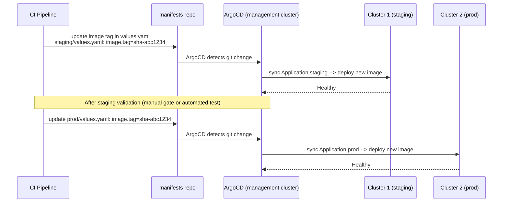
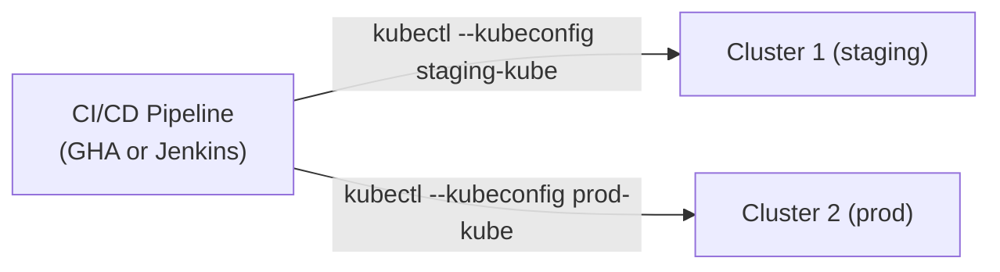

# CI/CD Pipeline Design — End to End

A single Java service, built once by CI and rolled out to two independent Kubernetes clusters (staging and prod) either via GitOps or a push-based pipeline. Each major stage below carries a quiz — track how many you've cleared as you go:

<div class="quiz-progress" data-quiz-progress>
  <span class="quiz-progress-label">0/0 checks</span>
  <span class="quiz-progress-bar"><span class="quiz-progress-fill"></span></span>
</div>

---

## Full Java CI Pipeline

```mermaid
graph LR
    PUSH["git push / PR"] --> CHECKOUT["1. Checkout code<br>git clone --depth 1"]
    CHECKOUT --> DEPS["2. Pull dependencies<br>mvn dependency:resolve<br>or cached ~/.m2"]
    DEPS --> UNIT["3. Unit Tests<br>mvn test<br>JUnit + Mockito"]
    UNIT --> INTEG["4. Integration Tests<br>mvn verify<br>testcontainers for DB/Redis"]
    INTEG --> BUILD["5. Build artifact<br>mvn package -DskipTests<br>--> target/app.jar"]
    BUILD --> DOCKER["6. Build Docker image<br>multi-stage Dockerfile<br>--> image:sha-abc1234"]
    DOCKER --> SCAN["7. Security scan<br>trivy image / snyk<br>fail on CRITICAL CVEs"]
    SCAN --> PUSH_IMG["8. Push to registry<br>ECR / DockerHub<br>tag: sha + semver"]
```



Same eight stages, one at a time:

<div class="stepper">
  <div class="stepper-panels">
    <div class="stepper-panel active">
      <strong>1. Checkout code.</strong> <code>git clone --depth 1</code> — shallow clone, just enough history to build off the tip of the branch/PR.
    </div>
    <div class="stepper-panel">
      <strong>2. Pull dependencies.</strong> <code>mvn dependency:resolve</code>, or served from a cached <code>~/.m2</code> — avoids re-downloading the world on every run.
    </div>
    <div class="stepper-panel">
      <strong>3. Unit tests.</strong> <code>mvn test</code> — JUnit + Mockito, no external systems involved. Fast, and it runs first so a broken build fails cheaply.
    </div>
    <div class="stepper-panel">
      <strong>4. Integration tests.</strong> <code>mvn verify</code> — spins up testcontainers for things like a real DB or Redis. Slower than unit tests, so it only runs once the cheap check has already passed.
    </div>
    <div class="stepper-panel">
      <strong>5. Build artifact.</strong> <code>mvn package -DskipTests</code> → <code>target/app.jar</code>. Tests already ran in steps 3–4 — skipping them here avoids running the same suites twice.
    </div>
    <div class="stepper-panel">
      <strong>6. Build Docker image.</strong> Multi-stage Dockerfile → <code>image:sha-abc1234</code>, tagged with the commit SHA so every image is traceable back to the exact code that built it.
    </div>
    <div class="stepper-panel">
      <strong>7. Security scan.</strong> <code>trivy image</code> / <code>snyk</code>, failing the build on CRITICAL CVEs — deliberately placed after the image exists but before it's pushed anywhere.
    </div>
    <div class="stepper-panel">
      <strong>8. Push to registry.</strong> ECR / DockerHub, tagged with both the SHA and a semver tag — only a scanned, passing image ever reaches the registry.
    </div>
  </div>
  <div class="stepper-controls">
    <button class="stepper-prev">← Prev</button>
    <span class="stepper-dots"></span>
    <span class="stepper-label"></span>
    <button class="stepper-next">Next →</button>
  </div>
</div>

### GitHub Actions: Full Java CI

```yaml
name: CI

on:
  push:
    branches: [main]
  pull_request:
    branches: [main]

env:
  ECR_REPO: 123456789.dkr.ecr.us-east-1.amazonaws.com/myapp
  JAVA_VERSION: "21"

jobs:
  ci:
    runs-on: ubuntu-latest
    steps:
    - uses: actions/checkout@v4

    - uses: actions/setup-java@v4
      with:
        java-version: ${{ env.JAVA_VERSION }}
        distribution: temurin
        cache: maven          # cache ~/.m2 by pom.xml hash

    - name: Unit Tests
      run: mvn test -B
      # -B = batch mode (no ANSI colors, better for CI logs)

    - name: Integration Tests
      run: mvn verify -B -Pintegration
      # Pintegration = Maven profile that runs testcontainers tests

    - name: Build JAR
      run: mvn package -DskipTests -B

    - name: Configure AWS credentials (OIDC — no static keys)
      uses: aws-actions/configure-aws-credentials@v4
      with:
        role-to-assume: arn:aws:iam::123456789:role/github-actions-ecr
        aws-region: us-east-1

    - name: Login to ECR
      uses: aws-actions/amazon-ecr-login@v2

    - name: Build and push Docker image
      run: |
        IMAGE_TAG="sha-${{ github.sha }}"
        docker build \
          --cache-from type=gha \    # use GH Actions cache for Docker layers
          --cache-to type=gha,mode=max \
          -t $ECR_REPO:$IMAGE_TAG \
          -t $ECR_REPO:latest .
        docker push $ECR_REPO:$IMAGE_TAG
        docker push $ECR_REPO:latest
        echo "IMAGE_TAG=$IMAGE_TAG" >> $GITHUB_OUTPUT
      id: build

    - name: Scan image for vulnerabilities
      uses: aquasecurity/trivy-action@master
      with:
        image-ref: ${{ env.ECR_REPO }}:sha-${{ github.sha }}
        severity: CRITICAL,HIGH
        exit-code: 1    # fail CI if CRITICAL found
```

<div class="quiz-card">
  <p class="quiz-q">The workflow runs <code>mvn package -DskipTests</code> to build the JAR, even though unit and integration tests already ran earlier in the same job. Why skip tests here instead of just letting them run again?</p>
  <button class="quiz-reveal">Reveal answer</button>
  <div class="quiz-a" hidden>The suites already ran and passed in the earlier <code>mvn test</code> and <code>mvn verify</code> steps &mdash; re-running them during packaging would just repeat the same work and slow the pipeline down for no new information. <code>-DskipTests</code> keeps the packaging step to what it's actually for: compiling and assembling the JAR.</div>
</div>

---

## CD: Deploy to Two Clusters

Same artifact, two clusters (staging, prod) — the two options below differ in who actually talks to the clusters:

<div class="toggle-switch">
  <div class="toggle-buttons">
    <button data-toggle-opt="argocd" class="active state-ok">ArgoCD (GitOps)</button>
    <button data-toggle-opt="gha" class="state-warn">GitHub Actions / Jenkins</button>
  </div>
  <div class="toggle-panel active" data-toggle-panel="argocd">
    <strong>Pull-based.</strong> CI never touches the clusters directly &mdash; it only commits an image tag change to a manifests repo. ArgoCD, running in a management cluster, notices the git change and runs the actual <code>sync</code> against each cluster. Git is the source of truth: what's live is whatever the manifests repo says it should be.
  </div>
  <div class="toggle-panel" data-toggle-panel="gha">
    <strong>Push-based.</strong> The CI/CD pipeline itself holds credentials for both clusters and runs <code>kubectl</code>/<code>helm</code> directly against them. Simpler to reason about &mdash; there's no separate GitOps controller in the loop &mdash; but the pipeline now needs direct network and credential access to production.
  </div>
</div>

### Option A: ArgoCD (Recommended — GitOps)



Step through the same rollout one stage at a time:

<div class="stepper">
  <div class="stepper-panels">
    <div class="stepper-panel active">
      <strong>1. CI updates the staging manifest.</strong> The CI pipeline's only cluster-facing action is a git commit: <code>staging/values.yaml</code> gets <code>image.tag=sha-abc1234</code>.
    </div>
    <div class="stepper-panel">
      <strong>2. ArgoCD detects the change.</strong> Running in the management cluster, it notices the manifests repo moved and diffs it against what's actually deployed.
    </div>
    <div class="stepper-panel">
      <strong>3. Sync to Cluster 1 (staging).</strong> ArgoCD applies the new manifests to the staging cluster. Once pods roll out and pass their checks, the Application reports Healthy.
    </div>
    <div class="stepper-panel">
      <strong>4. Validation gate.</strong> A manual approval or an automated test suite confirms staging looks right before anything touches prod.
    </div>
    <div class="stepper-panel">
      <strong>5. CI updates the prod manifest.</strong> Same commit pattern, this time to <code>prod/values.yaml</code> — same image tag as staging, so prod runs exactly what staging just validated.
    </div>
    <div class="stepper-panel">
      <strong>6. Sync to Cluster 2 (prod).</strong> ArgoCD detects the second change and syncs the prod Application. Healthy once rolled out — both clusters now run the same image, reached independently and in sequence.
    </div>
  </div>
  <div class="stepper-controls">
    <button class="stepper-prev">← Prev</button>
    <span class="stepper-dots"></span>
    <span class="stepper-label"></span>
    <button class="stepper-next">Next →</button>
  </div>
</div>

**Where does ArgoCD live?** One ArgoCD instance in a management cluster. It registers both staging and prod clusters via `argocd cluster add`. Both clusters' kubeconfigs are stored as Secrets in the ArgoCD namespace.

```bash
# Register clusters with ArgoCD
argocd cluster add staging-context --name staging
argocd cluster add prod-context --name prod

# ArgoCD ApplicationSet: one definition → two applications
apiVersion: argoproj.io/v1alpha1
kind: ApplicationSet
spec:
  generators:
  - list:
      elements:
      - cluster: staging
        url: https://staging-api.eks.amazonaws.com
        values_file: staging/values.yaml
      - cluster: prod
        url: https://prod-api.eks.amazonaws.com
        values_file: prod/values.yaml
  template:
    spec:
      source:
        helm:
          valueFiles: ["{{values_file}}"]
      destination:
        server: "{{url}}"
```

<div class="quiz-card">
  <p class="quiz-q">In the ArgoCD flow, what actually triggers a deployment change on the staging cluster — the CI pipeline finishing, or something else?</p>
  <button class="quiz-reveal">Reveal answer</button>
  <div class="quiz-a" hidden>Something else: ArgoCD detecting the git change in the manifests repo. CI's only job is to update <code>values.yaml</code> and commit &mdash; it never talks to the cluster directly. The actual <code>sync</code> against the cluster is ArgoCD noticing the drift between git and what's running, which is the whole point of a pull-based GitOps model.</div>
</div>

### Option B: GitHub Actions / Jenkins — Pushing via kubectl/helm



**Sequential vs Parallel:**
- **Sequential:** deploy staging → wait for health check → deploy prod (safer — catch issues before prod)
- **Parallel:** deploy both simultaneously (faster — use only if staging and prod are truly independent)

```yaml
# GitHub Actions: sequential deploy
jobs:
  deploy-staging:
    runs-on: ubuntu-latest
    environment: staging
    steps:
    - name: Configure kubeconfig for staging
      run: |
        aws eks update-kubeconfig \
          --name staging-cluster \
          --region us-east-1 \
          --role-arn arn:aws:iam::123:role/staging-deploy
    - name: Helm upgrade staging
      run: |
        helm upgrade --install myapp ./helm/myapp \
          --namespace myapp \
          --values helm/myapp/values-staging.yaml \
          --set image.tag=${{ github.sha }} \
          --wait --timeout 5m \
          --atomic   # rollback on failure

  deploy-prod:
    needs: deploy-staging    # wait for staging to succeed
    runs-on: ubuntu-latest
    environment: production  # requires manual approval in GitHub
    steps:
    - name: Configure kubeconfig for prod
      run: |
        aws eks update-kubeconfig \
          --name prod-cluster \
          --region us-east-1 \
          --role-arn arn:aws:iam::123:role/prod-deploy
    - name: Helm upgrade prod
      run: |
        helm upgrade --install myapp ./helm/myapp \
          --namespace myapp \
          --values helm/myapp/values-prod.yaml \
          --set image.tag=${{ github.sha }} \
          --wait --timeout 5m \
          --atomic
```

<div class="quiz-card">
  <p class="quiz-q">The <code>deploy-prod</code> job declares <code>needs: deploy-staging</code> and <code>environment: production</code>. What actually stops it from deploying if staging fails or nobody's approved it?</p>
  <button class="quiz-reveal">Reveal answer</button>
  <div class="quiz-a" hidden><code>needs: deploy-staging</code> stops the job from starting at all unless the staging job succeeded. <code>environment: production</code> layers a separate gate on top of that &mdash; a required manual approval in GitHub &mdash; so even a successful staging deploy doesn't automatically greenlight prod.</div>
</div>

---

## Helm — Create, Install, Upgrade

### Create a Chart

```bash
helm create myapp
# Creates:
# myapp/
#   Chart.yaml         ← name, version, appVersion
#   values.yaml        ← default values
#   templates/
#     deployment.yaml
#     service.yaml
#     ingress.yaml
#     _helpers.tpl     ← named templates ({{ include "myapp.name" . }})
```

### Install a Chart

```bash
helm install <release-name> <chart> [flags]

helm install myapp ./myapp \
  --namespace myapp \
  --create-namespace \
  --values values-prod.yaml \
  --set image.tag=v1.2.3 \
  --wait            # wait until all pods are Running
  --timeout 5m
```

### Upgrade a Chart

```bash
helm upgrade myapp ./myapp \
  --namespace myapp \
  --values values-prod.yaml \
  --set image.tag=v1.3.0 \
  --wait \
  --atomic          # rollback automatically if upgrade fails
```

### Single Command: Upgrade if Exists, Install if Not

```bash
helm upgrade --install myapp ./myapp \
  --namespace myapp \
  --create-namespace \
  --values values-prod.yaml \
  --set image.tag=$IMAGE_TAG \
  --wait \
  --atomic
# --install flag: if release doesn't exist → install. If it does → upgrade.
# This is the standard CI/CD command — idempotent.
```

### Check if Release Exists

```bash
# Check status
helm status myapp -n myapp
# If release doesn't exist: Error: release: not found

# List all releases in namespace
helm list -n myapp

# History of a release
helm history myapp -n myapp

# Rollback to previous version
helm rollback myapp -n myapp         # previous
helm rollback myapp 2 -n myapp       # specific revision
```

---

## SDE-1 vs SDE-2 Classification

### SDE-1 Level (expected to know cold)

| Topic | Why SDE-1 |
|-------|-----------|
| ECS Fargate basics — Task Definition, Service, networking | Standard AWS container deployment |
| HPA basics — CPU-based scaling, `kubectl get hpa` | Fundamental K8s operations |
| Scheduler Filter/Score at concept level | Core K8s knowledge |
| Route53 → ALB → pod request flow | Required for any AWS service |
| ALB vs NLB — L7 vs L4 | Standard infra interview question |
| `kubectl logs`, `describe`, `get events` debugging | Daily operational skill |
| Docker layers and why layer order matters | Every Dockerfile you write |
| Docker image optimization (multi-stage, distroless) | Production requirement |
| Helm install/upgrade/upgrade--install | Standard deploy tooling |
| Namespaces and cgroups conceptually | Container fundamentals |
| Terraform remote state (S3 + DynamoDB) | Standard team Terraform setup |
| NAT Gateway vs Internet Gateway | AWS networking basics |
| Round-robin load balancing | Fundamental networking |

### SDE-2 Level (deeper knowledge expected)

| Topic | Why SDE-2 |
|-------|-----------|
| HPA stabilizationWindow, behavior.scaleDown/Up policies | Tuning production autoscaling |
| VPA update modes, Recommender/Updater/Admission Controller architecture | Right-sizing at scale |
| VPA + singleton interaction (eviction = downtime) | Production incident prevention |
| HPA + VPA conflict and safe combinations | System design decision |
| Scheduler: every Filter/Score plugin by name and function | Platform engineering |
| Gang scheduling (Volcano) for distributed training | AI/ML infra |
| containerd-shim role (why containers survive containerd restart) | Container runtime internals |
| CRI gRPC interface (kubelet → containerd, no dockerd) | K8s internals |
| ALB target group deregistration delay and connection draining | Zero-downtime deploys |
| Terraform DynamoDB locking — race conditions and how lock prevents them | IaC at team scale |
| ArgoCD ApplicationSet multi-cluster management | Platform GitOps |
| Sequential vs parallel CD tradeoffs | System design |
| `helm upgrade --atomic` auto-rollback mechanism | Production reliability |
