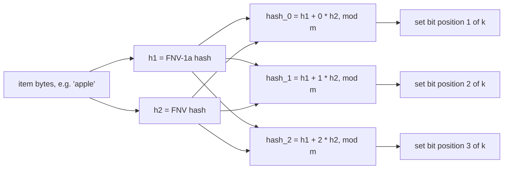

# Bloom Filter

Probabilistic set-membership structure: space-efficient, no false negatives, tunable false positive rate. Answers "definitely not present" or "maybe present" — never "definitely present."

<div class="quiz-progress" data-quiz-progress>
  <span class="quiz-progress-label">0/0 checks</span>
  <span class="quiz-progress-bar"><span class="quiz-progress-fill"></span></span>
</div>

---

## Full Working Code

Both implementations below use the same trick: only two independent hashes (`h1`, `h2`) are ever actually computed per item. All `k` bit positions are derived from those two via double hashing (Kirsch-Mitzenmacher) instead of writing `k` separate hash functions.



Go uses `fnv.New64a`/`fnv.New64` over a packed `[]uint64` bit array; Python uses two `hashlib` digests over a `bytearray` bit array (in production, prefer `mmh3.hash64` with two seeds — faster, still well-distributed, see the code comment below).

<div class="tab-group">
  <div class="tab-buttons">
    <button data-tab="impl-go" class="active">Go</button>
    <button data-tab="impl-py">Python</button>
    <button data-tab="impl-java">Java</button>
  </div>
  <div class="tab-panels">
    <div class="tab-panel active" data-tab-panel="impl-go">
<pre><code class="language-go">
package bloom
&#8203;
import (
	"hash/fnv"
	"math"
)
&#8203;
// Filter is a Bloom filter backed by a bit array and k independent hash
// functions (simulated via double hashing from two base hashes).
type Filter struct {
	bits []uint64 // packed bit array, 64 bits per word
	m    uint     // number of bits
	k    uint     // number of hash functions
}
&#8203;
// NewFilter creates a Bloom filter sized for n expected elements at the
// given target false positive rate p (e.g. 0.01 for 1%).
func NewFilter(n uint, p float64) *Filter {
	m := optimalM(n, p)
	k := optimalK(m, n)
	return &amp;Filter{
		bits: make([]uint64, (m+63)/64), // round up to whole words
		m:    m,
		k:    k,
	}
}
&#8203;
// optimalM computes the number of bits needed: m = -(n * ln(p)) / (ln(2)^2)
func optimalM(n uint, p float64) uint {
	m := -1 * float64(n) * math.Log(p) / (math.Ln2 * math.Ln2)
	return uint(math.Ceil(m))
}
&#8203;
// optimalK computes the ideal number of hash functions: k = (m/n) * ln(2)
func optimalK(m, n uint) uint {
	k := (float64(m) / float64(n)) * math.Ln2
	if k &lt; 1 {
		return 1
	}
	return uint(math.Round(k))
}
&#8203;
// hashes returns two independent base hashes of data. All k hash functions
// are derived from these two via double hashing (Kirsch-Mitzenmacher),
// avoiding the need for k separate hash implementations.
func hashes(data []byte) (uint64, uint64) {
	h1 := fnv.New64a()
	h1.Write(data)
	sum1 := h1.Sum64()
&#8203;
	h2 := fnv.New64()
	h2.Write(data)
	sum2 := h2.Sum64()
&#8203;
	return sum1, sum2
}
&#8203;
// Add inserts an element into the filter.
func (f *Filter) Add(data []byte) {
	h1, h2 := hashes(data)
	for i := uint(0); i &lt; f.k; i++ {
		pos := f.combine(h1, h2, i) % uint64(f.m)
		f.setBit(pos)
	}
}
&#8203;
// MightContain reports whether data may be in the set. False means
// definitely not present. True means present with probability (1 - false
// positive rate) — it might be a false positive.
func (f *Filter) MightContain(data []byte) bool {
	h1, h2 := hashes(data)
	for i := uint(0); i &lt; f.k; i++ {
		pos := f.combine(h1, h2, i) % uint64(f.m)
		if !f.getBit(pos) {
			return false
		}
	}
	return true
}
&#8203;
// combine implements double hashing: hash_i(x) = h1(x) + i*h2(x)
func (f *Filter) combine(h1, h2 uint64, i uint) uint64 {
	return h1 + uint64(i)*h2
}
&#8203;
func (f *Filter) setBit(pos uint64) {
	word := pos / 64
	bit := pos % 64
	f.bits[word] |= 1 &lt;&lt; bit
}
&#8203;
func (f *Filter) getBit(pos uint64) bool {
	word := pos / 64
	bit := pos % 64
	return f.bits[word]&amp;(1&lt;&lt;bit) != 0
}
&#8203;
// EstimatedFalsePositiveRate returns the current theoretical false positive
// rate given m, k, and how many elements n have actually been inserted so
// far (tracked externally by the caller, since the filter itself doesn't
// count insertions — duplicate Adds don't increase the "true" n).
func (f *Filter) EstimatedFalsePositiveRate(n uint) float64 {
	exp := -float64(f.k) * float64(n) / float64(f.m)
	return math.Pow(1-math.Exp(exp), float64(f.k))
}</code></pre>
    </div>
    <div class="tab-panel" data-tab-panel="impl-py">
<pre><code class="language-python">from __future__ import annotations
&#8203;
import hashlib
import math
&#8203;
&#8203;
class BloomFilter:
    """Probabilistic set-membership structure backed by a bit array and k
    independent hash functions (simulated via double hashing from two base
    hashes). Space-efficient, no false negatives, tunable false positive
    rate. `might_contain()` answers "definitely not present" (False) or
    "maybe present" (True) -- never "definitely present."
    """
&#8203;
    def __init__(self, n: int, p: float) -&gt; None:
        """Size a filter for `n` expected elements at target false positive
        rate `p` (e.g. 0.01 for 1%)."""
        self.m: int = self._optimal_m(n, p)
        self.k: int = self._optimal_k(self.m, n)
        self.bits = bytearray((self.m + 7) // 8)  # 1 bit per slot, packed into bytes
&#8203;
    @staticmethod
    def _optimal_m(n: int, p: float) -&gt; int:
        """Number of bits needed: m = -(n * ln(p)) / (ln(2)^2)"""
        m = -1 * n * math.log(p) / (math.log(2) ** 2)
        return math.ceil(m)
&#8203;
    @staticmethod
    def _optimal_k(m: int, n: int) -&gt; int:
        """Ideal number of hash functions: k = (m/n) * ln(2)"""
        k = (m / n) * math.log(2)
        return max(1, round(k))
&#8203;
    @staticmethod
    def _hashes(data: bytes) -&gt; tuple[int, int]:
        """Two independent base hashes of `data`. All k hash functions are
        derived from these via double hashing (Kirsch-Mitzenmacher), avoiding
        the need for k separate hash implementations. Two different digest
        algorithms stand in as the independent bases here to keep this
        dependency-free -- in a production system, prefer
        `mmh3.hash64(data, seed=0)` / `mmh3.hash64(data, seed=1)`
        (MurmurHash3), which is faster and just as well-distributed."""
        h1 = int.from_bytes(hashlib.md5(data, usedforsecurity=False).digest()[:8], "big")
        h2 = int.from_bytes(hashlib.sha1(data, usedforsecurity=False).digest()[:8], "big")
        return h1, h2
&#8203;
    def _combine(self, h1: int, h2: int, i: int) -&gt; int:
        """Double hashing: hash_i(x) = h1(x) + i*h2(x)"""
        return h1 + i * h2
&#8203;
    def _set_bit(self, pos: int) -&gt; None:
        byte_index, bit_index = divmod(pos, 8)
        self.bits[byte_index] |= 1 &lt;&lt; bit_index
&#8203;
    def _get_bit(self, pos: int) -&gt; bool:
        byte_index, bit_index = divmod(pos, 8)
        return bool(self.bits[byte_index] &amp; (1 &lt;&lt; bit_index))
&#8203;
    def add(self, data: bytes) -&gt; None:
        """Insert an element into the filter."""
        h1, h2 = self._hashes(data)
        for i in range(self.k):
            pos = self._combine(h1, h2, i) % self.m
            self._set_bit(pos)
&#8203;
    def might_contain(self, data: bytes) -&gt; bool:
        """Return whether `data` may be in the set. False means definitely
        not present. True means present with probability (1 - false positive
        rate) -- it might be a false positive."""
        h1, h2 = self._hashes(data)
        for i in range(self.k):
            pos = self._combine(h1, h2, i) % self.m
            if not self._get_bit(pos):
                return False
        return True
&#8203;
    def estimated_false_positive_rate(self, n: int) -&gt; float:
        """Theoretical false positive rate given m, k, and how many elements
        n have actually been inserted so far (tracked externally by the
        caller -- the filter itself doesn't count insertions, since duplicate
        add() calls don't increase the "true" n)."""
        exp = -self.k * n / self.m
        return (1 - math.exp(exp)) ** self.k</code></pre>
    </div>
    <div class="tab-panel" data-tab-panel="impl-java">
<pre><code class="language-java">import java.security.MessageDigest;
import java.security.NoSuchAlgorithmException;
import java.util.BitSet;
&#8203;
/**
 * Probabilistic set-membership structure backed by a bit array and k
 * independent hash functions (simulated via double hashing from two base
 * hashes). Space-efficient, no false negatives, tunable false positive
 * rate. mightContain() answers "definitely not present" (false) or "maybe
 * present" (true) -- never "definitely present."
 */
public class BloomFilter {
    private final BitSet bits;
    private final int m; // number of bits
    private final int k; // number of hash functions
&#8203;
    /** Size a filter for n expected elements at target false positive rate p (e.g. 0.01 for 1%). */
    public BloomFilter(int n, double p) {
        this.m = optimalM(n, p);
        this.k = optimalK(m, n);
        this.bits = new BitSet(m);
    }
&#8203;
    /** Bits needed: m = -(n * ln(p)) / (ln(2)^2) */
    private static int optimalM(int n, double p) {
        double m = -1.0 * n * Math.log(p) / (Math.log(2) * Math.log(2));
        return (int) Math.ceil(m);
    }
&#8203;
    /** Ideal number of hash functions: k = (m/n) * ln(2) */
    private static int optimalK(int m, int n) {
        double k = ((double) m / n) * Math.log(2);
        return Math.max(1, (int) Math.round(k));
    }
&#8203;
    /**
     * Two independent base hashes of data. All k hash functions are derived
     * from these via double hashing (Kirsch-Mitzenmacher), avoiding the need
     * for k separate hash implementations. MD5 and SHA-1 stand in as the
     * independent bases here to keep this dependency-free -- in a production
     * system, prefer a faster non-cryptographic hash (e.g. Guava's
     * Hashing.murmur3_128() with two seeds).
     */
    private static long[] hashes(byte[] data) {
        try {
            MessageDigest md5 = MessageDigest.getInstance("MD5");
            MessageDigest sha1 = MessageDigest.getInstance("SHA-1");
            long h1 = firstEightBytesAsLong(md5.digest(data));
            long h2 = firstEightBytesAsLong(sha1.digest(data));
            return new long[]{h1, h2};
        } catch (NoSuchAlgorithmException e) {
            throw new IllegalStateException(e); // MD5/SHA-1 are guaranteed on every JVM
        }
    }
&#8203;
    private static long firstEightBytesAsLong(byte[] digest) {
        long value = 0;
        for (int i = 0; i &lt; 8; i++) {
            value = (value &lt;&lt; 8) | (digest[i] &amp; 0xFF);
        }
        return value;
    }
&#8203;
    /** Double hashing: hash_i(x) = h1(x) + i*h2(x), unsigned mod m. */
    private long combine(long h1, long h2, int i) {
        return Long.remainderUnsigned(h1 + (long) i * h2, m);
    }
&#8203;
    /** Insert an element into the filter. */
    public void add(byte[] data) {
        long[] h = hashes(data);
        for (int i = 0; i &lt; k; i++) {
            bits.set((int) combine(h[0], h[1], i));
        }
    }
&#8203;
    /**
     * Returns whether data may be in the set. False means definitely not
     * present. True means present with probability (1 - false positive
     * rate) -- it might be a false positive.
     */
    public boolean mightContain(byte[] data) {
        long[] h = hashes(data);
        for (int i = 0; i &lt; k; i++) {
            if (!bits.get((int) combine(h[0], h[1], i))) {
                return false;
            }
        }
        return true;
    }
&#8203;
    /**
     * Theoretical false positive rate given m, k, and how many elements n
     * have actually been inserted so far (tracked externally by the caller,
     * since the filter itself doesn't count insertions -- duplicate add()
     * calls don't increase the "true" n).
     */
    public double estimatedFalsePositiveRate(int n) {
        double exp = -1.0 * k * n / m;
        return Math.pow(1 - Math.exp(exp), k);
    }
}</code></pre>
    </div>
  </div>
</div>

<div class="quiz-card">
  <p class="quiz-q">The Go and Python implementations only ever compute two hashes (h1, h2) per item, no matter how large k is. How do they still produce k different bit positions?</p>
  <button class="quiz-reveal">Reveal answer</button>
  <div class="quiz-a" hidden>Via double hashing (Kirsch-Mitzenmacher): <code>hash_i(x) = h1(x) + i*h2(x)</code>, for <code>i = 0..k-1</code>. Each of the k "virtual" hash functions is just a different linear combination of the same two base hashes, mod m &mdash; that's <code>combine()</code> in Go and <code>_combine()</code> in Python. This avoids implementing k separate hash functions while still spreading bits across the array well enough in practice.</div>
</div>

### Test cases

Same double-hashing behavior, same test intent, in both languages:

<div class="tab-group">
  <div class="tab-buttons">
    <button data-tab="tests-go" class="active">Go</button>
    <button data-tab="tests-py">Python</button>
    <button data-tab="tests-java">Java</button>
  </div>
  <div class="tab-panels">
    <div class="tab-panel active" data-tab-panel="tests-go">
<pre><code class="language-go">package bloom
&#8203;
import "testing"
&#8203;
func TestNoFalseNegatives(t *testing.T) {
	f := NewFilter(1000, 0.01)
&#8203;
	inserted := []string{"apple", "banana", "cherry", "date", "elderberry"}
	for _, s := range inserted {
		f.Add([]byte(s))
	}
&#8203;
	for _, s := range inserted {
		if !f.MightContain([]byte(s)) {
			t.Fatalf("false negative for %q — Bloom filters must never do this", s)
		}
	}
}
&#8203;
func TestDefinitelyAbsent(t *testing.T) {
	f := NewFilter(1000, 0.01)
	f.Add([]byte("present"))
&#8203;
	// Not a guarantee for every unrelated string (false positives are
	// possible), but a filter sized for 1000 elements at 1% FP rate with
	// only 1 element inserted should reject almost everything.
	falsePositives := 0
	trials := 1000
	for i := 0; i &lt; trials; i++ {
		key := []byte{byte(i), byte(i &gt;&gt; 8)}
		if f.MightContain(key) {
			falsePositives++
		}
	}
	// Sanity bound — should be well under the target rate given only 1
	// real insertion, not a tight statistical assertion.
	if falsePositives &gt; trials/10 {
		t.Fatalf("false positive rate too high: %d/%d", falsePositives, trials)
	}
}
&#8203;
func TestFalsePositiveRateNearTarget(t *testing.T) {
	n := uint(10000)
	targetP := 0.01
	f := NewFilter(n, targetP)
&#8203;
	for i := uint(0); i &lt; n; i++ {
		f.Add([]byte{byte(i), byte(i &gt;&gt; 8), byte(i &gt;&gt; 16)})
	}
&#8203;
	// Test with keys guaranteed not to have been inserted.
	falsePositives := 0
	trials := 10000
	for i := 0; i &lt; trials; i++ {
		key := []byte{byte(i), byte(i &gt;&gt; 8), byte(i &gt;&gt; 16), 0xFF} // distinct namespace
		if f.MightContain(key) {
			falsePositives++
		}
	}
&#8203;
	observedRate := float64(falsePositives) / float64(trials)
	t.Logf("observed FP rate: %.4f, target: %.4f", observedRate, targetP)
	// Allow generous margin — this is a probabilistic structure.
	if observedRate &gt; targetP*3 {
		t.Fatalf("observed FP rate %.4f far exceeds target %.4f", observedRate, targetP)
	}
}</code></pre>
    </div>
    <div class="tab-panel" data-tab-panel="tests-py">
<pre><code class="language-python">from bloom import BloomFilter
&#8203;
&#8203;
def test_no_false_negatives():
    f = BloomFilter(1000, 0.01)
&#8203;
    inserted = [b"apple", b"banana", b"cherry", b"date", b"elderberry"]
    for item in inserted:
        f.add(item)
&#8203;
    for item in inserted:
        assert f.might_contain(item), (
            f"false negative for {item!r} -- Bloom filters must never do this"
        )
&#8203;
&#8203;
def test_definitely_absent():
    f = BloomFilter(1000, 0.01)
    f.add(b"present")
&#8203;
    # Not a guarantee for every unrelated string (false positives are
    # possible), but a filter sized for 1000 elements at 1% FP rate with
    # only 1 element inserted should reject almost everything.
    false_positives = 0
    trials = 1000
    for i in range(trials):
        key = bytes([i &amp; 0xFF, (i &gt;&gt; 8) &amp; 0xFF])
        if f.might_contain(key):
            false_positives += 1
    # Sanity bound -- should be well under the target rate given only 1
    # real insertion, not a tight statistical assertion.
    assert false_positives &lt;= trials / 10, (
        f"false positive rate too high: {false_positives}/{trials}"
    )
&#8203;
&#8203;
def test_false_positive_rate_near_target():
    n = 10_000
    target_p = 0.01
    f = BloomFilter(n, target_p)
&#8203;
    for i in range(n):
        f.add(bytes([i &amp; 0xFF, (i &gt;&gt; 8) &amp; 0xFF, (i &gt;&gt; 16) &amp; 0xFF]))
&#8203;
    # Test with keys guaranteed not to have been inserted.
    false_positives = 0
    trials = 10_000
    for i in range(trials):
        key = bytes([i &amp; 0xFF, (i &gt;&gt; 8) &amp; 0xFF, (i &gt;&gt; 16) &amp; 0xFF, 0xFF])  # distinct namespace
        if f.might_contain(key):
            false_positives += 1
&#8203;
    observed_rate = false_positives / trials
    print(f"observed FP rate: {observed_rate:.4f}, target: {target_p:.4f}")
    # Allow generous margin -- this is a probabilistic structure.
    assert observed_rate &lt;= target_p * 3, (
        f"observed FP rate {observed_rate:.4f} far exceeds target {target_p:.4f}"
    )</code></pre>
    </div>
    <div class="tab-panel" data-tab-panel="tests-java">
<pre><code class="language-java">import java.nio.charset.StandardCharsets;
import java.util.BitSet;
&#8203;
/** Tests for the Bloom filter. */
public class BloomFilterTest {
    public static void main(String[] args) {
        testNoFalseNegatives();
        testDefinitelyAbsent();
        testFalsePositiveRateNearTarget();
        testStepperWalkthroughBitPositions();
        System.out.println("ALL TESTS PASSED");
    }
&#8203;
    static void testNoFalseNegatives() {
        BloomFilter f = new BloomFilter(1000, 0.01);
&#8203;
        String[] inserted = {"apple", "banana", "cherry", "date", "elderberry"};
        for (String s : inserted) {
            f.add(s.getBytes(StandardCharsets.UTF_8));
        }
&#8203;
        for (String s : inserted) {
            assertTrue(
                f.mightContain(s.getBytes(StandardCharsets.UTF_8)),
                "false negative for \"" + s + "\" -- Bloom filters must never do this"
            );
        }
        System.out.println("PASS testNoFalseNegatives");
    }
&#8203;
    static void testDefinitelyAbsent() {
        BloomFilter f = new BloomFilter(1000, 0.01);
        f.add("present".getBytes(StandardCharsets.UTF_8));
&#8203;
        // Not a guarantee for every unrelated string (false positives are
        // possible), but a filter sized for 1000 elements at 1% FP rate with
        // only 1 element inserted should reject almost everything.
        int falsePositives = 0;
        int trials = 1000;
        for (int i = 0; i &lt; trials; i++) {
            byte[] key = {(byte) i, (byte) (i &gt;&gt; 8)};
            if (f.mightContain(key)) {
                falsePositives++;
            }
        }
        // Sanity bound -- should be well under the target rate given only 1
        // real insertion, not a tight statistical assertion.
        assertTrue(
            falsePositives &lt;= trials / 10,
            "false positive rate too high: " + falsePositives + "/" + trials
        );
        System.out.println("PASS testDefinitelyAbsent");
    }
&#8203;
    static void testFalsePositiveRateNearTarget() {
        int n = 10_000;
        double targetP = 0.01;
        BloomFilter f = new BloomFilter(n, targetP);
&#8203;
        for (int i = 0; i &lt; n; i++) {
            byte[] key = {(byte) i, (byte) (i &gt;&gt; 8), (byte) (i &gt;&gt; 16)};
            f.add(key);
        }
&#8203;
        // Test with keys guaranteed not to have been inserted.
        int falsePositives = 0;
        int trials = 10_000;
        for (int i = 0; i &lt; trials; i++) {
            byte[] key = {(byte) i, (byte) (i &gt;&gt; 8), (byte) (i &gt;&gt; 16), (byte) 0xFF}; // distinct namespace
            if (f.mightContain(key)) {
                falsePositives++;
            }
        }
&#8203;
        double observedRate = (double) falsePositives / trials;
        System.out.printf("observed FP rate: %.4f, target: %.4f%n", observedRate, targetP);
        // Allow generous margin -- this is a probabilistic structure.
        assertTrue(
            observedRate &lt;= targetP * 3,
            "observed FP rate " + observedRate + " far exceeds target " + targetP
        );
        System.out.println("PASS testFalsePositiveRateNearTarget");
    }
&#8203;
    /**
     * Reproduces the exact m=16, k=3 walkthrough from the guide's stepper:
     * insert "cat" (bits 2,5,9), "dog" (bits 1,5,14), "fox" (bits 9,12,15),
     * then confirm "bird" (never inserted) reads back as a false positive
     * because its own 3 positions (1,9,12) were each set by a different
     * earlier item. This exercises the same set/get-bit mechanics as
     * BloomFilter.add()/mightContain() with the walkthrough's fixed
     * positions standing in for real hash output, since the guide picks
     * those positions for illustration rather than pulling them from any
     * one language's live hash function.
     */
    static void testStepperWalkthroughBitPositions() {
        BitSet bits = new BitSet(16);
&#8203;
        for (int pos : new int[]{2, 5, 9}) { // insert "cat"
            bits.set(pos);
        }
        assertTrue(bitsEqual(bits, 2, 5, 9), "unexpected bit state after inserting cat");
&#8203;
        for (int pos : new int[]{1, 5, 14}) { // insert "dog" -- bit 5 overlaps with cat
            bits.set(pos);
        }
        assertTrue(bitsEqual(bits, 1, 2, 5, 9, 14), "unexpected bit state after inserting dog");
&#8203;
        for (int pos : new int[]{9, 12, 15}) { // insert "fox" -- bit 9 overlaps with cat
            bits.set(pos);
        }
        assertTrue(bitsEqual(bits, 1, 2, 5, 9, 12, 14, 15), "unexpected bit state after inserting fox");
&#8203;
        // "bird" was never inserted, but its 3 hash positions each happen to
        // already be set by a different earlier item -- a false positive.
        boolean falsePositive = true;
        for (int pos : new int[]{1, 9, 12}) {
            falsePositive &amp;= bits.get(pos);
        }
        assertTrue(
            falsePositive,
            "expected \"bird\" to read as a false positive, matching the guide's walkthrough"
        );
        System.out.println("PASS testStepperWalkthroughBitPositions");
    }
&#8203;
    static boolean bitsEqual(BitSet bits, int... expectedSetPositions) {
        BitSet expected = new BitSet(16);
        for (int pos : expectedSetPositions) {
            expected.set(pos);
        }
        return bits.equals(expected);
    }
&#8203;
    static void assertTrue(boolean cond, String msg) {
        if (!cond) {
            throw new AssertionError(msg);
        }
    }
}</code></pre>
    </div>
  </div>
</div>

<div class="quiz-card">
  <p class="quiz-q">TestNoFalseNegatives / test_no_false_negatives asserts MightContain (Go) / might_contain (Python) returns true for every inserted item. Could this test ever legitimately fail without a bug in the filter?</p>
  <button class="quiz-reveal">Reveal answer</button>
  <div class="quiz-a" hidden>No &mdash; a Bloom filter must never produce a false negative by construction. Every bit an item's k hashes point to gets set at <code>Add</code>/<code>add</code> time, and standard Bloom filters never clear bits (no deletion), so those same bits are guaranteed still set when <code>MightContain</code>/<code>might_contain</code> checks them later. If this test fails, that means an actual bug (e.g., a mismatch between how <code>Add</code> and <code>MightContain</code> compute positions), not statistical bad luck.</div>
</div>

---

## False Positive Rate Math

Given:
- `m` = number of bits in the array
- `n` = number of elements inserted
- `k` = number of hash functions

**Optimal number of hash functions** (minimizes false positive rate for given m, n):

```
k = (m/n) * ln(2)
```

**False positive probability** after inserting n elements:

```
p ≈ (1 - e^(-kn/m))^k
```

**Required bits for target false positive rate p** (solving for m given n and desired p):

```
m = -(n * ln(p)) / (ln(2))^2
```

### Worked Example

Requirement: store 1,000,000 elements with a 1% (0.01) false positive rate.

```
n = 1,000,000
p = 0.01

Step 1 — compute m:
m = -(1,000,000 * ln(0.01)) / (ln(2))^2
  = -(1,000,000 * -4.6052) / (0.6931)^2
  = 4,605,200 / 0.4805
  ≈ 9,585,000 bits
  ≈ 1.14 MB

Step 2 — compute k:
k = (m/n) * ln(2)
  = (9,585,000 / 1,000,000) * 0.6931
  = 9.585 * 0.6931
  ≈ 6.64  ->  round to 7 hash functions

Step 3 — verify p with rounded k=7, m=9,585,000, n=1,000,000:
p ≈ (1 - e^(-7*1,000,000/9,585,000))^7
  ≈ (1 - e^(-0.7302))^7
  ≈ (1 - 0.4819)^7
  ≈ (0.5181)^7
  ≈ 0.00963   (≈0.96%, close to the 1% target)
```

### Verified with Python

Same three formulas, run instead of hand-computed — this removes the rounding error that accumulates across the by-hand steps above (0.96% by hand vs. the more precise figure below):

```python
import math

n = 1_000_000
p = 0.01

m = math.ceil(-(n * math.log(p)) / (math.log(2) ** 2))
k = max(1, round((m / n) * math.log(2)))
fp = (1 - math.exp(-k * n / m)) ** k

print(f"m = {m:,} bits (~{m / 8 / 1024 / 1024:.2f} MB)")
print(f"k = {k}")
print(f"p ~= {fp:.5f}")
```

Output:

```
m = 9,585,059 bits (~1.14 MB)
k = 7
p ~= 0.01004
```

Matches the hand-worked `m` and `k` (the tiny difference is just hand-rounding `m` to 9,585,000 above vs. the exact 9,585,059), and confirms `p` lands almost exactly on the 1% target once the rounding error is removed.

**Compare to the naive alternative:** storing 1,000,000 actual keys (e.g., 8-byte hashes) in a hashset would take ~8 MB minimum, plus hashmap overhead (buckets, pointers) pushing it to 20-40 MB in practice. The Bloom filter does it in ~1.14 MB — roughly 20-30x less memory — at the cost of ~1% false positives and no ability to enumerate or delete elements (standard Bloom filters don't support deletion; that requires a Counting Bloom Filter variant with counters instead of bits).

<div class="quiz-card">
  <p class="quiz-q">Why can a Bloom filter produce false positives but never false negatives?</p>
  <button class="quiz-reveal">Reveal answer</button>
  <div class="quiz-a" hidden><code>MightContain</code>/<code>might_contain</code> only checks whether bits are set &mdash; it has no way to tell <em>which</em> item set a given bit. An item that was never inserted can still have all k of its hash positions happen to be set by other, unrelated items already in the filter &mdash; that's a false positive, and <code>p ≈ (1 - e^(-kn/m))^k</code> is exactly the probability of that overlap happening. A false negative would require a bit that a real member's own hashing set to somehow be unset later &mdash; and since bits are only ever set (never cleared, no deletion in a standard Bloom filter), that can't happen.</div>
</div>

---

## Walking Through Inserts and a False Positive

A concrete trace on a tiny filter makes the bit-overlap mechanism concrete. Take `m = 16` bits, `k = 3` hash positions per item, all bits starting at 0. Insert `"cat"`, `"dog"`, `"fox"`, then query `"bird"` — never inserted — and watch it come back a false positive purely because its 3 hash positions each happen to already be set by a *different* earlier item.

<div class="stepper">
  <div class="stepper-panels">
    <div class="stepper-panel active">
      <strong>1. Start: empty array.</strong> m=16 bits, k=3 positions per item, nothing inserted.
      <pre><code> 0  1  2  3  4  5  6  7  8  9 10 11 12 13 14 15
 0  0  0  0  0  0  0  0  0  0  0  0  0  0  0  0</code></pre>
    </div>
    <div class="stepper-panel">
      <strong>2. Insert "cat".</strong> Double hashing derives 3 positions from cat's two base hashes: bits 2, 5, 9. All three flip from 0 to 1.
      <pre><code> 0  1  2  3  4  5  6  7  8  9 10 11 12 13 14 15
 0  0  1  0  0  1  0  0  0  1  0  0  0  0  0  0</code></pre>
    </div>
    <div class="stepper-panel">
      <strong>3. Insert "dog".</strong> Positions 1, 5, 14. Bits 1 and 14 are new — but bit 5 was <em>already</em> set by "cat". The filter has no way to record that, and doesn't need to: it just leaves the bit at 1.
      <pre><code> 0  1  2  3  4  5  6  7  8  9 10 11 12 13 14 15
 0  1  1  0  0  1  0  0  0  1  0  0  0  0  1  0</code></pre>
    </div>
    <div class="stepper-panel">
      <strong>4. Insert "fox".</strong> Positions 9, 12, 15. Bits 12 and 15 are new; bit 9 was already set by "cat" — a second silent overlap.
      <pre><code> 0  1  2  3  4  5  6  7  8  9 10 11 12 13 14 15
 0  1  1  0  0  1  0  0  0  1  0  0  1  0  1  1</code></pre>
    </div>
    <div class="stepper-panel">
      <strong>5. Query "bird" (never inserted) &mdash; false positive.</strong> Bird's own hashes land on positions 1, 9, 12. Check each: bit 1 is set (by "dog"), bit 9 is set (by "cat"), bit 12 is set (by "fox"). <code>MightContain</code> only reads bit values, not who set them, so all three checks pass and it returns <strong>true</strong> — "bird" looks present even though it was never added. Three unrelated inserts each left one bit behind that, purely by coincidence, lined up with bird's own hash positions.
      <pre><code> 0  1  2  3  4  5  6  7  8  9 10 11 12 13 14 15
 0  1  1  0  0  1  0  0  0  1  0  0  1  0  1  1</code></pre>
    </div>
  </div>
  <div class="stepper-controls">
    <button class="stepper-prev">← Prev</button>
    <span class="stepper-dots"></span>
    <span class="stepper-label"></span>
    <button class="stepper-next">Next →</button>
  </div>
</div>

<div class="quiz-card">
  <p class="quiz-q">In the walkthrough above, querying "bird" (never inserted) returns a false positive. Why did that happen even though bird's own hash positions were computed correctly?</p>
  <button class="quiz-reveal">Reveal answer</button>
  <div class="quiz-a" hidden>Because each of bird's 3 hash positions (1, 9, 12) happened to already be set &mdash; but by three different, unrelated earlier inserts (dog set bit 1, cat set bit 9, fox set bit 12), not by bird itself. <code>MightContain</code> only reads bit values, not who set them, so a real item never inserted can still pass the check purely by coincidental overlap. This gets less likely as the array gets bigger relative to the number of items (larger m/n) &mdash; exactly what <code>optimalM</code>/<code>optimalK</code> (<code>_optimal_m</code>/<code>_optimal_k</code> in Python) are tuning for.</div>
</div>

## Try It Yourself: Live Bloom Filter

Same scale as the walkthrough (16 bits, k=3), but using a real hash function on whatever you type instead of the walkthrough's hand-picked positions — so cat/dog/fox will land on different bits here than above. Insert a handful of words, then search for one you never added; with only 16 bits it won't take long to hit a false positive.

<div class="structure-viz" id="bloom-live-viz">
  <svg class="viz-canvas" viewBox="0 0 540 90"></svg>
  <div class="viz-controls">
    <input class="viz-input" type="text" placeholder="word" />
    <button class="viz-btn" data-viz-action="insert">Insert</button>
    <button class="viz-btn" data-viz-action="search">Search</button>
    <button class="viz-btn" data-viz-action="reset">Reset</button>
  </div>
  <div class="viz-status"></div>
  <div class="viz-legend">
    <span><span class="viz-swatch" style="background:#1e3a8a"></span> bit = 1</span>
    <span><span class="viz-swatch" style="background:#14532d"></span> just set by this insert</span>
    <span><span class="viz-swatch" style="background:#78350f"></span> checked by the last search</span>
  </div>
</div>

<script>
(function () {
  const svgNS = 'http://www.w3.org/2000/svg';
  const root0 = document.getElementById('bloom-live-viz');
  const svg = root0.querySelector('.viz-canvas');
  const input = root0.querySelector('.viz-input');
  const status = root0.querySelector('.viz-status');

  const M = 16, K = 3, CELL = 32;

  let bits, contributors, highlightPos, newPos, flashTimer;

  function reset() {
    bits = new Array(M).fill(0);
    contributors = Array.from({ length: M }, () => new Set());
    highlightPos = new Set();
    newPos = new Set();
  }

  function h1(s) { let h = 0; for (let i = 0; i < s.length; i++) h = (h * 31 + s.charCodeAt(i)) >>> 0; return h; }
  function h2(s) { let h = 5381; for (let i = 0; i < s.length; i++) h = ((h * 33) ^ s.charCodeAt(i)) >>> 0; return h; }
  function positions(s) {
    const a = h1(s), b = h2(s);
    const out = [];
    for (let i = 0; i < K; i++) out.push((a + i * b) % M);
    return out;
  }

  function setStatus(msg, kind) {
    status.textContent = msg;
    status.className = 'viz-status' + (kind === 'ok' ? ' viz-status-ok' : kind === 'error' ? ' viz-status-error' : '');
  }

  function el(tag, attrs) {
    const e = document.createElementNS(svgNS, tag);
    for (const k in attrs) e.setAttribute(k, attrs[k]);
    return e;
  }

  function scheduleFlashClear() {
    clearTimeout(flashTimer);
    flashTimer = setTimeout(() => { highlightPos = new Set(); newPos = new Set(); draw(); }, 2200);
  }

  function draw() {
    svg.setAttribute('viewBox', `0 0 ${M * CELL + 20} 90`);
    while (svg.firstChild) svg.removeChild(svg.firstChild);
    for (let i = 0; i < M; i++) {
      const x = 10 + i * CELL;
      let cls = 'viz-node';
      if (!bits[i]) cls = 'viz-edge';
      if (newPos.has(i)) cls = 'viz-node-new';
      else if (highlightPos.has(i)) cls = 'viz-node-highlight';
      svg.appendChild(el('rect', {
        x, y: 10, width: CELL - 6, height: 32, rx: 4,
        class: cls, 'fill-opacity': bits[i] || newPos.has(i) || highlightPos.has(i) ? '1' : '0',
      }));
      const t = el('text', { x: x + (CELL - 6) / 2, y: 26 });
      t.textContent = bits[i];
      svg.appendChild(t);
      const idx = el('text', { x: x + (CELL - 6) / 2, y: 56, class: 'viz-label-dim' });
      idx.textContent = i;
      svg.appendChild(idx);
    }
  }

  root0.querySelector('[data-viz-action="insert"]').addEventListener('click', () => {
    const w = input.value.trim();
    if (!w) { setStatus('Enter a word first.', 'error'); return; }
    const pos = positions(w);
    const newlySet = [];
    const overlapped = [];
    pos.forEach(p => {
      if (!bits[p]) newlySet.push(p); else if (!contributors[p].has(w)) overlapped.push({ p, by: [...contributors[p]] });
      bits[p] = 1;
      contributors[p].add(w);
    });
    newPos = new Set(pos);
    highlightPos = new Set();
    input.value = '';
    const overlapMsg = overlapped.length
      ? ` ${overlapped.length} bit(s) were already set by ${[...new Set(overlapped.flatMap(o => o.by))].join(', ')} — silent overlap, exactly what makes false positives possible.`
      : '';
    setStatus(`Inserted "${w}" — set bits ${pos.join(', ')}.${overlapMsg}`, 'ok');
    draw();
    scheduleFlashClear();
  });

  root0.querySelector('[data-viz-action="search"]').addEventListener('click', () => {
    const w = input.value.trim();
    if (!w) { setStatus('Enter a word first.', 'error'); return; }
    const pos = positions(w);
    const allSet = pos.every(p => bits[p] === 1);
    highlightPos = new Set(pos);
    newPos = new Set();
    if (!allSet) {
      setStatus(`"${w}" — definitely absent. Bit ${pos.find(p => !bits[p])} was never set, so it can't have been inserted.`, 'ok');
    } else {
      const wasInserted = pos.every(p => contributors[p].has(w));
      setStatus(
        wasInserted
          ? `"${w}" — possibly present (correctly: all ${K} bits are set because you did insert it).`
          : `"${w}" — possibly present. All ${K} bits (${pos.join(', ')}) happen to be set by other words — this is a false positive, the exact mechanism from the walkthrough above.`,
        'ok'
      );
    }
    draw();
    scheduleFlashClear();
  });

  root0.querySelector('[data-viz-action="reset"]').addEventListener('click', () => {
    reset();
    setStatus('Reset — empty 16-bit array.', '');
    draw();
  });

  reset();
  setStatus(`Empty ${M}-bit array, k=${K} hash positions per word. There's no Delete button — a plain Bloom filter can't safely unset a bit without risking false negatives for other words sharing it. Insert a few words, then search for one you never inserted.`, '');
  draw();
})();
</script>

---

## Use Cases in Infra Engineering

### 1. Pre-check before an expensive DB lookup

```go
// Avoid a disk-seeking DB query for keys that provably don't exist.
// Example: checking if a username is taken before hitting the DB.
func UsernameExists(filter *Filter, db *sql.DB, username string) (bool, error) {
	if !filter.MightContain([]byte(username)) {
		return false, nil // definitely not taken — skip the DB entirely
	}
	// Might exist (or false positive) — fall through to the authoritative check.
	var exists bool
	err := db.QueryRow(
		"SELECT EXISTS(SELECT 1 FROM users WHERE username = $1)", username,
	).Scan(&exists)
	return exists, err
}
```

This is the pattern behind Cassandra's and RocksDB's SSTable read paths: a Bloom filter per SSTable lets a read skip disk I/O entirely for SSTables that provably don't contain the key, only paying the real read cost when the filter says "maybe."

### 2. Deduplication in stream processing

```go
// Drop duplicate events in a Kafka consumer without storing every seen
// event ID forever. Trade: a small % of unique events may be incorrectly
// dropped as "duplicates" (false positive), but never the reverse.
func ProcessEvent(filter *Filter, event Event, handler func(Event)) {
	id := []byte(event.ID)
	if filter.MightContain(id) {
		return // likely a duplicate — skip (small false-positive-drop risk)
	}
	filter.Add(id)
	handler(event)
}
```

Used for at-least-once delivery systems where occasional duplicate suppression false positives (dropping a genuinely new event because it collided with a filter bit pattern) are acceptable, but exact deduplication via a full seen-set would be too memory-expensive at scale (e.g., billions of event IDs/day).

<div class="quiz-card">
  <p class="quiz-q">In the stream-dedup use case, what's the actual failure mode of using a Bloom filter instead of a full seen-set, and why is it considered acceptable there?</p>
  <button class="quiz-reveal">Reveal answer</button>
  <div class="quiz-a" hidden>A false positive can make <code>ProcessEvent</code> treat a genuinely new event as a duplicate and silently drop it &mdash; the same bit-overlap failure mode as everywhere else in this filter, not a crash or data corruption. It's acceptable in at-least-once systems processing billions of events/day because a small, tunable percentage of dropped-as-duplicate events is a better tradeoff than the memory cost of storing every seen event ID forever in a full set.</div>
</div>

### 3. Other infra-relevant use cases worth mentioning in an interview

| Use case | Why Bloom filter fits |
|---|---|
| CDN edge cache "definitely not cached" check | Skip origin round-trip metadata lookup for objects never seen at that edge |
| Chrome Safe Browsing (malicious URL check) | Local filter check before an expensive network call to the full blocklist |
| Distributed cache "cache miss" fast-path | Many cache clients query a shared Bloom filter to avoid hammering a cache cluster with guaranteed-miss requests |
| Bitcoin SPV clients | Filter transactions relevant to a wallet without downloading the full chain |
