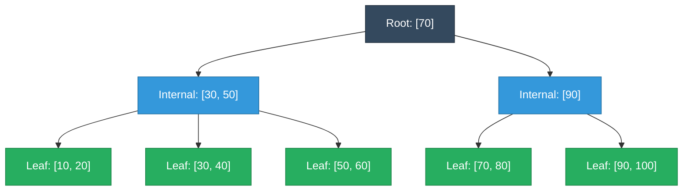
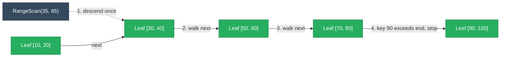

# B-Tree / B+Tree (Go & Python)

A B-tree is a self-balancing sorted tree where each node holds many keys and many children instead of the strict "one key, two children" shape of a binary tree — that's the whole design point. It exists because disk (and even RAM-vs-cache) access is dominated by the cost of a *seek*, not by the cost of a comparison once data is already in hand. A binary tree over a billion rows is ~30 levels deep, which on a disk-backed structure means up to 30 random reads for one lookup. A B-tree packs a node's worth of keys into one disk page (a few hundred to a few thousand keys per node), so the same billion rows fit in 3-4 levels — 3-4 reads instead of 30.

A B+tree is the variant that matters in practice: internal nodes hold only routing keys (no payload), every actual value lives in a leaf, and the leaves are linked together in a chain so a range scan walks sideways along the bottom of the tree instead of re-descending from the root for every key. This is the structure backing Postgres's default index type and every InnoDB table's clustered index — see [databases/postgres-internals.md](../databases/postgres-internals.md) and [databases/mysql-internals.md](../databases/mysql-internals.md) for how it's used in a real engine.

<div class="quiz-progress" data-quiz-progress>
  <span class="quiz-progress-label">0/0 checks</span>
  <span class="quiz-progress-bar"><span class="quiz-progress-fill"></span></span>
</div>

---

## Why Not Just a Binary Tree?

The comparison isn't really "O(log n) vs O(log n)" — both a balanced binary tree and a B-tree are O(log n) — it's about what the base of that logarithm costs in the real world.

| | Binary tree | B-tree (order ~400) |
|---|---|---|
| Keys per node | 1 | Up to ~400 |
| Children per node | 2 | Up to ~400 |
| Height for 1 billion keys | ~30 | ~3-4 |
| Cost per level | 1 comparison | 1 disk page fetch (then a cheap in-memory scan of ~400 keys) |
| Dominant cost | Comparisons (cheap) | Page fetches (expensive — a seek if not cached) |

Once a node's page is pulled off disk into the buffer pool, comparing against the few hundred keys inside it is essentially free — a linear or binary scan in RAM. The expensive part is the page fetch itself, so the goal is to minimize *how many pages* a lookup touches, not how many comparisons it makes. A wide, shallow tree does exactly that: the root and first couple of internal levels are small enough to stay permanently cached in memory, so most real lookups cost one actual disk read (or zero, if the leaf is cached too) rather than the "one read per level" a naive analysis suggests.

<div class="quiz-card">
  <p class="quiz-q">Why does a production B-tree use a branching factor in the hundreds instead of something small like 4, given both give O(log n) search?</p>
  <button class="quiz-reveal">Reveal answer</button>
  <div class="quiz-a" hidden>Because the expensive operation is the disk page fetch per level, not the comparison within a node. A wide branching factor means each node holds hundreds of keys sized to fill one disk page, so the tree only needs 3-4 levels to index a billion rows instead of ~30. Fewer levels means fewer possible disk seeks per lookup — the Big-O is the same, but the constant (levels × seek cost) is drastically smaller.</div>
</div>

---

## B-Tree vs B+Tree

The distinction that matters for real databases: a plain B-tree can store a value (or a pointer to one) in *any* node, internal or leaf. A B+tree pushes every value down into the leaves — internal nodes hold nothing but routing keys — and additionally links every leaf to its right-hand neighbor.

| | B-tree | B+tree |
|---|---|---|
| Where values live | Any node, internal or leaf | Leaf nodes only |
| Internal node contents | Keys + values/pointers | Routing keys only |
| Leaves linked to each other? | No | Yes — a chain via a `next` pointer |
| Range scan (`WHERE x BETWEEN a AND b`) | Re-traverse the tree in-order, revisiting internal nodes | Descend once, then walk the leaf chain |
| Used by | Rare in production engines | Postgres's default index type, InnoDB's clustered index |

The tree below is the exact shape produced by inserting the keys 10 through 100 (in steps of 10) into an order-4 B+tree (max 3 keys per node) — small numbers on purpose, so splits happen often enough to see the structure form:



Notice the root and internal nodes hold only routing keys (30, 50, 70, 90) that never appear as anyone's stored value — every actual key/value pair lives in a leaf. That's the B+tree property in one picture.

<div class="quiz-card">
  <p class="quiz-q">A B-tree index and a B+tree index both give O(log n) lookup. What's the one structural difference that makes range scans so much cheaper on a B+tree specifically?</p>
  <button class="quiz-reveal">Reveal answer</button>
  <div class="quiz-a" hidden>B+tree leaves are linked together in a chain (each leaf holds a pointer to its right-hand neighbor). Once a range scan descends to the starting leaf, it walks sideways along that chain to collect the rest of the range — no need to re-enter the tree from the root. A plain B-tree has no such leaf-to-leaf link, and values can live in internal nodes too, so collecting an ordered run means repeated in-order tree traversal instead of a flat walk.</div>
</div>

---

## Full Working Implementation

Node, insert with node-split-on-overflow, and search — the same B+tree in Go and Python. `RangeScan`/`range_scan` (covered in its own section below) is included here too since it lives on the same type.

<div class="tab-group">
  <div class="tab-buttons">
    <button data-tab="impl-go" class="active">Go</button>
    <button data-tab="impl-py">Python</button>
  </div>
  <div class="tab-panels">
    <div class="tab-panel active" data-tab-panel="impl-go">
      <pre><code class="language-go">package btree
// Node is a single B+tree node. Internal nodes hold routing keys and child
// pointers only; leaf nodes hold keys and their associated values, plus a
// pointer to the next leaf for range scans.
type Node struct {
	keys     []int
	children []*Node // internal nodes only, len(children) == len(keys)+1
	values   []int   // leaf nodes only, parallel to keys
	leaf     bool
	next     *Node // leaf chain pointer, leaf nodes only
}
// BTree is an in-memory B+tree. Order is the maximum number of children an
// internal node may have (== max keys + 1); real databases size this to the
// number of keys that fit in one disk page -- typically in the hundreds.
type BTree struct {
	root  *Node
	order int
}
// NewBTree creates an empty B+tree. order must be &gt;= 3.
func NewBTree(order int) *BTree {
	if order &lt; 3 {
		panic("btree: order must be &gt;= 3")
	}
	return &amp;BTree{root: &amp;Node{leaf: true}, order: order}
}
func (t *BTree) maxKeys() int {
	return t.order - 1
}
// Search returns the value stored for key and whether it was found.
func (t *BTree) Search(key int) (int, bool) {
	n := t.root
	for !n.leaf {
		i := 0
		for i &lt; len(n.keys) &amp;&amp; key &gt;= n.keys[i] {
			i++
		}
		n = n.children[i]
	}
	for i, k := range n.keys {
		if k == key {
			return n.values[i], true
		}
	}
	return 0, false
}
// Insert adds or updates key/value, splitting nodes top-down as needed to
// keep every node within t.maxKeys() keys.
func (t *BTree) Insert(key int, value int) {
	promotedKey, newRight := t.insert(t.root, key, value)
	if newRight != nil {
		t.root = &amp;Node{keys: []int{promotedKey}, children: []*Node{t.root, newRight}}
	}
}
// insert recurses to the correct leaf, inserts, and splits any node (leaf or
// internal) that overflows t.maxKeys(). It returns a promoted key and new
// right sibling when the current node split, or (0, nil) otherwise.
func (t *BTree) insert(n *Node, key int, value int) (int, *Node) {
	if n.leaf {
		i := 0
		for i &lt; len(n.keys) &amp;&amp; n.keys[i] &lt; key {
			i++
		}
		if i &lt; len(n.keys) &amp;&amp; n.keys[i] == key {
			n.values[i] = value
			return 0, nil
		}
		n.keys = insertIntAt(n.keys, i, key)
		n.values = insertIntAt(n.values, i, value)
		if len(n.keys) &lt;= t.maxKeys() {
			return 0, nil
		}
		return t.splitLeaf(n)
	}
	i := 0
	for i &lt; len(n.keys) &amp;&amp; key &gt;= n.keys[i] {
		i++
	}
	promoted, newChild := t.insert(n.children[i], key, value)
	if newChild == nil {
		return 0, nil
	}
	n.keys = insertIntAt(n.keys, i, promoted)
	n.children = insertNodeAt(n.children, i+1, newChild)
	if len(n.keys) &lt;= t.maxKeys() {
		return 0, nil
	}
	return t.splitInternal(n)
}
// splitLeaf splits an overflowing leaf into two, relinks the leaf chain, and
// returns the first key of the new right leaf as the promoted routing key --
// a copy, since the key must still live in the leaf for Search to find its
// value.
func (t *BTree) splitLeaf(n *Node) (int, *Node) {
	mid := len(n.keys) / 2
	right := &amp;Node{leaf: true, keys: append([]int{}, n.keys[mid:]...), values: append([]int{}, n.values[mid:]...), next: n.next}
	n.keys = n.keys[:mid]
	n.values = n.values[:mid]
	n.next = right
	return right.keys[0], right
}
// splitInternal splits an overflowing internal node. The middle key is
// removed and promoted, not copied -- an internal node holds only routing
// keys, never a value, so there is nothing left behind worth keeping.
func (t *BTree) splitInternal(n *Node) (int, *Node) {
	mid := len(n.keys) / 2
	promoted := n.keys[mid]
	right := &amp;Node{keys: append([]int{}, n.keys[mid+1:]...), children: append([]*Node{}, n.children[mid+1:]...)}
	n.keys = n.keys[:mid]
	n.children = n.children[:mid+1]
	return promoted, right
}
func insertIntAt(s []int, i int, v int) []int {
	s = append(s, 0)
	copy(s[i+1:], s[i:])
	s[i] = v
	return s
}
func insertNodeAt(s []*Node, i int, v *Node) []*Node {
	s = append(s, nil)
	copy(s[i+1:], s[i:])
	s[i] = v
	return s
}
// RangeScan returns every value with start &lt;= key &lt;= end. It descends to the
// leftmost qualifying leaf exactly once, then walks the linked leaf chain --
// never re-entering the tree from the root. This is the entire reason
// B+tree leaves are linked and plain B-tree leaves aren't.
func (t *BTree) RangeScan(start, end int) []int {
	n := t.root
	for !n.leaf {
		i := 0
		for i &lt; len(n.keys) &amp;&amp; start &gt;= n.keys[i] {
			i++
		}
		n = n.children[i]
	}
	var result []int
	for n != nil {
		for i, k := range n.keys {
			if k &gt; end {
				return result
			}
			if k &gt;= start {
				result = append(result, n.values[i])
			}
		}
		n = n.next
	}
	return result
}
// Height reports the number of levels from root to leaf, inclusive.
func (t *BTree) Height() int {
	n := t.root
	h := 1
	for !n.leaf {
		h++
		n = n.children[0]
	}
	return h
}</code></pre>
    </div>
    <div class="tab-panel" data-tab-panel="impl-py">
      <pre><code class="language-python">from typing import List, Optional, Tuple
class Node:
    """A single B+tree node. Internal nodes hold routing keys and child
    pointers only; leaf nodes hold keys and their associated values, plus a
    pointer to the next leaf for range scans."""
    def __init__(self, leaf: bool) -&gt; None:
        self.leaf = leaf
        self.keys: List[int] = []
        self.children: List["Node"] = []  # internal nodes only
        self.values: List[int] = []  # leaf nodes only, parallel to keys
        self.next: Optional["Node"] = None  # leaf chain pointer, leaf nodes only
class BPlusTree:
    """An in-memory B+tree. order is the maximum number of children an
    internal node may have (== max keys + 1); real databases size this to
    the number of keys that fit in one disk page -- typically hundreds."""
    def __init__(self, order: int) -&gt; None:
        if order &lt; 3:
            raise ValueError("order must be &gt;= 3")
        self.order = order
        self.root = Node(leaf=True)
    def _max_keys(self) -&gt; int:
        return self.order - 1
    def search(self, key: int) -&gt; Tuple[Optional[int], bool]:
        """Return (value, True) if key is present, else (None, False)."""
        n = self.root
        while not n.leaf:
            i = 0
            while i &lt; len(n.keys) and key &gt;= n.keys[i]:
                i += 1
            n = n.children[i]
        for i, k in enumerate(n.keys):
            if k == key:
                return n.values[i], True
        return None, False
    def insert(self, key: int, value: int) -&gt; None:
        """Insert or update key/value, splitting nodes top-down as needed to
        keep every node within self._max_keys() keys."""
        promoted, new_right = self._insert(self.root, key, value)
        if new_right is not None:
            new_root = Node(leaf=False)
            new_root.keys = [promoted]
            new_root.children = [self.root, new_right]
            self.root = new_root
    def _insert(self, n: Node, key: int, value: int) -&gt; Tuple[Optional[int], Optional[Node]]:
        """Recurse to the correct leaf, insert, and split any node (leaf or
        internal) that overflows. Returns a promoted key and new right
        sibling when the current node split, or (None, None) otherwise."""
        if n.leaf:
            i = 0
            while i &lt; len(n.keys) and n.keys[i] &lt; key:
                i += 1
            if i &lt; len(n.keys) and n.keys[i] == key:
                n.values[i] = value  # update existing key in place
                return None, None
            n.keys.insert(i, key)
            n.values.insert(i, value)
            if len(n.keys) &lt;= self._max_keys():
                return None, None
            return self._split_leaf(n)
        i = 0
        while i &lt; len(n.keys) and key &gt;= n.keys[i]:
            i += 1
        promoted, new_child = self._insert(n.children[i], key, value)
        if new_child is None:
            return None, None
        n.keys.insert(i, promoted)
        n.children.insert(i + 1, new_child)
        if len(n.keys) &lt;= self._max_keys():
            return None, None
        return self._split_internal(n)
    def _split_leaf(self, n: Node) -&gt; Tuple[int, Node]:
        """Split an overflowing leaf in two, relink the leaf chain, and
        return the new right leaf's first key as the promoted routing key --
        a copy, since the key must still live in the leaf for search() to
        find its value."""
        mid = len(n.keys) // 2
        right = Node(leaf=True)
        right.keys = n.keys[mid:]
        right.values = n.values[mid:]
        right.next = n.next
        n.keys = n.keys[:mid]
        n.values = n.values[:mid]
        n.next = right
        return right.keys[0], right
    def _split_internal(self, n: Node) -&gt; Tuple[int, Node]:
        """Split an overflowing internal node. The middle key is removed and
        promoted, not copied -- an internal node holds only routing keys,
        never a value, so there's nothing left behind worth keeping."""
        mid = len(n.keys) // 2
        promoted = n.keys[mid]
        right = Node(leaf=False)
        right.keys = n.keys[mid + 1:]
        right.children = n.children[mid + 1:]
        n.keys = n.keys[:mid]
        n.children = n.children[:mid + 1]
        return promoted, right
    def range_scan(self, start: int, end: int) -&gt; List[int]:
        """Return every value with start &lt;= key &lt;= end. Descends to the
        leftmost qualifying leaf exactly once, then walks the linked leaf
        chain -- never re-entering the tree from the root. This is the
        entire reason B+tree leaves are linked and plain B-tree leaves
        aren't."""
        n = self.root
        while not n.leaf:
            i = 0
            while i &lt; len(n.keys) and start &gt;= n.keys[i]:
                i += 1
            n = n.children[i]
        result: List[int] = []
        while n is not None:
            for i, k in enumerate(n.keys):
                if k &gt; end:
                    return result
                if k &gt;= start:
                    result.append(n.values[i])
            n = n.next
        return result
    def height(self) -&gt; int:
        """Number of levels from root to leaf, inclusive."""
        n = self.root
        h = 1
        while not n.leaf:
            h += 1
            n = n.children[0]
        return h</code></pre>
    </div>
  </div>
</div>

### Test cases

<div class="tab-group">
  <div class="tab-buttons">
    <button data-tab="test-go" class="active">Go</button>
    <button data-tab="test-py">Python</button>
  </div>
  <div class="tab-panels">
    <div class="tab-panel active" data-tab-panel="test-go">
      <pre><code class="language-go">package btree
import (
	"reflect"
	"testing"
)
func TestSearchFound(t *testing.T) {
	bt := NewBTree(4)
	for _, k := range []int{10, 20, 5, 6, 12, 30, 7, 17} {
		bt.Insert(k, k*100)
	}
	for _, k := range []int{10, 20, 5, 6, 12, 30, 7, 17} {
		v, ok := bt.Search(k)
		if !ok || v != k*100 {
			t.Fatalf("Search(%d) = %d, %v; want %d, true", k, v, ok, k*100)
		}
	}
	if _, ok := bt.Search(999); ok {
		t.Fatal("Search(999) should not be found")
	}
}
func TestUpdateExistingKey(t *testing.T) {
	bt := NewBTree(4)
	bt.Insert(1, 100)
	bt.Insert(1, 999) // same key again -- must update in place, not insert a duplicate
	v, ok := bt.Search(1)
	if !ok || v != 999 {
		t.Fatalf("update failed: got %d, %v", v, ok)
	}
}
// TestSplitSequenceOrder4 inserts 10,20,...,100 into an order-4 tree (max 3
// keys per node) -- deliberately tiny so splits happen constantly. The final
// shape is exactly the split-then-promote-then-split-again scenario the
// stepper in this file walks through by hand.
func TestSplitSequenceOrder4(t *testing.T) {
	bt := NewBTree(4)
	seq := []int{10, 20, 30, 40, 50, 60, 70, 80, 90, 100}
	for _, k := range seq {
		bt.Insert(k, k)
	}
	for _, k := range seq {
		v, ok := bt.Search(k)
		if !ok || v != k {
			t.Fatalf("Search(%d) after full sequence = %d, %v", k, v, ok)
		}
	}
	if bt.Height() &lt;= 1 {
		t.Fatal("tree should have split into multiple levels")
	}
	if bt.root.keys[0] != 70 || len(bt.root.children) != 2 {
		t.Fatalf("expected root [70] with 2 children after this exact sequence, got keys=%v children=%d", bt.root.keys, len(bt.root.children))
	}
}
func TestRangeScan(t *testing.T) {
	bt := NewBTree(4)
	for k := 1; k &lt;= 20; k++ {
		bt.Insert(k, k*10)
	}
	got := bt.RangeScan(5, 12)
	want := []int{50, 60, 70, 80, 90, 100, 110, 120}
	if !reflect.DeepEqual(got, want) {
		t.Fatalf("RangeScan(5,12) = %v, want %v", got, want)
	}
}
func TestRangeScanNoMatch(t *testing.T) {
	bt := NewBTree(4)
	for _, k := range []int{1, 2, 3} {
		bt.Insert(k, k)
	}
	got := bt.RangeScan(100, 200)
	if len(got) != 0 {
		t.Fatalf("expected empty, got %v", got)
	}
}</code></pre>
    </div>
    <div class="tab-panel" data-tab-panel="test-py">
      <pre><code class="language-python">from btree import BPlusTree
def test_search_found_and_missing() -&gt; None:
    t = BPlusTree(order=4)
    for k in [10, 20, 5, 6, 12, 30, 7, 17]:
        t.insert(k, k * 100)
    for k in [10, 20, 5, 6, 12, 30, 7, 17]:
        v, ok = t.search(k)
        assert ok and v == k * 100, f"search({k}) = {v}, {ok}"
    v, ok = t.search(999)
    assert not ok, "search(999) should not be found"
def test_update_existing_key() -&gt; None:
    t = BPlusTree(order=4)
    t.insert(1, 100)
    t.insert(1, 999)  # same key again -- must update in place, not duplicate
    v, ok = t.search(1)
    assert ok and v == 999, f"update failed: {v}, {ok}"
def test_split_sequence_order_4() -&gt; None:
    # order=4 -&gt; max 3 keys/node, deliberately tiny so splits happen
    # constantly. The final shape is exactly the split-then-promote-then-
    # split-again scenario the stepper in this file walks through by hand.
    t = BPlusTree(order=4)
    seq = [10, 20, 30, 40, 50, 60, 70, 80, 90, 100]
    for k in seq:
        t.insert(k, k)
    for k in seq:
        v, ok = t.search(k)
        assert ok and v == k, f"search({k}) after full sequence: {v}, {ok}"
    assert t.height() &gt; 1, "tree should have split into multiple levels"
    assert t.root.keys == [70] and len(t.root.children) == 2, (
        f"expected root [70] with 2 children, got keys={t.root.keys} "
        f"children={len(t.root.children)}"
    )
def test_range_scan() -&gt; None:
    t = BPlusTree(order=4)
    for k in range(1, 21):
        t.insert(k, k * 10)
    result = t.range_scan(5, 12)
    assert result == [k * 10 for k in range(5, 13)], result
def test_range_scan_no_match() -&gt; None:
    t = BPlusTree(order=4)
    for k in [1, 2, 3]:
        t.insert(k, k)
    assert t.range_scan(100, 200) == []</code></pre>
    </div>
  </div>
</div>

Both sides run standalone: `go test ./...` for the Go file (`package btree`, same package for implementation and tests), or `pytest test_btree.py` for the Python file (`from btree import BPlusTree`, implementation in a sibling `btree.py`). `TestSplitSequenceOrder4`/`test_split_sequence_order_4` pins down the exact tree shape the stepper below walks through by hand — it's not an arbitrary example, it's this repo's actual test fixture.

---

## Insert That Causes a Split, Step by Step

This is the one part of a B-tree that's genuinely hard to hold in your head from static prose — walk it forward one insert at a time. It picks up exactly where `TestSplitSequenceOrder4` leaves off: an order-4 tree (max 3 keys per node) that has already absorbed keys 10 through 90, about to receive one more.

<div class="stepper">
  <div class="stepper-panels">
    <div class="stepper-panel active">
      <strong>1. Before the insert, the target leaf is already full.</strong> The root holds <code>[30, 50, 70]</code> (also at its 3-key limit) with four leaf children. The rightmost leaf is <code>[70, 80, 90]</code> — exactly 3 keys, the max this order allows, but not yet overflowing.
    </div>
    <div class="stepper-panel">
      <strong>2. Key 100 arrives.</strong> Descending from the root: <code>100 &gt;= 70</code>, so it routes into the last child, the leaf <code>[70, 80, 90]</code>. Inserted in sorted position, that leaf becomes <code>[70, 80, 90, 100]</code> — 4 keys, one over the order-4 limit of 3. It overflows.
    </div>
    <div class="stepper-panel">
      <strong>3. The leaf splits in two.</strong> The midpoint splits it into <code>[70, 80]</code> (stays in place) and a brand-new leaf <code>[90, 100]</code>. The leaf chain is relinked so the old leaf's <code>next</code> pointer now points at the new one. The new leaf's first key, <strong>90</strong>, is promoted up to the parent as a <em>copy</em> — it still has to live in the leaf itself, since that's where <code>search()</code> looks for its value.
    </div>
    <div class="stepper-panel">
      <strong>4. The promoted key arrives at the parent.</strong> The root was already at <code>[30, 50, 70]</code> — 3 keys, its own limit. Inserting the new routing key 90 (plus a pointer to the new leaf) makes it <code>[30, 50, 70, 90]</code> — 4 keys, over the order-4 limit. The parent itself now overflows too.
    </div>
    <div class="stepper-panel">
      <strong>5. The parent splits too.</strong> This is an <em>internal</em> split, not a leaf split: the middle key, <strong>70</strong>, is removed from the node and promoted further up — not copied, because an internal node never holds a value, so there's nothing worth leaving behind. Left keeps <code>[30, 50]</code> with the first 3 children; right keeps <code>[90]</code> with the last 2 children.
    </div>
    <div class="stepper-panel">
      <strong>6. A brand-new root is created.</strong> It holds just <code>[70]</code>, pointing at the two halves from step 5. The tree just grew one level taller — from 2 levels to 3. This is the <em>only</em> way a B+tree's height increases: growth happens at the top, from a split that reaches all the way past the old root, never from the bottom.
    </div>
  </div>
  <div class="stepper-controls">
    <button class="stepper-prev">← Prev</button>
    <span class="stepper-dots"></span>
    <span class="stepper-label"></span>
    <button class="stepper-next">Next →</button>
  </div>
</div>

The end state of this walkthrough is exactly the tree pictured in the Mermaid diagram above — root `[70]`, two internal children `[30, 50]` and `[90]`, five leaves underneath. Splits cascade upward one level at a time and stop the moment they hit a node with room to spare; they only reach the root (and grow the tree) when every ancestor on the path was already full.

---

## Linked-Leaf Range Scan

`RangeScan`/`range_scan` (defined above, alongside the rest of the tree) is the payoff for keeping every value in a leaf and linking the leaves together. Once it finds the leftmost leaf that could contain `start`, it never touches an internal node again — it just follows `next` pointers along the bottom of the tree, collecting matches until a key exceeds `end`.



`RangeScan(35, 85)` on this tree descends once to leaf `[30, 40]` (the leaf that could hold key 35), then walks `next` three times, collecting 40, 50, 60, 70, 80 along the way, and stops as soon as it sees 90 — a key past `end`. A plain B-tree without linked leaves would instead have to re-run an in-order traversal (root, subtree, root, subtree...) for the same range, paying an extra tree descent per hop instead of one pointer follow.

```go
scan := t.RangeScan(35, 85) // walks the leaf chain only -- no re-descent per key
```

<div class="quiz-card">
  <p class="quiz-q">Why does RangeScan only descend from the root once, no matter how many keys fall inside the requested range?</p>
  <button class="quiz-reveal">Reveal answer</button>
  <div class="quiz-a" hidden>Because B+tree leaves are linked via a <code>next</code> pointer. After finding the first qualifying leaf, every subsequent key in range is just one more pointer hop along the bottom of the tree — an O(1) step per leaf — rather than a fresh O(log n) descent from the root for each key, which is what a tree without linked leaves would require.</div>
</div>

---

## Complexity Analysis

| Operation | Time | Why |
|---|---|---|
| `Search`/`search` | O(log_b n) | b = branching factor (order); each level eliminates all but one of up to b subtrees |
| `Insert`/`insert` | O(log_b n) | One descent to the target leaf, plus at most one split per ancestor on the path back to the root |
| `RangeScan`/`range_scan` (k results) | O(log_b n + k) | One descent to the first leaf, then k O(1) hops along the leaf chain |
| Space | O(n) | Every key is stored exactly once (in a leaf); tree height is O(log_b n) |

The base `b` is the entire reason this data structure exists. Two trees holding the same 1 billion keys:

- Branching factor 4 (like the toy example above): `log_4(1,000,000,000) ≈ 15` levels.
- Branching factor 400 (realistic for an 8KB disk page with small keys): `log_400(1,000,000,000) ≈ 3.4`, so 4 levels.

Same asymptotic complexity, wildly different constant. If each level is a potential disk page fetch, that's the difference between ~15 possible seeks and ~4 — and in practice the top few levels of a 4-level tree fit entirely in the buffer pool/page cache, so a warm lookup often costs one real I/O, not four. This is the single most interview-relevant fact in this file: **the branching factor isn't a tuning knob for asymptotic complexity, it's a tuning knob for disk I/O**, and that's why it's chosen based on page size and key size, not on what looks tidy in a textbook diagram.

<div class="quiz-card">
  <p class="quiz-q">Two B-trees hold the same 1 billion keys — one with branching factor 4, one with branching factor 400. Both are "O(log n)." Why does that matter operationally anyway?</p>
  <button class="quiz-reveal">Reveal answer</button>
  <div class="quiz-a" hidden>Because the base of the logarithm is the branching factor, and it changes the constant by an order of magnitude: log&#8324;(1e9) &#8776; 15 levels vs log&#8324;&#8320;&#8320;(1e9) &#8776; 3-4 levels. If each level can mean a disk page fetch, that's ~15 possible seeks vs ~4 for the exact same dataset — which is why real databases size the branching factor to whatever fits in one disk page (hundreds to low thousands of keys), not to some small textbook-friendly number.</div>
</div>

---

## Interview Follow-Ups

### 1. What happens on delete — merge and borrow

Not implemented above (this file focuses on the insert/split path, the one that comes up most often), but worth being able to describe: deleting a key from a leaf can leave that leaf under the minimum key count (roughly `order/2 - 1`). The fix mirrors insert's overflow handling, just in the opposite direction:

- **Borrow from a sibling**, if one has keys to spare: rotate a key through the shared parent so both siblings stay above the minimum, no structural change beyond that.
- **Merge with a sibling**, if neither has keys to spare: combine the two nodes into one and pull the separating key down from the parent (for a leaf merge) or drop it entirely (for an internal merge, since it becomes redundant once its two children are combined).

Merging can itself under-fill the *parent*, which cascades the same borrow-or-merge decision one level up — symmetric to how an insert's overflow cascades splits upward. If a merge empties the root down to a single child, that child becomes the new root and the tree shrinks by one level. Just like growth, shrinkage only ever happens at the top.

### 2. Why hundreds, not 4, in a real database

Branching factor is chosen as `page_size / (key_size + pointer_size)`, not picked for tidiness. An 8KB page with ~16 bytes per key+pointer entry gives a fan-out around 500. Push the branching factor up and the tree gets shallower (fewer forced disk seeks per operation); push it down and the tree gets taller for the same dataset. The floor on how *low* it can practically go is what a toy example like this file's order-4 tree demonstrates: small enough to see the splitting mechanics by hand, useless as an actual index because the height explodes for any real dataset size.

### 3. Concurrent access — why real engines don't just lock the whole tree

A single mutex around the whole structure would serialize every reader and writer, which doesn't survive contact with a real OLTP workload. Postgres and InnoDB instead use **latch coupling** (a.k.a. crabbing): hold a latch on the current node only long enough to determine it's "safe" (won't split or merge as a result of this operation), then release the parent's latch before descending further. That keeps concurrent operations on unrelated subtrees from blocking each other, at the cost of more careful bookkeeping than a single global lock.

### 4. Why not a hash index instead

A hash index gives O(1) equality lookup, strictly better than a B-tree's O(log n) — but hashing destroys ordering by design, so it can't answer a range query (`BETWEEN`, `<`, `>`), can't satisfy an `ORDER BY` without a separate sort, and can't do prefix matching. A B-tree trades away that O(1) for the ability to answer any of those. This is exactly why Postgres's B-tree is the *default* index type and its hash index type is a narrow special case, not the other way around.

### 5. B+tree vs LSM-tree — the other major on-disk structure

The other index structure that comes up as a comparison: an LSM-tree (RocksDB, Cassandra, LevelDB) buffers writes in memory and flushes them as sorted, immutable runs, merging (compacting) runs together in the background. That makes writes cheap (sequential, no in-place update) at the cost of reads sometimes checking multiple levels/runs (mitigated with bloom filters — see [bloom-filter.md](./bloom-filter.md)) and background compaction using extra I/O. A B+tree does the opposite trade: in-place updates keep reads simple and single-path, at the cost of write amplification from page splits and random-ish writes. This is why write-heavy KV stores often default to LSM-trees while general-purpose OLTP engines (Postgres, MySQL) default to B+trees.
