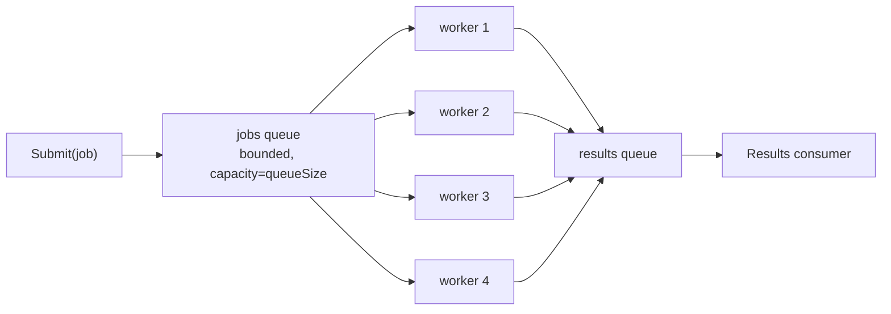
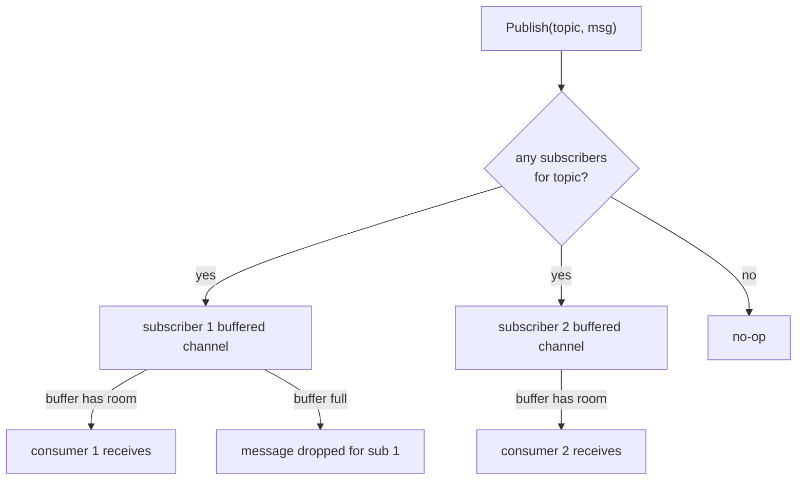
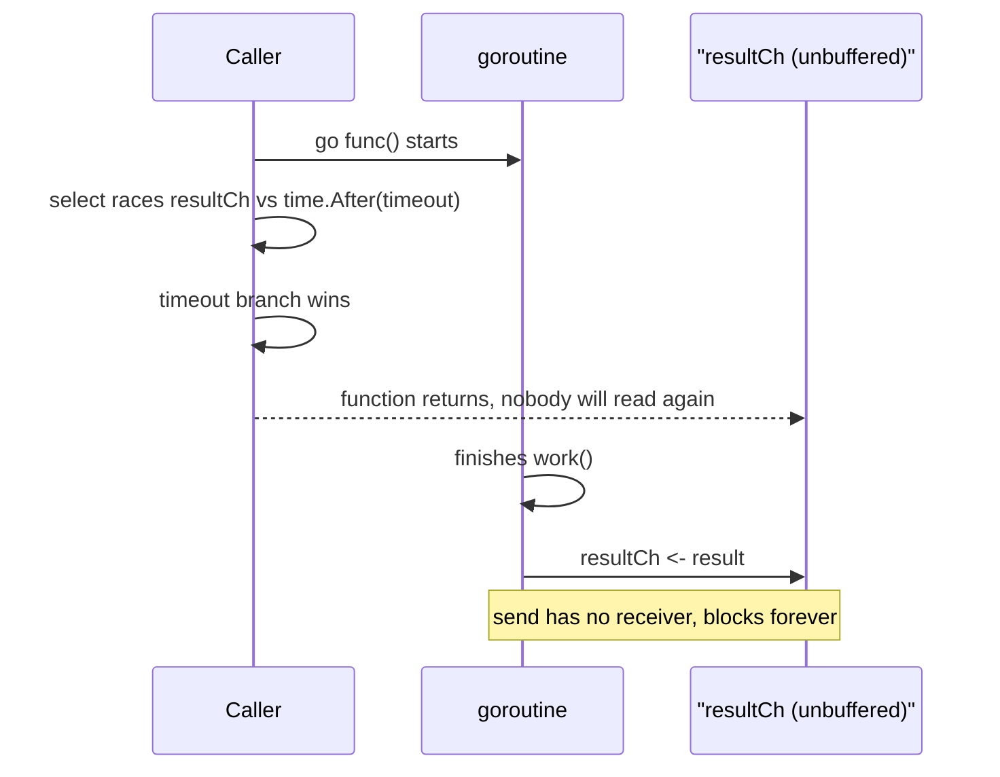
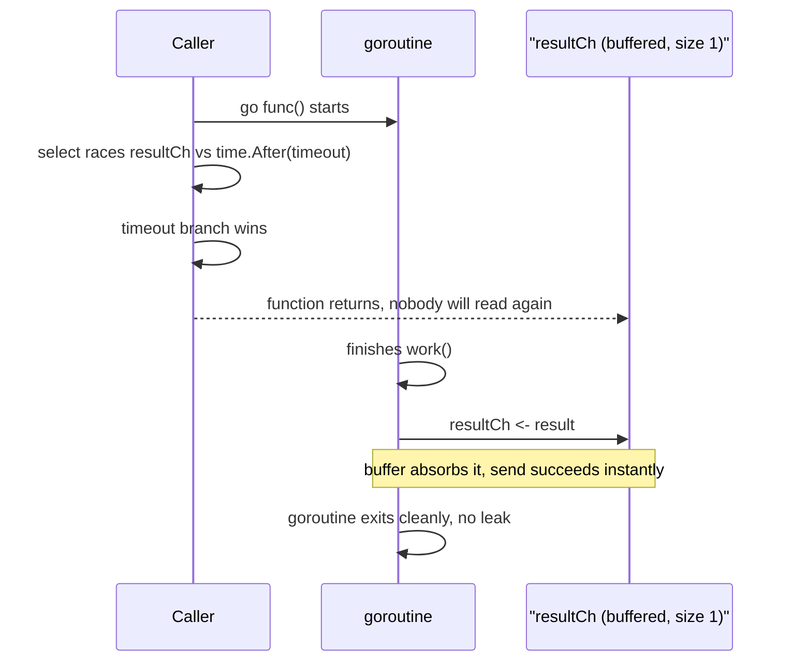

# Concurrency Patterns — Interview Questions (Go)

Common Go concurrency interview questions with working solutions. Assumes familiarity with goroutines/channels; focuses on the patterns that come up repeatedly in backend/infra interviews.

Each pattern below now also includes an equally complete Python implementation, using Python's real concurrency primitives — `threading`, `queue`, `concurrent.futures`, `asyncio` — not line-for-line translations. Where Go and Python honestly diverge (the GIL, cooperative-only cancellation, no channel-close equivalent), the notes say so directly instead of papering over it.

  0/0 checks
  

---

## 1. Thread-Safe Counter: Mutex vs Atomic

Go gives you two genuinely different mechanisms here. Python's version of this question has a sharper edge: it does **not** have a lock-free atomic increment at the language level, and the GIL is the honest reason why — not a reason the question doesn't apply.

  

    <button data-tab="counter-go" class="active">Go</button>
    <button data-tab="counter-py">Python</button>
  

  

    

      <pre><code class="language-go">package concurrency

import (
	"sync"
	"sync/atomic"
)

// MutexCounter protects an int64 with a sync.Mutex.
type MutexCounter struct {
	mu    sync.Mutex
	value int64
}

func (c *MutexCounter) Inc() {
	c.mu.Lock()
	c.value++
	c.mu.Unlock()
}

func (c *MutexCounter) Value() int64 {
	c.mu.Lock()
	defer c.mu.Unlock()
	return c.value
}

// AtomicCounter uses sync/atomic — no lock, just a CPU-level atomic
// instruction (CAS or fetch-and-add depending on architecture).
type AtomicCounter struct {
	value int64
}

func (c *AtomicCounter) Inc() {
	atomic.AddInt64(&amp;c.value, 1)
}

func (c *AtomicCounter) Value() int64 {
	return atomic.LoadInt64(&amp;c.value)
}</code></pre>
      
<strong>Benchmark comparison</strong>

      <pre><code class="language-go">package concurrency

import (
	"sync"
	"testing"
)

func BenchmarkMutexCounter(b *testing.B) {
	c := &amp;MutexCounter{}
	var wg sync.WaitGroup
	b.ResetTimer()
	for i := 0; i &lt; b.N; i++ {
		wg.Add(1)
		go func() {
			defer wg.Done()
			c.Inc()
		}()
	}
	wg.Wait()
}

func BenchmarkAtomicCounter(b *testing.B) {
	c := &amp;AtomicCounter{}
	var wg sync.WaitGroup
	b.ResetTimer()
	for i := 0; i &lt; b.N; i++ {
		wg.Add(1)
		go func() {
			defer wg.Done()
			c.Inc()
		}()
	}
	wg.Wait()
}</code></pre>
    

    

      <pre><code class="language-python">import itertools
import threading

class LockCounter:
    """Protects an int with a threading.Lock — the direct equivalent of
    Go's sync.Mutex. Correct regardless of what CPython's GIL does or
    doesn't guarantee, and the only safe choice once a critical section
    spans more than one statement."""

    def __init__(self):
        self._lock = threading.Lock()
        self._value = 0

    def inc(self):
        with self._lock:
            self._value += 1

    def value(self):
        with self._lock:
            return self._value

class NaiveCounter:
    """BROKEN — and NOT something to rely on even under the classic GIL,
    let alone free-threaded Python 3.13+ (--disable-gil). `self._value += 1`
    compiles to three bytecodes (load, add, store). The GIL can switch
    threads between any of them, so two threads can both read the same old
    value before either writes back — a lost update. This is the race
    both sync.Mutex and sync/atomic prevent in Go; Python's GIL does NOT
    prevent it, because the GIL only guarantees one bytecode runs at a
    time, not one *statement*."""

    def __init__(self):
        self._value = 0

    def inc(self):
        self._value += 1  # NOT atomic — classic lost-update race

    def value(self):
        return self._value

class GilAtomicCounter:
    """The closest Python gets to Go's lock-free sync/atomic — not by
    making `+= 1` atomic (nothing does that without a lock), but by using
    an operation CPython itself implements as one C-level, GIL-uninterrupted
    step: itertools.count().__next__(). This is the honest answer to "does
    Python have an atomic increment?" — there is no general-purpose,
    lock-free, single-value atomic primitive at the language level the way
    sync/atomic is in Go. A handful of individual C-implemented operations
    (this one, list.append, dict.__setitem__) happen to be safe under the
    GIL; arbitrary compound operations like `+=` on a plain int are not."""

    def __init__(self):
        self._counter = itertools.count()
        self._last = 0

    def inc(self):
        self._last = next(self._counter)  # atomic: one C-level step

    def value(self):
        return self._last</code></pre>
      
<strong>Benchmark comparison</strong>

      <pre><code class="language-python">import threading
import time

def bench(counter, n_threads=50, increments=20000):
    threads = []

    def worker():
        for _ in range(increments):
            counter.inc()

    start = time.perf_counter()
    for _ in range(n_threads):
        t = threading.Thread(target=worker)
        threads.append(t)
        t.start()
    for t in threads:
        t.join()
    elapsed = time.perf_counter() - start

    expected = n_threads * increments
    print(f"{type(counter).__name__}: {elapsed:.3f}s "
          f"value={counter.value()} expected={expected}")

bench(LockCounter())        # value == expected, every time
bench(NaiveCounter())       # value &lt; expected — lost updates, reproducibly
bench(GilAtomicCounter())   # value == expected, but see the note below

# GIL honesty check: this benchmark measures CORRECTNESS, not speedup.
# Unlike Go's benchmark (real OS threads, real parallel cores), CPython's
# GIL means only one thread executes bytecode at a time — these 50
# threads take turns, they don't run concurrently on 50 cores. LockCounter
# will often look no slower than GilAtomicCounter here, sometimes faster,
# because lock acquisition inside the GIL is cheap when there's no true
# hardware contention to begin with. To see a real throughput difference
# in Python you need multiprocessing (separate processes, separate GILs)
# or free-threaded (--disable-gil) builds — not threading.</code></pre>
    

  

| | Mutex | Atomic |
|---|---|---|
| Mechanism | OS/runtime-level lock, goroutine may park if contended | Single CPU instruction (LOCK XADD / CAS), never parks |
| Overhead | Higher — lock acquisition, possible goroutine scheduling | Lower — no scheduler involvement in the common case |
| Use for | Protecting multiple related fields / complex invariants | A single primitive value (counter, flag, pointer swap) |
| Composability | Can protect a critical section spanning multiple statements/fields | Only atomic on one value at a time — can't atomically update two related fields together |
| Typical interview answer | "Use atomic for a single counter; mutex once you need to protect more than one related field together" | |

**Follow-up interviewers often ask:** "What if you need to increment the counter AND check a condition atomically?" — that requires a mutex (or CAS loop), because `atomic` only guarantees atomicity of the single operation, not a check-then-act sequence across multiple values.

**Python has no direct equivalent of `sync/atomic`.** `threading.Lock` is the real counterpart to `sync.Mutex`. For "atomic," the honest answer is that CPython's GIL guarantees only one thread executes bytecode at a time — it does **not** guarantee a compound operation like `value += 1` is atomic, because that single line is actually three bytecodes (load, add, store) the GIL can switch threads between. The nearest thing to a lock-free atomic is reaching for a single C-implemented operation the GIL can't interrupt mid-step, like `itertools.count().__next__()` — a narrow trick, not a general primitive the way `sync/atomic` is in Go.

  

    <button data-toggle-opt="single" class="active">Single counter</button>
    <button data-toggle-opt="multi">Multiple related fields</button>
  

  

    Reach for <code>sync/atomic</code> in Go. One value, one CPU instruction, no goroutine parking — this is exactly the case atomic was built for. In Python, this is the narrow case where a GIL-atomic C-level op (like <code>itertools.count()</code>) can stand in for it, though it's a much smaller toolbox than Go's.
  

  

    Reach for <code>sync.Mutex</code> in Go, or <code>threading.Lock</code> in Python. The moment two related fields need to change together, or you need check-then-act, atomic can't help in either language — it only guarantees atomicity of one operation on one value, never a critical section spanning several.
  

  
Given that sync/atomic never parks a goroutine and sync.Mutex sometimes does, is atomic guaranteed to be faster?

  <button class="quiz-reveal">Reveal answer</button>
  

    Not automatically — "lock-free" and "faster" aren't the same claim. The real reason to reach for atomic is composability of the use case, not raw speed: it's only correct for a single primitive value, and it can't atomically execute a check-then-act across multiple fields, where a mutex becomes mandatory regardless of atomic's lower per-op overhead. The Python benchmark note makes this concrete from the other direction: under the GIL, lock acquisition is cheap when there's no real hardware contention to begin with, so a <code>threading.Lock</code>-based counter can end up just as fast as the <code>itertools.count()</code> GIL-atomic version — in neither language does "atomic" automatically mean "wins the race."
  

---

## 2. Bounded Worker Pool

  

    <button data-tab="pool-go" class="active">Go</button>
    <button data-tab="pool-py">Python</button>
  

  

    

      <pre><code class="language-go">package concurrency

import "sync"

// Job is a unit of work; Result is its outcome.
type Job struct {
	ID    int
	Input int
}

type Result struct {
	JobID  int
	Output int
	Err    error
}

// WorkerPool processes jobs with a fixed number of concurrent workers,
// bounding resource usage regardless of how many jobs are submitted.
type WorkerPool struct {
	numWorkers int
	jobs       chan Job
	results    chan Result
	wg         sync.WaitGroup
}

func NewWorkerPool(numWorkers, queueSize int) *WorkerPool {
	return &amp;WorkerPool{
		numWorkers: numWorkers,
		jobs:       make(chan Job, queueSize),
		results:    make(chan Result, queueSize),
	}
}

// Start launches the fixed worker goroutines. Call once before Submit.
func (p *WorkerPool) Start(process func(Job) (int, error)) {
	for i := 0; i &lt; p.numWorkers; i++ {
		p.wg.Add(1)
		go p.worker(process)
	}
}

func (p *WorkerPool) worker(process func(Job) (int, error)) {
	defer p.wg.Done()
	for job := range p.jobs { // exits automatically when jobs channel is closed
		output, err := process(job)
		p.results &lt;- Result{JobID: job.ID, Output: output, Err: err}
	}
}

// Submit enqueues a job. Blocks if the queue is full (backpressure).
func (p *WorkerPool) Submit(j Job) {
	p.jobs &lt;- j
}

// Close signals no more jobs will be submitted, then waits for all
// in-flight jobs to finish and closes the results channel so range-readers
// terminate cleanly.
func (p *WorkerPool) Close() {
	close(p.jobs)
	p.wg.Wait()
	close(p.results)
}

func (p *WorkerPool) Results() &lt;-chan Result {
	return p.results
}</code></pre>
      
<strong>Usage example</strong>

      <pre><code class="language-go">pool := NewWorkerPool(4, 100) // 4 workers, queue capacity 100
pool.Start(func(j Job) (int, error) {
	return j.Input * 2, nil
})

go func() {
	for i := 0; i &lt; 20; i++ {
		pool.Submit(Job{ID: i, Input: i})
	}
	pool.Close() // safe to call from a separate goroutine once all Submits are done
}()

for res := range pool.Results() {
	_ = res // consume results as they complete, unordered across workers
}</code></pre>
    

    

      <pre><code class="language-python">import queue
import threading
from dataclasses import dataclass
from typing import Callable, Optional

@dataclass
class Job:
    id: int
    input: int

@dataclass
class Result:
    job_id: int
    output: int
    err: Optional[Exception] = None

class WorkerPool:
    """Processes jobs with a fixed number of worker threads, bounding
    resource usage regardless of how many jobs are submitted — a direct
    port of the Go WorkerPool, using queue.Queue instead of channels.

    One real API gap vs. Go: a channel has a built-in closed state that
    range-over-channel detects automatically. queue.Queue has no close()
    at all — the idiomatic Python fix is a sentinel value (None, below),
    one per worker, so every worker's blocking get() eventually receives
    its own "stop" signal instead of an implicit closed-channel event."""

    def __init__(self, num_workers: int, queue_size: int):
        self.num_workers = num_workers
        self.jobs: "queue.Queue[Optional[Job]]" = queue.Queue(maxsize=queue_size)
        self.results: "queue.Queue[Result]" = queue.Queue(maxsize=queue_size)
        self._threads = []

    def start(self, process: Callable[[Job], int]):
        """Launches the fixed worker threads. Call once before submit()."""
        for _ in range(self.num_workers):
            t = threading.Thread(target=self._worker, args=(process,))
            t.start()
            self._threads.append(t)

    def _worker(self, process):
        while True:
            job = self.jobs.get()
            if job is None:  # sentinel: no more work, exit
                break
            try:
                output = process(job)
                self.results.put(Result(job.id, output))
            except Exception as e:  # noqa: BLE001 — mirror Go's err return
                self.results.put(Result(job.id, 0, e))

    def submit(self, job: Job):
        """Blocks if the queue is full — backpressure, same as Go's
        buffered-channel send."""
        self.jobs.put(job)

    def close(self):
        """Signals no more jobs, then waits for all in-flight jobs to
        finish. Sends one None sentinel per worker instead of Go's
        single close(p.jobs) call."""
        for _ in range(self.num_workers):
            self.jobs.put(None)
        for t in self._threads:
            t.join()

# Idiomatic alternative for the common case: concurrent.futures.
# ThreadPoolExecutor gives you the same bounded-worker-count guarantee
# with far less boilerplate, at the cost of the explicit Job/Result
# shapes above — reach for this first unless you need the custom
# queue semantics (e.g. bounded backpressure on submission itself).
from concurrent.futures import ThreadPoolExecutor, as_completed

def process(job: Job) -&gt; int:
    return job.input * 2

def run_with_thread_pool_executor():
    with ThreadPoolExecutor(max_workers=4) as pool:
        futures = {pool.submit(process, Job(i, i)): i for i in range(20)}
        for future in as_completed(futures):
            result = future.result()  # consume as they complete, unordered</code></pre>
      
<strong>Usage example</strong>

      <pre><code class="language-python">pool = WorkerPool(4, 100)  # 4 workers, queue capacity 100
pool.start(lambda job: job.input * 2)

def submit_all():
    for i in range(20):
        pool.submit(Job(i, i))
    pool.close()  # safe to call from a separate thread once all submits are done

threading.Thread(target=submit_all).start()

# No closed-channel signal to range over, so the consumer has to know how
# many results to expect — here, exactly 20 (one per submitted job).
for _ in range(20):
    result = pool.results.get()
    _ = result  # consume results as they complete, unordered across workers</code></pre>
    

  

**Key interview point:** the pool is *bounded* because exactly `numWorkers` goroutines exist regardless of job volume — unlike naively spawning a goroutine per job (`go process(job)`), which has no upper bound on concurrent goroutines and can exhaust memory/file descriptors under load.

**Python API gap worth calling out honestly:** a Go channel has a built-in closed state that `range` detects automatically, so `close(p.jobs)` alone unblocks every worker. `queue.Queue` has no `close()` at all — the idiomatic Python fix is a sentinel value (`None`), sent once per worker, which is why the Python `close()` above loops `num_workers` times instead of making one call. It's the same shutdown intent, implemented with a different vocabulary because the primitive itself is missing the feature.

  
Why is spawning a bare go process(job) (or its Python equivalent, a fresh thread per job) dangerous compared to the bounded WorkerPool above, even though both eventually process every job?

  <button class="quiz-reveal">Reveal answer</button>
  

    The pool is bounded because exactly <code>numWorkers</code> goroutines (or worker threads) exist regardless of job volume. A goroutine- or thread-per-job has no upper bound on concurrent goroutines/threads and can exhaust memory or file descriptors under load — a burst of 100,000 jobs means 100,000 concurrently live workers competing for the same CPU and memory, instead of a fixed, predictable number processing a queue.
  

---

## 3. Pub/Sub System Using Channels

  

    <button data-tab="pubsub-go" class="active">Go</button>
    <button data-tab="pubsub-py">Python</button>
  

  

    

      <pre><code class="language-go">package concurrency

import "sync"

// PubSub is an in-process publish/subscribe broker. Each subscriber gets
// its own buffered channel; publishing never blocks on a slow subscriber
// beyond that subscriber's buffer (messages are dropped past that point
// in this implementation — see the comment in Publish).
type PubSub struct {
	mu     sync.RWMutex
	subs   map[string][]chan string // topic -&gt; list of subscriber channels
	closed bool
}

func NewPubSub() *PubSub {
	return &amp;PubSub{subs: make(map[string][]chan string)}
}

// Subscribe returns a channel that receives all messages published to topic.
// bufferSize controls how many messages can queue before Publish drops them
// for this slow subscriber (a design choice: prevents one slow subscriber
// from blocking or slowing down all publishers).
func (ps *PubSub) Subscribe(topic string, bufferSize int) &lt;-chan string {
	ps.mu.Lock()
	defer ps.mu.Unlock()

	ch := make(chan string, bufferSize)
	ps.subs[topic] = append(ps.subs[topic], ch)
	return ch
}

// Publish sends msg to every subscriber of topic. Non-blocking per
// subscriber: if a subscriber's buffer is full, that message is dropped
// for that subscriber rather than blocking the publisher indefinitely.
func (ps *PubSub) Publish(topic, msg string) {
	ps.mu.RLock()
	defer ps.mu.RUnlock()

	if ps.closed {
		return
	}
	for _, ch := range ps.subs[topic] {
		select {
		case ch &lt;- msg:
		default:
			// Subscriber buffer full — drop rather than block the publisher.
			// A production system would count/log this as a metric.
		}
	}
}

// Close shuts down the broker, closing every subscriber channel so
// range-readers terminate.
func (ps *PubSub) Close() {
	ps.mu.Lock()
	defer ps.mu.Unlock()

	ps.closed = true
	for _, chans := range ps.subs {
		for _, ch := range chans {
			close(ch)
		}
	}
}</code></pre>
      
<strong>Usage example</strong>

      <pre><code class="language-go">ps := NewPubSub()
sub1 := ps.Subscribe("orders", 10)
sub2 := ps.Subscribe("orders", 10)

go func() {
	for msg := range sub1 {
		_ = msg // handle order event
	}
}()
go func() {
	for msg := range sub2 {
		_ = msg
	}
}()

ps.Publish("orders", "order-123-created")
ps.Close()</code></pre>
    

    

      <pre><code class="language-python">import asyncio

class PubSub:
    """asyncio equivalent of the channel-based PubSub above. Each
    subscriber gets its own bounded asyncio.Queue; publishing never blocks
    on a slow subscriber past that subscriber's buffer — messages are
    dropped past that point, exactly like the Go version's select/default.

    Same close() gap as the worker pool: asyncio.Queue has no close()
    either, so shutdown uses a sentinel value per subscriber instead of a
    built-in closed state."""

    def __init__(self):
        self._subs: dict[str, list[asyncio.Queue]] = {}
        self._closed = False

    def subscribe(self, topic: str, buffer_size: int) -&gt; asyncio.Queue:
        q = asyncio.Queue(maxsize=buffer_size)
        self._subs.setdefault(topic, []).append(q)
        return q

    def publish(self, topic: str, msg: str):
        """Non-blocking per subscriber: put_nowait mirrors Go's
        select/default — if a subscriber's queue is full, the message is
        dropped for that subscriber rather than blocking the publisher."""
        if self._closed:
            return
        for q in self._subs.get(topic, []):
            try:
                q.put_nowait(msg)
            except asyncio.QueueFull:
                pass  # subscriber buffer full — drop, a production system
                      # would count/log this as a metric, same as the Go version

    def close(self):
        self._closed = True
        for queues in self._subs.values():
            for q in queues:
                q.put_nowait(None)  # sentinel — see the class docstring

# Simpler alternative when you don't need buffering or backpressure at
# all: a plain dict of topic -&gt; list of callbacks, invoked synchronously
# inside publish(). No asyncio, no queues — but the publisher now blocks
# on however long each subscriber's callback takes, with zero isolation
# between a fast subscriber and a slow one. Fine for small, trusted,
# fast handlers; wrong the moment one subscriber does I/O.
class CallbackPubSub:
    def __init__(self):
        self._subs: dict[str, list] = {}

    def subscribe(self, topic: str, callback):
        self._subs.setdefault(topic, []).append(callback)

    def publish(self, topic: str, msg: str):
        for callback in self._subs.get(topic, []):
            callback(msg)  # runs inline — a slow callback stalls every publish</code></pre>
      
<strong>Usage example</strong>

      <pre><code class="language-python">async def main():
    ps = PubSub()
    sub1 = ps.subscribe("orders", 10)
    sub2 = ps.subscribe("orders", 10)

    async def consume(sub, name):
        while True:
            msg = await sub.get()
            if msg is None:  # sentinel from close()
                break
            _ = msg  # handle order event

    task1 = asyncio.create_task(consume(sub1, "sub1"))
    task2 = asyncio.create_task(consume(sub2, "sub2"))

    ps.publish("orders", "order-123-created")
    ps.close()
    await asyncio.gather(task1, task2)

asyncio.run(main())</code></pre>
    

  

**Follow-up interviewers ask:** "What if Publish must guarantee delivery instead of dropping?" — answer: block on `ch <- msg` instead of `select/default`, but then document that a single slow/stuck subscriber can stall every publisher (a classic head-of-line blocking tradeoff), or use per-subscriber goroutines with their own unbounded queue (at the cost of unbounded memory growth if a subscriber never catches up).

**Same close() gap as the worker pool:** `asyncio.Queue` has no `close()` either, so the Python version shuts down with a `None` sentinel per subscriber queue, same as the worker pool's jobs queue above.

  
If Publish blocked on ch &lt;- msg instead of using select/default, and one subscriber's consumer stopped draining its channel forever, what happens to every other subscriber and every future Publish call?

  <button class="quiz-reveal">Reveal answer</button>
  

    Every publisher stalls — a single slow or stuck subscriber can block <code>Publish</code> for every topic subscriber and every caller, a classic head-of-line blocking problem, because a blocking send has nowhere to go once that one channel is never read again. The stated alternative — giving each subscriber its own goroutine with an unbounded queue — avoids stalling publishers but trades it for unbounded memory growth if that subscriber never catches up. There is no free option here: drop messages, stall publishers, or risk unbounded memory, pick one.
  

---

## 4. Debounce / Throttle

  

    <button data-tab="dt-go" class="active">Go</button>
    <button data-tab="dt-py">Python</button>
  

  

    

      <pre><code class="language-go">package concurrency

import (
	"sync"
	"time"
)

// Debounce returns a function that delays invoking fn until `wait` has
// elapsed since the *last* call. Repeated calls within the window reset
// the timer — only the final call in a burst actually fires fn.
// Common use: search-as-you-type, save-on-idle.
func Debounce(wait time.Duration, fn func()) func() {
	var mu sync.Mutex
	var timer *time.Timer

	return func() {
		mu.Lock()
		defer mu.Unlock()

		if timer != nil {
			timer.Stop()
		}
		timer = time.AfterFunc(wait, fn)
	}
}

// Throttle returns a function that invokes fn at most once per `interval`,
// regardless of how many times it's called. The first call in a window
// fires immediately; subsequent calls within the window are dropped.
// Common use: rate-limiting UI event handlers, periodic metric flushes.
func Throttle(interval time.Duration, fn func()) func() {
	var mu sync.Mutex
	var lastRun time.Time

	return func() {
		mu.Lock()
		defer mu.Unlock()

		now := time.Now()
		if now.Sub(lastRun) &lt; interval {
			return // still within the throttle window — drop this call
		}
		lastRun = now
		fn()
	}
}</code></pre>
      
<strong>Usage example</strong>

      <pre><code class="language-go">debounced := Debounce(300*time.Millisecond, func() {
	// e.g., fires the search query only after typing pauses for 300ms
})
for _, keystroke := range []string{"g", "go", "gol", "gola", "golang"} {
	_ = keystroke
	debounced() // only the last call actually executes fn, ~300ms after it
}

throttled := Throttle(1*time.Second, func() {
	// e.g., flush a metrics buffer at most once per second even under
	// a tight loop calling this every microsecond
})
for i := 0; i &lt; 1000; i++ {
	throttled() // only fires roughly once per second across the whole loop
}</code></pre>
    

    

      <pre><code class="language-python">import threading
import time

def debounce(wait: float, fn):
    """Delays invoking fn until `wait` seconds have elapsed since the
    *last* call — repeated calls within the window reset the timer, only
    the final call in a burst actually fires fn. Built on
    threading.Timer instead of Go's time.AfterFunc, same semantics."""
    lock = threading.Lock()
    timer = None

    def debounced(*args, **kwargs):
        nonlocal timer
        with lock:
            if timer is not None:
                timer.cancel()
            timer = threading.Timer(wait, fn, args=args, kwargs=kwargs)
            timer.start()

    return debounced

def throttle(interval: float, fn):
    """Invokes fn at most once per `interval` seconds, regardless of call
    frequency. The first call in a window fires immediately; the rest are
    dropped until the window elapses."""
    lock = threading.Lock()
    last_run = 0.0

    def throttled(*args, **kwargs):
        nonlocal last_run
        with lock:
            now = time.monotonic()
            if now - last_run &lt; interval:
                return  # still within the throttle window — drop this call
            last_run = now
            fn(*args, **kwargs)

    return throttled</code></pre>
      
<strong>Usage example</strong>

      <pre><code class="language-python">def on_search_fire():
    pass  # e.g., fires the search query only after typing pauses for 300ms

debounced_search = debounce(0.3, on_search_fire)
for keystroke in ["g", "go", "gol", "gola", "golang"]:
    _ = keystroke
    debounced_search()  # only the last call actually executes fn, ~300ms after it

def flush_metrics():
    pass  # e.g., flush a metrics buffer at most once per second even under
          # a tight loop calling this every microsecond

throttled_flush = throttle(1.0, flush_metrics)
for _ in range(1000):
    throttled_flush()  # only fires roughly once per second across the whole loop</code></pre>
    

  

| | Debounce | Throttle |
|---|---|---|
| Fires on | Last call in a burst, after quiet period | First call in a window, then ignores rest |
| Guarantees regular execution under continuous calls | No — can be delayed indefinitely if calls never stop | Yes — fires at most every `interval`, predictably |
| Typical use | Search input, resize handlers, autosave | Rate-limiting, periodic flush/heartbeat |

  

    <button data-tab="debounce-timeline" class="active">Debounce timeline</button>
    <button data-tab="throttle-timeline">Throttle timeline</button>
  

  

    

      
Five calls arrive in a burst, each well inside the 300ms window, so every one of them resets the timer. <code>fn</code> fires exactly once, 300ms after the <em>last</em> call — never the first.

      <pre><code class="language-mermaid">graph LR
    A["t=0ms call"] --> B["t=80ms call, timer reset"]
    B --> C["t=160ms call, timer reset"]
    C --> D["t=240ms call, timer reset"]
    D --> E["quiet for 300ms"]
    E --> F["t=540ms fn fires once"]</code></pre>
    

    

      
The same burst under a 1s throttle window: the very first call fires immediately, then every call until the window elapses is dropped — <code>fn</code> runs on a predictable cadence instead of waiting for quiet.

      <pre><code class="language-mermaid">graph LR
    A["t=0ms call, fn fires"] --> B["t=50ms call, dropped"]
    B --> C["t=300ms call, dropped"]
    C --> D["t=600ms call, dropped"]
    D --> E["t=1000ms call, fn fires again"]
    E --> F["t=1050ms call, dropped"]</code></pre>
    

  

  
A metrics-flush handler is invoked continuously by a tight loop that never stops. Should it be wrapped in debounce or throttle — and what goes wrong with the other choice?

  <button class="quiz-reveal">Reveal answer</button>
  

    Throttle. Debounce only guarantees regular execution's opposite: it "can be delayed indefinitely if calls never stop," since every new call resets its timer before the previous one ever fires — under a truly continuous loop, the flush would never happen at all. Throttle instead fires the first call immediately and then "at most every interval, predictably," which is exactly the guarantee a periodic flush needs regardless of call volume.
  

---

## 5. Goroutine Leak: Detect and Fix

### The buggy snippet

  

    <button data-tab="leak-buggy-go" class="active">Go</button>
    <button data-tab="leak-buggy-py">Python</button>
  

  

    

      <pre><code class="language-go">// BUGGY: leaks a goroutine on every call where the caller times out
// before the worker sends its result.
func fetchWithTimeoutBuggy(timeout time.Duration, work func() int) (int, error) {
	resultCh := make(chan int) // unbuffered

	go func() {
		result := work()
		resultCh &lt;- result // BLOCKS FOREVER if nobody ever receives
	}()

	select {
	case result := &lt;-resultCh:
		return result, nil
	case &lt;-time.After(timeout):
		return 0, errors.New("timed out")
		// The goroutine above is now leaked: it will eventually call
		// work(), then block forever on `resultCh &lt;- result` because
		// this function already returned and nothing will ever read
		// from resultCh again. It never gets garbage collected because
		// it's a live goroutine blocked on a channel send, not because
		// nothing references it.
	}
}</code></pre>
    

    

      <pre><code class="language-python">import threading

def fetch_with_timeout_buggy(timeout: float, work):
    """BUGGY: leaves an unjoined, untracked thread running on every call
    where the caller times out before work() finishes — Python's
    equivalent of the leaked goroutine. The failure mechanism is
    different (no blocked channel send here; Event/dict just aren't read
    again), but the outcome is the same class of bug: a background worker
    nobody is tracking or waiting for."""
    done = threading.Event()
    box = {}

    def runner():
        box["result"] = work()
        done.set()  # nobody may ever check this again

    threading.Thread(target=runner).start()  # not joined, not tracked

    if done.wait(timeout):
        return box["result"], None
    return None, TimeoutError("timed out")
    # The thread above is still running: it will eventually finish work()
    # and call done.set(), but nothing will ever read `done` or `box`
    # again. Worse than Go here: threading.Thread defaults to non-daemon,
    # so a leaked thread that never finishes actually keeps the whole
    # Python process alive past the point where main() returns and tries
    # to exit — Go's runtime has no such rule, the process exits when
    # main() returns regardless of live goroutines.</code></pre>
    

  

**Why it leaks:** `resultCh` is unbuffered and has exactly one reader (the `select`). Once the `select` picks the `time.After` branch and the function returns, no code will ever read from `resultCh` again — but the spawned goroutine is still going to try to send to it once `work()` finishes. A goroutine blocked forever on a channel send is a permanent leak: it holds its stack memory and any resources `work()` captured, for the lifetime of the process.

**Python's version of the same bug class, with a different mechanism:** there's no unbuffered-channel rendezvous to get stuck on — instead, `fetch_with_timeout_buggy` simply starts a `threading.Thread` and never tracks or joins it. If `work()` is slower than `timeout`, the caller moves on with a `TimeoutError`, but the thread keeps running in the background, unaccounted for, exactly the way the Go goroutine does. It's arguably worse in one respect: Python's `threading.Thread` defaults to non-daemon, so if that thread never finishes, it keeps the *entire process* alive past the point where the caller tries to exit — Go's runtime has no equivalent rule, since the whole program terminates the moment `main()` returns regardless of any still-running goroutines.

This is easy to demonstrate with `runtime.NumGoroutine()`:

Python's equivalent for the same before/after comparison is `threading.active_count()`.

  

    <button data-tab="leak-test-go" class="active">Go</button>
    <button data-tab="leak-test-py">Python</button>
  

  

    

      <pre><code class="language-go">package concurrency

import (
	"runtime"
	"testing"
	"time"
)

func TestLeakDemonstration(t *testing.T) {
	before := runtime.NumGoroutine()

	for i := 0; i &lt; 100; i++ {
		_, _ = fetchWithTimeoutBuggy(10*time.Millisecond, func() int {
			time.Sleep(50 * time.Millisecond) // always slower than the timeout
			return 42
		})
	}

	time.Sleep(100 * time.Millisecond) // let any leaked goroutines finish their sleep
	after := runtime.NumGoroutine()

	t.Logf("goroutines before=%d after=%d", before, after)
	if after-before &lt; 50 { // expect most of the 100 to still be leaked/blocked
		t.Skip("leak not reliably reproduced in this run — timing dependent, see fixed version below")
	}
}</code></pre>
    

    

      <pre><code class="language-python">import threading
import time

def test_leak_demonstration():
    before = threading.active_count()

    for _ in range(100):
        fetch_with_timeout_buggy(0.01, lambda: (time.sleep(0.05), 42)[1])

    time.sleep(0.1)  # let any leaked threads finish their sleep
    after = threading.active_count()

    print(f"threads before={before} after={after}")
    if after - before &lt; 50:  # expect most of the 100 to still be leaked
        print("leak not reliably reproduced in this run — timing dependent, "
              "see fixed version below")</code></pre>
    

  

### The fix — buffered channel of size 1

  

    <button data-tab="leak-fixed-go" class="active">Go</button>
    <button data-tab="leak-fixed-py">Python</button>
  

  

    

      <pre><code class="language-go">// FIXED: buffered channel means the goroutine's send never blocks, even
// if nobody ever reads the result. The goroutine always completes and
// exits, so it can be garbage collected.
func fetchWithTimeoutFixed(timeout time.Duration, work func() int) (int, error) {
	resultCh := make(chan int, 1) // buffered — send never blocks

	go func() {
		result := work()
		resultCh &lt;- result // always succeeds immediately, buffer absorbs it
	}()

	select {
	case result := &lt;-resultCh:
		return result, nil
	case &lt;-time.After(timeout):
		return 0, errors.New("timed out")
		// Goroutine is NOT leaked: it will complete work(), send into the
		// buffer (succeeds instantly because capacity=1), then exit
		// normally. The unread buffered value is simply garbage collected
		// once resultCh itself becomes unreachable.
	}
}</code></pre>
    

    

      <pre><code class="language-python">from concurrent.futures import ThreadPoolExecutor
from concurrent.futures import TimeoutError as FutureTimeout

# Bounded — caps how many threads can ever exist, unlike a fresh
# threading.Thread() per call above.
_pool = ThreadPoolExecutor(max_workers=50)

def fetch_with_timeout_pooled(timeout: float, work):
    """FIXED (bounded, but NOT cancelled): a flood of timeouts can no
    longer create unbounded threads, because the executor caps concurrent
    threads at max_workers and reuses them — exactly like Go's
    buffered-channel fix bounding memory. But exactly like that Go fix,
    work() still runs to completion inside its pool thread even after
    this function has already returned a timeout error to the caller —
    the thread isn't leaked (the pool owns and will reuse it once free),
    the wasted work is simply not cancelled."""
    future = _pool.submit(work)
    try:
        return future.result(timeout=timeout), None
    except FutureTimeout:
        return None, TimeoutError("timed out")
        # future.cancel() would return False here — Python can only
        # cancel a Future that hasn't started running yet, never one
        # that's already executing. There is no forced-stop for a
        # running thread at all, unlike Go where at least the *language*
        # doesn't stop you from trying (ctx cancellation below is the
        # correct, cooperative way to actually do it).</code></pre>
    

  

Python has no direct "make the channel buffered" fix, because the buggy version's problem wasn't a blocked send in the first place — it was an untracked, unbounded thread. The equivalent bound is a fixed-size pool: `ThreadPoolExecutor(max_workers=N)` caps how many threads can ever exist, the same way a buffered channel caps how long a goroutine blocks. And exactly like the Go fix, this only stops the *leak* — `work()` still runs to completion inside its pool thread even after the caller already gave up on it, and `future.cancel()` returns `False` once a task is already running, because Python has no way to forcibly stop a live thread at all.

### Alternative fix — context cancellation (preferred for real work)

  

    <button data-tab="leak-ctx-go" class="active">Go</button>
    <button data-tab="leak-ctx-py">Python</button>
  

  

    

      <pre><code class="language-go">// BETTER for real production code: propagate cancellation into work()
// itself via context, so wasted CPU work actually stops instead of just
// not leaking memory. Requires work to accept and respect a context.
func fetchWithContext(ctx context.Context, timeout time.Duration, work func(context.Context) (int, error)) (int, error) {
	ctx, cancel := context.WithTimeout(ctx, timeout)
	defer cancel()

	resultCh := make(chan int, 1)
	errCh := make(chan error, 1)

	go func() {
		result, err := work(ctx)
		if err != nil {
			errCh &lt;- err
			return
		}
		resultCh &lt;- result
	}()

	select {
	case result := &lt;-resultCh:
		return result, nil
	case err := &lt;-errCh:
		return 0, err
	case &lt;-ctx.Done():
		return 0, ctx.Err() // "context deadline exceeded"
	}
}</code></pre>
    

    

      <pre><code class="language-python">import threading

def fetch_with_cancellation(timeout: float, work):
    """BETTER: propagate a cancellation signal into work() itself so
    wasted CPU/IO actually stops — the same idea as Go's
    context.Context, and just as cooperative: work() must check
    cancel_event periodically on its own; nothing forces it to stop.

    This cooperative check is not just the *preferred* way to cancel a
    Python thread, it is the *only* way — Python has no equivalent of
    Go goroutines being safely abandoned at a blocked channel op, nor any
    Thread.stop(). An ignored threading.Event, unlike an ignored
    ctx.Done() in a goroutine that's merely parked, keeps a real OS
    thread burning CPU/GIL time indefinitely if work() never checks it."""
    cancel_event = threading.Event()
    result_box = {}

    def runner():
        result_box["value"] = work(cancel_event)

    t = threading.Thread(target=runner)
    t.start()
    t.join(timeout)

    if t.is_alive():
        cancel_event.set()  # ask work() to stop — it must check this itself
        return None, TimeoutError("timed out")
    return result_box.get("value"), None

# asyncio angle: fire-and-forget tasks are the other common Python leak.
import asyncio

# BUGGY: task reference is dropped as soon as this function returns, so
# nobody can await or cancel it — it keeps running in the background for
# the life of the event loop, and if it raises, the exception is silently
# swallowed until garbage collection logs "Task exception was never
# retrieved". This is the asyncio-flavored version of the same bug class.
async def fetch_buggy_asyncio(timeout, work):
    asyncio.create_task(work())  # fire-and-forget — leaked, untracked
    await asyncio.sleep(timeout)
    return "timed out"

# FIXED: asyncio.wait_for actually cancels the inner coroutine on
# timeout — it delivers a real CancelledError into it. Unlike Go's
# buffered-channel fix and unlike Python's own ThreadPoolExecutor,
# asyncio genuinely can stop already-started work, not just avoid
# leaking memory around it.
async def fetch_fixed_asyncio(timeout, work):
    try:
        return await asyncio.wait_for(work(), timeout=timeout)
    except asyncio.TimeoutError:
        return "timed out"  # work()'s task was already cancelled for us</code></pre>
    

  

The buffered-channel fix stops the *leak* (goroutine no longer blocks forever), but `work()` still runs to completion wasting CPU/IO even though nobody cares about the result anymore. The context-based fix additionally lets `work()` itself check `ctx.Done()` and abort early — the correct fix when `work` does meaningful I/O (DB query, HTTP call) that should actually be cancelled, not just abandoned.

**Python's cancellation story splits in two, and it's worth being precise about which half you're in:**

- **Threads** — cooperative cancellation via a shared `threading.Event` is not just the *preferred* way to stop a running thread early, it is the *only* way. Python has no `Thread.stop()` and no forced preemption; an ignored `cancel_event`, unlike an ignored `ctx.Done()` in a goroutine that's merely parked waiting on a channel, keeps a real OS thread burning CPU and GIL time indefinitely if `work()` never checks it.
- **asyncio** — genuinely more capable here than either Go goroutines or Python threads: `asyncio.wait_for(coro, timeout)` doesn't just give up waiting, it delivers a real `CancelledError` into the still-running coroutine. The equally realistic *buggy* asyncio version is different from the threading one, too — a fire-and-forget `asyncio.create_task(...)` whose reference is dropped immediately keeps running unseen for the life of the event loop, and if it raises, the exception is silently swallowed until garbage collection logs "Task exception was never retrieved." That's Python's asyncio-flavored leak: not a blocked send, an orphaned, un-awaited task.

### How to catch this class of bug in practice

| Tool | What it catches |
|---|---|
| `go test -race` | Data races, not leaks directly — but often run alongside leak detection |
| [`go.uber.org/goleak`](https://github.com/uber-go/goleak) | Asserts no unexpected goroutines remain at test end — the standard library for this in Go test suites |
| `runtime.NumGoroutine()` in tests | Manual before/after comparison, as shown above — crude but zero-dependency |
| `pprof` goroutine profile (`/debug/pprof/goroutine`) | Production diagnosis — dump goroutine stacks to find what thousands of leaked goroutines are blocked on |
| Code review heuristic | Any unbuffered channel written to by a goroutine with only one possible reader that can disappear (timeout, early return) is a leak candidate |

**Python equivalents of the same table:** `threading.active_count()` / `threading.enumerate()` for manual before/after comparison, exactly like `runtime.NumGoroutine()` above; `pytest-asyncio`'s warnings (and asyncio's own "Task was destroyed but it is pending" / "Task exception was never retrieved" log lines) for the orphaned-task version; no equivalent of `goleak` ships in the standard library, so most teams write the same before/after thread-count assertion by hand. The code-review heuristic changes shape slightly: in Python it's "any `threading.Thread` started without a matching `.join()`, or any `asyncio.create_task()` result that's never awaited, stored, or cancelled" — same root cause (an abandoned background unit of work), different vocabulary.

  

    

      <strong>1. Before the fix.</strong> <code>fetchWithTimeoutBuggy</code> spawns a goroutine that will send its result into an <strong>unbuffered</strong> <code>resultCh</code>, racing it against <code>time.After(timeout)</code> in a <code>select</code>. Nothing is wrong yet — this is just the ordinary shape of a timeout wrapper, and the Python thread-based version starts from the same innocent-looking place.
    

    

      <strong>2. The leak occurs.</strong> <code>work()</code> takes longer than <code>timeout</code>, so the <code>time.After</code> branch wins the <code>select</code> and the function returns an error to its caller. The goroutine is still out there running <code>work()</code>, and once it finishes it tries <code>resultCh &lt;- result</code> — but the only reader, the <code>select</code>, is gone for good. The send blocks permanently. The Python thread version leaks the same way in spirit: the background thread keeps running, untracked, after the caller has already moved on with a <code>TimeoutError</code>.
    

    

      <strong>3. The fix applied.</strong> Make <code>resultCh</code> a buffered channel of capacity 1 (<code>make(chan int, 1)</code>) so the goroutine's send always has somewhere to go, even with zero readers — it drops the value in the buffer and returns instantly. In Python, the equivalent bound is a fixed-size <code>ThreadPoolExecutor</code>, capping how many threads can ever exist; for a real fix in either language, add cooperative cancellation (<code>ctx.Done()</code> / a shared <code>threading.Event</code>) so the work itself stops early instead of running to completion unseen.
    

    

      <strong>4. Confirmed clean.</strong> Re-run the before/after goroutine count (<code>runtime.NumGoroutine()</code>) or, in Python, <code>threading.active_count()</code>: the count returns to baseline because every spawned unit of work now actually completes and exits instead of blocking or running forever unmonitored in the background.
    

  

  

    <button class="stepper-prev">← Prev</button>
    
    
    <button class="stepper-next">Next →</button>
  

  
In fetchWithTimeoutBuggy, precisely what two conditions combine to make the spawned goroutine block forever?

  <button class="quiz-reveal">Reveal answer</button>
  

    <code>resultCh</code> is unbuffered <em>and</em> has exactly one reader — the <code>select</code>. Once the <code>select</code> picks the <code>time.After</code> branch and the function returns, no code will ever read from <code>resultCh</code> again, but the spawned goroutine still tries <code>resultCh &lt;- result</code> once <code>work()</code> finishes. With no buffer to absorb it and no receiver left to synchronize with, that send blocks permanently — a goroutine parked forever, holding its stack and whatever <code>work()</code> captured, for the life of the process.
  

