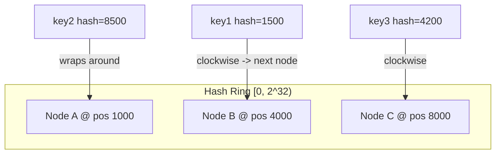

# Consistent Hashing (Go)

Hash ring implementation with virtual nodes — the standard technique behind distributing keys across nodes (cache shards, DB partitions, CDN edge selection) so that node changes cause minimal data movement.

---

## The Rebalancing Problem It Solves

With naive modulo hashing (`hash(key) % N`), adding or removing a single node changes `N`, which changes the target for *almost every key* — not just the keys that belonged to the changed node.

```
Naive: hash(key) % N

N=4: key "user:42" -> hash % 4 = 2  -> node 2
N=5: key "user:42" -> hash % 5 = 4  -> node 4   (moved, even though node 2 didn't change)
```

Consistent hashing places both nodes and keys on a fixed hash ring (e.g., `[0, 2^32)`). A key is assigned to the first node clockwise from its hash position. Adding/removing a node only affects the keys between that node and its predecessor on the ring — everything else stays put.



**Virtual nodes** solve a secondary problem: with only one ring position per physical node, load distribution is uneven (some nodes get much bigger arcs than others by chance). Each physical node is hashed to many points on the ring (e.g., 150 virtual nodes each), which smooths the distribution close to uniform.

---

## Full Working Code

```go
package consistenthash

import (
	"hash/crc32"
	"sort"
	"strconv"
	"sync"
)

// HashRing implements consistent hashing with virtual nodes.
type HashRing struct {
	mu       sync.RWMutex
	replicas int               // virtual nodes per physical node
	ring     []uint32          // sorted hash positions on the ring
	hashMap  map[uint32]string // ring position -> physical node ID
}

// NewHashRing creates a ring with the given number of virtual nodes
// (replicas) per physical node. Higher replicas = smoother distribution,
// more memory. 100-200 is a common production value.
func NewHashRing(replicas int) *HashRing {
	return &HashRing{
		replicas: replicas,
		hashMap:  make(map[uint32]string),
	}
}

// hashKey produces a 32-bit hash for any string key. crc32 is fast and
// sufficiently uniform for ring placement; production systems sometimes
// use a stronger hash (murmur3, fnv) but crc32 is fine here and in the
// standard library, no extra dependency.
func hashKey(key string) uint32 {
	return crc32.ChecksumIEEE([]byte(key))
}

// AddNode registers a physical node, creating `replicas` virtual points
// on the ring for it.
func (r *HashRing) AddNode(nodeID string) {
	r.mu.Lock()
	defer r.mu.Unlock()

	for i := 0; i < r.replicas; i++ {
		vNodeKey := nodeID + "#" + strconv.Itoa(i)
		pos := hashKey(vNodeKey)
		r.hashMap[pos] = nodeID
		r.ring = append(r.ring, pos)
	}
	sort.Slice(r.ring, func(i, j int) bool { return r.ring[i] < r.ring[j] })
}

// RemoveNode removes a physical node and all its virtual points.
func (r *HashRing) RemoveNode(nodeID string) {
	r.mu.Lock()
	defer r.mu.Unlock()

	newRing := r.ring[:0:0] // fresh slice, don't mutate while iterating
	for _, pos := range r.ring {
		if r.hashMap[pos] == nodeID {
			delete(r.hashMap, pos)
			continue
		}
		newRing = append(newRing, pos)
	}
	r.ring = newRing
}

// Get returns the physical node responsible for key: the first node
// found walking clockwise from key's hash position, wrapping around
// to index 0 if the hash falls past the last ring entry.
func (r *HashRing) Get(key string) (string, bool) {
	r.mu.RLock()
	defer r.mu.RUnlock()

	if len(r.ring) == 0 {
		return "", false
	}

	h := hashKey(key)

	// Binary search for the first ring position >= h (clockwise successor).
	idx := sort.Search(len(r.ring), func(i int) bool {
		return r.ring[i] >= h
	})
	if idx == len(r.ring) {
		idx = 0 // wrap around to the start of the ring
	}

	return r.hashMap[r.ring[idx]], true
}

// Nodes returns the current distinct set of physical nodes on the ring.
func (r *HashRing) Nodes() []string {
	r.mu.RLock()
	defer r.mu.RUnlock()

	seen := make(map[string]bool)
	var nodes []string
	for _, nodeID := range r.hashMap {
		if !seen[nodeID] {
			seen[nodeID] = true
			nodes = append(nodes, nodeID)
		}
	}
	return nodes
}
```

### Test cases

```go
package consistenthash

import (
	"fmt"
	"testing"
)

func TestBasicAssignment(t *testing.T) {
	ring := NewHashRing(100)
	ring.AddNode("nodeA")
	ring.AddNode("nodeB")
	ring.AddNode("nodeC")

	node, ok := ring.Get("user:1234")
	if !ok {
		t.Fatal("expected a node for key")
	}
	// Same key always maps to the same node while ring is unchanged.
	node2, _ := ring.Get("user:1234")
	if node != node2 {
		t.Fatalf("Get not deterministic: %s != %s", node, node2)
	}
}

func TestMinimalReshuffleOnAdd(t *testing.T) {
	ring := NewHashRing(100)
	ring.AddNode("nodeA")
	ring.AddNode("nodeB")
	ring.AddNode("nodeC")

	keys := make([]string, 1000)
	before := make(map[string]string)
	for i := range keys {
		keys[i] = fmt.Sprintf("key:%d", i)
		node, _ := ring.Get(keys[i])
		before[keys[i]] = node
	}

	ring.AddNode("nodeD") // add a 4th node

	moved := 0
	for _, k := range keys {
		after, _ := ring.Get(k)
		if after != before[k] {
			moved++
		}
	}

	// With consistent hashing, expect roughly 1/4 of keys to move
	// (the new node's fair share), not all 1000.
	if moved > 400 { // generous upper bound to avoid flaky test
		t.Fatalf("too many keys moved on node add: %d/1000", moved)
	}
	t.Logf("%d/1000 keys moved after adding a 4th node", moved)
}

func TestRemoveNodeRedistributes(t *testing.T) {
	ring := NewHashRing(100)
	ring.AddNode("nodeA")
	ring.AddNode("nodeB")
	ring.AddNode("nodeC")

	key := "session:abc"
	before, _ := ring.Get(key)

	ring.RemoveNode(before) // remove whichever node currently owns this key

	after, ok := ring.Get(key)
	if !ok {
		t.Fatal("expected a node after removal")
	}
	if after == before {
		t.Fatal("key should have moved off the removed node")
	}
}

func TestEmptyRing(t *testing.T) {
	ring := NewHashRing(100)
	if _, ok := ring.Get("anything"); ok {
		t.Fatal("expected ok=false on empty ring")
	}
}
```

---

## Walkthrough: Adding / Removing a Node

### Adding node D to a 3-node ring (A, B, C)

```
Before:  ...---A(virtual pts)---B(virtual pts)---C(virtual pts)---(wrap)...
Keys landing between C and A (wrapping) -> owned by A
Keys landing between A and B             -> owned by B
Keys landing between B and C             -> owned by C

After adding D (its virtual points land at various ring positions):
...---A---D---B---D---C---D---(wrap)...
Only keys that fall between a D virtual point and its counter-clockwise
neighbor move — specifically, the keys that *used to* map to whichever
node D's virtual points now sit in front of. Every other key's clockwise
successor is unchanged.
```

Expected keys moved when going from N to N+1 nodes (with reasonably even virtual node distribution): approximately `total_keys / (N+1)` — i.e., just the new node's fair share. This is the entire point of consistent hashing versus modulo hashing, which reshuffles nearly all keys on any `N` change.

### Removing node B

```
Before: ...---A---B---C---(wrap)...   (ignoring virtual node repetition for clarity)
After:  ...---A-------C---(wrap)...

All keys whose clockwise successor was B now resolve to C (B's
counter-clockwise neighbor absorbs B's arc). Keys that belonged to A or C
already are entirely unaffected.
```

Without virtual nodes, whichever physical node happens to be B's immediate clockwise neighbor absorbs *all* of B's load at once — a hotspot risk right after a node removal. Virtual nodes spread B's original 150 (or however many) arcs across many different physical neighbors, so removal load is distributed roughly evenly across the remaining nodes instead of dumped onto one.

---

## Complexity

| Operation | Time | Notes |
|---|---|---|
| `AddNode` | O(R log(N·R)) | R = replicas per node; re-sort of the full ring slice |
| `RemoveNode` | O(N·R) | Linear scan to filter out the removed node's virtual points |
| `Get` | O(log(N·R)) | Binary search over sorted ring positions |
| Space | O(N·R) | N physical nodes × R virtual nodes each |

`AddNode`'s re-sort could be optimized to an insertion-into-sorted-slice (O(R log(N·R)) for the search + O(N·R) for the insert shift) rather than a full re-sort, but for typical N·R sizes (a few hundred to a few thousand ring entries) the simple re-sort is fine and much easier to get right under interview time pressure.
