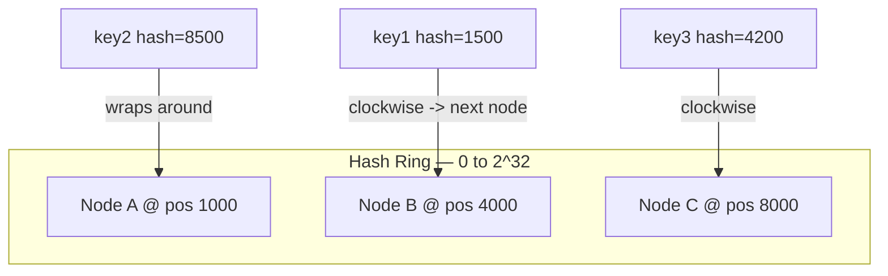
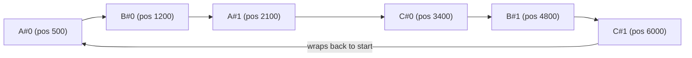

# Consistent Hashing (Go & Python)

Hash ring implementation with virtual nodes — the standard technique behind distributing keys across nodes (cache shards, DB partitions, CDN edge selection) so that node changes cause minimal data movement.

<div class="quiz-progress" data-quiz-progress>
  <span class="quiz-progress-label">0/0 checks</span>
  <span class="quiz-progress-bar"><span class="quiz-progress-fill"></span></span>
</div>

---

## The Rebalancing Problem It Solves

With naive modulo hashing (`hash(key) % N`), adding or removing a single node changes `N`, which changes the target for *almost every key* — not just the keys that belonged to the changed node.

```
Naive: hash(key) % N

N=4: key "user:42" -> hash % 4 = 2  -> node 2
N=5: key "user:42" -> hash % 5 = 4  -> node 4   (moved, even though node 2 didn't change)
```

Consistent hashing places both nodes and keys on a fixed hash ring (e.g., `[0, 2^32)`). A key is assigned to the first node clockwise from its hash position. Adding/removing a node only affects the keys between that node and its predecessor on the ring — everything else stays put.



**Virtual nodes** solve a secondary problem: with only one ring position per physical node, load distribution is uneven (some nodes get much bigger arcs than others by chance). Each physical node is hashed to many points on the ring (e.g., 150 virtual nodes each), which smooths the distribution close to uniform.



Each physical node (A, B, C) contributes several virtual points (`#0`, `#1`, ...) scattered around the ring instead of one. No single node ends up owning an outsized arc just because its one hash happened to land in a big gap.

<div class="quiz-card">
  <p class="quiz-q">Naive modulo hashing: <code>hash(key) % N</code>. You go from 4 nodes to 5. Roughly how many existing keys move?</p>
  <button class="quiz-reveal">Reveal answer</button>
  <div class="quiz-a" hidden>
    Nearly all of them. Changing <code>N</code> changes the <code>% N</code> result for essentially every key, not just the fraction that logically belongs on the new node &mdash; exactly what the <code>user:42</code> example above shows: node 2 itself never changed, but the key's target moved anyway purely because <code>N</code> did.
  </div>
</div>

<div class="quiz-card">
  <p class="quiz-q">Why hash each physical node to ~150 ring positions instead of just one?</p>
  <button class="quiz-reveal">Reveal answer</button>
  <div class="quiz-a" hidden>
    With one position per node, the size of each node's arc comes down to chance &mdash; some nodes end up owning much bigger stretches of the ring than others. Hashing each physical node to many scattered virtual points smooths that distribution close to uniform.
  </div>
</div>

---

## Full Working Code

Same ring, two implementations. Go's version leans on `sort.Search` for the
binary search; Python's leans on the `bisect` module — a sorted list of
integers plus "find the insertion point" is precisely the problem `bisect`
exists for, so the ring lookup ends up as a two-line, standard-library-only
affair with no hand-rolled binary search to get subtly wrong.

<div class="tab-group">
  <div class="tab-buttons">
    <button data-tab="impl-go" class="active">Go</button>
    <button data-tab="impl-py">Python</button>
    <button data-tab="impl-java">Java</button>
  </div>
  <div class="tab-panels">
    <div class="tab-panel active" data-tab-panel="impl-go">
      <pre><code class="language-go">package consistenthash
import (
	"hash/crc32"
	"sort"
	"strconv"
	"sync"
)
// HashRing implements consistent hashing with virtual nodes.
type HashRing struct {
	mu       sync.RWMutex
	replicas int               // virtual nodes per physical node
	ring     []uint32          // sorted hash positions on the ring
	hashMap  map[uint32]string // ring position -&gt; physical node ID
}
// NewHashRing creates a ring with the given number of virtual nodes
// (replicas) per physical node. Higher replicas = smoother distribution,
// more memory. 100-200 is a common production value.
func NewHashRing(replicas int) *HashRing {
	return &amp;HashRing{
		replicas: replicas,
		hashMap:  make(map[uint32]string),
	}
}
// hashKey produces a 32-bit hash for any string key. crc32 is fast and
// sufficiently uniform for ring placement; production systems sometimes
// use a stronger hash (murmur3, fnv) but crc32 is fine here and in the
// standard library, no extra dependency.
func hashKey(key string) uint32 {
	return crc32.ChecksumIEEE([]byte(key))
}
// AddNode registers a physical node, creating `replicas` virtual points
// on the ring for it.
func (r *HashRing) AddNode(nodeID string) {
	r.mu.Lock()
	defer r.mu.Unlock()
	for i := 0; i &lt; r.replicas; i++ {
		vNodeKey := nodeID + "#" + strconv.Itoa(i)
		pos := hashKey(vNodeKey)
		r.hashMap[pos] = nodeID
		r.ring = append(r.ring, pos)
	}
	sort.Slice(r.ring, func(i, j int) bool { return r.ring[i] &lt; r.ring[j] })
}
// RemoveNode removes a physical node and all its virtual points.
func (r *HashRing) RemoveNode(nodeID string) {
	r.mu.Lock()
	defer r.mu.Unlock()
	newRing := r.ring[:0:0] // fresh slice, don't mutate while iterating
	for _, pos := range r.ring {
		if r.hashMap[pos] == nodeID {
			delete(r.hashMap, pos)
			continue
		}
		newRing = append(newRing, pos)
	}
	r.ring = newRing
}
// Get returns the physical node responsible for key: the first node
// found walking clockwise from key's hash position, wrapping around
// to index 0 if the hash falls past the last ring entry.
func (r *HashRing) Get(key string) (string, bool) {
	r.mu.RLock()
	defer r.mu.RUnlock()
	if len(r.ring) == 0 {
		return "", false
	}
	h := hashKey(key)
	// Binary search for the first ring position &gt;= h (clockwise successor).
	idx := sort.Search(len(r.ring), func(i int) bool {
		return r.ring[i] &gt;= h
	})
	if idx == len(r.ring) {
		idx = 0 // wrap around to the start of the ring
	}
	return r.hashMap[r.ring[idx]], true
}
// Nodes returns the current distinct set of physical nodes on the ring.
func (r *HashRing) Nodes() []string {
	r.mu.RLock()
	defer r.mu.RUnlock()
	seen := make(map[string]bool)
	var nodes []string
	for _, nodeID := range r.hashMap {
		if !seen[nodeID] {
			seen[nodeID] = true
			nodes = append(nodes, nodeID)
		}
	}
	return nodes
}</code></pre>
    </div>
    <div class="tab-panel" data-tab-panel="impl-py">
      <pre><code class="language-python">"""Consistent hash ring with virtual nodes.
`bisect` is a clean fit here: the ring is nothing more than a sorted list of
integers, and "find the first node clockwise from this hash" is exactly the
"find the insertion point in a sorted sequence" problem bisect exists to
solve in O(log n) -- no hand-rolled binary search needed.
"""
from __future__ import annotations
import bisect
import hashlib
import threading
from typing import Optional
class HashRing:
    """Consistent hash ring with virtual nodes."""
    def __init__(self, replicas: int = 150) -&gt; None:
        """Create an empty ring.
        Args:
            replicas: virtual nodes created per physical node. Higher means
                smoother load distribution at the cost of memory. 100-200
                is a common production value.
        """
        self._replicas = replicas
        self._ring: list[int] = []
        self._ring_map: dict[int, str] = {}
        self._lock = threading.RLock()
    @staticmethod
    def _hash(key: str) -&gt; int:
        """Stable 32-bit hash for ring placement.
        Python's builtin hash() is salted per-process (PYTHONHASHSEED) and
        would produce a different ring layout on every run -- the opposite
        of what a stable, shareable hash ring needs. md5 (truncated to 4
        bytes) is deterministic across processes and machines instead.
        """
        digest = hashlib.md5(key.encode("utf-8")).digest()
        return int.from_bytes(digest[:4], byteorder="big")
    def add_node(self, node_id: str) -&gt; None:
        """Register a physical node, adding `replicas` virtual points."""
        with self._lock:
            for i in range(self._replicas):
                pos = self._hash(f"{node_id}#{i}")
                self._ring_map[pos] = node_id
                bisect.insort(self._ring, pos)
    def remove_node(self, node_id: str) -&gt; None:
        """Remove a physical node and all of its virtual points."""
        with self._lock:
            self._ring = [p for p in self._ring if self._ring_map[p] != node_id]
            self._ring_map = {
                p: n for p, n in self._ring_map.items() if n != node_id
            }
    def get_node(self, key: str) -&gt; Optional[str]:
        """Return the physical node owning `key`, or None if the ring is empty.
        Walks clockwise from key's hash position: bisect_left finds the
        index of the first ring entry &gt;= that hash in O(log n); the index
        wraps to 0 if the hash falls past the last entry -- that wraparound
        is the entire "ring" in "hash ring."
        """
        with self._lock:
            if not self._ring:
                return None
            h = self._hash(key)
            idx = bisect.bisect_left(self._ring, h)
            if idx == len(self._ring):
                idx = 0
            return self._ring_map[self._ring[idx]]
    def nodes(self) -&gt; list[str]:
        """Return the distinct physical nodes currently on the ring."""
        with self._lock:
            return sorted(set(self._ring_map.values()))</code></pre>
    </div>
    <div class="tab-panel" data-tab-panel="impl-java">
      <pre><code class="language-java">import java.nio.charset.StandardCharsets;
import java.util.ArrayList;
import java.util.HashSet;
import java.util.List;
import java.util.Map;
import java.util.Optional;
import java.util.TreeMap;
import java.util.concurrent.locks.ReentrantReadWriteLock;
import java.util.zip.CRC32;
/**
 * Consistent hash ring with virtual nodes, backed by a TreeMap. A TreeMap
 * keeps ring positions sorted by key automatically, so "find the first node
 * clockwise from this hash" is just ceilingKey() (the built-in equivalent of
 * Go's sort.Search / Python's bisect.bisect_left) with a wraparound to
 * firstKey() when the hash falls past the last entry -- no hand-rolled
 * binary search needed.
 */
public class HashRing {
    private final int replicas; // virtual nodes per physical node
    private final TreeMap&lt;Long, String&gt; ring = new TreeMap&lt;&gt;(); // ring position -&gt; physical node ID
    private final ReentrantReadWriteLock lock = new ReentrantReadWriteLock();
    /**
     * Creates a ring with the given number of virtual nodes (replicas) per
     * physical node. Higher replicas = smoother distribution, more memory.
     * 100-200 is a common production value.
     */
    public HashRing(int replicas) {
        this.replicas = replicas;
    }
    /**
     * Produces an unsigned 32-bit hash for any string key. CRC32 is fast and
     * sufficiently uniform for ring placement; production systems sometimes
     * use a stronger hash (murmur3, fnv) but CRC32 is fine here and in the
     * standard library, no extra dependency.
     */
    private static long hashKey(String key) {
        CRC32 crc = new CRC32();
        crc.update(key.getBytes(StandardCharsets.UTF_8));
        return crc.getValue();
    }
    /** Registers a physical node, creating `replicas` virtual points on the ring for it. */
    public void addNode(String nodeId) {
        lock.writeLock().lock();
        try {
            for (int i = 0; i &lt; replicas; i++) {
                String vNodeKey = nodeId + "#" + i;
                long pos = hashKey(vNodeKey);
                ring.put(pos, nodeId);
            }
        } finally {
            lock.writeLock().unlock();
        }
    }
    /** Removes a physical node and all of its virtual points. */
    public void removeNode(String nodeId) {
        lock.writeLock().lock();
        try {
            ring.values().removeIf(id -&gt; id.equals(nodeId));
        } finally {
            lock.writeLock().unlock();
        }
    }
    /**
     * Returns the physical node responsible for key: the first node found
     * walking clockwise from key's hash position, wrapping around to the
     * ring's first entry if the hash falls past the last one.
     */
    public Optional&lt;String&gt; getNode(String key) {
        lock.readLock().lock();
        try {
            if (ring.isEmpty()) {
                return Optional.empty();
            }
            long h = hashKey(key);
            Map.Entry&lt;Long, String&gt; entry = ring.ceilingEntry(h);
            if (entry == null) {
                entry = ring.firstEntry(); // wrap around to the start of the ring
            }
            return Optional.of(entry.getValue());
        } finally {
            lock.readLock().unlock();
        }
    }
    /** Returns the current distinct set of physical nodes on the ring. */
    public List&lt;String&gt; nodes() {
        lock.readLock().lock();
        try {
            return new ArrayList&lt;&gt;(new HashSet&lt;&gt;(ring.values()));
        } finally {
            lock.readLock().unlock();
        }
    }
}</code></pre>
    </div>
  </div>
</div>

### Test cases

Same four cases in both languages — determinism, minimal reshuffle on add, redistribution on remove, and the empty-ring edge case.

<div class="tab-group">
  <div class="tab-buttons">
    <button data-tab="test-go" class="active">Go</button>
    <button data-tab="test-py">Python</button>
    <button data-tab="test-java">Java</button>
  </div>
  <div class="tab-panels">
    <div class="tab-panel active" data-tab-panel="test-go">
      <pre><code class="language-go">package consistenthash
import (
	"fmt"
	"testing"
)
func TestBasicAssignment(t *testing.T) {
	ring := NewHashRing(100)
	ring.AddNode("nodeA")
	ring.AddNode("nodeB")
	ring.AddNode("nodeC")
	node, ok := ring.Get("user:1234")
	if !ok {
		t.Fatal("expected a node for key")
	}
	// Same key always maps to the same node while ring is unchanged.
	node2, _ := ring.Get("user:1234")
	if node != node2 {
		t.Fatalf("Get not deterministic: %s != %s", node, node2)
	}
}
func TestMinimalReshuffleOnAdd(t *testing.T) {
	ring := NewHashRing(100)
	ring.AddNode("nodeA")
	ring.AddNode("nodeB")
	ring.AddNode("nodeC")
	keys := make([]string, 1000)
	before := make(map[string]string)
	for i := range keys {
		keys[i] = fmt.Sprintf("key:%d", i)
		node, _ := ring.Get(keys[i])
		before[keys[i]] = node
	}
	ring.AddNode("nodeD") // add a 4th node
	moved := 0
	for _, k := range keys {
		after, _ := ring.Get(k)
		if after != before[k] {
			moved++
		}
	}
	// With consistent hashing, expect roughly 1/4 of keys to move
	// (the new node's fair share), not all 1000.
	if moved &gt; 400 { // generous upper bound to avoid flaky test
		t.Fatalf("too many keys moved on node add: %d/1000", moved)
	}
	t.Logf("%d/1000 keys moved after adding a 4th node", moved)
}
func TestRemoveNodeRedistributes(t *testing.T) {
	ring := NewHashRing(100)
	ring.AddNode("nodeA")
	ring.AddNode("nodeB")
	ring.AddNode("nodeC")
	key := "session:abc"
	before, _ := ring.Get(key)
	ring.RemoveNode(before) // remove whichever node currently owns this key
	after, ok := ring.Get(key)
	if !ok {
		t.Fatal("expected a node after removal")
	}
	if after == before {
		t.Fatal("key should have moved off the removed node")
	}
}
func TestEmptyRing(t *testing.T) {
	ring := NewHashRing(100)
	if _, ok := ring.Get("anything"); ok {
		t.Fatal("expected ok=false on empty ring")
	}
}</code></pre>
    </div>
    <div class="tab-panel" data-tab-panel="test-py">
      <pre><code class="language-python">"""Tests for the consistent hash ring."""
from hash_ring import HashRing
def test_basic_assignment_is_deterministic() -&gt; None:
    ring = HashRing(replicas=100)
    ring.add_node("nodeA")
    ring.add_node("nodeB")
    ring.add_node("nodeC")
    node = ring.get_node("user:1234")
    assert node is not None
    # Same key always maps to the same node while the ring is unchanged.
    assert ring.get_node("user:1234") == node
def test_minimal_reshuffle_on_add() -&gt; None:
    ring = HashRing(replicas=100)
    for node_id in ("nodeA", "nodeB", "nodeC"):
        ring.add_node(node_id)
    keys = [f"key:{i}" for i in range(1000)]
    before = {k: ring.get_node(k) for k in keys}
    ring.add_node("nodeD")  # add a 4th node
    moved = sum(1 for k in keys if ring.get_node(k) != before[k])
    # With consistent hashing, expect roughly 1/4 of keys to move (the new
    # node's fair share), not all 1000.
    assert moved &lt; 400, f"too many keys moved on node add: {moved}/1000"
def test_remove_node_redistributes() -&gt; None:
    ring = HashRing(replicas=100)
    for node_id in ("nodeA", "nodeB", "nodeC"):
        ring.add_node(node_id)
    key = "session:abc"
    before = ring.get_node(key)
    ring.remove_node(before)  # remove whichever node currently owns this key
    after = ring.get_node(key)
    assert after is not None
    assert after != before
def test_empty_ring_returns_none() -&gt; None:
    ring = HashRing(replicas=100)
    assert ring.get_node("anything") is None</code></pre>
    </div>
    <div class="tab-panel" data-tab-panel="test-java">
      <pre><code class="language-java">import java.util.HashMap;
import java.util.Map;
import java.util.Optional;
/** Tests for the consistent hash ring. */
public class HashRingTest {
    public static void main(String[] args) {
        testBasicAssignmentIsDeterministic();
        testMinimalReshuffleOnAdd();
        testRemoveNodeRedistributes();
        testEmptyRing();
        System.out.println("ALL TESTS PASSED");
    }
    static void testBasicAssignmentIsDeterministic() {
        HashRing ring = new HashRing(100);
        ring.addNode("nodeA");
        ring.addNode("nodeB");
        ring.addNode("nodeC");
        Optional&lt;String&gt; node = ring.getNode("user:1234");
        assertTrue(node.isPresent(), "expected a node for key");
        // Same key always maps to the same node while the ring is unchanged.
        assertEquals(node, ring.getNode("user:1234"), "getNode not deterministic");
        System.out.println("PASS testBasicAssignmentIsDeterministic");
    }
    static void testMinimalReshuffleOnAdd() {
        HashRing ring = new HashRing(100);
        ring.addNode("nodeA");
        ring.addNode("nodeB");
        ring.addNode("nodeC");
        String[] keys = new String[1000];
        Map&lt;String, Optional&lt;String&gt;&gt; before = new HashMap&lt;&gt;();
        for (int i = 0; i &lt; keys.length; i++) {
            keys[i] = "key:" + i;
            before.put(keys[i], ring.getNode(keys[i]));
        }
        ring.addNode("nodeD"); // add a 4th node
        int moved = 0;
        for (String k : keys) {
            if (!ring.getNode(k).equals(before.get(k))) {
                moved++;
            }
        }
        // With consistent hashing, expect roughly 1/4 of keys to move (the
        // new node's fair share), not all 1000.
        assertTrue(moved &lt; 400, "too many keys moved on node add: " + moved + "/1000");
        System.out.println("PASS testMinimalReshuffleOnAdd (" + moved + "/1000 keys moved)");
    }
    static void testRemoveNodeRedistributes() {
        HashRing ring = new HashRing(100);
        ring.addNode("nodeA");
        ring.addNode("nodeB");
        ring.addNode("nodeC");
        String key = "session:abc";
        String before = ring.getNode(key).orElseThrow();
        ring.removeNode(before); // remove whichever node currently owns this key
        Optional&lt;String&gt; after = ring.getNode(key);
        assertTrue(after.isPresent(), "expected a node after removal");
        assertTrue(!after.get().equals(before), "key should have moved off the removed node");
        System.out.println("PASS testRemoveNodeRedistributes");
    }
    static void testEmptyRing() {
        HashRing ring = new HashRing(100);
        assertTrue(ring.getNode("anything").isEmpty(), "expected empty Optional on empty ring");
        System.out.println("PASS testEmptyRing");
    }
    static void assertTrue(boolean cond, String msg) {
        if (!cond) {
            throw new AssertionError(msg);
        }
    }
    static void assertEquals(Object a, Object b, String msg) {
        if (!a.equals(b)) {
            throw new AssertionError(msg + ": " + a + " != " + b);
        }
    }
}</code></pre>
    </div>
  </div>
</div>

<div class="quiz-card">
  <p class="quiz-q">The Python ring uses <code>hashlib.md5</code> instead of Python's built-in <code>hash()</code> for ring placement. Why not just use <code>hash()</code>?</p>
  <button class="quiz-reveal">Reveal answer</button>
  <div class="quiz-a" hidden>
    Python's built-in <code>hash()</code> is salted per-process (<code>PYTHONHASHSEED</code>) &mdash; the same key would land at a different ring position every time the process restarts, which breaks the entire point of a stable, shareable ring. <code>md5</code> is deterministic across processes and machines instead.
  </div>
</div>

---

## Walkthrough: Adding / Removing a Node

### Adding node D to a 3-node ring (A, B, C)

```
Before:  ...---A(virtual pts)---B(virtual pts)---C(virtual pts)---(wrap)...
Keys landing between C and A (wrapping) -> owned by A
Keys landing between A and B             -> owned by B
Keys landing between B and C             -> owned by C

After adding D (its virtual points land at various ring positions):
...---A---D---B---D---C---D---(wrap)...
Only keys that fall between a D virtual point and its counter-clockwise
neighbor move — specifically, the keys that *used to* map to whichever
node D's virtual points now sit in front of. Every other key's clockwise
successor is unchanged.
```

Expected keys moved when going from N to N+1 nodes (with reasonably even virtual node distribution): approximately `total_keys / (N+1)` — i.e., just the new node's fair share. This is the entire point of consistent hashing versus modulo hashing, which reshuffles nearly all keys on any `N` change.

### Removing node B

```
Before: ...---A---B---C---(wrap)...   (ignoring virtual node repetition for clarity)
After:  ...---A-------C---(wrap)...

All keys whose clockwise successor was B now resolve to C (B's
counter-clockwise neighbor absorbs B's arc). Keys that belonged to A or C
already are entirely unaffected.
```

Without virtual nodes, whichever physical node happens to be B's immediate clockwise neighbor absorbs *all* of B's load at once — a hotspot risk right after a node removal. Virtual nodes spread B's original 150 (or however many) arcs across many different physical neighbors, so removal load is distributed roughly evenly across the remaining nodes instead of dumped onto one.

### Step-by-step: the same walkthrough, one ring mutation at a time

Reusing the ring positions from the very first diagram (A @ 1000, B @ 4000, C @ 8000) with a single node join and a single node removal, tracked key by key:

<div class="stepper">
  <div class="stepper-panels">
    <div class="stepper-panel active">
      <strong>1. Stable ring.</strong> A @ 1000, B @ 4000, C @ 8000. <code>key1</code> (hash=1500) resolves to B, <code>key2</code> (hash=8500) wraps around past C back to A, <code>key3</code> (hash=4200) resolves to C.
      <pre><code class="language-mermaid">graph LR
    A["Node A (pos 1000)"] --> B["Node B (pos 4000)"]
    B --> C["Node C (pos 8000)"]
    C -->|"wraps back to start"| A</code></pre>
    </div>
    <div class="stepper-panel">
      <strong>2. Node D joins at position 6000.</strong> (One virtual point shown for clarity &mdash; a real join adds ~150 of these scattered around the ring, not just one.) D lands between B (4000) and C (8000).
      <pre><code class="language-mermaid">graph LR
    A["Node A (pos 1000)"] --> B["Node B (pos 4000)"]
    B --> D["Node D (pos 6000, new)"]
    D --> C["Node C (pos 8000)"]
    C -->|"wraps back to start"| A</code></pre>
    </div>
    <div class="stepper-panel">
      <strong>3. Only the keys between B and D move.</strong> <code>key3</code> (hash=4200) used to resolve to C, the old clockwise neighbor spanning 4000&ndash;8000; now the first node clockwise from 4200 is D, so it moves there. <code>key1</code> (1500, still nearest to B) and <code>key2</code> (8500, still wraps to A) are untouched &mdash; D's new position doesn't sit between their hash and their existing owner.
      <pre><code class="language-mermaid">graph LR
    A["Node A (pos 1000)"] --> B["Node B (pos 4000)"]
    B --> D["Node D (pos 6000, new)"]
    D --> C["Node C (pos 8000)"]
    C -->|"wraps back to start"| A
    K3["key3 hash=4200"] -.->|"now resolves here (was C)"| D</code></pre>
    </div>
    <div class="stepper-panel">
      <strong>4. Removing node B.</strong> Its ring position (4000) and all of its virtual points are deleted.
      <pre><code class="language-mermaid">graph LR
    A["Node A (pos 1000)"] --> D["Node D (pos 6000)"]
    D --> C["Node C (pos 8000)"]
    C -->|"wraps back to start"| A</code></pre>
    </div>
    <div class="stepper-panel">
      <strong>5. B's arc is absorbed by its clockwise neighbor.</strong> <code>key1</code> (hash=1500), previously owned by B, now resolves to D &mdash; the next node clockwise from 4000. <code>key2</code> and <code>key3</code>, already owned by A and D, are unaffected by B's removal.
      <pre><code class="language-mermaid">graph LR
    A["Node A (pos 1000)"] --> D["Node D (pos 6000)"]
    D --> C["Node C (pos 8000)"]
    C -->|"wraps back to start"| A
    K1["key1 hash=1500"] -.->|"now resolves here (was B)"| D</code></pre>
    </div>
  </div>
  <div class="stepper-controls">
    <button class="stepper-prev">← Prev</button>
    <span class="stepper-dots"></span>
    <span class="stepper-label"></span>
    <button class="stepper-next">Next →</button>
  </div>
</div>

<div class="quiz-card">
  <p class="quiz-q">Right after removing node B, and assuming no virtual nodes were used, which physical node absorbs all of B's load?</p>
  <button class="quiz-reveal">Reveal answer</button>
  <div class="quiz-a" hidden>
    Whichever physical node happens to be B's immediate clockwise neighbor absorbs <em>all</em> of B's load at once &mdash; a hotspot risk right after a node removal. Virtual nodes fix this by spreading B's arcs across many different physical neighbors, so removal load distributes roughly evenly across the remaining nodes instead of landing on one.
  </div>
</div>

---

## Try It Yourself: Live Hash Ring

A real ring, drawn as an actual circle this time. Starts with 3 nodes (A, B, C), 3 virtual points each (real deployments use more like 150 — see above for why — this demo uses fewer purely so the dots stay readable). Add a node and watch how few keys move; remove one and watch its arc get absorbed by its neighbors, never touching anyone else's keys.

<div class="structure-viz" id="ring-live-viz">
  <svg class="viz-canvas" viewBox="0 0 440 320"></svg>
  <div class="viz-controls">
    <input class="viz-input" type="text" placeholder="node name or key" />
    <button class="viz-btn" data-viz-action="insert">Add node</button>
    <button class="viz-btn" data-viz-action="search">Look up key</button>
    <button class="viz-btn viz-btn-danger" data-viz-action="delete">Remove node</button>
    <button class="viz-btn" data-viz-action="reset">Reset</button>
  </div>
  <div class="viz-status"></div>
  <div class="viz-legend">
    <span>Each color is one physical node's virtual points</span>
    <span><span class="viz-swatch" style="background:#e2e8f0"></span> a looked-up key, linked to its owner</span>
  </div>
</div>

<script>
(function () {
  const svgNS = 'http://www.w3.org/2000/svg';
  const root0 = document.getElementById('ring-live-viz');
  const svg = root0.querySelector('.viz-canvas');
  const input = root0.querySelector('.viz-input');
  const status = root0.querySelector('.viz-status');

  const RING_SIZE = 10000, REPLICAS = 3;
  const CX = 220, CY = 160, R = 120;
  const COLORS = ['#60a5fa', '#4ade80', '#fbbf24', '#f472b6', '#a78bfa', '#fb923c'];

  let ring, nodeColor, highlightPos, keyMarker, flashTimer;

  function reset() {
    ring = [];
    nodeColor = new Map();
    highlightPos = null;
    keyMarker = null;
    ['A', 'B', 'C'].forEach(addNode);
  }

  function hashStr(s) {
    let h = 2166136261;
    for (let i = 0; i < s.length; i++) { h ^= s.charCodeAt(i); h = Math.imul(h, 16777619); }
    return Math.abs(h) % RING_SIZE;
  }

  function colorFor(name) {
    if (!nodeColor.has(name)) nodeColor.set(name, COLORS[nodeColor.size % COLORS.length]);
    return nodeColor.get(name);
  }

  function addNode(name) {
    if (ring.some(p => p.node === name)) return false;
    for (let i = 0; i < REPLICAS; i++) ring.push({ pos: hashStr(`${name}#${i}`), node: name, replica: i });
    ring.sort((a, b) => a.pos - b.pos);
    colorFor(name);
    return true;
  }

  function removeNode(name) {
    const before = ring.length;
    ring = ring.filter(p => p.node !== name);
    return ring.length !== before;
  }

  function owner(pos) {
    if (ring.length === 0) return null;
    for (const p of ring) if (p.pos >= pos) return p;
    return ring[0];
  }

  function angleOf(pos) { return (pos / RING_SIZE) * 2 * Math.PI - Math.PI / 2; }
  function xy(pos, radius) {
    const a = angleOf(pos);
    return { x: CX + radius * Math.cos(a), y: CY + radius * Math.sin(a) };
  }

  function setStatus(msg, kind) {
    status.textContent = msg;
    status.className = 'viz-status' + (kind === 'ok' ? ' viz-status-ok' : kind === 'error' ? ' viz-status-error' : '');
  }

  function el(tag, attrs) {
    const e = document.createElementNS(svgNS, tag);
    for (const k in attrs) e.setAttribute(k, attrs[k]);
    return e;
  }

  function scheduleFlashClear() {
    clearTimeout(flashTimer);
    flashTimer = setTimeout(() => { highlightPos = null; keyMarker = null; draw(); }, 2200);
  }

  function draw() {
    svg.setAttribute('viewBox', '0 0 440 320');
    while (svg.firstChild) svg.removeChild(svg.firstChild);

    svg.appendChild(el('circle', { cx: CX, cy: CY, r: R, class: 'viz-edge', fill: 'none' }));

    if (keyMarker !== null) {
      const kp = xy(keyMarker, R);
      const own = owner(keyMarker);
      if (own) {
        const op = xy(own.pos, R);
        svg.appendChild(el('line', { x1: kp.x, y1: kp.y, x2: op.x, y2: op.y, class: 'viz-edge-active', 'stroke-dasharray': '3,3' }));
      }
      svg.appendChild(el('circle', { cx: kp.x, cy: kp.y, r: 6, fill: '#e2e8f0', stroke: '#0f172a', 'stroke-width': 1.5 }));
      const t = el('text', { x: kp.x, y: kp.y - 12 });
      t.textContent = 'key';
      svg.appendChild(t);
    }

    ring.forEach(p => {
      const pt = xy(p.pos, R);
      const isHi = highlightPos !== null && p.pos === highlightPos;
      svg.appendChild(el('circle', {
        cx: pt.x, cy: pt.y, r: isHi ? 12 : 9,
        fill: colorFor(p.node), stroke: isHi ? '#fbbf24' : '#0f172a', 'stroke-width': isHi ? 3 : 1.5,
      }));
      const labelPt = xy(p.pos, R + 22);
      const t = el('text', { x: labelPt.x, y: labelPt.y, class: 'viz-label-dim' });
      t.textContent = `${p.node}#${p.replica}`;
      svg.appendChild(t);
    });

    if (ring.length === 0) {
      const t = el('text', { x: CX, y: CY });
      t.textContent = 'ring is empty — add a node';
      svg.appendChild(t);
    }
  }

  root0.querySelector('[data-viz-action="insert"]').addEventListener('click', () => {
    const name = input.value.trim();
    if (!name) { setStatus('Enter a node name first.', 'error'); return; }
    if (!addNode(name)) { setStatus(`Node "${name}" is already on the ring.`, 'error'); return; }
    input.value = '';
    setStatus(`Added "${name}" — placed ${REPLICAS} virtual points on the ring (only that node's fair share of keys should have moved).`, 'ok');
    draw();
  });

  root0.querySelector('[data-viz-action="search"]').addEventListener('click', () => {
    const key = input.value.trim();
    if (!key) { setStatus('Enter a key to look up first.', 'error'); return; }
    if (ring.length === 0) { setStatus('Ring is empty — add a node first.', 'error'); return; }
    const pos = hashStr(key);
    const own = owner(pos);
    keyMarker = pos;
    highlightPos = own.pos;
    setStatus(`Key "${key}" hashes to position ${pos} — owned by node ${own.node} (its nearest virtual point clockwise).`, 'ok');
    draw();
    scheduleFlashClear();
  });

  root0.querySelector('[data-viz-action="delete"]').addEventListener('click', () => {
    const name = input.value.trim();
    if (!name) { setStatus('Enter a node name first.', 'error'); return; }
    if (!removeNode(name)) { setStatus(`Node "${name}" isn't on the ring.`, 'error'); return; }
    setStatus(`Removed "${name}" — its keys are absorbed by their new nearest clockwise neighbors; every other node's keys are untouched.`, 'ok');
    draw();
  });

  root0.querySelector('[data-viz-action="reset"]').addEventListener('click', () => {
    reset();
    setStatus('Reset to a 3-node ring (A, B, C).', '');
    draw();
  });

  reset();
  setStatus('Loaded a 3-node ring (A, B, C), 3 virtual points each. Type a node name and Insert/Delete it, or type any text and Search to see which node owns it.', '');
  draw();
})();
</script>

---

## Complexity

| Operation | Time | Notes |
|---|---|---|
| `AddNode` | O(R log(N·R)) | R = replicas per node; re-sort of the full ring slice |
| `RemoveNode` | O(N·R) | Linear scan to filter out the removed node's virtual points |
| `Get` | O(log(N·R)) | Binary search over sorted ring positions |
| Space | O(N·R) | N physical nodes × R virtual nodes each |

`AddNode`'s re-sort could be optimized to an insertion-into-sorted-slice (O(R log(N·R)) for the search + O(N·R) for the insert shift) rather than a full re-sort, but for typical N·R sizes (a few hundred to a few thousand ring entries) the simple re-sort is fine and much easier to get right under interview time pressure.

The Python version already does the insertion-into-sorted-slice approach: `bisect.insort` is `bisect_left` (O(log(N·R)) search) plus a `list.insert` (O(N·R) shift), so `add_node` is O(R · N·R) total for `R` virtual points — same asymptotic shape as Go's re-sort, just without ever re-sorting entries that were already in order. `get_node`'s `bisect_left` is the same O(log(N·R)) binary search as Go's `sort.Search`.

<div class="quiz-card">
  <p class="quiz-q">Both implementations keep the ring as one sorted array rather than, say, a balanced tree. What does that cost on <code>AddNode</code>/<code>add_node</code>, and why is it still the right call here?</p>
  <button class="quiz-reveal">Reveal answer</button>
  <div class="quiz-a" hidden>
    Inserting into a sorted array/slice costs O(N&middot;R) for the shift (Go's full re-sort or Python's <code>bisect.insort</code> under the hood) &mdash; worse than a tree's O(log n) insert. But for typical ring sizes (a few hundred to a few thousand entries for N&middot;R), that shift is fast in absolute terms, and <code>Get</code>/<code>get_node</code> stays a simple, hard-to-get-wrong binary search over a flat array &mdash; exactly the tradeoff worth making under interview time pressure.
  </div>
</div>
