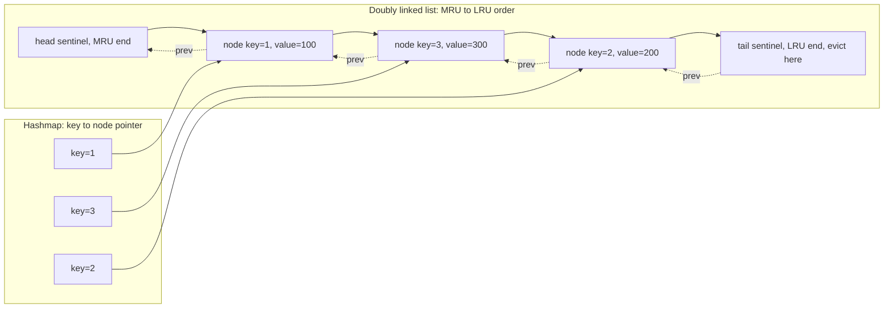
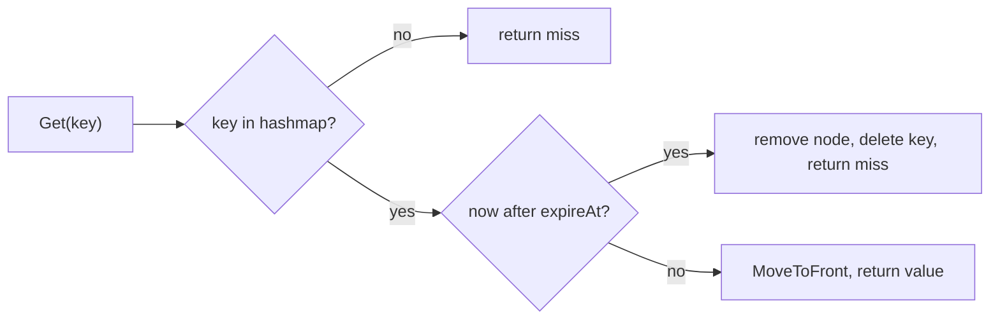

# LRU Cache (Go)

Classic interview problem: design a fixed-capacity cache with O(1) `Get` and `Put`, evicting the least-recently-used entry when full.

  0/0 checks
  

---

## Why Doubly Linked List + Hashmap

| Structure alone | Get | Put | Eviction (move/remove from middle) |
|---|---|---|---|
| Hashmap only | O(1) | O(1) | No ordering info — can't know what's "least recently used" |
| Linked list only | O(n) — must scan to find key | O(n) | O(1) once found, but finding it is O(n) |
| **Hashmap + doubly linked list** | **O(1)** — map gives direct node pointer | **O(1)** | **O(1)** — map gives the node, DLL removal/insertion is pointer surgery, no scan |

The hashmap gives O(1) *lookup* of a node by key. The doubly linked list gives O(1) *reordering* (move-to-front on access, remove-from-tail on eviction) because you have a direct pointer to the node's neighbors — no traversal needed. Neither structure alone gets both properties; together they do.

A singly linked list is insufficient because removing a node requires a pointer to its *previous* node, which a singly linked list doesn't give you in O(1) — you'd have to scan from the head.

The hashmap never stores values directly — it stores pointers *into* the linked list, so both structures stay perfectly in sync as one unit moves:

> **Why it matters:** every `Get` walks exactly two pointers — hashmap to node, then node to its neighbors during the move — never the whole list. That's the entire O(1) trick in one picture.

  
Why do you need both the hashmap and the doubly linked list — what does each one give you that the other can't?

  <button class="quiz-reveal">Reveal answer</button>
  

    The hashmap gives O(1) <em>lookup</em> of a node by key, but carries no ordering information. The doubly linked list gives O(1) <em>reordering</em> &mdash; move-to-front on access, remove-from-tail on eviction &mdash; because a direct pointer to a node's neighbors avoids any scan. Neither structure alone gets both properties; together they do.
  

---

## Full Working Code

  

    <button data-tab="cache-go" class="active">Go</button>
    <button data-tab="cache-py">Python</button>
  

  

    

      <pre><code class="language-go">package lru
import "container/list"
// entry is the payload stored in each list.Element.
type entry struct {
	key   int
	value int
}
// Cache is a fixed-capacity LRU cache.
// list.Element at the front = most recently used, back = least recently used.
type Cache struct {
	capacity int
	ll       *list.List
	items    map[int]*list.Element
}
// NewCache creates an LRU cache with the given capacity.
// Panics if capacity &lt;= 0, matching common interview expectations for invalid input.
func NewCache(capacity int) *Cache {
	if capacity &lt;= 0 {
		panic("lru: capacity must be positive")
	}
	return &amp;Cache{
		capacity: capacity,
		ll:       list.New(),
		items:    make(map[int]*list.Element, capacity),
	}
}
// Get returns the value for key and marks it as most recently used.
// The second return value reports whether the key was present.
func (c *Cache) Get(key int) (int, bool) {
	elem, ok := c.items[key]
	if !ok {
		return 0, false
	}
	c.ll.MoveToFront(elem)
	return elem.Value.(*entry).value, true
}
// Put inserts or updates key with value, evicting the LRU entry if the
// cache is at capacity and key is new.
func (c *Cache) Put(key int, value int) {
	if elem, ok := c.items[key]; ok {
		elem.Value.(*entry).value = value
		c.ll.MoveToFront(elem)
		return
	}
	if c.ll.Len() &gt;= c.capacity {
		c.evictOldest()
	}
	elem := c.ll.PushFront(&amp;entry{key: key, value: value})
	c.items[key] = elem
}
// Len returns the current number of entries in the cache.
func (c *Cache) Len() int {
	return c.ll.Len()
}
func (c *Cache) evictOldest() {
	oldest := c.ll.Back()
	if oldest == nil {
		return
	}
	c.ll.Remove(oldest)
	delete(c.items, oldest.Value.(*entry).key)
}</code></pre>
    

    

      <pre><code class="language-python">from typing import Optional
class _Node:
    """Doubly linked list node holding one cache entry."""
    __slots__ = ("key", "value", "prev", "next")
    def __init__(self, key: int, value: int) -&gt; None:
        self.key = key
        self.value = value
        self.prev: Optional["_Node"] = None
        self.next: Optional["_Node"] = None
class LRUCache:
    """Fixed-capacity LRU cache with O(1) get/put.
    Two sentinel nodes (head, tail) bound the list so push/remove never
    need a None check on a real entry's neighbor:
    head &lt;-&gt; most-recently-used &lt;-&gt; ... &lt;-&gt; least-recently-used &lt;-&gt; tail.
    Raises ValueError if capacity &lt;= 0, matching common interview
    expectations for invalid input.
    """
    def __init__(self, capacity: int) -&gt; None:
        if capacity &lt;= 0:
            raise ValueError("lru: capacity must be positive")
        self.capacity = capacity
        self._items: dict[int, _Node] = {}
        self._head = _Node(0, 0)
        self._tail = _Node(0, 0)
        self._head.next = self._tail
        self._tail.prev = self._head
    def get(self, key: int) -&gt; Optional[int]:
        """Return the value for key and mark it most recently used.
        Returns None if the key is absent (0 is a valid stored value,
        so this cache can't reuse a sentinel return the way Go's
        two-value return does -- callers needing to store None as a
        real value should wrap it, e.g. in an Optional marker object).
        """
        node = self._items.get(key)
        if node is None:
            return None
        self._move_to_front(node)
        return node.value
    def put(self, key: int, value: int) -&gt; None:
        """Insert or update key with value.
        Evicts the least-recently-used entry first if the cache is at
        capacity and key is new.
        """
        node = self._items.get(key)
        if node is not None:
            node.value = value
            self._move_to_front(node)
            return
        if len(self._items) &gt;= self.capacity:
            self._evict_oldest()
        node = _Node(key, value)
        self._items[key] = node
        self._push_front(node)
    def __len__(self) -&gt; int:
        """Return the current number of entries in the cache."""
        return len(self._items)
    def _push_front(self, node: "_Node") -&gt; None:
        node.prev = self._head
        node.next = self._head.next
        self._head.next.prev = node
        self._head.next = node
    def _remove(self, node: "_Node") -&gt; None:
        node.prev.next = node.next
        node.next.prev = node.prev
    def _move_to_front(self, node: "_Node") -&gt; None:
        self._remove(node)
        self._push_front(node)
    def _evict_oldest(self) -&gt; None:
        oldest = self._tail.prev
        if oldest is self._head:
            return
        self._remove(oldest)
        del self._items[oldest.key]</code></pre>
    

  

### Test cases

  

    <button data-tab="tests-go" class="active">Go</button>
    <button data-tab="tests-py">Python</button>
  

  

    

      <pre><code class="language-go">package lru
import "testing"
func TestCacheBasic(t *testing.T) {
	c := NewCache(2)
	c.Put(1, 100)
	c.Put(2, 200)
	if v, ok := c.Get(1); !ok || v != 100 {
		t.Fatalf("Get(1) = %d, %v; want 100, true", v, ok)
	}
	// Access to key 1 makes it MRU; key 2 becomes LRU.
	c.Put(3, 300) // capacity=2, evicts key 2
	if _, ok := c.Get(2); ok {
		t.Fatal("key 2 should have been evicted")
	}
	if v, ok := c.Get(3); !ok || v != 300 {
		t.Fatalf("Get(3) = %d, %v; want 300, true", v, ok)
	}
	if v, ok := c.Get(1); !ok || v != 100 {
		t.Fatalf("Get(1) = %d, %v; want 100, true", v, ok)
	}
}
func TestCacheUpdateExisting(t *testing.T) {
	c := NewCache(2)
	c.Put(1, 100)
	c.Put(1, 999) // update, not insert
	if c.Len() != 1 {
		t.Fatalf("Len() = %d; want 1", c.Len())
	}
	if v, _ := c.Get(1); v != 999 {
		t.Fatalf("Get(1) = %d; want 999", v)
	}
}
func TestCacheEvictionOrder(t *testing.T) {
	c := NewCache(3)
	c.Put(1, 1)
	c.Put(2, 2)
	c.Put(3, 3)
	c.Get(1) // 1 is now MRU; order (MRU-&gt;LRU): 1, 3, 2
	c.Put(4, 4) // evicts 2 (the actual LRU)
	if _, ok := c.Get(2); ok {
		t.Fatal("key 2 should have been evicted, not key 1 or 3")
	}
	if _, ok := c.Get(1); !ok {
		t.Fatal("key 1 should still be present")
	}
	if _, ok := c.Get(3); !ok {
		t.Fatal("key 3 should still be present")
	}
}</code></pre>
    

    

      <pre><code class="language-python">import unittest
class TestLRUCache(unittest.TestCase):
    def test_basic(self) -&gt; None:
        cache = LRUCache(2)
        cache.put(1, 100)
        cache.put(2, 200)
        self.assertEqual(cache.get(1), 100)
        # Access to key 1 makes it MRU; key 2 becomes LRU.
        cache.put(3, 300)  # capacity=2, evicts key 2
        self.assertIsNone(cache.get(2))
        self.assertEqual(cache.get(3), 300)
        self.assertEqual(cache.get(1), 100)
    def test_update_existing(self) -&gt; None:
        cache = LRUCache(2)
        cache.put(1, 100)
        cache.put(1, 999)  # update, not insert
        self.assertEqual(len(cache), 1)
        self.assertEqual(cache.get(1), 999)
    def test_eviction_order(self) -&gt; None:
        cache = LRUCache(3)
        cache.put(1, 1)
        cache.put(2, 2)
        cache.put(3, 3)
        cache.get(1)  # 1 is now MRU; order (MRU-&gt;LRU): 1, 3, 2
        cache.put(4, 4)  # evicts 2 (the actual LRU)
        self.assertIsNone(cache.get(2))
        self.assertIsNotNone(cache.get(1))
        self.assertIsNotNone(cache.get(3))
if __name__ == "__main__":
    unittest.main()</code></pre>
    

  

### Walkthrough: a Get/Put sequence that causes an eviction

The diagram above shows the structure frozen in time. This walks through the same `TestCacheEvictionOrder` scenario one operation at a time, so you can see exactly when the eviction candidate changes:

  

    

      <strong>1. Start.</strong> Capacity 3, empty cache. Hashmap: <code>{}</code>. List: empty.
    

    

      <strong>2. Put(1, 1).</strong> New node pushed to the front. List (MRU&rarr;LRU): <code>1</code>. Hashmap: <code>{1: node1}</code>.
    

    

      <strong>3. Put(2, 2).</strong> Another new node pushed to the front. List: <code>2, 1</code>. Hashmap: <code>{1, 2}</code>.
    

    

      <strong>4. Put(3, 3).</strong> List: <code>3, 2, 1</code>. Cache is now full: 3/3. Key 1 is currently the tail — the eviction candidate, for now.
    

    

      <strong>5. Get(1).</strong> Hashmap hands back a direct pointer to node 1 &mdash; no scan. MoveToFront makes it MRU. List: <code>1, 3, 2</code>. Key 2 is now the tail &mdash; the eviction candidate has changed.
    

    

      <strong>6. Put(4, 4).</strong> Cache is at capacity and key 4 is new, so evict the tail first: the list's tail pointer goes straight to node 2, no scan needed &mdash; remove it from the list and delete key 2 from the hashmap. Then push node 4 to the front. Final list: <code>4, 1, 3</code>. Hashmap: <code>{1, 3, 4}</code> &mdash; key 2 is gone.
    

  

  

    <button class="stepper-prev">← Prev</button>
    
    
    <button class="stepper-next">Next →</button>
  

---

## Complexity Analysis

| Operation | Time | Space |
|---|---|---|
| `Get` | O(1) — map lookup + O(1) list move | — |
| `Put` (new key, under capacity) | O(1) | O(1) additional |
| `Put` (new key, at capacity) | O(1) — one eviction, no scan | O(0) — net zero after eviction |
| `Put` (existing key) | O(1) | — |
| Overall space | O(capacity) | Map + list each hold at most `capacity` entries |

`container/list` in Go's standard library is a doubly linked list, so `Remove`/`PushFront`/`MoveToFront` are all O(1) given an `*list.Element` pointer — which is exactly what the map stores.

  
Why is evicting the LRU entry O(1) instead of O(n) — isn't finding "the least recently used one" a search?

  <button class="quiz-reveal">Reveal answer</button>
  

    No search is needed: the doubly linked list's tail is <em>always</em> the LRU entry by construction, because every access or insert moves its node to the front. Eviction is just "remove whatever's currently at the tail" &mdash; direct pointer surgery, not a scan to find the oldest entry.
  

---

## Interview Follow-Ups

### 1. Thread-safe version (RWMutex)

Naively wrapping every method in a `sync.Mutex` works but serializes reads unnecessarily. The subtlety: **`Get` in an LRU cache is a write to the underlying structure** (it mutates list order via `MoveToFront`), so a plain `RWMutex` read lock is *not* safe for `Get` — it must take the write lock too.

  

    <button data-tab="safe-go" class="active">Go</button>
    <button data-tab="safe-py">Python</button>
  

  

    

      <pre><code class="language-go">package lru
import (
	"container/list"
	"sync"
)
type SafeCache struct {
	mu       sync.Mutex // not RWMutex: Get mutates list order, so no true read-only path
	capacity int
	ll       *list.List
	items    map[int]*list.Element
}
func NewSafeCache(capacity int) *SafeCache {
	if capacity &lt;= 0 {
		panic("lru: capacity must be positive")
	}
	return &amp;SafeCache{
		capacity: capacity,
		ll:       list.New(),
		items:    make(map[int]*list.Element, capacity),
	}
}
func (c *SafeCache) Get(key int) (int, bool) {
	c.mu.Lock()
	defer c.mu.Unlock()
	elem, ok := c.items[key]
	if !ok {
		return 0, false
	}
	c.ll.MoveToFront(elem)
	return elem.Value.(*entry).value, true
}
func (c *SafeCache) Put(key int, value int) {
	c.mu.Lock()
	defer c.mu.Unlock()
	if elem, ok := c.items[key]; ok {
		elem.Value.(*entry).value = value
		c.ll.MoveToFront(elem)
		return
	}
	if c.ll.Len() &gt;= c.capacity {
		oldest := c.ll.Back()
		if oldest != nil {
			c.ll.Remove(oldest)
			delete(c.items, oldest.Value.(*entry).key)
		}
	}
	elem := c.ll.PushFront(&amp;entry{key: key, value: value})
	c.items[key] = elem
}</code></pre>
    

    

      <pre><code class="language-python">import threading
from typing import Optional
# Reuses _Node from the base LRUCache module above (same file/module,
# same as Go's SafeCache reuses `entry` from the same package).
class SafeLRUCache:
    """Thread-safe LRU cache.
    Uses a plain Lock, not an RLock or a reader/writer lock: get()
    mutates list order via _move_to_front, so there is no true
    read-only path an RWLock's shared read-lock could safely cover.
    """
    def __init__(self, capacity: int) -&gt; None:
        if capacity &lt;= 0:
            raise ValueError("lru: capacity must be positive")
        self.capacity = capacity
        self._lock = threading.Lock()
        self._items: dict[int, _Node] = {}
        self._head = _Node(0, 0)
        self._tail = _Node(0, 0)
        self._head.next = self._tail
        self._tail.prev = self._head
    def get(self, key: int) -&gt; Optional[int]:
        with self._lock:
            node = self._items.get(key)
            if node is None:
                return None
            self._move_to_front(node)
            return node.value
    def put(self, key: int, value: int) -&gt; None:
        with self._lock:
            node = self._items.get(key)
            if node is not None:
                node.value = value
                self._move_to_front(node)
                return
            if len(self._items) &gt;= self.capacity:
                self._evict_oldest()
            node = _Node(key, value)
            self._items[key] = node
            self._push_front(node)
    def _push_front(self, node: "_Node") -&gt; None:
        node.prev = self._head
        node.next = self._head.next
        self._head.next.prev = node
        self._head.next = node
    def _remove(self, node: "_Node") -&gt; None:
        node.prev.next = node.next
        node.next.prev = node.prev
    def _move_to_front(self, node: "_Node") -&gt; None:
        self._remove(node)
        self._push_front(node)
    def _evict_oldest(self) -&gt; None:
        oldest = self._tail.prev
        if oldest is self._head:
            return
        self._remove(oldest)
        del self._items[oldest.key]</code></pre>
    

  

If interviewers push for read concurrency, the real answer is **sharding** (partition keys across N independently-locked sub-caches by hash, like Go's `sync.Map` internals or Java's `ConcurrentHashMap`) rather than trying to make `RWMutex` work — because there is no read-only operation in a pure LRU design.

  
Why can't <code>Get</code> use just a read lock (<code>RWMutex.RLock</code>) in a thread-safe LRU cache?

  <button class="quiz-reveal">Reveal answer</button>
  

    Because <code>Get</code> calls <code>MoveToFront</code>, which mutates the list's pointers to reorder it &mdash; that's a write to shared state even though it "just reads" a value. A read lock is only safe when nothing concurrent is mutating shared state, so <code>Get</code> has to take the same exclusive lock <code>Put</code> does. There is no true read-only path in a pure LRU design.
  

### 2. LFU cache variant — how it differs

| | LRU | LFU |
|---|---|---|
| Eviction criteria | Least *recently* accessed | Least *frequently* accessed |
| Data structure | 1 doubly linked list + 1 hashmap | 1 hashmap (key→node) + 1 hashmap (freq→doubly linked list of nodes) + min-frequency pointer |
| Tie-breaking | N/A (order is the criteria) | Ties at same frequency broken by recency (each frequency bucket is itself an LRU list) |
| Complexity | O(1) get/put | O(1) get/put, but with higher constant factor — every access requires moving the node to a new frequency bucket, plus updating the min-frequency pointer if the old bucket becomes empty |
| When to prefer | Access recency predicts future access (typical cache workload, e.g. web sessions) | Access frequency predicts future access better than recency (e.g. hot config values accessed at a steady rate, cold data accessed once) |

LFU is meaningfully more complex to implement correctly — the min-frequency pointer bookkeeping is the part candidates usually get wrong (forgetting to bump min-frequency when a bucket empties out after a node moves to freq+1).

  
What's the classic implementation mistake in an LFU cache's min-frequency bookkeeping?

  <button class="quiz-reveal">Reveal answer</button>
  

    Forgetting to bump the min-frequency pointer when a node moves from its old frequency bucket to freq+1 and that old bucket becomes empty. If min-frequency isn't advanced, the next eviction looks in the wrong, now-empty bucket instead of the real least-frequently-used one.
  

### 3. TTL-based eviction variant

Add expiry independent of capacity pressure — an entry can be evicted either for being LRU *or* for being expired, whichever comes first.

  

    <button data-tab="ttl-go" class="active">Go</button>
    <button data-tab="ttl-py">Python</button>
  

  

    

      <pre><code class="language-go">package lru
import (
	"container/list"
	"time"
)
type ttlEntry struct {
	key      int
	value    int
	expireAt time.Time
}
type TTLCache struct {
	capacity int
	ttl      time.Duration
	ll       *list.List
	items    map[int]*list.Element
}
func NewTTLCache(capacity int, ttl time.Duration) *TTLCache {
	return &amp;TTLCache{
		capacity: capacity,
		ttl:      ttl,
		ll:       list.New(),
		items:    make(map[int]*list.Element, capacity),
	}
}
func (c *TTLCache) Get(key int) (int, bool) {
	elem, ok := c.items[key]
	if !ok {
		return 0, false
	}
	e := elem.Value.(*ttlEntry)
	if time.Now().After(e.expireAt) {
		c.ll.Remove(elem)
		delete(c.items, key)
		return 0, false
	}
	c.ll.MoveToFront(elem)
	return e.value, true
}
func (c *TTLCache) Put(key int, value int) {
	if elem, ok := c.items[key]; ok {
		e := elem.Value.(*ttlEntry)
		e.value = value
		e.expireAt = time.Now().Add(c.ttl)
		c.ll.MoveToFront(elem)
		return
	}
	if c.ll.Len() &gt;= c.capacity {
		if oldest := c.ll.Back(); oldest != nil {
			c.ll.Remove(oldest)
			delete(c.items, oldest.Value.(*ttlEntry).key)
		}
	}
	elem := c.ll.PushFront(&amp;ttlEntry{key: key, value: value, expireAt: time.Now().Add(c.ttl)})
	c.items[key] = elem
}</code></pre>
    

    

      <pre><code class="language-python">import time
from typing import Optional
class _TTLNode:
    """Doubly linked list node holding one cache entry plus its expiry."""
    __slots__ = ("key", "value", "expire_at", "prev", "next")
    def __init__(self, key: int, value: int, expire_at: float) -&gt; None:
        self.key = key
        self.value = value
        self.expire_at = expire_at
        self.prev: Optional["_TTLNode"] = None
        self.next: Optional["_TTLNode"] = None
class TTLCache:
    """LRU cache with lazy TTL expiry layered on top.
    An entry is evicted for whichever comes first: being the
    least-recently-used one when the cache is full, or being past
    its expire_at the next time anyone calls get() on it.
    """
    def __init__(self, capacity: int, ttl_seconds: float) -&gt; None:
        self.capacity = capacity
        self.ttl_seconds = ttl_seconds
        self._items: dict[int, _TTLNode] = {}
        self._head = _TTLNode(0, 0, 0.0)
        self._tail = _TTLNode(0, 0, 0.0)
        self._head.next = self._tail
        self._tail.prev = self._head
    def get(self, key: int) -&gt; Optional[int]:
        node = self._items.get(key)
        if node is None:
            return None
        if time.monotonic() &gt; node.expire_at:
            self._remove(node)
            del self._items[key]
            return None
        self._move_to_front(node)
        return node.value
    def put(self, key: int, value: int) -&gt; None:
        node = self._items.get(key)
        if node is not None:
            node.value = value
            node.expire_at = time.monotonic() + self.ttl_seconds
            self._move_to_front(node)
            return
        if len(self._items) &gt;= self.capacity:
            self._evict_oldest()
        node = _TTLNode(key, value, time.monotonic() + self.ttl_seconds)
        self._items[key] = node
        self._push_front(node)
    def _push_front(self, node: "_TTLNode") -&gt; None:
        node.prev = self._head
        node.next = self._head.next
        self._head.next.prev = node
        self._head.next = node
    def _remove(self, node: "_TTLNode") -&gt; None:
        node.prev.next = node.next
        node.next.prev = node.prev
    def _move_to_front(self, node: "_TTLNode") -&gt; None:
        self._remove(node)
        self._push_front(node)
    def _evict_oldest(self) -&gt; None:
        oldest = self._tail.prev
        if oldest is self._head:
            return
        self._remove(oldest)
        del self._items[oldest.key]</code></pre>
    

  

Two designs to discuss with an interviewer — flip between them:

  

    <button data-toggle-opt="lazy" class="active">Lazy expiry</button>
    <button data-toggle-opt="active-expiry">Active expiry</button>
  

  

    What the code above does: check <code>expireAt</code> only when someone calls <code>Get</code>. No background work at all &mdash; the tradeoff is a key that's expired but never looked up again just sits there, unreclaimed.
  

  

    A separate sweeper (ticker or min-heap ordered by <code>expireAt</code>) proactively evicts expired entries whether or not anyone ever calls <code>Get</code> on them again &mdash; the tradeoff is the extra background machinery.
  

The lazy path above, as a flow:

- **Lazy expiry (above):** check `expireAt` only on access. Simple, no background goroutine, but memory isn't reclaimed for keys that are never looked up again after expiring.
- **Active expiry:** a background goroutine with a `time.Ticker` sweeps the list (or a separate min-heap ordered by `expireAt`) to proactively evict. Needed if bounded memory matters more than simplicity — Redis uses a hybrid of both (lazy expiry on access + periodic active sampling).

  
In the TTL cache, what determines whether an entry gets evicted for being LRU versus for being expired?

  <button class="quiz-reveal">Reveal answer</button>
  

    Whichever comes first: capacity pressure evicts the current tail (the LRU entry) regardless of its TTL, while a <code>Get</code> on an individual key evicts it immediately if <code>now</code> is past its <code>expireAt</code>, even if it's nowhere near being the LRU entry. The two eviction paths are independent of each other.
  

