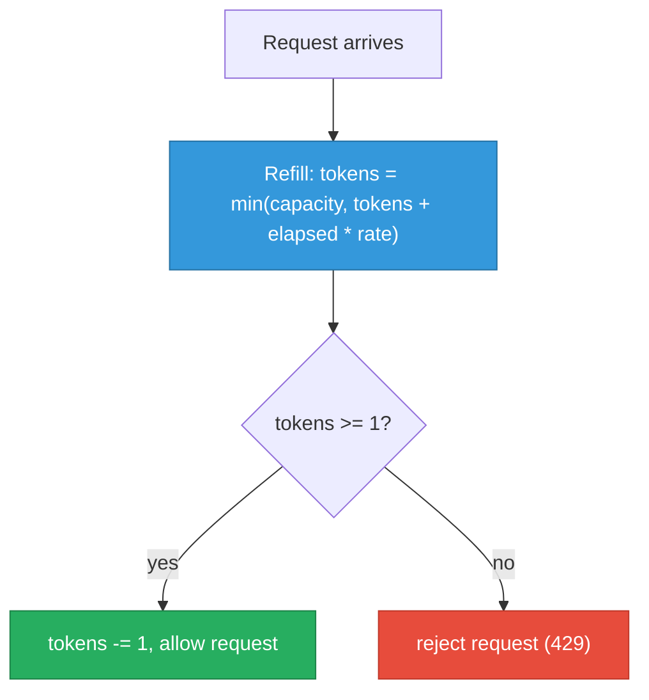
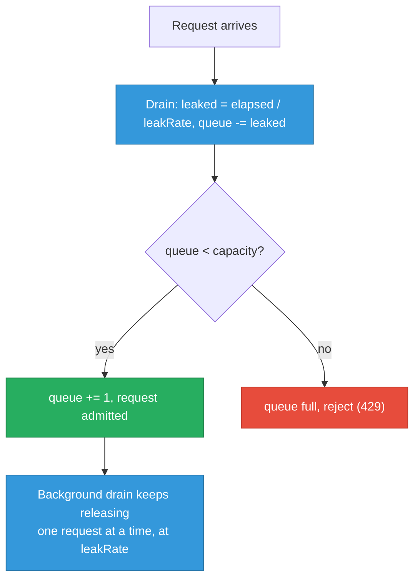
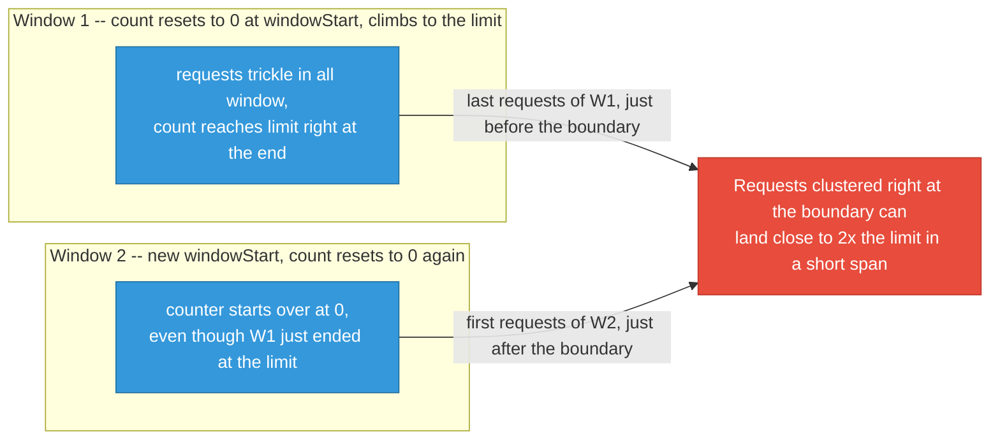
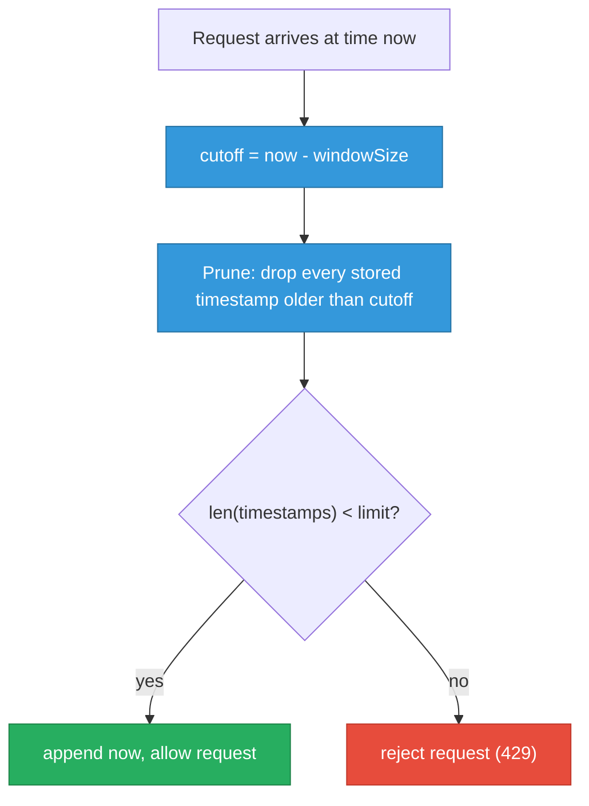

# Rate Limiter Implementations (Go & Python)

Four algorithms from scratch — see [system-design/rate-limiting.md](../system-design/rate-limiting.md) for the conceptual/distributed-systems treatment. This file is the from-scratch, single-process, interview-whiteboard version of each, in both Go and Python, plus an HTTP middleware wrapper.

  0/0 checks
  

---

## 1. Token Bucket

Bucket refills continuously at `rate` tokens/sec up to `capacity`; each request consumes 1 token.

  

    <button data-tab="tb-go" class="active">Go</button>
    <button data-tab="tb-py">Python</button>
    <button data-tab="tb-java">Java</button>
  

  

    

      <pre><code class="language-go">package ratelimit
import (
	"sync"
	"time"
)
// TokenBucket allows bursts up to capacity, then throttles to the refill rate.
type TokenBucket struct {
	mu         sync.Mutex
	capacity   float64
	tokens     float64
	refillRate float64 // tokens per second
	lastRefill time.Time
}
func NewTokenBucket(capacity float64, refillRate float64) *TokenBucket {
	return &amp;TokenBucket{
		capacity:   capacity,
		tokens:     capacity, // start full
		refillRate: refillRate,
		lastRefill: time.Now(),
	}
}
// Allow reports whether a single request may proceed right now.
func (b *TokenBucket) Allow() bool {
	b.mu.Lock()
	defer b.mu.Unlock()
	now := time.Now()
	elapsed := now.Sub(b.lastRefill).Seconds()
	b.tokens = min(b.capacity, b.tokens+elapsed*b.refillRate)
	b.lastRefill = now
	if b.tokens &lt; 1 {
		return false
	}
	b.tokens--
	return true
}
func min(a, b float64) float64 {
	if a &lt; b {
		return a
	}
	return b
}</code></pre>
    

    

      <pre><code class="language-python">import threading
import time
class TokenBucket:
    """Allows bursts up to capacity, then throttles to the refill rate."""
    def __init__(self, capacity: float, refill_rate: float) -&gt; None:
        self._lock = threading.Lock()
        self.capacity = capacity
        self.tokens = capacity  # start full
        self.refill_rate = refill_rate  # tokens per second
        self.last_refill = time.monotonic()
    def allow(self) -&gt; bool:
        """Return True if a single request may proceed right now."""
        with self._lock:
            now = time.monotonic()
            elapsed = now - self.last_refill
            self.tokens = min(self.capacity, self.tokens + elapsed * self.refill_rate)
            self.last_refill = now
            if self.tokens &lt; 1:
                return False
            self.tokens -= 1
            return True
# asyncio variant: swap threading.Lock for asyncio.Lock and `allow` for an
# async def if callers are already inside an event loop instead of threads --
# the refill math is identical, only the mutual-exclusion primitive changes.</code></pre>
    

    

      <pre><code class="language-java">package ratelimit;
import java.util.concurrent.locks.ReentrantLock;
// TokenBucket allows bursts up to capacity, then throttles to the refill rate.
// Implements Limiter (defined below in the HTTP Middleware Wrapper section)
// explicitly -- unlike Go's implicit interface satisfaction or Python's
// structural Protocol above, Java requires "implements" up front.
public class TokenBucket implements Limiter {
    private final ReentrantLock lock = new ReentrantLock();
    private final double capacity;
    private double tokens;
    private final double refillRate; // tokens per second
    private long lastRefillNanos;
    public TokenBucket(double capacity, double refillRate) {
        this.capacity = capacity;
        this.tokens = capacity; // start full
        this.refillRate = refillRate;
        this.lastRefillNanos = System.nanoTime();
    }
    // allow reports whether a single request may proceed right now.
    @Override
    public boolean allow() {
        lock.lock();
        try {
            long now = System.nanoTime();
            double elapsed = (now - lastRefillNanos) / 1_000_000_000.0;
            tokens = Math.min(capacity, tokens + elapsed * refillRate);
            lastRefillNanos = now;
            if (tokens &lt; 1) {
                return false;
            }
            tokens -= 1;
            return true;
        } finally {
            lock.unlock();
        }
    }
}
// Uses a ReentrantLock (java.util.concurrent.locks) as the direct analog of
// Go's sync.Mutex / Python's threading.Lock -- refill-then-check-then-consume
// is a compound operation needing one critical section, not a single atomic
// counter update, so a bare AtomicLong/AtomicDouble CAS loop wouldn't suffice.</code></pre>
    

  

Every `Allow()` call does two things in order — refill based on elapsed time, then check-and-consume:

  
A client that's been idle for a while sends 10 requests in the same instant against a bucket with capacity 5. How many get through, and why not more or fewer?

  <button class="quiz-reveal">Reveal answer</button>
  
5 get through. The bucket refills continuously up to <code>capacity</code>, so an idle client accumulates a full bucket — capacity 5 means at most 5 tokens can ever be sitting there waiting, no matter how long it's been idle. The first 5 requests each consume 1 token and succeed; by the 6th, <code>tokens &lt; 1</code> and <code>Allow()</code> returns false. This is exactly the "allows bursts up to capacity, then throttles to the refill rate" behavior described above.

### Burst Scenario, Step by Step

A bucket with `capacity=5`, `refill_rate=1` token/sec, starting full, hit by a burst of 7 requests arriving back-to-back (elapsed time ≈ 0 between them):

  

    

      <strong>1. Start.</strong> Bucket is full: <code>tokens = 5.00</code> (capacity 5, refill rate 1/sec). No requests yet.
    

    

      <strong>2. Request #1 arrives.</strong> Refill adds ~0 tokens (elapsed ≈ 0). <code>tokens = 5.00 &gt;= 1</code> → allowed. <code>tokens</code> drops to <strong>4.00</strong>.
    

    

      <strong>3. Request #2.</strong> <code>tokens = 4.00 &gt;= 1</code> → allowed. <code>tokens</code> drops to <strong>3.00</strong>.
    

    

      <strong>4. Request #3.</strong> <code>tokens = 3.00 &gt;= 1</code> → allowed. <code>tokens</code> drops to <strong>2.00</strong>.
    

    

      <strong>5. Request #4.</strong> <code>tokens = 2.00 &gt;= 1</code> → allowed. <code>tokens</code> drops to <strong>1.00</strong>.
    

    

      <strong>6. Request #5.</strong> <code>tokens = 1.00 &gt;= 1</code> → allowed. <code>tokens</code> drops to <strong>0.00</strong>. The whole burst allowance (capacity 5) is now spent.
    

    

      <strong>7. Request #6 — REJECTED.</strong> <code>tokens = 0.00 &lt; 1</code> → <code>Allow()</code> returns false, client gets a 429. No headroom left this instant.
    

    

      <strong>8. One second later, request #7 arrives.</strong> Refill adds <code>elapsed * rate = 1 * 1 = 1.00</code> token → <code>tokens = 1.00 &gt;= 1</code> → allowed. <code>tokens</code> drops back to <strong>0.00</strong>. The client is now fully throttled to the 1/sec refill rate — it can send exactly one more request per second, no more bursting until it goes idle long enough to refill.
    

  

  

    <button class="stepper-prev">← Prev</button>
    
    
    <button class="stepper-next">Next →</button>
  

### Try It Yourself: Live Token Bucket

Same numbers as the walkthrough above (capacity 5, refills at 1 token/sec) — except this one runs on the real clock. Click "Send request" fast to burn through the burst allowance, then watch it get throttled; leave it alone for a few seconds and watch the gauge refill on its own.

  <svg class="viz-canvas" viewBox="0 0 320 140"></svg>
  

    <button class="viz-btn" data-viz-action="insert">Send request</button>
    <button class="viz-btn" data-viz-action="reset">Reset</button>
  

  

---

## 2. Leaky Bucket

Requests join a fixed-size queue; a background process drains (processes) at a fixed rate regardless of arrival rate. Shapes bursts into uniform output instead of passing them through.

  

    <button data-tab="lb-go" class="active">Go</button>
    <button data-tab="lb-py">Python</button>
    <button data-tab="lb-java">Java</button>
  

  

    

      <pre><code class="language-go">package ratelimit
import (
	"sync"
	"time"
)
// LeakyBucket queues requests and lets them "leak" out at a fixed rate.
// Unlike TokenBucket, it smooths bursts rather than passing them through.
type LeakyBucket struct {
	mu       sync.Mutex
	capacity int           // max queued requests
	queue    int           // current queue depth
	leakRate time.Duration // time between each leak (1 request drained)
	lastLeak time.Time
}
func NewLeakyBucket(capacity int, leakRate time.Duration) *LeakyBucket {
	return &amp;LeakyBucket{
		capacity: capacity,
		leakRate: leakRate,
		lastLeak: time.Now(),
	}
}
// Allow reports whether the request can be queued (accepted into the bucket).
// It does NOT mean the request is processed immediately — only that it was
// admitted to the queue for eventual draining at leakRate.
func (b *LeakyBucket) Allow() bool {
	b.mu.Lock()
	defer b.mu.Unlock()
	b.drain(time.Now())
	if b.queue &gt;= b.capacity {
		return false // queue full, reject
	}
	b.queue++
	return true
}
// drain removes completed "leaks" based on elapsed time since lastLeak.
func (b *LeakyBucket) drain(now time.Time) {
	elapsed := now.Sub(b.lastLeak)
	leaked := int(elapsed / b.leakRate)
	if leaked &lt;= 0 {
		return
	}
	if leaked &gt; b.queue {
		leaked = b.queue
	}
	b.queue -= leaked
	b.lastLeak = b.lastLeak.Add(time.Duration(leaked) * b.leakRate)
}</code></pre>
    

    

      <pre><code class="language-python">import threading
import time
class LeakyBucket:
    """Queues requests and lets them "leak" out at a fixed rate.
    Unlike TokenBucket, it smooths bursts rather than passing them through.
    """
    def __init__(self, capacity: int, leak_rate: float) -&gt; None:
        """leak_rate: seconds between each leak (1 request drained)."""
        self._lock = threading.Lock()
        self.capacity = capacity
        self.queue = 0  # current queue depth
        self.leak_rate = leak_rate
        self.last_leak = time.monotonic()
    def allow(self) -&gt; bool:
        """Return True if the request can be queued (admitted to the bucket).
        Does NOT mean the request is processed immediately -- only that it
        was admitted to the queue for eventual draining at leak_rate.
        """
        with self._lock:
            self._drain(time.monotonic())
            if self.queue &gt;= self.capacity:
                return False  # queue full, reject
            self.queue += 1
            return True
    def _drain(self, now: float) -&gt; None:
        """Remove completed "leaks" based on elapsed time since last_leak."""
        elapsed = now - self.last_leak
        leaked = int(elapsed / self.leak_rate)
        if leaked &lt;= 0:
            return
        leaked = min(leaked, self.queue)
        self.queue -= leaked
        self.last_leak += leaked * self.leak_rate</code></pre>
    

    

      <pre><code class="language-java">package ratelimit;
import java.util.concurrent.atomic.AtomicInteger;
import java.util.concurrent.locks.ReentrantLock;
// LeakyBucket queues requests and lets them "leak" out at a fixed rate.
// Unlike TokenBucket, it smooths bursts rather than passing them through.
public class LeakyBucket implements Limiter {
    private final ReentrantLock lock = new ReentrantLock();
    private final int capacity; // max queued requests
    private final AtomicInteger queue = new AtomicInteger(0); // current queue depth
    private final long leakRateNanos; // time between each leak (1 request drained)
    private long lastLeakNanos;
    public LeakyBucket(int capacity, long leakRateMillis) {
        this.capacity = capacity;
        this.leakRateNanos = leakRateMillis * 1_000_000L;
        this.lastLeakNanos = System.nanoTime();
    }
    // allow reports whether the request can be queued (accepted into the bucket).
    // It does NOT mean the request is processed immediately -- only that it was
    // admitted to the queue for eventual draining at leakRate.
    @Override
    public boolean allow() {
        lock.lock();
        try {
            drain(System.nanoTime());
            if (queue.get() &gt;= capacity) {
                return false; // queue full, reject
            }
            queue.incrementAndGet();
            return true;
        } finally {
            lock.unlock();
        }
    }
    // drain removes completed "leaks" based on elapsed time since lastLeakNanos.
    private void drain(long now) {
        long elapsed = now - lastLeakNanos;
        int leaked = (int) (elapsed / leakRateNanos);
        if (leaked &lt;= 0) {
            return;
        }
        int current = queue.get();
        if (leaked &gt; current) {
            leaked = current;
        }
        queue.addAndGet(-leaked);
        lastLeakNanos += leaked * leakRateNanos;
    }
}
// queue is an AtomicInteger purely so reads outside the lock (metrics,
// health checks) stay tear-free -- the compound drain+check+increment
// inside allow() still runs under the ReentrantLock for correctness.</code></pre>
    

  

Admission and draining are two separate concerns — a request can be *queued* immediately while still being *processed* much later, smoothly:

  
Both token bucket and leaky bucket can "allow" a burst of requests into the system. What's different about what happens to that burst afterward?

  <button class="quiz-reveal">Reveal answer</button>
  
Token bucket lets an accepted burst through to the caller immediately, as fast as it arrives, up to the bucket's capacity — then throttles once tokens run out. Leaky bucket never passes a burst straight through at all: <code>Allow()</code> only admits the request into the queue, it does "NOT mean the request is processed immediately" — a background drain releases queued requests one at a time at a fixed <code>leakRate</code>, so the output rate is always uniform regardless of how bursty the arrivals were.

---

## 3. Fixed Window Counter

Simplest algorithm. Counts requests in discrete, non-overlapping time windows. Vulnerable to a 2x burst at window boundaries (see comparison table).

  

    <button data-tab="fw-go" class="active">Go</button>
    <button data-tab="fw-py">Python</button>
    <button data-tab="fw-java">Java</button>
  

  

    

      <pre><code class="language-go">package ratelimit
import (
	"sync"
	"time"
)
// FixedWindow counts requests per discrete time window.
type FixedWindow struct {
	mu          sync.Mutex
	limit       int
	windowSize  time.Duration
	windowStart time.Time
	count       int
}
func NewFixedWindow(limit int, windowSize time.Duration) *FixedWindow {
	return &amp;FixedWindow{
		limit:       limit,
		windowSize:  windowSize,
		windowStart: time.Now(),
	}
}
func (w *FixedWindow) Allow() bool {
	w.mu.Lock()
	defer w.mu.Unlock()
	now := time.Now()
	if now.Sub(w.windowStart) &gt;= w.windowSize {
		// New window: reset counter and boundary.
		w.windowStart = now
		w.count = 0
	}
	if w.count &gt;= w.limit {
		return false
	}
	w.count++
	return true
}</code></pre>
    

    

      <pre><code class="language-python">import threading
import time
class FixedWindow:
    """Counts requests per discrete time window."""
    def __init__(self, limit: int, window_size: float) -&gt; None:
        self._lock = threading.Lock()
        self.limit = limit
        self.window_size = window_size
        self.window_start = time.monotonic()
        self.count = 0
    def allow(self) -&gt; bool:
        with self._lock:
            now = time.monotonic()
            if now - self.window_start &gt;= self.window_size:
                # New window: reset counter and boundary.
                self.window_start = now
                self.count = 0
            if self.count &gt;= self.limit:
                return False
            self.count += 1
            return True</code></pre>
    

    

      <pre><code class="language-java">package ratelimit;
import java.util.concurrent.atomic.AtomicInteger;
import java.util.concurrent.locks.ReentrantLock;
// FixedWindow counts requests per discrete time window.
public class FixedWindow implements Limiter {
    private final ReentrantLock lock = new ReentrantLock();
    private final int limit;
    private final long windowSizeNanos;
    private long windowStartNanos;
    private final AtomicInteger count = new AtomicInteger(0);
    public FixedWindow(int limit, long windowSizeMillis) {
        this.limit = limit;
        this.windowSizeNanos = windowSizeMillis * 1_000_000L;
        this.windowStartNanos = System.nanoTime();
    }
    @Override
    public boolean allow() {
        lock.lock();
        try {
            long now = System.nanoTime();
            if (now - windowStartNanos &gt;= windowSizeNanos) {
                // New window: reset counter and boundary.
                windowStartNanos = now;
                count.set(0);
            }
            if (count.get() &gt;= limit) {
                return false;
            }
            count.incrementAndGet();
            return true;
        } finally {
            lock.unlock();
        }
    }
}</code></pre>
    

  

The boundary problem: each window resets its counter independently, so a burst timed right around the edge can slip two windows' worth of traffic past in a much shorter span than `windowSize`:

  
Fixed window's own limitation is called out as "vulnerable to a 2x burst at window boundaries." Why 2x specifically, rather than 3x or some unbounded multiple?

  <button class="quiz-reveal">Reveal answer</button>
  
Because <code>count</code> resets to 0 at each new <code>windowStart</code>, the worst case is a client spending its full <code>limit</code> right at the very end of one window, then immediately spending a full new <code>limit</code> right at the start of the next window — two windows' worth of allowance (2x limit), compressed into a span much shorter than <code>windowSize</code>. It can't exceed 2x because only two windows' counters are ever adjacent to any single point in time; a third window's allowance is never reachable within that same short burst.

---

## 4. Sliding Window Log

Stores the timestamp of every accepted request; on each check, prunes timestamps older than `now - window` and counts what remains. Exact accuracy, O(n) memory per key.

  

    <button data-tab="swl-go" class="active">Go</button>
    <button data-tab="swl-py">Python</button>
    <button data-tab="swl-java">Java</button>
  

  

    

      <pre><code class="language-go">package ratelimit
import (
	"sync"
	"time"
)
// SlidingWindowLog is exact (no boundary burst) but stores one timestamp
// per request within the window — memory scales with request volume.
type SlidingWindowLog struct {
	mu         sync.Mutex
	limit      int
	windowSize time.Duration
	timestamps []time.Time
}
func NewSlidingWindowLog(limit int, windowSize time.Duration) *SlidingWindowLog {
	return &amp;SlidingWindowLog{
		limit:      limit,
		windowSize: windowSize,
		timestamps: make([]time.Time, 0, limit),
	}
}
func (s *SlidingWindowLog) Allow() bool {
	s.mu.Lock()
	defer s.mu.Unlock()
	now := time.Now()
	cutoff := now.Add(-s.windowSize)
	s.timestamps = pruneBefore(s.timestamps, cutoff)
	if len(s.timestamps) &gt;= s.limit {
		return false
	}
	s.timestamps = append(s.timestamps, now)
	return true
}
// pruneBefore drops timestamps older than cutoff. Timestamps are appended
// in increasing order, so the surviving slice is always a suffix — this
// is O(k) where k is the number of expired entries, not a full O(n) scan
// with allocation per call.
func pruneBefore(ts []time.Time, cutoff time.Time) []time.Time {
	i := 0
	for i &lt; len(ts) &amp;&amp; ts[i].Before(cutoff) {
		i++
	}
	return ts[i:]
}</code></pre>
    

    

      <pre><code class="language-python">import threading
import time
from collections import deque
class SlidingWindowLog:
    """Exact (no boundary burst) but stores one timestamp per request
    within the window -- memory scales with request volume.
    """
    def __init__(self, limit: int, window_size: float) -&gt; None:
        self._lock = threading.Lock()
        self.limit = limit
        self.window_size = window_size
        self.timestamps: deque[float] = deque()
    def allow(self) -&gt; bool:
        with self._lock:
            now = time.monotonic()
            cutoff = now - self.window_size
            self._prune_before(cutoff)
            if len(self.timestamps) &gt;= self.limit:
                return False
            self.timestamps.append(now)
            return True
    def _prune_before(self, cutoff: float) -&gt; None:
        """Drop timestamps older than cutoff.
        Timestamps are appended in increasing order, so the surviving
        entries are always a suffix -- popleft() from a deque is O(1) per
        expired entry, not a full O(n) rebuild with allocation per call.
        """
        while self.timestamps and self.timestamps[0] &lt; cutoff:
            self.timestamps.popleft()</code></pre>
    

    

      <pre><code class="language-java">package ratelimit;
import java.util.concurrent.ConcurrentLinkedDeque;
import java.util.concurrent.atomic.AtomicInteger;
import java.util.concurrent.locks.ReentrantLock;
// SlidingWindowLog is exact (no boundary burst) but stores one timestamp
// per request within the window -- memory scales with request volume.
public class SlidingWindowLog implements Limiter {
    private final ReentrantLock lock = new ReentrantLock();
    private final int limit;
    private final long windowSizeNanos;
    private final ConcurrentLinkedDeque&lt;Long&gt; timestamps = new ConcurrentLinkedDeque&lt;&gt;();
    private final AtomicInteger size = new AtomicInteger(0);
    public SlidingWindowLog(int limit, long windowSizeMillis) {
        this.limit = limit;
        this.windowSizeNanos = windowSizeMillis * 1_000_000L;
    }
    @Override
    public boolean allow() {
        lock.lock();
        try {
            long now = System.nanoTime();
            long cutoff = now - windowSizeNanos;
            pruneBefore(cutoff);
            if (size.get() &gt;= limit) {
                return false;
            }
            timestamps.addLast(now);
            size.incrementAndGet();
            return true;
        } finally {
            lock.unlock();
        }
    }
    // pruneBefore drops timestamps older than cutoff. Timestamps are appended
    // in increasing order, so the surviving deque is always a suffix -- this
    // is O(k) where k is the number of expired entries, not a full O(n) scan
    // with allocation per call.
    private void pruneBefore(long cutoff) {
        Long head;
        while ((head = timestamps.peekFirst()) != null &amp;&amp; head &lt; cutoff) {
            timestamps.pollFirst();
            size.decrementAndGet();
        }
    }
}
// ConcurrentLinkedDeque gives lock-free peekFirst()/pollFirst()/addLast(),
// but the overall prune-then-check-then-append sequence still needs the
// ReentrantLock -- otherwise two threads could both pass the size check
// before either appends, admitting one request too many past the limit.</code></pre>
    

  

No reset boundary at all — the window continuously slides with `now`, so every check re-evaluates the true count of requests in the trailing `windowSize` interval:

  
Sliding window log is described as "exact accuracy, O(n) memory per key." What does the "n" actually count, and why does that make it a bad fit for a high-volume key?

  <button class="quiz-reveal">Reveal answer</button>
  
"n" is one timestamp stored per accepted request still inside the current window — the implementation literally keeps a <code>timestamps</code> slice/deque with one entry per request. There's no boundary-reset trick and no counter approximation, which is exactly why it's exact: it always knows the true count in the trailing window. But that same design means memory scales directly with request volume rather than staying O(1) like the other three algorithms — a high-volume key accumulates a correspondingly large number of live timestamp entries at any moment.

---

## Comparison Table

| Algorithm | Memory | Accuracy | Burst handling | Best for |
|---|---|---|---|---|
| Token bucket | O(1) per key | High | Allows bursts up to `capacity`, then throttles to `rate` | API gateways, general-purpose default |
| Leaky bucket | O(1) per key (just a counter, not a real queue in this impl) | High | Smooths bursts to a uniform output rate — no burst passes through | Traffic shaping, protecting a fixed-capacity downstream (e.g. a DB) |
| Fixed window | O(1) per key | Low | Up to 2x limit can pass across a window boundary | Simple, non-critical counters where boundary burst is tolerable |
| Sliding window log | O(n) per key (n = requests in window) | Exact | None — hard cutoff, no boundary effect | Low-volume, high-precision limits (e.g. audit-sensitive admin APIs) |

  
Same burst of requests, same instant, hits all four implementations above with equivalent limits. Which ones let the burst through immediately, and which one(s) don't?

  <button class="quiz-reveal">Reveal answer</button>
  
Token bucket and fixed window both let a burst through immediately — token bucket up to whatever's accumulated in the bucket (capacity), fixed window up to whatever's left of the current window's count (and, at a boundary, up to nearly 2x limit). Sliding window log also admits requests immediately but with a hard, exact cutoff at the true limit — no boundary bonus. Leaky bucket is the odd one out: <code>Allow()</code> only queues a request, it explicitly does not mean the request is processed immediately — the background drain still releases it at the fixed <code>leakRate</code>, so the burst never actually passes through to the downstream system faster than that rate.

---

## HTTP Middleware Wrapper

Any of the four implementations satisfy the same `Limiter` interface, so the middleware is decoupled from the algorithm choice.

  

    <button data-tab="mw-go" class="active">Go</button>
    <button data-tab="mw-py">Python</button>
    <button data-tab="mw-java">Java</button>
  

  

    

      <pre><code class="language-go">package ratelimit
import "net/http"
// Limiter is satisfied by TokenBucket, LeakyBucket, FixedWindow, and
// SlidingWindowLog — any algorithm above can be plugged into Middleware.
type Limiter interface {
	Allow() bool
}
// Middleware wraps an http.Handler, rejecting requests with 429 when the
// underlying Limiter denies them. In production this would key limiters
// per-client (see PerClientMiddleware below) rather than share one global
// limiter across all traffic.
func Middleware(limiter Limiter, next http.Handler) http.Handler {
	return http.HandlerFunc(func(w http.ResponseWriter, r *http.Request) {
		if !limiter.Allow() {
			w.Header().Set("Retry-After", "1")
			http.Error(w, "429 Too Many Requests", http.StatusTooManyRequests)
			return
		}
		next.ServeHTTP(w, r)
	})
}</code></pre>
    

    

      <pre><code class="language-python">from typing import Callable, Protocol
class Limiter(Protocol):
    """Satisfied by TokenBucket, LeakyBucket, FixedWindow, and
    SlidingWindowLog -- any algorithm above can be plugged into the
    middleware below.
    """
    def allow(self) -&gt; bool: ...
def rate_limit_middleware(limiter: Limiter, app: Callable) -&gt; Callable:
    """WSGI middleware: reject requests with 429 when the underlying
    Limiter denies them.
    In production this would key limiters per-client (see
    PerClientMiddleware below) rather than share one global limiter
    across all traffic.
    """
    def wrapped_app(environ, start_response):
        if not limiter.allow():
            start_response(
                "429 Too Many Requests",
                [("Content-Type", "text/plain"), ("Retry-After", "1")],
            )
            return [b"429 Too Many Requests"]
        return app(environ, start_response)
    return wrapped_app
# Flask equivalent, same decision, different plumbing:
#
#   @app.before_request
#   def check_rate_limit():
#       if not limiter.allow():
#           resp = make_response("429 Too Many Requests", 429)
#           resp.headers["Retry-After"] = "1"
#           return resp</code></pre>
    

    

      <pre><code class="language-java">// File: Limiter.java
package ratelimit;
// Limiter is satisfied by TokenBucket, LeakyBucket, FixedWindow, and
// SlidingWindowLog -- any algorithm above can be plugged into RateLimitFilter.
// Java needs an explicit "implements Limiter" on each class (see above);
// there's no structural typing the way Go's interfaces or Python's Protocol
// give you for free.
public interface Limiter {
    boolean allow();
}
// File: RateLimitFilter.java
package ratelimit;
import jakarta.servlet.Filter;
import jakarta.servlet.FilterChain;
import jakarta.servlet.FilterConfig;
import jakarta.servlet.ServletException;
import jakarta.servlet.ServletRequest;
import jakarta.servlet.ServletResponse;
import jakarta.servlet.http.HttpServletResponse;
import java.io.IOException;
// RateLimitFilter wraps any Limiter as a jakarta.servlet.Filter, rejecting
// requests with 429 when the underlying Limiter denies them. In production
// this would key limiters per-client (see PerClientFilter below) rather than
// share one global limiter across all traffic. Uses jakarta.servlet (Jakarta
// EE 9+ / Servlet 6.0, the namespace shipped by Tomcat 10+ and Spring Boot
// 3+) rather than the legacy javax.servlet package -- pick whichever matches
// your container, the doFilter logic below is identical either way.
public class RateLimitFilter implements Filter {
    private final Limiter limiter;
    public RateLimitFilter(Limiter limiter) {
        this.limiter = limiter;
    }
    @Override
    public void init(FilterConfig filterConfig) {
        // No setup needed -- limiter is already constructed.
    }
    @Override
    public void doFilter(ServletRequest request, ServletResponse response, FilterChain chain)
            throws IOException, ServletException {
        if (!limiter.allow()) {
            HttpServletResponse httpResponse = (HttpServletResponse) response;
            httpResponse.setHeader("Retry-After", "1");
            httpResponse.sendError(429, "429 Too Many Requests"); // no SC_TOO_MANY_REQUESTS constant in the servlet API
            return;
        }
        chain.doFilter(request, response);
    }
    @Override
    public void destroy() {
        // No resources to release.
    }
}</code></pre>
    

  

### Per-client variant (keyed by IP or API key)

  

    <button data-tab="pc-go" class="active">Go</button>
    <button data-tab="pc-py">Python</button>
    <button data-tab="pc-java">Java</button>
  

  

    

      <pre><code class="language-go">package ratelimit
import (
	"net"
	"net/http"
	"sync"
)
// PerClientMiddleware maintains one Limiter per client key (e.g. IP address),
// lazily created on first request. limiterFactory lets the caller choose
// which of the four algorithms to instantiate per client.
type PerClientMiddleware struct {
	mu             sync.Mutex
	limiters       map[string]Limiter
	limiterFactory func() Limiter
}
func NewPerClientMiddleware(factory func() Limiter) *PerClientMiddleware {
	return &amp;PerClientMiddleware{
		limiters:       make(map[string]Limiter),
		limiterFactory: factory,
	}
}
func (m *PerClientMiddleware) Wrap(next http.Handler) http.Handler {
	return http.HandlerFunc(func(w http.ResponseWriter, r *http.Request) {
		key := clientKey(r)
		m.mu.Lock()
		limiter, ok := m.limiters[key]
		if !ok {
			limiter = m.limiterFactory()
			m.limiters[key] = limiter
		}
		m.mu.Unlock()
		if !limiter.Allow() {
			w.Header().Set("Retry-After", "1")
			http.Error(w, "429 Too Many Requests", http.StatusTooManyRequests)
			return
		}
		next.ServeHTTP(w, r)
	})
}
func clientKey(r *http.Request) string {
	host, _, err := net.SplitHostPort(r.RemoteAddr)
	if err != nil {
		return r.RemoteAddr
	}
	return host
}
// Example wiring:
//
//   mw := NewPerClientMiddleware(func() Limiter {
//       return NewTokenBucket(20, 5) // burst 20, refill 5/sec, per client
//   })
//   http.Handle("/api/", mw.Wrap(apiHandler))
//   http.ListenAndServe(":8080", nil)
//
// Note: limiters map above grows unbounded as new clients appear — a
// production version needs an eviction policy (e.g. LRU from lru-cache.md,
// or a TTL sweep) to bound memory under a churn of unique client keys.</code></pre>
    

    

      <pre><code class="language-python">import threading
from typing import Callable, Dict
class PerClientMiddleware:
    """Maintains one Limiter per client key (e.g. IP address), lazily
    created on first request. limiter_factory lets the caller choose
    which of the four algorithms to instantiate per client.
    """
    def __init__(self, limiter_factory: Callable[[], "Limiter"]) -&gt; None:
        self._lock = threading.Lock()
        self.limiters: Dict[str, "Limiter"] = {}
        self.limiter_factory = limiter_factory
    def wrap(self, app: Callable) -&gt; Callable:
        def wrapped_app(environ, start_response):
            key = self._client_key(environ)
            with self._lock:
                limiter = self.limiters.get(key)
                if limiter is None:
                    limiter = self.limiter_factory()
                    self.limiters[key] = limiter
            if not limiter.allow():
                start_response(
                    "429 Too Many Requests",
                    [("Content-Type", "text/plain"), ("Retry-After", "1")],
                )
                return [b"429 Too Many Requests"]
            return app(environ, start_response)
        return wrapped_app
    @staticmethod
    def _client_key(environ) -&gt; str:
        return environ.get("REMOTE_ADDR", "unknown")
# Example wiring:
#
#   mw = PerClientMiddleware(lambda: TokenBucket(capacity=20, refill_rate=5))
#   app = mw.wrap(api_handler)  # burst 20, refill 5/sec, per client
#
# Note: limiters dict above grows unbounded as new clients appear -- a
# production version needs an eviction policy (e.g. LRU from lru-cache.md,
# or a TTL sweep) to bound memory under a churn of unique client keys.</code></pre>
    

    

      <pre><code class="language-java">package ratelimit;
import jakarta.servlet.Filter;
import jakarta.servlet.FilterChain;
import jakarta.servlet.FilterConfig;
import jakarta.servlet.ServletException;
import jakarta.servlet.ServletRequest;
import jakarta.servlet.ServletResponse;
import jakarta.servlet.http.HttpServletRequest;
import jakarta.servlet.http.HttpServletResponse;
import java.io.IOException;
import java.util.Map;
import java.util.concurrent.ConcurrentHashMap;
import java.util.function.Supplier;
// PerClientFilter maintains one Limiter per client key (e.g. IP address),
// lazily created on first request. limiterFactory lets the caller choose
// which of the four algorithms to instantiate per client.
public class PerClientFilter implements Filter {
    private final Map&lt;String, Limiter&gt; limiters = new ConcurrentHashMap&lt;&gt;();
    private final Supplier&lt;Limiter&gt; limiterFactory;
    public PerClientFilter(Supplier&lt;Limiter&gt; limiterFactory) {
        this.limiterFactory = limiterFactory;
    }
    @Override
    public void init(FilterConfig filterConfig) {
        // No setup needed.
    }
    @Override
    public void doFilter(ServletRequest request, ServletResponse response, FilterChain chain)
            throws IOException, ServletException {
        String key = clientKey((HttpServletRequest) request);
        Limiter limiter = limiters.computeIfAbsent(key, k -&gt; limiterFactory.get());
        if (!limiter.allow()) {
            HttpServletResponse httpResponse = (HttpServletResponse) response;
            httpResponse.setHeader("Retry-After", "1");
            httpResponse.sendError(429, "429 Too Many Requests"); // no SC_TOO_MANY_REQUESTS constant in the servlet API
            return;
        }
        chain.doFilter(request, response);
    }
    @Override
    public void destroy() {
        // No resources to release.
    }
    private static String clientKey(HttpServletRequest request) {
        return request.getRemoteAddr();
    }
}
// ConcurrentHashMap.computeIfAbsent gives lock-free-on-the-common-path,
// exactly-once-per-key construction of each client's Limiter -- the direct
// analog of Go's mutex-guarded map lookup and Python's lock-guarded dict.get.
// Example wiring (web.xml or Servlet 6.0 annotation-based registration):
//   PerClientFilter filter = new PerClientFilter(
//       () -&gt; new TokenBucket(20, 5)); // burst 20, refill 5/sec, per client
//   FilterRegistration.Dynamic reg =
//       servletContext.addFilter("rateLimit", filter);
//   reg.addMappingForUrlPatterns(null, false, "/api/*");
// Note: limiters map above grows unbounded as new clients appear -- a
// production version needs an eviction policy (e.g. LRU from lru-cache.md,
// or a TTL sweep) to bound memory under a churn of unique client keys.</code></pre>
    

  

