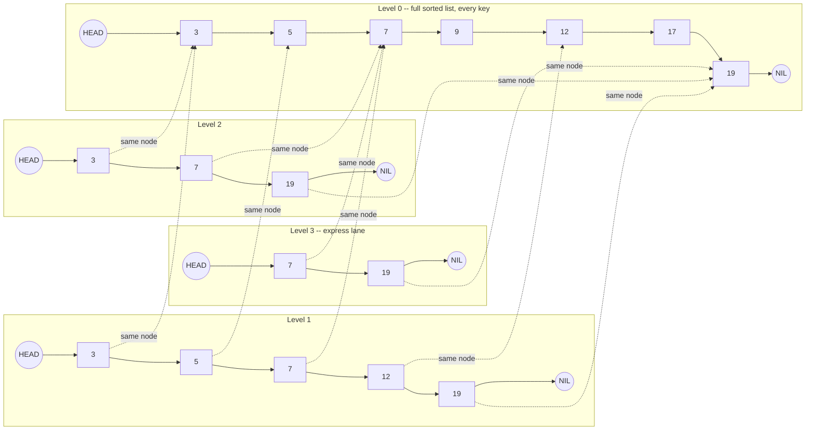

# Skip List (Go + Python)

A skip list is a probabilistic, multi-level linked list that gives expected O(log n) search, insert, and delete — the same asymptotic guarantee as a balanced binary search tree, built from something far simpler: a handful of ordinary linked lists stacked on top of each other, connected by chance instead of by an invariant a rebalancing algorithm has to maintain. There's no rotation logic, no color bits, no balance factor to keep consistent after every mutation — just a coin flip per insert and a splice of forward pointers. This is the structure backing Redis sorted sets — see [databases/redis-internals.md](../databases/redis-internals.md) for how `ZADD`, `ZRANGE`, and `ZRANK` use it in production. Redis picked a skip list over a balanced tree specifically because it hits the same complexity targets while being dramatically easier to implement correctly, and easier to reason about under concurrent access, than a tree that has to stay rebalanced.

<div class="quiz-progress" data-quiz-progress>
  <span class="quiz-progress-label">0/0 checks</span>
  <span class="quiz-progress-bar"><span class="quiz-progress-fill"></span></span>
</div>

---

## Why a Skip List Instead of a Balanced Tree

Four ways to keep a set of ordered keys searchable, and what each one costs to stay correct after every insert or delete:

| Structure | Search | Insert/Delete | What keeps it correct after a mutation |
|---|---|---|---|
| Sorted array | O(log n) binary search | O(n) — shift elements | Nothing extra, but every insert/delete already touches O(n) elements |
| Singly linked list | O(n) — no shortcuts, must scan | O(1) once the spot is found | Nothing — but finding that spot is already O(n) |
| Balanced BST (red-black, AVL) | O(log n) guaranteed | O(log n) guaranteed | Rotations, plus a rebalancing invariant (color bits, balance factor) that must be re-checked and repaired at every affected node, every mutation |
| **Skip list** | **O(log n) expected** | **O(log n) expected** | **Nothing to rebalance — height is decided once per node by a coin flip, and only that node's pointers change** |

A balanced BST earns its guaranteed O(log n) by paying for it with rotation logic: after an insert or delete, one or more rotations may be needed to restore the tree's balance invariant, and that invariant has to hold at every node, all the time, or every later operation built on top of it is wrong too. A skip list sidesteps that class of bug entirely — a node's height is decided independently, once, at insert time, by a coin flip, and nothing else in the structure has to change in response. The tradeoff: the O(log n) bound is probabilistic (expected over the randomness), not a worst-case guarantee — more on exactly what that means in Complexity Analysis below.

Redis's actual sorted-set implementation looks like this conceptually — a handful of stacked linked lists, each level a sparser subset of the one below it, all of them converging on the same fully-sorted base list of every key:



Flattened another way — which levels each key actually reaches (this is one snapshot from one particular sequence of coin flips; a different run produces a different shape, though the *expected* shape is always this same halving pattern):

```
key:      3    5    7    9   12   17   19
level 0:  X    X    X    X    X    X    X    <- every key, always
level 1:  X         X              X
level 2:            X                   X
level 3:            X
```

<div class="quiz-card">
  <p class="quiz-q">A skip list's insert only ever touches the nodes reachable through the "update" pointers it collected during its search — it never rotates or restructures any other part of the list. Why does that matter for correctness under concurrent access, compared to a balanced BST's rotations?</p>
  <button class="quiz-reveal">Reveal answer</button>
  <div class="quiz-a" hidden>
    A BST rotation changes parent/child pointers for multiple nodes at once to preserve a global invariant (red-black coloring, AVL balance factor) — get it wrong under concurrent modification and that invariant breaks for every future operation on the tree, not just the one in flight. A skip list's insert only ever rewrites the <code>forward[i]</code> pointers captured in its <code>update</code> array for the one node being spliced in; there is no global invariant to protect and no other node's pointers change, so it is structurally much easier to lock a small, local region (or reason about with lock-free compare-and-swap) instead of needing a whole-structure rebalance pass.
  </div>
</div>

---

## Randomized Level Generation — How Balance Emerges Without Rebalancing

Every node gets its height the same way: flip a coin. Heads, climb one more level and flip again; tails, stop. With a fair coin (p=0.5), that means every node has a 100% chance of reaching level 1 (the base list — nothing is optional there), a 50% chance of reaching level 2, a 25% chance of reaching level 3, and so on — each additional level half as likely as the one before it. This is a geometric distribution: `P(level == k) = p^(k-1) * (1-p)`.

That single mechanism is the entire "balancing algorithm." No node ever looks at any other node's height to decide its own. No rebalancing pass runs after an insert or delete. And yet the *expected* shape that falls out of thousands of independent coin flips is exactly what you'd hand-design if you were building level structure on purpose: roughly n/2 nodes at level 1 only, n/4 also reaching level 2, n/8 also reaching level 3 — a population that halves at every level up, which is precisely the shape that makes "scan right, then drop down" cost O(log n) expected steps instead of O(n). Nobody coordinated it; it's a statistical consequence of enough independent coin flips.

`p` is a tunable knob, not a fixed constant. This file's Go and Python implementations use p=0.5 — the textbook default, since a fair coin is the simplest thing to reason about in an interview. Redis's real implementation tunes it differently: `p=1/4` and a max level of 32, trading a few more comparisons per level for noticeably fewer, taller nodes overall (fewer average forward pointers per node — see Complexity Analysis), which matters more at Redis's actual sorted-set sizes than shaving one or two comparisons off the search path.

<div class="quiz-card">
  <p class="quiz-q">Why does capping each node's promotion chance at p=0.5 per level produce roughly log2(n) expected levels overall, instead of, say, a constant number of levels or O(n) levels?</p>
  <button class="quiz-reveal">Reveal answer</button>
  <div class="quiz-a" hidden>
    Each level promotion is an independent p=0.5 coin flip, so the count of nodes reaching level k shrinks geometrically: roughly n/2 nodes reach level 1 only, n/4 also reach level 2, n/8 also reach level 3, and so on, halving at every step up. The number of levels it takes for that halving to run out of nodes (down to around 1 remaining) is log2(n) — that's exactly the point where the geometric shrinkage bottoms out, so the list self-organizes into about log2(n) express lanes without anyone ever picking a target height.
  </div>
</div>

---

## Full Implementation

Both versions implement the identical algorithm: a `header` sentinel present at every level, a per-node `forward` array of pointers (one per level that node participates in), and the same "scan right while the next key is smaller, drop a level when it isn't" search used by `Search`, `Insert`, and `Delete` alike.

<div class="tab-group">
  <div class="tab-buttons">
    <button data-tab="impl-go" class="active">Go</button>
    <button data-tab="impl-python">Python</button>
    <button data-tab="impl-java">Java</button>
  </div>
  <div class="tab-panels">
    <div class="tab-panel active" data-tab-panel="impl-go">
      <pre><code class="language-go">package skiplist
// maxLevel caps how tall the list can ever grow. 16 comfortably covers
// millions of entries at p=0.5 (2^16 is far more levels than log2(n) will
// ever demand in practice) without unbounded per-node memory.
import "math/rand"
const maxLevel = 16
const p = 0.5
// Node is one entry in the skip list. forward[i] points to the next node
// that also participates at level i. Level 0 is the full sorted list;
// higher levels are increasingly sparse "express lanes" over the same keys.
type Node struct {
	key     int
	value   int
	forward []*Node
}
// SkipList is an ordered map backed by a probabilistic multi-level linked
// list. header is a sentinel node present at every level that never holds
// a real key and always sorts before every real entry.
type SkipList struct {
	header *Node
	level  int
	rnd    *rand.Rand
}
// New creates an empty skip list.
func New() *SkipList {
	return &amp;SkipList{
		header: &amp;Node{forward: make([]*Node, maxLevel)},
		level:  1,
		rnd:    rand.New(rand.NewSource(rand.Int63())),
	}
}
// randomLevel flips a coin (p=0.5) repeatedly, climbing one more level on
// each "heads", stopping on the first "tails" or at maxLevel. This is a
// geometric distribution: P(level == k) = p^(k-1) * (1-p), so level 1 is
// the most common outcome and each additional level is half as likely as
// the one before it.
func (sl *SkipList) randomLevel() int {
	lvl := 1
	for lvl &lt; maxLevel &amp;&amp; sl.rnd.Float64() &lt; p {
		lvl++
	}
	return lvl
}
// Search returns the value stored for key and whether it was found.
// It walks from the top level down: scan right while the next node's key
// is still less than the target, then drop a level once the next node
// would overshoot (or there is no next node at this level).
func (sl *SkipList) Search(key int) (int, bool) {
	x := sl.header
	for i := sl.level - 1; i &gt;= 0; i-- {
		for x.forward[i] != nil &amp;&amp; x.forward[i].key &lt; key {
			x = x.forward[i]
		}
	}
	x = x.forward[0]
	if x != nil &amp;&amp; x.key == key {
		return x.value, true
	}
	return 0, false
}
// Insert adds key/value, or updates value if key already exists.
func (sl *SkipList) Insert(key, value int) {
	// update[i] records the rightmost node at level i that is still to the
	// left of the insertion point — exactly the nodes whose forward[i]
	// pointer needs to be rewired to splice the new node in.
	update := make([]*Node, maxLevel)
	x := sl.header
	for i := sl.level - 1; i &gt;= 0; i-- {
		for x.forward[i] != nil &amp;&amp; x.forward[i].key &lt; key {
			x = x.forward[i]
		}
		update[i] = x
	}
	x = x.forward[0]
	if x != nil &amp;&amp; x.key == key {
		x.value = value
		return
	}
	newLevel := sl.randomLevel()
	if newLevel &gt; sl.level {
		// The coin flips climbed higher than any existing node. The header
		// itself becomes the "update" pointer for the new top levels since
		// nothing else reaches that high yet.
		for i := sl.level; i &lt; newLevel; i++ {
			update[i] = sl.header
		}
		sl.level = newLevel
	}
	newNode := &amp;Node{key: key, value: value, forward: make([]*Node, newLevel)}
	for i := 0; i &lt; newLevel; i++ {
		newNode.forward[i] = update[i].forward[i]
		update[i].forward[i] = newNode
	}
}
// Delete removes key if present, returning whether it was found.
func (sl *SkipList) Delete(key int) bool {
	update := make([]*Node, maxLevel)
	x := sl.header
	for i := sl.level - 1; i &gt;= 0; i-- {
		for x.forward[i] != nil &amp;&amp; x.forward[i].key &lt; key {
			x = x.forward[i]
		}
		update[i] = x
	}
	x = x.forward[0]
	if x == nil || x.key != key {
		return false
	}
	for i := 0; i &lt; sl.level; i++ {
		if update[i].forward[i] != x {
			break
		}
		update[i].forward[i] = x.forward[i]
	}
	// Shrink sl.level if the top levels are now empty — keeps future
	// searches from wasting steps scanning levels with nothing on them.
	for sl.level &gt; 1 &amp;&amp; sl.header.forward[sl.level-1] == nil {
		sl.level--
	}
	return true
}</code></pre>
    </div>
    <div class="tab-panel" data-tab-panel="impl-python">
      <pre><code class="language-python">from __future__ import annotations
import random
from typing import Optional
MAX_LEVEL = 16
P = 0.5
class Node:
    """One skip list entry. forward[i] points to the next node that also
    participates at level i -- level 0 is the full sorted list, higher
    levels are increasingly sparse "express lanes" over the same keys."""
    def __init__(self, key: int, value: int, level: int) -&gt; None:
        self.key = key
        self.value = value
        self.forward: list[Optional["Node"]] = [None] * level
class SkipList:
    """Ordered map backed by a probabilistic multi-level linked list.
    Expected O(log n) search/insert/delete -- see the accompanying guide
    for why the randomized level distribution achieves that bound."""
    def __init__(self) -&gt; None:
        # header is a sentinel present at every level; it never holds a
        # real key and always sorts before every real entry.
        self.header = Node(key=-1, value=-1, level=MAX_LEVEL)
        self.level = 1
    def _random_level(self) -&gt; int:
        """Flip a coin (p=0.5) repeatedly, climbing one more level on each
        "heads", stopping on the first "tails" or at MAX_LEVEL. Geometric
        distribution: P(level == k) = p^(k-1) * (1-p)."""
        lvl = 1
        while lvl &lt; MAX_LEVEL and random.random() &lt; P:
            lvl += 1
        return lvl
    def search(self, key: int) -&gt; Optional[int]:
        """Return the value for key, or None if key is not present."""
        x = self.header
        for i in range(self.level - 1, -1, -1):
            while x.forward[i] is not None and x.forward[i].key &lt; key:
                x = x.forward[i]
        x = x.forward[0]
        if x is not None and x.key == key:
            return x.value
        return None
    def insert(self, key: int, value: int) -&gt; None:
        """Insert key/value, or update value if key already exists."""
        # update[i] is the rightmost node at level i still left of the
        # insertion point -- exactly the pointers that need rewiring.
        update: list[Node] = [self.header] * MAX_LEVEL
        x = self.header
        for i in range(self.level - 1, -1, -1):
            while x.forward[i] is not None and x.forward[i].key &lt; key:
                x = x.forward[i]
            update[i] = x
        x = x.forward[0]
        if x is not None and x.key == key:
            x.value = value
            return
        new_level = self._random_level()
        if new_level &gt; self.level:
            # The coin flips climbed higher than any existing node -- the
            # header stands in as the update pointer for the new top levels.
            for i in range(self.level, new_level):
                update[i] = self.header
            self.level = new_level
        new_node = Node(key, value, new_level)
        for i in range(new_level):
            new_node.forward[i] = update[i].forward[i]
            update[i].forward[i] = new_node
    def delete(self, key: int) -&gt; bool:
        """Remove key if present. Returns whether it was found."""
        update: list[Node] = [self.header] * MAX_LEVEL
        x = self.header
        for i in range(self.level - 1, -1, -1):
            while x.forward[i] is not None and x.forward[i].key &lt; key:
                x = x.forward[i]
            update[i] = x
        x = x.forward[0]
        if x is None or x.key != key:
            return False
        for i in range(self.level):
            if update[i].forward[i] is not x:
                break
            update[i].forward[i] = x.forward[i]
        # Shrink self.level if the top levels are now empty -- keeps
        # future searches from wasting steps on levels with nothing on them.
        while self.level &gt; 1 and self.header.forward[self.level - 1] is None:
            self.level -= 1
        return True</code></pre>
    </div>
    <div class="tab-panel" data-tab-panel="impl-java">
      <pre><code class="language-java">package skiplist;
import java.util.concurrent.ThreadLocalRandom;
// MAX_LEVEL caps how tall the list can ever grow. 16 comfortably covers
// millions of entries at p=0.5 (2^16 is far more levels than log2(n) will
// ever demand in practice) without unbounded per-node memory.
// SkipList is an ordered map backed by a probabilistic multi-level linked
// list. header is a sentinel node present at every level that never holds
// a real key and always sorts before every real entry.
public class SkipList&lt;K extends Comparable&lt;K&gt;, V&gt; {
    private static final int MAX_LEVEL = 16;
    private static final double P = 0.5;
    // Node is one entry in the skip list. forward[i] points to the next
    // node that also participates at level i. Level 0 is the full sorted
    // list; higher levels are increasingly sparse "express lanes" over the
    // same keys.
    private static class Node&lt;K, V&gt; {
        K key;
        V value;
        Node&lt;K, V&gt;[] forward;
        @SuppressWarnings("unchecked")
        Node(K key, V value, int level) {
            this.key = key;
            this.value = value;
            this.forward = new Node[level];
        }
    }
    private final Node&lt;K, V&gt; header;
    private int level;
    // New creates an empty skip list.
    @SuppressWarnings("unchecked")
    public SkipList() {
        this.header = new Node&lt;&gt;(null, null, MAX_LEVEL);
        this.level = 1;
    }
    // randomLevel flips a coin (p=0.5) repeatedly, climbing one more level on
    // each "heads", stopping on the first "tails" or at MAX_LEVEL. This is a
    // geometric distribution: P(level == k) = p^(k-1) * (1-p), so level 1 is
    // the most common outcome and each additional level is half as likely as
    // the one before it.
    private int randomLevel() {
        int lvl = 1;
        while (lvl &lt; MAX_LEVEL &amp;&amp; ThreadLocalRandom.current().nextDouble() &lt; P) {
            lvl++;
        }
        return lvl;
    }
    // search returns the value stored for key, or null if it was not found.
    // It walks from the top level down: scan right while the next node's key
    // is still less than the target, then drop a level once the next node
    // would overshoot (or there is no next node at this level).
    public V search(K key) {
        Node&lt;K, V&gt; x = header;
        for (int i = level - 1; i &gt;= 0; i--) {
            while (x.forward[i] != null &amp;&amp; x.forward[i].key.compareTo(key) &lt; 0) {
                x = x.forward[i];
            }
        }
        x = x.forward[0];
        if (x != null &amp;&amp; x.key.compareTo(key) == 0) {
            return x.value;
        }
        return null;
    }
    // insert adds key/value, or updates value if key already exists.
    @SuppressWarnings("unchecked")
    public void insert(K key, V value) {
        // update[i] records the rightmost node at level i that is still to the
        // left of the insertion point -- exactly the nodes whose forward[i]
        // pointer needs to be rewired to splice the new node in.
        Node&lt;K, V&gt;[] update = new Node[MAX_LEVEL];
        Node&lt;K, V&gt; x = header;
        for (int i = level - 1; i &gt;= 0; i--) {
            while (x.forward[i] != null &amp;&amp; x.forward[i].key.compareTo(key) &lt; 0) {
                x = x.forward[i];
            }
            update[i] = x;
        }
        x = x.forward[0];
        if (x != null &amp;&amp; x.key.compareTo(key) == 0) {
            x.value = value;
            return;
        }
        int newLevel = randomLevel();
        if (newLevel &gt; level) {
            // The coin flips climbed higher than any existing node. The header
            // itself becomes the "update" pointer for the new top levels since
            // nothing else reaches that high yet.
            for (int i = level; i &lt; newLevel; i++) {
                update[i] = header;
            }
            level = newLevel;
        }
        Node&lt;K, V&gt; newNode = new Node&lt;&gt;(key, value, newLevel);
        for (int i = 0; i &lt; newLevel; i++) {
            newNode.forward[i] = update[i].forward[i];
            update[i].forward[i] = newNode;
        }
    }
    // delete removes key if present, returning whether it was found.
    @SuppressWarnings("unchecked")
    public boolean delete(K key) {
        Node&lt;K, V&gt;[] update = new Node[MAX_LEVEL];
        Node&lt;K, V&gt; x = header;
        for (int i = level - 1; i &gt;= 0; i--) {
            while (x.forward[i] != null &amp;&amp; x.forward[i].key.compareTo(key) &lt; 0) {
                x = x.forward[i];
            }
            update[i] = x;
        }
        x = x.forward[0];
        if (x == null || x.key.compareTo(key) != 0) {
            return false;
        }
        for (int i = 0; i &lt; level; i++) {
            if (update[i].forward[i] != x) {
                break;
            }
            update[i].forward[i] = x.forward[i];
        }
        // Shrink level if the top levels are now empty -- keeps future
        // searches from wasting steps scanning levels with nothing on them.
        while (level &gt; 1 &amp;&amp; header.forward[level - 1] == null) {
            level--;
        }
        return true;
    }
}</code></pre>
    </div>
  </div>
</div>

### Tests

<div class="tab-group">
  <div class="tab-buttons">
    <button data-tab="test-go" class="active">Go</button>
    <button data-tab="test-python">Python</button>
    <button data-tab="test-java">Java</button>
  </div>
  <div class="tab-panels">
    <div class="tab-panel active" data-tab-panel="test-go">
      <pre><code class="language-go">package skiplist
import "testing"
func TestSearchFound(t *testing.T) {
	sl := New()
	sl.Insert(3, 300)
	sl.Insert(6, 600)
	sl.Insert(9, 900)
	if v, ok := sl.Search(6); !ok || v != 600 {
		t.Fatalf("Search(6) = %d, %v; want 600, true", v, ok)
	}
}
func TestSearchMissing(t *testing.T) {
	sl := New()
	sl.Insert(1, 10)
	if _, ok := sl.Search(99); ok {
		t.Fatal("Search(99) should return false on a key that was never inserted")
	}
}
func TestInsertUpdatesExistingKey(t *testing.T) {
	sl := New()
	sl.Insert(5, 50)
	sl.Insert(5, 999)
	if v, ok := sl.Search(5); !ok || v != 999 {
		t.Fatalf("Search(5) = %d, %v; want 999, true (update, not duplicate)", v, ok)
	}
}
func TestOrderedTraversalAfterManyInserts(t *testing.T) {
	sl := New()
	keys := []int{17, 3, 9, 1, 12, 5, 19, 7}
	for _, k := range keys {
		sl.Insert(k, k*10)
	}
	for _, k := range keys {
		if v, ok := sl.Search(k); !ok || v != k*10 {
			t.Fatalf("Search(%d) = %d, %v; want %d, true", k, v, ok, k*10)
		}
	}
}
func TestDeleteRemovesKey(t *testing.T) {
	sl := New()
	sl.Insert(1, 1)
	sl.Insert(2, 2)
	sl.Insert(3, 3)
	if !sl.Delete(2) {
		t.Fatal("Delete(2) should return true for a present key")
	}
	if _, ok := sl.Search(2); ok {
		t.Fatal("key 2 should no longer be found after Delete")
	}
	if _, ok := sl.Search(1); !ok {
		t.Fatal("key 1 should be unaffected by deleting key 2")
	}
	if _, ok := sl.Search(3); !ok {
		t.Fatal("key 3 should be unaffected by deleting key 2")
	}
}
func TestDeleteMissingKey(t *testing.T) {
	sl := New()
	sl.Insert(1, 1)
	if sl.Delete(42) {
		t.Fatal("Delete(42) should return false for a key that was never inserted")
	}
}</code></pre>
    </div>
    <div class="tab-panel" data-tab-panel="test-python">
      <pre><code class="language-python">import unittest
from skiplist import SkipList
class TestSkipList(unittest.TestCase):
    def test_search_found(self) -&gt; None:
        sl = SkipList()
        sl.insert(3, 300)
        sl.insert(6, 600)
        sl.insert(9, 900)
        self.assertEqual(sl.search(6), 600)
    def test_search_missing(self) -&gt; None:
        sl = SkipList()
        sl.insert(1, 10)
        self.assertIsNone(sl.search(99))
    def test_insert_updates_existing_key(self) -&gt; None:
        sl = SkipList()
        sl.insert(5, 50)
        sl.insert(5, 999)
        self.assertEqual(sl.search(5), 999)
    def test_ordered_traversal_after_many_inserts(self) -&gt; None:
        sl = SkipList()
        keys = [17, 3, 9, 1, 12, 5, 19, 7]
        for k in keys:
            sl.insert(k, k * 10)
        for k in keys:
            self.assertEqual(sl.search(k), k * 10)
    def test_delete_removes_key(self) -&gt; None:
        sl = SkipList()
        sl.insert(1, 1)
        sl.insert(2, 2)
        sl.insert(3, 3)
        self.assertTrue(sl.delete(2))
        self.assertIsNone(sl.search(2))
        self.assertEqual(sl.search(1), 1)
        self.assertEqual(sl.search(3), 3)
    def test_delete_missing_key(self) -&gt; None:
        sl = SkipList()
        sl.insert(1, 1)
        self.assertFalse(sl.delete(42))
if __name__ == "__main__":
    unittest.main()</code></pre>
    </div>
    <div class="tab-panel" data-tab-panel="test-java">
      <pre><code class="language-java">package skiplist;
public class SkipListTest {
    public static void main(String[] args) {
        testSearchFound();
        testSearchMissing();
        testInsertUpdatesExistingKey();
        testOrderedTraversalAfterManyInserts();
        testDeleteRemovesKey();
        testDeleteMissingKey();
        System.out.println("All tests passed");
    }
    static void testSearchFound() {
        SkipList&lt;Integer, Integer&gt; sl = new SkipList&lt;&gt;();
        sl.insert(3, 300);
        sl.insert(6, 600);
        sl.insert(9, 900);
        Integer v = sl.search(6);
        if (v == null || v != 600) {
            throw new AssertionError("search(6) = " + v + "; want 600");
        }
    }
    static void testSearchMissing() {
        SkipList&lt;Integer, Integer&gt; sl = new SkipList&lt;&gt;();
        sl.insert(1, 10);
        if (sl.search(99) != null) {
            throw new AssertionError("search(99) should return null for a key that was never inserted");
        }
    }
    static void testInsertUpdatesExistingKey() {
        SkipList&lt;Integer, Integer&gt; sl = new SkipList&lt;&gt;();
        sl.insert(5, 50);
        sl.insert(5, 999);
        Integer v = sl.search(5);
        if (v == null || v != 999) {
            throw new AssertionError("search(5) = " + v + "; want 999 (update, not duplicate)");
        }
    }
    static void testOrderedTraversalAfterManyInserts() {
        SkipList&lt;Integer, Integer&gt; sl = new SkipList&lt;&gt;();
        int[] keys = {17, 3, 9, 1, 12, 5, 19, 7};
        for (int k : keys) {
            sl.insert(k, k * 10);
        }
        for (int k : keys) {
            Integer v = sl.search(k);
            if (v == null || v != k * 10) {
                throw new AssertionError("search(" + k + ") = " + v + "; want " + (k * 10));
            }
        }
    }
    static void testDeleteRemovesKey() {
        SkipList&lt;Integer, Integer&gt; sl = new SkipList&lt;&gt;();
        sl.insert(1, 1);
        sl.insert(2, 2);
        sl.insert(3, 3);
        if (!sl.delete(2)) {
            throw new AssertionError("delete(2) should return true for a present key");
        }
        if (sl.search(2) != null) {
            throw new AssertionError("key 2 should no longer be found after delete");
        }
        if (sl.search(1) == null) {
            throw new AssertionError("key 1 should be unaffected by deleting key 2");
        }
        if (sl.search(3) == null) {
            throw new AssertionError("key 3 should be unaffected by deleting key 2");
        }
    }
    static void testDeleteMissingKey() {
        SkipList&lt;Integer, Integer&gt; sl = new SkipList&lt;&gt;();
        sl.insert(1, 1);
        if (sl.delete(42)) {
            throw new AssertionError("delete(42) should return false for a key that was never inserted");
        }
    }
}</code></pre>
    </div>
  </div>
</div>

---

## Complexity Analysis

| Operation | Expected time | Worst case |
|---|---|---|
| `Search` | O(log n) | O(n) — every node happened to land at level 1 only; astronomically unlikely but not impossible |
| `Insert` | O(log n) | O(n) |
| `Delete` | O(log n) | O(n) |
| Space | O(n) expected pointers, ~2n at p=0.5 | O(n · maxLevel) absolute ceiling, never approached in practice |

Why the expected time is O(log n): the search/insert/delete loop does two things repeatedly — scan right at the current level, then drop down a level. Because promotion to level i+1 happens with independent probability p, the *expected* number of nodes scanned at any given level before dropping down is a constant (1/p, not dependent on n), and the *expected* number of levels to descend through is O(log n) (per the halving argument in the section above). Constant work per level times O(log n) levels gives expected O(log n) total — the same shape of argument as a balanced tree's height bound, just derived from probability instead of an enforced invariant.

The "expected," not "worst case," qualifier is the real tradeoff versus a red-black tree or AVL tree. Nothing stops every single coin flip from coming up tails immediately for n inserts in a row — that degenerates the skip list into a plain singly linked list, O(n) search, for that particular run. The probability of that happening is vanishingly small (it shrinks exponentially with n), which is why skip lists are considered production-safe despite not having a hard worst-case guarantee — but a red-black tree's O(log n) holds for literally every possible insertion sequence, adversarial or not, which is why some systems that must defend against adversarially-chosen keys still reach for a guaranteed-balanced tree instead.

Space overhead versus a plain singly linked list: a plain linked list stores exactly 1 forward pointer per node. A skip list's expected forward-pointer count per node is `1/(1-p)` — with p=0.5 that's 2 pointers per node on average (every node has its guaranteed level-0 pointer, plus a 50% chance of a 2nd, 25% chance of a 3rd, and so on, a geometric series summing to 2). That's roughly double the pointer memory of a plain linked list, in exchange for turning O(n) search into expected O(log n) — a cheap trade at any real n. Redis's p=1/4 pushes that ratio down to `1/(1-0.25)` ≈ 1.33 pointers per node on average, favoring memory density over shaving comparisons off the search path, which matters more when a single Redis instance is holding many sorted sets in RAM at once.

<div class="quiz-card">
  <p class="quiz-q">With p=0.5, a skip list's expected forward-pointer count per node works out to 1/(1-p) = 2. How does that compare to a plain singly linked list's per-node overhead, and what does that overhead buy?</p>
  <button class="quiz-reveal">Reveal answer</button>
  <div class="quiz-a" hidden>
    A plain singly linked list has exactly 1 forward pointer per node. A skip list at p=0.5 averages 2 — roughly double the pointer memory per node — in exchange for turning O(n) search into expected O(log n). Redis tunes p down to 1/4 instead, which lowers the average to about 1.33 pointers per node, trading a few more per-level comparisons for a leaner memory footprint across the many sorted sets a single instance typically holds in RAM at once.
  </div>
</div>

---

## Insert Walkthrough

Every insert is really two operations back to back: the same top-down search used by `Search`, followed by a coin flip and a pointer splice. Step through inserting key `12` into a list that already contains `3, 5, 7, 9, 17, 19`:

<div class="stepper">
  <div class="stepper-panels">
    <div class="stepper-panel active">
      <strong>1. Search for the insertion point, top level down.</strong> Start at <code>header</code>, at the current top level. At each level: scan right while the next node's key is still less than the target (<code>12</code>); the moment the next node is missing or its key would overshoot, drop down one level instead of continuing right. Record the last node visited at each level into <code>update[i]</code> — these are exactly the nodes whose <code>forward[i]</code> pointer will need to change.
    </div>
    <div class="stepper-panel">
      <strong>2. Keep dropping until level 0.</strong> Repeat step 1's scan-then-drop at every level down to level 0. By the time level 0 is reached, <code>x</code> sits on the last key smaller than <code>12</code> (here, <code>9</code>), and <code>update[0..top]</code> holds the complete set of predecessor nodes for the new key at every level.
    </div>
    <div class="stepper-panel">
      <strong>3. Flip a coin for the new node's height.</strong> Call <code>randomLevel()</code> / <code>_random_level()</code>: climb one more level for every "heads" (p=0.5), stop on the first "tails." Say it comes up level 3 this time — pure chance, unrelated to the key's value or the list's current shape.
    </div>
    <div class="stepper-panel">
      <strong>4. Extend the list's height if the coin flip demands it.</strong> If <code>newLevel</code> (3) exceeds the list's current max level, the <code>header</code> sentinel itself becomes the <code>update</code> pointer for those newly-opened top levels — nothing else in the list reaches that high yet, so there is nothing else to splice past.
    </div>
    <div class="stepper-panel">
      <strong>5. Splice in and rewire, level by level.</strong> For every level from 0 up to <code>newLevel-1</code>: the new node's <code>forward[i]</code> takes over whatever <code>update[i].forward[i]</code> used to point to, and <code>update[i].forward[i]</code> is repointed at the new node. That's the entire mutation — every node outside the <code>update</code> chain is completely untouched.
    </div>
  </div>
  <div class="stepper-controls">
    <button class="stepper-prev">← Prev</button>
    <span class="stepper-dots"></span>
    <span class="stepper-label"></span>
    <button class="stepper-next">Next →</button>
  </div>
</div>

---

## Try It Yourself: Live Skip List

The walkthrough above was one scripted insert. This is a real skip list running in your browser — insert, search, or delete any key and watch the levels reshape. Heights are genuinely randomized (an actual `Math.random()` coin flip per level, capped at 6 for this visualizer instead of the code's 16, since a demo never needs more), so your list won't look the same twice — that's the point. The dashed vertical line behind a node shows its full height; solid horizontal lines are the `forward` pointers a search actually follows.

<div class="structure-viz" id="skiplist-live-viz">
  <svg class="viz-canvas" viewBox="0 0 640 200"></svg>
  <div class="viz-controls">
    <input class="viz-input" type="number" placeholder="key" />
    <button class="viz-btn" data-viz-action="insert">Insert</button>
    <button class="viz-btn" data-viz-action="search">Search</button>
    <button class="viz-btn viz-btn-danger" data-viz-action="delete">Delete</button>
    <button class="viz-btn" data-viz-action="reset">Reset</button>
  </div>
  <div class="viz-status"></div>
  <div class="viz-legend">
    <span><span class="viz-swatch" style="background:#1e3a8a"></span> key</span>
    <span><span class="viz-swatch" style="background:#14532d"></span> just inserted</span>
    <span><span class="viz-swatch" style="background:#78350f"></span> on the search path</span>
    <span><span class="viz-swatch" style="background:#334155;border:1px dashed #64748b"></span> dashed = a node's full height</span>
  </div>
</div>

<script>
(function () {
  const svgNS = 'http://www.w3.org/2000/svg';
  const root0 = document.getElementById('skiplist-live-viz');
  const svg = root0.querySelector('.viz-canvas');
  const input = root0.querySelector('.viz-input');
  const status = root0.querySelector('.viz-status');

  const MAX_LEVEL = 6, P = 0.5;
  const ROW_H = 40, COL_W = 64, HEADER_W = 40;

  let header, level, nextId, highlightIds, newId, flashTimer;

  function reset() {
    nextId = 0;
    level = 1;
    header = { id: 'H', key: -Infinity, forward: new Array(MAX_LEVEL).fill(null) };
    highlightIds = new Set();
    newId = null;
    [3, 5, 7, 9, 17, 19].forEach(k => insert(k, true));
  }

  function randomLevel() {
    let lvl = 1;
    while (lvl < MAX_LEVEL && Math.random() < P) lvl++;
    return lvl;
  }

  function insert(key, silent) {
    const update = new Array(MAX_LEVEL).fill(header);
    let node = header;
    for (let i = level - 1; i >= 0; i--) {
      while (node.forward[i] && node.forward[i].key < key) node = node.forward[i];
      update[i] = node;
    }
    const next = node.forward[0];
    if (next && next.key === key) {
      if (!silent) setStatus(`${key} is already in the list — no change.`, 'error');
      return;
    }
    const newLevel = randomLevel();
    if (newLevel > level) {
      for (let i = level; i < newLevel; i++) update[i] = header;
      level = newLevel;
    }
    const id = 'n' + nextId++;
    const newNode = { id, key, forward: new Array(newLevel).fill(null) };
    for (let i = 0; i < newLevel; i++) {
      newNode.forward[i] = update[i].forward[i];
      update[i].forward[i] = newNode;
    }
    if (!silent) {
      newId = id;
      setStatus(`Inserted ${key} at height ${newLevel} (coin flips: ${newLevel - 1} heads then a tail, capped at ${MAX_LEVEL}).`, 'ok');
    }
  }

  function findSearchPath(key) {
    const visited = [header.id];
    let node = header;
    for (let i = level - 1; i >= 0; i--) {
      while (node.forward[i] && node.forward[i].key < key) { node = node.forward[i]; visited.push(node.id); }
    }
    const cand = node.forward[0];
    return { visited, found: !!(cand && cand.key === key) };
  }

  function doSearch(key) {
    const { visited, found } = findSearchPath(key);
    highlightIds = new Set(visited);
    setStatus(
      found ? `Found ${key} — visited ${visited.length} node(s) scanning right, dropping down each time the next key overshoots.`
            : `${key} not found — visited ${visited.length} node(s) before landing on the spot it would occupy.`,
      found ? 'ok' : 'error'
    );
    scheduleFlashClear();
  }

  function doDelete(key) {
    const update = new Array(level).fill(null);
    let node = header;
    for (let i = level - 1; i >= 0; i--) {
      while (node.forward[i] && node.forward[i].key < key) node = node.forward[i];
      update[i] = node;
    }
    const target = node.forward[0];
    if (!target || target.key !== key) {
      setStatus(`${key} isn't in the list — nothing to delete.`, 'error');
      return;
    }
    let levelsUnlinked = 0;
    for (let i = 0; i < level; i++) {
      if (update[i].forward[i] !== target) continue;
      update[i].forward[i] = target.forward[i];
      levelsUnlinked++;
    }
    const before = level;
    while (level > 1 && !header.forward[level - 1]) level--;
    const shrank = before !== level;
    setStatus(`Deleted ${key} — unlinked at ${levelsUnlinked} level(s)${shrank ? `, list height shrank to ${level}` : ''}.`, 'ok');
  }

  function scheduleFlashClear() {
    clearTimeout(flashTimer);
    flashTimer = setTimeout(() => { highlightIds = new Set(); draw(); }, 1800);
  }

  function setStatus(msg, kind) {
    status.textContent = msg;
    status.className = 'viz-status' + (kind === 'ok' ? ' viz-status-ok' : kind === 'error' ? ' viz-status-error' : '');
  }

  function el(tag, attrs) {
    const e = document.createElementNS(svgNS, tag);
    for (const k in attrs) e.setAttribute(k, attrs[k]);
    return e;
  }

  function draw() {
    const order = [header];
    let n = header.forward[0];
    while (n) { order.push(n); n = n.forward[0]; }
    const xOf = new Map();
    order.forEach((node, i) => xOf.set(node.id, HEADER_W + i * COL_W));

    const vbW = Math.max(500, HEADER_W + order.length * COL_W + 20);
    const vbH = level * ROW_H + 40;
    svg.setAttribute('viewBox', `0 0 ${vbW} ${vbH}`);
    while (svg.firstChild) svg.removeChild(svg.firstChild);

    for (let lvl = level - 1; lvl >= 0; lvl--) {
      const y = (level - 1 - lvl) * ROW_H + 20;
      const rowNodes = [header, ...order.slice(1).filter(nd => nd.forward.length > lvl)];
      for (let i = 0; i < rowNodes.length - 1; i++) {
        const a = rowNodes[i], b = rowNodes[i + 1];
        svg.appendChild(el('line', {
          x1: xOf.get(a.id) + 14, y1: y, x2: xOf.get(b.id) - 14, y2: y,
          class: 'viz-edge' + (highlightIds.has(a.id) && highlightIds.has(b.id) ? ' viz-edge-active' : ''),
        }));
      }
      const last = rowNodes[rowNodes.length - 1];
      svg.appendChild(el('line', {
        x1: xOf.get(last.id) + 14, y1: y, x2: xOf.get(last.id) + 30, y2: y, class: 'viz-edge',
      }));
    }

    order.forEach(node => {
      if (node === header) return;
      const h = node.forward.length;
      if (h <= 1) return;
      const topY = (level - h) * ROW_H + 20;
      const botY = (level - 1) * ROW_H + 20;
      svg.appendChild(el('line', {
        x1: xOf.get(node.id), y1: topY, x2: xOf.get(node.id), y2: botY,
        class: 'viz-edge', 'stroke-dasharray': '2,3', opacity: '0.35',
      }));
    });

    for (let lvl = level - 1; lvl >= 0; lvl--) {
      const y = (level - 1 - lvl) * ROW_H + 20;
      const rowNodes = lvl === level - 1 ? order : order.filter(nd => nd === header || nd.forward.length > lvl);
      rowNodes.forEach(node => {
        const x = xOf.get(node.id);
        const isHeader = node === header;
        let cls = 'viz-node';
        if (node.id === newId && lvl === 0) cls = 'viz-node-new';
        if (highlightIds.has(node.id)) cls = 'viz-node-highlight';
        svg.appendChild(el('rect', { x: x - 14, y: y - 12, width: 28, height: 24, rx: 4, class: cls }));
        const t = el('text', { x, y });
        t.textContent = isHeader ? 'H' : node.key;
        svg.appendChild(t);
      });
    }
  }

  root0.querySelector('[data-viz-action="insert"]').addEventListener('click', () => {
    const v = parseInt(input.value, 10);
    if (isNaN(v)) { setStatus('Enter a number first.', 'error'); return; }
    highlightIds = new Set();
    insert(v);
    input.value = '';
    draw();
    scheduleFlashClear();
  });

  root0.querySelector('[data-viz-action="search"]').addEventListener('click', () => {
    const v = parseInt(input.value, 10);
    if (isNaN(v)) { setStatus('Enter a number first.', 'error'); return; }
    newId = null;
    doSearch(v);
    draw();
  });

  root0.querySelector('[data-viz-action="delete"]').addEventListener('click', () => {
    const v = parseInt(input.value, 10);
    if (isNaN(v)) { setStatus('Enter a number first.', 'error'); return; }
    highlightIds = new Set(); newId = null;
    doDelete(v);
    draw();
  });

  root0.querySelector('[data-viz-action="reset"]').addEventListener('click', () => {
    reset();
    setStatus('Reset to the example list from the walkthrough above.', '');
    draw();
  });

  reset();
  setStatus('Loaded an example list — try inserting, searching, or deleting a key. Heights are randomized, so your list will reshape differently each time.', '');
  draw();
})();
</script>

---

## Interview Follow-Ups

### 1. Why not just use a balanced BST (e.g. a red-black tree) instead?

Both give O(log n) search/insert/delete asymptotically, but a red-black tree's is a hard worst-case guarantee while a skip list's is an expected one (see Complexity Analysis) — the real reason to still reach for a skip list is implementation risk, not asymptotics. Red-black tree insert/delete requires rotation logic plus recoloring rules that are notoriously easy to get subtly wrong — interviewers routinely see candidates handle the easy insert cases fine and then fumble the recoloring edge cases on delete. A skip list's insert/delete is "run the same search you already wrote, flip a coin, splice some pointers" — no case analysis on sibling colors, no double-rotation special cases. That implementation simplicity is exactly why Redis chose a skip list for `ZSET` over a tree structure: comparable performance, meaningfully less code that could hide a correctness bug, and (see follow-up 3) an easier structure to make concurrency-safe.

### 2. What does Redis do differently for range queries like `ZRANGEBYSCORE`?

Nothing exotic — it falls out of the structure for free. Level 0 of the skip list is already a complete, sorted, doubly-linked list of every member by score (Redis's real node also keeps a `backward` pointer, unlike this file's singly-linked version, specifically to support efficient reverse-order range scans like `ZREVRANGEBYSCORE`). A range query is: run the same top-down "scan right, drop down" search this file already implements to land on the first element ≥ the range's minimum, then walk forward via level-0 pointers, collecting elements, until the score exceeds the range's maximum. No re-traversal from the root, no in-order-traversal bookkeeping the way a BST range query needs — it's the search this file already implements, followed by a linked-list walk. See [databases/redis-internals.md](../databases/redis-internals.md) for where this sits alongside Redis's other sorted-set commands.

### 3. Making it thread-safe for concurrent access

The naive fix is one global mutex around every operation — but unlike the [LRU cache](lru-cache.md)'s `Get`, this skip list's `Search` never mutates anything, so a true `RWMutex` read lock is valid here (a meaningful contrast with the LRU cache follow-up, where `Get`'s `MoveToFront` disqualifies a read-only path):

```go
type SafeSkipList struct {
	mu *sync.RWMutex
	sl *SkipList
}

func (s *SafeSkipList) Search(key int) (int, bool) {
	s.mu.RLock()
	defer s.mu.RUnlock()
	return s.sl.Search(key)
}

func (s *SafeSkipList) Insert(key, value int) {
	s.mu.Lock()
	defer s.mu.Unlock()
	s.sl.Insert(key, value)
}
```

Beyond a single global lock, skip lists are also friendlier to fine-grained concurrency than a tree is, for the same structural reason they're easier to get right sequentially: an insert only ever touches the nodes captured in its `update` chain, not some unrelated part of the structure the way a tree rotation can touch nodes several hops away from the inserted key. That locality is what lets structures like Java's `ConcurrentSkipListMap` lock (or CAS) only the small handful of predecessor nodes involved in one insert, rather than a whole-structure lock — considerably harder to do safely with a tree whose rotations can cascade pointer changes up toward the root.
