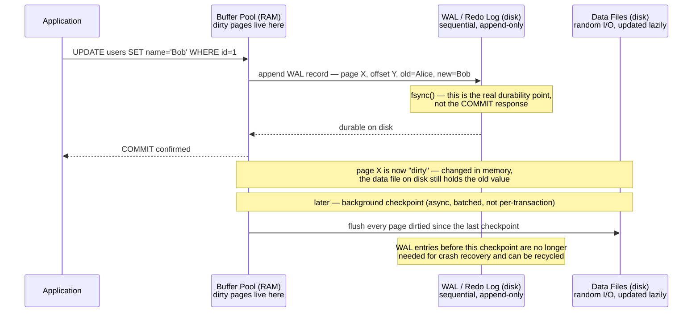
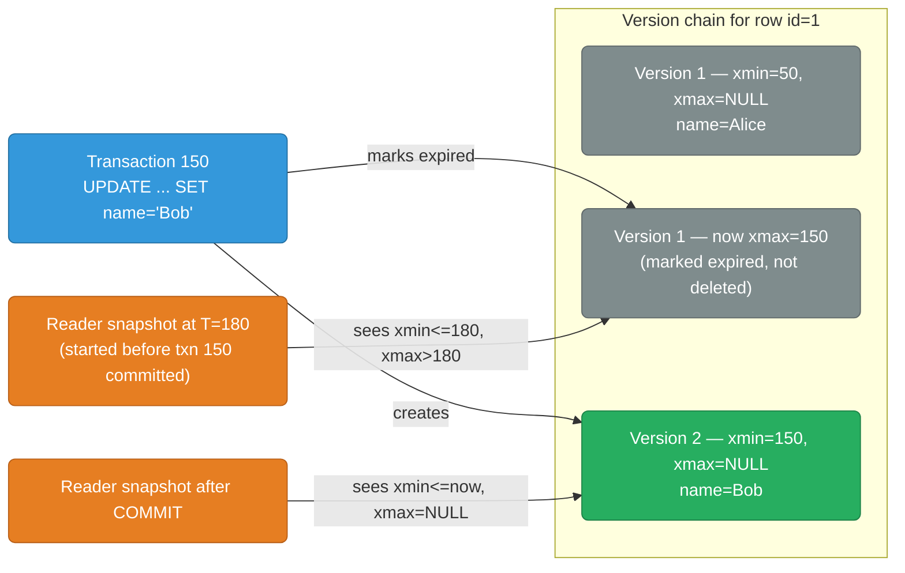

# Databases — Internals, Features, and Operations

Deep dives into each database: storage engine internals, WAL, replication, indexing, and operational patterns.

  0/0 checks
  

## Files

| File | Database | Key Topics |
|------|----------|-----------|
| [postgres-internals.md](./postgres-internals.md) | PostgreSQL | MVCC, WAL, VACUUM, B-tree/GiST indexes, EXPLAIN, connection pooling, replication internals |
| [mysql-internals.md](./mysql-internals.md) | MySQL / InnoDB | InnoDB storage engine, redo log, undo log, MVCC, B-tree, buffer pool, replication binlog |
| [mongodb-internals.md](./mongodb-internals.md) | MongoDB | WiredTiger storage engine, oplog, BSON, aggregation pipeline, index types, sharding |
| [redis-internals.md](./redis-internals.md) | Redis | Data structures internals, RDB/AOF persistence, eviction policies, Lua scripting, cluster |
| [etcd.md](./etcd.md) | etcd | Raft consensus, MVCC storage model, watch API, compaction/defrag, clustering, performance tuning |
| [lsm-trees.md](./lsm-trees.md) | LSM Trees | MemTable→SSTable write path, compaction strategies (size-tiered/leveled/FIFO), bloom filters, read/write/space amplification, RocksDB ecosystem |
| [kafka-internals.md](./kafka-internals.md) | Apache Kafka | Log segments, zero-copy sendfile, OS page cache, offset management, consumer groups, exactly-once, Redpanda comparison |
| [kafka-field-guide.md](./kafka-field-guide.md) | Apache Kafka | Narrative field guide: brokers/controller, topics/partitions, ISR & under-replicated vs. offline, producers, consumer group rebalances, offsets/lag, retention, Schema Registry, Connect, ACLs |
| [clickhouse-internals.md](./clickhouse-internals.md) | ClickHouse | MergeTree family, columnar storage, compression, materialized views, query execution |
| [spark-internals.md](./spark-internals.md) | Apache Spark | Driver/Executor/Shuffle Service architecture, DAG→Stages→Tasks execution model, RDD vs DataFrame vs Dataset, Structured Streaming, operational config, Spark vs BigQuery vs Dataflow |
| [elasticsearch-internals.md](./elasticsearch-internals.md) | Elasticsearch | Inverted index, segments, sharding, replication, mappings, Query DSL, aggregations, ILM, vector search, security |
| [replication.md](./replication.md) | All DBs | Sync/async/semi-sync, WAL shipping, logical vs physical, per-DB deep dives, Raft/Paxos, cross-region, lag measurement |
| [caching.md](./caching.md) | Redis / Memcached | Cache tiers, eviction policies, cache-aside/write-through/write-behind, stampede (XFetch), warming, invalidation |

## Common Concepts Across All Databases

### WAL — Write-Ahead Log

WAL is the most important concept in database durability. Before any data page is modified, the change is written to an append-only log (the WAL). On crash, the database replays the WAL to recover.

**Why WAL first?** Writing to the WAL is sequential (append-only) — fast. Writing to data files is random I/O — slow. WAL gives durability at sequential-write speed.

**Crash recovery** replays exactly the gap between the last checkpoint and the crash:

  

    

      <strong>1. Find the last checkpoint in the WAL.</strong> Everything before this point is already durably reflected in the data files — only entries after it can still be "unapplied."
    

    

      <strong>2. Replay every WAL record after that checkpoint.</strong> Each record re-applies one committed change to one specific page, in the original order.
    

    

      <strong>3. Database is consistent again.</strong> Once replay finishes, the data files reflect every transaction that was committed — i.e. had its WAL record fsynced — before the crash. Nothing more, nothing less.
    

  

  

    <button class="stepper-prev">← Prev</button>
    
    
    <button class="stepper-next">Next →</button>
  

  
A client receives COMMIT confirmed, and the database crashes one second later, before any checkpoint has run. Is that committed row lost?

  <button class="quiz-reveal">Reveal answer</button>
  
No. COMMIT is only confirmed to the client after the WAL record for that change has been fsynced to disk — the data file update itself is deliberately deferred and asynchronous. On restart, crash recovery finds the last checkpoint and replays every WAL record after it, which reapplies this committed change to the data file. The checkpoint is a durability floor, not the durability mechanism — the WAL is.

### MVCC — Multi-Version Concurrency Control

Most databases use MVCC to allow readers and writers to not block each other. Instead of locking a row for readers while a writer changes it, the database keeps multiple versions of the row around and hands each transaction the version that was current when its own snapshot started.

Old versions accumulate — a version can't be reclaimed until no active transaction's snapshot could still need it. Every MVCC database has to run that cleanup somehow, and each one does it differently:

  

    <button data-tab="pg" class="active">PostgreSQL</button>
    <button data-tab="mysql">MySQL InnoDB</button>
    <button data-tab="mongo">MongoDB</button>
  

  

    

      <strong>VACUUM.</strong> Old row versions live inline in the table's own heap. A background process (<code>autovacuum</code> by default) scans for dead tuples no transaction can still see and reclaims their space for reuse. Fall behind on vacuuming and both table and index bloat grow, along with the risk of transaction ID wraparound.
    

    

      <strong>Purge thread.</strong> InnoDB keeps old row versions out of the table entirely, in a separate undo log. A background purge thread deletes undo log entries once no active transaction's snapshot still needs them — a long-running transaction blocks purging and lets the undo log grow unbounded.
    

    

      <strong>Checkpoint + journal truncation.</strong> WiredTiger doesn't keep a separate MVCC version chain the way Postgres/InnoDB do — old versions are reclaimed as part of the normal checkpoint cycle, and journal entries older than the latest checkpoint are truncated once they're no longer needed for crash recovery.
    

  

  
A long-running reporting transaction starts at T=180 and is still open. A different transaction updates the same row and commits at T=200. What does the report transaction see if it re-reads that row at T=250, and why does this matter for cleanup?

  <button class="quiz-reveal">Reveal answer</button>
  
It still sees the old version (xmin&lt;=180, xmax&gt;180 at the time its snapshot was taken) — MVCC snapshots are fixed at transaction start, not re-evaluated per read. That's exactly why the old version can't be vacuumed/purged away yet: as long as the reporting transaction's snapshot could still legitimately need it, the garbage collector has to leave it in place. Long-running transactions are a common real-world cause of MVCC bloat for precisely this reason.

