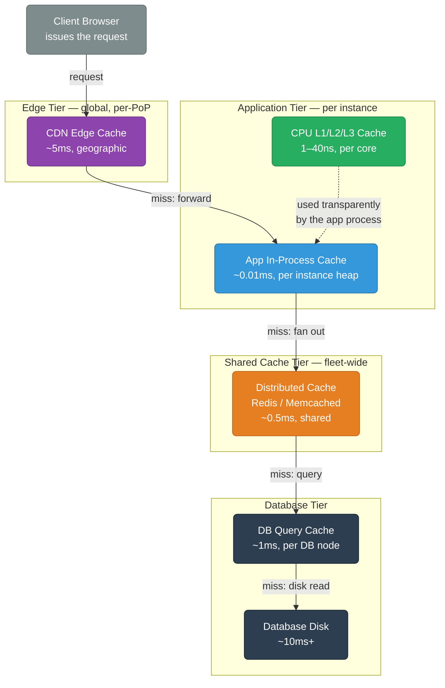
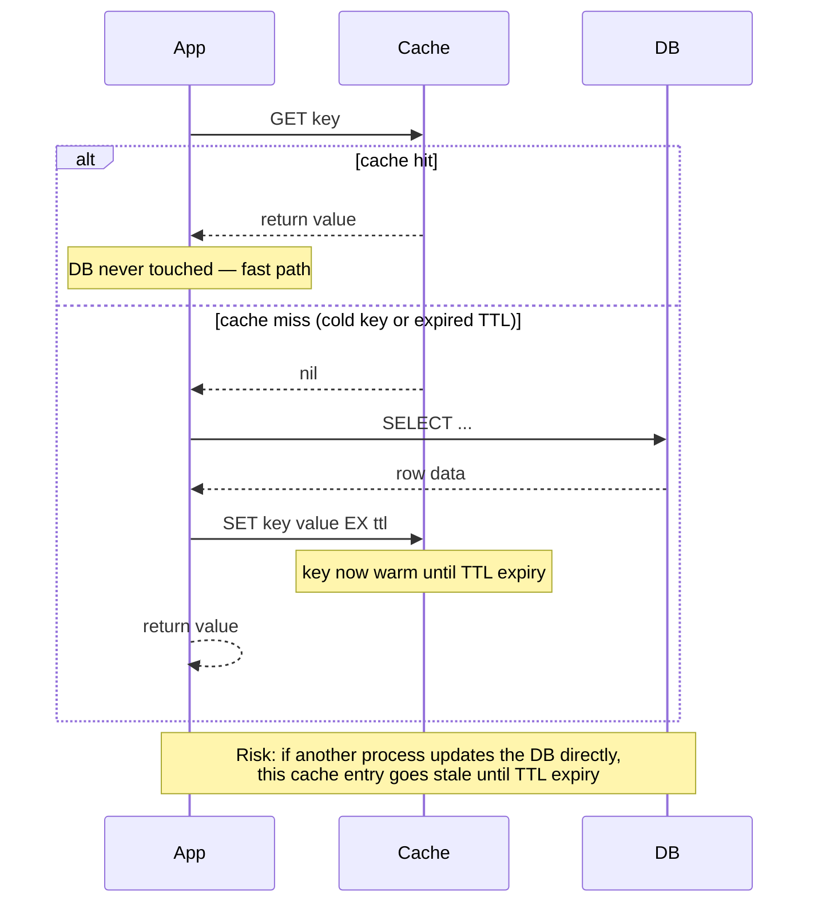
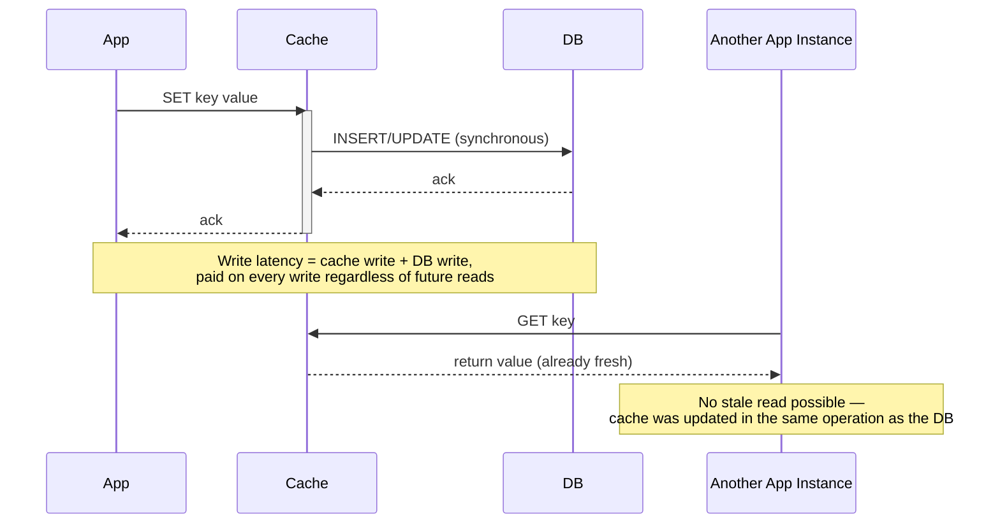
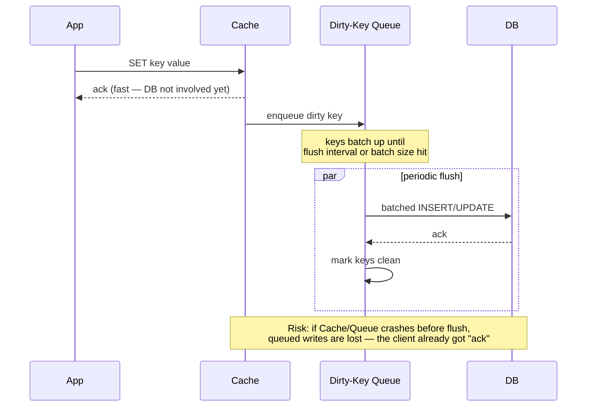
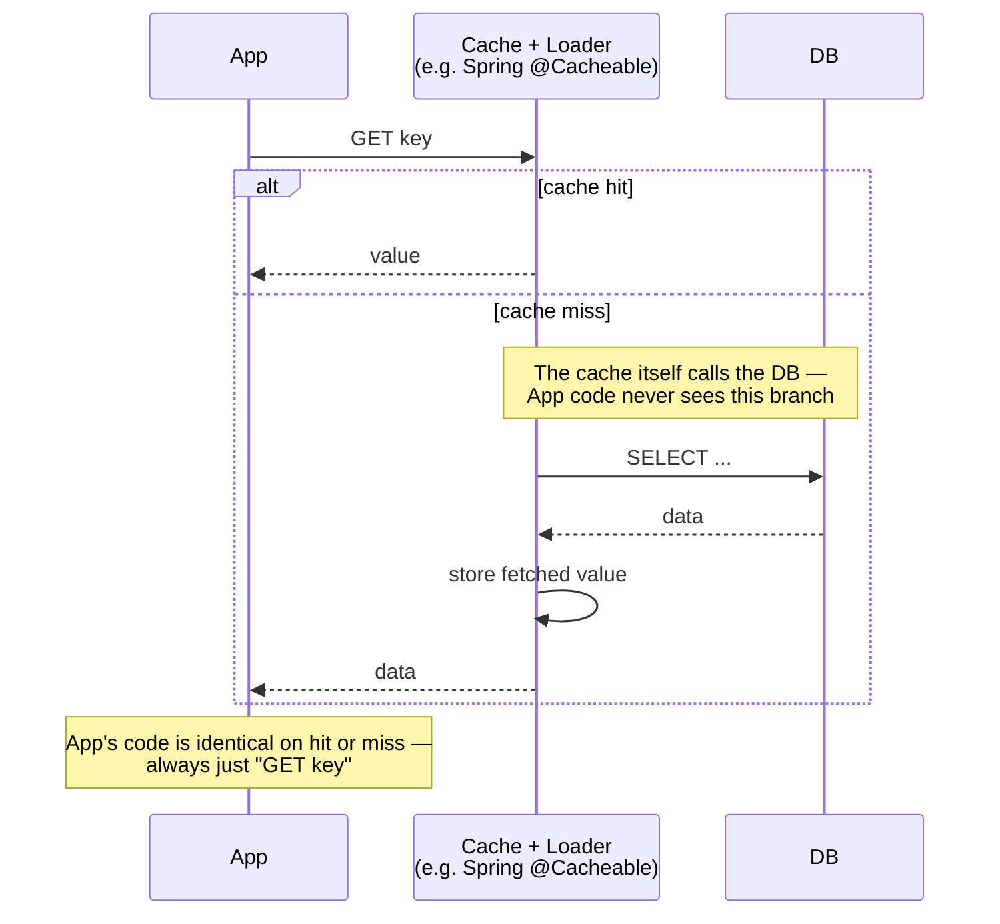
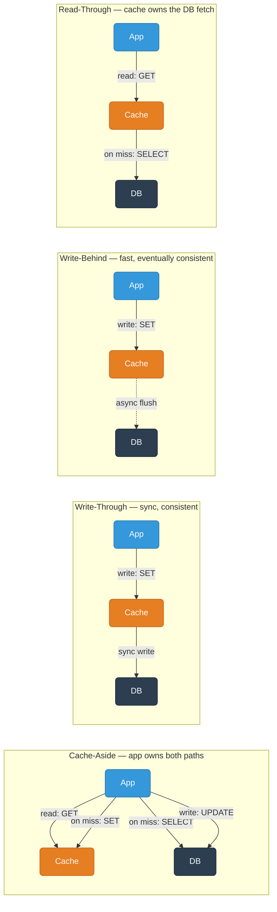

# Caching — Deep Dive Reference

From fundamentals to production patterns.

<div class="quiz-progress" data-quiz-progress>
  <span class="quiz-progress-label">0/0 checks</span>
  <span class="quiz-progress-bar"><span class="quiz-progress-fill"></span></span>
</div>

---

## 1. Why Cache

| Access Type | Latency | Notes |
|-------------|---------|-------|
| L1 CPU cache | ~1 ns | Per core |
| L2/L3 CPU cache | 4–40 ns | Shared across cores |
| RAM | ~100 ns | Main memory |
| Redis (local) | ~0.1–1 ms | In-process network |
| SSD disk | ~100 µs | NVMe |
| HDD disk | ~5–10 ms | Rotational |
| DB query (cold) | 5–50 ms | Index + disk I/O |
| Cross-region network | 50–200 ms | Geographic distance |

**Read amplification**: a single app query can fan out to dozens of DB reads. A cache short-circuits this.

**Cost reduction**: DB CPU is expensive; Redis/Memcached nodes are cheap per RPS served.

<div class="quiz-card">
  <p class="quiz-q">A DB query (cold) takes 5–50ms and Redis takes ~0.1–1ms. Why is the DB so much slower even though both are ultimately reading from fast storage?</p>
  <button class="quiz-reveal">Reveal answer</button>
  <div class="quiz-a" hidden>A "cold" DB query pays for index lookups plus disk I/O (or at best a DB-side page cache) on every request, and often does more work per query (joins, locking, planning). Redis is a purpose-built in-memory key-value lookup with none of that overhead — it's not that the DB's storage is slow, it's that a cache short-circuits the whole query-execution path down to a single memory lookup.</div>
</div>

---

## 2. Cache Tier Hierarchy

Each tier trades latency for sharing scope: the faster a cache is, the fewer things can see what's in it. CPU cache is invisible outside one core; an in-process cache is invisible outside one app instance; only the distributed tier is actually shared state across a fleet.



<div class="quiz-card">
  <p class="quiz-q">Why can't an app in-process cache just replace the shared Redis/Memcached tier entirely, given it's ~50x faster (0.01ms vs 0.5ms)?</p>
  <button class="quiz-reveal">Reveal answer</button>
  <div class="quiz-a" hidden>Scope, not speed, is the tradeoff: an in-process cache lives in one app instance's heap, so every other instance in the fleet has its own separate, inconsistent copy (or no copy at all). The distributed tier is slower per lookup but is the only tier that gives every instance the same shared view of the data — which is exactly what's needed for anything beyond single-instance hot data.</div>
</div>

---

## 3. Cache-Aside (Lazy Loading)

The application owns the cache interaction.



**Code pattern (Python/Redis):**
```python
def get_user(user_id):
    key = f"user:{user_id}"
    data = redis.get(key)
    if data:
        return json.loads(data)
    user = db.query("SELECT * FROM users WHERE id = %s", user_id)
    redis.setex(key, 300, json.dumps(user))
    return user
```

**Pros:** Only caches what's actually read. Cache failures don't break writes.

**Cons:** First read is always slow (cold miss). Stale data possible if DB changes outside the app.

**Thundering herd risk:** Many requests miss simultaneously on cold start or expiry — all hit DB at once. See §11.

<div class="quiz-card">
  <p class="quiz-q">A cache-aside app updates a row directly in the DB via a one-off admin script, bypassing the application code entirely. What happens to reads of that row?</p>
  <button class="quiz-reveal">Reveal answer</button>
  <div class="quiz-a" hidden>They keep returning the old, stale cached value until the TTL expires — cache-aside only refreshes the cache on the read path, inside the app's own get logic. Anything that changes the DB outside that code path (a direct DB write, another service, a manual script) has no way to invalidate the cached entry, which is exactly the staleness risk called out for this pattern.</div>
</div>

---

## 4. Write-Through

Every write goes to cache AND DB in the same operation.



**Pros:** Cache is always consistent with DB. No stale reads after writes.

**Cons:** Write latency = cache latency + DB latency. Cache fills with data that may never be read.

<div class="quiz-card">
  <p class="quiz-q">In the write-through diagram, "Another App Instance" issues a GET right after the first write and gets the fresh value with no DB round trip. What would break that guarantee if the Cache→DB step were made asynchronous instead of synchronous?</p>
  <button class="quiz-reveal">Reveal answer</button>
  <div class="quiz-a" hidden>The "no stale reads" guarantee only holds because the DB write completes <em>before</em> the client's write is acknowledged — so cache and DB are already in sync by the time any other instance can read. Making that DB write asynchronous is exactly what write-behind does instead, and it's precisely why write-behind carries a data-loss risk that write-through doesn't: the client gets "ack" before the DB has the value, so a crash in that gap loses the write outright rather than just serving a slightly stale read.</div>
</div>

---

## 5. Write-Behind (Write-Back)

Write to cache immediately; flush to DB asynchronously.



**Pros:** Extremely fast writes. Batch DB writes reduce I/O.

**Cons:** Data loss if cache crashes before flush. Complexity in failure handling.

<div class="quiz-card">
  <p class="quiz-q">The app already received "ack" for a write-behind SET. Ten seconds later, the cache process crashes before its next batch flush. Is that write safe?</p>
  <button class="quiz-reveal">Reveal answer</button>
  <div class="quiz-a" hidden>No — the ack only confirmed the write landed in the cache/queue, not the DB. Write-behind's whole speed advantage comes from acknowledging before the DB write happens, so any dirty key still sitting in the queue when the cache crashes is lost permanently, even though the client was already told the write succeeded. This is the core tradeoff versus write-through, which pays extra latency specifically to avoid this gap.</div>
</div>

---

## 6. Read-Through

Cache sits in front of DB and fetches transparently on miss.



**Difference from cache-aside:** App only talks to cache. Cache library/provider handles DB fetching. Example: Spring Cache with `@Cacheable`.

<div class="quiz-card">
  <p class="quiz-q">In the read-through diagram, the note says the app's code is "identical on hit or miss — always just GET key." In cache-aside's Python example, is that also true?</p>
  <button class="quiz-reveal">Reveal answer</button>
  <div class="quiz-a" hidden>No — cache-aside's <code>get_user</code> function explicitly branches on the miss (<code>if data: ... else: db.query(...); redis.setex(...)</code>). That branching logic is application code the developer wrote and owns. In read-through, that same branch exists, but it lives inside the cache library/provider (e.g. Spring's <code>@Cacheable</code> loader) — the app never sees it, which is the entire difference between the two patterns.</div>
</div>

---

## 7. All 4 Patterns — Side-by-Side

Solid arrows are synchronous (the caller waits); dashed arrows are asynchronous (the caller already moved on). That one visual distinction is most of what separates write-through's safety from write-behind's speed.



<div class="tab-group">
  <div class="tab-buttons">
    <button data-tab="ptn-aside" class="active">Cache-Aside</button>
    <button data-tab="ptn-through">Write-Through</button>
    <button data-tab="ptn-behind">Write-Behind</button>
    <button data-tab="ptn-readthrough">Read-Through</button>
  </div>
  <div class="tab-panels">
    <div class="tab-panel active" data-tab-panel="ptn-aside">
      <strong>Pros:</strong> Only caches what's actually read. Cache failures don't break writes.<br/>
      <strong>Cons:</strong> First read is always slow (cold miss). Stale data possible if DB changes outside the app.
    </div>
    <div class="tab-panel" data-tab-panel="ptn-through">
      <strong>Pros:</strong> Cache is always consistent with DB. No stale reads after writes.<br/>
      <strong>Cons:</strong> Write latency = cache latency + DB latency. Cache fills with data that may never be read.
    </div>
    <div class="tab-panel" data-tab-panel="ptn-behind">
      <strong>Pros:</strong> Extremely fast writes. Batch DB writes reduce I/O.<br/>
      <strong>Cons:</strong> Data loss if cache crashes before flush. Complexity in failure handling.
    </div>
    <div class="tab-panel" data-tab-panel="ptn-readthrough">
      <strong>Pros:</strong> App only talks to cache — simpler application code, no manual miss-handling.<br/>
      <strong>Cons:</strong> Locked into whatever the cache library/provider's loader supports (e.g. Spring Cache's <code>@Cacheable</code>) — less control than hand-rolled cache-aside.
    </div>
  </div>
</div>

<div class="quiz-card">
  <p class="quiz-q">You need the fastest possible writes and can tolerate losing the last few seconds of data on a crash. Which of the 4 patterns fits, and which is the wrong choice for the same requirement?</p>
  <button class="quiz-reveal">Reveal answer</button>
  <div class="quiz-a" hidden>Write-behind fits — it acks the client immediately and flushes to the DB asynchronously in batches, trading some crash-safety for speed. Write-through is the wrong choice here: it deliberately pays cache latency + DB latency on every write specifically to guarantee zero data loss, which is the opposite tradeoff from "fastest writes, some loss is fine."</div>
</div>

### Live Demo: Cache vs DB, Same Two Operations, Three Strategies

Pick a strategy below, then Read/Write a key and watch what actually happens to the cache and the DB — they diverge only on the write path. Reads behave identically everywhere: a hit returns from cache, a miss falls through to the DB and repopulates the cache.

<div class="toggle-switch" id="caching-strategy-toggle">
  <div class="toggle-buttons">
    <button data-toggle-opt="aside" class="active">Cache-Aside</button>
    <button data-toggle-opt="through">Write-Through</button>
    <button data-toggle-opt="back">Write-Behind</button>
  </div>
  <div class="toggle-panel active" data-toggle-panel="aside">
    Writes go straight to the DB; the cache entry is <strong>invalidated</strong>, not updated. The next read repopulates it from the DB.
  </div>
  <div class="toggle-panel" data-toggle-panel="through">
    Writes update cache and DB in the <strong>same synchronous operation</strong> — both are consistent immediately.
  </div>
  <div class="toggle-panel" data-toggle-panel="back">
    Writes land in <strong>cache only</strong>; the DB update is queued and applied later by a flush — fast, but not yet durable.
  </div>
</div>

<div class="structure-viz" id="caching-strategy-demo">
  <svg class="viz-canvas" viewBox="0 0 640 270"></svg>
  <div class="viz-controls">
    <input class="viz-input" id="csd-key" type="text" placeholder="key" />
    <input class="viz-input" id="csd-value" type="text" placeholder="value" />
    <button class="viz-btn" data-viz-action="read">Read</button>
    <button class="viz-btn" data-viz-action="write">Write</button>
    <button class="viz-btn" data-viz-action="flush">Flush Queue</button>
    <button class="viz-btn viz-btn-danger" data-viz-action="reset">Reset</button>
  </div>
  <div class="viz-status"></div>
</div>

<script>
(function () {
  const svgNS = 'http://www.w3.org/2000/svg';
  const toggleRoot = document.getElementById('caching-strategy-toggle');
  const root = document.getElementById('caching-strategy-demo');
  const svg = root.querySelector('.viz-canvas');
  const status = root.querySelector('.viz-status');
  const keyInput = root.querySelector('#csd-key');
  const valueInput = root.querySelector('#csd-value');
  const flushBtn = root.querySelector('[data-viz-action="flush"]');

  let cache = {};
  let db = {};
  let writeBehindQueue = []; // [{key, value}]

  function has(obj, key) {
    return Object.prototype.hasOwnProperty.call(obj, key);
  }

  function currentStrategy() {
    const active = toggleRoot.querySelector('.toggle-buttons button.active');
    return active ? active.dataset.toggleOpt : 'aside';
  }

  function el(tag, attrs) {
    const e = document.createElementNS(svgNS, tag);
    for (const k in attrs) e.setAttribute(k, attrs[k]);
    return e;
  }

  function doRead(key) {
    if (has(cache, key)) {
      return { narrate: `cache hit — returned '${key}' from cache` };
    }
    if (has(db, key)) {
      cache[key] = db[key];
      return { narrate: 'cache miss — read from DB, populated cache' };
    }
    return { narrate: `cache miss — '${key}' not found in DB either`, notFound: true };
  }

  function doWrite(key, value) {
    const strategy = currentStrategy();
    if (strategy === 'aside') {
      db[key] = value;
      delete cache[key];
      return { narrate: 'wrote to DB, invalidated cache entry (not updated) — next read will repopulate it' };
    }
    if (strategy === 'through') {
      cache[key] = value;
      db[key] = value;
      return { narrate: 'wrote to cache and DB synchronously — both consistent immediately' };
    }
    cache[key] = value;
    writeBehindQueue.push({ key: key, value: value });
    return {
      narrate:
        'wrote to cache only — DB update queued, not yet durable. If the cache node crashes right now, this write is lost.',
    };
  }

  function doFlush() {
    const n = writeBehindQueue.length;
    writeBehindQueue.forEach(function (q) { db[q.key] = q.value; });
    writeBehindQueue = [];
    return { narrate: `flushed ${n} queued writes to DB`, count: n };
  }

  function doReset() {
    cache = {};
    db = {};
    writeBehindQueue = [];
  }

  function drawBox(x, y, w, h, title, entries) {
    svg.appendChild(el('rect', { x: x, y: y, width: w, height: h, rx: 8, class: 'viz-edge' }));
    const label = el('text', { x: x + w / 2, y: y - 10, class: 'viz-label-dim' });
    label.textContent = title;
    svg.appendChild(label);

    const rowH = 28;
    const maxRows = Math.max(1, Math.floor((h - 14) / rowH));
    const shown = entries.slice(0, maxRows);
    shown.forEach(function (pair, i) {
      const ry = y + 10 + i * rowH;
      svg.appendChild(el('rect', {
        x: x + 12, y: ry, width: w - 24, height: rowH - 6, rx: 5, class: 'viz-node',
      }));
      const t = el('text', { x: x + w / 2, y: ry + (rowH - 6) / 2 });
      t.textContent = `${pair[0]}: ${pair[1]}`;
      svg.appendChild(t);
    });
    if (entries.length === 0) {
      const t = el('text', { x: x + w / 2, y: y + 30, class: 'viz-label-dim' });
      t.textContent = '(empty)';
      svg.appendChild(t);
    } else if (entries.length > maxRows) {
      const t = el('text', { x: x + w / 2, y: y + 10 + maxRows * rowH, class: 'viz-label-dim' });
      t.textContent = `+${entries.length - maxRows} more`;
      svg.appendChild(t);
    }
  }

  function draw() {
    svg.innerHTML = '';
    const strategy = currentStrategy();
    const cacheEntries = Object.keys(cache).map(function (k) { return [k, cache[k]]; });
    const dbEntries = Object.keys(db).map(function (k) { return [k, db[k]]; });

    if (strategy === 'back') {
      svg.setAttribute('viewBox', '0 0 640 400');
      drawBox(20, 40, 280, 210, 'CACHE', cacheEntries);
      drawBox(340, 40, 280, 210, 'DATABASE', dbEntries);
      const qEntries = writeBehindQueue.map(function (q) { return [q.key, q.value]; });
      drawBox(20, 300, 600, 90, 'WRITE-BEHIND QUEUE (pending, not yet durable)', qEntries);
    } else {
      svg.setAttribute('viewBox', '0 0 640 270');
      drawBox(20, 40, 280, 210, 'CACHE', cacheEntries);
      drawBox(340, 40, 280, 210, 'DATABASE', dbEntries);
    }

    flushBtn.disabled = strategy !== 'back';
  }

  root.querySelector('[data-viz-action="read"]').addEventListener('click', function () {
    const key = keyInput.value.trim();
    if (!key) {
      status.textContent = 'Enter a key first.';
      status.className = 'viz-status viz-status-error';
      return;
    }
    const result = doRead(key);
    status.textContent = `[${currentStrategy()}] ${result.narrate}`;
    status.className = 'viz-status ' + (result.notFound ? '' : 'viz-status-ok');
    draw();
  });

  root.querySelector('[data-viz-action="write"]').addEventListener('click', function () {
    const key = keyInput.value.trim();
    const value = valueInput.value.trim();
    if (!key || !value) {
      status.textContent = 'Enter both a key and a value first.';
      status.className = 'viz-status viz-status-error';
      return;
    }
    const result = doWrite(key, value);
    status.textContent = `[${currentStrategy()}] ${result.narrate}`;
    status.className = 'viz-status viz-status-ok';
    valueInput.value = '';
    draw();
  });

  flushBtn.addEventListener('click', function () {
    if (currentStrategy() !== 'back') {
      status.textContent = 'Flush only applies in write-back mode — the other two strategies never leave a queue.';
      status.className = 'viz-status viz-status-error';
      return;
    }
    const result = doFlush();
    status.textContent = result.narrate;
    status.className = 'viz-status viz-status-ok';
    draw();
  });

  root.querySelector('[data-viz-action="reset"]').addEventListener('click', function () {
    doReset();
    status.textContent = 'Reset — cache, DB, and queue all cleared.';
    status.className = 'viz-status';
    draw();
  });

  toggleRoot.querySelectorAll('.toggle-buttons button').forEach(function (btn) {
    btn.addEventListener('click', function () {
      setTimeout(draw, 0);
    });
  });

  draw();
})();
</script>

---

## 8. Eviction Policies

### Algorithms

| Policy | Description | Use Case |
|--------|-------------|----------|
| LRU | Evict least recently used | General purpose |
| LFU | Evict least frequently used | Skewed access patterns |
| FIFO | Evict oldest inserted key | Simple queues |
| TTL | Expire after time-to-live | Session data, tokens |
| Random | Evict random key | When access is uniform |
| LRU-K | LRU using K-th most recent access | Avoids one-time scan pollution |
| 2Q | Two queues: probationary + protected | Better than LRU for scan resistance |

### Redis `maxmemory-policy` options

```
# redis.conf
maxmemory 2gb
maxmemory-policy allkeys-lru
```

| Policy | Behavior |
|--------|----------|
| `noeviction` | Return error when memory full |
| `allkeys-lru` | Evict any key by LRU |
| `volatile-lru` | Evict keys with TTL set, by LRU |
| `allkeys-lfu` | Evict any key by LFU |
| `volatile-lfu` | Evict keys with TTL set, by LFU |
| `allkeys-random` | Evict any key randomly |
| `volatile-random` | Evict TTL keys randomly |
| `volatile-ttl` | Evict keys with shortest TTL first |

**Rule of thumb:** Use `allkeys-lru` for pure caches. Use `volatile-ttl` when mixing persistent and ephemeral keys.

<div class="quiz-card">
  <p class="quiz-q">A Redis instance stores both session cache keys (with TTLs) and a permanent feature-flag hash (no TTL) that must never be evicted. Which maxmemory-policy fits, and why would allkeys-lru be wrong here?</p>
  <button class="quiz-reveal">Reveal answer</button>
  <div class="quiz-a" hidden>volatile-ttl (or another volatile-* policy) fits, because it only ever evicts keys that have a TTL set — the permanent feature-flag hash has none, so it's never a candidate for eviction. allkeys-lru would be wrong: it evicts by recency across every key regardless of TTL, so a rarely-accessed but permanent feature-flag key could get evicted under memory pressure right alongside disposable session keys.</div>
</div>

---

## 9. Redis Data Structures for Caching

### String — simple key-value
```bash
SET user:1001 '{"name":"alice","role":"admin"}' EX 300
GET user:1001
INCR page:views:home   # atomic counter
```

### Hash — object fields without JSON serialization
```bash
HSET user:1001 name alice role admin age 30
HGET user:1001 name
HGETALL user:1001
# Update one field without fetching/re-serializing whole object
HSET user:1001 age 31
```

### Sorted Set — leaderboards, rate limiting
```bash
# Leaderboard
ZADD leaderboard 9500 player:alice
ZADD leaderboard 8200 player:bob
ZREVRANGE leaderboard 0 9 WITHSCORES   # top 10

# Sliding window rate limit (requests in last 60s)
ZADD rate:user:1001 1719651233 req:uuid1
ZREMRANGEBYSCORE rate:user:1001 -inf (now-60)
ZCARD rate:user:1001   # current count
```

### List — queues, recent activity
```bash
LPUSH recent:user:1001 "viewed:product:42"
LTRIM recent:user:1001 0 99   # keep last 100
LRANGE recent:user:1001 0 -1
```

### Bitmap — feature flags, daily active users
```bash
# User 1001 active today (bit at offset = user_id)
SETBIT dau:2026-06-29 1001 1
BITCOUNT dau:2026-06-29   # total DAU
GETBIT dau:2026-06-29 1001
```

### HyperLogLog — unique count (approximate, 0.81% error)
```bash
PFADD unique:visitors:home user:1001 user:1002 user:1001
PFCOUNT unique:visitors:home   # returns 2, not 3
```
Uses ~12KB regardless of cardinality — far cheaper than a Set for billions of IDs.

<div class="quiz-card">
  <p class="quiz-q">PFADD unique:visitors:home user:1001 user:1002 user:1001 followed by PFCOUNT returns exactly 2, not 3. Is that count guaranteed to be exact in general, and why does HyperLogLog trade that away?</p>
  <button class="quiz-reveal">Reveal answer</button>
  <div class="quiz-a" hidden>Here it happens to be exact because the cardinality is tiny, but HyperLogLog is fundamentally an approximate structure — at real-world scale it carries about 0.81% error either direction. The trade is deliberate: a Set would be exact but grows linearly with the number of unique items (unusable for billions of IDs), while HyperLogLog stays at a fixed ~12KB regardless of cardinality by giving up exactness for that constant memory footprint.</div>
</div>

---

## 10. Redis vs Memcached

| Feature | Redis | Memcached |
|---------|-------|-----------|
| Data structures | String, Hash, List, Set, ZSet, Stream, Geo, HLL | String only |
| Persistence | RDB snapshots + AOF | None |
| Replication | Primary-replica, async | No built-in |
| Cluster | Redis Cluster (hash slots) | Client-side sharding only |
| Pub/Sub | Yes | No |
| Lua scripting | Yes (`EVAL`) | No |
| Transactions | MULTI/EXEC + WATCH | No |
| Memory efficiency | Higher overhead per key (object metadata) | Lower overhead, better for simple KV at scale |
| Multi-threading | Single-threaded command loop (I/O multi-threaded since 6.0) | Multi-threaded |
| Max value size | 512 MB | 1 MB |

**Choose Memcached when:** pure string caching, extreme memory efficiency matters, multi-threaded performance on many cores.

**Choose Redis when:** you need persistence, replication, complex data structures, pub/sub, or Lua atomicity.

<div class="quiz-card">
  <p class="quiz-q">A team needs a sliding-window rate limiter and a leaderboard, both backed by the same cache layer. Why does that requirement alone rule out Memcached?</p>
  <button class="quiz-reveal">Reveal answer</button>
  <div class="quiz-a" hidden>Both of those need a Sorted Set (ZADD/ZRANGE/ZREMRANGEBYSCORE) — Memcached only supports plain strings, with no native structured data types at all. Redis's richer data structures (Hash, List, Set, ZSet, Stream, Geo, HLL) are exactly the differentiator here; building a sliding-window rate limiter on Memcached would mean reimplementing sorted-set semantics yourself on top of raw strings.</div>
</div>

---

## 11. Cache Stampede / Thundering Herd

**Problem:** A hot key expires. Thousands of requests all miss simultaneously, all hit DB at once, DB collapses.

The danger isn't the miss itself — cache-aside is designed to tolerate misses. It's that a *hot* key means hundreds or thousands of in-flight requests were relying on that one cached value at the same moment, so the instant it disappears, all of them fall through to the DB together, as if the cache had never been there at all.

```mermaid
sequenceDiagram
    participant R1 as Request 1
    participant R2 as Request 2
    participant RN as Request N (thousands more)
    participant Cache
    participant DB

    Note over Cache: hot_key's TTL just expired — cache now empty for this key
    par near-simultaneous misses
        R1->>Cache: GET hot_key
        Cache-->>R1: nil (miss)
    and
        R2->>Cache: GET hot_key
        Cache-->>R2: nil (miss)
    and
        RN->>Cache: GET hot_key
        Cache-->>RN: nil (miss)
    end
    Note over R1,RN: all of them saw the same empty key within milliseconds —<br/>none knows another is about to run the identical query
    rect rgb(90, 30, 30)
    par stampede — every miss independently falls through to the DB
        R1->>DB: SELECT (recompute hot_key)
        R2->>DB: SELECT (recompute hot_key)
        RN->>DB: SELECT (recompute hot_key)
    end
    end
    Note over DB: DB was sized for a trickle of cache misses,<br/>not the full read volume at once — CPU/connections saturate
```



<div class="stepper">
  <div class="stepper-panels">
    <div class="stepper-panel active">
      <strong>1. Steady state.</strong> <code>hot_key</code> is cached and its TTL is ticking down. Thousands of requests/sec hit Redis and the DB sees none of that traffic.
    </div>
    <div class="stepper-panel">
      <strong>2. TTL expires.</strong> The single cached value for <code>hot_key</code> is gone — but request volume hasn't dropped even slightly; it's the same hot key it was a second ago.
    </div>
    <div class="stepper-panel">
      <strong>3. Every in-flight request misses at once.</strong> Because they were all reading the same key, they all discover the miss within the same few milliseconds — not staggered, not one-at-a-time.
    </div>
    <div class="stepper-panel">
      <strong>4. Each miss independently falls through to the DB.</strong> Cache-aside's own miss-handling logic runs on every one of those requests — no request has any way of knowing thousands of others are about to issue the identical query.
    </div>
    <div class="stepper-panel">
      <strong>5. The DB collapses.</strong> It was provisioned for a steady trickle of cache misses, not the full read volume landing in one burst. Connections and CPU saturate, latency spikes for unrelated queries too, and the outage can cascade well beyond the one hot key.
    </div>
  </div>
  <div class="stepper-controls">
    <button class="stepper-prev">← Prev</button>
    <span class="stepper-dots"></span>
    <span class="stepper-label"></span>
    <button class="stepper-next">Next →</button>
  </div>
</div>

### Solution 1: Mutex / Distributed Lock
```python
def get_with_lock(key):
    val = redis.get(key)
    if val:
        return val
    lock_key = f"lock:{key}"
    if redis.set(lock_key, "1", nx=True, ex=5):  # acquire lock
        try:
            val = db.fetch(key)
            redis.setex(key, 300, val)
            return val
        finally:
            redis.delete(lock_key)
    else:
        time.sleep(0.05)        # wait and retry
        return get_with_lock(key)
```

### Solution 2: XFetch (Probabilistic Early Expiration)
Recompute before expiry based on probability that increases as TTL decreases.

```python
import math, random, time

def xfetch(key, ttl, beta=1.0):
    value, delta, expiry = cache_get_with_metadata(key)
    if time.time() - beta * delta * math.log(random.random()) >= expiry:
        # probabilistically recompute early
        value = db.fetch(key)
        cache_set_with_metadata(key, value, ttl)
    return value
```

### Solution 3: Stale-While-Revalidate
Return stale value immediately; refresh in background.
```python
def get_stale_ok(key, ttl, stale_ttl=60):
    val = redis.get(key)
    if val:
        return val
    # Check extended stale window
    stale = redis.get(f"stale:{key}")
    if stale:
        threading.Thread(target=refresh, args=(key, ttl)).start()
        return stale
    return refresh_sync(key, ttl)
```

### Solution 4: Background Refresh
Cron/worker refreshes hot keys before they expire. Works well for known-hot keys.

<div class="quiz-card">
  <p class="quiz-q">The mutex solution and XFetch both prevent a DB pile-up, but in different ways. What specifically does XFetch avoid that the mutex approach doesn't?</p>
  <button class="quiz-reveal">Reveal answer</button>
  <div class="quiz-a" hidden>The mutex still lets the full herd occur — every request still misses and reaches the lock check — it just serializes who's allowed to actually query the DB while everyone else sleeps and retries. XFetch avoids the herd happening at all: because it recomputes probabilistically <em>before</em> the key ever fully expires, one request gets picked ahead of time to refresh it, so the key rarely reaches a state where thousands of requests hit a true miss simultaneously in the first place.</div>
</div>

---

## 12. Cache Warming

**Why it matters:** A cold cache after deploy → all traffic hits DB → DB overload → cascading failure.

### Strategies

**Pre-warming on deploy (best for known hot keys):**
```bash
# During deploy pipeline, before shifting traffic
python warm_cache.py --keys top_products,homepage,config
```

**Lazy warming:** Cache-aside naturally warms on first reads. Acceptable if DB can handle initial cold traffic.

**Scheduled warming job:**
```python
# K8s CronJob, runs every 5 min for known-hot queries
def warm():
    top_products = db.query("SELECT * FROM products ORDER BY views DESC LIMIT 100")
    for p in top_products:
        redis.setex(f"product:{p.id}", 600, json.dumps(p))
```

**Shadow traffic replay:** Replay recent production logs against new cache before cutover.

**Rule:** Never deploy a stateful cache service without a warm-up phase. Use feature flags or canary to shift traffic gradually.

<div class="quiz-card">
  <p class="quiz-q">Lazy warming is called "acceptable if DB can handle initial cold traffic." A team relies on lazy warming alone and then deploys during peak hours with a cache flush. What's the risk, in the section's own terms?</p>
  <button class="quiz-reveal">Reveal answer</button>
  <div class="quiz-a" hidden>Exactly the failure mode this section opens with: "a cold cache after deploy → all traffic hits DB → DB overload → cascading failure." Lazy warming's "acceptable" caveat assumes the DB can absorb that initial cold-traffic spike — which is precisely what's least true at peak hours, when request volume (and therefore the cold-miss volume) is at its highest. That's why the rule is to always pair a deploy with an explicit warm-up phase rather than trust cache-aside's natural warming alone.</div>
</div>

---

## 13. Cache Invalidation Patterns

> "There are only two hard things in computer science: cache invalidation and naming things." — Phil Karlton

### TTL-Based
Simplest. Set `EX` on every key. Accept eventual staleness.
```bash
SET product:42 '...' EX 300
```

### Event-Driven Invalidation
DB triggers or application events delete cache entries on writes.
```python
def update_product(product_id, data):
    db.execute("UPDATE products SET ... WHERE id = %s", product_id)
    redis.delete(f"product:{product_id}")          # invalidate
    redis.delete(f"product:list:category:{data.category_id}")  # invalidate list
```

### Tag-Based Invalidation
Group related keys under a tag; invalidate all by tag.
```python
# On write: record tag → keys mapping
redis.sadd("tag:category:5", "product:42", "product:43")
# On category update:
keys = redis.smembers("tag:category:5")
redis.delete(*keys)
redis.delete("tag:category:5")
```

### Version Keys (Cache Busting)
Append a version to the key. Old keys expire naturally via TTL.
```python
version = redis.get("product:42:version") or 1
key = f"product:42:v{version}"
data = redis.get(key)
# To invalidate:
redis.incr("product:42:version")
```

<div class="quiz-card">
  <p class="quiz-q">Incrementing product:42:version doesn't delete product:42:v1. What actually removes the old versioned key, and what goes wrong if it was set without a TTL?</p>
  <button class="quiz-reveal">Reveal answer</button>
  <div class="quiz-a" hidden>Nothing in this pattern actively deletes it — the design relies on the old key expiring naturally via TTL ("old keys expire naturally via TTL"). If <code>product:42:v1</code> was written with no TTL, it just sits in Redis forever as orphaned data: every version bump leaves another abandoned key behind, and nothing will ever reclaim that memory on its own.</div>
</div>

---

## 14. Distributed Cache Consistency

### The Write Race Problem

Two app instances update the same key simultaneously — last write wins but may overwrite a newer value.

```mermaid
sequenceDiagram
    participant A as App Instance A
    participant B as App Instance B
    participant Cache

    rect rgb(90, 30, 30)
    Note over A,B: Unsafe — plain GET + SET, no coordination
    A->>Cache: GET user:1 → v1
    B->>Cache: GET user:1 → v1
    A->>Cache: SET user:1 v2
    B->>Cache: SET user:1 v3 (B never saw v2, overwrites blindly)
    Note over Cache: v2 is gone — B's write didn't know v2 existed
    end

    rect rgb(30, 70, 40)
    Note over A,B: Safe — WATCH / MULTI / EXEC (optimistic locking)
    A->>Cache: WATCH user:1, GET user:1 → v1
    B->>Cache: WATCH user:1, GET user:1 → v1
    A->>Cache: MULTI, SET user:1 v2, EXEC
    Cache-->>A: EXEC succeeds — user:1 unchanged since A's WATCH
    B->>Cache: MULTI, SET user:1 v3, EXEC
    Cache-->>B: EXEC returns nil — user:1 changed since B's WATCH
    B->>Cache: retry: GET user:1 → v2, recompute, MULTI/EXEC
    Note over Cache: no write silently lost — B is forced to retry on fresh data
    end
```



Optimistic locking doesn't prevent the race from happening — B still reads the stale `v1` first. What it prevents is B's write from *landing* unnoticed: `EXEC` fails atomically the moment the watched key changed underneath it, forcing B back through the read-transform-write loop until it succeeds against current data.

<div class="quiz-card">
  <p class="quiz-q">In the "unsafe" half of the diagram, why is it v2 that gets lost, specifically, and not v3?</p>
  <button class="quiz-reveal">Reveal answer</button>
  <div class="quiz-a" hidden>B's GET happened before A's SET, so B's in-memory view is still v1 — B has no idea v2 ever existed. B's SET isn't conditioned on what it read; it just overwrites whatever is currently in the cache with v3. A's write (v2) is the one sandwiched in the middle chronologically, so it's the one that gets clobbered — whichever write lands last always wins, regardless of which one was "newer" from the app's perspective.</div>
</div>

### Redis WATCH / MULTI / EXEC (Optimistic Locking)
```bash
WATCH user:1
val = GET user:1
MULTI
  SET user:1 <new_value>
EXEC   # returns nil if user:1 changed since WATCH → retry
```

```python
def safe_update(key, transform):
    with redis.pipeline() as pipe:
        while True:
            try:
                pipe.watch(key)
                current = pipe.get(key)
                new_val = transform(current)
                pipe.multi()
                pipe.set(key, new_val)
                pipe.execute()
                break
            except redis.WatchError:
                continue  # retry on conflict
```

### Compare-and-Swap with Lua (atomic)
```lua
-- SET only if value matches expected
local current = redis.call('GET', KEYS[1])
if current == ARGV[1] then
  redis.call('SET', KEYS[1], ARGV[2])
  return 1
end
return 0
```
```bash
EVAL "<script>" 1 user:1 expected_val new_val
```

<div class="quiz-card">
  <p class="quiz-q">The Lua compare-and-swap script only calls SET if current == expected. Why is this immune to the same race that broke the plain GET+SET example, when it's still doing a read followed by a write?</p>
  <button class="quiz-reveal">Reveal answer</button>
  <div class="quiz-a" hidden>Because the entire read-compare-write sequence runs as one atomic operation inside Redis via EVAL — no other client's command can interleave between the GET and the SET the way A's and B's commands interleaved in the unsafe example. WATCH/MULTI/EXEC gets the same safety by detecting and rejecting a conflicting change after the fact (optimistic, retry-based); the Lua script instead makes the check-and-set indivisible from the start, so there's never a window for another writer to sneak in.</div>
</div>

---

## 15. CDN vs Application Cache vs DB Cache

| Dimension | CDN Edge Cache | App In-Process Cache | Distributed Cache Redis | DB Query Cache |
|-----------|---------------|---------------------|------------------------|----------------|
| What it caches | Static assets, rendered HTML, API responses | Hot objects in heap | Shared computed data, sessions | Query result sets |
| Scope | Global, per-PoP | Per app instance | Shared across all instances | Per DB node |
| Latency | ~5–50ms (geographic) | ~0.01ms (local RAM) | ~0.5–2ms (network) | ~1ms (shared memory) |
| Invalidation | Purge API, TTL, surrogate keys | In-memory eviction, restart | DEL/EXPIRE, event-driven | AUTO on write (MySQL 8 removed it) |
| Use when | Public static/cacheable content | Single-instance hot data | Multi-instance shared state | Read-heavy reporting queries |
| Cost | CDN egress pricing | Free (heap memory) | Redis node cost | Included with DB |
| Risk | Stale public content | No sharing across pods | Network latency + connection pool | MySQL removed query cache in 8.0 |

<div class="quiz-card">
  <p class="quiz-q">The table lists "DB Query Cache" with invalidation "AUTO on write" but its risk is "MySQL removed query cache in 8.0." What does that imply for a system designed around this tier today?</p>
  <button class="quiz-reveal">Reveal answer</button>
  <div class="quiz-a" hidden>It means this tier can't be relied on as a given for a modern MySQL deployment — the automatic, DB-managed query cache described in this row doesn't exist at all on MySQL 8.0+. Any read-heavy reporting workload that was leaning on that tier needs to shift that caching responsibility up a layer, into the distributed (Redis) or application tier instead, since the DB is no longer doing it automatically underneath them.</div>
</div>

---

## 16. Sizing & Monitoring

### Working Set Estimation
```
working_set = hot_keys × avg_value_size × replication_factor
# Example: 1M hot keys × 2KB avg × 2 replicas = 4 GB
```

### Hit Rate Math
```
hit_rate = keyspace_hits / (keyspace_hits + keyspace_misses)
effective_latency = hit_rate × cache_latency + (1 - hit_rate) × db_latency

# Example: 90% hit, 1ms cache, 20ms DB:
# = 0.9 × 1 + 0.1 × 20 = 0.9 + 2 = 2.9ms avg
# vs no cache: 20ms avg
```

### Redis Monitoring
```bash
redis-cli INFO stats | grep -E "keyspace_hits|keyspace_misses|evicted_keys|expired_keys"
redis-cli INFO memory | grep used_memory_human
redis-cli INFO keyspace
```

Key metrics:
- `keyspace_hits` / `keyspace_misses` → compute hit rate; target > 90%
- `evicted_keys` > 0 → memory pressure, increase `maxmemory` or evict more aggressively
- `used_memory_rss` >> `used_memory` → memory fragmentation (see §17)
- `connected_clients` near `maxclients` (default 10000) → connection pool exhaustion

### Prometheus / Grafana
Use `redis_exporter`. Key PromQL:
```promql
# Hit rate
rate(redis_keyspace_hits_total[5m]) /
  (rate(redis_keyspace_hits_total[5m]) + rate(redis_keyspace_misses_total[5m]))

# Eviction rate
rate(redis_evicted_keys_total[5m])

# Memory fragmentation ratio (>1.5 = fragmented)
redis_memory_used_rss_bytes / redis_memory_used_bytes
```

<div class="quiz-card">
  <p class="quiz-q">With 90% hit rate, 1ms cache latency, and 20ms DB latency, the worked example gives 2.9ms average effective latency. Why isn't it closer to the midpoint of 1ms and 20ms (~10.5ms)?</p>
  <button class="quiz-reveal">Reveal answer</button>
  <div class="quiz-a" hidden>Because effective_latency is a weighted average by hit rate, not a plain average of the two numbers: 0.9 × 1ms + 0.1 × 20ms = 2.9ms. Only the 10% of requests that actually miss pay the 20ms DB cost — the 90% that hit dominate the result, which is exactly why even a "slow" 20ms DB barely moves the average once the hit rate is high.</div>
</div>

---

## 17. Common Issues

### Cache Poisoning
Attacker inserts malicious data into cache (e.g., via HTTP response splitting, unvalidated key construction).

**Fix:** Validate and sanitize all keys. Never build cache keys from raw user input without normalization. Use signed tokens for sensitive cache values.

### Stale Reads After Write
Write updates DB but forgets to invalidate cache. Reads return old data.

**Fix:** Always pair DB writes with cache invalidation in the same transaction scope (or use write-through). Use short TTLs as a safety net.

### Memory Fragmentation
Redis allocates memory in chunks; after many DEL/EXPIRE cycles, RSS grows above `used_memory`.
```bash
# Check fragmentation ratio (>1.5 is concerning)
redis-cli INFO memory | grep mem_fragmentation_ratio

# Enable active defragmentation (Redis 4+)
# redis.conf
activedefrag yes
active-defrag-ignore-bytes 100mb
active-defrag-threshold-lower 10   # start at 10% fragmentation
active-defrag-threshold-upper 100
```

### Hot Keys
A single key receives millions of requests/sec, saturating a single Redis shard.

**Detection:**
```bash
redis-cli --hotkeys   # requires maxmemory-policy != noeviction
redis-cli monitor | head -100   # live command stream
```

**Fix:** Local L1 shadow cache in each app instance for the hot key (small TTL, 1–5s):
```python
local_cache = {}  # in-process dict

def get_hot(key):
    if key in local_cache and time.time() < local_cache[key]['exp']:
        return local_cache[key]['val']
    val = redis.get(key)
    local_cache[key] = {'val': val, 'exp': time.time() + 1}  # 1s local TTL
    return val
```

Alternative: replicate hot keys across multiple Redis nodes with a prefix shard (`hot:0:key`, `hot:1:key`, ...) and randomly select a shard on read.

### Connection Pool Exhaustion
Each app thread holding a Redis connection; pool depleted under load.

**Fix:**
```python
# redis-py with connection pool
pool = redis.ConnectionPool(host='redis', port=6379, max_connections=50)
r = redis.Redis(connection_pool=pool)
```
- Set `max_connections` to (app_threads × 0.5) as a starting point
- Monitor `connected_clients` in Redis
- Use pipelining to batch commands and reduce round-trips

<div class="quiz-card">
  <p class="quiz-q">The hot-key fix uses a local shadow cache with a 1–5 second TTL. What would go wrong if that local TTL were stretched to 60 seconds instead?</p>
  <button class="quiz-reveal">Reveal answer</button>
  <div class="quiz-a" hidden>Each app instance could keep serving its own stale local copy of the hot key for up to that whole 60-second window before checking Redis again — far past any update to the real value. The 1–5s window is deliberately short so the shadow cache absorbs almost all of the read traffic away from the single Redis shard while still bounding how out-of-date any one instance's copy can get.</div>
</div>

---

## Quick Reference

```
Cache-aside    → app manages read/write, lazy population
Write-through  → sync write to cache + DB, no stale reads
Write-behind   → fast writes, async DB flush, data loss risk
Read-through   → cache handles DB fetch transparently

LRU            → general purpose
LFU            → skewed/Zipf access patterns
volatile-ttl   → mixed persistent + ephemeral keys

Stampede fix   → mutex lock OR XFetch probabilistic OR stale-while-revalidate
Invalidation   → TTL (simple) → event-driven (consistent) → tag-based (grouped)
Hot key fix    → L1 local shadow cache with short TTL
Fragmentation  → activedefrag yes in redis.conf
```
