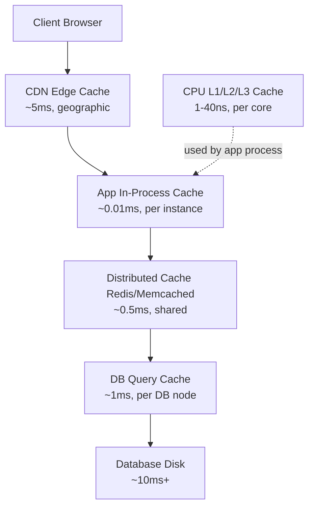
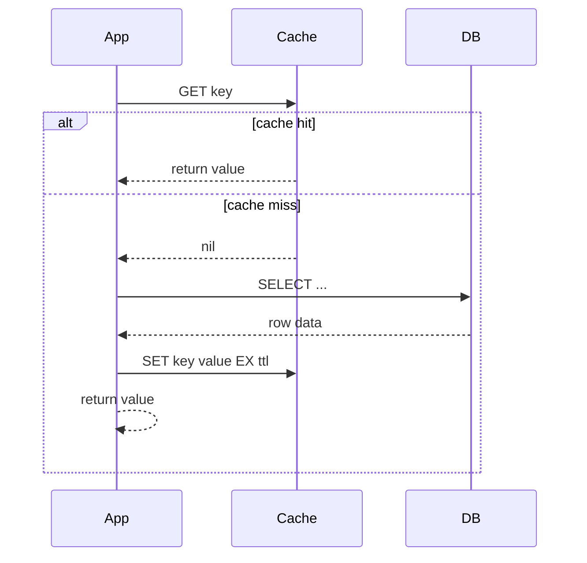
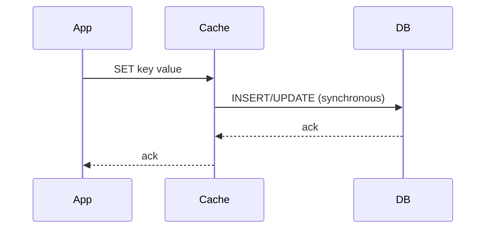
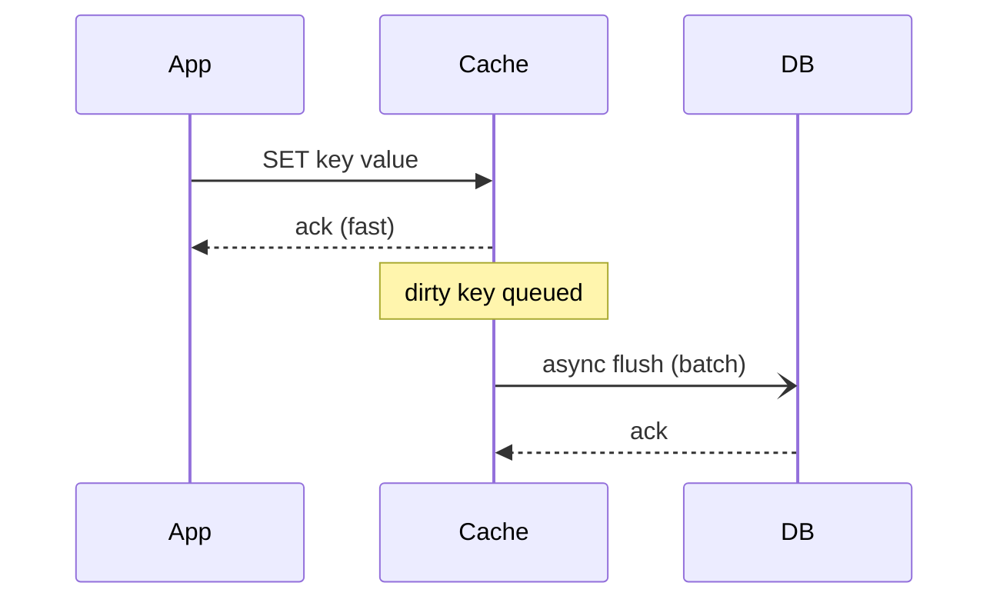
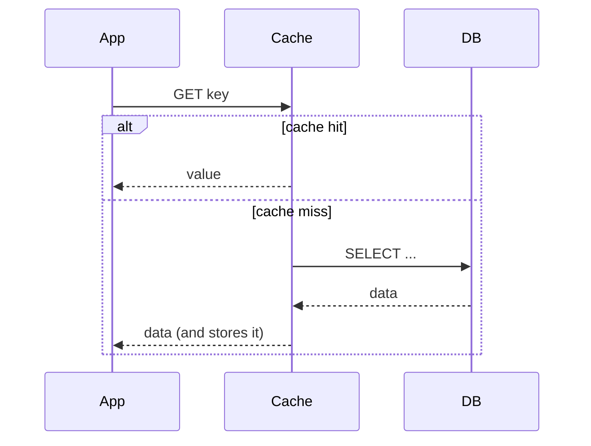
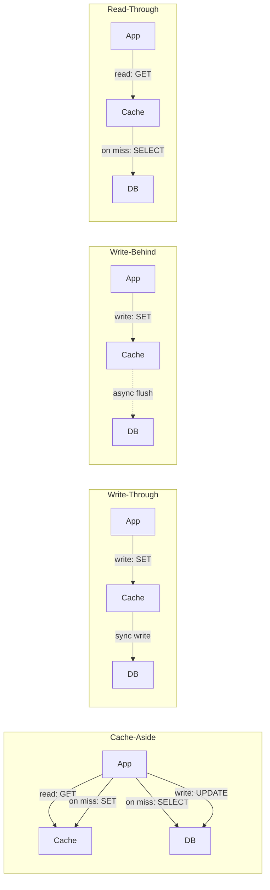
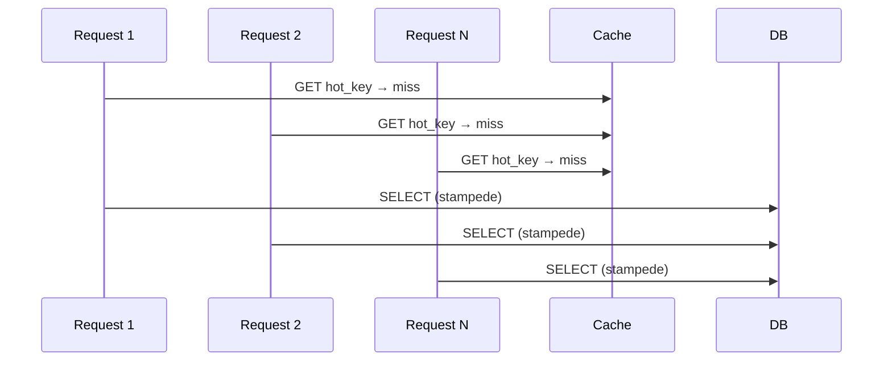
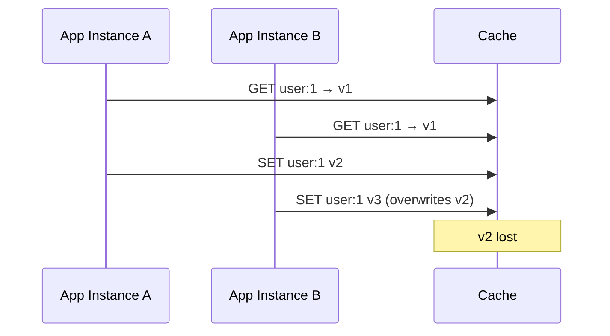

# Caching — Deep Dive Reference

From fundamentals to production patterns.

---

## 1. Why Cache

| Access Type | Latency | Notes |
|-------------|---------|-------|
| L1 CPU cache | ~1 ns | Per core |
| L2/L3 CPU cache | 4–40 ns | Shared across cores |
| RAM | ~100 ns | Main memory |
| Redis (local) | ~0.1–1 ms | In-process network |
| SSD disk | ~100 µs | NVMe |
| HDD disk | ~5–10 ms | Rotational |
| DB query (cold) | 5–50 ms | Index + disk I/O |
| Cross-region network | 50–200 ms | Geographic distance |

**Read amplification**: a single app query can fan out to dozens of DB reads. A cache short-circuits this.

**Cost reduction**: DB CPU is expensive; Redis/Memcached nodes are cheap per RPS served.

---

## 2. Cache Tier Hierarchy



---

## 3. Cache-Aside (Lazy Loading)

The application owns the cache interaction.



**Code pattern (Python/Redis):**
```python
def get_user(user_id):
    key = f"user:{user_id}"
    data = redis.get(key)
    if data:
        return json.loads(data)
    user = db.query("SELECT * FROM users WHERE id = %s", user_id)
    redis.setex(key, 300, json.dumps(user))
    return user
```

**Pros:** Only caches what's actually read. Cache failures don't break writes.

**Cons:** First read is always slow (cold miss). Stale data possible if DB changes outside the app.

**Thundering herd risk:** Many requests miss simultaneously on cold start or expiry — all hit DB at once. See §11.

---

## 4. Write-Through

Every write goes to cache AND DB in the same operation.



**Pros:** Cache is always consistent with DB. No stale reads after writes.

**Cons:** Write latency = cache latency + DB latency. Cache fills with data that may never be read.

---

## 5. Write-Behind (Write-Back)

Write to cache immediately; flush to DB asynchronously.



**Pros:** Extremely fast writes. Batch DB writes reduce I/O.

**Cons:** Data loss if cache crashes before flush. Complexity in failure handling.

---

## 6. Read-Through

Cache sits in front of DB and fetches transparently on miss.



**Difference from cache-aside:** App only talks to cache. Cache library/provider handles DB fetching. Example: Spring Cache with `@Cacheable`.

---

## 7. All 4 Patterns — Side-by-Side



---

## 8. Eviction Policies

### Algorithms

| Policy | Description | Use Case |
|--------|-------------|----------|
| LRU | Evict least recently used | General purpose |
| LFU | Evict least frequently used | Skewed access patterns |
| FIFO | Evict oldest inserted key | Simple queues |
| TTL | Expire after time-to-live | Session data, tokens |
| Random | Evict random key | When access is uniform |
| LRU-K | LRU using K-th most recent access | Avoids one-time scan pollution |
| 2Q | Two queues: probationary + protected | Better than LRU for scan resistance |

### Redis `maxmemory-policy` options

```
# redis.conf
maxmemory 2gb
maxmemory-policy allkeys-lru
```

| Policy | Behavior |
|--------|----------|
| `noeviction` | Return error when memory full |
| `allkeys-lru` | Evict any key by LRU |
| `volatile-lru` | Evict keys with TTL set, by LRU |
| `allkeys-lfu` | Evict any key by LFU |
| `volatile-lfu` | Evict keys with TTL set, by LFU |
| `allkeys-random` | Evict any key randomly |
| `volatile-random` | Evict TTL keys randomly |
| `volatile-ttl` | Evict keys with shortest TTL first |

**Rule of thumb:** Use `allkeys-lru` for pure caches. Use `volatile-ttl` when mixing persistent and ephemeral keys.

---

## 9. Redis Data Structures for Caching

### String — simple key-value
```bash
SET user:1001 '{"name":"alice","role":"admin"}' EX 300
GET user:1001
INCR page:views:home   # atomic counter
```

### Hash — object fields without JSON serialization
```bash
HSET user:1001 name alice role admin age 30
HGET user:1001 name
HGETALL user:1001
# Update one field without fetching/re-serializing whole object
HSET user:1001 age 31
```

### Sorted Set — leaderboards, rate limiting
```bash
# Leaderboard
ZADD leaderboard 9500 player:alice
ZADD leaderboard 8200 player:bob
ZREVRANGE leaderboard 0 9 WITHSCORES   # top 10

# Sliding window rate limit (requests in last 60s)
ZADD rate:user:1001 1719651233 req:uuid1
ZREMRANGEBYSCORE rate:user:1001 -inf (now-60)
ZCARD rate:user:1001   # current count
```

### List — queues, recent activity
```bash
LPUSH recent:user:1001 "viewed:product:42"
LTRIM recent:user:1001 0 99   # keep last 100
LRANGE recent:user:1001 0 -1
```

### Bitmap — feature flags, daily active users
```bash
# User 1001 active today (bit at offset = user_id)
SETBIT dau:2026-06-29 1001 1
BITCOUNT dau:2026-06-29   # total DAU
GETBIT dau:2026-06-29 1001
```

### HyperLogLog — unique count (approximate, 0.81% error)
```bash
PFADD unique:visitors:home user:1001 user:1002 user:1001
PFCOUNT unique:visitors:home   # returns 2, not 3
```
Uses ~12KB regardless of cardinality — far cheaper than a Set for billions of IDs.

---

## 10. Redis vs Memcached

| Feature | Redis | Memcached |
|---------|-------|-----------|
| Data structures | String, Hash, List, Set, ZSet, Stream, Geo, HLL | String only |
| Persistence | RDB snapshots + AOF | None |
| Replication | Primary-replica, async | No built-in |
| Cluster | Redis Cluster (hash slots) | Client-side sharding only |
| Pub/Sub | Yes | No |
| Lua scripting | Yes (`EVAL`) | No |
| Transactions | MULTI/EXEC + WATCH | No |
| Memory efficiency | Higher overhead per key (object metadata) | Lower overhead, better for simple KV at scale |
| Multi-threading | Single-threaded command loop (I/O multi-threaded since 6.0) | Multi-threaded |
| Max value size | 512 MB | 1 MB |

**Choose Memcached when:** pure string caching, extreme memory efficiency matters, multi-threaded performance on many cores.

**Choose Redis when:** you need persistence, replication, complex data structures, pub/sub, or Lua atomicity.

---

## 11. Cache Stampede / Thundering Herd

**Problem:** A hot key expires. Thousands of requests all miss simultaneously, all hit DB at once, DB collapses.



### Solution 1: Mutex / Distributed Lock
```python
def get_with_lock(key):
    val = redis.get(key)
    if val:
        return val
    lock_key = f"lock:{key}"
    if redis.set(lock_key, "1", nx=True, ex=5):  # acquire lock
        try:
            val = db.fetch(key)
            redis.setex(key, 300, val)
            return val
        finally:
            redis.delete(lock_key)
    else:
        time.sleep(0.05)        # wait and retry
        return get_with_lock(key)
```

### Solution 2: XFetch (Probabilistic Early Expiration)
Recompute before expiry based on probability that increases as TTL decreases.

```python
import math, random, time

def xfetch(key, ttl, beta=1.0):
    value, delta, expiry = cache_get_with_metadata(key)
    if time.time() - beta * delta * math.log(random.random()) >= expiry:
        # probabilistically recompute early
        value = db.fetch(key)
        cache_set_with_metadata(key, value, ttl)
    return value
```

### Solution 3: Stale-While-Revalidate
Return stale value immediately; refresh in background.
```python
def get_stale_ok(key, ttl, stale_ttl=60):
    val = redis.get(key)
    if val:
        return val
    # Check extended stale window
    stale = redis.get(f"stale:{key}")
    if stale:
        threading.Thread(target=refresh, args=(key, ttl)).start()
        return stale
    return refresh_sync(key, ttl)
```

### Solution 4: Background Refresh
Cron/worker refreshes hot keys before they expire. Works well for known-hot keys.

---

## 12. Cache Warming

**Why it matters:** A cold cache after deploy → all traffic hits DB → DB overload → cascading failure.

### Strategies

**Pre-warming on deploy (best for known hot keys):**
```bash
# During deploy pipeline, before shifting traffic
python warm_cache.py --keys top_products,homepage,config
```

**Lazy warming:** Cache-aside naturally warms on first reads. Acceptable if DB can handle initial cold traffic.

**Scheduled warming job:**
```python
# K8s CronJob, runs every 5 min for known-hot queries
def warm():
    top_products = db.query("SELECT * FROM products ORDER BY views DESC LIMIT 100")
    for p in top_products:
        redis.setex(f"product:{p.id}", 600, json.dumps(p))
```

**Shadow traffic replay:** Replay recent production logs against new cache before cutover.

**Rule:** Never deploy a stateful cache service without a warm-up phase. Use feature flags or canary to shift traffic gradually.

---

## 13. Cache Invalidation Patterns

> "There are only two hard things in computer science: cache invalidation and naming things." — Phil Karlton

### TTL-Based
Simplest. Set `EX` on every key. Accept eventual staleness.
```bash
SET product:42 '...' EX 300
```

### Event-Driven Invalidation
DB triggers or application events delete cache entries on writes.
```python
def update_product(product_id, data):
    db.execute("UPDATE products SET ... WHERE id = %s", product_id)
    redis.delete(f"product:{product_id}")          # invalidate
    redis.delete(f"product:list:category:{data.category_id}")  # invalidate list
```

### Tag-Based Invalidation
Group related keys under a tag; invalidate all by tag.
```python
# On write: record tag → keys mapping
redis.sadd("tag:category:5", "product:42", "product:43")
# On category update:
keys = redis.smembers("tag:category:5")
redis.delete(*keys)
redis.delete("tag:category:5")
```

### Version Keys (Cache Busting)
Append a version to the key. Old keys expire naturally via TTL.
```python
version = redis.get("product:42:version") or 1
key = f"product:42:v{version}"
data = redis.get(key)
# To invalidate:
redis.incr("product:42:version")
```

---

## 14. Distributed Cache Consistency

### The Write Race Problem

Two app instances update the same key simultaneously — last write wins but may overwrite a newer value.



### Redis WATCH / MULTI / EXEC (Optimistic Locking)
```bash
WATCH user:1
val = GET user:1
MULTI
  SET user:1 <new_value>
EXEC   # returns nil if user:1 changed since WATCH → retry
```

```python
def safe_update(key, transform):
    with redis.pipeline() as pipe:
        while True:
            try:
                pipe.watch(key)
                current = pipe.get(key)
                new_val = transform(current)
                pipe.multi()
                pipe.set(key, new_val)
                pipe.execute()
                break
            except redis.WatchError:
                continue  # retry on conflict
```

### Compare-and-Swap with Lua (atomic)
```lua
-- SET only if value matches expected
local current = redis.call('GET', KEYS[1])
if current == ARGV[1] then
  redis.call('SET', KEYS[1], ARGV[2])
  return 1
end
return 0
```
```bash
EVAL "<script>" 1 user:1 expected_val new_val
```

---

## 15. CDN vs Application Cache vs DB Cache

| Dimension | CDN Edge Cache | App In-Process Cache | Distributed Cache Redis | DB Query Cache |
|-----------|---------------|---------------------|------------------------|----------------|
| What it caches | Static assets, rendered HTML, API responses | Hot objects in heap | Shared computed data, sessions | Query result sets |
| Scope | Global, per-PoP | Per app instance | Shared across all instances | Per DB node |
| Latency | ~5–50ms (geographic) | ~0.01ms (local RAM) | ~0.5–2ms (network) | ~1ms (shared memory) |
| Invalidation | Purge API, TTL, surrogate keys | In-memory eviction, restart | DEL/EXPIRE, event-driven | AUTO on write (MySQL 8 removed it) |
| Use when | Public static/cacheable content | Single-instance hot data | Multi-instance shared state | Read-heavy reporting queries |
| Cost | CDN egress pricing | Free (heap memory) | Redis node cost | Included with DB |
| Risk | Stale public content | No sharing across pods | Network latency + connection pool | MySQL removed query cache in 8.0 |

---

## 16. Sizing & Monitoring

### Working Set Estimation
```
working_set = hot_keys × avg_value_size × replication_factor
# Example: 1M hot keys × 2KB avg × 2 replicas = 4 GB
```

### Hit Rate Math
```
hit_rate = keyspace_hits / (keyspace_hits + keyspace_misses)
effective_latency = hit_rate × cache_latency + (1 - hit_rate) × db_latency

# Example: 90% hit, 1ms cache, 20ms DB:
# = 0.9 × 1 + 0.1 × 20 = 0.9 + 2 = 2.9ms avg
# vs no cache: 20ms avg
```

### Redis Monitoring
```bash
redis-cli INFO stats | grep -E "keyspace_hits|keyspace_misses|evicted_keys|expired_keys"
redis-cli INFO memory | grep used_memory_human
redis-cli INFO keyspace
```

Key metrics:
- `keyspace_hits` / `keyspace_misses` → compute hit rate; target > 90%
- `evicted_keys` > 0 → memory pressure, increase `maxmemory` or evict more aggressively
- `used_memory_rss` >> `used_memory` → memory fragmentation (see §17)
- `connected_clients` near `maxclients` (default 10000) → connection pool exhaustion

### Prometheus / Grafana
Use `redis_exporter`. Key PromQL:
```promql
# Hit rate
rate(redis_keyspace_hits_total[5m]) /
  (rate(redis_keyspace_hits_total[5m]) + rate(redis_keyspace_misses_total[5m]))

# Eviction rate
rate(redis_evicted_keys_total[5m])

# Memory fragmentation ratio (>1.5 = fragmented)
redis_memory_used_rss_bytes / redis_memory_used_bytes
```

---

## 17. Common Issues

### Cache Poisoning
Attacker inserts malicious data into cache (e.g., via HTTP response splitting, unvalidated key construction).

**Fix:** Validate and sanitize all keys. Never build cache keys from raw user input without normalization. Use signed tokens for sensitive cache values.

### Stale Reads After Write
Write updates DB but forgets to invalidate cache. Reads return old data.

**Fix:** Always pair DB writes with cache invalidation in the same transaction scope (or use write-through). Use short TTLs as a safety net.

### Memory Fragmentation
Redis allocates memory in chunks; after many DEL/EXPIRE cycles, RSS grows above `used_memory`.
```bash
# Check fragmentation ratio (>1.5 is concerning)
redis-cli INFO memory | grep mem_fragmentation_ratio

# Enable active defragmentation (Redis 4+)
# redis.conf
activedefrag yes
active-defrag-ignore-bytes 100mb
active-defrag-threshold-lower 10   # start at 10% fragmentation
active-defrag-threshold-upper 100
```

### Hot Keys
A single key receives millions of requests/sec, saturating a single Redis shard.

**Detection:**
```bash
redis-cli --hotkeys   # requires maxmemory-policy != noeviction
redis-cli monitor | head -100   # live command stream
```

**Fix:** Local L1 shadow cache in each app instance for the hot key (small TTL, 1–5s):
```python
local_cache = {}  # in-process dict

def get_hot(key):
    if key in local_cache and time.time() < local_cache[key]['exp']:
        return local_cache[key]['val']
    val = redis.get(key)
    local_cache[key] = {'val': val, 'exp': time.time() + 1}  # 1s local TTL
    return val
```

Alternative: replicate hot keys across multiple Redis nodes with a prefix shard (`hot:0:key`, `hot:1:key`, ...) and randomly select a shard on read.

### Connection Pool Exhaustion
Each app thread holding a Redis connection; pool depleted under load.

**Fix:**
```python
# redis-py with connection pool
pool = redis.ConnectionPool(host='redis', port=6379, max_connections=50)
r = redis.Redis(connection_pool=pool)
```
- Set `max_connections` to (app_threads × 0.5) as a starting point
- Monitor `connected_clients` in Redis
- Use pipelining to batch commands and reduce round-trips

---

## Quick Reference

```
Cache-aside    → app manages read/write, lazy population
Write-through  → sync write to cache + DB, no stale reads
Write-behind   → fast writes, async DB flush, data loss risk
Read-through   → cache handles DB fetch transparently

LRU            → general purpose
LFU            → skewed/Zipf access patterns
volatile-ttl   → mixed persistent + ephemeral keys

Stampede fix   → mutex lock OR XFetch probabilistic OR stale-while-revalidate
Invalidation   → TTL (simple) → event-driven (consistent) → tag-based (grouped)
Hot key fix    → L1 local shadow cache with short TTL
Fragmentation  → activedefrag yes in redis.conf
```
