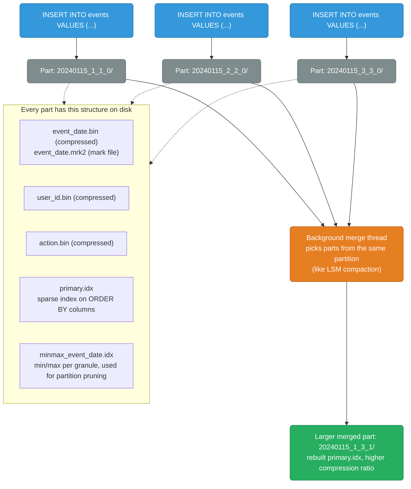
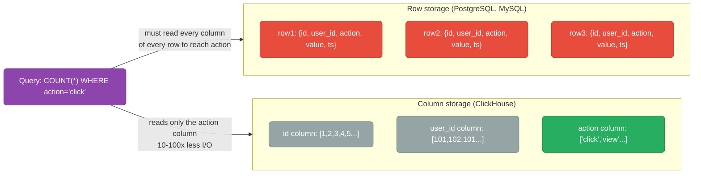
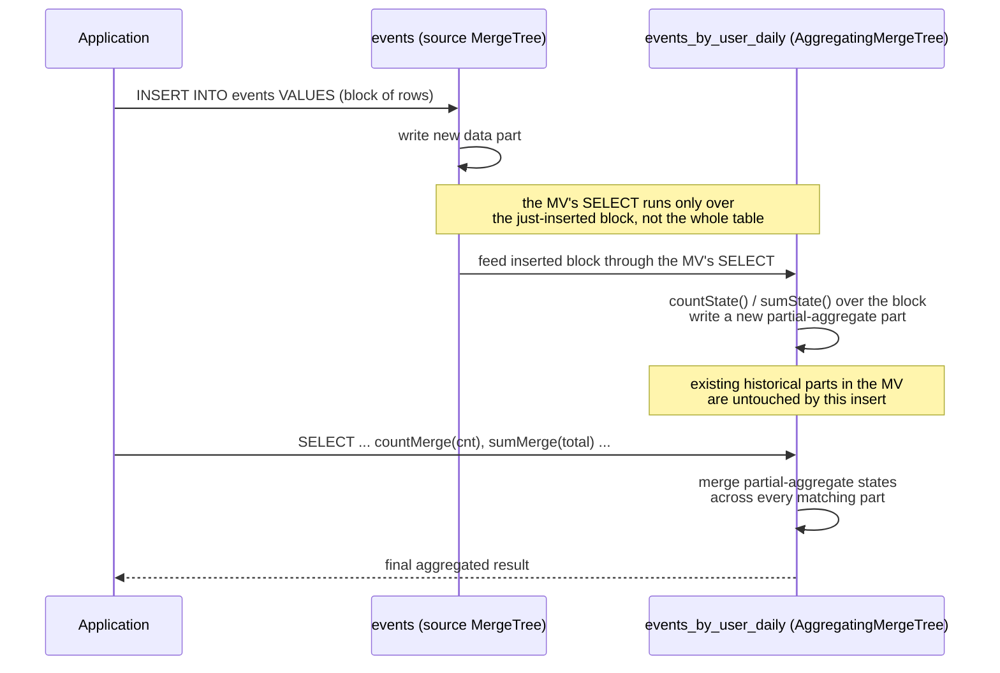
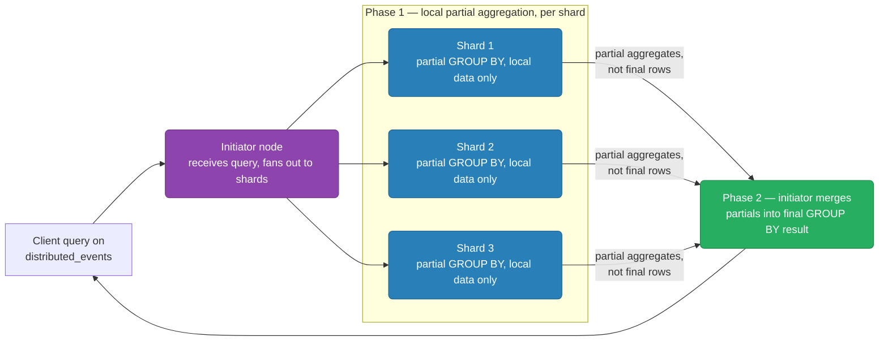
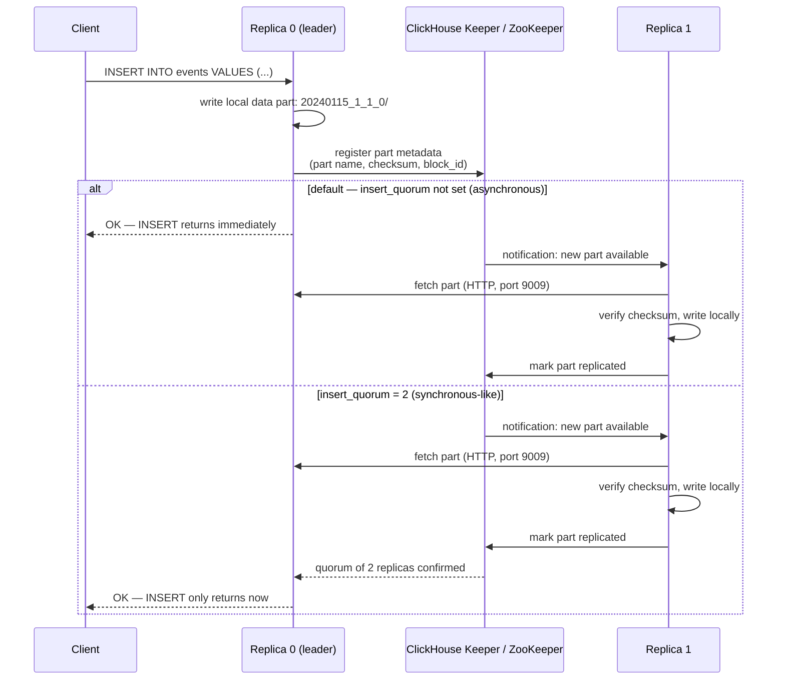

# ClickHouse Internals

How ClickHouse actually stores, merges, and executes queries against columnar data at analytical scale — the MergeTree part lifecycle, why columnar storage and vectorized execution make full scans cheap, and the replication and distributed-aggregation mechanics that show up once you shard and replicate for real traffic.

<div class="quiz-progress" data-quiz-progress>
  <span class="quiz-progress-label">0/0 checks</span>
  <span class="quiz-progress-bar"><span class="quiz-progress-fill"></span></span>
</div>

---

## MergeTree Storage Engine

ClickHouse's primary table engine — designed for analytical queries over billions of rows. Every `INSERT` writes its own part; a background thread continually merges parts into fewer, larger ones so reads never have to stitch together thousands of tiny fragments.



The diagram above shows one merge frozen in time. This is the same lifecycle running live: insert rows, watch them buffer in the memtable, flush into a part once 4 rows have accumulated (or force it sooner), and watch the background merge fire automatically once more than 3 parts pile up in the same partition — exactly the "many small parts → fewer, larger ones" cycle described above, just small enough numbers to actually watch happen.

<div class="structure-viz" id="mergetree-live-viz">
  <svg class="viz-canvas" viewBox="0 0 640 200"></svg>
  <div class="viz-controls">
    <input class="viz-input" type="number" placeholder="row value" />
    <button class="viz-btn" data-viz-action="insert">Insert</button>
    <button class="viz-btn" data-viz-action="flush">Force Flush</button>
    <button class="viz-btn" data-viz-action="search">Search</button>
    <button class="viz-btn" data-viz-action="reset">Reset</button>
  </div>
  <div class="viz-status"></div>
  <div class="viz-legend">
    <span><span class="viz-swatch" style="background:#1e3a8a"></span> row / part contents</span>
    <span><span class="viz-swatch" style="background:#14532d"></span> just flushed or merged</span>
    <span><span class="viz-swatch" style="background:#78350f"></span> found by search</span>
  </div>
</div>

<script>
(function () {
  const svgNS = 'http://www.w3.org/2000/svg';
  const root0 = document.getElementById('mergetree-live-viz');
  const svg = root0.querySelector('.viz-canvas');
  const input = root0.querySelector('.viz-input');
  const status = root0.querySelector('.viz-status');

  const FLUSH_THRESHOLD = 4;
  const MERGE_THRESHOLD = 3;
  const CELL_W = 36, CELL_H = 30, CELL_GAP = 6;
  const PART_W = 150, PART_H = 58, PART_GAP = 18;

  let memtable, parts, nextPartId;
  let highlightMemVal, highlightPartId, newPartId, flashTimer;

  function resetState() {
    memtable = [];
    parts = [];
    nextPartId = 1;
    highlightMemVal = null;
    highlightPartId = null;
    newPartId = null;
  }

  // Merge = concat + re-sort (a simplification of a real k-way merge over
  // already-sorted runs -- ClickHouse never re-sorts from scratch since
  // every source part is already sorted; it does a linear k-way merge
  // instead. We concat+sort here purely because the result is identical
  // and the code is simpler for a teaching demo).
  function mergeIfNeeded(log) {
    while (parts.length > MERGE_THRESHOLD) {
      const oldest = parts.shift();
      const second = parts.shift();
      const mergedRows = oldest.rows.concat(second.rows).sort((a, b) => a - b);
      const merged = { id: nextPartId++, rows: mergedRows };
      parts.push(merged);
      log.push(`${MERGE_THRESHOLD + 1} parts exceeded the threshold of ${MERGE_THRESHOLD} — background merge combined P${oldest.id}+P${second.id} into P${merged.id} (${merged.rows.length} rows)`);
      newPartId = merged.id;
    }
  }

  function doFlush(log, forced) {
    if (memtable.length === 0) {
      log.push('memtable is empty — nothing to flush');
      return null;
    }
    const sorted = memtable.slice().sort((a, b) => a - b);
    const part = { id: nextPartId++, rows: sorted };
    parts.push(part);
    memtable = [];
    newPartId = part.id;
    log.push(forced
      ? `force-flushed as part P${part.id} (${part.rows.length} rows)`
      : `memtable full — flushed as part P${part.id} (${part.rows.length} rows)`);
    mergeIfNeeded(log);
    return part;
  }

  function doInsert(value) {
    const log = [];
    highlightPartId = null;
    highlightMemVal = null;
    newPartId = null;
    memtable.push(value);
    if (memtable.length >= FLUSH_THRESHOLD) {
      doFlush(log, false);
    } else {
      highlightMemVal = value;
    }
    setStatus(log.length ? `Inserted ${value} — ${log.join('; then ')}.` : `Inserted ${value} (${memtable.length}/${FLUSH_THRESHOLD} in memtable).`, 'ok');
  }

  function doSearch(value) {
    highlightPartId = null;
    highlightMemVal = null;
    newPartId = null;
    if (memtable.includes(value)) {
      highlightMemVal = value;
      setStatus(`Found ${value} in the memtable (not flushed yet).`, 'ok');
      scheduleFlashClear();
      return;
    }
    for (let i = parts.length - 1; i >= 0; i--) {
      if (parts[i].rows.includes(value)) {
        highlightPartId = parts[i].id;
        setStatus(`Found ${value} in part P${parts[i].id}.`, 'ok');
        scheduleFlashClear();
        return;
      }
    }
    setStatus(`${value} not found — checked the memtable and all ${parts.length} part(s).`, 'error');
  }

  function scheduleFlashClear() {
    clearTimeout(flashTimer);
    flashTimer = setTimeout(() => { highlightMemVal = null; highlightPartId = null; newPartId = null; draw(); }, 1800);
  }

  function setStatus(msg, kind) {
    status.textContent = msg;
    status.className = 'viz-status' + (kind === 'ok' ? ' viz-status-ok' : kind === 'error' ? ' viz-status-error' : '');
  }

  function el(tag, attrs) {
    const e = document.createElementNS(svgNS, tag);
    for (const k in attrs) e.setAttribute(k, attrs[k]);
    return e;
  }

  function formatRows(rows) {
    const MAX_SHOWN = 10;
    if (rows.length <= MAX_SHOWN) return rows.join(', ');
    return rows.slice(0, MAX_SHOWN).join(', ') + `, …+${rows.length - MAX_SHOWN} more`;
  }

  function draw() {
    const memRowY = 14;
    const memLabelY = 4;
    const partsLabelY = memRowY + CELL_H + 22;
    const partsRowY = partsLabelY + 8;

    const memRowW = Math.max(CELL_W, memtable.length * (CELL_W + CELL_GAP));
    let partsRowW = 16;
    parts.forEach((p) => { partsRowW += PART_W + PART_GAP; });
    const vbW = Math.max(320, memRowW + 32, partsRowW + 16);
    const vbH = partsRowY + PART_H + 16;
    svg.setAttribute('viewBox', `0 0 ${vbW} ${vbH}`);
    while (svg.firstChild) svg.removeChild(svg.firstChild);

    const memLabel = el('text', { x: 16, y: memLabelY + 6, class: 'viz-label-dim', 'text-anchor': 'start' });
    memLabel.textContent = `memtable (${memtable.length}/${FLUSH_THRESHOLD})`;
    svg.appendChild(memLabel);

    if (memtable.length === 0) {
      const empty = el('rect', {
        x: 16, y: memRowY, width: CELL_W, height: CELL_H, rx: 4,
        class: 'viz-edge', 'fill-opacity': '0', 'stroke-dasharray': '4,3',
      });
      svg.appendChild(empty);
    } else {
      memtable.forEach((v, i) => {
        const x = 16 + i * (CELL_W + CELL_GAP);
        const cls = v === highlightMemVal ? 'viz-node-new' : 'viz-node';
        svg.appendChild(el('rect', { x, y: memRowY, width: CELL_W, height: CELL_H, rx: 4, class: cls }));
        const t = el('text', { x: x + CELL_W / 2, y: memRowY + CELL_H / 2 });
        t.textContent = v;
        svg.appendChild(t);
      });
    }

    const partsLabel = el('text', { x: 16, y: partsLabelY, class: 'viz-label-dim', 'text-anchor': 'start' });
    partsLabel.textContent = parts.length
      ? `parts, newest → oldest (${parts.length}/${MERGE_THRESHOLD} before next merge)`
      : 'parts (none yet)';
    svg.appendChild(partsLabel);

    const newestFirst = parts.slice().reverse();
    newestFirst.forEach((p, i) => {
      const x = 16 + i * (PART_W + PART_GAP);
      const y = partsRowY;
      const cls = p.id === newPartId ? 'viz-node-new' : (p.id === highlightPartId ? 'viz-node-highlight' : 'viz-node');
      svg.appendChild(el('rect', { x, y, width: PART_W, height: PART_H, rx: 6, class: cls, 'fill-opacity': '0.18' }));
      const title = el('text', { x: x + PART_W / 2, y: y + 16, class: 'viz-label-dim' });
      title.textContent = `P${p.id} • ${p.rows.length} row${p.rows.length === 1 ? '' : 's'}`;
      svg.appendChild(title);
      const body = el('text', { x: x + PART_W / 2, y: y + 38 });
      body.textContent = formatRows(p.rows);
      svg.appendChild(body);
    });

    if (parts.length === 0) {
      const noPart = el('text', { x: 16 + PART_W / 2, y: partsRowY + PART_H / 2, class: 'viz-label-dim' });
      noPart.textContent = '(empty)';
      svg.appendChild(noPart);
    }
  }

  root0.querySelector('[data-viz-action="insert"]').addEventListener('click', () => {
    const v = parseInt(input.value, 10);
    if (isNaN(v)) { setStatus('Enter a numeric row value first.', 'error'); return; }
    doInsert(v);
    input.value = '';
    draw();
    scheduleFlashClear();
  });

  root0.querySelector('[data-viz-action="flush"]').addEventListener('click', () => {
    const log = [];
    highlightPartId = null;
    highlightMemVal = null;
    newPartId = null;
    const part = doFlush(log, true);
    setStatus(log.join('; then '), part ? 'ok' : '');
    draw();
    scheduleFlashClear();
  });

  root0.querySelector('[data-viz-action="search"]').addEventListener('click', () => {
    const v = parseInt(input.value, 10);
    if (isNaN(v)) { setStatus('Enter a numeric row value first.', 'error'); return; }
    doSearch(v);
    draw();
  });

  root0.querySelector('[data-viz-action="reset"]').addEventListener('click', () => {
    resetState();
    setStatus('Reset — memtable and all parts cleared.', '');
    draw();
  });

  resetState();
  setStatus('Insert rows to fill the memtable (flushes automatically at 4), or Force Flush to see a part sooner.', '');
  draw();
})();
</script>

The two index files do different jobs even though both sound like "an index on this column." `minmax_event_date.idx` works at the *partition* level — it lets the planner throw out whole partitions (whole months, in this schema) before opening them at all. `primary.idx` works one level down, inside whatever partitions survive that cut — it's the sparse index over the `ORDER BY` key that skips individual granules within a part. Partition pruning is the coarse first cut; the primary index skip is the fine-grained second one.

<div class="stepper">
  <div class="stepper-panels">
    <div class="stepper-panel active">
      <strong>1. Every INSERT writes a new part.</strong> A single <code>INSERT INTO events VALUES (...)</code> becomes one part directory on disk (e.g. <code>20240115_1_1_0/</code>) with its own compressed column files, its own <code>primary.idx</code>, and its own min/max index — nothing is appended into an existing part.
    </div>
    <div class="stepper-panel">
      <strong>2. Small parts accumulate.</strong> A workload doing many INSERTs (one per batch, one per second, etc.) produces many small parts in the same partition. Each one is independently valid and queryable, but more parts means more index files to consult and more merge work waiting.
    </div>
    <div class="stepper-panel">
      <strong>3. A background merge thread picks a set of parts.</strong> Parts from the same partition are merged the way an LSM-tree compacts SSTables — rows from all the source parts are re-sorted together by the <code>ORDER BY</code> key into one sorted run.
    </div>
    <div class="stepper-panel">
      <strong>4. The merged part gets a new name and a fresh index.</strong> The result (e.g. <code>20240115_1_3_1/</code>) has its <code>primary.idx</code> rebuilt over the combined, re-sorted rows, and its column files re-compressed as one contiguous run — typically a better compression ratio than the sum of the original small parts.
    </div>
    <div class="stepper-panel">
      <strong>5. Source parts are marked inactive, then dropped.</strong> The original small parts aren't deleted immediately — they're kept until any query still reading them finishes, then removed. This cycle repeats continuously, which is why <code>system.parts</code> shows both active and recently-superseded parts at any given moment.
    </div>
  </div>
  <div class="stepper-controls">
    <button class="stepper-prev">← Prev</button>
    <span class="stepper-dots"></span>
    <span class="stepper-label"></span>
    <button class="stepper-next">Next →</button>
  </div>
</div>

<div class="quiz-card">
  <p class="quiz-q">A part has both a primary.idx and a minmax_event_date.idx. What's the actual difference in what each one skips?</p>
  <button class="quiz-reveal">Reveal answer</button>
  <div class="quiz-a" hidden>minmax_event_date.idx works at the partition level — it stores the min/max of the partitioning column so the planner can skip whole partitions (e.g. whole months) without opening them at all. primary.idx works inside the partitions that survive that cut — it's a sparse index over the ORDER BY columns that lets a query skip individual granules within a part. Partition pruning is the coarse first cut; the primary index skip is the fine-grained second one.</div>
</div>

---

## Columnar Storage — Why Queries Are Fast



**Compression per column:** Each column has uniform data type → high compression ratio. `user_id` column: sorted integers → delta encoding → LZ4/ZSTD. Typical: 5-10x compression vs raw CSV.

<div class="quiz-card">
  <p class="quiz-q">Both row storage and column storage have to check the action value for every row to answer COUNT(*) WHERE action='click'. Why is row storage still slower here?</p>
  <button class="quiz-reveal">Reveal answer</button>
  <div class="quiz-a" hidden>Row storage keeps id, user_id, action, value, and ts physically together per row, so reading the action field for one row means pulling the whole row off disk — every other column comes along whether the query needs it or not. Column storage keeps action values contiguous in their own file, so only that one column's data is read at all. Same logical check, 10-100x less I/O.</div>
</div>

---

## MergeTree Family

```
MergeTree                 — base engine, append + merge
ReplacingMergeTree        — deduplicate by ORDER BY key on merge
SummingMergeTree          — aggregate numeric columns on merge
AggregatingMergeTree      — store partial aggregates, merge = combine aggregates
CollapsingMergeTree       — delete rows by sign column (CRDT-like)
ReplicatedMergeTree       — MergeTree with ZooKeeper/Keeper replication
```

The four non-base, non-replicated variants below all differ only in what the merge step *does* with rows that share the same `ORDER BY` key — the rest of MergeTree's mechanics (parts, granules, background merges) are identical across all of them. `ReplicatedMergeTree` is orthogonal to this choice: it's a replication layer that can wrap any of these engines, covered in [ReplicatedMergeTree Internals](#replicatedmergetree-internals) below.

<div class="tab-group">
  <div class="tab-buttons">
    <button data-tab="replacing" class="active">ReplacingMergeTree</button>
    <button data-tab="summing">SummingMergeTree</button>
    <button data-tab="aggregating">AggregatingMergeTree</button>
    <button data-tab="collapsing">CollapsingMergeTree</button>
  </div>
  <div class="tab-panels">
    <div class="tab-panel active" data-tab-panel="replacing">
      <strong>Deduplicate by ORDER BY key, on merge.</strong> When two rows share the same ORDER BY key, a merge keeps only the latest one and drops the rest. Until a merge actually happens, both rows are still there — <code>SELECT</code> without <code>FINAL</code> can return duplicates.
    </div>
    <div class="tab-panel" data-tab-panel="summing">
      <strong>Aggregate numeric columns, on merge.</strong> Rows sharing the same ORDER BY key get their numeric columns summed together into one row during a merge — useful for pre-summed counters, but only numeric columns are combined this way.
    </div>
    <div class="tab-panel" data-tab-panel="aggregating">
      <strong>Store partial aggregate states, merge = combine them.</strong> Instead of raw values, columns hold intermediate aggregate state (from functions like <code>countState()</code>/<code>sumState()</code>); a merge combines states from multiple rows into one, and a query finishes the reduction with <code>countMerge()</code>/<code>sumMerge()</code>. This is what powers the materialized view pattern below.
    </div>
    <div class="tab-panel" data-tab-panel="collapsing">
      <strong>Delete rows by sign column (CRDT-like).</strong> Every row carries a <code>sign</code> column of +1 or -1; inserting a -1 row with the same ORDER BY key as an earlier +1 row marks that pair for removal, and a merge collapses matched +1/-1 pairs out of existence — an insert-only way to express "delete" or "update" without touching existing parts.
    </div>
  </div>
</div>

```sql
CREATE TABLE events (
    event_date  Date,
    user_id     UInt64,
    action      LowCardinality(String),
    value       Float64
) ENGINE = ReplicatedMergeTree('/clickhouse/tables/{shard}/events', '{replica}')
PARTITION BY toYYYYMM(event_date)     -- partition by month
ORDER BY (event_date, user_id)         -- sort key = primary key
SETTINGS index_granularity = 8192;    -- rows per granule (sparse index unit)
```

<div class="quiz-card">
  <p class="quiz-q">You INSERT the same ORDER BY key twice into a ReplacingMergeTree table, then immediately run SELECT * without FINAL, before any merge has happened. How many rows come back?</p>
  <button class="quiz-reveal">Reveal answer</button>
  <div class="quiz-a" hidden>Two. Deduplication in ReplacingMergeTree happens on merge, not on insert — and merges run on the background thread's own schedule, not synchronously after every write. Until a merge actually combines the parts holding those two rows, both are visible. Use SELECT ... FINAL to force logical deduplication at query time, or wait for/trigger a merge.</div>
</div>

---

## Query Execution

```mermaid
graph LR
    classDef inputs fill:#8e44ad,stroke:#6c3483,color:#fff,rx:6
    classDef plan fill:#f39c12,stroke:#ba6018,color:#fff,rx:6
    classDef io fill:#2980b9,stroke:#1f618d,color:#fff,rx:6
    classDef exec fill:#27ae60,stroke:#1e8449,color:#fff,rx:6
    classDef out fill:#7f8c8d,stroke:#616a6b,color:#fff,rx:6

    QUERY2["SELECT user_id, count() FROM events<br/>WHERE event_date = '2024-01-15'<br/>GROUP BY user_id"]:::inputs --> PLAN

    subgraph PLANNING["Query planner"]
        PLAN["Partition pruning<br/>skip other months via minmax idx"]:::plan --> SKIP["Primary index skip<br/>skip non-matching granules"]:::plan
    end

    SKIP --> READ["Read only event_date + user_id columns<br/>decompress needed granules only"]:::io
    READ --> VEC["Vectorized execution<br/>process 8192 rows/granule at once (SIMD)"]:::exec
    VEC --> AGG["AggregatingTransform<br/>per-thread hash aggregation"]:::exec
    AGG --> MERGEAGG["MergingAggregatedTransform<br/>combine per-thread partials"]:::exec
    MERGEAGG --> RESULT["Result"]:::out
```



**Granule:** ClickHouse divides each column file into granules of `index_granularity` rows (default 8192). The sparse primary index stores the first value of each granule. Queries skip entire granules that can't match the WHERE clause.

<div class="stepper">
  <div class="stepper-panels">
    <div class="stepper-panel active">
      <strong>1. Prune partitions and granules.</strong> The planner uses minmax_event_date.idx to throw out whole partitions that can't match, then primary.idx to skip individual granules within what's left — before a single row is read.
    </div>
    <div class="stepper-panel">
      <strong>2. Read and decompress only the needed columns.</strong> Only event_date and user_id are read off disk here — the query never asked for action or value, so those column files aren't touched at all.
    </div>
    <div class="stepper-panel">
      <strong>3. Process a whole granule at once, not row by row.</strong> Each column's 8192-row granule is loaded as a contiguous array and processed with SIMD instructions — one CPU instruction can operate on many values in that array simultaneously, instead of a function call per row.
    </div>
    <div class="stepper-panel">
      <strong>4. Each thread aggregates its own share independently.</strong> ClickHouse splits the granules being scanned across max_threads worker threads; each thread builds its own local hash table for GROUP BY, with zero coordination between threads at this stage.
    </div>
    <div class="stepper-panel">
      <strong>5. Merge the per-thread partial aggregates.</strong> A final MergingAggregatedTransform pass combines every thread's local hash table into one final result set — the same "compute partial, then merge" pattern used across shards in distributed aggregation.
    </div>
  </div>
  <div class="stepper-controls">
    <button class="stepper-prev">← Prev</button>
    <span class="stepper-dots"></span>
    <span class="stepper-label"></span>
    <button class="stepper-next">Next →</button>
  </div>
</div>

<div class="quiz-card">
  <p class="quiz-q">Why does processing 8192 rows at once (vectorized/SIMD) actually make a GROUP BY faster, rather than just being a batch-size implementation detail?</p>
  <button class="quiz-reveal">Reveal answer</button>
  <div class="quiz-a" hidden>Because each column's values for that granule sit in one contiguous array, a single SIMD CPU instruction can operate on many of them at once instead of the engine calling a per-row function 8192 separate times. Row-by-row execution pays that per-row overhead every single row; vectorized execution pays it once per granule. The 8192 batch size isn't arbitrary either — it's exactly index_granularity, the same unit the primary index already skips by.</div>
</div>

---

## Materialized Views

Pre-aggregate data at insert time for fast dashboard queries:



```sql
-- Source table
CREATE TABLE events (...) ENGINE = MergeTree() ...;

-- Materialized view: count events per user per day
CREATE MATERIALIZED VIEW events_by_user_daily
ENGINE = AggregatingMergeTree()
PARTITION BY toYYYYMM(event_date)
ORDER BY (event_date, user_id)
AS SELECT
    event_date,
    user_id,
    countState() AS cnt,        -- partial aggregate state
    sumState(value) AS total
FROM events
GROUP BY event_date, user_id;

-- Query the materialized view
SELECT
    event_date,
    user_id,
    countMerge(cnt) AS count,   -- merge partial states
    sumMerge(total) AS total
FROM events_by_user_daily
WHERE event_date = today()
GROUP BY event_date, user_id;
```

A materialized view here isn't a live view recomputed on read — it's a trigger wired to `INSERT`. It only ever sees the rows in the block currently being inserted into the source table; it has no visibility into rows that already existed in `events` before the view was created. That's why standing up a materialized view against a table that already has data needs a manual one-time backfill (an `INSERT INTO events_by_user_daily SELECT ... FROM events` covering the existing rows) done alongside `CREATE MATERIALIZED VIEW` — the view itself only ever populates incrementally, going forward.

<div class="stepper">
  <div class="stepper-panels">
    <div class="stepper-panel active">
      <strong>1. New rows land in the source table.</strong> A regular INSERT into events writes a normal data part, exactly as it would with no materialized view attached.
    </div>
    <div class="stepper-panel">
      <strong>2. The MV's SELECT runs against just that inserted block.</strong> Not the whole events table — only the rows from this specific INSERT are fed through the materialized view's query.
    </div>
    <div class="stepper-panel">
      <strong>3. countState()/sumState() produce partial aggregate states.</strong> Instead of a final count or sum, these functions produce an intermediate, mergeable representation of "count so far" / "sum so far" for this block.
    </div>
    <div class="stepper-panel">
      <strong>4. Those partial states are written as a new part in the MV's own table.</strong> events_by_user_daily is itself an AggregatingMergeTree — it accumulates partial-state parts the same way any MergeTree table accumulates parts, including its own background merges combining partial states from multiple parts into fewer, larger ones.
    </div>
    <div class="stepper-panel">
      <strong>5. Queries finish the aggregation with countMerge()/sumMerge().</strong> These combine whatever partial states exist across all the MV's current parts — old and newly-inserted alike — into the final number the dashboard actually shows.
    </div>
  </div>
  <div class="stepper-controls">
    <button class="stepper-prev">← Prev</button>
    <span class="stepper-dots"></span>
    <span class="stepper-label"></span>
    <button class="stepper-next">Next →</button>
  </div>
</div>

<div class="quiz-card">
  <p class="quiz-q">Why does querying events_by_user_daily use countMerge(cnt) and sumMerge(total) instead of a plain count() or sum()?</p>
  <button class="quiz-reveal">Reveal answer</button>
  <div class="quiz-a" hidden>Because the columns being read (cnt, total) don't hold final numbers — they hold partial aggregate state produced by countState()/sumState() at insert time. A plain count()/sum() would try to aggregate the partial-state values themselves, which is meaningless; countMerge()/sumMerge() know how to combine those states correctly into the real final count and sum.</div>
</div>

---

## Key Configuration

```xml
<!-- config.xml -->
<max_memory_usage>10000000000</max_memory_usage>  <!-- 10GB per query -->
<max_threads>8</max_threads>
<max_concurrent_queries>100</max_concurrent_queries>

<!-- Compression -->
<compression>
    <case><min_part_size>10000000000</min_part_size>
        <method>zstd</method><level>3</level>
    </case>
</compression>
```

---

## Key Metrics

```promql
ClickHouseMetrics_Query                    # active queries
ClickHouseAsyncMetrics_MemoryResident      # RSS memory
ClickHouseMetrics_BackgroundMergesAndMutations  # merge queue
ClickHouseProfileEvents_MergedRows         # rows merged per second
ClickHouseMetrics_ReplicasMaxQueueSize      # replication queue depth (pending fetches/merges)
```

---

## EXPLAIN — Query Execution Analysis

```sql
-- See query execution pipeline
EXPLAIN PIPELINE SELECT user_id, count() FROM events
WHERE event_date = today() GROUP BY user_id;

-- Output shows stages:
-- (ExpressionTransform) → (AggregatingTransform) → (MergingAggregatedTransform)
-- → shows parallelism: how many threads per stage

-- Detailed analysis with timing
EXPLAIN ANALYZE SELECT user_id, count() FROM events
WHERE event_date = today() GROUP BY user_id;

-- Show which granules are read (index analysis)
EXPLAIN indexes=1 SELECT count() FROM events WHERE user_id = 123;
-- Marks (1) → only 1 granule read out of thousands (primary index worked)
```

<div class="quiz-card">
  <p class="quiz-q">EXPLAIN indexes=1 reports "Marks (1)" for a query filtering on user_id = 123. Why is that number the interesting part of the output?</p>
  <button class="quiz-reveal">Reveal answer</button>
  <div class="quiz-a" hidden>A "mark" here corresponds to a granule. Reading only 1 mark out of the thousands that make up the table means the primary sparse index let ClickHouse skip essentially every other granule instead of scanning the whole table — direct, quantified evidence that the index worked for this query's filter, not just that an index exists.</div>
</div>

---

## TTL — Automatic Data Expiry

```sql
-- Auto-delete rows older than 30 days
CREATE TABLE events (
    event_date  Date,
    user_id     UInt64,
    action      String
) ENGINE = MergeTree()
ORDER BY (event_date, user_id)
TTL event_date + INTERVAL 30 DAY DELETE;
-- Rows deleted during background merges when TTL expires

-- Move old data to cheaper storage tier (tiered storage)
TTL event_date + INTERVAL 7 DAY TO DISK 'ssd',
    event_date + INTERVAL 30 DAY TO DISK 'hdd',
    event_date + INTERVAL 90 DAY TO VOLUME 's3';

-- Check TTL status
SELECT name, data_compressed_bytes/1e9 AS compressed_gb,
       min_date, max_date
FROM system.parts
WHERE table = 'events' AND active;
```

<div class="toggle-switch">
  <div class="toggle-buttons">
    <button data-toggle-opt="delete" class="active state-warn">TTL ... DELETE</button>
    <button data-toggle-opt="tiered" class="state-ok">TTL ... TO DISK/VOLUME</button>
  </div>
  <div class="toggle-panel active" data-toggle-panel="delete">
    Rows matching the expired condition are removed for good. Enforcement is lazy — rows are actually dropped during a background merge that touches their part, not the instant the TTL condition becomes true, so an expired row can still show up in query results (and still counts toward disk usage) until that merge runs.
  </div>
  <div class="toggle-panel" data-toggle-panel="tiered">
    Instead of deleting, the part is moved to a different disk or volume once its tier's TTL condition is met — cheaper storage for data that's aged out of the "hot" tier but still needs to be queryable. Same lazy, merge-driven enforcement as TTL DELETE — nothing moves until a background merge processes that part.
  </div>
</div>

<div class="quiz-card">
  <p class="quiz-q">A row's TTL condition (event_date + INTERVAL 30 DAY) becomes true at 3:00pm. Is the row gone from query results at 3:00pm?</p>
  <button class="quiz-reveal">Reveal answer</button>
  <div class="quiz-a" hidden>Not necessarily. TTL rows are only actually deleted during background merges that touch their part, not the instant the condition evaluates true. The row can still be returned by queries — and still occupy disk space — until a merge involving that part happens to run. TTL is an eventual guarantee, not an instantaneous one.</div>
</div>

---

## Distributed Aggregation

When ClickHouse shards data, aggregations run in two phases:



```sql
-- Distributed table fans out to shards, merges results
SELECT user_id, count() FROM distributed_events
WHERE event_date = today() GROUP BY user_id ORDER BY count() DESC LIMIT 10;

-- Under the hood: each shard runs:
-- SELECT user_id, count() FROM local_events WHERE event_date = today() GROUP BY user_id
-- Initiator merges partial counts from all shards
```

<div class="stepper">
  <div class="stepper-panels">
    <div class="stepper-panel active">
      <strong>1. Initiator receives the query.</strong> The client only ever talks to the Distributed table's entry point — it doesn't know or care how many shards exist underneath.
    </div>
    <div class="stepper-panel">
      <strong>2. The initiator rewrites and fans the query out to every shard.</strong> Each shard gets a version of the query that runs against its own local table, not the distributed one.
    </div>
    <div class="stepper-panel">
      <strong>3. Each shard computes its own local, partial GROUP BY.</strong> A shard only sees the data it physically holds — its result for a given user_id is only that shard's partial count, since the same user_id can also have rows sitting on a different shard.
    </div>
    <div class="stepper-panel">
      <strong>4. Shards stream partial aggregates back, not final answers.</strong> What comes back to the initiator is intermediate state per shard, not rows that are safe to hand straight to the client.
    </div>
    <div class="stepper-panel">
      <strong>5. The initiator re-merges partials into the final result.</strong> Rows for the same key coming from different shards get combined here; any ORDER BY / LIMIT on the outer query is applied after this merge, once the complete final result set exists.
    </div>
  </div>
  <div class="stepper-controls">
    <button class="stepper-prev">← Prev</button>
    <span class="stepper-dots"></span>
    <span class="stepper-label"></span>
    <button class="stepper-next">Next →</button>
  </div>
</div>

<div class="quiz-card">
  <p class="quiz-q">Each shard already computes its own GROUP BY user_id. Why can't the initiator just concatenate the three shards' results directly as the final answer?</p>
  <button class="quiz-reveal">Reveal answer</button>
  <div class="quiz-a" hidden>Because a given user_id isn't guaranteed to live on only one shard — the same key can produce a partial count on Shard 1 and another partial count on Shard 2. Concatenating would leave duplicate rows for that key with incomplete counts in each. The initiator has to re-run a merge/GROUP BY across all the partials so that rows sharing the same key get combined into one true final count before anything is returned.</div>
</div>

---

## ReplicatedMergeTree Internals



Replication is **asynchronous** — INSERT returns after writing to one replica. Use `insert_quorum` for synchronous-like behavior:

```sql
SET insert_quorum = 2;  -- wait for 2 replicas to confirm before returning
SET insert_quorum_timeout = 60000;  -- 60 second timeout

INSERT INTO events VALUES (...);  -- blocks until 2 replicas have the data
```

<div class="quiz-card">
  <p class="quiz-q">With default settings (no insert_quorum), does an INSERT into a ReplicatedMergeTree table wait for Replica 1 to fetch and verify the new part before returning OK to the client?</p>
  <button class="quiz-reveal">Reveal answer</button>
  <div class="quiz-a" hidden>No. By default, replication is asynchronous — the leader returns OK to the client as soon as it has written the part locally and registered it in Keeper. The fetch-and-verify by other replicas happens afterward, on its own schedule. Only setting insert_quorum forces the leader to wait for that many replicas to confirm before acknowledging the client.</div>
</div>

---

## Query Profiling and Optimization

```sql
-- System tables for query analysis
SELECT query, read_rows, read_bytes/1e9 AS read_gb,
       memory_usage/1e9 AS memory_gb,
       query_duration_ms
FROM system.query_log
WHERE type = 'QueryFinish'
  AND event_time > now() - INTERVAL 1 HOUR
ORDER BY query_duration_ms DESC LIMIT 10;

-- Find queries doing too many reads (need better indexes/partitioning)
SELECT query, read_rows, read_rows / result_rows AS selectivity
FROM system.query_log
WHERE type = 'QueryFinish' AND read_rows > 1e8
ORDER BY read_rows DESC LIMIT 10;
-- If selectivity > 10000: reading 10K rows per result row → bad filtering

-- Parts and merges in progress
SELECT table, elapsed, progress, rows_read, rows_written
FROM system.merges;

-- Background merge queue size (high = inserts faster than merges)
SELECT table, count() AS parts_count
FROM system.parts
WHERE active AND database = currentDatabase()
GROUP BY table
HAVING parts_count > 100  -- warning: too many parts → slow queries
ORDER BY parts_count DESC;
```

<div class="quiz-card">
  <p class="quiz-q">A query shows read_rows: 1,000,000 and result_rows: 10, giving selectivity = 100,000. Is a bigger or smaller selectivity number the sign of a healthy query?</p>
  <button class="quiz-reveal">Reveal answer</button>
  <div class="quiz-a" hidden>Smaller is healthier. Selectivity here is read_rows / result_rows — how many rows ClickHouse had to examine for every row it actually returned. A huge ratio (the file's own threshold flags selectivity > 10000 as a problem) means the query is reading far more data than it needs to produce its answer, which usually points at a missing or poorly-matched index/partition key rather than "an index that isn't helping enough."</div>
</div>

---

## Ingestion Best Practices

```sql
-- Batch inserts: ClickHouse is optimized for large batches, NOT one-row inserts
-- Bad: INSERT INTO events VALUES (row1); INSERT INTO events VALUES (row2);
-- Good: INSERT INTO events VALUES (row1),(row2),...,(row10000);
```

<div class="tab-group">
  <div class="tab-buttons">
    <button data-tab="asyncinsert" class="active">async_insert</button>
    <button data-tab="buffertable">Buffer table engine</button>
  </div>
  <div class="tab-panels">
    <div class="tab-panel active" data-tab-panel="asyncinsert">
      <strong>Server-side buffering, no schema changes.</strong> Set async_insert = 1 and the server itself accumulates incoming small inserts before writing a part; the client keeps inserting into the real table exactly as before. With wait_for_async_insert = 0, the client doesn't even wait for the flush to be confirmed.
    </div>
    <div class="tab-panel" data-tab-panel="buffertable">
      <strong>An explicit intermediate table.</strong> A Buffer-engine table sits between the client and the real MergeTree table; the client inserts into the buffer table specifically, and rows sit in RAM until one of the configured thresholds trips a flush into the underlying table. Requires standing up and writing to a second table, but makes the buffering behavior and its thresholds fully explicit and configurable per table.
    </div>
  </div>
</div>

```sql
-- Use async_insert for high-frequency small inserts
SET async_insert = 1;          -- buffer inserts server-side
SET wait_for_async_insert = 0; -- don't wait for flush confirmation

-- Buffer table: accumulate writes, flush to MergeTree periodically
CREATE TABLE events_buffer AS events
ENGINE = Buffer(currentDatabase(), events, 16, 10, 100, 10000, 1000000, 10000000, 100000000);
-- Flushes when: time > 10-100s OR rows > 10K-1M OR bytes > 10MB-100MB
INSERT INTO events_buffer VALUES (...);  -- fast, goes to RAM buffer
```

<div class="quiz-card">
  <p class="quiz-q">A Buffer table is configured to flush at 10-100s OR 10K-1M rows OR 10MB-100MB. It has only been accumulating for 5 seconds but has already received 1.2M rows. Does it wait for the time threshold before flushing?</p>
  <button class="quiz-reveal">Reveal answer</button>
  <div class="quiz-a" hidden>No. The three thresholds are OR conditions, not AND — whichever one is hit first triggers the flush. 1.2M rows already exceeds the row threshold, so the Buffer table flushes into the underlying MergeTree table immediately, regardless of how little time has elapsed.</div>
</div>
