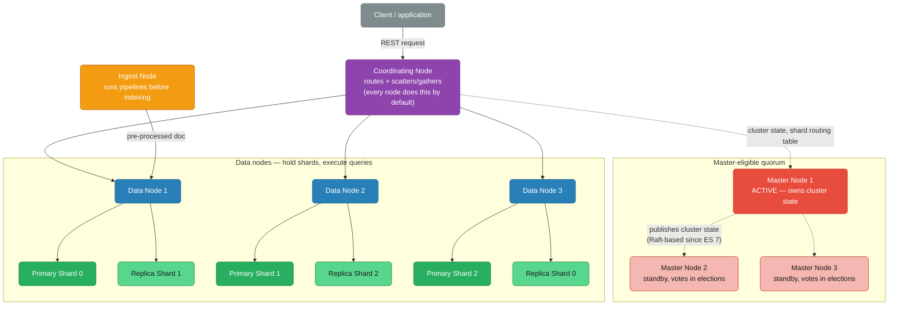
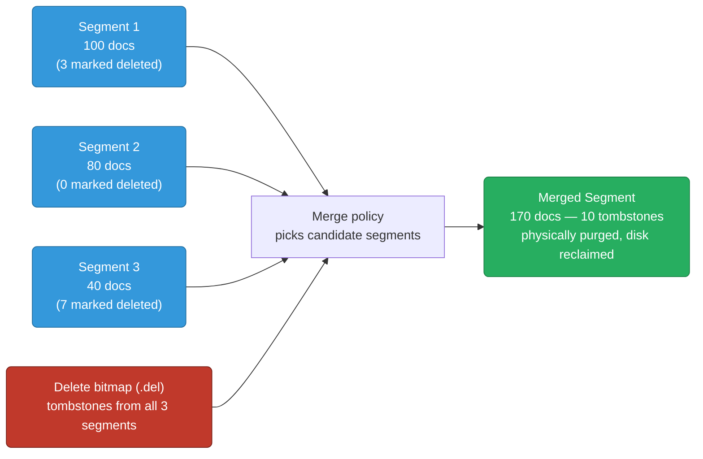

# Elasticsearch Internals

Distributed search and analytics engine built on Apache Lucene. Horizontally scalable, schema-flexible, and optimized for full-text search and near-real-time analytics.

<div class="quiz-progress" data-quiz-progress>
  <span class="quiz-progress-label">0/0 checks</span>
  <span class="quiz-progress-bar"><span class="quiz-progress-fill"></span></span>
</div>

---

## 1. What Elasticsearch Is

- **Search engine**: inverted index for full-text search with relevance scoring
- **Analytics engine**: aggregations over large datasets (like SQL GROUP BY but distributed)
- **Document store**: JSON documents, schemaless or schema-controlled via mappings
- **Built on Lucene**: each shard is a Lucene index; ES adds distribution, replication, and a REST API

Not a primary database — no ACID transactions, no joins across indexes. Use it for search, log analytics (ELK stack), and metrics aggregation.

<div class="quiz-card">
  <p class="quiz-q">A team wants to use Elasticsearch as the system of record for orders, with joins across an orders index and a customers index. What's wrong with that plan?</p>
  <button class="quiz-reveal">Reveal answer</button>
  <div class="quiz-a" hidden>Elasticsearch isn't a primary database — it has no ACID transactions and no joins across indexes. It's built for search, log analytics, and metrics aggregation on top of a primary datastore, not as the source of truth itself. Orders and customers would each need to be indexed as denormalized documents (or joined at write time), not queried relationally at read time.</div>
</div>

---

## 2. Core Architecture

| Concept | Description |
|---------|-------------|
| **Cluster** | One or more nodes sharing the same `cluster.name` |
| **Node** | Single running ES instance |
| **Index** | Logical namespace for documents (like a database table) |
| **Shard** | Physical unit — a single Lucene index. Index is split into N primary shards |
| **Replica** | Copy of a primary shard for HA and read scaling |

### Node Types

| Role | Responsibility |
|------|---------------|
| **Master** | Manages cluster state: node join/leave, index create/delete, shard allocation |
| **Data** | Stores shards, executes queries and indexing |
| **Ingest** | Pre-processes documents (pipelines) before indexing |
| **Coordinating** | Routes requests, merges results — every node is coordinating by default |
| **ML** | Runs machine learning jobs (X-Pack) |

A node can have multiple roles. In production, dedicate master and data nodes.

---

## 3. Cluster Topology Diagram



Note that every replica lives on a *different* data node than its own primary (`R0` is on `DN3`, not `DN1` alongside `P0`) — that's what lets a replica keep serving reads, and get promoted, if the node holding its primary disappears entirely. The master nodes never touch document data at all; they only own cluster state (which indices exist, which shard lives on which node) and get elected among themselves independently of the data path.

<div class="quiz-card">
  <p class="quiz-q">A 3-node cluster has all 3 nodes acting as master-eligible, data, and coordinating simultaneously — the default out of the box. What's the production risk being traded away for simplicity?</p>
  <button class="quiz-reveal">Reveal answer</button>
  <div class="quiz-a" hidden>A node handling heavy search/indexing load (data role) and cluster-state management (master role) at the same time means a resource spike from one job (a huge aggregation, a GC pause) can delay master duties like detecting a node failure or reassigning shards — exactly when the cluster most needs a responsive master. That's why the guidance is to dedicate master and data nodes separately in production rather than run every node with every role.</div>
</div>

---

## 4. Inverted Index

Traditional databases index rows → fields. Lucene inverts this: **term → list of document IDs**.

### Tokenization Example

Input text: `"The quick brown fox"`

**Analysis pipeline:**
1. **Char filter** — strip HTML, map chars (e.g., `&` → `and`)
2. **Tokenizer** — split on whitespace: `[The, quick, brown, fox]`
3. **Token filters** — lowercase, stop words, stemming: `[quick, brown, fox]` (`the` removed as stop word)

**Resulting inverted index:**

| Term | Doc IDs | Positions |
|------|---------|-----------|
| `quick` | [1, 3] | [1, 2] |
| `brown` | [1] | [2] |
| `fox` | [1, 4] | [3] |

When you search for `"quick fox"`:
1. Tokenize query → `[quick, fox]`
2. Look up each term in inverted index
3. Intersect doc ID lists → `[1, 4]` for `quick` ∩ `[1]` for `fox` = `[1]`
4. Score by TF-IDF or BM25

The `keyword` field type skips analysis — stored as-is for exact matching, sorting, and aggregations.

<div class="quiz-card">
  <p class="quiz-q">Searching a text field for "Quick Fox" returns a document containing "the quick brown fox" — the casing and word order don't match at all. Why does it still hit?</p>
  <button class="quiz-reveal">Reveal answer</button>
  <div class="quiz-a" hidden>Both the indexed document and the search query go through the same analysis pipeline before matching happens — lowercasing, stop-word removal, and tokenization apply to the query text too, not just the stored document. "Quick Fox" tokenizes down to [quick, fox], "the quick brown fox" tokenizes to [quick, brown, fox] (the/stop word removed), and the query matches because both terms are present in the doc's term list — word order and original casing were thrown away for both sides before the lookup happened.</div>
</div>

---

## 5. Index Segments

A Lucene index (shard) is composed of **immutable segments**.

### How segments work

- **Write**: documents first go to an in-memory buffer + translog
- **Refresh** (default every 1s): memory buffer flushes to a new on-disk segment → document becomes searchable
- **Flush** (triggered by translog size or time): fsync segments + translog to disk, clear translog
- **Merge**: background merging combines small segments into larger ones, physically deletes documents marked in the delete bitmap

<div class="stepper">
  <div class="stepper-panels">
    <div class="stepper-panel active">
      <strong>1. Write.</strong> The document lands in an in-memory buffer and, in parallel, is appended to the translog. Neither is a searchable Lucene segment yet — this is just durability + staging.
    </div>
    <div class="stepper-panel">
      <strong>2. Refresh (default every 1s).</strong> The in-memory buffer is flushed to a new on-disk segment, and only <em>now</em> does the document become searchable. This new segment isn't fsynced yet — it can still be lost in a crash, which is exactly why the translog exists.
    </div>
    <div class="stepper-panel">
      <strong>3. Flush (triggered by translog size or time).</strong> Existing segments and the translog are fsynced to disk, and the translog is cleared. This is the durability point — after a flush, a crash can't lose anything that was already flushed.
    </div>
    <div class="stepper-panel">
      <strong>4. Merge (background, ongoing).</strong> Small segments are combined into larger ones. Documents flagged in the delete bitmap are physically dropped during this pass — deletes aren't free until a merge actually happens.
    </div>
  </div>
  <div class="stepper-controls">
    <button class="stepper-prev">← Prev</button>
    <span class="stepper-dots"></span>
    <span class="stepper-label"></span>
    <button class="stepper-next">Next →</button>
  </div>
</div>

### Why writes are near-real-time, not real-time

The refresh operation (buffer → segment) happens every second by default. Documents are not searchable until the next refresh. For immediate visibility, use `refresh=true` on the index request (expensive — avoid in bulk).

### Deleted documents

ES marks deletes in a **bitmap** (`.del` file). The document still occupies disk until a merge physically removes it. `_forcemerge` compacts this.

### Segment merge



Merges are CPU/IO intensive. During bulk indexing, set `refresh_interval: -1` and `number_of_replicas: 0`, then restore after.

<div class="quiz-card">
  <p class="quiz-q">You delete 1,000 documents from an index. `_cat/indices` still shows nearly the same disk usage as before. Did the delete fail?</p>
  <button class="quiz-reveal">Reveal answer</button>
  <div class="quiz-a" hidden>No — deletes in Elasticsearch are logical, not physical. Lucene segments are immutable, so a delete just flips a bit in a delete bitmap (the .del file); the document's bytes stay on disk until a background merge actually rewrites the segment without it. Disk usage only drops once enough merges have run — or you force it immediately with `_forcemerge`, which is expensive and best run off-peak.</div>
</div>

---

## 6. Write Path Sequence Diagram

```mermaid
sequenceDiagram
    participant C as Client
    participant CN as Coordinating Node
    participant PN as Primary Shard
    participant R1 as Replica Shard 1
    participant R2 as Replica Shard 2

    rect rgb(40, 55, 71)
    Note over C,R2: Indexing — write must reach every in-sync replica before ACK
    C->>CN: PUT /index/_doc/1
    CN->>CN: Route via hash(doc_id) % num_shards
    CN->>PN: Forward to primary shard owner
    PN->>PN: Write to translog (durability)
    PN->>PN: Write to in-memory buffer (not yet searchable)
    par replicate in parallel
        PN->>R1: Replicate op
        R1->>R1: Write to translog + buffer
        R1-->>PN: ACK
    and
        PN->>R2: Replicate op
        R2->>R2: Write to translog + buffer
        R2-->>PN: ACK
    end
    PN-->>CN: ACK — wait_for_active_shards satisfied
    CN-->>C: 201 Created
    end

    rect rgb(52, 73, 44)
    Note over PN,R2: Refresh — every refresh_interval (1s default), independently per shard copy
    PN->>PN: Flush buffer to new Lucene segment
    R1->>R1: Flush buffer to new Lucene segment
    R2->>R2: Flush buffer to new Lucene segment
    Note over PN,R2: Document now searchable on every copy — but not yet fsynced to disk
    end

    rect rgb(74, 46, 46)
    Note over PN,R2: Flush — on translog-size/time trigger, per shard copy
    PN->>PN: fsync segments + translog, clear translog
    R1->>R1: fsync segments + translog, clear translog
    R2->>R2: fsync segments + translog, clear translog
    Note over PN,R2: Now durable — survives a crash on every copy
    end
```



The client only ever gets a `201` after every in-sync replica has acknowledged the write — that's the indexing phase (top block). Refresh and flush happen later, independently on each shard copy, and don't block the client at all: the document is durable in the translog well before it's searchable, and searchable well before its segment is fsynced.

<div class="quiz-card">
  <p class="quiz-q">A client gets a 201 Created response for its write. Can it immediately search for that document and expect to find it?</p>
  <button class="quiz-reveal">Reveal answer</button>
  <div class="quiz-a" hidden>Not necessarily. The 201 only confirms the write reached the translog and in-memory buffer on the primary and every in-sync replica — it says nothing about the refresh cycle, which runs independently and by default only every 1 second. The document isn't searchable until the next refresh turns that buffer into a Lucene segment. To force immediate visibility, the client would need `refresh=true` on the index request — at the cost of extra overhead, which is why it's avoided during bulk indexing.</div>
</div>

---

## 7. Sharding

### Shard routing

```
shard_id = hash(document_id) % number_of_primary_shards
```

This is why **primary shard count is fixed at index creation** — changing it would invalidate the routing formula for all existing documents. To resize, use `_reindex` into a new index with different shard count, or use `_split`/`_shrink` API.

### Primary vs Replica

- **Primary**: handles all writes, replicates to replicas
- **Replica**: serves read requests, promoted to primary if primary fails
- Replicas are never on the same node as their primary (cluster moves them automatically)

### Shard sizing rule

- Target **20–50 GB per shard**
- Too small: overhead from too many small Lucene indexes
- Too large: slow recovery, rebalancing is expensive
- Rule of thumb: `num_shards = total_data_size / 30GB`

<div class="quiz-card">
  <p class="quiz-q">A team wants to double an index's primary shard count from 5 to 10 to spread load better, without reindexing. Can they just update the setting?</p>
  <button class="quiz-reveal">Reveal answer</button>
  <div class="quiz-a" hidden>No — primary shard count is fixed at index creation because every existing document was routed using `hash(document_id) % number_of_primary_shards`. Changing the divisor would send lookups for already-indexed documents to the wrong shard entirely. The only ways to change shard count are `_reindex` into a new index created with the new count, or the purpose-built `_split`/`_shrink` APIs.</div>
</div>

---

## 8. Replication

### Write flow (sync)

1. Client writes to primary shard
2. Primary validates and writes locally
3. Primary forwards to all in-sync replica shards in parallel
4. Waits for all replicas to ACK (controlled by `wait_for_active_shards`)
5. Returns success to client

<div class="stepper">
  <div class="stepper-panels">
    <div class="stepper-panel active">
      <strong>1. Client writes to the primary.</strong> Every write for a document — insert, update, delete — is routed to that document's primary shard, never directly to a replica.
    </div>
    <div class="stepper-panel">
      <strong>2. Primary validates and writes locally.</strong> Mapping conflicts, version conflicts, and other validation happen here first — before any replica ever sees the op.
    </div>
    <div class="stepper-panel">
      <strong>3. Primary forwards to all in-sync replicas in parallel.</strong> Not sequentially — every ISR replica gets the op at roughly the same time, so replication latency is bounded by the slowest replica, not the sum of all of them.
    </div>
    <div class="stepper-panel">
      <strong>4. Primary waits for ACKs.</strong> `wait_for_active_shards` controls how many copies (primary + replicas) must confirm before the write is considered successful — this is the knob that trades latency for durability.
    </div>
    <div class="stepper-panel">
      <strong>5. Client gets a result.</strong> Only after enough ACKs land does the client see success — which is exactly why a write can be slow if a replica is struggling to keep up.
    </div>
  </div>
  <div class="stepper-controls">
    <button class="stepper-prev">← Prev</button>
    <span class="stepper-dots"></span>
    <span class="stepper-label"></span>
    <button class="stepper-next">Next →</button>
  </div>
</div>

### In-Sync Replicas (ISR)

ES tracks which replicas are "in sync" with the primary. Lagging replicas are removed from ISR. Primary only waits for ISR replicas.

<div class="quiz-card">
  <p class="quiz-q">A replica shard falls badly behind the primary — network hiccup, slow disk, whatever. Does the primary keep blocking every future write on that replica catching up?</p>
  <button class="quiz-reveal">Reveal answer</button>
  <div class="quiz-a" hidden>No — Elasticsearch tracks which replicas are actually "in sync" and removes a lagging one from the ISR set. The primary only waits for ACKs from replicas still in the ISR, so one slow replica doesn't stall every write indefinitely. That replica gets caught up (or rebuilt) later, but it's no longer in the critical path for write acknowledgement in the meantime.</div>
</div>

### Primary failure

1. Master detects primary is down
2. Promotes an in-sync replica to new primary
3. Assigns a new replica on another node
4. Old primary (if it recovers) is fenced — must re-sync before serving writes

<div class="stepper">
  <div class="stepper-panels">
    <div class="stepper-panel active">
      <strong>1. Detection.</strong> The elected master notices the node holding the primary shard has stopped responding to heartbeats.
    </div>
    <div class="stepper-panel">
      <strong>2. Promotion.</strong> The master promotes one of the shard's in-sync replicas to be the new primary — it already has (nearly) all the data, so no copy needs to happen first.
    </div>
    <div class="stepper-panel">
      <strong>3. Re-replication.</strong> With the shard now down a copy, the master assigns a brand-new replica on another node and streams data to bring it up to the configured replica count.
    </div>
    <div class="stepper-panel">
      <strong>4. Fencing the old primary.</strong> If the failed node comes back, it isn't trusted to just resume serving writes as if nothing happened — it's fenced and forced to re-sync against the new primary's view of the data first, in case it holds writes the rest of the cluster never received.
    </div>
  </div>
  <div class="stepper-controls">
    <button class="stepper-prev">← Prev</button>
    <span class="stepper-dots"></span>
    <span class="stepper-label"></span>
    <button class="stepper-next">Next →</button>
  </div>
</div>

<div class="quiz-card">
  <p class="quiz-q">A primary shard's node crashes. Why doesn't Elasticsearch just copy the shard from a healthy replica onto a new node before serving any more writes, instead of promoting the replica directly?</p>
  <button class="quiz-reveal">Reveal answer</button>
  <div class="quiz-a" hidden>Because that replica is already an in-sync, up-to-date copy of the shard — promoting it in place is instant, while copying an entire shard's data across the network before resuming writes would mean real downtime for that shard. Promotion happens first (fast), and only afterward does the cluster spend time provisioning a fresh replica to restore full redundancy.</div>
</div>

---

## 9. Cluster States

| State | Meaning |
|-------|---------|
| 🟢 **Green** | All primary AND replica shards assigned and active |
| 🟡 **Yellow** | All primary shards active, but ≥1 replica unassigned |
| 🔴 **Red** | ≥1 primary shard unassigned — some data unavailable |

<div class="toggle-switch">
  <div class="toggle-buttons">
    <button data-toggle-opt="green" class="active state-ok">Green</button>
    <button data-toggle-opt="yellow" class="state-warn">Yellow</button>
    <button data-toggle-opt="red" class="state-bad">Red</button>
  </div>
  <div class="toggle-panel active" data-toggle-panel="green">
    Every primary AND every replica shard is assigned and active. Full redundancy — the cluster can lose a node holding any single shard copy and keep serving that data without interruption.
  </div>
  <div class="toggle-panel" data-toggle-panel="yellow">
    Every primary shard is active — no data is unavailable — but at least one replica isn't assigned anywhere. Reads and writes both still work; the cluster is just one more node failure away from actually losing availability for that shard.
  </div>
  <div class="toggle-panel" data-toggle-panel="red">
    At least one primary shard is unassigned, with no in-sync replica able to take over. Whatever data lives on that shard is genuinely unavailable right now — not degraded, unreachable.
  </div>
</div>

### What triggers each

**Yellow** (most common in single-node clusters):
- Only 1 node — no place to put replicas
- Node left the cluster and its replicas are unassigned
- Fix: add nodes, or set `number_of_replicas: 0` for dev

**Red**:
- Node with primary shard(s) is down and no in-sync replica exists
- Corrupt shard data
- Fix: restore from snapshot, or use `_cluster/reroute` to allocate stale replica

```bash
# Check cluster health
GET /_cluster/health

# See unassigned shards
GET /_cat/shards?v&h=index,shard,prirep,state,node,unassigned.reason

# Explain why a shard is unassigned
GET /_cluster/allocation/explain
```

<div class="quiz-card">
  <p class="quiz-q">A single-node dev cluster shows status: yellow with `number_of_replicas: 1` on every index, even though nothing is actually broken. Is this a real problem?</p>
  <button class="quiz-reveal">Reveal answer</button>
  <div class="quiz-a" hidden>Not really — yellow just means replicas are unassigned, and with only one node there's nowhere else to put a replica (Elasticsearch never places a replica on the same node as its primary). Every primary is still active, so nothing is unavailable. The fix for a dev/single-node setup isn't "add nodes" — it's simply setting `number_of_replicas: 0`, since redundancy is moot with one node anyway.</div>
</div>

---

## 10. Mappings

### Dynamic vs Explicit

**Dynamic mapping**: ES auto-detects types on first document. Risky — a string `"123"` maps to `long`, next doc with `"abc"` fails.

**Explicit mapping**: Define upfront, prevents surprises in production.

<div class="toggle-switch">
  <div class="toggle-buttons">
    <button data-toggle-opt="dynamic" class="active state-warn">Dynamic mapping</button>
    <button data-toggle-opt="explicit" class="state-ok">Explicit mapping</button>
  </div>
  <div class="toggle-panel active" data-toggle-panel="dynamic">
    ES guesses each field's type from the first document that introduces it — no upfront schema work. The trap: whatever type the first document implies becomes locked in. If the first doc has <code>"user_id": "123"</code>, ES infers <code>long</code>; the next document with <code>"user_id": "abc"</code> then fails to index outright, in production, on a field nobody deliberately typed.
  </div>
  <div class="toggle-panel" data-toggle-panel="explicit">
    Fields are declared upfront with <code>PUT /index</code> before any document arrives. More work at index-creation time, but the type of every field is a deliberate decision instead of an accident of whichever document happened to arrive first — no surprise indexing failures months later when the data shape varies slightly.
  </div>
</div>

<div class="quiz-card">
  <p class="quiz-q">An index has been running fine for weeks with dynamic mapping. One day, bulk indexing starts failing with type-conflict errors on a field called order_id. What almost certainly changed?</p>
  <button class="quiz-reveal">Reveal answer</button>
  <div class="quiz-a" hidden>Nothing about Elasticsearch changed — the upstream data did. Dynamic mapping locked order_id's type in based on whatever the very first document looked like (say, a numeric-looking string ES inferred as long). Once a document arrives where order_id is a genuinely non-numeric string, it conflicts with the already-locked field type and fails to index. This is exactly the class of surprise explicit mapping is meant to prevent — by deciding the type upfront instead of letting the first document decide it by accident.</div>
</div>

```json
PUT /products
{
  "mappings": {
    "properties": {
      "name":        { "type": "text", "analyzer": "english" },
      "sku":         { "type": "keyword" },
      "price":       { "type": "float" },
      "created_at":  { "type": "date", "format": "strict_date_optional_time" },
      "tags":        { "type": "keyword" },
      "location":    { "type": "geo_point" },
      "embedding":   { "type": "dense_vector", "dims": 768 },
      "attributes":  { "type": "object" },
      "variants": {
        "type": "nested",
        "properties": {
          "color": { "type": "keyword" },
          "stock": { "type": "integer" }
        }
      }
    }
  }
}
```

### Key field types

| Type | Use case |
|------|----------|
| `text` | Full-text search (analyzed, not aggregatable) |
| `keyword` | Exact match, sort, aggregations (not analyzed) |
| `date` | Date/datetime, supports math (`now-1d`) |
| `object` | Nested JSON object (flattened internally) |
| `nested` | Array of objects where each object is independently queryable |
| `geo_point` | Lat/lon for geo distance queries |
| `dense_vector` | ML embeddings for k-NN/ANN search |

### object vs nested

`object` fields are flattened — cross-field correlation is lost:
```
variants.color: [red, blue]
variants.stock: [10, 0]
```
ES cannot tell that `red → 10` and `blue → 0` are pairs. Use `nested` when you need to query object arrays as independent documents.

<div class="toggle-switch">
  <div class="toggle-buttons">
    <button data-toggle-opt="object" class="active state-warn">object</button>
    <button data-toggle-opt="nested" class="state-ok">nested</button>
  </div>
  <div class="toggle-panel active" data-toggle-panel="object">
    Internally flattened into parallel arrays per field — <code>variants.color: [red, blue]</code> and <code>variants.stock: [10, 0]</code> live as two separate value lists, not paired records. A query for "color=red AND stock=0" can match a document where <em>neither</em> variant actually has that combination, because ES only sees two independent arrays, not the original red→10 / blue→0 pairing.
  </div>
  <div class="toggle-panel" data-toggle-panel="nested">
    Each array entry is indexed as its own hidden Lucene document, so <code>{color: red, stock: 10}</code> and <code>{color: blue, stock: 0}</code> stay paired. A <code>nested</code> query with both conditions only matches if a single sub-document satisfies both — at the cost of a dedicated <code>nested</code> query clause instead of a plain <code>bool</code> query, and extra indexing overhead per array entry.
  </div>
</div>

<div class="quiz-card">
  <p class="quiz-q">A products index maps variants as type object. A query filters for variants.color: "red" AND variants.stock: {gt: 0}, expecting only products with red variants in stock. It also returns a product where red is out of stock but blue has 15 units. Why?</p>
  <button class="quiz-reveal">Reveal answer</button>
  <div class="quiz-a" hidden>Because object fields are flattened into separate parallel arrays internally — the query really just checks "does variants.color contain red anywhere?" AND "does variants.stock contain a value greater than 0 anywhere?", independently. It has no way to require that the same array entry satisfies both. The fix is mapping variants as nested, which indexes each entry as its own sub-document so a nested query can require both conditions to hold on the same variant.</div>
</div>

### Analyzer chain


Order matters here: `lowercase` has to run before `stop`, because the stop-word list is lowercase (`the`, not `The`) — swap the order and `"The"` never matches the filter and survives into the index as noise.

<div class="quiz-card">
  <p class="quiz-q">A custom analyzer's filter array is defined as ["my_stop", "lowercase"] instead of ["lowercase", "my_stop"]. What breaks?</p>
  <button class="quiz-reveal">Reveal answer</button>
  <div class="quiz-a" hidden>The stop-word filter checks against a lowercase word list ("the", "and", ...), but token filters run in the order they're listed. If stop runs before lowercase, a token still cased as "The" doesn't match the lowercase stop-word list and survives into the index — the filter silently does nothing for capitalized stop words, polluting the index with noise it was supposed to remove.</div>
</div>

---

## 11. Analysis

### Standard analyzer (default)

Tokenizes on whitespace/punctuation, lowercases, removes some punctuation. No stemming.

### Custom analyzer

```json
PUT /my_index
{
  "settings": {
    "analysis": {
      "char_filter": {
        "html_strip": { "type": "html_strip" }
      },
      "tokenizer": {
        "my_tokenizer": { "type": "standard" }
      },
      "filter": {
        "my_stemmer": { "type": "stemmer", "language": "english" },
        "my_stop":    { "type": "stop", "stopwords": "_english_" }
      },
      "analyzer": {
        "my_analyzer": {
          "type":        "custom",
          "char_filter": ["html_strip"],
          "tokenizer":   "my_tokenizer",
          "filter":      ["lowercase", "my_stop", "my_stemmer"]
        }
      }
    }
  }
}
```

### _analyze API — debug tokenization

```json
GET /my_index/_analyze
{
  "analyzer": "my_analyzer",
  "text": "The <b>Quick</b> Brown Foxes!"
}
```

Response shows each token, its position, and offset — essential for debugging why a search isn't matching.

---

## 12. Query DSL

### match — full-text search

```json
GET /products/_search
{
  "query": {
    "match": {
      "name": { "query": "quick brown", "operator": "and" }
    }
  }
}
```

### term — exact match (keyword fields)

```json
{ "term": { "sku": "ABC-123" } }
```

### range

```json
{ "range": { "price": { "gte": 10, "lte": 100 } } }
{ "range": { "created_at": { "gte": "now-7d/d", "lt": "now/d" } } }
```

### bool — combining queries

```json
{
  "query": {
    "bool": {
      "must":     [{ "match": { "name": "laptop" } }],
      "filter":   [{ "term": { "in_stock": true } }, { "range": { "price": { "lte": 2000 } } }],
      "should":   [{ "term": { "brand": "apple" } }],
      "must_not": [{ "term": { "discontinued": true } }],
      "minimum_should_match": 0
    }
  }
}
```

`filter` clauses do not affect relevance score and are cached — always use `filter` for exact/range matches.

### nested

```json
{
  "query": {
    "nested": {
      "path": "variants",
      "query": {
        "bool": {
          "must": [
            { "term": { "variants.color": "red" } },
            { "range": { "variants.stock": { "gt": 0 } } }
          ]
        }
      }
    }
  }
}
```

### function_score — custom relevance

```json
{
  "query": {
    "function_score": {
      "query": { "match": { "name": "laptop" } },
      "functions": [
        { "field_value_factor": { "field": "rating", "factor": 1.2, "modifier": "sqrt" } },
        { "gauss": { "created_at": { "origin": "now", "scale": "30d", "decay": 0.5 } } }
      ],
      "score_mode": "multiply",
      "boost_mode": "multiply"
    }
  }
}
```

### script_score — arbitrary scoring

```json
{
  "query": {
    "script_score": {
      "query": { "match_all": {} },
      "script": { "source": "cosineSimilarity(params.query_vector, 'embedding') + 1.0",
                  "params": { "query_vector": [0.1, 0.2, ...] } }
    }
  }
}
```

---

## 13. Aggregations

Aggregations run alongside queries. Always use `filter` context queries to limit the agg dataset.

### terms — group by field

```json
{
  "aggs": {
    "by_brand": {
      "terms": { "field": "brand", "size": 10 },
      "aggs": {
        "avg_price": { "avg": { "field": "price" } }
      }
    }
  }
}
```

### date_histogram — time series

```json
{
  "aggs": {
    "sales_over_time": {
      "date_histogram": { "field": "created_at", "calendar_interval": "1d" },
      "aggs": {
        "revenue": { "sum": { "field": "price" } }
      }
    }
  }
}
```

### cardinality — unique count (HyperLogLog)

```json
{ "aggs": { "unique_users": { "cardinality": { "field": "user_id", "precision_threshold": 1000 } } } }
```

Approximate — error ~0.5% at default precision. Exact cardinality requires loading all values into memory.

### percentiles — latency distribution

```json
{ "aggs": { "latency_pcts": { "percentiles": { "field": "response_ms", "percents": [50, 95, 99] } } } }
```

### pipeline aggregations

```json
{
  "aggs": {
    "daily_revenue": {
      "date_histogram": { "field": "date", "calendar_interval": "1d" },
      "aggs": { "revenue": { "sum": { "field": "price" } } }
    },
    "revenue_moving_avg": {
      "moving_avg": { "buckets_path": "daily_revenue>revenue", "window": 7 }
    },
    "revenue_derivative": {
      "derivative": { "buckets_path": "daily_revenue>revenue" }
    }
  }
}
```

---

## 14. Performance Tuning

### Bulk indexing

Never index one doc at a time. Use `_bulk` API.

```bash
POST /_bulk
{ "index": { "_index": "products", "_id": "1" } }
{ "name": "Laptop", "price": 999 }
{ "index": { "_index": "products", "_id": "2" } }
{ "name": "Phone", "price": 699 }
```

Optimal bulk size: **5–15 MB per request**, not by doc count. Test and tune.

### Bulk indexing settings

```json
PUT /products/_settings
{
  "index": {
    "refresh_interval": "-1",
    "number_of_replicas": "0"
  }
}
```

After bulk load, restore:

```json
PUT /products/_settings
{
  "index": {
    "refresh_interval": "1s",
    "number_of_replicas": "1"
  }
}
POST /products/_forcemerge?max_num_segments=1
```

### doc_values vs fielddata

| | doc_values | fielddata |
|--|------------|-----------|
| **Type** | `keyword`, `numeric`, `date` | `text` |
| **Storage** | On disk (columnar) | In heap memory |
| **Default** | Enabled | Disabled |
| **Use** | Sort, agg, script | Agg on analyzed text (avoid) |

Never enable `fielddata: true` on text fields in production — causes heap pressure. Instead, use a `keyword` sub-field for aggregations:

```json
"name": {
  "type": "text",
  "fields": { "keyword": { "type": "keyword", "ignore_above": 256 } }
}
```

### Index sorting

Pre-sort segments for common sort patterns, speeds up queries and early termination:

```json
PUT /logs
{
  "settings": {
    "index.sort.field": ["@timestamp"],
    "index.sort.order": ["desc"]
  }
}
```

### Heap sizing

- Set `Xms` = `Xmx` (avoid heap resizing)
- Max **31 GB** — above this, JVM can't use compressed ordinary object pointers (COOPs), memory usage jumps
- Use **50% of RAM** for ES heap, leave the rest for OS page cache (Lucene uses it heavily)

```bash
# elasticsearch.yml / jvm.options
-Xms16g
-Xmx16g
```

### Shard sizing

- Target 20–50 GB per shard
- Too many small shards: overhead per shard (metadata, threads, memory)
- Rule: `ceil(total_data_GB / 30) = num_primary_shards`
- For time-series data: use ILM with rollover to keep shard sizes bounded

---

## 15. Common Issues

| Issue | Symptoms | Root Cause | Fix |
|-------|----------|------------|-----|
| **Yellow cluster** | `status: yellow` | Replicas unassigned | Add nodes or reduce `number_of_replicas` |
| **Split brain (pre-7.x)** | Two master nodes | `minimum_master_nodes` misconfigured | ES 7+ uses Raft-based consensus, no config needed |
| **High heap usage** | GC pressure, slow queries | fielddata enabled, too many shards, large aggs | Disable fielddata, reduce shards, tune circuit breakers |
| **Slow queries** | High latency on search | Missing filters in bool, using `query` instead of `filter` | Add `filter` for non-scoring clauses; use `_profile` API |
| **Mapping explosion** | Dynamic mapping on high-cardinality keys | Indexing JSON with unknown keys (e.g., user attributes) | Use `dynamic: strict`, explicit mappings, or `flattened` type |
| **Unassigned shards** | Red/yellow cluster | Node left, disk full, shard allocation settings | Check `_cluster/allocation/explain`, free disk, adjust watermarks |
| **Hot shards** | One shard at 100% CPU | All docs routing to same shard | Use custom routing, or check if `_id` is monotonically increasing |

```bash
# Profile slow queries
GET /products/_search
{
  "profile": true,
  "query": { "match": { "name": "laptop" } }
}

# Check circuit breakers
GET /_nodes/stats/breaker

# Check disk watermarks
GET /_cluster/settings
```

---

## 16. Index Lifecycle Management (ILM)

ILM automates moving indices through hot/warm/cold/delete phases based on age or size.


### ILM Policy

```json
PUT /_ilm/policy/logs_policy
{
  "policy": {
    "phases": {
      "hot": {
        "actions": {
          "rollover": { "max_size": "50gb", "max_age": "30d" },
          "set_priority": { "priority": 100 }
        }
      },
      "warm": {
        "min_age": "30d",
        "actions": {
          "shrink": { "number_of_shards": 1 },
          "forcemerge": { "max_num_segments": 1 },
          "allocate": { "number_of_replicas": 1 },
          "set_priority": { "priority": 50 }
        }
      },
      "cold": {
        "min_age": "60d",
        "actions": {
          "searchable_snapshot": { "snapshot_repository": "my_s3_repo" },
          "set_priority": { "priority": 0 }
        }
      },
      "delete": {
        "min_age": "180d",
        "actions": { "delete": {} }
      }
    }
  }
}
```

### Index template with ILM

```json
PUT /_index_template/logs_template
{
  "index_patterns": ["logs-*"],
  "template": {
    "settings": {
      "number_of_shards": 2,
      "number_of_replicas": 1,
      "index.lifecycle.name": "logs_policy",
      "index.lifecycle.rollover_alias": "logs"
    }
  }
}
```

### Bootstrap the first index

```json
PUT /logs-000001
{
  "aliases": {
    "logs": { "is_write_index": true }
  }
}
```

Write to the `logs` alias — ILM rolls over automatically creating `logs-000002`, `logs-000003`, etc.

### Check ILM status

```bash
GET /logs-*/_ilm/explain
GET /_ilm/status
```

---

## Quick Reference

```bash
# Cluster health
GET /_cluster/health?level=shards

# Node stats
GET /_nodes/stats?metric=jvm,indices,os

# Index stats
GET /products/_stats

# Pending tasks
GET /_cluster/pending_tasks

# Hot threads
GET /_nodes/hot_threads

# Flush all
POST /_flush

# Force merge (run off-peak)
POST /products/_forcemerge?max_num_segments=1
```

---

## 17. Relevance Scoring — BM25

ES uses **BM25** (Best Match 25) by default since ES 5.0. Understanding it explains why results rank the way they do.

### BM25 Formula

```
score(q, d) = Σ IDF(qi) * TF(qi, d)

IDF(t) = log(1 + (N - df + 0.5) / (df + 0.5))
         N  = total documents in index
         df = documents containing term t
         High IDF = rare term = more discriminating

TF(t, d) = (freq * (k1 + 1)) / (freq + k1 * (1 - b + b * |d| / avgdl))
           freq  = term frequency in document
           k1    = term frequency saturation (default 1.2) — diminishing returns on repetition
           b     = field length normalization (default 0.75) — shorter docs rank higher
           |d|   = document field length
           avgdl = average field length across index
```

**Key intuition:**
- `IDF`: "laptop" in 100/1M docs scores higher than "the" in 900K/1M docs
- `TF saturation`: mentioning "laptop" 10x vs 5x barely matters (k1 controls this)
- `b=0.75`: a short product title matching "laptop" ranks higher than a long description matching "laptop"

### Tuning scoring

```json
PUT /products/_mapping
{
  "properties": {
    "name":        { "type": "text", "similarity": "BM25", "boost": 3 },
    "description": { "type": "text", "similarity": "BM25", "boost": 1 }
  }
}
```

### Explain scoring

```bash
GET /products/_explain/1
{ "query": { "match": { "name": "laptop" } } }
```

---

## 18. Pagination Strategies

### from/size (avoid for deep pagination)

```json
GET /_search
{ "from": 10000, "size": 10, "query": { "match_all": {} } }
```

ES must fetch `from + size` docs from every shard, sort them on the coordinating node, then discard the first `from`. At `from=10000`, ES processes 10010 docs × N shards. Max default is 10,000 (`index.max_result_window`).

### search_after (recommended for deep pagination)

Uses the sort values of the last result as a cursor. No skip overhead.

```json
GET /_search
{
  "size": 20,
  "query": { "match": { "category": "electronics" } },
  "sort": [{ "price": "asc" }, { "_id": "asc" }],   // must include a tiebreaker
  "search_after": [999.99, "doc_id_xyz"]              // from last page's last hit
}
```

### Point In Time (PIT) — consistent pagination

Results can change between pages if new docs are indexed. PIT freezes a view:

```bash
# Open PIT
POST /products/_pit?keep_alive=5m

# Use PIT with search_after
GET /_search
{
  "pit": { "id": "<pit_id>", "keep_alive": "5m" },
  "sort": [{ "price": "asc" }, { "_id": "asc" }],
  "search_after": [999.99, "doc_id_xyz"]
}

# Close PIT when done
DELETE /_pit
{ "id": "<pit_id>" }
```

### scroll (deprecated — use search_after + PIT instead)

Old approach for bulk export. Keeps a search context open server-side. Expensive at scale. Still useful for one-time full data exports:

```json
POST /products/_search?scroll=2m
{ "size": 1000, "query": { "match_all": {} } }

POST /_search/scroll
{ "scroll": "2m", "scroll_id": "<id>" }
```

---

## 19. Ingest Pipelines

Pre-process documents before they're indexed. Runs on ingest nodes.

```json
PUT /_ingest/pipeline/access_log_pipeline
{
  "description": "Parse nginx access logs",
  "processors": [
    {
      "grok": {
        "field": "message",
        "patterns": ["%{IPORHOST:client_ip} .* \\[%{HTTPDATE:timestamp}\\] \"%{WORD:method} %{URIPATHPARAM:path}\" %{NUMBER:status_code:int} %{NUMBER:bytes:long}"]
      }
    },
    { "date": { "field": "timestamp", "formats": ["dd/MMM/yyyy:HH:mm:ss Z"] } },
    { "geoip": { "field": "client_ip" } },
    { "user_agent": { "field": "user_agent" } },
    { "remove": { "field": "message" } },
    { "set": { "field": "environment", "value": "production" } }
  ],
  "on_failure": [
    { "set": { "field": "_index", "value": "failed-{{ _index }}" } }
  ]
}
```

```bash
# Test pipeline without indexing
POST /_ingest/pipeline/access_log_pipeline/_simulate
{
  "docs": [{ "_source": { "message": "192.168.1.1 - - [01/Jan/2026:12:00:00 +0000] \"GET /api/health HTTP/1.1\" 200 42" } }]
}

# Use pipeline on index
POST /logs/_doc?pipeline=access_log_pipeline
{ "message": "..." }

# Set default pipeline on index
PUT /logs/_settings
{ "index.default_pipeline": "access_log_pipeline" }
```

Common processors: `grok`, `date`, `geoip`, `user_agent`, `set`, `remove`, `rename`, `convert`, `split`, `join`, `gsub` (regex replace), `foreach`, `enrich` (lookup from another index), `fingerprint` (dedup hash).

---

## 20. k-NN / Vector Search

Used for semantic search, recommendation, image similarity. Requires `dense_vector` field.

```json
PUT /articles
{
  "mappings": {
    "properties": {
      "title":     { "type": "text" },
      "embedding": {
        "type":       "dense_vector",
        "dims":       768,
        "index":      true,
        "similarity": "cosine"     // cosine | dot_product | l2_norm
      }
    }
  }
}
```

### Exact k-NN (brute force — small datasets)

```json
GET /articles/_search
{
  "knn": {
    "field":         "embedding",
    "query_vector":  [0.1, 0.2, ...],   // 768 dims
    "k":             10,
    "num_candidates": 100
  }
}
```

### Approximate nearest neighbor (ANN) — uses HNSW index

ES uses **HNSW** (Hierarchical Navigable Small World) graphs for ANN. Orders of magnitude faster than brute force at scale.

```json
PUT /articles
{
  "mappings": {
    "properties": {
      "embedding": {
        "type":       "dense_vector",
        "dims":       768,
        "index":      true,
        "similarity": "cosine",
        "index_options": {
          "type":          "hnsw",
          "m":             16,      // connections per node, higher = better recall, more memory
          "ef_construction": 100    // size of candidate list during indexing
        }
      }
    }
  }
}
```

### Hybrid search — combine BM25 + vector

```json
GET /articles/_search
{
  "query": {
    "bool": {
      "should": [
        { "match": { "title": "machine learning" } }
      ]
    }
  },
  "knn": {
    "field":         "embedding",
    "query_vector":  [...],
    "k":             10,
    "num_candidates": 100,
    "boost":         0.5
  }
}
```

---

## 21. Runtime Fields

Compute fields at query time without reindexing. Useful for prototyping mappings or one-off calculations.

```json
GET /logs/_search
{
  "runtime_mappings": {
    "response_time_seconds": {
      "type": "double",
      "script": {
        "source": "emit(doc['response_ms'].value / 1000.0)"
      }
    }
  },
  "query": {
    "range": { "response_time_seconds": { "gt": 1.0 } }
  },
  "fields": ["response_time_seconds"]
}
```

Persistent runtime field (added to mapping, no reindex):

```json
PUT /logs/_mapping
{
  "runtime": {
    "day_of_week": {
      "type": "keyword",
      "script": { "source": "emit(doc['@timestamp'].value.dayOfWeekEnum.getDisplayName(TextStyle.FULL, Locale.ROOT))" }
    }
  }
}
```

---

## 22. Cross-Cluster Search (CCS) & Cross-Cluster Replication (CCR)

### Cross-Cluster Search — query across multiple clusters

```json
// Configure remote cluster
PUT /_cluster/settings
{
  "persistent": {
    "cluster.remote.eu_cluster.seeds": ["eu-es-node1:9300"],
    "cluster.remote.us_cluster.seeds": ["us-es-node1:9300"]
  }
}

// Query across clusters
GET /eu_cluster:logs-*,us_cluster:logs-*,logs-*/_search
{
  "query": { "range": { "@timestamp": { "gte": "now-1h" } } }
}
```

### Cross-Cluster Replication — replicate index to another cluster

Used for disaster recovery, geo-distribution, and keeping a read replica in another region.

```json
PUT /follower-logs/_ccr/follow
{
  "remote_cluster":  "eu_cluster",
  "leader_index":    "logs-000001",
  "settings": {
    "number_of_replicas": 1
  }
}
```

Follower index is read-only. Replicates ops from leader in near-real-time. To promote follower to leader (DR failover):

```bash
POST /follower-logs/_ccr/pause_follow
POST /follower-logs/_close
POST /follower-logs/_ccr/unfollow
# follower is now a normal writable index
```

---

## 23. Snapshot & Restore

### Register a repository (S3)

```json
PUT /_snapshot/my_s3_repo
{
  "type": "s3",
  "settings": {
    "bucket":   "my-es-snapshots",
    "region":   "us-east-1",
    "base_path": "elasticsearch/backups"
  }
}
```

### Take snapshot

```json
PUT /_snapshot/my_s3_repo/snapshot_2026_01_01
{
  "indices":            "products,users",
  "include_global_state": false,
  "metadata": { "taken_by": "ops-team", "reason": "pre-migration" }
}

// Check status
GET /_snapshot/my_s3_repo/snapshot_2026_01_01
```

### Restore

```json
POST /_snapshot/my_s3_repo/snapshot_2026_01_01/_restore
{
  "indices": "products",
  "rename_pattern":     "(.+)",
  "rename_replacement": "restored_$1"     // restore as "restored_products"
}
```

### Automated snapshots with SLM (Snapshot Lifecycle Management)

```json
PUT /_slm/policy/daily_snapshots
{
  "schedule":   "0 0 2 * * ?",            // daily at 02:00
  "name":       "<daily-snap-{now/d}>",
  "repository": "my_s3_repo",
  "config": {
    "indices":              ["*"],
    "include_global_state": true
  },
  "retention": {
    "expire_after":   "30d",
    "min_count":      5,
    "max_count":      30
  }
}

// Execute immediately
POST /_slm/policy/daily_snapshots/_execute
```

---

## 24. Security

### TLS + Authentication

```yaml
# elasticsearch.yml
xpack.security.enabled: true
xpack.security.transport.ssl.enabled: true
xpack.security.transport.ssl.keystore.path: elastic-certificates.p12
xpack.security.http.ssl.enabled: true
xpack.security.http.ssl.keystore.path: http.p12
```

```bash
# Generate certs
./bin/elasticsearch-certutil ca
./bin/elasticsearch-certutil cert --ca elastic-stack-ca.p12

# Set built-in user passwords
./bin/elasticsearch-setup-passwords interactive
```

### RBAC — Role-based access control

```json
PUT /_security/role/logs_reader
{
  "indices": [{
    "names":      ["logs-*"],
    "privileges": ["read", "view_index_metadata"]
  }]
}

PUT /_security/user/bob
{
  "password": "changeme",
  "roles":    ["logs_reader"],
  "full_name": "Bob Smith"
}
```

### Field-level and document-level security

```json
PUT /_security/role/restricted_reader
{
  "indices": [{
    "names":      ["orders"],
    "privileges": ["read"],
    "field_security": {
      "grant": ["order_id", "status", "created_at"]   // only these fields visible
    },
    "query": "{ \"term\": { \"region\": \"EU\" } }"   // only EU docs visible
  }]
}
```

---

## 25. Transforms & Rollups

### Transforms — materialize aggregations into a new index

```json
PUT /_transform/daily_sales_summary
{
  "source": { "index": "orders" },
  "dest":   { "index": "orders_daily" },
  "pivot": {
    "group_by": {
      "date":     { "date_histogram": { "field": "created_at", "calendar_interval": "1d" } },
      "category": { "terms": { "field": "category" } }
    },
    "aggregations": {
      "total_revenue": { "sum": { "field": "price" } },
      "order_count":   { "value_count": { "field": "_id" } }
    }
  },
  "sync": {
    "time": { "field": "created_at", "delay": "60s" }   // continuous transform
  }
}

POST /_transform/daily_sales_summary/_start
```

Transforms replace rollups (deprecated). Use them for pre-aggregated dashboards, summary indexes, and reducing query load on high-cardinality indexes.
