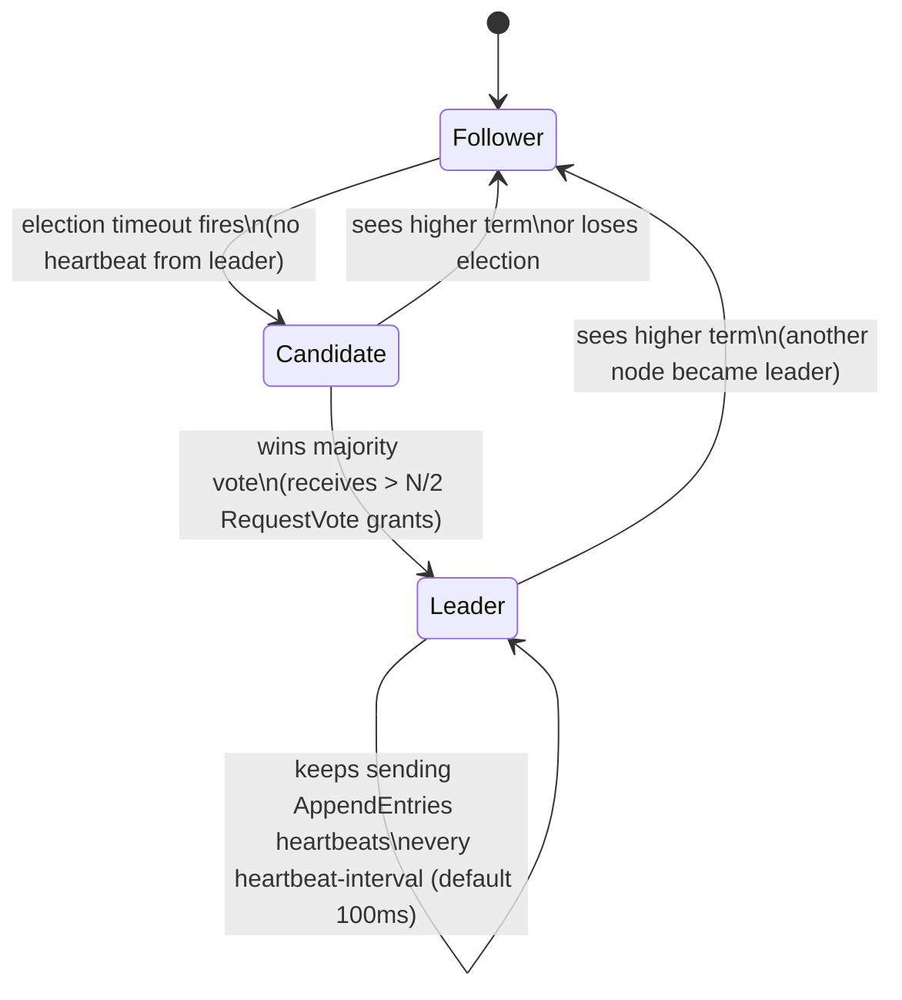
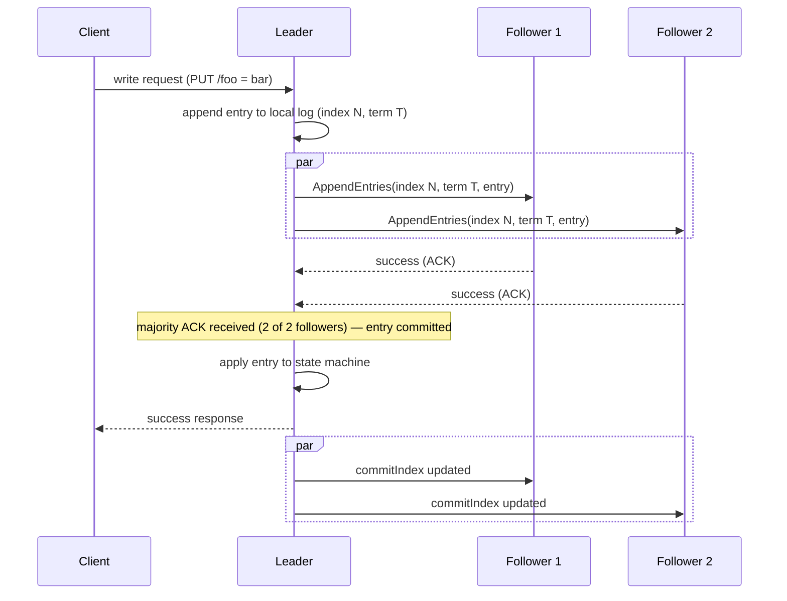
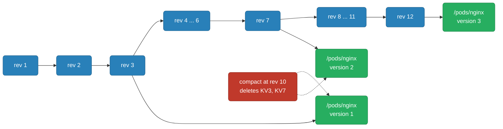
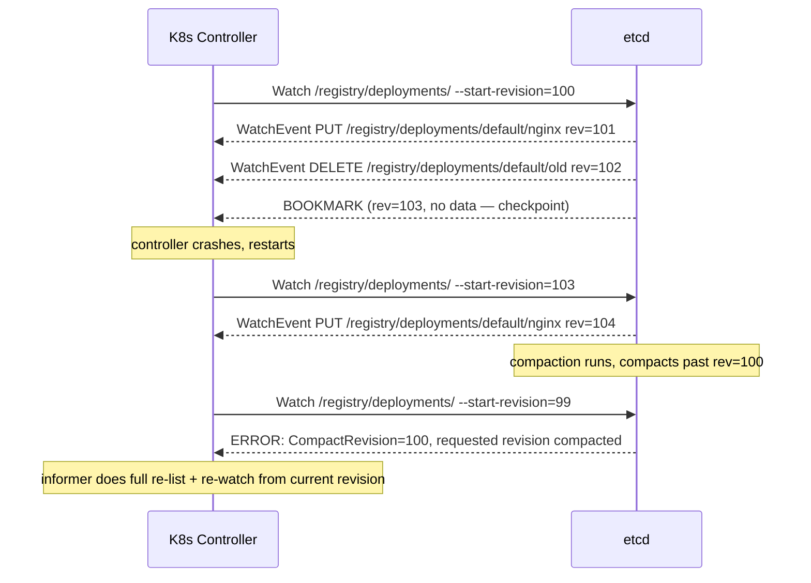
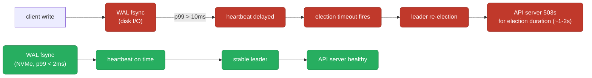

# etcd Internals

How etcd stores data, reaches consensus across a cluster, and serves as the source of truth for Kubernetes — the Raft log replication that keeps members consistent, the MVCC model that gives every key a revision history, the watch API that powers K8s controllers without polling, and the compaction and defrag operations that keep the database from growing unbounded.

<div class="quiz-progress" data-quiz-progress>
  <span class="quiz-progress-label">0/0 checks</span>
  <span class="quiz-progress-bar"><span class="quiz-progress-fill"></span></span>
</div>

<div class="prereq-chips">
  <span class="prereq-label">Prerequisites</span>
  <a href="/topic/databases/replication" class="prereq-chip">Distributed Replication</a>
  <a href="/topic/databases/redis-internals" class="prereq-chip">Redis Internals</a>
</div>

---

## What etcd Is

etcd is a strongly consistent, distributed key-value store built for configuration data and coordination — not for large blobs or high-throughput writes. Every key is a string (UTF-8), every value is arbitrary bytes, and every write increments a global revision counter. Reads are linearizable by default: you never see stale data from an old leader.

In CAP terms etcd is **CP** — it chooses consistency over availability. If a network partition isolates a minority of nodes, those nodes stop serving reads and writes rather than risk returning stale or divergent data. The majority partition continues normally; the minority waits.

**Kubernetes uses etcd as its only persistent store.** Every API object — pods, deployments, services, ConfigMaps, secrets — lives as a value under `/registry/<resource>/<namespace>/<name>`. Every `kubectl apply` is an etcd write; every controller's informer is an etcd watch. The API server is essentially a proxy between HTTP/REST and etcd's gRPC API, with admission, auth, and resource versioning on top.

**Why etcd over ZooKeeper?** Kubernetes chose etcd because its HTTP+gRPC API is simpler to operate and deploy, its Raft consensus is easier to reason about than ZooKeeper's ZAB protocol, and it ships as a single static binary with no JVM dependency. etcd v3 also offers a much richer watch API than ZooKeeper's one-shot watches.

```bash
# The etcd data model: flat key-value with prefix queries
etcdctl put /config/db/host postgres-primary
etcdctl put /config/db/port 5432
etcdctl get /config/db/ --prefix       # all keys under /config/db/
# KEY                    VALUE
# /config/db/host        postgres-primary
# /config/db/port        5432
```

<div class="quiz-card">
  <p class="quiz-q">etcd is a CP system. A 5-node cluster loses network connectivity to 2 of its nodes. Do those 2 isolated nodes keep serving reads?</p>
  <button class="quiz-reveal">Reveal answer</button>
  <div class="quiz-a" hidden>No. The 2 isolated nodes form a minority partition and cannot confirm they are still seeing the latest committed data — the leader could be on the other side. A CP system stops serving rather than risk returning stale reads. The 3-node majority partition retains quorum and continues normally; the minority nodes wait and refuse client requests until connectivity is restored.</div>
</div>

---

## Raft Consensus

etcd uses Raft to keep all members consistent. Raft assigns every node one of three roles and advances through terms — a monotonically increasing election epoch.



**Log replication — how a write commits:**



A write is **committed** once the leader receives ACKs from a majority (including itself). Committed means durable: even if the leader crashes immediately after, a new leader elected from the majority will have the entry and will apply it.

**Quorum math:** a cluster of N nodes tolerates floor((N-1)/2) simultaneous failures.

| Cluster size | Failures tolerated | Quorum needed |
|---|---|---|
| 1 | 0 | 1 |
| 3 | 1 | 2 |
| 5 | 2 | 3 |
| 7 | 3 | 4 |

**Why odd numbers?** A 6-node cluster tolerates 2 failures (quorum = 4) — the same as a 5-node cluster. The extra node adds cost without adding fault tolerance. Always deploy 3, 5, or 7 nodes; even sizes are wasteful.

<div class="quiz-card">
  <p class="quiz-q">A 5-node etcd cluster loses 3 nodes simultaneously. Can it still accept writes?</p>
  <button class="quiz-reveal">Reveal answer</button>
  <div class="quiz-a" hidden>No. With 3 nodes gone only 2 remain, and quorum for a 5-node cluster is 3 (majority). The 2 surviving nodes cannot form a majority — they stop accepting writes and reads until enough nodes rejoin. This is the CP tradeoff: the cluster refuses to risk split-brain by letting a minority partition pretend to be the authoritative leader.</div>
</div>

---

## MVCC Storage Model

etcd uses **multi-version concurrency control**: every write creates a new version of the key at a new global revision rather than overwriting in place. Old versions are kept until explicitly compacted away.

**Three revision fields on every key:**

| Field | Meaning |
|---|---|
| `createRevision` | Global revision when this key was first created |
| `modRevision` | Global revision of the last write to this key |
| `version` | Number of writes to this key since creation (resets on delete+recreate) |

```bash
etcdctl put /pods/nginx "spec: ..."     # global revision advances to 3
etcdctl put /pods/nginx "spec: ..."     # global revision advances to 7
etcdctl put /pods/nginx "spec: ..."     # global revision advances to 12

etcdctl get /pods/nginx -w json | jq '.kvs[0] | {createRevision, modRevision, version}'
# { "createRevision": 3, "modRevision": 12, "version": 3 }
```



**Kubernetes uses `resourceVersion` for optimistic locking.** The resourceVersion field on every K8s object is etcd's `modRevision` for that key. A `kubectl apply` includes the resourceVersion it read; the API server issues a conditional write (`--prev-kv`) to etcd. If another write landed in between, the revisions don't match — etcd rejects the write and the client must re-read and retry.

```bash
# Query at a historical revision (before compaction)
etcdctl get /pods/nginx --rev=7   # returns the version as of revision 7

# Prefix query — all pods in the default namespace
etcdctl get /registry/pods/default/ --prefix
```

<div class="quiz-card">
  <p class="quiz-q">A kubectl apply sets a Deployment's resourceVersion to 42. Concurrently, another kubectl apply for the same Deployment read it at resourceVersion=41. What happens when the second apply reaches the API server?</p>
  <button class="quiz-reveal">Reveal answer</button>
  <div class="quiz-a" hidden>The API server rejects it with a 409 Conflict. It issues a conditional write to etcd (compare-and-swap on the current revision), and because the current revision is now 42, not 41, the condition fails. The client receives the conflict error and must re-read the object at its current version, merge its changes, and retry with the updated resourceVersion. This is optimistic locking — no locks held during the read, conflict detected at write time.</div>
</div>

---

## The Watch API

The watch API is what makes Kubernetes controllers efficient. Instead of polling etcd every second for changes, every controller opens a long-lived streaming gRPC watch on a key prefix. etcd pushes each committed WatchEvent (PUT or DELETE) to all matching watchers in revision order, in real time.



**Watch bookmarks** are periodic no-data events the server sends with just a revision number. The client records this as its "safe resume point" — on reconnect it can start the watch from the bookmark revision and know it missed nothing.

**What happens on a compact error:** if a client reconnects with a `--start-revision` that has been compacted away, etcd returns `GRPC code 11 (OUT_OF_RANGE)` with the `CompactRevision` field set. Kubernetes' informer framework handles this automatically: it does a full List of all objects at the current revision, resyncs the local cache, then opens a fresh watch from that new revision. Controllers see a synthetic "Added" event for everything — this is a normal informer resync, not an error state.

<div class="quiz-card">
  <p class="quiz-q">A K8s controller crashes and restarts 2 hours later. Its last-seen resourceVersion was 5000, but etcd's periodic compaction has already moved past revision 5000. What does the informer framework do?</p>
  <button class="quiz-reveal">Reveal answer</button>
  <div class="quiz-a" hidden>The informer receives a compact error when it tries to resume the watch at revision 5000. It responds by doing a full List of all objects in the watched resource type (at the current revision), rebuilds its local cache, then opens a fresh watch starting from that current revision. Controllers receive synthetic "Added" events for all existing objects so they can reconcile from a clean state. This is expected behavior and happens routinely — the informer's List+Watch pattern is designed specifically to handle compaction gaps.</div>
</div>

---

## Compaction & Defrag

Without intervention, etcd's database grows forever — every write adds a new MVCC version, and old versions never disappear on their own. Compaction and defrag are the two-step cleanup.

**Compaction** marks old revisions as deleted inside bbolt's B-tree. It does not shrink the file on disk — it just frees pages internally for reuse by future writes.

**Defrag** rewrites the bbolt file from scratch, releasing freed pages back to the OS. The file shrinks. Defrag briefly blocks all writes on that member (typically 1–10 seconds) — always run on one member at a time.

**Auto-compaction modes:**

<div class="tab-group">
  <div class="tab-buttons">
    <button data-tab="periodic" class="active">periodic (default)</button>
    <button data-tab="revision">revision</button>
  </div>
  <div class="tab-panels">
    <div class="tab-panel active" data-tab-panel="periodic">
      <code>--auto-compaction-mode=periodic --auto-compaction-retention=1h</code><br>
      Compacts every hour, keeping only the last 1 hour of revision history. Good default for most clusters. History older than the retention window is gone — <code>--rev</code> queries that far back will fail.
    </div>
    <div class="tab-panel" data-tab-panel="revision">
      <code>--auto-compaction-mode=revision --auto-compaction-retention=1000</code><br>
      Keeps only the last 1000 revisions regardless of time. More predictable DB size for clusters with variable write rates, but history may be very short on busy clusters.
    </div>
  </div>
</div>

**DB quota alarm recovery — step by step:**

<div class="stepper">
  <div class="stepper-panels">
    <div class="stepper-panel active">
      <strong>1. Quota exceeded.</strong> etcd writes return <code>mvcc: database space exceeded</code>. The API server starts 503ing. <code>etcdctl alarm list</code> shows <code>NOSPACE</code>. No writes can land until you clear it.
    </div>
    <div class="stepper-panel">
      <strong>2. Compact old revisions.</strong> Get the current revision and compact everything before it: <code>REV=$(etcdctl endpoint status --write-out=json | jq '.[0].Status.header.revision') &amp;&amp; etcdctl compact $REV</code>. This frees pages inside bbolt but the file is still large.
    </div>
    <div class="stepper-panel">
      <strong>3. Defrag each member.</strong> Run <code>etcdctl defrag --endpoints=&lt;member&gt;</code> on each member one at a time. Each call blocks writes on that member for a few seconds while the file is rewritten. The file on disk shrinks.
    </div>
    <div class="stepper-panel">
      <strong>4. Disarm the alarm.</strong> <code>etcdctl alarm disarm</code> clears the NOSPACE alarm. Writes resume. Verify with <code>etcdctl endpoint status</code> that DB size is below quota.
    </div>
  </div>
  <div class="stepper-controls">
    <button class="stepper-prev">← Prev</button>
    <span class="stepper-dots"></span>
    <span class="stepper-label"></span>
    <button class="stepper-next">Next →</button>
  </div>
</div>

Default quota is **2GB** (`--quota-backend-bytes`). Hard maximum is **8GB**. Alert at 80% so you have time to compact before hitting the wall.

<div class="quiz-card">
  <p class="quiz-q">etcdctl compact removes all key versions before a given revision. Does the etcd data file on disk shrink immediately after compaction?</p>
  <button class="quiz-reveal">Reveal answer</button>
  <div class="quiz-a" hidden>No. Compaction marks pages as free inside bbolt's B-tree — those pages are available for future writes to reuse, but the file itself stays the same size on disk. Only defrag (etcdctl defrag) actually rewrites the file and releases those freed pages back to the OS, making the file smaller. The two-step sequence is always: compact first, then defrag.</div>
</div>

---

## Clustering & Membership

**Static bootstrapping:** all members are listed upfront in `--initial-cluster`. Every member must come online before the cluster elects a leader and starts accepting writes. Safe and simple; requires knowing IPs in advance.

**Dynamic membership:** add a member to a running cluster with `etcdctl member add`, then start the new etcd process. It contacts existing members, downloads a snapshot, and catches up. The cluster is slightly more vulnerable during sync — plan accordingly.

**Learner nodes** (`--learner` flag on `etcdctl member add`): non-voting members that receive all log entries but never vote in elections and cannot become leaders. They don't affect quorum math. Use them to safely add capacity or pre-sync a new member before promoting it to a full voting member — reduces the window where a slow sync could drop the cluster below quorum.

```bash
etcdctl member list
# ID                  STATUS    NAME     PEER ADDRS                   CLIENT ADDRS
# 8e9e05c52164694d    started   etcd-1   https://10.0.0.1:2380        https://10.0.0.1:2379
# 91bc3c398fb3c146    started   etcd-2   https://10.0.0.2:2380        https://10.0.0.2:2379
# fd422379fda50e48    started   etcd-3   https://10.0.0.3:2380        https://10.0.0.3:2379

# Add a learner first, then promote
etcdctl member add etcd-4 --peer-urls=https://10.0.0.4:2380 --learner
# Once synced:
etcdctl member promote <member-id>
```

**Stacked vs. external topology:**

<div class="tab-group">
  <div class="tab-buttons">
    <button data-tab="stacked" class="active">Stacked</button>
    <button data-tab="external">External</button>
    <button data-tab="learner">Learner pattern</button>
  </div>
  <div class="tab-panels">
    <div class="tab-panel active" data-tab-panel="stacked">
      etcd runs as a static pod on each control-plane node (kubeadm default). Simpler — one machine to manage per control-plane member. Downside: losing a control-plane node loses both an API server and an etcd member simultaneously, which can eat into your fault tolerance faster than expected. See <a href="/topic/kubernetes/kubeadm-bootstrap">kubeadm bootstrap</a> for the stacked HA topology in detail.
    </div>
    <div class="tab-panel" data-tab-panel="external">
      Dedicated etcd cluster separate from control-plane nodes. Failure domains are decoupled — an API server crash doesn't touch etcd quorum, and an etcd member crash doesn't take an API server with it. More machines and more ops overhead, but the right call for large or critical clusters.
    </div>
    <div class="tab-panel" data-tab-panel="learner">
      Add the new node as a learner, let it fully sync the snapshot (can take minutes on a large cluster), then promote to a voting member. The window where quorum is at risk from a slow-syncing new member is eliminated. Particularly important when scaling from 3 to 5 members on a busy cluster.
    </div>
  </div>
</div>

<div class="quiz-card">
  <p class="quiz-q">You add a 4th member to a running 3-node etcd cluster. The new member spends 5 minutes downloading a snapshot and catching up. During that sync, what is the cluster's effective quorum?</p>
  <button class="quiz-reveal">Reveal answer</button>
  <div class="quiz-a" hidden>The cluster now has 4 voting members, so quorum is 3. During the sync the new member is present but not caught up — if one of the original 3 nodes also fails during this window, only 2 of 4 members are reachable and the cluster loses quorum. This is why learner nodes exist: add as a learner (non-voting, doesn't change quorum math) until synced, then promote. The 3-node quorum (2) is maintained throughout.</div>
</div>

---

## Operations Reference

```bash
# Health check — all members
etcdctl endpoint health \
  --endpoints=https://10.0.0.1:2379,https://10.0.0.2:2379,https://10.0.0.3:2379

# Status — leader, revision, DB size per member
etcdctl endpoint status \
  --endpoints=https://10.0.0.1:2379,https://10.0.0.2:2379,https://10.0.0.3:2379 \
  --write-out=table

# Read a key (K8s values are protobuf — pipe through etcdhelper or just check existence)
etcdctl get /registry/pods/default/nginx

# List all K8s resource keys (keys only — values are protobuf, not human-readable)
etcdctl get /registry/ --prefix --keys-only

# Watch a prefix live (useful for debugging controller behavior)
etcdctl watch /registry/pods/ --prefix

# Snapshot — run on the leader, include TLS flags for kubeadm clusters
ETCDCTL_API=3 etcdctl snapshot save /backup/etcd-$(date +%F).db \
  --endpoints=https://127.0.0.1:2379 \
  --cacert=/etc/kubernetes/pki/etcd/ca.crt \
  --cert=/etc/kubernetes/pki/etcd/healthcheck-client.crt \
  --key=/etc/kubernetes/pki/etcd/healthcheck-client.key

# Verify snapshot integrity
etcdctl snapshot status /backup/etcd-$(date +%F).db --write-out=table

# Compact + defrag + disarm (quota alarm recovery)
REV=$(etcdctl endpoint status --write-out=json \
  | jq '.[0].Status.header.revision')
etcdctl compact $REV
etcdctl defrag --endpoints=https://10.0.0.1:2379   # one member at a time
etcdctl defrag --endpoints=https://10.0.0.2:2379
etcdctl defrag --endpoints=https://10.0.0.3:2379
etcdctl alarm disarm
```

For the full snapshot restore procedure (stopping the API server, restoring on each member, restarting), see [Backup & Disaster Recovery → etcd backup](/topic/advanced/backup-dr).

---

## Performance & Tuning

**The #1 bottleneck is disk WAL fsync latency.** etcd fsync-commits the write-ahead log before acknowledging every write to the client. If the disk is slow, every write takes longer, heartbeat responses slow down, election timeouts fire, and the cluster starts re-electing leaders — which manifests as API server 503s and `context deadline exceeded` errors in kubectl.



**Disk:** Use NVMe or SSD. Dedicate a separate disk to etcd data away from the OS and container logs. EBS `gp3` works; `io2` is better for large clusters. Network-attached volumes with variable latency cause intermittent leader elections.

**Heartbeat and election timeout:** `--heartbeat-interval` (default 100ms) and `--election-timeout` (default 1000ms = 10× heartbeat). The rule: election-timeout must be ≥ 10× heartbeat-interval AND ≥ 5× p99 round-trip latency between members. For cross-region clusters with 50ms RTT, set heartbeat to 500ms and election-timeout to 5000ms.

**Prometheus alerts:**

```promql
# WAL fsync p99 — alert > 10ms
histogram_quantile(0.99, rate(etcd_disk_wal_fsync_duration_seconds_bucket[5m])) > 0.01

# Backend commit p99 — alert > 250ms
histogram_quantile(0.99, rate(etcd_disk_backend_commit_duration_seconds_bucket[5m])) > 0.25

# DB size vs quota — alert > 80%
etcd_mvcc_db_total_size_in_bytes / etcd_server_quota_backend_bytes > 0.8

# Leader changes per hour — should be ~0; spikes indicate network or disk issues
rate(etcd_server_leader_changes_seen_total[1h]) > 1
```

<div class="quiz-card">
  <p class="quiz-q">etcd's p99 WAL fsync jumps from 2ms to 50ms after you move its data directory to a network-attached volume. Shortly after, the K8s API server starts returning 503s. What is the causal chain?</p>
  <button class="quiz-reveal">Reveal answer</button>
  <div class="quiz-a" hidden>The slow volume causes every etcd write to take 50ms+ to fsync the WAL. That delays the leader's ability to send timely AppendEntries heartbeats to followers. Followers that don't receive a heartbeat within election-timeout (default 1000ms) conclude the leader is dead and start an election. During a re-election (typically 1–2 seconds) etcd stops accepting writes. The API server — unable to write to etcd — returns 503s for that window. If fsync stays slow, this cycle repeats: slow disk → missed heartbeats → frequent re-elections → repeated API outages.</div>
</div>
