# Understanding Kafka, One Log at a Time — A Field Guide

Everything underneath the Kafka UI you've been clicking through — brokers, partitions, replication, consumer groups, offsets, and message formats — explained from first principles, with direct pointers back to the screens you've already seen.

> **Short version:** a partition is **under-replicated** when one or more of its copies have fallen behind or gone down — the data's still safe, but you've lost redundancy. A partition is **offline** when it has no live copy left to serve reads or writes at all — that's real unavailability. Read on for why that distinction exists in the first place.

This guide builds up from nothing. If a term shows up before it's been explained, it'll be explained at the point you need it, not before. See [kafka-internals.md](./kafka-internals.md) for the lower-level storage/replication mechanics (segments, indexes, ISR protocol) this guide sits on top of.

## Contents

1. [The core idea](#01-the-core-idea-kafka-is-a-log)
2. [Clusters & brokers](#02-clusters--brokers)
3. [Topics & partitions](#03-topics--partitions)
4. [Replication & ISR](#04-replication-leaders-replicas--isr)
5. [Producers](#05-producers-writing-data-in)
6. [Consumer groups](#06-consumers--consumer-groups)
7. [Offsets & lag](#07-offsets--lag)
8. [Retention](#08-retention-logs-dont-grow-forever)
9. [Schema Registry](#09-schema-registry--message-formats)
10. [Kafka Connect](#10-kafka-connect-moving-data-in-and-out)
11. [ACLs](#11-acls-whos-allowed-to-do-what)
12. [UI cheat sheet](#12-kafka-ui-decoded)
13. [Glossary](#13-glossary)

Every chapter ends with a **❓ knowledge check** — try to answer before revealing. Track how many you've cleared as you go:

<div class="quiz-progress" data-quiz-progress>
  <span class="quiz-progress-label">0/0 checks</span>
  <span class="quiz-progress-bar"><span class="quiz-progress-fill"></span></span>
</div>

---

## 01. The core idea: Kafka is a log

Every other concept in Kafka — partitions, replicas, offsets, consumer groups — is a consequence of this one idea.

Forget queues, forget databases. The right mental model for Kafka is a **notebook you can only write to at the end, and read from anywhere**. Every record you send gets appended after the last one. Nothing already written ever moves or changes. Each record gets a number — its position in the notebook — counting up from zero.

That's it. That's the whole primitive. A running count of numbered entries you can only append to. Kafka calls this an **append-only log**, and calls each entry's position number its **offset**.

```
the log:  [0][1][2][3][4][5][6][ ]  <- next write lands here (offset 7)
           already written ------>   nothing to the left ever changes
```

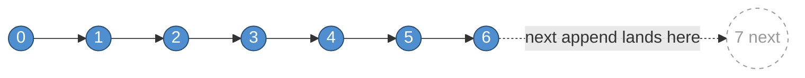

Why is this useful? Because "append-only, numbered, never mutated" gives you three things almost for free: multiple independent readers can each track their own position without stepping on each other; a reader that crashes can pick up exactly where it left off, by offset; and a slow reader never blocks a fast one, because reading doesn't remove anything.

> **Why it matters:** Every time you see an **offset** anywhere in the Kafka UI — in the message browser, in a consumer group's lag table, in the offset-reset dialog — it's a position in exactly this kind of log. Nothing more exotic than "which line number are we on."

<div class="quiz-card">
  <p class="quiz-q">Why can two independent consumers read the same log without stepping on each other?</p>
  <button class="quiz-reveal">Reveal answer</button>
  <div class="quiz-a" hidden>Reading never removes or changes anything — each consumer just tracks its own offset (position) independently. There's no shared read pointer to contend over.</div>
</div>

---

## 02. Clusters & brokers

A single log on a single machine wouldn't survive that machine dying. Kafka's answer is to run many machines together as one cluster.

**Broker** — One Kafka server process. It stores some of the data, answers reads and writes for the partitions it's responsible for, and talks to the other brokers to keep the cluster consistent. A "cluster" is just a group of brokers agreeing on the same state.

**Controller** — Exactly one broker in the cluster is elected to make cluster-wide decisions — which broker leads which partition, noticing when a broker disappears, approving new topics. Every other broker just does data work. If the controller dies, the remaining brokers elect a new one.

| Node ID | Host | Port | Role |
|---|---|---|---|
| 1 | kafka | 9092 | ● Controller |

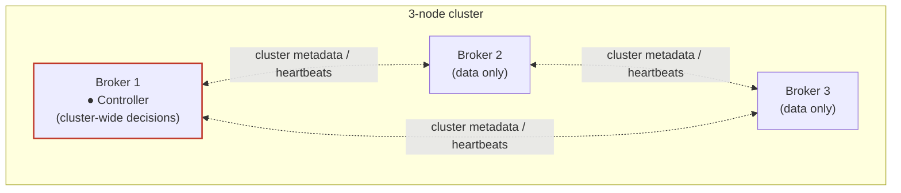

If Broker 1 dies, the remaining two elect a new controller among themselves — the role moves, the cluster doesn't stop.

One row, because a single-broker cluster's one broker has no choice but to be the controller too. A 3-node cluster shows three rows: three independent broker processes, with exactly one of them wearing the controller badge at any given time. Kill that one and, within a couple of seconds, a different node picks up the badge.

> **Why it matters:** A cluster in Kafka UI is just a name plus a list of brokers to connect to (`clusters.yml`). Everything else — topics, partitions, consumer groups — lives *inside* that cluster and is completely invisible from any other one. That's the whole basis for the app supporting several clusters side by side.

<div class="quiz-card">
  <p class="quiz-q">A 3-node cluster's controller broker crashes. What happens to the cluster?</p>
  <button class="quiz-reveal">Reveal answer</button>
  <div class="quiz-a" hidden>The remaining two brokers elect a new controller among themselves. The controller role moves to a different broker — the cluster itself doesn't stop serving data, since the other brokers were only ever doing data work, not depending on the old controller to stay up.</div>
</div>

---

## 03. Topics & partitions

One log per topic wouldn't scale past one broker. So a topic is actually several logs, glued together by name.

**Topic** — A named stream of related records. Producers write to a topic by name; consumers read from it by name. A topic is a category, not a single log.

**Partition** — The actual append-only log from Chapter 1. A topic is split into some number of these, numbered 0, 1, 2, .... Each one has its own independent sequence of offsets — offset 5 in partition 0 and offset 5 in partition 1 are two unrelated records.

Splitting a topic into partitions is what lets Kafka spread one topic's data and traffic across every broker in the cluster, and lets multiple consumers read the same topic in parallel — each taking a different slice. The tradeoff: Kafka only guarantees ordering *within* a single partition, never across the whole topic. If two records must be processed in order relative to each other, they need to land in the same partition — which is exactly what a message **key** is for (Chapter 5).

Partition count and replication factor are two completely separate dials — a topic can have 3 partitions and replication factor 1 (three independent logs, one copy each), or 3 partitions and replication factor 3 (three independent logs, each with three copies).

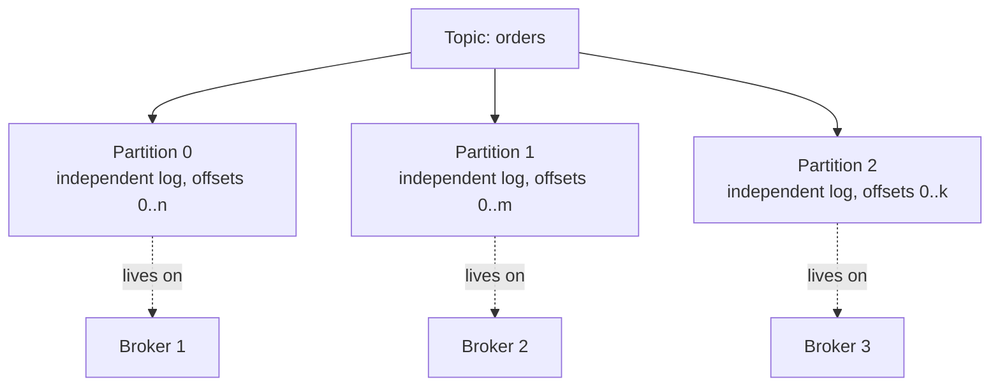

One topic, three unrelated logs spread across the cluster — ordering is guaranteed only inside each partition, never across them.

> **Why it matters:** The Topics page's Partitions column is partition count. The message browser's **Partition** filter lets you look at one log at a time instead of the interleaved view of all of them — useful because "all partitions merged" has no single meaningful order.

<div class="quiz-card">
  <p class="quiz-q">A topic has 3 partitions and replication factor 1. How many independent logs exist, and how many total copies of the data?</p>
  <button class="quiz-reveal">Reveal answer</button>
  <div class="quiz-a" hidden>3 independent logs (one per partition), 1 copy of each &mdash; so 3 total copies of data across the cluster, zero redundancy per partition. Partition count and replication factor are separate dials: partition count is about spreading load/parallelism, replication factor is about survivability.</div>
</div>

---

## 04. Replication: leaders, replicas & ISR

A partition with replication factor 3 isn't one log — it's the *same* log, copied onto 3 different brokers. That gives you survivability: any 2 of those 3 brokers can vanish and the data is still there on the third.

**Replicas** — The full set of brokers holding a copy of a given partition. A partition with replication factor 3 has exactly 3 replicas, always — that number doesn't change even if some of them are currently broken.

**Leader** — Of those replicas, exactly one is "the leader" at any moment — the only one that actually accepts reads and writes. The rest are followers: they just continuously copy the leader's log.

**ISR — in-sync replicas** — The subset of replicas (leader included) that are fully caught up with the leader right now. In the healthy, common case, ISR equals the full replica set. A follower drops out of ISR the moment it falls behind — a slow disk, a network blip, a crashed process — and rejoins automatically once it catches back up.

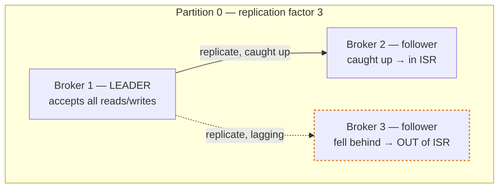

Now the two headline health metrics, precisely:

**Under-replicated partition** ⚠️ *degraded* — ISR is smaller than the full replica set — at least one copy has fallen behind or gone down. The leader is still up, still serving traffic, and no data is lost. But you're one more failure away from trouble, because you've got fewer working copies than you're supposed to.

**Offline partition** ✕ *unavailable* — There is no leader at all — every replica is down, or unreachable. This partition cannot serve a single read or write until at least one replica comes back. This is the number you actually page someone for.

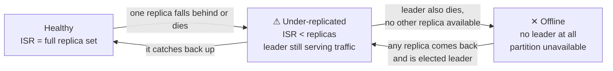

That's the abstract state machine. Here's what each state actually looks like from inside the cluster — flip through them:

<div class="toggle-switch">
  <div class="toggle-buttons">
    <button data-toggle-opt="healthy" class="active state-ok">Healthy</button>
    <button data-toggle-opt="under" class="state-warn">Under-replicated</button>
    <button data-toggle-opt="offline" class="state-bad">Offline</button>
  </div>
  <div class="toggle-panel active" data-toggle-panel="healthy">
    <strong>ISR = replicas.</strong> Every copy of the partition is caught up with the leader right now. Kafka UI shows this partition as healthy, no badges. Losing any one broker here just demotes the state to under-replicated &mdash; the leader keeps serving traffic while the remaining followers catch the new one up.
  </div>
  <div class="toggle-panel" data-toggle-panel="under">
    <strong>ISR &lt; replicas, leader still alive.</strong> At least one follower fell behind (slow disk, network blip, crashed process) or is straight-up down. Reads and writes are unaffected &mdash; the leader is fine. What you've lost is redundancy: one more failure and this partition can go offline. This is the state that should page someone during business hours, not at 3am.
  </div>
  <div class="toggle-panel" data-toggle-panel="offline">
    <strong>No leader at all.</strong> Every replica for this partition is down or unreachable. Zero reads, zero writes served for this partition until something comes back. If `min.insync.replicas` was set to more than 1, this is also the state a producer with `acks=all` starts seeing failed produce requests in.
  </div>
</div>

<div class="quiz-card">
  <p class="quiz-q">A partition is under-replicated but not offline. Is any data lost right now?</p>
  <button class="quiz-reveal">Reveal answer</button>
  <div class="quiz-a" hidden>No. The leader is still up and serving reads/writes with no data loss. Under-replicated only means you have fewer working copies than configured &mdash; less of a safety margin, not an actual outage. Data loss risk only materializes if the leader <em>also</em> fails before the missing replica(s) catch back up.</div>
</div>

Both metrics read `0` on a single-broker cluster for an unavoidable reason: with one broker, replication factor can only ever be 1 — there's nothing to lose sync with, and nowhere for the one copy to go offline *to* while the broker's up. You'd only ever see non-zero numbers there if the single broker itself were down, at which point the whole cluster would show as unreachable in the switcher anyway.

A 3-node cluster is where this becomes visible. With replication factor 3 and `min.insync.replicas` set to 2 — meaning a write is only acknowledged once 2 of the 3 replicas have it — stopping one of the three brokers pushes under-replicated partitions above zero for anything that broker held a replica of, while the cluster keeps serving traffic on the remaining two. Stop two at once and, depending on which two, you can push a partition to fully offline.

> **Why it matters:** On a topic detail page's **Partitions** tab, the same idea shows up per-partition: a red "ISR shrunk" badge appears exactly when that partition's `isr` list is shorter than its `replicas` list — the same comparison, just at the level of one partition instead of the whole cluster.

---

## 05. Producers: writing data in

Whatever calls the Produce dialog, an SDK, or a script — is "a producer."

A produced record has three parts: an optional **key**, a **value** (the payload), and optional **headers** (small metadata key/value pairs, separate from the payload). Only the value is required.

**Partitioning** — If you set a key, Kafka hashes it to consistently pick the same partition every time for that key — so "all events for user 42" always land in the same partition and stay in order relative to each other. Leave the key empty and Kafka spreads records round-robin across partitions instead, for maximum throughput with no ordering guarantee.

The Produce dialog's **Partition** selector maps directly onto this: leave it on `Auto` and Kafka decides using the rule above; pick an explicit number and you're overriding it, landing the record in that exact partition regardless of its key.

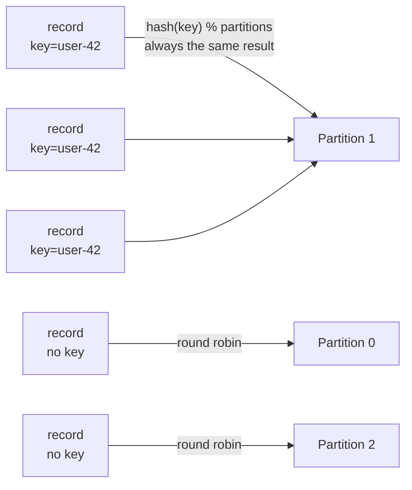

**Try it yourself** — a 6-partition topic, same rule as above. Type a key and hit Produce: the same key always lands in the same partition, every time. Leave the key blank and Produce spreads records round-robin instead. Or skip the rule entirely with the manual override, the same thing the Produce dialog's explicit-partition-number field does.

<div class="structure-viz" id="kafka-produce-demo">
  <svg class="viz-canvas" viewBox="0 0 840 200"></svg>
  <div class="viz-controls">
    <input class="viz-input" id="produce-key-input" type="text" placeholder="key (optional)" />
    <input class="viz-input" id="produce-value-input" type="text" placeholder="value (optional)" />
    <button class="viz-btn" data-viz-action="produce">Produce</button>
    <input class="viz-input" id="produce-manual-input" type="number" min="0" max="5" placeholder="partition #" />
    <button class="viz-btn" data-viz-action="manual">Produce to partition N</button>
    <button class="viz-btn viz-btn-danger" data-viz-action="reset">Reset</button>
  </div>
  <div class="viz-status"></div>
  <div class="viz-legend">
    <span><span class="viz-swatch" style="background:#1e3a8a"></span> partition, last 5 records</span>
    <span><span class="viz-swatch" style="background:#14532d"></span> just received this record</span>
  </div>
</div>

<script>
(function () {
  const svgNS = 'http://www.w3.org/2000/svg';
  const root = document.getElementById('kafka-produce-demo');
  const svg = root.querySelector('.viz-canvas');
  const keyInput = root.querySelector('#produce-key-input');
  const valueInput = root.querySelector('#produce-value-input');
  const manualInput = root.querySelector('#produce-manual-input');
  const status = root.querySelector('.viz-status');

  const NUM_PARTITIONS = 6;
  const BOX_W = 120, BOX_H = 150, GAP = 12, TOP = 30;
  const START_X = (840 - (NUM_PARTITIONS * BOX_W + (NUM_PARTITIONS - 1) * GAP)) / 2;

  let partitions, rrCounter, justHit, flashTimer;

  function reset() {
    partitions = Array.from({ length: NUM_PARTITIONS }, () => []);
    rrCounter = 0;
    justHit = null;
  }

  function hashStr(s) {
    let h = 2166136261;
    for (let i = 0; i < s.length; i++) { h ^= s.charCodeAt(i); h = Math.imul(h, 16777619); }
    return Math.abs(h);
  }

  function pushRecord(idx, record) {
    const list = partitions[idx];
    list.push(record);
    if (list.length > 5) list.shift();
  }

  function setStatus(msg, kind) {
    status.textContent = msg;
    status.className = 'viz-status' + (kind === 'ok' ? ' viz-status-ok' : kind === 'error' ? ' viz-status-error' : '');
  }

  function el(tag, attrs) {
    const e = document.createElementNS(svgNS, tag);
    for (const k in attrs) e.setAttribute(k, attrs[k]);
    return e;
  }

  function scheduleFlashClear() {
    clearTimeout(flashTimer);
    flashTimer = setTimeout(() => { justHit = null; draw(); }, 2200);
  }

  function boxX(i) { return START_X + i * (BOX_W + GAP); }

  function truncate(s, max) {
    return s.length > max ? s.slice(0, max - 1) + '…' : s;
  }

  function draw() {
    while (svg.firstChild) svg.removeChild(svg.firstChild);

    for (let i = 0; i < NUM_PARTITIONS; i++) {
      const x = boxX(i);
      const isHit = justHit === i;
      svg.appendChild(el('rect', {
        x, y: TOP, width: BOX_W, height: BOX_H, rx: 6,
        class: isHit ? 'viz-node-new' : 'viz-node',
      }));

      const header = el('text', { x: x + BOX_W / 2, y: TOP + 18 });
      header.textContent = `Partition ${i}`;
      svg.appendChild(header);

      const records = partitions[i];
      if (records.length === 0) {
        const t = el('text', { x: x + BOX_W / 2, y: TOP + BOX_H / 2 + 6, class: 'viz-label-dim' });
        t.textContent = '(empty)';
        svg.appendChild(t);
      } else {
        records.forEach((r, j) => {
          const label = r.key ? `${r.key}${r.value ? '=' + r.value : ''}` : '(no key)';
          const t = el('text', { x: x + BOX_W / 2, y: TOP + 40 + j * 18, class: 'viz-label-dim' });
          t.textContent = truncate(label, 16);
          svg.appendChild(t);
        });
      }
    }
  }

  function narrateAuto(key, partitionIdx) {
    if (key) {
      setStatus(`key '${key}' hashes to partition ${partitionIdx} — every record with this exact key always lands here, preserving per-key ordering.`, 'ok');
    } else {
      setStatus(`no key — round-robin assigned partition ${partitionIdx} (sticky-ish batching in a real cluster, simplified to plain round-robin here).`, 'ok');
    }
  }

  root.querySelector('[data-viz-action="produce"]').addEventListener('click', () => {
    const key = keyInput.value.trim();
    const value = valueInput.value.trim();
    let partitionIdx;
    if (key) {
      partitionIdx = hashStr(key) % NUM_PARTITIONS;
    } else {
      partitionIdx = rrCounter;
      rrCounter = (rrCounter + 1) % NUM_PARTITIONS;
    }
    pushRecord(partitionIdx, { key: key || null, value: value || null });
    justHit = partitionIdx;
    keyInput.value = '';
    valueInput.value = '';
    narrateAuto(key, partitionIdx);
    draw();
    scheduleFlashClear();
  });

  root.querySelector('[data-viz-action="manual"]').addEventListener('click', () => {
    const raw = manualInput.value.trim();
    if (raw === '') { setStatus('Enter a partition number (0-5) to override to first.', 'error'); return; }
    const target = Number(raw);
    if (!Number.isInteger(target) || target < 0 || target >= NUM_PARTITIONS) {
      setStatus(`Partition must be an integer between 0 and ${NUM_PARTITIONS - 1}.`, 'error');
      return;
    }
    const key = keyInput.value.trim();
    const value = valueInput.value.trim();
    pushRecord(target, { key: key || null, value: value || null, manual: true });
    justHit = target;
    keyInput.value = '';
    valueInput.value = '';
    setStatus(`manual override — landed in partition ${target} regardless of key.`, 'ok');
    draw();
    scheduleFlashClear();
  });

  root.querySelector('[data-viz-action="reset"]').addEventListener('click', () => {
    reset();
    setStatus('Reset. All partitions cleared, round-robin counter back to 0.', '');
    draw();
  });

  reset();
  setStatus('Type a key and hit Produce — same key always lands in the same partition. Leave the key blank for round-robin. Or force a partition with the override control.', '');
  draw();
})();
</script>

**acks / min.insync.replicas** — How sure a producer wants to be before considering a write "done." `acks=all` plus `min.insync.replicas=2` means: don't tell the producer it succeeded until at least 2 replicas have the record. This is the other half of the durability story — replication factor says how many copies *can* exist; `min.insync.replicas` says how many *must* confirm before a write counts.

<div class="tab-group">
  <div class="tab-buttons">
    <button data-tab="acks0" class="active">acks=0</button>
    <button data-tab="acks1">acks=1</button>
    <button data-tab="acksall">acks=all</button>
  </div>
  <div class="tab-panels">
    <div class="tab-panel active" data-tab-panel="acks0">
      <strong>Fire and forget.</strong> The producer doesn't wait for any confirmation at all &mdash; it sends and immediately considers the write done. Fastest possible throughput, but if the leader never actually got the record (network drop, leader down), the producer has no way to know. Data loss is possible with zero visibility that it happened.
    </div>
    <div class="tab-panel" data-tab-panel="acks1">
      <strong>Leader-confirmed.</strong> The producer waits for the leader to append the record to its own log, then gets an ack &mdash; before any follower has replicated it. If the leader crashes in that window, before followers catch up, the record can be lost even though the producer was told it succeeded.
    </div>
    <div class="tab-panel" data-tab-panel="acksall">
      <strong>All ISR replicas confirmed.</strong> The producer only gets its ack once every in-sync replica &mdash; not just the leader &mdash; has the record. Combined with <code>min.insync.replicas</code>, this is the zero-data-loss configuration: the tradeoff is waiting on the slowest ISR member instead of just the leader, so it's higher latency by design.
    </div>
  </div>
</div>

<div class="quiz-card">
  <p class="quiz-q">With acks=1, the leader crashes one second after acking a produce request, before any follower replicated it. Is the record safe?</p>
  <button class="quiz-reveal">Reveal answer</button>
  <div class="quiz-a" hidden>No. acks=1 only confirms the leader wrote it locally &mdash; not that any follower has it. If the leader dies before replicating, the record is gone even though the producer was already told the write succeeded. This is exactly the gap acks=all closes.</div>
</div>

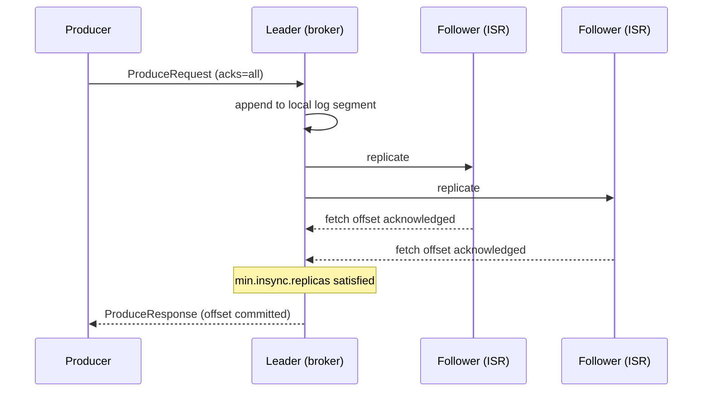

---

## 06. Consumers & consumer groups

Reading is where Kafka stops looking like a queue and starts looking like a shared, replayable log.

**Consumer** — Anything reading records from a topic. It reads a partition strictly in offset order, one record after another — it can't skip ahead except by deliberately jumping to a different offset.

**Consumer group** — A named team of consumers (identified by `group_id`, e.g. `checkout-service`) that divides up a topic's partitions between its members so each partition is read by exactly one member of the group at a time. One consumer, one group — the whole topic goes to it. Five consumers, one group, a five-partition topic — each gets one partition, and the group as a whole processes five times faster.

This is the mechanism that makes Kafka double as both a broadcast system and a work-queue. Two *different* groups reading the same topic each get their own full, independent copy of every record — that's the pub/sub side. Multiple consumers inside the *same* group split the work between them — that's the queue side. Same topic, same data, both patterns at once, just by choosing group membership.

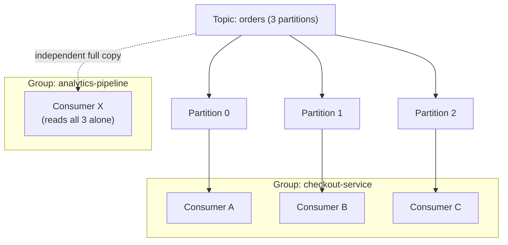

Same topic feeding two groups: `checkout-service` splits the work three ways (queue behavior), `analytics-pipeline` gets every record on its own (pub/sub behavior) — simultaneously, with no coordination between the groups.

**Rebalance** — Whenever a member joins or leaves a group, the group's partitions get reassigned among whoever's left. A group with zero members (its consumer process exited) shows `Empty`: nothing currently holds any partition, but the group's identity and its progress (committed offsets) both persist.

> **Why it matters:** The state badge on the Consumer Groups page is this exact lifecycle: `Stable` has settled members actively reading; `PreparingRebalance` / `CompletingRebalance` is mid-reshuffle; `Empty` has no members but keeps its recorded progress; `Dead` means the group's record has been cleaned up entirely.

### What actually happens during a rebalance

One specific broker acts as that group's **coordinator**. The instant membership changes — a new consumer connects, one disconnects, or one goes quiet past its session timeout — the coordinator kicks *every* member back into `PreparingRebalance` and waits for all of them to send a fresh `JoinGroup` request. Once everyone's checked in, one member (the "leader" for that round) runs the **partition assignor** — the algorithm deciding who gets which partitions — and every member picks up its new assignment via `SyncGroup`. The group only reads a `PreparingRebalance` heartbeat error as "rejoin," not as a failure.

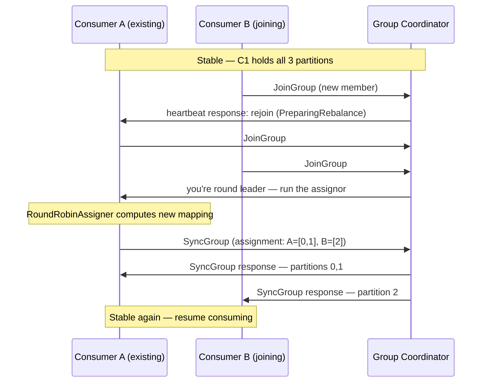

**Partition assignor** — The algorithm that decides the actual partition-to-member mapping each rebalance — `RoundRobinAssigner`, `StickyAssignor`, and `CooperativeStickyAssigner` are the common ones.

A concrete example: a group started with one consumer holding all three partitions of a topic. A second consumer joined — coordinator-triggered rebalance — and `RoundRobinAssigner` split it two-and-one. A third joined, another rebalance, now one partition each. Then, one at a time, the second and third disconnected, each departure triggering its own rebalance, until the first consumer was back to holding all three alone. Six membership changes, six rebalances, each one a real reshuffle of who reads what — not a metaphor.

Step through it:

<div class="stepper">
  <div class="stepper-panels">
    <div class="stepper-panel active">
      <strong>1. One consumer, one group.</strong> Consumer A holds all 3 partitions of the topic alone. No rebalance needed &mdash; there's nobody to share with.
    </div>
    <div class="stepper-panel">
      <strong>2. Consumer B joins.</strong> Coordinator-triggered rebalance #1. <code>RoundRobinAssigner</code> splits the assignment two-and-one: A keeps 2 partitions, B gets 1.
    </div>
    <div class="stepper-panel">
      <strong>3. Consumer C joins.</strong> Rebalance #2. Now three members, three partitions &mdash; one each. Maximum parallelism for this topic.
    </div>
    <div class="stepper-panel">
      <strong>4. Consumer B disconnects.</strong> Rebalance #3. Its partition gets reassigned to one of the two remaining members.
    </div>
    <div class="stepper-panel">
      <strong>5. Consumer C disconnects.</strong> Rebalance #4. Consumer A is back to holding all 3 partitions alone &mdash; same end state as step 1, but the group's coordinator has now handled four full reassignments to get here.
    </div>
  </div>
  <div class="stepper-controls">
    <button class="stepper-prev">← Prev</button>
    <span class="stepper-dots"></span>
    <span class="stepper-label"></span>
    <button class="stepper-next">Next →</button>
  </div>
</div>

<div class="quiz-card">
  <p class="quiz-q">Why does a consumer joining an existing group briefly interrupt every consumer in that group, not just the new one?</p>
  <button class="quiz-reveal">Reveal answer</button>
  <div class="quiz-a" hidden>Membership changes require recomputing the whole partition-to-member mapping from scratch &mdash; the coordinator can't know which partitions should move without first collecting a fresh JoinGroup from every current member. So it kicks everyone into PreparingRebalance, waits for all of them to check back in, then reassigns.</div>
</div>

> **Why it matters:** A "Rebalance activity" panel built from polling is *not* a complete event log — a rebalance that happens between two checks, with nobody watching, leaves no trace. There's also deliberately no "force a rebalance" button for a group with live members — Kafka's own client libraries have no safe way to kick a connected consumer. A "Force rejoin" action only works on a group that's already `Empty`: it clears the group so whoever reconnects next starts a fresh rebalance from zero, rather than reaching into a live one.

---

## 07. Offsets & lag

How a group remembers where it got to, and how far behind it is.

**Committed offset** — A consumer group periodically saves "the next offset I need to read" back to Kafka itself, per partition. That's the group's bookmark. Restart every consumer in the group tomorrow and it resumes exactly there — nothing is re-read, nothing is skipped.

**High watermark (end offset)** — The offset one past the newest record in a partition — "how far the log currently goes." The gap between it and the committed offset is the group's backlog.

**Lag** — `high_watermark − committed_offset`, per partition, summed across every partition for the group's total. Zero lag means fully caught up. Growing lag means the group is falling behind — either it's slow, or it's stopped.

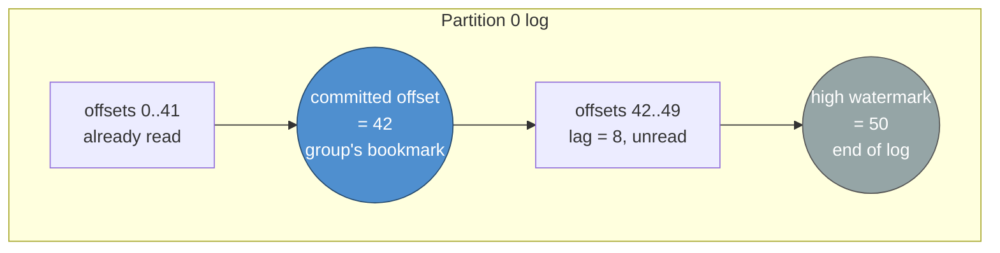

### Resetting offsets

Moving that bookmark on purpose — to reprocess history, or to skip a bad batch — is an offset reset. Four ways to do it:

<div class="toggle-switch">
  <div class="toggle-buttons">
    <button data-toggle-opt="earliest" class="active">Earliest</button>
    <button data-toggle-opt="latest">Latest</button>
    <button data-toggle-opt="specific">Specific offset</button>
    <button data-toggle-opt="timestamp">Timestamp</button>
  </div>
  <div class="toggle-panel active" data-toggle-panel="earliest">
    Bookmark goes to the very start of the log. The group will re-read everything still retained &mdash; use this to reprocess a topic's whole history from scratch.
  </div>
  <div class="toggle-panel" data-toggle-panel="latest">
    Bookmark jumps to the current end. Everything already written is skipped; only new records from now on will be seen &mdash; use this to deliberately drop a backlog you don't want processed.
  </div>
  <div class="toggle-panel" data-toggle-panel="specific">
    Jump to an exact numbered position you provide. Use this when you know precisely which offset a bad batch started at and want to skip just that.
  </div>
  <div class="toggle-panel" data-toggle-panel="timestamp">
    Kafka finds the offset of the first record written at or after a given time and jumps there &mdash; usually more useful than guessing a raw offset number, e.g. "replay everything since the deploy at 14:32."
  </div>
</div>

<div class="quiz-card">
  <p class="quiz-q">You try to reset a consumer group's offsets while its consumers are still running and actively reading. What happens?</p>
  <button class="quiz-reveal">Reveal answer</button>
  <div class="quiz-a" hidden>Kafka rejects the reset outright. A reset only works while the group has no active members &mdash; it has to be sure nobody's mid-read against the offsets that are about to move.</div>
</div>

The one hard rule: a reset only works while the group has **no active members**. Kafka has to be sure nobody's mid-read against the offsets you're about to move — so a group actively being read from a live process rejects the reset outright.

---

## 08. Retention: logs don't grow forever

An append-only log still needs a way to drop old data, or disks fill up.

**Time / size retention — `cleanup.policy=delete`** — The default. Kafka deletes whole segments of the oldest records once they're older than `retention.ms` (a week, by default) or the partition exceeds a size limit — whichever comes first. This is the right policy for event streams, logs, and metrics: old data genuinely stops mattering after a while.

**Compaction — `cleanup.policy=compact`** — Instead of deleting by age, Kafka keeps only the *latest* record for each key and throws away every earlier record with that same key. Perfect for "current state per entity" data — think a topic of user-profile updates, where you only ever care about someone's latest profile, not their whole edit history.

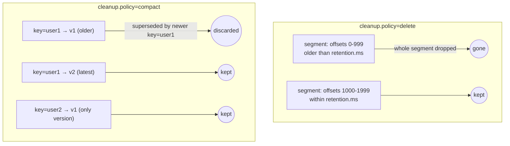

`cleanup.policy`, `retention.ms`, and friends are just topic configuration, editable per topic, with a badge distinguishing a value explicitly overridden from one still sitting at the broker's default.

<div class="toggle-switch">
  <div class="toggle-buttons">
    <button data-toggle-opt="delete" class="active">delete</button>
    <button data-toggle-opt="compact">compact</button>
  </div>
  <div class="toggle-panel active" data-toggle-panel="delete">
    Drops whole segments once every record in them is older than <code>retention.ms</code>, or the partition exceeds a size limit. Right for event streams, logs, metrics &mdash; anything where old data genuinely stops mattering. A segment is dropped as a unit; individual records inside it are never picked out.
  </div>
  <div class="toggle-panel" data-toggle-panel="compact">
    Keeps only the latest record per key, discards every earlier record with that same key, ignores age entirely. Right for "current state per entity" topics &mdash; a user-profile-updates topic where only the latest profile per user ID matters, not the edit history.
  </div>
</div>

<div class="quiz-card">
  <p class="quiz-q">A topic with cleanup.policy=compact has received 500 updates for key="user-42" over its lifetime. How many of those records does Kafka keep?</p>
  <button class="quiz-reveal">Reveal answer</button>
  <div class="quiz-a" hidden>One &mdash; the most recent write for that key. Compaction discards every earlier record sharing the same key, regardless of how old (or recent) it is; age plays no role, only "is there a newer record with this same key."</div>
</div>

---

## 09. Schema Registry & message formats

To Kafka, a record's value is just bytes. Schema Registry is how a team agrees on what those bytes mean.

Kafka itself never looks inside a message — a value is an opaque blob as far as the broker is concerned. That's flexible, but it means two services can drift apart on what format they expect without Kafka ever noticing. Schema Registry closes that gap: producers register a schema for a topic's data, and every message carries a small header pointing back to exactly which schema version encoded it.

**Wire format** — A registry-encoded message starts with a magic byte (`0x00`) followed by a 4-byte schema ID, then the actual encoded payload. That header is how a message browser knows to look the schema up and decode the rest rather than showing raw bytes.

**Avro / Protobuf / JSON Schema** — Three different serialization formats a schema can describe. All three get decoded the same way from a UI's perspective — a badge on a decoded message just names which one was used.

**Compatibility level** — A rule the registry enforces when a schema changes — e.g. `BACKWARD` means new schema versions must still be readable by code written against the old one. It's what stops a schema change from silently breaking every consumer that hasn't been redeployed yet.

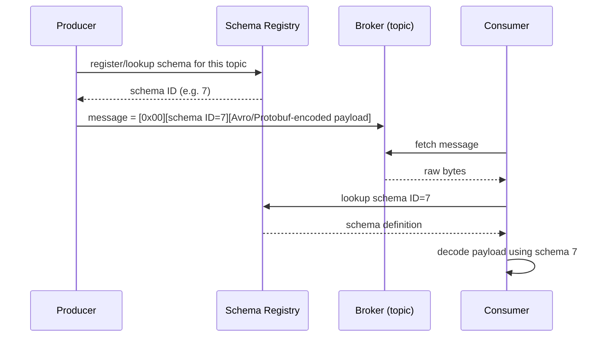

A topic with no registered schema simply shows its messages decoded as plain `json` or `utf8` text — that's a perfectly normal way to use Kafka; Schema Registry is opt-in, topic by topic.

> **Why it matters:** A cluster only gets a Schema Registry item in a Kafka UI's sidebar if one's configured for it in `clusters.yml`.

<div class="quiz-card">
  <p class="quiz-q">A message browser shows a topic's messages decoded as plain JSON text, with no schema badge. Does that mean something's misconfigured?</p>
  <button class="quiz-reveal">Reveal answer</button>
  <div class="quiz-a" hidden>No. Schema Registry is opt-in per topic. A topic with no registered schema is a perfectly normal way to use Kafka &mdash; its messages just get shown as plain json/utf8 text instead of being decoded against a schema.</div>
</div>

---

## 10. Kafka Connect: moving data in and out

Everything so far assumes something is producing and consuming records itself. Connect is for when the "something" is an off-the-shelf database, search index, or storage system instead.

**The plain version:** without Connect, if you want every new row written to a Postgres table to show up as a Kafka message, you'd write and run your own program to poll that table and produce to Kafka yourself — and another one to read a topic and write into Elasticsearch, or S3, or wherever it needs to end up. Connect replaces both of those hand-written programs with a JSON config: point a pre-built, tested integration ("connector") at a topic and a system, and it does the moving for you. Nothing conceptually new is happening — it's still just producing and consuming — Connect just means nobody on the team has to write that code themselves.

Kafka Connect is a separate service from the brokers — its own worker process, its own REST API (conventionally on port 8083), with no direct equivalent of a topic or partition.

<div class="tab-group">
  <div class="tab-buttons">
    <button data-tab="source" class="active">Source connector</button>
    <button data-tab="sink">Sink connector</button>
  </div>
  <div class="tab-panels">
    <div class="tab-panel active" data-tab-panel="source">
      <strong>Pulls data into Kafka</strong> from somewhere else. The canonical example is change-data-capture: watch a Postgres table row by row and produce a Kafka record for every insert/update/delete. Data flow: <code>external system → Kafka topic</code>.
    </div>
    <div class="tab-panel" data-tab-panel="sink">
      <strong>Pushes data out of Kafka</strong> into somewhere else &mdash; take everything landing on a topic and write it into Elasticsearch, S3, a data warehouse, or another Kafka cluster entirely. Data flow: <code>Kafka topic → external system</code>.
    </div>
  </div>
</div>

**Connector** — One configured instance of a connector class — a Java class implementing the source or sink logic — plus the JSON config telling it which topic(s), which external system, and what credentials to use.

**Task** — A connector splits its actual work into one or more tasks that run in parallel — typically one per partition, or one per table being watched. Each task has its own state and its own worker.

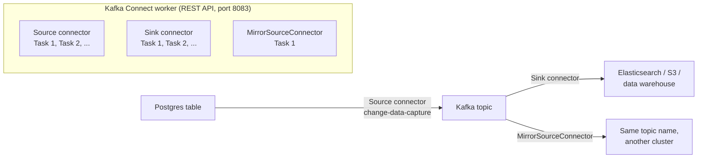

Because Connect is a wholly separate REST service, resetting a connector's state, checking whether it's healthy, or telling it to pause has nothing to do with the Kafka Admin API — the backend talks to it over plain HTTP, the same way it talks to a Schema Registry.

`MirrorSourceConnector` ships with Kafka itself and replicates topics from one cluster into another — pointed at two genuinely different clusters, this exact mechanism is what powers cross-cluster and disaster-recovery replication in real deployments.

> **Why it matters:** A state of `RUNNING` means healthy and actively moving data, `PAUSED` means deliberately stopped (resume to continue where it left off), `FAILED` means a task threw an exception — check the trace — and `UNASSIGNED` is transient, the few seconds right after creation before a worker picks the task up.

<div class="quiz-card">
  <p class="quiz-q">MirrorSourceConnector replicates a topic from cluster A to cluster B. Is that a source connector or a sink connector, from cluster B's point of view?</p>
  <button class="quiz-reveal">Reveal answer</button>
  <div class="quiz-a" hidden>Source &mdash; it's pulling data <em>into</em> Kafka (cluster B) from somewhere else (cluster A). The "somewhere else" being another Kafka cluster instead of a database doesn't change which side of the source/sink split it's on.</div>
</div>

---

## 11. ACLs: who's allowed to do what

Everything up to now has been about the data. This one is about the gate in front of it.

An **ACL** (access control list) entry is a single rule answering one narrow question: can this identity do this specific thing to this specific resource? Kafka doesn't have a general permissions model beyond this — every ACL is exactly one of these rules, and a cluster's full set of ACLs is just the list of every rule that's been added.

**Principal** — The identity the rule applies to, written as `User:alice` or similar. Where this name comes from depends on how the cluster authenticates connections (SASL username, mTLS certificate subject, etc.).

**Operation** — The specific action being allowed or denied — `READ`, `WRITE`, `CREATE`, `DELETE`, `DESCRIBE`, and a handful of others. Reading a topic and writing to it are different operations that need separate rules.

**Resource type, name & pattern** — What the rule applies to — a `TOPIC`, `GROUP`, `CLUSTER`, or `TRANSACTIONAL_ID` — by exact name (`LITERAL`) or by prefix (`PREFIXED`, e.g. every topic starting with `orders-`, useful for a team that owns a whole namespace of topics rather than one).

**Authorizer** — The broker-side plugin that actually enforces ACLs (e.g. `StandardAuthorizer` on a KRaft cluster). Without one configured, Kafka has no concept of "denied" at all — every authenticated principal can do everything, ACLs or not. Turning one on flips the default: nothing is allowed until an ACL explicitly grants it.

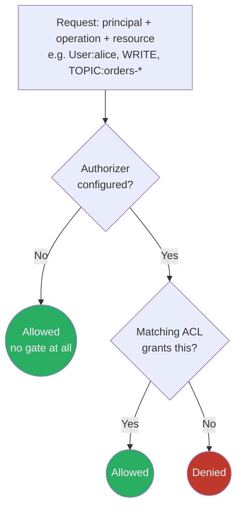

> **Why it matters:** "No ACL authorizer configured" isn't an error — it's an accurate description of a cluster with no gate at all, which is the default for a freshly stood-up Kafka cluster. In a real production setup where an authorizer *is* enabled, ACLs are how you'd let one service account produce to its own topics without also handing it access to everyone else's.

<div class="quiz-card">
  <p class="quiz-q">A cluster has an authorizer enabled but zero ACLs have been added yet. Can any authenticated principal read or write anything?</p>
  <button class="quiz-reveal">Reveal answer</button>
  <div class="quiz-a" hidden>No. Enabling an authorizer flips the default from "everything allowed" to "nothing allowed until an ACL explicitly grants it." Zero ACLs plus an authorizer means zero access for everyone &mdash; the opposite of having no authorizer at all.</div>
</div>

---

## 12. Kafka UI, decoded

Every stat on a typical Kafka UI's pages, translated back to the concept above it.

| You see | It means |
|---|---|
| Overview → Brokers | Count of **broker** processes in this cluster (Ch. 02) |
| Overview → Topics | Count of **topics** — named streams (Ch. 03) |
| Overview → Partitions | Total **partitions** across every topic (Ch. 03) |
| Overview → Consumer groups | Count of real **consumer groups** (Ch. 06) |
| Overview → Under-replicated | **ISR** smaller than replica count, somewhere in the cluster (Ch. 04) |
| Overview → Offline partitions | Partitions with no **leader** at all (Ch. 04) |
| Topics → Replication | **Replication factor** — how many copies of each partition (Ch. 04) |
| Topics → Health | Healthy = full **ISR**; Under-replicated = it isn't (Ch. 04) |
| Messages → Position | Where to start reading in the **log**, by **offset** (Ch. 01, 07) |
| Messages → decoded badge | Schema type from the message's wire-format header (Ch. 09) |
| Consumer Groups → State | Where the group sits in its **rebalance** lifecycle (Ch. 06) |
| Group detail → Assignor | Which **partition assignor** decided the current mapping (Ch. 06) |
| Group detail → Rebalance activity | State/member-count changes the app happened to observe — opportunistic, not a full log (Ch. 06) |
| Group detail → Force rejoin | Clears an **Empty** group so the next join starts a fresh rebalance (Ch. 06) |
| Consumer Groups → Total lag | Sum of **high watermark − committed offset** across partitions (Ch. 07) |
| Reset offsets dialog | Moves the group's **committed offset** — needs zero active members (Ch. 07) |
| Configs tab | **Retention** / **compaction** settings, per topic (Ch. 08) |
| Connect → State | Connector/task lifecycle — Running, Paused, Failed, Unassigned (Ch. 10) |
| Connect → Tasks | Parallel units of one connector's work, each with its own state (Ch. 10) |
| ACLs → "no authorizer configured" | No **authorizer** plugin enabled — every principal has full access (Ch. 11) |
| ACLs → Pattern | Literal (exact name) vs Prefixed (name-starts-with) resource matching (Ch. 11) |

---

## 13. Glossary

| Term | Definition |
|---|---|
| Broker | One Kafka server; a cluster is several of these. |
| Controller | The one broker currently making cluster-wide decisions. |
| Topic | A named stream of records. |
| Partition | One ordered, append-only log; a topic is split into several. |
| Offset | A record's position number within its partition. |
| Replica | One copy of a partition, held on one broker. |
| Leader | The one replica currently accepting reads/writes for a partition. |
| ISR | In-sync replicas — the subset fully caught up with the leader right now. |
| Under-replicated | ISR is smaller than the full replica set. |
| Offline partition | No live leader — the partition can't serve anything. |
| Producer | Anything writing records into a topic. |
| Consumer | Anything reading records from a topic, in offset order. |
| Consumer group | Named set of consumers sharing out a topic's partitions. |
| Rebalance | Reassigning partitions among a group's members after one joins/leaves. |
| Coordinator | The one broker managing a specific group's membership and rebalances. |
| Partition assignor | The algorithm deciding the partition-to-member mapping each rebalance. |
| Committed offset | A group's saved "read up to here" bookmark per partition. |
| High watermark | The offset just past the newest record — how far the log currently goes. |
| Lag | High watermark minus committed offset — how far behind a group is. |
| Retention | Rule for dropping old records by age or size. |
| Compaction | Retention variant: keep only the newest record per key. |
| Schema Registry | Service that tracks schemas so producers/consumers agree on message shape. |
| min.insync.replicas | How many replicas must confirm a write before it's acknowledged. |
| Kafka Connect | Separate service for running connectors that move data between Kafka and external systems. |
| Source connector | Pulls data into Kafka from an external system. |
| Sink connector | Pushes data from Kafka into an external system. |
| Task | One parallel unit of a connector's work, with its own state. |
| ACL | A single rule: can this principal do this operation on this resource. |
| Principal | The identity an ACL rule applies to, e.g. `User:alice`. |
| Authorizer | Broker-side plugin that enforces ACLs; with none, everything is allowed. |
