# Apache Kafka Internals

Storage internals, replication protocol, and the operational playbook for running Kafka for real — segments and indexes, the producer/consumer wire paths, ISR replication, compaction, exactly-once semantics, and the lag/rebalance debugging patterns you reach for during an incident. See [kafka-field-guide.md](./kafka-field-guide.md) for the concept-first tour this guide sits underneath.

Track how many of the knowledge checks below you've cleared as you go:

<div class="quiz-progress" data-quiz-progress>
  <span class="quiz-progress-label">0/0 checks</span>
  <span class="quiz-progress-bar"><span class="quiz-progress-fill"></span></span>
</div>

---

## Storage: Log Segments

Kafka stores each partition as an **append-only log** on disk, divided into segment files.

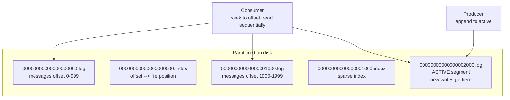

**Segment rolling:** When active segment reaches `log.segment.bytes` (default 1GB) or `log.roll.ms` (default 7 days), it's closed and a new one starts.

**The index file:** Sparse index mapping offsets to byte positions. Consumer seeks to an offset → binary search in index → seek to file position → read forward. O(log n) seek, then O(1) sequential read.

Step through what a seek to an arbitrary offset actually does:

<div class="stepper">
  <div class="stepper-panels">
    <div class="stepper-panel active">
      <strong>1. Consumer requests an offset.</strong> Say offset 1450 — somewhere the consumer hasn't necessarily read from before.
    </div>
    <div class="stepper-panel">
      <strong>2. Binary search the sparse index.</strong> The segment's <code>.index</code> file doesn't map every offset, just a sample. Binary search finds the closest indexed entry at or before 1450.
    </div>
    <div class="stepper-panel">
      <strong>3. Seek to that byte position.</strong> The index entry gives a file position for a nearby offset, not the exact one requested — just a good starting point in the <code>.log</code> file.
    </div>
    <div class="stepper-panel">
      <strong>4. Read forward sequentially.</strong> From that position, scan record by record until offset 1450 is reached. This step is cheap because it's sequential disk I/O, not another random seek.
    </div>
  </div>
  <div class="stepper-controls">
    <button class="stepper-prev">← Prev</button>
    <span class="stepper-dots"></span>
    <span class="stepper-label"></span>
    <button class="stepper-next">Next →</button>
  </div>
</div>

<div class="quiz-card">
  <p class="quiz-q">The index only maps a sample of offsets, not every one. Why is a seek still O(log n) instead of O(n)?</p>
  <button class="quiz-reveal">Reveal answer</button>
  <div class="quiz-a" hidden>Binary search over the sparse index gets you to a nearby byte position in O(log n), and the remaining gap is closed by reading forward sequentially from there — not by scanning the log from the beginning. Sequential disk I/O for that last stretch is cheap, which is what keeps the overall seek fast despite the index not having an entry for every offset.</div>
</div>

---

## Producer Write Path

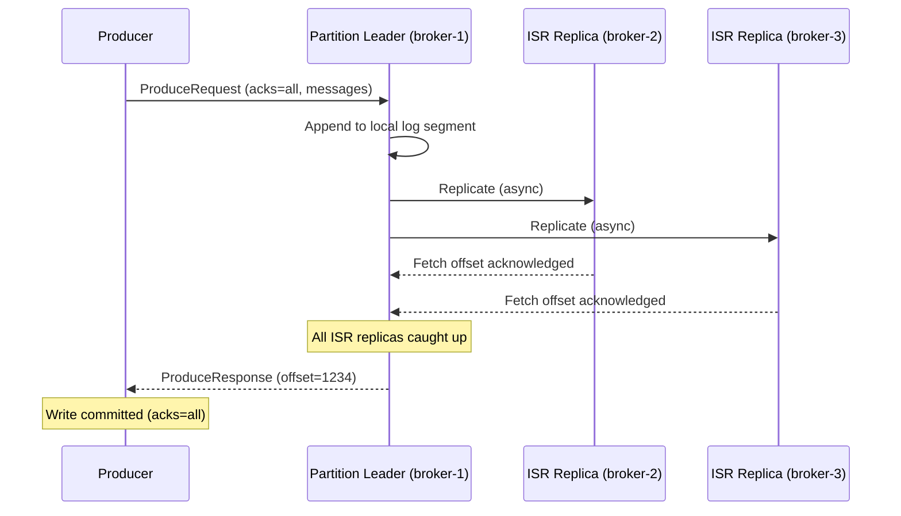

**acks settings:**

<div class="tab-group">
  <div class="tab-buttons">
    <button data-tab="acks0" class="active">acks=0</button>
    <button data-tab="acks1">acks=1</button>
    <button data-tab="acksall">acks=all</button>
  </div>
  <div class="tab-panels">
    <div class="tab-panel active" data-tab-panel="acks0">
      Fire and forget — no confirmation at all. Fastest option, but data loss is possible if the leader never got the message.
    </div>
    <div class="tab-panel" data-tab-panel="acks1">
      Leader confirmed only. If the leader crashes before replicating to any follower, replica lag means the message is lost even though the producer was already told it succeeded.
    </div>
    <div class="tab-panel" data-tab-panel="acksall">
      All ISR replicas confirmed before the producer gets its ack. Zero data loss — this is the mode shown in the sequence diagram above.
    </div>
  </div>
</div>

<div class="quiz-card">
  <p class="quiz-q">In the sequence diagram above, the leader replicates to ISR1 and ISR2 before sending ProduceResponse. With acks=all, could the producer still get its ack before both followers confirm?</p>
  <button class="quiz-reveal">Reveal answer</button>
  <div class="quiz-a" hidden>No — the diagram shows both "Fetch offset acknowledged" arrows from ISR1 and ISR2 happening before the leader sends ProduceResponse. With acks=all, the ack is withheld until every ISR replica has confirmed, not just the leader.</div>
</div>

---

## Consumer Groups and Offset Management

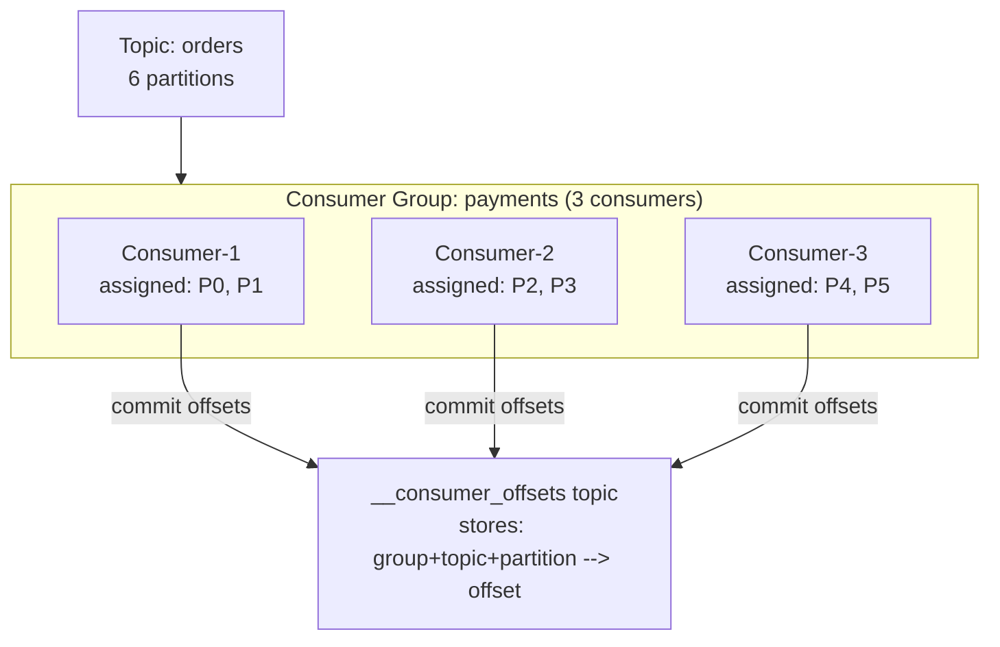

**Offset commit strategies:**
```java
// Auto commit (default, at-least-once risk)
props.put("enable.auto.commit", "true");
props.put("auto.commit.interval.ms", "5000");

// Manual commit after processing (at-least-once, safer)
consumer.poll(Duration.ofMillis(100));
// ... process records ...
consumer.commitSync();   // block until broker confirms

// Exactly-once: commit offset in same DB transaction as business logic
// (transactional outbox pattern)
```

<div class="toggle-switch">
  <div class="toggle-buttons">
    <button data-toggle-opt="auto" class="active state-warn">Auto commit</button>
    <button data-toggle-opt="manual" class="state-ok">Manual commit</button>
    <button data-toggle-opt="txn" class="state-ok">Exactly-once (outbox)</button>
  </div>
  <div class="toggle-panel active" data-toggle-panel="auto">
    Offset moves on a timer (<code>auto.commit.interval.ms</code>, default 5000ms) regardless of whether the records returned by the last <code>poll()</code> have actually finished processing. Default behavior, at-least-once risk.
  </div>
  <div class="toggle-panel" data-toggle-panel="manual">
    <code>commitSync()</code> is called explicitly after the processing loop finishes, tying the offset move to completed work instead of a timer. Still at-least-once, but safer than auto commit.
  </div>
  <div class="toggle-panel" data-toggle-panel="txn">
    The offset commit is written inside the same database transaction as the business-logic write — both succeed together or neither does.
  </div>
</div>

<div class="quiz-card">
  <p class="quiz-q">Looking at the code above: what's the difference between "auto commit" and "manual commit after processing," in terms of when the commit actually happens relative to processing the records?</p>
  <button class="quiz-reveal">Reveal answer</button>
  <div class="quiz-a" hidden>Auto commit fires on a timer (<code>auto.commit.interval.ms</code>) independent of whether the record has actually been processed yet. Manual commit calls <code>commitSync()</code> explicitly, after the processing loop — so the offset only moves once the work it represents is actually done.</div>
</div>

**Offset reset policy:**

<div class="toggle-switch">
  <div class="toggle-buttons">
    <button data-toggle-opt="earliest" class="active">earliest</button>
    <button data-toggle-opt="latest">latest</button>
  </div>
  <div class="toggle-panel active" data-toggle-panel="earliest">
    <code>auto.offset.reset=earliest</code> — if there's no committed offset yet for this group/partition, start reading from the very beginning of the log.
  </div>
  <div class="toggle-panel" data-toggle-panel="latest">
    <code>auto.offset.reset=latest</code> (default) — if there's no committed offset yet, start from the newest message onward. Everything already in the log is skipped.
  </div>
</div>

<div class="quiz-card">
  <p class="quiz-q">A consumer group has been running for months with a healthy committed offset. Does changing auto.offset.reset from latest to earliest change where it resumes on its next restart?</p>
  <button class="quiz-reveal">Reveal answer</button>
  <div class="quiz-a" hidden>No. auto.offset.reset only applies when there's no committed offset to resume from — a brand-new group, or one whose committed offset has been deleted/expired. A group with an existing committed offset always resumes from that bookmark, regardless of this setting.</div>
</div>

---

## Replication — ISR Deep Dive

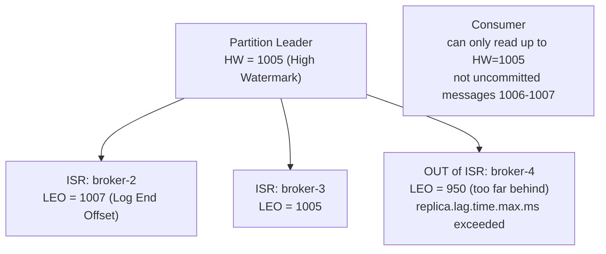

**High Watermark (HW):** The offset up to which ALL ISR replicas have the data. Consumers can only read up to HW. Messages above HW are uncommitted — might be lost if leader crashes.

**Leo (Log End Offset):** Latest offset written to the log, may be ahead of HW.

**ISR shrink/expand:**

<div class="toggle-switch">
  <div class="toggle-buttons">
    <button data-toggle-opt="in" class="active state-ok">In ISR</button>
    <button data-toggle-opt="out" class="state-warn">Out of ISR</button>
  </div>
  <div class="toggle-panel active" data-toggle-panel="in">
    Replica is fetching new data and keeping pace with the leader — like broker-2 and broker-3 above, whose LEOs are at or ahead of the HW.
  </div>
  <div class="toggle-panel" data-toggle-panel="out">
    Replica hasn't fetched new data within <code>replica.lag.time.max.ms</code> (default 30s) — too far behind, like broker-4 above (LEO 950 vs the leader's HW of 1005). It rejoins automatically once fully caught up. Alert if ISR size drops below <code>replication.factor</code> — that's lost redundancy.
  </div>
</div>

<div class="quiz-card">
  <p class="quiz-q">In the diagram above, why can consumers read up to offset 1005 (the HW) but not the messages the leader already wrote at 1006-1007?</p>
  <button class="quiz-reveal">Reveal answer</button>
  <div class="quiz-a" hidden>The High Watermark only advances once ALL ISR replicas have the data, not just the leader. Offsets past the HW are written to the leader's log (reflected in its LEO) but aren't yet confirmed by every ISR replica — they're uncommitted and could vanish if the leader crashes before the others catch up, so consumers aren't allowed to see them yet.</div>
</div>

### Try It Yourself: Live ISR Simulator

Same idea as the diagram above, but live: one partition, 1 leader + 2 followers. Produce records, stall a follower to simulate it falling behind, and watch exactly when it gets dropped from the ISR — and what `acks=all` is actually blocked on at each step, versus `acks=1`. Non-stalled followers catch up to the leader instantly here (a simplification of real async replication lag) — the part worth watching closely is what happens to a *stalled* one.

<div class="structure-viz" id="kafka-isr-viz">
  <svg class="viz-canvas" viewBox="0 0 620 230"></svg>
  <div class="viz-controls">
    <button class="viz-btn" data-viz-action="acks-1">acks=1</button>
    <button class="viz-btn" data-viz-action="acks-all">acks=all</button>
    <button class="viz-btn" data-viz-action="produce">Produce</button>
    <button class="viz-btn" data-viz-action="stall-f1">Stall F1</button>
    <button class="viz-btn" data-viz-action="stall-f2">Stall F2</button>
    <button class="viz-btn" data-viz-action="unstall-f1">Unstall F1</button>
    <button class="viz-btn" data-viz-action="unstall-f2">Unstall F2</button>
    <button class="viz-btn viz-btn-danger" data-viz-action="reset">Reset</button>
  </div>
  <div class="viz-status"></div>
  <div class="viz-legend">
    <span><span class="viz-swatch" style="background:#1e3a8a"></span> in ISR, caught up</span>
    <span><span class="viz-swatch" style="background:#78350f"></span> in ISR, stalled and lagging (under threshold)</span>
    <span><span class="viz-swatch" style="background:#7f1d1d"></span> dropped from ISR</span>
  </div>
</div>

<script>
(function () {
  const svgNS = 'http://www.w3.org/2000/svg';
  const root0 = document.getElementById('kafka-isr-viz');
  const svg = root0.querySelector('.viz-canvas');
  const status = root0.querySelector('.viz-status');
  const acks1Btn = root0.querySelector('[data-viz-action="acks-1"]');
  const acksAllBtn = root0.querySelector('[data-viz-action="acks-all"]');

  const LAG_THRESHOLD = 3;
  let leaderOffset, followers, isr, acksMode;

  function reset() {
    leaderOffset = 0;
    followers = [
      { id: 'F1', offset: 0, stalled: false },
      { id: 'F2', offset: 0, stalled: false },
    ];
    // ISR membership tracked for followers only -- the leader is always
    // implicitly in the ISR and can never be removed from it.
    isr = new Set(['F1', 'F2']);
    acksMode = 'all';
  }

  function getFollower(id) { return followers.find((f) => f.id === id); }
  function lagOf(f) { return leaderOffset - f.offset; }

  // Core algorithm: leaderOffset advances, every non-stalled follower
  // catches up instantly (a deliberate simplification of real async
  // replication lag, since the interesting behavior here is about
  // STALLED followers specifically), a fully-caught-up follower rejoins
  // the ISR, and a stalled follower whose lag exceeds LAG_THRESHOLD is
  // dropped from it.
  function produce() {
    leaderOffset++;
    for (const f of followers) {
      if (!f.stalled) f.offset = leaderOffset;
    }

    const events = [];
    for (const f of followers) {
      if (f.offset === leaderOffset && !isr.has(f.id)) {
        isr.add(f.id);
        events.push({ type: 'rejoin', id: f.id });
      }
    }
    for (const f of followers) {
      const lag = lagOf(f);
      if (f.stalled && lag > LAG_THRESHOLD && isr.has(f.id)) {
        isr.delete(f.id);
        events.push({ type: 'drop', id: f.id, lag });
      }
    }

    // What acks=all is waiting on is evaluated against the ISR as it
    // stands AFTER this produce's rejoin/drop adjustments -- a follower
    // dropped by this very call is, by definition, no longer "currently
    // in the ISR", so acks=all stops waiting on it starting with this
    // call's own result.
    let waitingOn = [];
    if (acksMode === 'all') {
      for (const id of isr) {
        const f = getFollower(id);
        if (f.offset !== leaderOffset) waitingOn.push(id);
      }
    }
    return { events, waitingOn, completed: acksMode === 'all' ? waitingOn.length === 0 : true };
  }

  function setStatus(msg, kind) {
    status.textContent = msg;
    status.className = 'viz-status' + (kind === 'ok' ? ' viz-status-ok' : kind === 'error' ? ' viz-status-error' : '');
  }

  function el(tag, attrs) {
    const e = document.createElementNS(svgNS, tag);
    for (const k in attrs) e.setAttribute(k, attrs[k]);
    return e;
  }

  function styleModeButtons() {
    [[acks1Btn, acksMode === '1'], [acksAllBtn, acksMode === 'all']].forEach(([btn, active]) => {
      if (active) {
        btn.style.background = '#1d4ed8';
        btn.style.color = '#fff';
        btn.style.borderColor = '#1d4ed8';
      } else {
        btn.style.background = '';
        btn.style.color = '';
        btn.style.borderColor = '';
      }
    });
  }

  function draw() {
    while (svg.firstChild) svg.removeChild(svg.firstChild);

    const leaderBox = { x: 220, y: 20, w: 180, h: 64 };
    const f1Box = { x: 30, y: 140, w: 250, h: 80 };
    const f2Box = { x: 340, y: 140, w: 250, h: 80 };
    const leaderCx = leaderBox.x + leaderBox.w / 2;
    const leaderBottom = leaderBox.y + leaderBox.h;

    // Replication edges: highlighted while in ISR, dim/dashed once dropped.
    [[f1Box, isr.has('F1')], [f2Box, isr.has('F2')]].forEach(([box, inIsr]) => {
      const cx = box.x + box.w / 2;
      svg.appendChild(el('line', {
        x1: leaderCx, y1: leaderBottom, x2: cx, y2: box.y,
        class: inIsr ? 'viz-edge-active' : 'viz-edge',
        'stroke-dasharray': inIsr ? '' : '5,4',
      }));
    });

    // Leader box.
    svg.appendChild(el('rect', { x: leaderBox.x, y: leaderBox.y, width: leaderBox.w, height: leaderBox.h, rx: 8, class: 'viz-node' }));
    const leaderLabel = el('text', { x: leaderCx, y: leaderBox.y + 20, class: 'viz-label-dim' });
    leaderLabel.textContent = 'Leader (always in ISR)';
    svg.appendChild(leaderLabel);
    const leaderText = el('text', { x: leaderCx, y: leaderBox.y + 44 });
    leaderText.textContent = `offset: ${leaderOffset}`;
    svg.appendChild(leaderText);

    // Follower boxes.
    [['F1', f1Box], ['F2', f2Box]].forEach(([id, box]) => {
      const f = getFollower(id);
      const inIsr = isr.has(id);
      const lag = lagOf(f);
      let cls = 'viz-node';
      if (!inIsr) cls = 'viz-node-removing';
      else if (f.stalled && lag > 0) cls = 'viz-node-highlight';
      const cx = box.x + box.w / 2;
      svg.appendChild(el('rect', { x: box.x, y: box.y, width: box.w, height: box.h, rx: 8, class: cls }));
      const idLabel = el('text', { x: cx, y: box.y + 18, class: 'viz-label-dim' });
      idLabel.textContent = `${id}${f.stalled ? ' (stalled)' : ''}`;
      svg.appendChild(idLabel);
      const offsetText = el('text', { x: cx, y: box.y + 40 });
      offsetText.textContent = `offset: ${f.offset}  (lag: ${lag})`;
      svg.appendChild(offsetText);
      const statusText = el('text', { x: cx, y: box.y + 62 });
      statusText.textContent = inIsr ? 'IN ISR' : 'OUT OF ISR';
      svg.appendChild(statusText);
    });
  }

  function narrateProduce(result) {
    const parts = [`Produce -> leader offset ${leaderOffset}.`];
    result.events.forEach((ev) => {
      if (ev.type === 'drop') {
        parts.push(`${ev.id} fell ${ev.lag} records behind -- dropped from ISR. acks=all no longer waits for it; replication factor effectively down to ${1 + isr.size}.`);
      } else if (ev.type === 'rejoin') {
        parts.push(`${ev.id} caught up -- rejoined ISR.`);
      }
    });
    if (acksMode === 'all') {
      if (result.waitingOn.length === 0) {
        parts.push(`acks=all: every replica currently in the ISR (leader${[...isr].map((id) => ' + ' + id).join('')}) has confirmed offset ${leaderOffset}. Producer ack sent.`);
      } else {
        parts.push(`acks=all: still waiting on ${result.waitingOn.join(', ')} (stalled, hasn't fetched offset ${leaderOffset} yet) -- producer ack is blocked until it catches up or gets dropped from the ISR.`);
      }
    } else {
      parts.push('acks=1: leader write alone is enough -- producer ack sent immediately, without waiting on either follower.');
    }
    setStatus(parts.join(' '), result.waitingOn.length > 0 ? 'error' : 'ok');
  }

  root0.querySelector('[data-viz-action="produce"]').addEventListener('click', () => {
    const result = produce();
    narrateProduce(result);
    draw();
  });

  root0.querySelector('[data-viz-action="stall-f1"]').addEventListener('click', () => {
    getFollower('F1').stalled = true;
    setStatus('F1 stalled -- it will stop catching up on subsequent produces and fall behind the leader.', '');
    draw();
  });

  root0.querySelector('[data-viz-action="stall-f2"]').addEventListener('click', () => {
    getFollower('F2').stalled = true;
    setStatus('F2 stalled -- it will stop catching up on subsequent produces and fall behind the leader.', '');
    draw();
  });

  root0.querySelector('[data-viz-action="unstall-f1"]').addEventListener('click', () => {
    getFollower('F1').stalled = false;
    setStatus('F1 unstalled -- it will resume catching up on the next Produce.', '');
    draw();
  });

  root0.querySelector('[data-viz-action="unstall-f2"]').addEventListener('click', () => {
    getFollower('F2').stalled = false;
    setStatus('F2 unstalled -- it will resume catching up on the next Produce.', '');
    draw();
  });

  acks1Btn.addEventListener('click', () => {
    acksMode = '1';
    styleModeButtons();
    setStatus('Mode set to acks=1 -- Produce now completes on the leader write alone.', '');
  });

  acksAllBtn.addEventListener('click', () => {
    acksMode = 'all';
    styleModeButtons();
    setStatus('Mode set to acks=all -- Produce now waits for every currently-in-ISR replica.', '');
  });

  root0.querySelector('[data-viz-action="reset"]').addEventListener('click', () => {
    reset();
    styleModeButtons();
    setStatus('Reset -- 1 leader + 2 followers, both in ISR, all offsets 0.', '');
    draw();
  });

  reset();
  styleModeButtons();
  setStatus('Loaded with acks=all. Try Produce a few times, then Stall F1 and keep producing to watch its lag grow past the threshold and drop it from the ISR.', '');
  draw();
})();
</script>

---

## Cluster Metadata and the Controller: KRaft (KIP-500)

Everything above this point — ISR membership, which broker leads which partition, who's allowed to do what — is a decision someone has to track cluster-wide, not per-partition. That someone is the **controller**: exactly one broker (pre-KRaft) or a small elected leader (KRaft) responsible for topic/partition metadata, leader assignment, broker liveness, and ACLs. If it goes away, the remaining nodes elect a new one and the cluster keeps serving data in the meantime. The interesting question this section answers: where does that metadata actually *live*, and what does "elect a new one" actually *mean* under the hood — because as of Kafka 3.x (production-ready) and 4.0 (default, ZooKeeper support removed entirely), the answer changed completely.

**Why ZooKeeper got removed.** For most of Kafka's life, none of that metadata lived inside Kafka at all — it lived in Apache ZooKeeper, a general-purpose coordination service Kafka delegated to. That meant every Kafka deployment was actually *two* distributed systems stacked on top of each other: the Kafka cluster you wanted, and a ZooKeeper ensemble underneath it whose sole job was being Kafka's filing cabinet for topics, partitions, ACLs, and controller election. ZooKeeper brought its own cluster to provision and patch, its own quorum-sizing rules, its own session-timeout tuning, and its own failure modes — a lost ZK quorum could stall Kafka's entire control plane (no new leader elections, no topic changes) even while every broker was up and healthy serving reads and writes. Running Kafka well meant a team had to also run ZooKeeper well, as a second, unrelated skill set. KIP-500 removed that second system.

**KRaft's approach.** Instead of delegating metadata to an outside system, Kafka now stores it the same way it stores everything else it's good at storing: as a log. Every metadata change — a topic created, a partition's leader changing, an ACL granted — is appended as a record to an internal topic, `__cluster_metadata`, and that topic is replicated using an actual Raft implementation among a small set of nodes running the **controller** role. Which physical nodes play that role is a config choice, not a fixed topology — the `process.roles` setting on each node is `broker`, `controller`, or both:

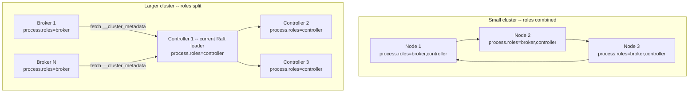

Small clusters typically combine both roles on the same handful of nodes (cheaper, fewer processes to run). Larger clusters split them — a dedicated 3- or 5-node controller quorum handling only metadata, separate from the brokers serving produce/consume traffic, so metadata load never competes with data load on the same process.

Leader election for that metadata quorum is no longer "ZooKeeper handles it as a black box" — it's genuine Raft: terms, log offsets, majority votes, the same mechanics already covered in [replication.md § 9, Consensus Algorithms](./replication.md#9-consensus-algorithms) (including a live leader-election demo). That's the identical algorithm, not a loose analogy — it's just electing a leader for the `__cluster_metadata` log instead of a general-purpose replicated log, so there's no need to re-derive term numbers or vote-counting here.

**What's operationally different for a cluster admin:**

- **One system to run and monitor, not two.** No separate ZooKeeper ensemble to size, patch, upgrade, and page on — controller state is just another Kafka log, observed with the same tooling as everything else in the cluster.
- **Faster controller failover.** ZooKeeper-based failover was bottlenecked by ZK session timeouts before a dead controller's session even expired and a new election could start. Raft's own election timeout drives failover directly instead — no second system's timeout sitting in the critical path.
- **Metadata durability rides on Kafka's own replication.** `__cluster_metadata` is replicated and made durable the same way any other Kafka log is, instead of depending on a separate consensus implementation (ZooKeeper's) with its own semantics and its own bugs to reason about.

<div class="quiz-card">
  <p class="quiz-q">Why is running a KRaft-based Kafka cluster operationally simpler than the old ZooKeeper-based one?</p>
  <button class="quiz-reveal">Reveal answer</button>
  <div class="quiz-a" hidden>Because it collapses two distributed systems into one. The ZooKeeper-based architecture meant running an entire second cluster — its own provisioning, patching, quorum sizing, and failure modes — just to store Kafka's metadata. KRaft stores that same metadata as a Kafka log (<code>__cluster_metadata</code>) replicated among controller nodes that are part of the Kafka cluster itself, so there's one system to run and monitor instead of two.</div>
</div>

<div class="quiz-card">
  <p class="quiz-q">Under the old architecture, ZooKeeper handled controller election as a black box. Under KRaft, did the election mechanism itself change, or did metadata just move to a new storage location with the same election logic underneath?</p>
  <button class="quiz-reveal">Reveal answer</button>
  <div class="quiz-a" hidden>The mechanism itself changed, not just the storage location. Controller election under KRaft is genuine Raft -- terms, log offsets, majority votes over the <code>__cluster_metadata</code> log -- the same algorithm covered in replication.md's Consensus Algorithms section, not a Kafka-specific black box ZooKeeper ran internally. Metadata moving into a Kafka-style log is one change; electing that log's leader with real Raft semantics is a separate, more fundamental one.</div>
</div>

---

## Log Compaction

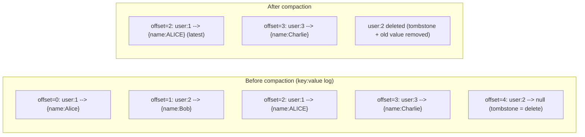

Log compaction retains the **latest value per key** — turns Kafka into a changelog/event store for materialized views. Used by Kafka Streams and ksqlDB.

```
log.cleanup.policy=compact          # enable compaction
log.cleanup.policy=compact,delete   # compact AND delete old segments
min.cleanable.dirty.ratio=0.5       # compact when 50% of log is dirty
```

Step through a compaction pass on the log shown above:

<div class="stepper">
  <div class="stepper-panels">
    <div class="stepper-panel active">
      <strong>1. Dirty ratio crosses the threshold.</strong> Once the proportion of the log that's "dirty" (superseded records) passes <code>min.cleanable.dirty.ratio</code> (0.5 above), the cleaner picks this log for a pass.
    </div>
    <div class="stepper-panel">
      <strong>2. Cleaner scans by key.</strong> For every key it keeps only the highest-offset record — offset=2 (user:1 → ALICE) beats offset=0 (user:1 → Alice).
    </div>
    <div class="stepper-panel">
      <strong>3. Tombstones resolve.</strong> A null value (offset=4, user:2 → null) marks a delete. The tombstone itself, plus every earlier record for that key, gets removed once the pass completes.
    </div>
    <div class="stepper-panel">
      <strong>4. Result.</strong> Only the latest live record per key survives — user:1's latest value and user:3 — with user:2 gone entirely.
    </div>
  </div>
  <div class="stepper-controls">
    <button class="stepper-prev">← Prev</button>
    <span class="stepper-dots"></span>
    <span class="stepper-label"></span>
    <button class="stepper-next">Next →</button>
  </div>
</div>

### Try It Yourself: Live Log Compaction

The stepper above narrates one fixed, scripted pass. This one is live: append your own keyed records (the same key can land at many offsets — that's the whole point), tombstone a key to mark it for deletion, then run Compact and watch only the highest offset per key survive.

<div class="structure-viz" id="kafka-compaction-viz">
  <svg class="viz-canvas" viewBox="0 0 640 130"></svg>
  <div class="viz-controls">
    <input class="viz-input" type="text" placeholder="key (e.g. user:1)" />
    <input class="viz-input" type="text" placeholder="value (e.g. Alice)" />
    <button class="viz-btn" data-viz-action="append">Append</button>
    <button class="viz-btn viz-btn-danger" data-viz-action="tombstone">Tombstone</button>
    <button class="viz-btn" data-viz-action="compact">Compact</button>
    <button class="viz-btn" data-viz-action="reset">Reset</button>
  </div>
  <div class="viz-status"></div>
  <div class="viz-legend"></div>
</div>

<script>
(function () {
  const svgNS = 'http://www.w3.org/2000/svg';
  const root0 = document.getElementById('kafka-compaction-viz');
  const svg = root0.querySelector('.viz-canvas');
  const inputs = root0.querySelectorAll('.viz-input');
  const keyInput = inputs[0];
  const valueInput = inputs[1];
  const status = root0.querySelector('.viz-status');
  const legend = root0.querySelector('.viz-legend');

  const WIDTH = 640;
  const ROW_H = 26, ROW_GAP = 8, TOP_PAD = 34, BOTTOM_PAD = 14, SIDE_MARGIN = 20;
  const MAX_VISIBLE_ROWS = 24;
  const COMPACT_FADE_MS = 500;

  let log;             // full ordered list of {offset, key, value} -- value === null is a tombstone
  let nextOffset;
  let removingOffsets; // offsets currently mid-fade after Compact (visual only)
  let compacting;

  // ---- Pure compaction logic (no DOM) ------------------------------------
  // Tombstone policy: REMOVED IMMEDIATELY. If a key's highest offset is a
  // tombstone, that key has no surviving offset at all after this pass --
  // real Kafka delays this via delete.retention.ms so slow consumers still
  // see the delete marker first; this demo simplifies to "gone same pass".
  function compactLog(records) {
    const latest = new Map();
    for (const r of records) {
      const cur = latest.get(r.key);
      if (!cur || r.offset > cur.offset) latest.set(r.key, r);
    }
    const survivors = new Set();
    for (const rec of latest.values()) {
      if (rec.value === null) continue;
      survivors.add(rec.offset);
    }
    return survivors;
  }

  // ---- Pure layout logic (no DOM) -----------------------------------------
  // viewBox height grows with the number of rows actually drawn, and the
  // number of rows drawn is capped at MAX_VISIBLE_ROWS -- together these
  // keep the log from ever overlapping or overflowing as it grows.
  function computeRowLayout(n) {
    const rows = [];
    for (let i = 0; i < n; i++) {
      rows.push({ x: SIDE_MARGIN, y: TOP_PAD + i * (ROW_H + ROW_GAP), width: WIDTH - SIDE_MARGIN * 2, height: ROW_H });
    }
    const contentHeight = n === 0 ? 0 : n * (ROW_H + ROW_GAP) - ROW_GAP;
    return { rows, viewBoxHeight: TOP_PAD + contentHeight + BOTTOM_PAD };
  }

  function reset() {
    log = [
      { offset: 0, key: 'user:1', value: 'Alice' },
      { offset: 1, key: 'user:2', value: 'Bob' },
    ];
    nextOffset = 2;
    removingOffsets = new Set();
    compacting = false;
  }

  function el(tag, attrs) {
    const e = document.createElementNS(svgNS, tag);
    for (const k in attrs) e.setAttribute(k, attrs[k]);
    return e;
  }

  function fmtValue(v) {
    return v === null ? '∅ (tombstone)' : v;
  }

  function setStatus(msg, kind) {
    status.textContent = msg;
    status.className = 'viz-status' + (kind === 'ok' ? ' viz-status-ok' : kind === 'error' ? ' viz-status-error' : '');
  }

  function draw() {
    while (svg.firstChild) svg.removeChild(svg.firstChild);

    const total = log.length;
    const visible = log.slice(Math.max(0, total - MAX_VISIBLE_ROWS));
    const { rows, viewBoxHeight } = computeRowLayout(visible.length);
    svg.setAttribute('viewBox', `0 0 ${WIDTH} ${viewBoxHeight}`);

    const header = el('text', { x: WIDTH / 2, y: 16, class: 'viz-label-dim' });
    header.textContent = total > MAX_VISIBLE_ROWS
      ? `offset log (showing latest ${MAX_VISIBLE_ROWS} of ${total} offsets)`
      : `offset log (${total} offset${total === 1 ? '' : 's'})`;
    svg.appendChild(header);

    visible.forEach((rec, i) => {
      const box = rows[i];
      const cls = removingOffsets.has(rec.offset) ? 'viz-node-removing' : 'viz-node';
      svg.appendChild(el('rect', { x: box.x, y: box.y, width: box.width, height: box.height, rx: 5, class: cls }));
      const t = el('text', { x: WIDTH / 2, y: box.y + box.height / 2 });
      t.textContent = `offset ${rec.offset}: ${rec.key} → ${fmtValue(rec.value)}`;
      svg.appendChild(t);
    });
  }

  function renderLegend() {
    while (legend.firstChild) legend.removeChild(legend.firstChild);
    const keys = new Set(log.map((r) => r.key));
    const span = document.createElement('span');
    span.textContent = `${log.length} offset(s) appended so far across ${keys.size} distinct key(s). Tombstone policy: removed immediately -- a tombstone and every earlier offset for that key vanish together in the same Compact pass.`;
    legend.appendChild(span);
  }

  root0.querySelector('[data-viz-action="append"]').addEventListener('click', () => {
    const key = keyInput.value.trim();
    const value = valueInput.value.trim();
    if (!key) { setStatus('Enter a key first.', 'error'); return; }
    if (!value) { setStatus('Enter a value first (use Tombstone to delete a key instead).', 'error'); return; }
    removingOffsets = new Set();
    log.push({ offset: nextOffset, key, value });
    setStatus(`Appended offset ${nextOffset}: ${key} → ${value}.`, 'ok');
    nextOffset++;
    keyInput.value = '';
    valueInput.value = '';
    draw();
    renderLegend();
  });

  root0.querySelector('[data-viz-action="tombstone"]').addEventListener('click', () => {
    const key = keyInput.value.trim();
    if (!key) { setStatus('Enter a key first.', 'error'); return; }
    removingOffsets = new Set();
    log.push({ offset: nextOffset, key, value: null });
    setStatus(`Appended offset ${nextOffset}: ${key} → ∅ (tombstone). It still occupies the log until Compact removes it.`, 'ok');
    nextOffset++;
    keyInput.value = '';
    draw();
    renderLegend();
  });

  root0.querySelector('[data-viz-action="compact"]').addEventListener('click', () => {
    if (compacting) return;
    if (log.length === 0) { setStatus('Nothing to compact -- the log is empty.', 'error'); return; }
    const survivors = compactLog(log);
    const toRemove = log.filter((r) => !survivors.has(r.offset));
    if (toRemove.length === 0) {
      setStatus('Already fully compacted -- every key is already at its latest offset.', 'ok');
      return;
    }
    compacting = true;
    removingOffsets = new Set(toRemove.map((r) => r.offset));
    setStatus(`Compacting: removing ${toRemove.length} superseded offset(s) across ${new Set(toRemove.map((r) => r.key)).size} key(s)...`, '');
    draw();
    setTimeout(() => {
      log = log.filter((r) => survivors.has(r.offset));
      removingOffsets = new Set();
      compacting = false;
      setStatus(`Compacted. ${survivors.size} record(s) survive -- one per live key, each at its highest offset. Tombstoned keys are fully gone (removed immediately policy).`, 'ok');
      draw();
      renderLegend();
    }, COMPACT_FADE_MS);
  });

  root0.querySelector('[data-viz-action="reset"]').addEventListener('click', () => {
    reset();
    setStatus('Reset to 2 starter records. Tombstone policy: removed immediately on Compact.', '');
    draw();
    renderLegend();
  });

  reset();
  setStatus('Loaded with 2 starter records. Tombstone policy: a tombstone removes its key immediately on the same Compact pass. Append keys/values, tombstone a key, then Compact.', '');
  draw();
  renderLegend();
})();
</script>

<div class="quiz-card">
  <p class="quiz-q">A topic uses cleanup.policy=compact. Does a record get removed because it's old, or for some other reason?</p>
  <button class="quiz-reveal">Reveal answer</button>
  <div class="quiz-a" hidden>For another reason — compaction removes a record only once a newer record with the same key exists (or the key was tombstoned). Age plays no role in compaction itself; that's what the separate `delete` policy is for, which can run alongside compaction via `cleanup.policy=compact,delete`.</div>
</div>

---

## Exactly-Once Semantics

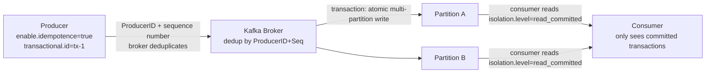

**Idempotent producer:** Each message tagged with ProducerID + sequence number. Broker rejects duplicates (retry after network failure = same message, not duplicate).

**Transactions:** Write to multiple partitions atomically. Either all committed or none visible.

<div class="toggle-switch">
  <div class="toggle-buttons">
    <button data-toggle-opt="idem" class="active">Idempotent producer</button>
    <button data-toggle-opt="txn">Transactions</button>
  </div>
  <div class="toggle-panel active" data-toggle-panel="idem">
    Each message is tagged with a ProducerID + sequence number, and the broker rejects duplicates using that pair — a retry after a network failure lands as the same message, not a second one. This solves dedup within a single partition; it says nothing about writes to multiple partitions being tied together.
  </div>
  <div class="toggle-panel" data-toggle-panel="txn">
    Writes to multiple partitions become one atomic unit — either every message is visible, or none are. This is what makes "write to two topics and commit a consumer offset, all-or-nothing" possible (see Kafka Transactions below).
  </div>
</div>

<div class="quiz-card">
  <p class="quiz-q">A producer has enable.idempotence=true but isn't using transactions. It writes to Partition A, then Partition B, then crashes right after A's write lands but before B's does. Is that an atomic failure?</p>
  <button class="quiz-reveal">Reveal answer</button>
  <div class="quiz-a" hidden>No. Idempotence only guarantees no duplicate writes on retry, per partition — it doesn't tie multiple partitions together. Partition A's write stands on its own with no rollback. Atomic all-or-nothing writes across partitions is what transactions add on top of idempotence.</div>
</div>

---

## Key Metrics

```promql
# Consumer lag (most important — alert > 10000)
kafka_consumer_group_lag > 10000

# Under-replicated partitions (alert > 0)
kafka_server_replication_under_replicated_partitions > 0

# ISR shrink rate (alert if frequent)
rate(kafka_server_replication_isr_shrinks_total[5m]) > 0

# Producer request latency p99
histogram_quantile(0.99, kafka_network_request_total_time_ms_bucket{request="Produce"}) > 100
```

---

## Schema Registry

Avro/Protobuf schemas are stored in the Schema Registry. Producers serialize with schema ID; consumers look up the schema to deserialize. Prevents incompatible schema changes breaking consumers.

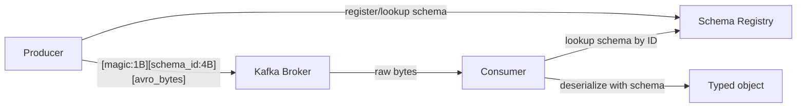

```python
# Producer with schema registry
from confluent_kafka.avro import AvroProducer
producer = AvroProducer(
    {'bootstrap.servers': 'kafka:9092', 'schema.registry.url': 'http://registry:8081'},
    default_value_schema=avro.loads(value_schema_str)
)
producer.produce(topic='orders', value={'id': '123', 'amount': 99.99})
```

**Schema compatibility modes:**

<div class="tab-group">
  <div class="tab-buttons">
    <button data-tab="backward" class="active">BACKWARD</button>
    <button data-tab="forward">FORWARD</button>
    <button data-tab="full">FULL</button>
  </div>
  <div class="tab-panels">
    <div class="tab-panel active" data-tab-panel="backward">
      New schema can read data written with the old schema — typically means adding fields with defaults. Lets you upgrade producers before consumers, safely.
    </div>
    <div class="tab-panel" data-tab-panel="forward">
      Old schema can read data written with the new schema — typically means only removing fields. Lets you upgrade consumers before producers, safely.
    </div>
    <div class="tab-panel" data-tab-panel="full">
      Both BACKWARD and FORWARD at once. Safest option, most restrictive on what schema changes are allowed.
    </div>
  </div>
</div>

<div class="quiz-card">
  <p class="quiz-q">Compatibility is set to FORWARD. A schema change adds a new required field (no default). Does it pass compatibility checking?</p>
  <button class="quiz-reveal">Reveal answer</button>
  <div class="quiz-a" hidden>No — FORWARD compatibility means the old schema must be able to read data written with the new one, which is why removing fields is the safe move under FORWARD, not adding required ones. Adding fields with defaults is the BACKWARD-compatible move (new schema reading old data).</div>
</div>

---

## Kafka Transactions (Exactly-Once)

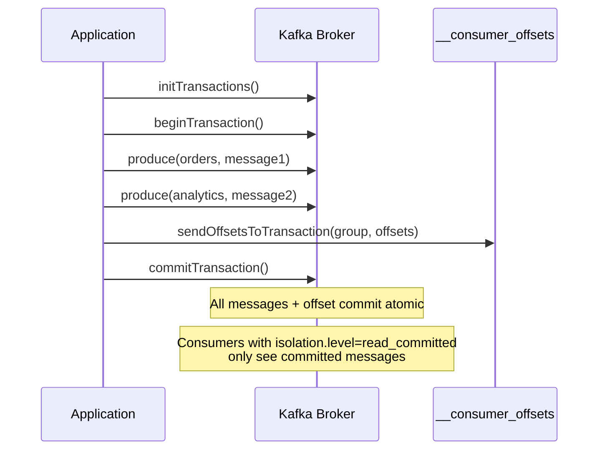

```java
producer.initTransactions();
producer.beginTransaction();
try {
    producer.send(new ProducerRecord<>("orders", key, value));
    producer.sendOffsetsToTransaction(offsets, groupMetadata);
    producer.commitTransaction();
} catch (Exception e) {
    producer.abortTransaction();
}
```

Walk through the happy path plus the abort branch:

<div class="stepper">
  <div class="stepper-panels">
    <div class="stepper-panel active">
      <strong>1. initTransactions().</strong> Registers the producer as transactional under its <code>transactional.id</code> — a one-time setup call before any transaction begins.
    </div>
    <div class="stepper-panel">
      <strong>2. beginTransaction().</strong> Opens a new transaction. Nothing produced yet is visible to anyone.
    </div>
    <div class="stepper-panel">
      <strong>3. produce() to one or more partitions.</strong> Writes can span multiple topics — here <code>orders</code> and <code>analytics</code> — all belonging to this one transaction.
    </div>
    <div class="stepper-panel">
      <strong>4. sendOffsetsToTransaction().</strong> The consumer offset commit (for whatever input the app is processing) gets folded into the same transaction as the produced messages.
    </div>
    <div class="stepper-panel">
      <strong>5a. commitTransaction() — happy path.</strong> Every message plus the offset commit becomes visible atomically. Consumers with <code>isolation.level=read_committed</code> now see all of it, or none of it.
    </div>
    <div class="stepper-panel">
      <strong>5b. abortTransaction() — failure path.</strong> If the <code>catch</code> block fires instead, nothing produced in this transaction ever becomes visible under <code>read_committed</code> — not partially, not at all.
    </div>
  </div>
  <div class="stepper-controls">
    <button class="stepper-prev">← Prev</button>
    <span class="stepper-dots"></span>
    <span class="stepper-label"></span>
    <button class="stepper-next">Next →</button>
  </div>
</div>

<div class="quiz-card">
  <p class="quiz-q">Why does sendOffsetsToTransaction() need to exist — why not just call commitSync() on the consumer offset normally, right after commitTransaction()?</p>
  <button class="quiz-reveal">Reveal answer</button>
  <div class="quiz-a" hidden>Because the whole point of the pattern is that the produced messages and the "consumed up to here" offset commit succeed or fail together as one atomic unit. A separate, ordinary commitSync() afterward would be its own independent operation — it could succeed while the transaction aborts, or the reverse, reopening exactly the gap transactions exist to close.</div>
</div>

---

## Kafka Streams

Kafka Streams is a Java library for stream processing — stateless transformations, aggregations, joins — all backed by Kafka topics.

```java
StreamsBuilder builder = new StreamsBuilder();

// Read from topic
KStream<String, Order> orders = builder.stream("orders");

// Stateless: filter + transform
KStream<String, Order> paidOrders = orders
    .filter((key, order) -> order.getStatus().equals("paid"))
    .mapValues(order -> enrichOrder(order));

// Stateful: count per user (stored in RocksDB state store)
KTable<String, Long> orderCounts = orders
    .groupByKey()
    .count(Materialized.as("order-counts-store"));

// Write to output topic
paidOrders.to("paid-orders");
orderCounts.toStream().to("order-counts");
```

State stores (RocksDB) are backed by changelog topics — on restart, the state is rebuilt from the changelog without reprocessing all input.

<div class="tab-group">
  <div class="tab-buttons">
    <button data-tab="stateless" class="active">Stateless</button>
    <button data-tab="stateful">Stateful</button>
  </div>
  <div class="tab-panels">
    <div class="tab-panel active" data-tab-panel="stateless">
      <code>filter</code>, <code>mapValues</code>, and similar — each record is transformed independently. Nothing needs to be remembered between records, so no state store is involved.
    </div>
    <div class="tab-panel" data-tab-panel="stateful">
      <code>groupByKey().count()</code> and similar — the operation needs to remember something across records (a running count per key). That memory lives in a local RocksDB state store, itself backed by a changelog topic.
    </div>
  </div>
</div>

<div class="quiz-card">
  <p class="quiz-q">A Kafka Streams instance crashes and restarts, losing its local RocksDB files. Does it have to reprocess the original input topics from scratch to rebuild its state?</p>
  <button class="quiz-reveal">Reveal answer</button>
  <div class="quiz-a" hidden>No. State stores are backed by changelog topics — on restart, the state store is rebuilt by replaying its changelog topic, not by reprocessing the original input from the beginning.</div>
</div>

---

## Consumer Lag Alerting

```promql
# Alert: consumer group is falling behind (lag > 10K messages)
kafka_consumer_group_lag{group="payments", topic="orders"} > 10000

# Calculate processing rate needed to catch up
# current_lag / (consume_rate - produce_rate) = time to catch up

# Alert: no consumer is running for a group (lag growing without consumption)
increase(kafka_consumer_group_lag[5m]) > 0
AND
kafka_consumer_group_members{group="payments"} == 0
```

```bash
# Real-time lag monitoring
kafka-consumer-groups.sh \
  --bootstrap-server kafka:9092 \
  --describe --group payments
# Watch lag column — should trend toward 0 for healthy consumer

# Kafka UI tools: Kafdrop, Redpanda Console, Conduktor
```

<div class="quiz-card">
  <p class="quiz-q">The alert combo `increase(lag[5m]) > 0 AND members == 0` fires. What specific failure mode does the members==0 half rule in that a plain rising-lag alert alone wouldn't distinguish?</p>
  <button class="quiz-reveal">Reveal answer</button>
  <div class="quiz-a" hidden>It isolates the case where lag is growing because nobody is consuming at all (zero group members) — as opposed to a consumer that's still running but just slower than the produce rate. Rising lag on its own can't tell those two apart; adding the member-count check does.</div>
</div>

---

## Topic Sizing and Retention

```bash
# View topic configuration
kafka-configs.sh --bootstrap-server kafka:9092 \
  --describe --entity-type topics --entity-name orders

# Override retention for a specific topic
kafka-configs.sh --bootstrap-server kafka:9092 \
  --alter --entity-type topics --entity-name orders \
  --add-config retention.ms=604800000  # 7 days
            # retention.bytes=10737418240  # 10GB

# Estimate disk usage
# disk_per_partition = (produce_rate_bytes/s × retention_seconds) / num_partitions
# Total disk = disk_per_partition × total_partitions × replication_factor
```

---

## Debugging

```bash
# Describe a topic (partitions, replicas, ISR)
kafka-topics.sh --bootstrap-server kafka:9092 --describe --topic orders
# Partition: 0  Leader: 1  Replicas: 1,2,3  Isr: 1,2,3
# If Isr != Replicas: a replica is behind → investigate

# Read messages from beginning
kafka-console-consumer.sh \
  --bootstrap-server kafka:9092 \
  --topic orders --from-beginning --max-messages 10

# Check broker log dirs (find large partitions)
kafka-log-dirs.sh --bootstrap-server kafka:9092 \
  --broker-list 1,2,3 --topic-list orders

# Preferred replica election (rebalance leaders back after failure)
kafka-leader-election.sh --bootstrap-server kafka:9092 \
  --election-type PREFERRED --all-topic-partitions
```

---

## Consumer Lag Deep-Dive

Consumer lag = `log-end-offset - committed-offset`. It tells you how far behind a consumer group is from the head of the partition.

### Reading lag correctly

```bash
# View lag per partition for a consumer group
kafka-consumer-groups.sh \
  --bootstrap-server kafka:9092 \
  --describe \
  --group payments-processor

# Output:
# GROUP               TOPIC      PARTITION  CURRENT-OFFSET  LOG-END-OFFSET  LAG  CONSUMER-ID
# payments-processor  payments   0          45000           45100           100  consumer-1
# payments-processor  payments   1          44900           45050           150  consumer-2
# payments-processor  payments   2          44800           46000          1200  consumer-3 ← spike

# Total lag = sum of all partition lags = 1450
# Partition 2 has 10x the lag of others → partition imbalance
```

**Why per-partition lag matters:** a consumer group may show low average lag while one partition is 10,000 messages behind. Average lag hides the worst case. Always look at max lag per partition.

<div class="quiz-card">
  <p class="quiz-q">A consumer group's total/average lag looks healthy. Does that guarantee no single partition is badly behind?</p>
  <button class="quiz-reveal">Reveal answer</button>
  <div class="quiz-a" hidden>No. Average lag hides the worst case — a group can show low average lag while one partition is thousands of messages behind (a hot key, a stuck consumer). Always check max lag per partition, not just the group's total or average.</div>
</div>

### Lag alert with Prometheus (Kafka Exporter)

```yaml
# kafka-exporter exposes: kafka_consumergroup_lag{consumergroup, topic, partition}
- alert: KafkaConsumerLagHigh
  expr: |
    sum(kafka_consumergroup_lag{consumergroup="payments-processor"}) by (consumergroup, topic) > 10000
  for: 5m
  labels:
    severity: warning

- alert: KafkaConsumerLagCritical
  expr: |
    max(kafka_consumergroup_lag{consumergroup="payments-processor"}) by (partition) > 50000
  for: 2m
  labels:
    severity: critical
  annotations:
    summary: "Single partition lag > 50k — consumer likely dead or partition hot"
```

### Root causes and fixes

| Cause | Lag pattern | Fix |
|---|---|---|
| Consumer too slow | Steadily growing across all partitions | Scale consumers (add instances up to partition count) |
| Hot partition | One partition 10x lag of others | Key redesign; add partitions; spot the hot key |
| Consumer died | One partition at 0 throughput | Check consumer logs; rebalance trigger |
| Rebalance storm | Lag spikes every few minutes | Increase `session.timeout.ms`, tune `max.poll.interval.ms` |
| GC pause in consumer | Sporadic lag spikes | Tune JVM GC; reduce `max.poll.records` |
| Message processing error | Lag at specific offset | Consumer stuck in retry loop; add DLQ |

### Producer tuning for throughput vs durability

```properties
# High throughput (analytics, logs) — batch more, weaker guarantees
acks=1                     # leader ACK only (not all replicas)
batch.size=65536           # 64KB batch (default 16KB)
linger.ms=10               # wait 10ms to fill batch before sending
compression.type=lz4       # compress batches (lz4 best CPU/ratio tradeoff)
buffer.memory=67108864     # 64MB producer buffer
max.in.flight.requests.per.connection=5

# High durability (payments, orders) — ensure no data loss
acks=all                   # all ISR replicas must ACK
retries=2147483647         # retry forever (Java MAX_INT)
max.in.flight.requests.per.connection=1   # prevent message reordering on retry
enable.idempotence=true    # exactly-once on producer side
delivery.timeout.ms=120000 # 2 minutes total retry window
```

<div class="toggle-switch">
  <div class="toggle-buttons">
    <button data-toggle-opt="throughput" class="active">High throughput</button>
    <button data-toggle-opt="durability" class="state-ok">High durability</button>
  </div>
  <div class="toggle-panel active" data-toggle-panel="throughput">
    <code>acks=1</code>, bigger batches, a few ms of <code>linger.ms</code>, lz4 compression. For analytics/logs workloads where an occasional lost message on leader failure is an acceptable tradeoff for throughput.
  </div>
  <div class="toggle-panel" data-toggle-panel="durability">
    <code>acks=all</code>, retries effectively forever, <code>max.in.flight.requests.per.connection=1</code> to prevent reordering on retry, idempotence on. For payments/orders — the goal is zero data loss even if it costs latency.
  </div>
</div>

### Partition strategy — choosing partition count

```
Partition count determines max consumer parallelism.
More partitions → more parallelism + more overhead (open file handles, leader elections).

Rule of thumb:
  target_throughput_MB/s  ÷  throughput_per_partition_MB/s = partitions needed

Single partition throughput (approximate):
  Producer:  ~50-100 MB/s (disk sequential write speed)
  Consumer:  ~50-100 MB/s (network + processing bound in practice)

Example:
  Need 500 MB/s total throughput
  Each partition handles ~50 MB/s
  → 10 partitions minimum

For consumer parallelism:
  max_consumers_in_group = partition_count
  If you have 20 consumer instances, you need ≥20 partitions
  Extra consumers beyond partition count sit idle
```

```bash
# Add partitions to an existing topic (can only increase, never decrease)
kafka-topics.sh \
  --bootstrap-server kafka:9092 \
  --alter \
  --topic payments \
  --partitions 20
# WARNING: adding partitions changes key→partition mapping for new messages.
# Old messages stay on old partitions. Consumers must handle reordering.
# For strict ordering by key: pre-plan partition count at topic creation.
```

### Rebalance debugging

Consumer rebalances (triggered by member join/leave/timeout) pause ALL consumers in the group while a new partition assignment is computed.

```bash
# Check rebalance frequency
kafka-consumer-groups.sh \
  --bootstrap-server kafka:9092 \
  --describe --group payments-processor
# CONSUMER-ID changes on rebalance

# Common causes of excessive rebalancing:
# 1. max.poll.interval.ms too low — consumer takes longer to process than allowed
#    Fix: increase max.poll.interval.ms or reduce max.poll.records
# 2. session.timeout.ms too low — consumer heartbeat misses under GC pause
#    Fix: increase session.timeout.ms (but lag detection slower)
# 3. Rolling restart — each pod restart triggers two rebalances (leave + rejoin)
#    Fix: use static group membership
```

<div class="tab-group">
  <div class="tab-buttons">
    <button data-tab="pollint" class="active">max.poll.interval.ms too low</button>
    <button data-tab="session">session.timeout.ms too low</button>
    <button data-tab="restart">Rolling restart</button>
  </div>
  <div class="tab-panels">
    <div class="tab-panel active" data-tab-panel="pollint">
      Consumer takes longer between <code>poll()</code> calls than <code>max.poll.interval.ms</code> allows — the coordinator assumes it's dead and rebalances. Fix: increase <code>max.poll.interval.ms</code>, or reduce <code>max.poll.records</code> so each batch processes faster.
    </div>
    <div class="tab-panel" data-tab-panel="session">
      A GC pause causes the consumer to miss a heartbeat within <code>session.timeout.ms</code>. Fix: increase <code>session.timeout.ms</code> — the tradeoff is slower detection of a genuinely dead consumer.
    </div>
    <div class="tab-panel" data-tab-panel="restart">
      Each pod restart during a rolling deploy triggers two rebalances — one on leave, one on rejoin. Fix: static group membership (<code>group.instance.id</code>) so a restart within <code>session.timeout.ms</code> skips the rebalance entirely.
    </div>
  </div>
</div>

```properties
# Static group membership — survive restarts without rebalance
group.instance.id=payments-consumer-0   # unique, stable ID per consumer instance
session.timeout.ms=60000                # how long before a static member is considered dead
# With static membership, restarts within session.timeout.ms skip rebalance
```

### Try It Yourself: Live Partition Assignment (Range Assignor)

The mermaid diagram earlier in this file already showed the shape of it — 6 partitions split into contiguous ranges across consumers. This is that assignment live: 6 fixed partitions (P0–P5), starting with a 2-consumer group. Add or remove a consumer by name to trigger a rebalance and watch the Range assignor — Kafka's default — recompute the whole assignment from scratch every time.

<div class="structure-viz" id="rebalance-demo">
  <svg class="viz-canvas" viewBox="0 0 616 130"></svg>
  <div class="viz-controls">
    <input class="viz-input" type="text" placeholder="consumer name (e.g. C3)" />
    <button class="viz-btn" data-viz-action="insert">Add Consumer</button>
    <button class="viz-btn viz-btn-danger" data-viz-action="delete">Remove Consumer</button>
    <button class="viz-btn" data-viz-action="reset">Reset</button>
  </div>
  <div class="viz-status"></div>
  <div class="viz-legend"></div>
</div>

<script>
(function () {
  const svgNS = 'http://www.w3.org/2000/svg';
  const root0 = document.getElementById('rebalance-demo');
  const svg = root0.querySelector('.viz-canvas');
  const input = root0.querySelector('.viz-input');
  const status = root0.querySelector('.viz-status');
  const legend = root0.querySelector('.viz-legend');

  const NUM_PARTITIONS = 6;
  const SLOT_W = 80, SLOT_H = 50, GAP = 14;
  const COLORS = ['#60a5fa', '#4ade80', '#fbbf24', '#f472b6', '#a78bfa', '#fb923c', '#38bdf8', '#facc15'];
  const UNASSIGNED_FILL = '#1e293b';

  let consumers, assignment, consumerColor;
  // Whether the "eager rebalance pauses everyone" callout has already been
  // shown once. Deliberately NOT reset by the Reset button -- it's a
  // one-time explanation of the protocol, not per-scenario state.
  let hasExplainedEagerRebalance = false;

  // Range assignor: sort consumers by name, divide partitions into
  // contiguous ranges as evenly as possible. First `extra` consumers (in
  // sorted order) get one extra partition. This is Kafka's default assignor.
  function assign(list) {
    const sorted = [...list].sort();
    const n = sorted.length;
    const result = new Array(NUM_PARTITIONS).fill(null);
    if (n === 0) return result;
    const base = Math.floor(NUM_PARTITIONS / n);
    const extra = NUM_PARTITIONS % n;
    let p = 0;
    for (let i = 0; i < n; i++) {
      const count = base + (i < extra ? 1 : 0);
      for (let k = 0; k < count; k++) { result[p] = sorted[i]; p++; }
    }
    return result;
  }

  function reset() {
    consumers = ['C1', 'C2'];
    assignment = assign(consumers);
    consumerColor = new Map();
  }

  function colorFor(name) {
    if (!consumerColor.has(name)) consumerColor.set(name, COLORS[consumerColor.size % COLORS.length]);
    return consumerColor.get(name);
  }

  // Turns a partition->owner array into { owner: "P0-P2" } range labels
  // (or "P3" for a single partition). Consumers with zero partitions
  // (more consumers than partitions) simply don't appear in the result.
  function rangeLabel(assignmentArr) {
    const map = {};
    let i = 0;
    while (i < assignmentArr.length) {
      const owner = assignmentArr[i];
      if (owner === null) { i++; continue; }
      let j = i;
      while (j < assignmentArr.length && assignmentArr[j] === owner) j++;
      map[owner] = (j - 1 === i) ? `P${i}` : `P${i}-P${j - 1}`;
      i = j;
    }
    return map;
  }

  function setStatus(msg, kind) {
    status.textContent = msg;
    status.className = 'viz-status' + (kind === 'ok' ? ' viz-status-ok' : kind === 'error' ? ' viz-status-error' : '');
  }

  function el(tag, attrs) {
    const e = document.createElementNS(svgNS, tag);
    for (const k in attrs) e.setAttribute(k, attrs[k]);
    return e;
  }

  function draw() {
    const vbW = NUM_PARTITIONS * (SLOT_W + GAP) + GAP;
    const vbH = 130;
    svg.setAttribute('viewBox', `0 0 ${vbW} ${vbH}`);
    while (svg.firstChild) svg.removeChild(svg.firstChild);

    for (let i = 0; i < NUM_PARTITIONS; i++) {
      const x = GAP + i * (SLOT_W + GAP);
      const y = 46;
      const owner = assignment[i];
      svg.appendChild(el('rect', {
        x, y, width: SLOT_W, height: SLOT_H, rx: 6,
        fill: owner ? colorFor(owner) : UNASSIGNED_FILL,
        stroke: owner ? '#0f172a' : '#475569',
        'stroke-width': owner ? '1.5' : '1.5',
        'stroke-dasharray': owner ? '' : '4,3',
      }));
      const label = el('text', { x: x + SLOT_W / 2, y: 26, class: 'viz-label-dim' });
      label.textContent = `P${i}`;
      svg.appendChild(label);
      const t = el('text', { x: x + SLOT_W / 2, y: y + SLOT_H / 2 });
      t.textContent = owner || 'unassigned';
      svg.appendChild(t);
    }
  }

  function renderConsumerList() {
    while (legend.firstChild) legend.removeChild(legend.firstChild);
    if (consumers.length === 0) {
      const span = document.createElement('span');
      span.textContent = 'No active consumers — all partitions unassigned.';
      legend.appendChild(span);
      return;
    }
    const ranges = rangeLabel(assignment);
    [...consumers].sort().forEach((c) => {
      const span = document.createElement('span');
      const swatch = document.createElement('span');
      swatch.className = 'viz-swatch';
      swatch.style.background = colorFor(c);
      span.appendChild(swatch);
      const label = document.createElement('span');
      label.textContent = `${c}: ${ranges[c] || 'idle (no partitions)'}`;
      span.appendChild(label);
      legend.appendChild(span);
    });
  }

  // Narrates a before/after rebalance: which consumers' assignments
  // changed vs stayed byte-for-byte identical, even though the eager
  // protocol pauses every consumer regardless.
  function narrate(action, name, oldAssignment, oldConsumers) {
    const oldRanges = rangeLabel(oldAssignment);
    const newRanges = rangeLabel(assignment);
    const survivors = oldConsumers.filter((c) => c !== name && consumers.includes(c));

    let msg = action === 'add' ? `${name} joined the group. ` : `${name} left the group. `;

    if (!hasExplainedEagerRebalance) {
      msg += "Kafka's default eager rebalance protocol stops ALL consumers and reassigns everyone from scratch — even consumers who keep the same partitions still pause during this window. ";
      hasExplainedEagerRebalance = true;
    }

    if (consumers.length === 0) {
      msg += 'No consumers left — every partition is now unassigned, no active consumer.';
      setStatus(msg, 'ok');
      return;
    }

    if (action === 'add') {
      const nr = newRanges[name];
      msg += nr ? `It now owns ${nr}. ` : 'It got no partitions (idle — more consumers than partitions right now). ';
    }

    const changed = [];
    const unchanged = [];
    survivors.forEach((c) => {
      const before = oldRanges[c] || 'idle';
      const after = newRanges[c] || 'idle';
      if (before === after) unchanged.push(`${c} stayed on ${after}`);
      else changed.push(`${c}: ${before} -> ${after}`);
    });

    if (changed.length) msg += `Reassigned: ${changed.join('; ')}. `;
    if (unchanged.length) msg += `Unchanged (paused during the rebalance, but the data never moved): ${unchanged.join('; ')}.`;

    setStatus(msg.trim(), 'ok');
  }

  root0.querySelector('[data-viz-action="insert"]').addEventListener('click', () => {
    const name = input.value.trim();
    if (!name) { setStatus('Enter a consumer name first.', 'error'); return; }
    if (consumers.includes(name)) { setStatus(`${name} is already in the group.`, 'error'); return; }
    const oldAssignment = assignment.slice();
    const oldConsumers = consumers.slice();
    consumers.push(name);
    assignment = assign(consumers);
    input.value = '';
    narrate('add', name, oldAssignment, oldConsumers);
    draw();
    renderConsumerList();
  });

  root0.querySelector('[data-viz-action="delete"]').addEventListener('click', () => {
    const name = input.value.trim();
    if (!name) { setStatus('Enter a consumer name first.', 'error'); return; }
    if (!consumers.includes(name)) { setStatus(`${name} isn't in the group.`, 'error'); return; }
    const oldAssignment = assignment.slice();
    const oldConsumers = consumers.slice();
    consumers = consumers.filter((c) => c !== name);
    assignment = assign(consumers);
    input.value = '';
    narrate('remove', name, oldAssignment, oldConsumers);
    draw();
    renderConsumerList();
  });

  root0.querySelector('[data-viz-action="reset"]').addEventListener('click', () => {
    reset();
    setStatus('Reset to a 2-consumer group (C1, C2) evenly splitting all 6 partitions.', '');
    draw();
    renderConsumerList();
  });

  reset();
  setStatus('Loaded with C1 and C2 evenly splitting 6 partitions (3 each). Add or remove a consumer to trigger a rebalance.', '');
  draw();
  renderConsumerList();
})();
</script>

## Why Kafka Is Fast: OS-Level I/O

Kafka's throughput — hundreds of MB/s on commodity hardware — comes from four compounding OS-level properties, not from clever JVM code.

### Sequential Writes

Kafka producers always append to the **end** of the active log segment for a partition. The OS page cache buffers these writes in memory and flushes to disk asynchronously in large sequential batches. Kafka does **not** call `fsync()` per message — it relies on replication (ISR quorum) for durability, and lets the OS flush at its own pace.

Sequential I/O benchmark on spinning disk: **~500MB/s write**. Random I/O on the same disk: **~200 IOPS (~1MB/s effective)**. The difference is three orders of magnitude.

### Zero-Copy with `sendfile()`

When a consumer reads a batch of messages, the naive path copies data four times:

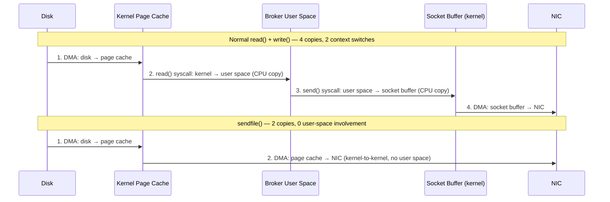

With `sendfile()`, the broker **never copies message bytes into user space** for a passthrough consumer read. The kernel transfers directly from the page cache to the NIC buffer. This is how a single Kafka broker can saturate a 10Gbps NIC without the JVM heap doing any of the work.

Kafka enables zero-copy by design: messages are stored on disk in the exact same binary format they're sent to consumers over the network. No deserialization, no transformation — the broker is a dumb pipe.

### Page Cache as Read Cache

Consumers that follow closely behind producers (real-time consumers) read messages that are **still in the OS page cache** — data that was never evicted to disk from the producer's write. This is a free read from RAM.

The page cache advantage over a JVM heap cache:
- **OS-managed**: survives broker restarts (the JVM heap is gone, the page cache survives if the data is still warm)
- **Shared**: multiple consumers reading the same partition share the same cached pages
- **No GC pressure**: page cache memory doesn't participate in JVM garbage collection

### `mmap` for Index Files

Kafka's `.index` (offset → physical position) and `.timeindex` (timestamp → offset) files are memory-mapped with `mmap()`. A consumer offset lookup is a binary search over a virtual memory region — no `read()` syscall, no kernel/userspace copy. The OS maps the index file into the broker's virtual address space and handles page faults lazily.

### Batching

**Producer side**: `linger.ms` and `batch.size` accumulate multiple records before a single TCP `write()`. Fewer syscalls, larger payloads, better compression ratio (more repetition within a batch).

**Consumer side**: `fetch.min.bytes` and `fetch.max.wait.ms` prevent the consumer from firing a fetch per message. The broker waits until there's enough data, then returns one large response.

Combined, batching means fewer syscalls, fewer TCP round trips, and better `sendfile()` utilization — one `sendfile()` call can transfer thousands of messages at once.

<div class="quiz-card">
  <p class="quiz-q">A consumer reads 10MB from a Kafka broker. How many times does the 10MB of message data cross the kernel/userspace boundary with zero-copy (sendfile) vs without?</p>
  <button class="quiz-reveal">Reveal answer</button>
  <div class="quiz-a" hidden>With <code>sendfile()</code> (zero-copy): <strong>zero times</strong>. The data moves from disk → page cache (DMA, hardware-driven), then page cache → NIC (DMA, hardware-driven). The broker's user-space process is never involved in copying the payload bytes — it only issues the syscall. Without zero-copy (normal read + write): <strong>twice</strong>. First copy: kernel page cache → broker user-space buffer (CPU-driven, on the read() syscall). Second copy: broker user-space buffer → kernel socket buffer (CPU-driven, on the write() syscall). Then a final DMA from socket buffer to NIC — that one's hardware-driven in both paths.</div>
</div>

---

## Redpanda

Redpanda is a Kafka-API-compatible message broker rewritten in C++ using the **Seastar** framework. It's a drop-in replacement for Kafka clients and producers — no code changes required. No JVM, no ZooKeeper, no KRaft migration.

### Thread-per-Core Architecture

Kafka's JVM broker runs a thread pool where threads share state (partition maps, request queues, memory). Threads compete for locks under load; GC pauses all threads simultaneously.

Redpanda's model: **each CPU core owns a fixed subset of partitions and its own memory shard**. Cores communicate via message passing (Seastar futures/fibers), never shared memory. This eliminates lock contention entirely — there's nothing to lock.

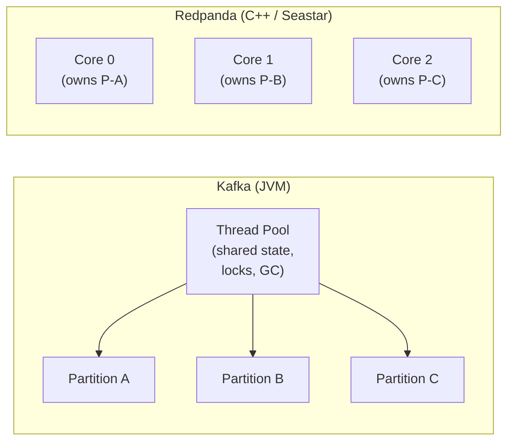

### No GC Pauses

Kafka's JVM GC (G1 or ZGC) can pause all broker threads simultaneously — even ZGC with its concurrent collection introduces occasional multi-millisecond stop-the-world pauses. These pauses show up as p99/p999 latency spikes in consumers.

Redpanda is C++ with deterministic memory management (RAII, custom allocators). There are no GC pauses. p99 latency stays in the sub-millisecond range even under load.

### Built-In Raft

Kafka's Raft (KRaft, KIP-500) replaced ZooKeeper in 3.0 — a necessary migration that required running a separate controller quorum alongside the broker quorum, with careful upgrade procedures.

Redpanda uses Raft natively from its first release. Every partition group uses Raft for leader election and log replication, coordinated within the same broker processes. There's no separate metadata cluster to operate, no ZooKeeper to manage, no KRaft migration path.

### Kafka vs Redpanda

<div class="tab-group">
  <div class="tab-buttons">
    <button data-tab="runtime" class="active">Runtime</button>
    <button data-tab="latency">Latency</button>
    <button data-tab="ops">Operations</button>
    <button data-tab="when">When to Choose</button>
  </div>
  <div class="tab-panels">
    <div class="tab-panel active" data-tab-panel="runtime">
      <table>
        <tr><th></th><th>Kafka</th><th>Redpanda</th></tr>
        <tr><td>Language</td><td>Scala/Java (JVM)</td><td>C++ (Seastar)</td></tr>
        <tr><td>Scheduling</td><td>Preemptive OS threads</td><td>Cooperative fibers (no context switches)</td></tr>
        <tr><td>Memory model</td><td>JVM heap + GC</td><td>Manual/RAII, per-core shards</td></tr>
        <tr><td>Shared state</td><td>Yes (locks)</td><td>No (message passing between cores)</td></tr>
      </table>
    </div>
    <div class="tab-panel" data-tab-panel="latency">
      <table>
        <tr><th></th><th>Kafka</th><th>Redpanda</th></tr>
        <tr><td>p50 produce latency</td><td>1–5ms</td><td>&lt;1ms</td></tr>
        <tr><td>p99 produce latency</td><td>10–50ms (GC spikes)</td><td>1–5ms</td></tr>
        <tr><td>GC pause risk</td><td>Yes (even ZGC)</td><td>None</td></tr>
        <tr><td>Tail latency predictability</td><td>Variable</td><td>Consistent</td></tr>
      </table>
    </div>
    <div class="tab-panel" data-tab-panel="ops">
      <table>
        <tr><th></th><th>Kafka</th><th>Redpanda</th></tr>
        <tr><td>Metadata store</td><td>ZooKeeper → KRaft (3.0+)</td><td>Built-in Raft, day one</td></tr>
        <tr><td>Upgrade complexity</td><td>ZK→KRaft migration required</td><td>Single binary, rolling upgrade</td></tr>
        <tr><td>Ecosystem maturity</td><td>Very mature (10+ years)</td><td>Growing (2020+)</td></tr>
        <tr><td>Kafka Streams</td><td>Native</td><td>Not available (use Flink/ksqlDB)</td></tr>
        <tr><td>Schema Registry</td><td>Confluent / community</td><td>Built-in</td></tr>
      </table>
    </div>
    <div class="tab-panel" data-tab-panel="when">
      <strong>Choose Redpanda when:</strong>
      <ul>
        <li>Tail latency matters: trading, gaming, real-time bidding — p99 spikes are unacceptable</li>
        <li>Smaller ops footprint: no ZooKeeper, no KRaft migration, single binary deployment</li>
        <li>You want Kafka API compatibility without JVM tuning overhead (<code>-Xmx</code>, GC flags, heap dumps)</li>
        <li>Edge or resource-constrained environments where JVM startup and footprint are costs</li>
      </ul>
      <br>
      <strong>Stay on Kafka when:</strong>
      <ul>
        <li>You use Kafka Streams (no direct Redpanda equivalent)</li>
        <li>Your team has deep Kafka operational expertise — don't pay the relearning cost for marginal latency gains</li>
        <li>You rely on the Confluent ecosystem (ksqlDB, Kafka Connect sources/sinks, Schema Registry with Confluent features)</li>
        <li>You're at a scale where Confluent Cloud or MSK operational support is worth more than the latency savings</li>
      </ul>
    </div>
  </div>
</div>
