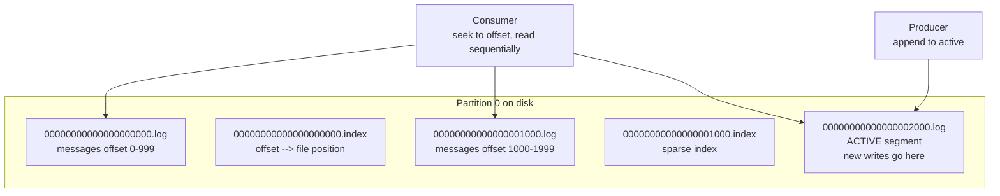
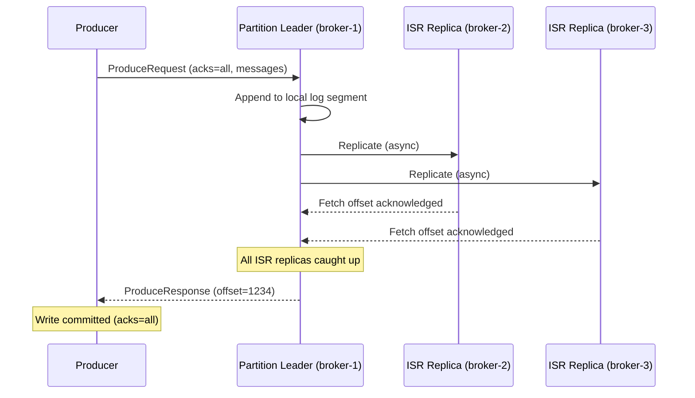
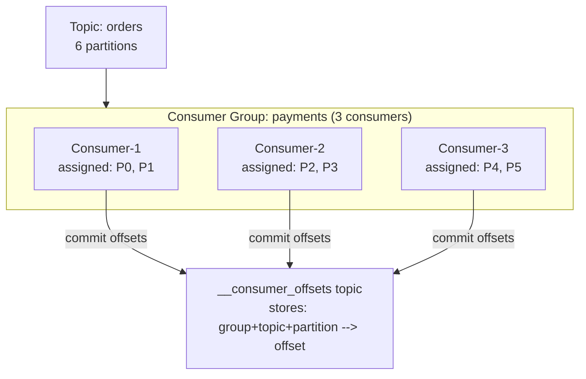
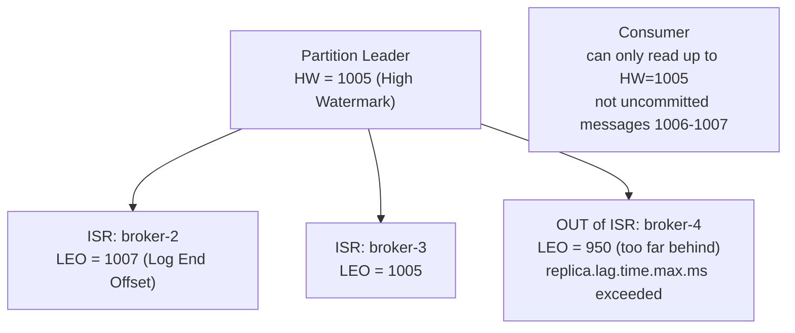
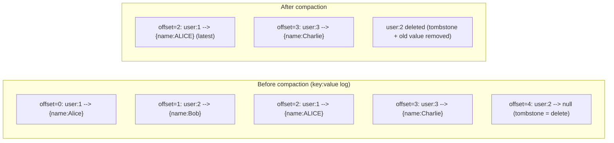
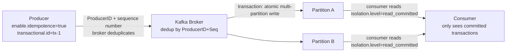
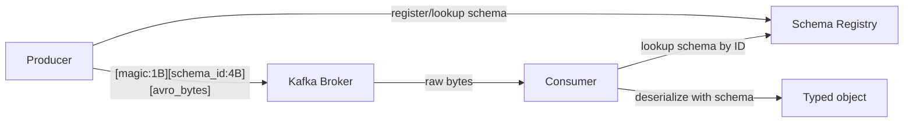
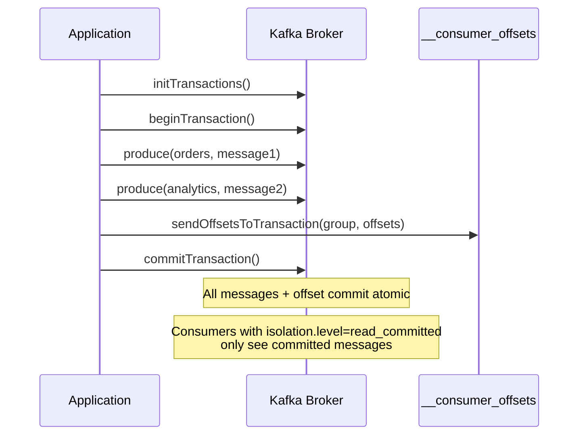

# Apache Kafka Internals

## Storage: Log Segments

Kafka stores each partition as an **append-only log** on disk, divided into segment files.



**Segment rolling:** When active segment reaches `log.segment.bytes` (default 1GB) or `log.roll.ms` (default 7 days), it's closed and a new one starts.

**The index file:** Sparse index mapping offsets to byte positions. Consumer seeks to an offset → binary search in index → seek to file position → read forward. O(log n) seek, then O(1) sequential read.

---

## Producer Write Path



**acks settings:**
```
acks=0   → fire and forget, no confirmation, fastest, data loss possible
acks=1   → leader confirmed, replica lag can lose data if leader crashes
acks=all → all ISR replicas confirmed, zero data loss
```

---

## Consumer Groups and Offset Management



**Offset commit strategies:**
```java
// Auto commit (default, at-least-once risk)
props.put("enable.auto.commit", "true");
props.put("auto.commit.interval.ms", "5000");

// Manual commit after processing (at-least-once, safer)
consumer.poll(Duration.ofMillis(100));
// ... process records ...
consumer.commitSync();   // block until broker confirms

// Exactly-once: commit offset in same DB transaction as business logic
// (transactional outbox pattern)
```

**Offset reset policy:**
```
auto.offset.reset=earliest  → start from beginning if no committed offset
auto.offset.reset=latest    → start from newest message (default)
```

---

## Replication — ISR Deep Dive



**High Watermark (HW):** The offset up to which ALL ISR replicas have the data. Consumers can only read up to HW. Messages above HW are uncommitted — might be lost if leader crashes.

**Leo (Log End Offset):** Latest offset written to the log, may be ahead of HW.

**ISR shrink/expand:**
- Replica falls out of ISR if it doesn't fetch new data within `replica.lag.time.max.ms` (default 30s)
- Replica rejoins ISR after fully catching up
- Alert if ISR size < replication.factor — you've lost redundancy

---

## Log Compaction



Log compaction retains the **latest value per key** — turns Kafka into a changelog/event store for materialized views. Used by Kafka Streams and ksqlDB.

```
log.cleanup.policy=compact          # enable compaction
log.cleanup.policy=compact,delete   # compact AND delete old segments
min.cleanable.dirty.ratio=0.5       # compact when 50% of log is dirty
```

---

## Exactly-Once Semantics



**Idempotent producer:** Each message tagged with ProducerID + sequence number. Broker rejects duplicates (retry after network failure = same message, not duplicate).

**Transactions:** Write to multiple partitions atomically. Either all committed or none visible.

---

## Key Metrics

```promql
# Consumer lag (most important — alert > 10000)
kafka_consumer_group_lag > 10000

# Under-replicated partitions (alert > 0)
kafka_server_replication_under_replicated_partitions > 0

# ISR shrink rate (alert if frequent)
rate(kafka_server_replication_isr_shrinks_total[5m]) > 0

# Producer request latency p99
histogram_quantile(0.99, kafka_network_request_total_time_ms_bucket{request="Produce"}) > 100
```

---

## Schema Registry

Avro/Protobuf schemas are stored in the Schema Registry. Producers serialize with schema ID; consumers look up the schema to deserialize. Prevents incompatible schema changes breaking consumers.



```python
# Producer with schema registry
from confluent_kafka.avro import AvroProducer
producer = AvroProducer(
    {'bootstrap.servers': 'kafka:9092', 'schema.registry.url': 'http://registry:8081'},
    default_value_schema=avro.loads(value_schema_str)
)
producer.produce(topic='orders', value={'id': '123', 'amount': 99.99})
```

**Schema compatibility modes:**
- `BACKWARD`: new schema can read old messages (add fields with defaults)
- `FORWARD`: old schema can read new messages (remove fields)
- `FULL`: both — safest, most restrictive

---

## Kafka Transactions (Exactly-Once)



```java
producer.initTransactions();
producer.beginTransaction();
try {
    producer.send(new ProducerRecord<>("orders", key, value));
    producer.sendOffsetsToTransaction(offsets, groupMetadata);
    producer.commitTransaction();
} catch (Exception e) {
    producer.abortTransaction();
}
```

---

## Kafka Streams

Kafka Streams is a Java library for stream processing — stateless transformations, aggregations, joins — all backed by Kafka topics.

```java
StreamsBuilder builder = new StreamsBuilder();

// Read from topic
KStream<String, Order> orders = builder.stream("orders");

// Stateless: filter + transform
KStream<String, Order> paidOrders = orders
    .filter((key, order) -> order.getStatus().equals("paid"))
    .mapValues(order -> enrichOrder(order));

// Stateful: count per user (stored in RocksDB state store)
KTable<String, Long> orderCounts = orders
    .groupByKey()
    .count(Materialized.as("order-counts-store"));

// Write to output topic
paidOrders.to("paid-orders");
orderCounts.toStream().to("order-counts");
```

State stores (RocksDB) are backed by changelog topics — on restart, the state is rebuilt from the changelog without reprocessing all input.

---

## Consumer Lag Alerting

```promql
# Alert: consumer group is falling behind (lag > 10K messages)
kafka_consumer_group_lag{group="payments", topic="orders"} > 10000

# Calculate processing rate needed to catch up
# current_lag / (consume_rate - produce_rate) = time to catch up

# Alert: no consumer is running for a group (lag growing without consumption)
increase(kafka_consumer_group_lag[5m]) > 0
AND
kafka_consumer_group_members{group="payments"} == 0
```

```bash
# Real-time lag monitoring
kafka-consumer-groups.sh \
  --bootstrap-server kafka:9092 \
  --describe --group payments
# Watch lag column — should trend toward 0 for healthy consumer

# Kafka UI tools: Kafdrop, Redpanda Console, Conduktor
```

---

## Topic Sizing and Retention

```bash
# View topic configuration
kafka-configs.sh --bootstrap-server kafka:9092 \
  --describe --entity-type topics --entity-name orders

# Override retention for a specific topic
kafka-configs.sh --bootstrap-server kafka:9092 \
  --alter --entity-type topics --entity-name orders \
  --add-config retention.ms=604800000  # 7 days
            # retention.bytes=10737418240  # 10GB

# Estimate disk usage
# disk_per_partition = (produce_rate_bytes/s × retention_seconds) / num_partitions
# Total disk = disk_per_partition × total_partitions × replication_factor
```

---

## Debugging

```bash
# Describe a topic (partitions, replicas, ISR)
kafka-topics.sh --bootstrap-server kafka:9092 --describe --topic orders
# Partition: 0  Leader: 1  Replicas: 1,2,3  Isr: 1,2,3
# If Isr != Replicas: a replica is behind → investigate

# Read messages from beginning
kafka-console-consumer.sh \
  --bootstrap-server kafka:9092 \
  --topic orders --from-beginning --max-messages 10

# Check broker log dirs (find large partitions)
kafka-log-dirs.sh --bootstrap-server kafka:9092 \
  --broker-list 1,2,3 --topic-list orders

# Preferred replica election (rebalance leaders back after failure)
kafka-leader-election.sh --bootstrap-server kafka:9092 \
  --election-type PREFERRED --all-topic-partitions
```

---

## Consumer Lag Deep-Dive

Consumer lag = `log-end-offset - committed-offset`. It tells you how far behind a consumer group is from the head of the partition.

### Reading lag correctly

```bash
# View lag per partition for a consumer group
kafka-consumer-groups.sh \
  --bootstrap-server kafka:9092 \
  --describe \
  --group payments-processor

# Output:
# GROUP               TOPIC      PARTITION  CURRENT-OFFSET  LOG-END-OFFSET  LAG  CONSUMER-ID
# payments-processor  payments   0          45000           45100           100  consumer-1
# payments-processor  payments   1          44900           45050           150  consumer-2
# payments-processor  payments   2          44800           46000          1200  consumer-3 ← spike

# Total lag = sum of all partition lags = 1450
# Partition 2 has 10x the lag of others → partition imbalance
```

**Why per-partition lag matters:** a consumer group may show low average lag while one partition is 10,000 messages behind. Average lag hides the worst case. Always look at max lag per partition.

### Lag alert with Prometheus (Kafka Exporter)

```yaml
# kafka-exporter exposes: kafka_consumergroup_lag{consumergroup, topic, partition}
- alert: KafkaConsumerLagHigh
  expr: |
    sum(kafka_consumergroup_lag{consumergroup="payments-processor"}) by (consumergroup, topic) > 10000
  for: 5m
  labels:
    severity: warning

- alert: KafkaConsumerLagCritical
  expr: |
    max(kafka_consumergroup_lag{consumergroup="payments-processor"}) by (partition) > 50000
  for: 2m
  labels:
    severity: critical
  annotations:
    summary: "Single partition lag > 50k — consumer likely dead or partition hot"
```

### Root causes and fixes

| Cause | Lag pattern | Fix |
|---|---|---|
| Consumer too slow | Steadily growing across all partitions | Scale consumers (add instances up to partition count) |
| Hot partition | One partition 10x lag of others | Key redesign; add partitions; spot the hot key |
| Consumer died | One partition at 0 throughput | Check consumer logs; rebalance trigger |
| Rebalance storm | Lag spikes every few minutes | Increase `session.timeout.ms`, tune `max.poll.interval.ms` |
| GC pause in consumer | Sporadic lag spikes | Tune JVM GC; reduce `max.poll.records` |
| Message processing error | Lag at specific offset | Consumer stuck in retry loop; add DLQ |

### Producer tuning for throughput vs durability

```properties
# High throughput (analytics, logs) — batch more, weaker guarantees
acks=1                     # leader ACK only (not all replicas)
batch.size=65536           # 64KB batch (default 16KB)
linger.ms=10               # wait 10ms to fill batch before sending
compression.type=lz4       # compress batches (lz4 best CPU/ratio tradeoff)
buffer.memory=67108864     # 64MB producer buffer
max.in.flight.requests.per.connection=5

# High durability (payments, orders) — ensure no data loss
acks=all                   # all ISR replicas must ACK
retries=2147483647         # retry forever (Java MAX_INT)
max.in.flight.requests.per.connection=1   # prevent message reordering on retry
enable.idempotence=true    # exactly-once on producer side
delivery.timeout.ms=120000 # 2 minutes total retry window
```

### Partition strategy — choosing partition count

```
Partition count determines max consumer parallelism.
More partitions → more parallelism + more overhead (open file handles, leader elections).

Rule of thumb:
  target_throughput_MB/s  ÷  throughput_per_partition_MB/s = partitions needed

Single partition throughput (approximate):
  Producer:  ~50-100 MB/s (disk sequential write speed)
  Consumer:  ~50-100 MB/s (network + processing bound in practice)

Example:
  Need 500 MB/s total throughput
  Each partition handles ~50 MB/s
  → 10 partitions minimum

For consumer parallelism:
  max_consumers_in_group = partition_count
  If you have 20 consumer instances, you need ≥20 partitions
  Extra consumers beyond partition count sit idle
```

```bash
# Add partitions to an existing topic (can only increase, never decrease)
kafka-topics.sh \
  --bootstrap-server kafka:9092 \
  --alter \
  --topic payments \
  --partitions 20
# WARNING: adding partitions changes key→partition mapping for new messages.
# Old messages stay on old partitions. Consumers must handle reordering.
# For strict ordering by key: pre-plan partition count at topic creation.
```

### Rebalance debugging

Consumer rebalances (triggered by member join/leave/timeout) pause ALL consumers in the group while a new partition assignment is computed.

```bash
# Check rebalance frequency
kafka-consumer-groups.sh \
  --bootstrap-server kafka:9092 \
  --describe --group payments-processor
# CONSUMER-ID changes on rebalance

# Common causes of excessive rebalancing:
# 1. max.poll.interval.ms too low — consumer takes longer to process than allowed
#    Fix: increase max.poll.interval.ms or reduce max.poll.records
# 2. session.timeout.ms too low — consumer heartbeat misses under GC pause
#    Fix: increase session.timeout.ms (but lag detection slower)
# 3. Rolling restart — each pod restart triggers two rebalances (leave + rejoin)
#    Fix: use static group membership
```

```properties
# Static group membership — survive restarts without rebalance
group.instance.id=payments-consumer-0   # unique, stable ID per consumer instance
session.timeout.ms=60000                # how long before a static member is considered dead
# With static membership, restarts within session.timeout.ms skip rebalance
```
