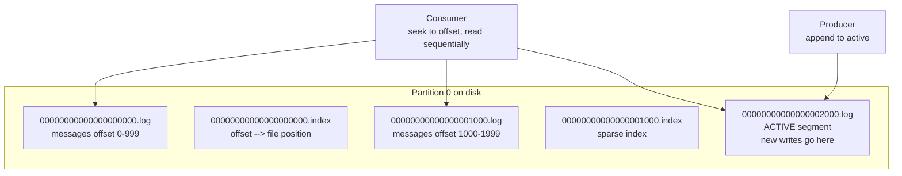
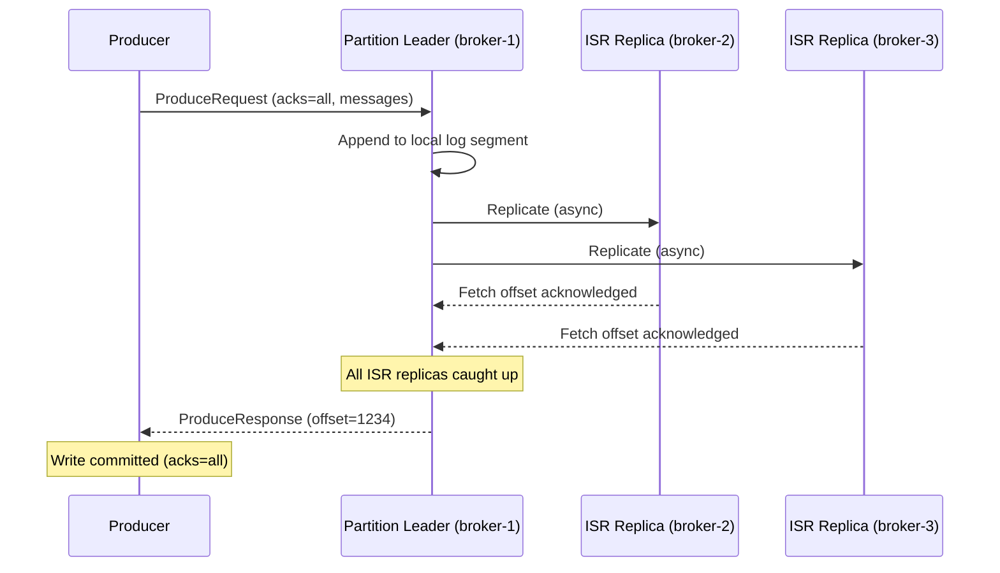
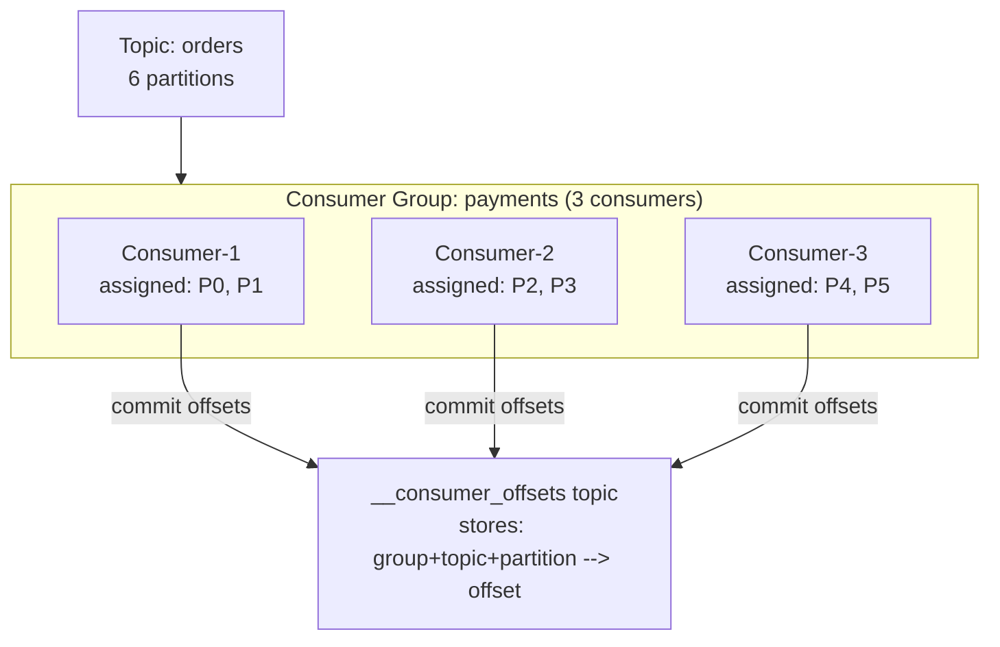
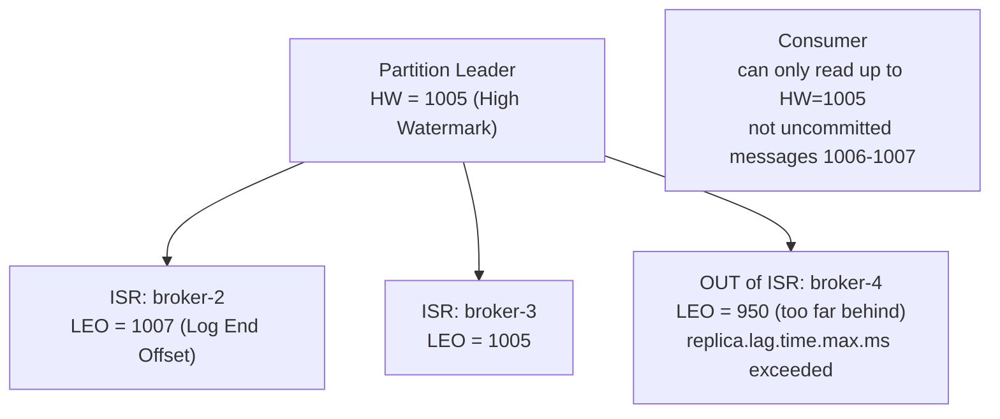
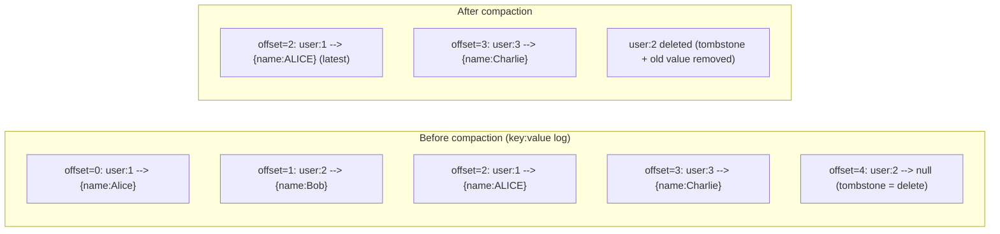
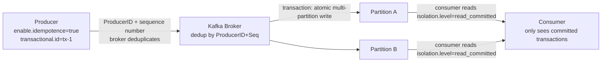
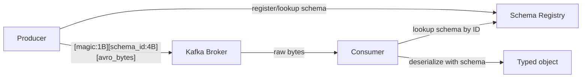
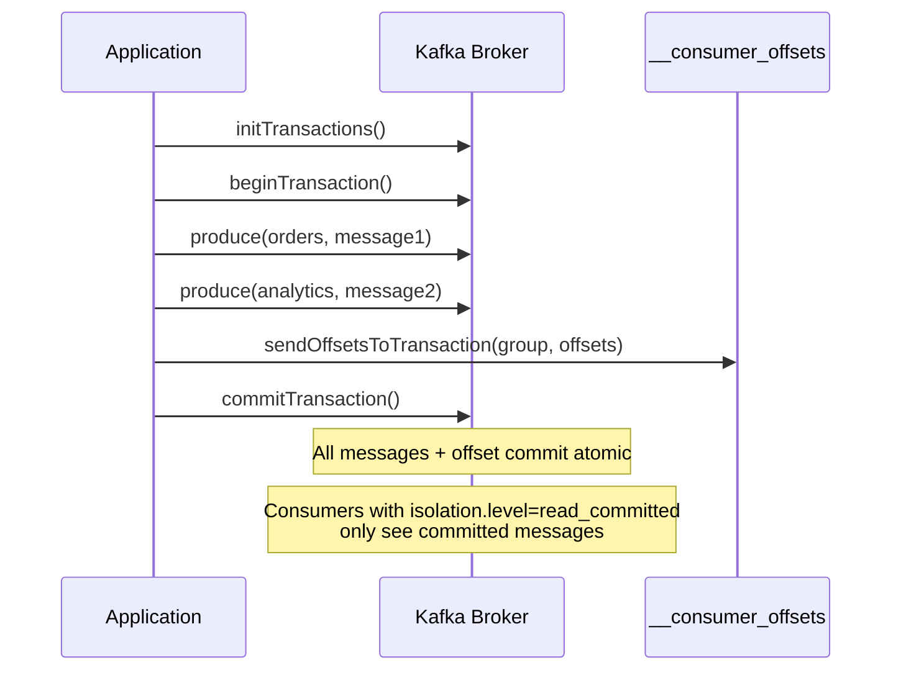

# Apache Kafka Internals

Storage internals, replication protocol, and the operational playbook for running Kafka for real — segments and indexes, the producer/consumer wire paths, ISR replication, compaction, exactly-once semantics, and the lag/rebalance debugging patterns you reach for during an incident. See [kafka-field-guide.md](./kafka-field-guide.md) for the concept-first tour this guide sits underneath.

Track how many of the knowledge checks below you've cleared as you go:

<div class="quiz-progress" data-quiz-progress>
  <span class="quiz-progress-label">0/0 checks</span>
  <span class="quiz-progress-bar"><span class="quiz-progress-fill"></span></span>
</div>

---

## Storage: Log Segments

Kafka stores each partition as an **append-only log** on disk, divided into segment files.



**Segment rolling:** When active segment reaches `log.segment.bytes` (default 1GB) or `log.roll.ms` (default 7 days), it's closed and a new one starts.

**The index file:** Sparse index mapping offsets to byte positions. Consumer seeks to an offset → binary search in index → seek to file position → read forward. O(log n) seek, then O(1) sequential read.

Step through what a seek to an arbitrary offset actually does:

<div class="stepper">
  <div class="stepper-panels">
    <div class="stepper-panel active">
      <strong>1. Consumer requests an offset.</strong> Say offset 1450 — somewhere the consumer hasn't necessarily read from before.
    </div>
    <div class="stepper-panel">
      <strong>2. Binary search the sparse index.</strong> The segment's <code>.index</code> file doesn't map every offset, just a sample. Binary search finds the closest indexed entry at or before 1450.
    </div>
    <div class="stepper-panel">
      <strong>3. Seek to that byte position.</strong> The index entry gives a file position for a nearby offset, not the exact one requested — just a good starting point in the <code>.log</code> file.
    </div>
    <div class="stepper-panel">
      <strong>4. Read forward sequentially.</strong> From that position, scan record by record until offset 1450 is reached. This step is cheap because it's sequential disk I/O, not another random seek.
    </div>
  </div>
  <div class="stepper-controls">
    <button class="stepper-prev">← Prev</button>
    <span class="stepper-dots"></span>
    <span class="stepper-label"></span>
    <button class="stepper-next">Next →</button>
  </div>
</div>

<div class="quiz-card">
  <p class="quiz-q">The index only maps a sample of offsets, not every one. Why is a seek still O(log n) instead of O(n)?</p>
  <button class="quiz-reveal">Reveal answer</button>
  <div class="quiz-a" hidden>Binary search over the sparse index gets you to a nearby byte position in O(log n), and the remaining gap is closed by reading forward sequentially from there — not by scanning the log from the beginning. Sequential disk I/O for that last stretch is cheap, which is what keeps the overall seek fast despite the index not having an entry for every offset.</div>
</div>

---

## Producer Write Path



**acks settings:**

<div class="tab-group">
  <div class="tab-buttons">
    <button data-tab="acks0" class="active">acks=0</button>
    <button data-tab="acks1">acks=1</button>
    <button data-tab="acksall">acks=all</button>
  </div>
  <div class="tab-panels">
    <div class="tab-panel active" data-tab-panel="acks0">
      Fire and forget — no confirmation at all. Fastest option, but data loss is possible if the leader never got the message.
    </div>
    <div class="tab-panel" data-tab-panel="acks1">
      Leader confirmed only. If the leader crashes before replicating to any follower, replica lag means the message is lost even though the producer was already told it succeeded.
    </div>
    <div class="tab-panel" data-tab-panel="acksall">
      All ISR replicas confirmed before the producer gets its ack. Zero data loss — this is the mode shown in the sequence diagram above.
    </div>
  </div>
</div>

<div class="quiz-card">
  <p class="quiz-q">In the sequence diagram above, the leader replicates to ISR1 and ISR2 before sending ProduceResponse. With acks=all, could the producer still get its ack before both followers confirm?</p>
  <button class="quiz-reveal">Reveal answer</button>
  <div class="quiz-a" hidden>No — the diagram shows both "Fetch offset acknowledged" arrows from ISR1 and ISR2 happening before the leader sends ProduceResponse. With acks=all, the ack is withheld until every ISR replica has confirmed, not just the leader.</div>
</div>

---

## Consumer Groups and Offset Management



**Offset commit strategies:**
```java
// Auto commit (default, at-least-once risk)
props.put("enable.auto.commit", "true");
props.put("auto.commit.interval.ms", "5000");

// Manual commit after processing (at-least-once, safer)
consumer.poll(Duration.ofMillis(100));
// ... process records ...
consumer.commitSync();   // block until broker confirms

// Exactly-once: commit offset in same DB transaction as business logic
// (transactional outbox pattern)
```

<div class="toggle-switch">
  <div class="toggle-buttons">
    <button data-toggle-opt="auto" class="active state-warn">Auto commit</button>
    <button data-toggle-opt="manual" class="state-ok">Manual commit</button>
    <button data-toggle-opt="txn" class="state-ok">Exactly-once (outbox)</button>
  </div>
  <div class="toggle-panel active" data-toggle-panel="auto">
    Offset moves on a timer (<code>auto.commit.interval.ms</code>, default 5000ms) regardless of whether the records returned by the last <code>poll()</code> have actually finished processing. Default behavior, at-least-once risk.
  </div>
  <div class="toggle-panel" data-toggle-panel="manual">
    <code>commitSync()</code> is called explicitly after the processing loop finishes, tying the offset move to completed work instead of a timer. Still at-least-once, but safer than auto commit.
  </div>
  <div class="toggle-panel" data-toggle-panel="txn">
    The offset commit is written inside the same database transaction as the business-logic write — both succeed together or neither does.
  </div>
</div>

<div class="quiz-card">
  <p class="quiz-q">Looking at the code above: what's the difference between "auto commit" and "manual commit after processing," in terms of when the commit actually happens relative to processing the records?</p>
  <button class="quiz-reveal">Reveal answer</button>
  <div class="quiz-a" hidden>Auto commit fires on a timer (<code>auto.commit.interval.ms</code>) independent of whether the record has actually been processed yet. Manual commit calls <code>commitSync()</code> explicitly, after the processing loop — so the offset only moves once the work it represents is actually done.</div>
</div>

**Offset reset policy:**

<div class="toggle-switch">
  <div class="toggle-buttons">
    <button data-toggle-opt="earliest" class="active">earliest</button>
    <button data-toggle-opt="latest">latest</button>
  </div>
  <div class="toggle-panel active" data-toggle-panel="earliest">
    <code>auto.offset.reset=earliest</code> — if there's no committed offset yet for this group/partition, start reading from the very beginning of the log.
  </div>
  <div class="toggle-panel" data-toggle-panel="latest">
    <code>auto.offset.reset=latest</code> (default) — if there's no committed offset yet, start from the newest message onward. Everything already in the log is skipped.
  </div>
</div>

<div class="quiz-card">
  <p class="quiz-q">A consumer group has been running for months with a healthy committed offset. Does changing auto.offset.reset from latest to earliest change where it resumes on its next restart?</p>
  <button class="quiz-reveal">Reveal answer</button>
  <div class="quiz-a" hidden>No. auto.offset.reset only applies when there's no committed offset to resume from — a brand-new group, or one whose committed offset has been deleted/expired. A group with an existing committed offset always resumes from that bookmark, regardless of this setting.</div>
</div>

---

## Replication — ISR Deep Dive



**High Watermark (HW):** The offset up to which ALL ISR replicas have the data. Consumers can only read up to HW. Messages above HW are uncommitted — might be lost if leader crashes.

**Leo (Log End Offset):** Latest offset written to the log, may be ahead of HW.

**ISR shrink/expand:**

<div class="toggle-switch">
  <div class="toggle-buttons">
    <button data-toggle-opt="in" class="active state-ok">In ISR</button>
    <button data-toggle-opt="out" class="state-warn">Out of ISR</button>
  </div>
  <div class="toggle-panel active" data-toggle-panel="in">
    Replica is fetching new data and keeping pace with the leader — like broker-2 and broker-3 above, whose LEOs are at or ahead of the HW.
  </div>
  <div class="toggle-panel" data-toggle-panel="out">
    Replica hasn't fetched new data within <code>replica.lag.time.max.ms</code> (default 30s) — too far behind, like broker-4 above (LEO 950 vs the leader's HW of 1005). It rejoins automatically once fully caught up. Alert if ISR size drops below <code>replication.factor</code> — that's lost redundancy.
  </div>
</div>

<div class="quiz-card">
  <p class="quiz-q">In the diagram above, why can consumers read up to offset 1005 (the HW) but not the messages the leader already wrote at 1006-1007?</p>
  <button class="quiz-reveal">Reveal answer</button>
  <div class="quiz-a" hidden>The High Watermark only advances once ALL ISR replicas have the data, not just the leader. Offsets past the HW are written to the leader's log (reflected in its LEO) but aren't yet confirmed by every ISR replica — they're uncommitted and could vanish if the leader crashes before the others catch up, so consumers aren't allowed to see them yet.</div>
</div>

---

## Log Compaction



Log compaction retains the **latest value per key** — turns Kafka into a changelog/event store for materialized views. Used by Kafka Streams and ksqlDB.

```
log.cleanup.policy=compact          # enable compaction
log.cleanup.policy=compact,delete   # compact AND delete old segments
min.cleanable.dirty.ratio=0.5       # compact when 50% of log is dirty
```

Step through a compaction pass on the log shown above:

<div class="stepper">
  <div class="stepper-panels">
    <div class="stepper-panel active">
      <strong>1. Dirty ratio crosses the threshold.</strong> Once the proportion of the log that's "dirty" (superseded records) passes <code>min.cleanable.dirty.ratio</code> (0.5 above), the cleaner picks this log for a pass.
    </div>
    <div class="stepper-panel">
      <strong>2. Cleaner scans by key.</strong> For every key it keeps only the highest-offset record — offset=2 (user:1 → ALICE) beats offset=0 (user:1 → Alice).
    </div>
    <div class="stepper-panel">
      <strong>3. Tombstones resolve.</strong> A null value (offset=4, user:2 → null) marks a delete. The tombstone itself, plus every earlier record for that key, gets removed once the pass completes.
    </div>
    <div class="stepper-panel">
      <strong>4. Result.</strong> Only the latest live record per key survives — user:1's latest value and user:3 — with user:2 gone entirely.
    </div>
  </div>
  <div class="stepper-controls">
    <button class="stepper-prev">← Prev</button>
    <span class="stepper-dots"></span>
    <span class="stepper-label"></span>
    <button class="stepper-next">Next →</button>
  </div>
</div>

<div class="quiz-card">
  <p class="quiz-q">A topic uses cleanup.policy=compact. Does a record get removed because it's old, or for some other reason?</p>
  <button class="quiz-reveal">Reveal answer</button>
  <div class="quiz-a" hidden>For another reason — compaction removes a record only once a newer record with the same key exists (or the key was tombstoned). Age plays no role in compaction itself; that's what the separate `delete` policy is for, which can run alongside compaction via `cleanup.policy=compact,delete`.</div>
</div>

---

## Exactly-Once Semantics



**Idempotent producer:** Each message tagged with ProducerID + sequence number. Broker rejects duplicates (retry after network failure = same message, not duplicate).

**Transactions:** Write to multiple partitions atomically. Either all committed or none visible.

<div class="toggle-switch">
  <div class="toggle-buttons">
    <button data-toggle-opt="idem" class="active">Idempotent producer</button>
    <button data-toggle-opt="txn">Transactions</button>
  </div>
  <div class="toggle-panel active" data-toggle-panel="idem">
    Each message is tagged with a ProducerID + sequence number, and the broker rejects duplicates using that pair — a retry after a network failure lands as the same message, not a second one. This solves dedup within a single partition; it says nothing about writes to multiple partitions being tied together.
  </div>
  <div class="toggle-panel" data-toggle-panel="txn">
    Writes to multiple partitions become one atomic unit — either every message is visible, or none are. This is what makes "write to two topics and commit a consumer offset, all-or-nothing" possible (see Kafka Transactions below).
  </div>
</div>

<div class="quiz-card">
  <p class="quiz-q">A producer has enable.idempotence=true but isn't using transactions. It writes to Partition A, then Partition B, then crashes right after A's write lands but before B's does. Is that an atomic failure?</p>
  <button class="quiz-reveal">Reveal answer</button>
  <div class="quiz-a" hidden>No. Idempotence only guarantees no duplicate writes on retry, per partition — it doesn't tie multiple partitions together. Partition A's write stands on its own with no rollback. Atomic all-or-nothing writes across partitions is what transactions add on top of idempotence.</div>
</div>

---

## Key Metrics

```promql
# Consumer lag (most important — alert > 10000)
kafka_consumer_group_lag > 10000

# Under-replicated partitions (alert > 0)
kafka_server_replication_under_replicated_partitions > 0

# ISR shrink rate (alert if frequent)
rate(kafka_server_replication_isr_shrinks_total[5m]) > 0

# Producer request latency p99
histogram_quantile(0.99, kafka_network_request_total_time_ms_bucket{request="Produce"}) > 100
```

---

## Schema Registry

Avro/Protobuf schemas are stored in the Schema Registry. Producers serialize with schema ID; consumers look up the schema to deserialize. Prevents incompatible schema changes breaking consumers.



```python
# Producer with schema registry
from confluent_kafka.avro import AvroProducer
producer = AvroProducer(
    {'bootstrap.servers': 'kafka:9092', 'schema.registry.url': 'http://registry:8081'},
    default_value_schema=avro.loads(value_schema_str)
)
producer.produce(topic='orders', value={'id': '123', 'amount': 99.99})
```

**Schema compatibility modes:**

<div class="tab-group">
  <div class="tab-buttons">
    <button data-tab="backward" class="active">BACKWARD</button>
    <button data-tab="forward">FORWARD</button>
    <button data-tab="full">FULL</button>
  </div>
  <div class="tab-panels">
    <div class="tab-panel active" data-tab-panel="backward">
      New schema can read data written with the old schema — typically means adding fields with defaults. Lets you upgrade producers before consumers, safely.
    </div>
    <div class="tab-panel" data-tab-panel="forward">
      Old schema can read data written with the new schema — typically means only removing fields. Lets you upgrade consumers before producers, safely.
    </div>
    <div class="tab-panel" data-tab-panel="full">
      Both BACKWARD and FORWARD at once. Safest option, most restrictive on what schema changes are allowed.
    </div>
  </div>
</div>

<div class="quiz-card">
  <p class="quiz-q">Compatibility is set to FORWARD. A schema change adds a new required field (no default). Does it pass compatibility checking?</p>
  <button class="quiz-reveal">Reveal answer</button>
  <div class="quiz-a" hidden>No — FORWARD compatibility means the old schema must be able to read data written with the new one, which is why removing fields is the safe move under FORWARD, not adding required ones. Adding fields with defaults is the BACKWARD-compatible move (new schema reading old data).</div>
</div>

---

## Kafka Transactions (Exactly-Once)



```java
producer.initTransactions();
producer.beginTransaction();
try {
    producer.send(new ProducerRecord<>("orders", key, value));
    producer.sendOffsetsToTransaction(offsets, groupMetadata);
    producer.commitTransaction();
} catch (Exception e) {
    producer.abortTransaction();
}
```

Walk through the happy path plus the abort branch:

<div class="stepper">
  <div class="stepper-panels">
    <div class="stepper-panel active">
      <strong>1. initTransactions().</strong> Registers the producer as transactional under its <code>transactional.id</code> — a one-time setup call before any transaction begins.
    </div>
    <div class="stepper-panel">
      <strong>2. beginTransaction().</strong> Opens a new transaction. Nothing produced yet is visible to anyone.
    </div>
    <div class="stepper-panel">
      <strong>3. produce() to one or more partitions.</strong> Writes can span multiple topics — here <code>orders</code> and <code>analytics</code> — all belonging to this one transaction.
    </div>
    <div class="stepper-panel">
      <strong>4. sendOffsetsToTransaction().</strong> The consumer offset commit (for whatever input the app is processing) gets folded into the same transaction as the produced messages.
    </div>
    <div class="stepper-panel">
      <strong>5a. commitTransaction() — happy path.</strong> Every message plus the offset commit becomes visible atomically. Consumers with <code>isolation.level=read_committed</code> now see all of it, or none of it.
    </div>
    <div class="stepper-panel">
      <strong>5b. abortTransaction() — failure path.</strong> If the <code>catch</code> block fires instead, nothing produced in this transaction ever becomes visible under <code>read_committed</code> — not partially, not at all.
    </div>
  </div>
  <div class="stepper-controls">
    <button class="stepper-prev">← Prev</button>
    <span class="stepper-dots"></span>
    <span class="stepper-label"></span>
    <button class="stepper-next">Next →</button>
  </div>
</div>

<div class="quiz-card">
  <p class="quiz-q">Why does sendOffsetsToTransaction() need to exist — why not just call commitSync() on the consumer offset normally, right after commitTransaction()?</p>
  <button class="quiz-reveal">Reveal answer</button>
  <div class="quiz-a" hidden>Because the whole point of the pattern is that the produced messages and the "consumed up to here" offset commit succeed or fail together as one atomic unit. A separate, ordinary commitSync() afterward would be its own independent operation — it could succeed while the transaction aborts, or the reverse, reopening exactly the gap transactions exist to close.</div>
</div>

---

## Kafka Streams

Kafka Streams is a Java library for stream processing — stateless transformations, aggregations, joins — all backed by Kafka topics.

```java
StreamsBuilder builder = new StreamsBuilder();

// Read from topic
KStream<String, Order> orders = builder.stream("orders");

// Stateless: filter + transform
KStream<String, Order> paidOrders = orders
    .filter((key, order) -> order.getStatus().equals("paid"))
    .mapValues(order -> enrichOrder(order));

// Stateful: count per user (stored in RocksDB state store)
KTable<String, Long> orderCounts = orders
    .groupByKey()
    .count(Materialized.as("order-counts-store"));

// Write to output topic
paidOrders.to("paid-orders");
orderCounts.toStream().to("order-counts");
```

State stores (RocksDB) are backed by changelog topics — on restart, the state is rebuilt from the changelog without reprocessing all input.

<div class="tab-group">
  <div class="tab-buttons">
    <button data-tab="stateless" class="active">Stateless</button>
    <button data-tab="stateful">Stateful</button>
  </div>
  <div class="tab-panels">
    <div class="tab-panel active" data-tab-panel="stateless">
      <code>filter</code>, <code>mapValues</code>, and similar — each record is transformed independently. Nothing needs to be remembered between records, so no state store is involved.
    </div>
    <div class="tab-panel" data-tab-panel="stateful">
      <code>groupByKey().count()</code> and similar — the operation needs to remember something across records (a running count per key). That memory lives in a local RocksDB state store, itself backed by a changelog topic.
    </div>
  </div>
</div>

<div class="quiz-card">
  <p class="quiz-q">A Kafka Streams instance crashes and restarts, losing its local RocksDB files. Does it have to reprocess the original input topics from scratch to rebuild its state?</p>
  <button class="quiz-reveal">Reveal answer</button>
  <div class="quiz-a" hidden>No. State stores are backed by changelog topics — on restart, the state store is rebuilt by replaying its changelog topic, not by reprocessing the original input from the beginning.</div>
</div>

---

## Consumer Lag Alerting

```promql
# Alert: consumer group is falling behind (lag > 10K messages)
kafka_consumer_group_lag{group="payments", topic="orders"} > 10000

# Calculate processing rate needed to catch up
# current_lag / (consume_rate - produce_rate) = time to catch up

# Alert: no consumer is running for a group (lag growing without consumption)
increase(kafka_consumer_group_lag[5m]) > 0
AND
kafka_consumer_group_members{group="payments"} == 0
```

```bash
# Real-time lag monitoring
kafka-consumer-groups.sh \
  --bootstrap-server kafka:9092 \
  --describe --group payments
# Watch lag column — should trend toward 0 for healthy consumer

# Kafka UI tools: Kafdrop, Redpanda Console, Conduktor
```

<div class="quiz-card">
  <p class="quiz-q">The alert combo `increase(lag[5m]) > 0 AND members == 0` fires. What specific failure mode does the members==0 half rule in that a plain rising-lag alert alone wouldn't distinguish?</p>
  <button class="quiz-reveal">Reveal answer</button>
  <div class="quiz-a" hidden>It isolates the case where lag is growing because nobody is consuming at all (zero group members) — as opposed to a consumer that's still running but just slower than the produce rate. Rising lag on its own can't tell those two apart; adding the member-count check does.</div>
</div>

---

## Topic Sizing and Retention

```bash
# View topic configuration
kafka-configs.sh --bootstrap-server kafka:9092 \
  --describe --entity-type topics --entity-name orders

# Override retention for a specific topic
kafka-configs.sh --bootstrap-server kafka:9092 \
  --alter --entity-type topics --entity-name orders \
  --add-config retention.ms=604800000  # 7 days
            # retention.bytes=10737418240  # 10GB

# Estimate disk usage
# disk_per_partition = (produce_rate_bytes/s × retention_seconds) / num_partitions
# Total disk = disk_per_partition × total_partitions × replication_factor
```

---

## Debugging

```bash
# Describe a topic (partitions, replicas, ISR)
kafka-topics.sh --bootstrap-server kafka:9092 --describe --topic orders
# Partition: 0  Leader: 1  Replicas: 1,2,3  Isr: 1,2,3
# If Isr != Replicas: a replica is behind → investigate

# Read messages from beginning
kafka-console-consumer.sh \
  --bootstrap-server kafka:9092 \
  --topic orders --from-beginning --max-messages 10

# Check broker log dirs (find large partitions)
kafka-log-dirs.sh --bootstrap-server kafka:9092 \
  --broker-list 1,2,3 --topic-list orders

# Preferred replica election (rebalance leaders back after failure)
kafka-leader-election.sh --bootstrap-server kafka:9092 \
  --election-type PREFERRED --all-topic-partitions
```

---

## Consumer Lag Deep-Dive

Consumer lag = `log-end-offset - committed-offset`. It tells you how far behind a consumer group is from the head of the partition.

### Reading lag correctly

```bash
# View lag per partition for a consumer group
kafka-consumer-groups.sh \
  --bootstrap-server kafka:9092 \
  --describe \
  --group payments-processor

# Output:
# GROUP               TOPIC      PARTITION  CURRENT-OFFSET  LOG-END-OFFSET  LAG  CONSUMER-ID
# payments-processor  payments   0          45000           45100           100  consumer-1
# payments-processor  payments   1          44900           45050           150  consumer-2
# payments-processor  payments   2          44800           46000          1200  consumer-3 ← spike

# Total lag = sum of all partition lags = 1450
# Partition 2 has 10x the lag of others → partition imbalance
```

**Why per-partition lag matters:** a consumer group may show low average lag while one partition is 10,000 messages behind. Average lag hides the worst case. Always look at max lag per partition.

<div class="quiz-card">
  <p class="quiz-q">A consumer group's total/average lag looks healthy. Does that guarantee no single partition is badly behind?</p>
  <button class="quiz-reveal">Reveal answer</button>
  <div class="quiz-a" hidden>No. Average lag hides the worst case — a group can show low average lag while one partition is thousands of messages behind (a hot key, a stuck consumer). Always check max lag per partition, not just the group's total or average.</div>
</div>

### Lag alert with Prometheus (Kafka Exporter)

```yaml
# kafka-exporter exposes: kafka_consumergroup_lag{consumergroup, topic, partition}
- alert: KafkaConsumerLagHigh
  expr: |
    sum(kafka_consumergroup_lag{consumergroup="payments-processor"}) by (consumergroup, topic) > 10000
  for: 5m
  labels:
    severity: warning

- alert: KafkaConsumerLagCritical
  expr: |
    max(kafka_consumergroup_lag{consumergroup="payments-processor"}) by (partition) > 50000
  for: 2m
  labels:
    severity: critical
  annotations:
    summary: "Single partition lag > 50k — consumer likely dead or partition hot"
```

### Root causes and fixes

| Cause | Lag pattern | Fix |
|---|---|---|
| Consumer too slow | Steadily growing across all partitions | Scale consumers (add instances up to partition count) |
| Hot partition | One partition 10x lag of others | Key redesign; add partitions; spot the hot key |
| Consumer died | One partition at 0 throughput | Check consumer logs; rebalance trigger |
| Rebalance storm | Lag spikes every few minutes | Increase `session.timeout.ms`, tune `max.poll.interval.ms` |
| GC pause in consumer | Sporadic lag spikes | Tune JVM GC; reduce `max.poll.records` |
| Message processing error | Lag at specific offset | Consumer stuck in retry loop; add DLQ |

### Producer tuning for throughput vs durability

```properties
# High throughput (analytics, logs) — batch more, weaker guarantees
acks=1                     # leader ACK only (not all replicas)
batch.size=65536           # 64KB batch (default 16KB)
linger.ms=10               # wait 10ms to fill batch before sending
compression.type=lz4       # compress batches (lz4 best CPU/ratio tradeoff)
buffer.memory=67108864     # 64MB producer buffer
max.in.flight.requests.per.connection=5

# High durability (payments, orders) — ensure no data loss
acks=all                   # all ISR replicas must ACK
retries=2147483647         # retry forever (Java MAX_INT)
max.in.flight.requests.per.connection=1   # prevent message reordering on retry
enable.idempotence=true    # exactly-once on producer side
delivery.timeout.ms=120000 # 2 minutes total retry window
```

<div class="toggle-switch">
  <div class="toggle-buttons">
    <button data-toggle-opt="throughput" class="active">High throughput</button>
    <button data-toggle-opt="durability" class="state-ok">High durability</button>
  </div>
  <div class="toggle-panel active" data-toggle-panel="throughput">
    <code>acks=1</code>, bigger batches, a few ms of <code>linger.ms</code>, lz4 compression. For analytics/logs workloads where an occasional lost message on leader failure is an acceptable tradeoff for throughput.
  </div>
  <div class="toggle-panel" data-toggle-panel="durability">
    <code>acks=all</code>, retries effectively forever, <code>max.in.flight.requests.per.connection=1</code> to prevent reordering on retry, idempotence on. For payments/orders — the goal is zero data loss even if it costs latency.
  </div>
</div>

### Partition strategy — choosing partition count

```
Partition count determines max consumer parallelism.
More partitions → more parallelism + more overhead (open file handles, leader elections).

Rule of thumb:
  target_throughput_MB/s  ÷  throughput_per_partition_MB/s = partitions needed

Single partition throughput (approximate):
  Producer:  ~50-100 MB/s (disk sequential write speed)
  Consumer:  ~50-100 MB/s (network + processing bound in practice)

Example:
  Need 500 MB/s total throughput
  Each partition handles ~50 MB/s
  → 10 partitions minimum

For consumer parallelism:
  max_consumers_in_group = partition_count
  If you have 20 consumer instances, you need ≥20 partitions
  Extra consumers beyond partition count sit idle
```

```bash
# Add partitions to an existing topic (can only increase, never decrease)
kafka-topics.sh \
  --bootstrap-server kafka:9092 \
  --alter \
  --topic payments \
  --partitions 20
# WARNING: adding partitions changes key→partition mapping for new messages.
# Old messages stay on old partitions. Consumers must handle reordering.
# For strict ordering by key: pre-plan partition count at topic creation.
```

### Rebalance debugging

Consumer rebalances (triggered by member join/leave/timeout) pause ALL consumers in the group while a new partition assignment is computed.

```bash
# Check rebalance frequency
kafka-consumer-groups.sh \
  --bootstrap-server kafka:9092 \
  --describe --group payments-processor
# CONSUMER-ID changes on rebalance

# Common causes of excessive rebalancing:
# 1. max.poll.interval.ms too low — consumer takes longer to process than allowed
#    Fix: increase max.poll.interval.ms or reduce max.poll.records
# 2. session.timeout.ms too low — consumer heartbeat misses under GC pause
#    Fix: increase session.timeout.ms (but lag detection slower)
# 3. Rolling restart — each pod restart triggers two rebalances (leave + rejoin)
#    Fix: use static group membership
```

<div class="tab-group">
  <div class="tab-buttons">
    <button data-tab="pollint" class="active">max.poll.interval.ms too low</button>
    <button data-tab="session">session.timeout.ms too low</button>
    <button data-tab="restart">Rolling restart</button>
  </div>
  <div class="tab-panels">
    <div class="tab-panel active" data-tab-panel="pollint">
      Consumer takes longer between <code>poll()</code> calls than <code>max.poll.interval.ms</code> allows — the coordinator assumes it's dead and rebalances. Fix: increase <code>max.poll.interval.ms</code>, or reduce <code>max.poll.records</code> so each batch processes faster.
    </div>
    <div class="tab-panel" data-tab-panel="session">
      A GC pause causes the consumer to miss a heartbeat within <code>session.timeout.ms</code>. Fix: increase <code>session.timeout.ms</code> — the tradeoff is slower detection of a genuinely dead consumer.
    </div>
    <div class="tab-panel" data-tab-panel="restart">
      Each pod restart during a rolling deploy triggers two rebalances — one on leave, one on rejoin. Fix: static group membership (<code>group.instance.id</code>) so a restart within <code>session.timeout.ms</code> skips the rebalance entirely.
    </div>
  </div>
</div>

```properties
# Static group membership — survive restarts without rebalance
group.instance.id=payments-consumer-0   # unique, stable ID per consumer instance
session.timeout.ms=60000                # how long before a static member is considered dead
# With static membership, restarts within session.timeout.ms skip rebalance
```
