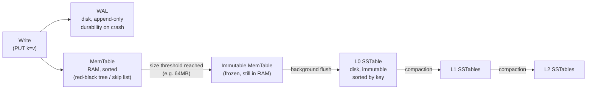
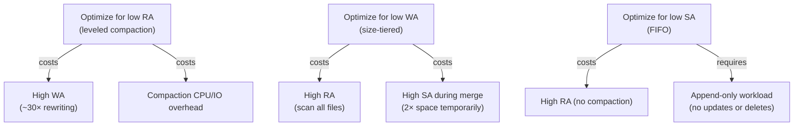

# LSM Trees

<div class="prereq-chips">
  <span class="prereq-chip">PostgreSQL Internals</span>
  <span class="prereq-chip">Database Internals</span>
</div>

Log-Structured Merge trees are the storage engine primitive behind RocksDB, Cassandra, LevelDB, and many modern write-heavy databases. They solve a fundamental problem: random writes are slow, and most workloads write far more than they read.

## Why LSM Trees Exist

A B-Tree stores data in a balanced tree where each write updates a node **in place** — on disk, that's a random I/O at the location of that node. Random I/O on spinning disks: ~200 IOPS (5ms/seek). Even SSDs suffer write amplification from in-place updates because flash must erase entire blocks before rewriting.

LSM solves this by making every write **sequential**: nothing is updated in place. Writes go to an in-memory buffer (MemTable), then get flushed to immutable disk files (SSTables) in append-only fashion. Reads become harder because data is spread across multiple files — but writes become fast.

| | B-Tree | LSM Tree |
|--|--------|----------|
| Write pattern | Random I/O (in-place update) | Sequential I/O (append) |
| Write speed | ~200–500 IOPS (disk) | ~500MB/s sequential |
| Read speed | Predictable O(log n) | Variable — may scan multiple files |
| Space usage | Compact | Temporary amplification during compaction |
| Best for | Read-heavy, mixed OLTP | Write-heavy: logs, time-series, audit trails |

## The Write Path

Every write hits two places simultaneously: the WAL (for durability) and the MemTable (for fast in-memory access).



**MemTable**: In-memory sorted data structure (RocksDB uses a skip list by default; newer versions support a hash-based or vector memtable). Supports O(log n) point reads and ordered iteration. All recent writes live here.

**WAL**: Write-ahead log. Written before the MemTable so that a crash can replay the WAL and reconstruct the MemTable. Truncated once the MemTable flushes to disk.

**Immutable MemTable**: When the active MemTable reaches its size limit (64MB in RocksDB), it's sealed (frozen), and a new empty MemTable takes over. The sealed copy is flushed to disk as an L0 SSTable by a background thread — writes continue uninterrupted during the flush.

<div class="stepper">
  <div class="stepper-panels">
    <div class="stepper-panel active">
      <strong>1. Write arrives.</strong> WAL is appended first (durability). Then the key-value pair is inserted into the active MemTable (sorted, in RAM). The write is acknowledged immediately after the WAL write — the MemTable insert is fast.
    </div>
    <div class="stepper-panel">
      <strong>2. MemTable fills up.</strong> When the MemTable reaches the size limit (configurable, typically 64MB), it's frozen. A new empty MemTable starts accepting writes. Background threads flush the frozen MemTable to disk.
    </div>
    <div class="stepper-panel">
      <strong>3. SSTable created.</strong> The frozen MemTable is sorted (it already is) and written as an immutable SSTable file in L0. The file includes a data block, sparse index, and bloom filter. The WAL segment covering this MemTable can now be deleted.
    </div>
    <div class="stepper-panel">
      <strong>4. Compaction triggered.</strong> L0 fills with SSTable files over time. When L0 has enough files (default: 4), a compaction job merges them into L1, sorting and deduplicating keys. This cascades to deeper levels as needed.
    </div>
  </div>
  <div class="stepper-controls">
    <button class="stepper-prev">← Prev</button>
    <span class="stepper-dots"></span>
    <span class="stepper-label"></span>
    <button class="stepper-next">Next →</button>
  </div>
</div>

## SSTables

A **Sorted String Table** is an immutable, sorted-by-key file written once and never modified.

**Internal layout:**

```
┌─────────────────────────────────────────┐
│  Data Block 0  (compressed key-values)  │
│  Data Block 1                           │
│  ...                                    │
│  Data Block N                           │
├─────────────────────────────────────────┤
│  Index Block   (one entry per data      │
│                 block: last key + offset)│
├─────────────────────────────────────────┤
│  Bloom Filter Block                     │
│  (probabilistic membership test)        │
├─────────────────────────────────────────┤
│  Footer        (offsets to index +      │
│                 bloom filter blocks)    │
└─────────────────────────────────────────┘
```

**Block cache**: RocksDB caches frequently accessed data blocks in an LRU block cache (default 8MB, typically tuned to 30–50% of available RAM for read-heavy workloads). The bloom filter block is also cached — bloom filter checks happen in memory, not on disk.

**Sparse index**: The index block holds one entry per data block (not one per key). To find key K, binary-search the index to find which data block might contain K, then scan that block. This keeps the index small enough to cache entirely in memory.

## Compaction Strategies

Compaction is the background process that merges multiple SSTable files, sorts keys, removes tombstones (deleted keys), and enforces level size limits. The strategy determines the tradeoff between read amplification, write amplification, and space amplification.

<div class="tab-group">
  <div class="tab-buttons">
    <button data-tab="leveled" class="active">Leveled (RocksDB)</button>
    <button data-tab="size-tiered">Size-Tiered (Cassandra)</button>
    <button data-tab="fifo">FIFO</button>
  </div>
  <div class="tab-panels">
    <div class="tab-panel active" data-tab-panel="leveled">
      <strong>Default in RocksDB and LevelDB.</strong><br><br>
      Each level has a fixed size limit (L1=10MB, L2=100MB, L3=1GB — each 10× the previous). Within each level (except L0), the key ranges of all SSTables are non-overlapping — each key belongs to exactly one SSTable at a given level.<br><br>
      <strong>Trigger:</strong> When L0 accumulates 4 SSTable files, a compaction picks one L0 file and merges it with all overlapping L1 files. This keeps L1 non-overlapping. When L1 exceeds its size limit, one L1 file is merged into L2 files it overlaps with, and so on.<br><br>
      <strong>Read path:</strong> Check MemTable → check each L0 file (may overlap) → binary search within L1 (one file max) → L2 (one file max) → ... Each level requires at most one file read (with bloom filters). Total: O(L0 files + num levels) disk reads.<br><br>
      <strong>Write amplification:</strong> ~10–30× for 7 levels. Each byte written once at L0 gets rewritten at each level during compaction.<br><br>
      <strong>Space amplification:</strong> ~1.1× — temporary during compaction but generally compact.
    </div>
    <div class="tab-panel" data-tab-panel="size-tiered">
      <strong>Default in Apache Cassandra and ScyllaDB.</strong><br><br>
      Instead of enforcing non-overlapping key ranges, size-tiered compaction groups SSTable files of similar size together. When there are N (default: 4) files in the same size tier, they're merged into one larger file, which then sits in the next size tier.<br><br>
      <strong>Trigger:</strong> File count within a size bucket reaches threshold N.<br><br>
      <strong>Read path:</strong> All SSTables at any level can overlap — a point read may need to check every SSTable from newest to oldest. Bloom filters help skip files that don't contain the key, but worst case is O(total SSTable files).<br><br>
      <strong>Write amplification:</strong> Lower than leveled — data is merged fewer times overall (only when tier is full, not continuously).<br><br>
      <strong>Space amplification:</strong> Up to 2× during a merge — the input files and the output file coexist temporarily. Can be worse if multiple tiers are compacting simultaneously.
    </div>
    <div class="tab-panel" data-tab-panel="fifo">
      <strong>Designed for time-series data with short TTL.</strong><br><br>
      No merge compaction at all. SSTables are created on flush and simply sit in a queue. When total size exceeds a configured limit, the oldest SSTable is deleted. That's the entire compaction strategy.<br><br>
      <strong>Trigger:</strong> Total size of all SSTables exceeds <code>max_table_files_size</code>.<br><br>
      <strong>Read path:</strong> Same as size-tiered — all files can overlap, reads must check bloom filters across all files.<br><br>
      <strong>Write amplification:</strong> 1× — each byte written exactly once, never rewritten by compaction.<br><br>
      <strong>When to use:</strong> Only appropriate for strictly append-only time-series workloads with TTL-based expiry and no updates to existing keys. The moment you have updates or random deletes, you need tombstone cleanup — which FIFO never does.
    </div>
  </div>
</div>

| Strategy | Read Amp | Write Amp | Space Amp | Best for |
|----------|----------|-----------|-----------|----------|
| Leveled | Low (1 file/level + L0) | High (~10–30×) | Low (~1.1×) | Mixed reads/writes, OLTP-style |
| Size-Tiered | High (all files) | Low (~3–10×) | Medium (~1.5–2×) | Write-heavy, scan-heavy |
| FIFO | High | 1× | Low | Append-only time-series with TTL |

## Bloom Filters

A bloom filter is a probabilistic data structure that answers "is key K **definitely not** in this SSTable?" in O(1) with zero disk I/O.

**How it works**: At SSTable creation time, every key is hashed through k independent hash functions, each setting a bit in a bit array. At query time, hash the lookup key the same k ways — if any bit is 0, the key is **definitely not** in this file. If all bits are 1, the key **might** be in this file (false positive).

**False positive rate**: Controlled by bits-per-key. At 10 bits/key (RocksDB default), false positive rate ≈ 1%. At 6 bits/key ≈ 5%. A false positive means an unnecessary SSTable read; it's a latency cost, not a correctness issue.

**Without bloom filters**: A point read must seek into every SSTable file from newest to oldest. For a leveled compaction tree with 7 levels and 10 L0 files, that's potentially 17 file reads for a single key. Bloom filters reduce this to 1–2 actual disk reads.

**RocksDB bloom filter placement**: Filter blocks live at the end of each SSTable and are loaded into the block cache when the file is opened. The bloom filter check is entirely in-memory for hot files.

<div class="quiz-card">
  <p class="quiz-q">A read request for key K arrives. The key exists at L3 but not in the MemTable, L0, L1, or L2. With leveled compaction and bloom filters enabled, how many SSTable files does RocksDB have to actually read from disk?</p>
  <button class="quiz-reveal">Reveal answer</button>
  <div class="quiz-a" hidden>With bloom filters, RocksDB checks bloom filters for each file at each level (mostly in-memory). For L0: bloom filter says "not here" for each L0 file (no disk read). For L1: binary search finds the one L1 SSTable that covers K's range → bloom filter confirms K might be there → one disk read → key not found. Same for L2. For L3: bloom filter confirms presence → one disk read → key found. Total disk reads: about 3–4 (one per level where the bloom filter passes). Without bloom filters, it would need to seek into every file: all L0 files + one per level = many more disk reads.</div>
</div>

## Read / Write / Space Amplification

These three metrics form a fundamental tradeoff triangle — you can optimize for at most two.

**Read amplification (RA)**: Number of disk reads per point query. If data might be in any of N SSTables, worst case RA = N. Leveled compaction minimizes RA because within each level (except L0), only one SSTable can contain a given key.

**Write amplification (WA)**: Bytes written to disk ÷ bytes of user data. A byte written to the MemTable gets flushed to L0 (WA=1), then merged into L1 (WA≈2), then L2 (WA≈3), etc. For 7 levels with 10× size ratio, WA ≈ 10 × 7 / 2 ≈ 35×. High WA shortens SSD lifespan and saturates disk bandwidth.

**Space amplification (SA)**: Disk bytes used ÷ logical data size. Size-tiered can briefly reach 2× during a merge (input + output coexist). Leveled stays near 1.1× because each level's size is bounded.



**Tuning levers in RocksDB**:
- `max_bytes_for_level_base` — L1 size cap (default 256MB)
- `level_size_multiplier` — size ratio between levels (default 10)
- `bloom_locality` — whether bloom filter blocks cluster together
- `block_cache_size` — how much RAM to give the LRU block cache

## B-Tree vs LSM: When to Choose

| Scenario | Choose |
|----------|--------|
| Write-heavy: logs, events, metrics, audit trails | **LSM** — sequential writes dominate |
| Read-heavy: OLTP with mostly SELECTs, JOINs | **B-Tree** — predictable O(log n) reads |
| Time-series with high ingest and TTL expiry | **LSM + FIFO** — near-zero write amp |
| Key-value with mixed reads and writes on SSD | **Either** — RocksDB and PostgreSQL both work |
| Frequent range scans over large key ranges | **B-Tree** — physically sorted pages; LSM scans merge from multiple SSTables |
| High concurrency point reads at low latency | **B-Tree** — one tree traversal; LSM may check bloom filters across levels |
| Frequent updates to the same key | **B-Tree** — in-place update; LSM writes a new version on each update, compaction cleans up |

The key insight: LSM wins when writes are the bottleneck and reads can tolerate some extra work. B-Tree wins when reads are latency-sensitive and writes are moderate.

## Real-World Users

**RocksDB (Facebook, 2012)** — the dominant embedded LSM engine. Used by: TiKV (TiDB's storage layer), CockroachDB (Pebble, a Go-native fork of RocksDB), MyRocks (RocksDB as a MySQL storage engine), Kafka's log segments (not RocksDB, but LSM-inspired), WiredTiger optional LSM mode.

**LevelDB (Google, 2011)** — the original open-source LSM, now largely superseded by RocksDB for production use. Still influential as the reference implementation.

**Apache Cassandra / ScyllaDB** — wide-column stores using size-tiered compaction by default (Cassandra also supports leveled and TWCS — Time Window Compaction Strategy, which is FIFO-like for time-series).

**WiredTiger (MongoDB)** — primarily B-Tree based but supports an LSM tree mode. MongoDB uses B-Tree by default; the LSM option is rarely used in production.

**Pebble (CockroachDB)** — Go rewrite of RocksDB's core, used in CockroachDB since 2021. Drops some RocksDB features for simplicity and tighter control.

<div class="quiz-card">
  <p class="quiz-q">You have a write-heavy time-series workload: sensor readings appended every 100ms, 24-hour TTL, no updates to past readings, and reads are rare dashboard queries. Which LSM compaction strategy should you use and why?</p>
  <button class="quiz-reveal">Reveal answer</button>
  <div class="quiz-a" hidden>FIFO compaction. The workload is strictly append-only (no updates, no deletes beyond TTL expiry), so there are no tombstones to clean up and no out-of-order key conflicts to resolve — the only "compaction" needed is dropping the oldest SSTable when total size exceeds the limit. FIFO compaction has write amplification of exactly 1× (each byte written once, never rewritten) and near-zero CPU overhead. Leveled or size-tiered would add compaction CPU and I/O for no benefit on this workload. The tradeoff is high read amplification for point queries — but the prompt says reads are rare, so that's acceptable.</div>
</div>
